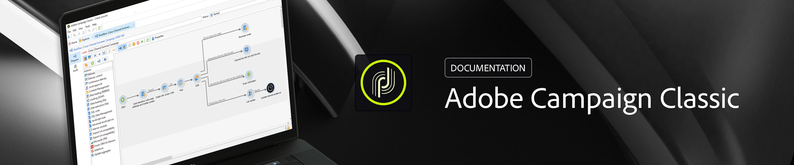

# Campaign Classic v7 – Dokumentation {#campaign-classic-documentation}

<!-- -->

## Neue Funktionen

Hier erhalten Sie einen Einblick in die neuesten Produktverbesserungen bei Adobe Campaign Classic v7 und die Dokumentation! Eine umfassende Liste der Funktionen, Verbesserungen und Fehlerbehebungen finden Sie in den detaillierten [Versionshinweisen](rn/using/latest-release.md).

>[!BEGINTABS]

>[!TAB Version Juni 2026 ist live!]

Der Campaign Classic v7.4.3 - Build Juni 2026 enthält Sicherheitsaktualisierungen zusätzlich zur vorherigen Version.

>[!TAB Verschieben zu Adobe IMS]

Um die Sicherheit und den Authentifizierungsprozess zu verbessern, empfiehlt Adobe Campaign dringend, den Authentifizierungsmodus für Endbenutzende von der nativen Authentifizierung mit Login/Passwort auf das Adobe Identity Management System (IMS) zu migrieren.

>[!TAB Push-Kanal-Änderungen]

Einige wichtige Änderungen am FCM-Dienst (Android Firebase Cloud Messaging) werden 2024 veröffentlicht und können sich auf Ihre Implementierung von Adobe Campaign auswirken. Ihre Konfiguration der Anmeldedienste für Android-Push-Nachrichten muss möglicherweise aktualisiert werden, um diese Änderung zu unterstützen. Sie können dies bereits überprüfen und Maßnahmen ergreifen.

{target="_blank"}

>[!ENDTABS]

## Beginnen Sie mit den Grundlagen

<table style="table-layout:fixed">
  <tr style="border: 0;">
    <td>
    </a>
    
<strong>Adobe Campaign starten</strong> Erfahren Sie, wie Sie die Campaign-Client-Konsole starten und eine Verbindung zu Ihren Campaign-Anwendungs-Servern herstellen.

    </td>
    <td>
    
    
<strong>Profile hinzufügen und verwalten</strong> Testen Sie bequem die Profilverwaltung in der Adobe Campaign v7-Datenbank. Fügen Sie Profile manuell oder durch Importieren hinzu, verfeinern Sie Kundendaten und passen Sie Kampagnen mühelos an.

    </td>
    <td>
    
    
<strong>Mit Workflows automatisieren</strong> Erfahren Sie, wie Sie Workflows nutzen können, um Prozesse wie Segmentierung, Kampagnenausführung, Dateiverarbeitung, Beteiligung von Personen usw. auszuführen.
    
</td>
    <td>
    
    
<strong>Sendungen erstellen</strong> Hier erfahren Sie, wie Sie Nachrichten über verschiedene Kanäle senden, z. B. E-Mail, SMS, Push-Benachrichtigungen usw.

    </td>
  </tr>
  <tr style="border: 0;">
    <td align="center"></td>
    <td align="center"></td>
    <td align="center"></td>
    <td align="center"></td>
    </tr>
</table>

## Erkunden Sie die Dokumentation

<table style="table-layout:auto">
  <tr style="border: 0;">
    <td>
      
     
      <strong>Erste Schritte</strong> <a href="platform/using/adobe-campaign-workspace.md">Benutzeroberfläche</a> – <a href="platform/using/launching-adobe-campaign.md">Herstellen einer Verbindung zu Campaign</a> – <a href="platform/using/get-started-data-import-export.md">Importieren und Exportieren von Daten</a> – <a href="platform/using/access-management.md">Berechtigungen</a>
    </td>
    <td>
      
 
<strong>Kundenerlebnis</strong> <a href="workflow/using/about-workflows.md">Mit Workflows automatisieren</a> – <a href="https://experienceleague.adobe.com/docs/campaign/automation/campaign-orchestration/set-up-campaigns.html?lang=de" target="_blank">Marketing-Kampagne</a> – <a href="interaction/using/interaction-and-offer-management.md">Interaktions- und Angebotsverwaltung</a> – <a href="delivery/using/about-personalization.md">Personalisierung</a> – <a href="reporting/using/about-adobe-campaign-reporting-tools.md">Reporting</a>
    </td>
    <td>
      
 
<strong>Nachrichten senden</strong> <a href="delivery/using/communication-channels.md">Kommunikationskanäle</a> – <a href="delivery/using/steps-about-delivery-creation-steps.md#sending-a-proof">Testsendungen durchführen</a> – <a href="delivery/using/get-started-a-b-testing.md">A/B-Tests</a> – <a href="https://experienceleague.adobe.com/de/docs/campaign/campaign-v8/analytics/tracking/tracking" target="_blank">Nachrichten-Tracking</a> – <a href="delivery/using/about-deliverability.md">Zustellbarkeit</a> – <a href="message-center/using/about-transactional-messaging.md">Transaktionsnachrichten</a>
    </td>
  </tr>
  <tr style="border: 0;">
    <td>
      
       
      <strong>Profile und Zielgruppen</strong>  <a href="platform/using/creating-and-managing-lists.md">Listen erstellen</a> – <a href="delivery/using/about-services-and-subscriptions.md">Services und Abonnements</a> – <a href="platform/using/privacy-management.md">Datenschutz und Einverständnis</a>
    </td>
    <td>
      
 
<strong>Architektur und Konfiguration</strong> <a href="production/using/general-architecture.md">Architekturgrundsätze</a> – <a href="production/using/build-upgrade.md">Build-Aktualisierung durchführen</a> – <a href="production/using/configuration.md">Kampagne konfigurieren</a> – <a href="installation/using/external-accounts.md">Verbindung zu externen Systemen herstellen</a>
    </td>
    <td>
      
       
      <strong>Entwicklungsressourcen</strong> <a href="configuration/using/about-data-model.md">Beschreibung des Datenmodells</a> – <a href="configuration/using/about-schema-reference.md">Schemastruktur</a> – <a href="configuration/using/editing-forms.md">Schemastruktur</a> – <a href="configuration/using/about-web-services.md">APIs</a> – <a href="https://experienceleague.adobe.com/developer/campaign-api/api/index.html?lang=de">JSAPI-Referenzdokumentation</a> – <a href="configuration/using/about-custom-recipient-table.md">Benutzerdefinierte Empfängertabelle</a>
    </td>
  </tr>
</table>

## Zusätzliche Ressourcen

[Liste der Fehlermeldungen](https://experienceleague.adobe.com/developer/campaign-errors/error_codes.html?lang=de) – [Adobe Campaign-Produktbeschreibung](https://helpx.adobe.com/de/legal/product-descriptions/adobe-campaign-managed-cloud-services.html){target="_blank"} – [Kompatibilitätsmatrix](rn/using/compatibility-matrix.md) – [Tutorials](https://experienceleague.adobe.com/docs/campaign-classic-learn/tutorials/overview.html?lang=de){target="_blank"} – [Control Panel für Campaign](https://experienceleague.adobe.com/docs/control-panel/using/discover-control-panel/key-features.html?lang=de){target="_blank"}
