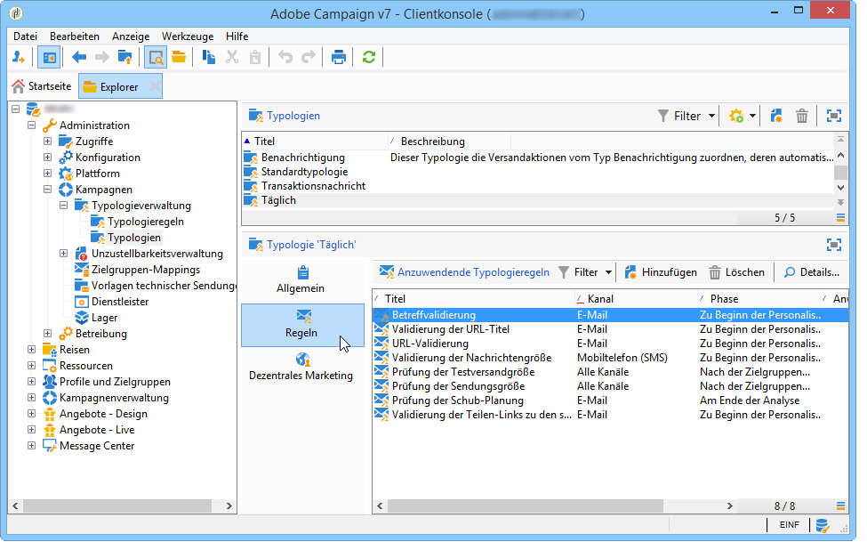

# Über Kampagnentypologien{#about-campaign-typologies}

Campaign Optimization ist das Adobe Campaign-Modul, mit dem Sie die Durchführung von Sendungen steuern, filtern und überwachen können. Um Konflikte zwischen Kampagnen zu vermeiden, kann Adobe Campaign verschiedene Kombinationen durch Anwendung spezifischer Beschränkungsregeln testen. Auf diese Weise werden ein ideal auf Kundenbedürfnisse abgestimmter Nachrichtenversand sowie eine kohärente Unternehmenskommunikation sichergestellt.

 [Entdecken Sie diese Funktion im Video](#typologies-video).

>[!NOTE]
>
>Abhängig von Ihrem Abonnement ist die Kampagnenoptimierung entweder im Lieferumfang enthalten oder als Add-on verfügbar. Überprüfen Sie diesbezüglich Ihren Lizenzvertrag.

## Typologieregeln {#typology-rules}

Mit Adobe Campaign können vier Arten von Typologieregeln erstellt und angewendet werden:

* **Filterregeln**; erlauben es, einen Teil der Zielgruppe anhand von Kriterien auszuschließen. Weiterführende Informationen hierzu finden Sie unter [Filterregeln](filtering-rules.md).
* **Druckregeln**; erlauben es, die Marketing-Müdigkeit zu kontrollieren. Weiterführende Informationen hierzu finden Sie unter [Druckregeln](pressure-rules.md).
* **Kapazitätsregeln**; erlauben es, die Auslastung zu begrenzen, um optimale Verarbeitungsbedingungen zu gewährleisten. Weitere Informationen hierzu finden Sie unter [Kontrollieren der Kapazitätsauslastung](consistency-rules.md#controlling-capacity).
* **Kontrollregeln**; erlauben es, die Gültigkeit von Nachrichten zu überprüfen, bevor sie gesendet werden. Weiterführende Informationen hierzu finden Sie unter [Kontrollregeln](control-rules.md).

Nach ihrer Erstellung werden die Typologieregeln in Kampagnentypologien gruppiert, auf die in Sendungen verwiesen wird. Siehe [Anwenden von Typologien](#applying-typologies).

## Typologien {#typologies}

Eine Kampagnentypologie kann mehrere [Typologieregeln](#typology-rules) enthalten, ein Versand kann jedoch nur eine Typologie referenzieren.

Im Tab **[!UICONTROL Regeln]** können die anzuwendenden Typologieregeln hinzugefügt, gelöscht oder eingesehen werden.

## Anwenden von Typologien {#applying-typologies}

Gehen Sie wie folgt vor, um eine Typologie zu erstellen und auf Ihre Sendungen anzuwenden:

1. Erstellen Sie Typologieregeln.

   Die Typologieregeln befinden sich im Verzeichnisknoten **[!UICONTROL Administration > Kampagnen > Typologieverwaltung > Typologieregeln]**.

   Erläuterungen zu den verschiedenen in Campaign verfügbaren Regeln finden Sie in den folgenden Abschnitten: [Werbedruck-Regeln](pressure-rules.md), [Kapazitätsregeln](consistency-rules.md#controlling-capacity), [Kontrollregeln](control-rules.md) und [Filterregeln](filtering-rules.md).

1. Erstellen Sie eine Typologie und referenzieren Sie diese mit den Regeln, die Sie erstellt haben.

   Die Typologien befinden sich im Verzeichnisknoten **[!UICONTROL Administration > Kampagnenverwaltung > Typologieverwaltung]** > **[!UICONTROL Typologien]**.

1. Konfigurieren Sie Ihren Versand so, dass er die von Ihnen erstellte Typologie verwendet. Weiterführende Informationen hierzu finden Sie in [diesem Abschnitt](applying-rules.md#applying-a-typology-to-a-delivery).
1. Testen und steuern Sie das Verhalten mithilfe von Kampagnensimulationen. Weitere Informationen zu Kampagnensimulationen finden Sie unter [diesem Abschnitt](campaign-simulations.md).

Bei der Versandvorbereitung werden Empfänger ausgeschlossen, wenn das Kriterium erfüllt ist. Sie können Protokolle überprüfen, um Ausschlüsse zu überwachen. Anwendungsbeispiele zu Drucktypologieregeln finden Sie auf [dieser Seite](pressure-rules.md#use-cases-on-pressure-rules).

## Anleitungsvideos {#typologies-video}

### Einrichten der Ermüdungsverwaltung mithilfe von Typologieregeln

In diesem Video wird erläutert, wie die Ermüdungsverwaltung in Adobe Campaign mithilfe von Typologieregeln implementiert wird.

>[!VIDEO](https://video.tv.adobe.com/v/25090?quality=12)

### Einrichten der Ermüdungsverwaltung mithilfe von vordefinierten Filtern

Die Ermüdungsverwaltung steuert die Häufigkeit und Anzahl von Nachrichten, um eine Überforderung von Empfängern zu vermeiden. Wenn Sie das Modul zur Kampagnenoptimierung nicht in Ihrer Kampagneninstanz haben, können Sie einen vordefinierten Filter konfigurieren, der die Zielgruppe nach der Anzahl der empfangenen Nachrichten filtert.
In diesem Video wird erläutert, wie Sie die Ermüdungsverwaltung in Adobe Campaign Classic mithilfe von Filtern implementieren.

>[!VIDEO](https://video.tv.adobe.com/v/25091?quality=12)

Weitere Anleitungsvideos zu Campaign finden Sie [hier](https://experienceleague.adobe.com/docs/campaign-classic-learn/tutorials/overview.html?lang=de).

**Verwandtes Thema**

* [Erste Schritte mit Typologien und Ermüdungsverwaltung](pressure-rules.md)

