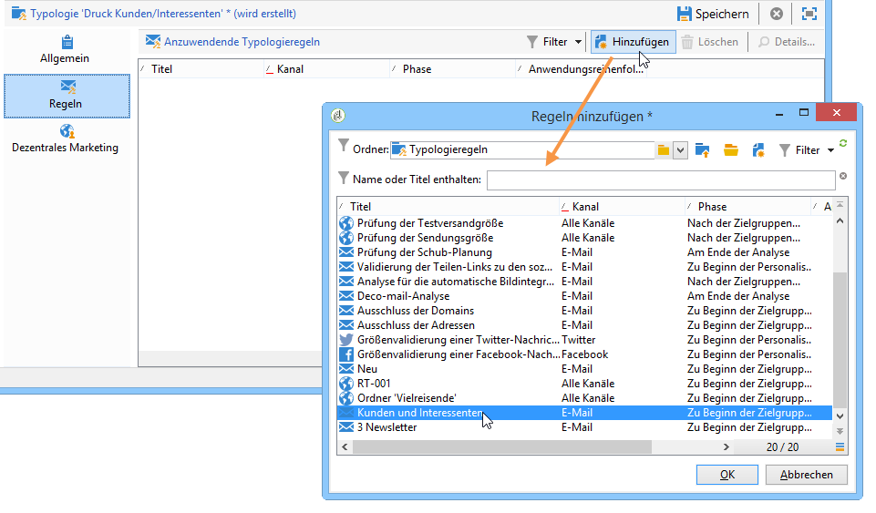
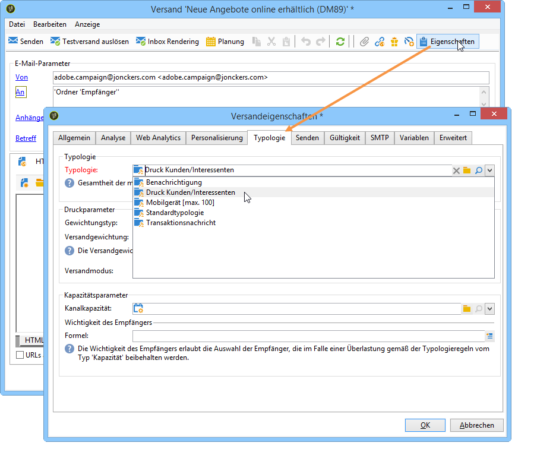
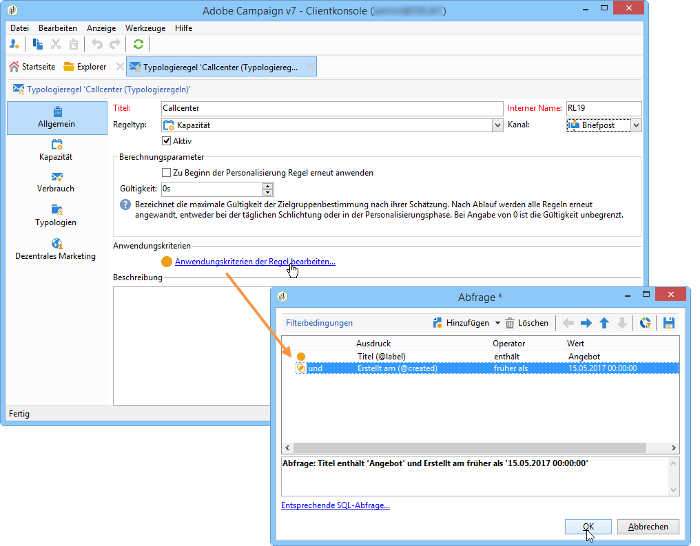
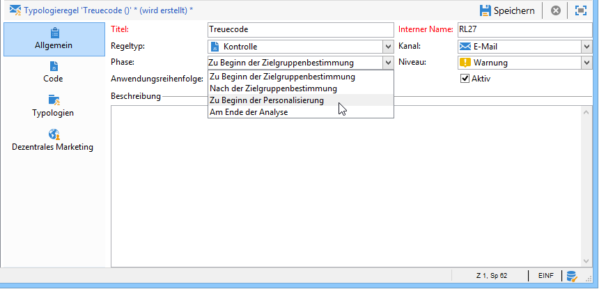
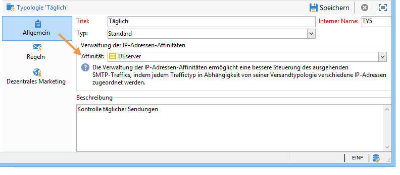
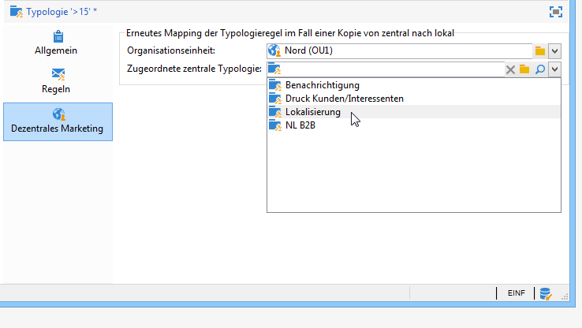

# Regeln anwenden{#applying-rules}

## Typologien auf Sendungen anwenden {#applying-a-typology-to-a-delivery}

Um die von Ihnen erstellten Typologieregeln anzuwenden, müssen Sie sie mit einer Typologie verknüpfen und diese in Ihrer Sendung referenzieren. Gehen Sie hierzu wie folgt vor:

1. Erstellen Sie eine Kampagnentypologie.

   Die Typologien befinden sich im Verzeichnisknoten **[!UICONTROL Administration > Kampagnenverwaltung > Typologieverwaltung]** > **[!UICONTROL Typologien]**.

1. Klicken Sie im Tab **[!UICONTROL Regeln]** auf die Schaltfläche **[!UICONTROL Hinzufügen]** und wählen Sie die Regeln aus, die im Rahmen dieser Typologie angewendet werden sollen.

   

1. Speichern Sie die Typologie, um sie der Liste der bereits vorhandenen Typologien hinzuzufügen.
1. Öffnen Sie die Sendung, auf die Sie die Regeln anwenden möchten.
1. Öffnen Sie die Versandeigenschaften und rufen Sie den Tab **[!UICONTROL Typologie]** auf.
1. Wählen Sie die Typologie in der Dropdown-Liste aus.

   

   >[!NOTE]
   >
   >Die Typologie kann auf Ebene der Versandvorlage festgelegt werden, um sie automatisch auf alle mit der jeweiligen Vorlage erstellten Sendungen anzuwenden.

## Anwendungskriterien bestimmen {#defining-application-conditions}

Es besteht die Möglichkeit, das Anwendungsfeld einer Regel Ihren Bedürfnissen entsprechend einzuschränken (mit Ausnahme von Kontrollregeln).

Typologieregeln können demnach so konfiguriert werden, dass sie nur bestimmte Sendungen, in denen sie referenziert sind, oder nur bestimmte Empfänger einer Sendung betreffen.

Um die Anwendungskriterien einer Regel zu bestimmen, klicken Sie auf den Link **[!UICONTROL Anwendungskriterien der Regel bearbeiten]** im Tab **[!UICONTROL Allgemein]**.

Bestimmen Sie nun im Abfrage-Editor die Filterbedingungen. Im unten stehenden Beispiel betrifft die Kapazitätsregel nur Sendungen, die den Begriff &quot;Angebot&quot; im Betreff enthalten, und solche, die vor dem 1. April 2013 erstellt wurden.

>[!NOTE]
>
>Für Filterregeln kann der Anwendungskontext der Filterkriterien ausgewählt werden: Sie können versandabhängig oder entwurfsabhängig sein. Weitere Informationen finden Sie unter [Bedingungen für Filterregeln erstellen](filtering-rules.md#conditioning-a-filtering-rule).

## Berechnungsfrequenz anpassen {#adjusting-calculation-frequency}

Schlichtungen werden jede Nacht automatisch durch den Datenbankbereinigungs-Workflow neu ausgeführt. Bereits berechnete Werte, die sich nicht täglich verändern, können jedoch beibehalten werden, um die Datenbank nicht zu überlasten.

Wenn beispielsweise ein Prozess die Marketingdatenbank wöchentlich mit Neigungsscores und Bestelldaten der Kunden anreichert, ist es nicht notwendig, auf diesen Werten basierende Daten täglich neu zu berechnen.

Geben Sie hierzu im Feld **[!UICONTROL Frequenz]** des Tabs **[!UICONTROL Allgemein]** an, wie lange die Berechnungen höchstens beibehalten werden sollen. Der Standardwert **0s** veranlasst, dass die Berechnungen bis zur nächsten Ausführung der täglichen Neuschlichtung gültig bleiben.

Um die Ergebnisse über diese Begrenzung hinaus beizubehalten, geben Sie einen Wert von über 12h im Feld **[!UICONTROL Frequenz]** an: Wenn diese Frist abgelaufen ist, werden alle Regeln erneut angewandt.

Die Option **[!UICONTROL Zur Beginn der Personalisierung Regel erneut anwenden]** ermöglicht es, die Regel systematisch bei der Personalisierungsphase anzuwenden, auch wenn die im Feld **[!UICONTROL Frequenz]** angegebene Frist nicht abgelaufen ist.

## Phase der Regelanwendung auswählen {#selecting-the-rule-application-phase}

Typologieregeln werden in einer spezifischen Reihenfolge je nach Konfiguration zum Zeitpunkt der Zielgruppenbestimmung, Analyse bzw. Personalisierung des Versands angewendet.

### Anwendungsreihenfolge {#execution-order}

Im Standard-Ausführungsmodus werden die Regeln in der folgenden Reihenfolge ausgeführt:

1. Kontrollregeln, wenn sie zu Beginn der Zielgruppenbestimmung angewendet werden
1. Filterregeln:

   * Native Anwendungsregeln für die Adressqualifizierung: definierte Adresse / nicht verifizierte Adresse / Adresse auf der Blockierungsliste / Adresse in Quarantäne / Qualität der Adresse.
   * Vom Benutzer definierte Filterregeln
   * Regeln zur Adress- oder Kennungsdeduplizierung (bei Bedarf angewandt);

1. Druckregeln;
1. Kapazitätsregeln;
1. Kontrollregeln, wenn sie am Ende der Zielgruppenbestimmung angewendet werden
1. Kontrollregeln, wenn sie sich auf den Beginn der Personalisierung beziehen. Wenn die Gültigkeitsfrist der benutzerdefinierten Regeln (Kontrolle/Druck/Kapazität) abgelaufen ist und sie daher neu zu berechnen sind, so werden sie in dieser Phase erneut angewandt.
1. Kontrollregeln, wenn sie sich auf das Ende der Personalisierung beziehen.

>[!NOTE]
>
>Wenn Sie das Modul &quot;Interaction&quot; nutzen, werden die Eignungsregeln gleichzeitig mit den Filterregeln (für Angebote in Versandentwürfen) oder während der Personalisierungsphase beim Aufruf des Angebotsmoduls angewendet.

Im Tab **[!UICONTROL Allgemein]** haben Sie die Möglichkeit im Feld **[!UICONTROL Anwendungsreihenfolge]** die Abfolge der Regeln zu bestimmen. Dies ist insbesondere interessant, wenn in der gleichen Verarbeitungsphase der Nachrichten mehrere Regeln zur Anwendung kommen.

Beispielsweise wird eine Druckregel mit einer Anwendungsreihenfolge von 20 vor einer Druckregel mit einem Wert von 30 ausgeführt.

### Kontrollregeln {#control-rules}

**[!UICONTROL Kontrollregeln]** können zu verschiedenen Zeitpunkten eines Versands zum Tragen kommen. Wählen Sie die gewünschte Option in der Dropdown-Liste des Felds **[!UICONTROL Phase]** im Tab **[!UICONTROL Allgemein]** der Typologieregel aus.

Mögliche Werte:

* **[!UICONTROL Zu Beginn der Zielgruppenbestimmung]**

   Die Kontrollregel kann in dieser Phase angewandt werden, um im Falle eines Fehlers die Personalisierungsetappe nicht auszuführen.

* **[!UICONTROL Nach der Zielgruppenbestimmung]**

   Wenn Sie die Größe der Zielgruppe kennen müssen, um die Kontrollregel anzuwenden, wählen Sie diese Phase aus.

   Die Kontrollregel **[!UICONTROL Prüfung der Testversandgröße]** beispielsweise wird zwingend nach der Zielbestimmungsphase angewandt: Diese Regel verhindert eine Nachrichtenpersonalisierung, wenn die Zielgruppe des Testversands zu groß ist.

* **[!UICONTROL Zu Beginn der Personalisierung]**

   Diese Phase wird ausgewählt, wenn die Kontrolle die Validierung der Nachrichtenpersonalisierung betrifft. Die Nachrichtenpersonalisierung wird während der Analysephase durchgeführt.

* **[!UICONTROL Am Ende der Analyse]**

   Wenn für eine Überprüfung die Nachrichtenpersonalisierung abgeschlossen sein muss, wählen Sie diese Phase aus.

## Ergänzende Konfigurationen {#additional-configurations}

### Ausgehenden SMTP-Traffic steuern {#control-outgoing-smtp-traffic}

Über das Feld **[!UICONTROL Verwaltung der IP-Adressen-Affinitäten]** besteht die Möglichkeit, Sendungen mit dem Versandserver (MTA) zu verbinden, der die betreffende Affinität verwaltet. Auf diese Weise lässt sich die Zustellung der E-Mails für eine Auswahl von Sendungen auf bestimmte Systeme oder IP-Adressen begrenzen.

>[!NOTE]
>
>Die Affinitätenverwaltung gilt nicht für **[!UICONTROL Filter]**-Typologien.\
>Affinitäten werden direkt in der Konfigurationsdatei der Instanz auf dem Adobe-Campaign-Server bestimmt. Weitere Informationen hierzu finden Sie in [diesem Abschnitt](../../installation/using/about-initial-configuration.md).

### Kampagnenoptimierung und dezentrales Marketing {#campaign-optimization-and-distributed-marketing}

Im Tab **[!UICONTROL Dezentrales Marketing]** erfolgt das erneute Mapping der Typologie, die bei der Bestellung einer partizipativen Kampagne angewendet wird. Die an dieser Stelle für eine Lokalstelle festgelegten Typologien/Regeln ersetzen die von der Zentralstelle definierten Typologien/Regeln. Das erneute Mapping ermöglicht die Anpassung der Regeln der Zentralstelle an die der Lokalstellen, die die Kampagne bestellt haben.

>[!NOTE]
>
>Im Zusammenhang mit den Typologien und Typologieregeln wird der Tab **[!UICONTROL Dezentrales Marketing]** angeboten, sofern Ihre Lizenz die Option Distributed Marketing beinhaltet. Überprüfen Sie Ihren Lizenzvertrag.\
>Weitere Informationen zu dezentralem Marketing finden Sie im Abschnitt [Über dezentrales Marketing](../../distributed/using/about-distributed-marketing.md).
