# Campaign-Simulationen{#campaign-simulations}

## Über Simulationen {#about-simulations}

Mit der Kampagnenoptimierung können Sie die Effizienz eines Kampagnenplans mithilfe von Simulationen testen. Dies ermöglicht Ihnen das Messen des potenziellen Erfolgs einer Kampagne: generierter Umsatz, Zielvolumen basierend auf den angewendeten Typologieregeln usw.

Mithilfe der Simulation können die voraussichtlichen Auswirkungen von Sendungen miteinander verglichen werden.

>[!NOTE]
>
>Die im Testmodus vorbereiteten Sendungen wirken sich nicht gegenseitig aufeinander aus, beispielsweise in der Auswertung einer dezentralen Marketing-Kampagne oder solange der Eintrag der Sendungen in den Planungskalender noch nicht validiert wurde.\
>Das bedeutet, dass die Druck- und Kapazitätsregeln nur auf Sendungen im Modus **[!UICONTROL Zielgruppenschätzung und Nachrichtenpersonalisierung]** angewendet werden. Sendungen im Modus **[!UICONTROL Schätzung und Validierung der geplanten Zielgruppe]** und **[!UICONTROL Zielgruppenauswertung]** werden nicht berücksichtigt.\
>Der Versandmodus wird in den Eigenschaften des jeweiligen Versands im Tab **[!UICONTROL Typologie]** ausgewählt.

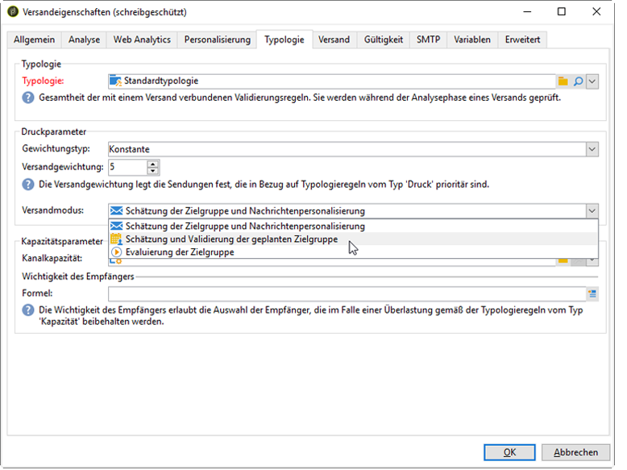

## Einrichten einer Simulation {#setting-up-a-simulation}

### Erstellen einer Simulation {#creating-a-simulation}

Folgen Sie den nachstehenden Schritten, um eine Simulation zu erstellen:

1. Öffnen Sie den Tab **[!UICONTROL Kampagnen]**, klicken Sie im Abschnitt **[!UICONTROL Erstellen]** auf den Link **[!UICONTROL Andere Optionen]** und wählen Sie **[!UICONTROL Simulation]** aus.

   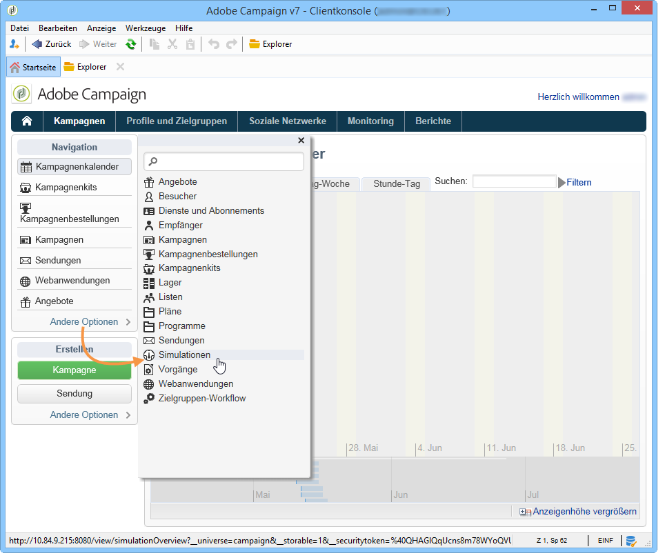

1. Wählen Sie eine Simulationsvorlage aus und geben Sie einen Titel an. Klicken Sie auf die Schaltfläche **[!UICONTROL Speichern]**, um die Simulation zu erstellen.

   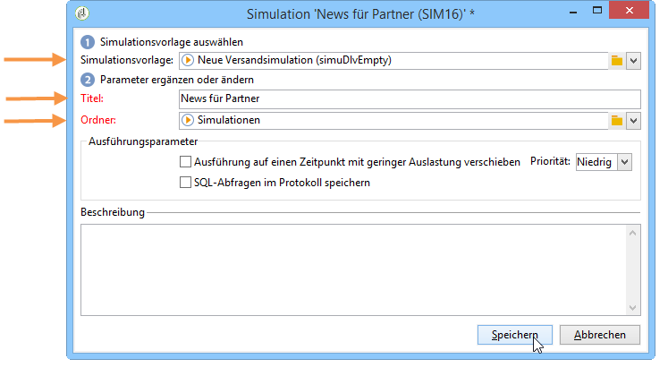

1. Klicken Sie auf den Tab **[!UICONTROL Bearbeiten]**, um sie zu konfigurieren.

   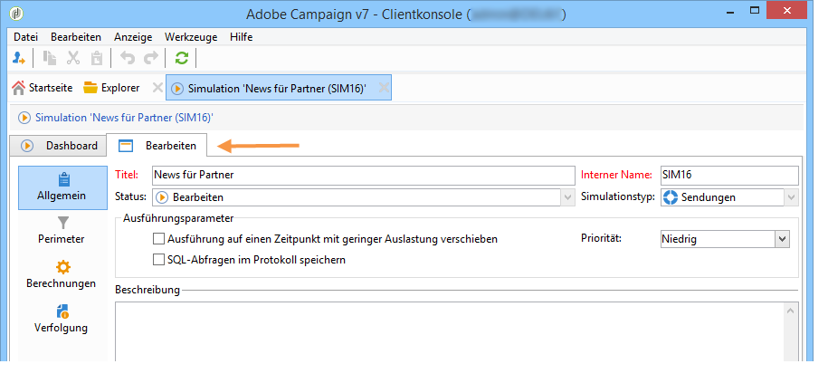

1. Geben Sie im Tab **[!UICONTROL Perimeter]** die für diese Simulation zu berücksichtigenden Sendungen an. Klicken Sie hierfür auf die Schaltfläche **[!UICONTROL Hinzufügen]** und wählen Sie den gewünschten Modus aus.

   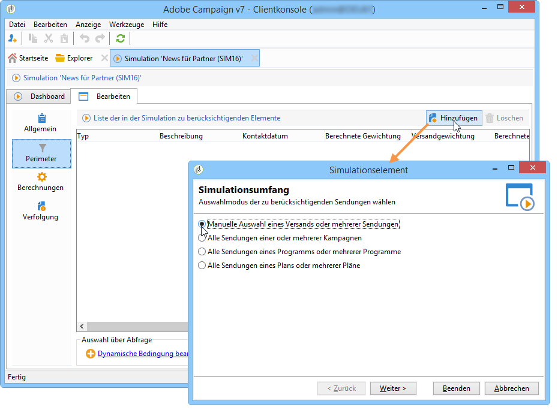

   Sie können entweder jeden Versand einzeln oder alle zu einer bestimmten Kampagne, einem Programm oder einem Plan gehörenden Sendungen auswählen.

   >[!NOTE]
   >
   >Wenn Sie die Sendungen eines Plans, eines Programms oder einer Kampagne auswählen, kann Adobe Campaign automatisch die Liste der zu berücksichtigenden Sendungen bei jedem Simulationsstart aktualisieren. Kreuzen Sie dafür die Option **[!UICONTROL Versandauswahl bei jedem Simulationsstart aktualisieren]** an.
   >  
   >Andernfalls werden nur die zum Zeitpunkt der Simulationserstellung im Plan, Programm oder in der Kampagne vorhandenen Sendungen berücksichtigt: Später hinzugefügte Sendungen werden nicht beachtet.

   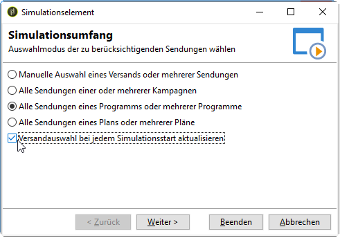

1. Wählen Sie die im Simulationsumfang einzuschließenden Elemente aus. Bei Bedarf können Sie mithilfe der Umschalt- und Strg-Taste mehrere Elemente auswählen.

   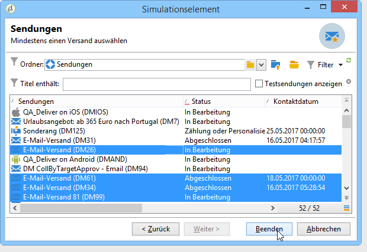

   Klicken Sie auf die Schaltfläche **[!UICONTROL Beenden]**, um die Auswahl zu bestätigen.

   Es besteht die Möglichkeit, manuell ausgewählte Sendungen mit solchen aus verschiedenen Plänen, Programmen oder Kampagnen zu kombinieren.

   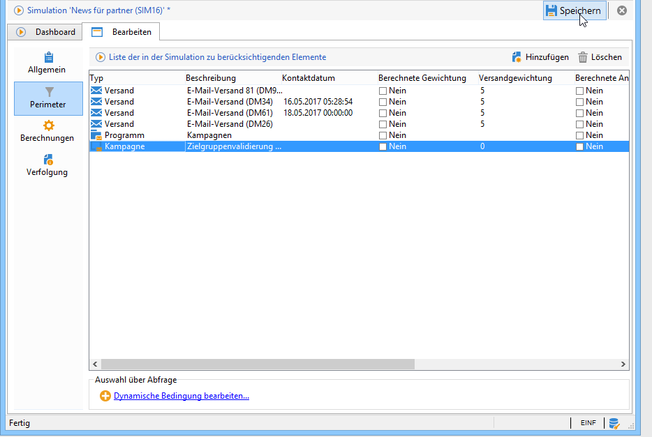

   Über den Link **[!UICONTROL Dynamische Bedingung bearbeiten…]** können Sie eine dynamische Bedingung verwenden.

   Klicken Sie zur Bestätigung der Konfiguration auf die Schaltfläche **[!UICONTROL Speichern]**.

   >[!NOTE]
   >
   >In den Simulationsberechnungen werden nur die Sendungen berücksichtigt, deren Zielgruppe bereits berechnet wurde (Status **Zielbestimmung abgeschlossen** oder **Versandbereit**).

1. Wählen Sie im **[!UICONTROL Berechnungen]**-Tab eine Analysedimension, beispielsweise das Empfängerschema aus.

   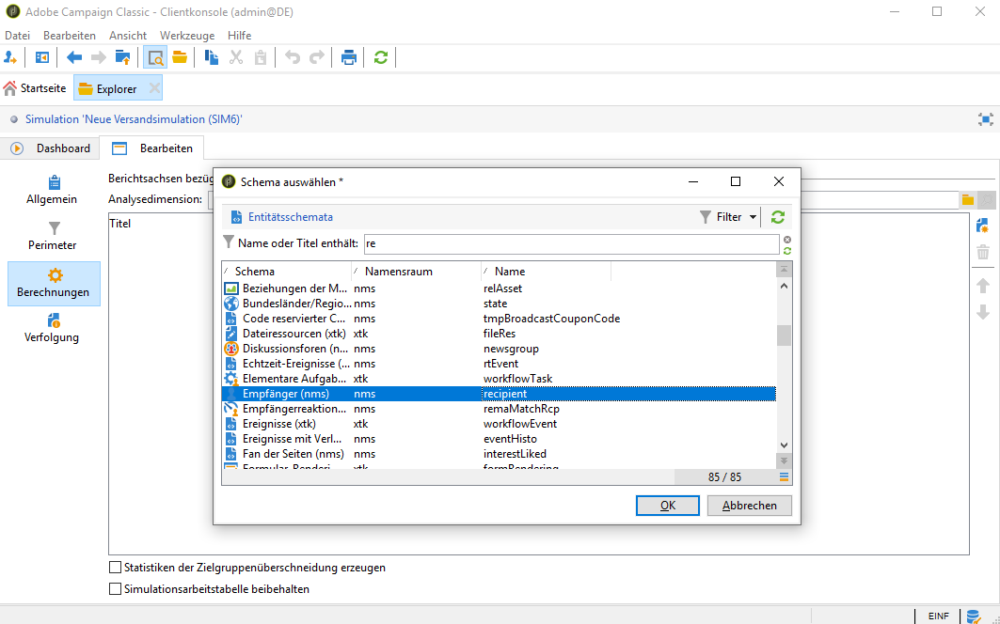

1. Im Anschluss können Sie Ausdrücke hinzufügen.

   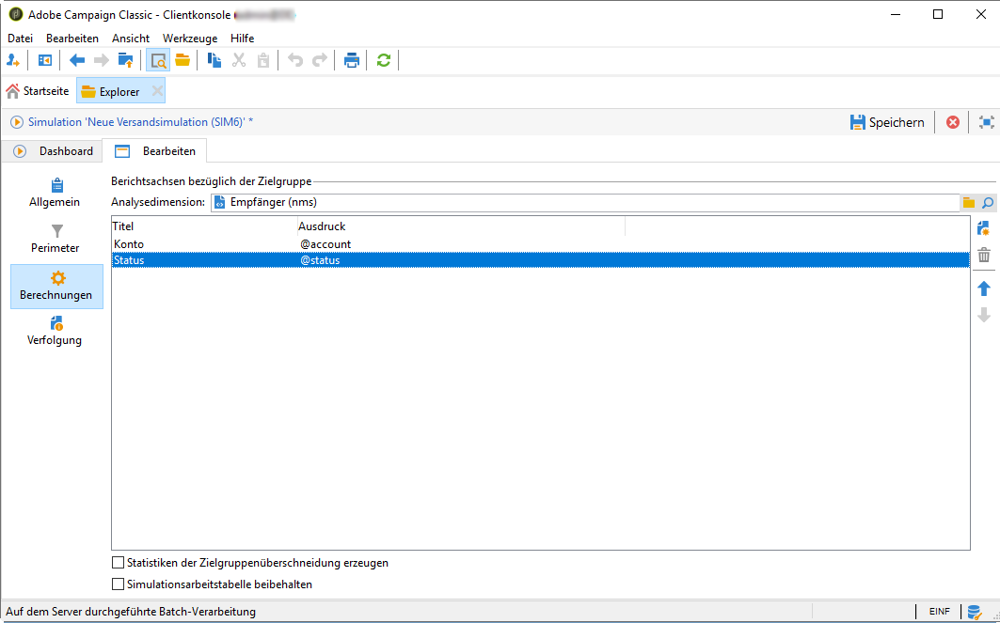

### Ausführungsparameter {#execution-settings}

Im Tab **[!UICONTROL Allgemein]** der Simulation können Sie ihre Ausführungsparameter eingeben:

* Mit der Option **[!UICONTROL Ausführung auf einen Zeitpunkt mit geringer Auslastung verschieben]** wird der Simulationsstart auf einen weniger ausgelasteten Zeitraum verschoben, und zwar entsprechend der gewählten Prioritätsstufe. Simulationen verwenden erhebliche Datenbankressourcen. Daher sollten nicht dringende Simulationen beispielsweise für die Ausführung in der Nacht geplant werden.
* Die **[!UICONTROL Priorität]** entspricht der Dringlichkeit, die der Simulation zugeteilt wird, um sie schnellstmöglich durchzuführen oder ihren Start zu verzögern.
* **[!UICONTROL Speichern Sie SQL-Abfragen im Protokoll]**. Mit SQL-Protokollen können Sie eine Diagnose für eine mit Fehlern beendete Simulation durchführen. Sie können außerdem Auskunft darüber geben, wieso eine Simulation zu langsam ist. Die entsprechenden Logs sind nach der Simulation auf der Unterregisterkarte **[!UICONTROL SQL-Logs]** der Registerkarte **[!UICONTROL Verfolgung]** verfügbar.

## Ausführen einer Simulation {#executing-a-simulation}

### Starten einer Simulation {#starting-a-simulation}

Sobald der Perimeter der Simulation definiert wurde, kann sie ausgeführt werden.

Öffnen Sie das Simulations-Dashboard und klicken Sie auf die Schaltfläche **[!UICONTROL Simulation starten]**.

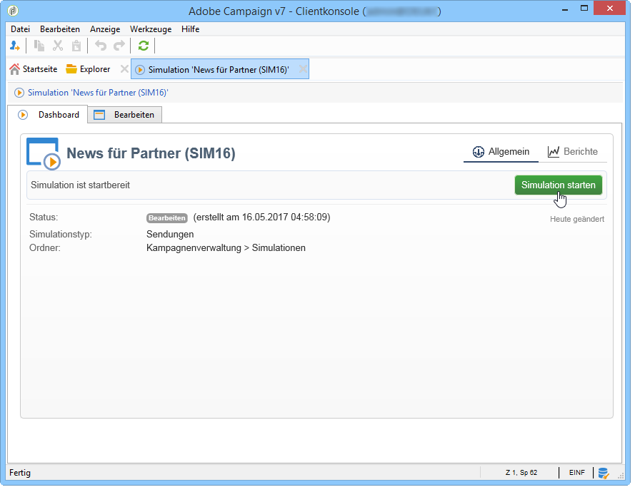

Öffnen Sie nach der Ausführung die Simulation und klicken Sie auf den Tab **[!UICONTROL Ergebnisse]**, um die für die Sendungen berechneten Zielgruppen anzuzeigen.

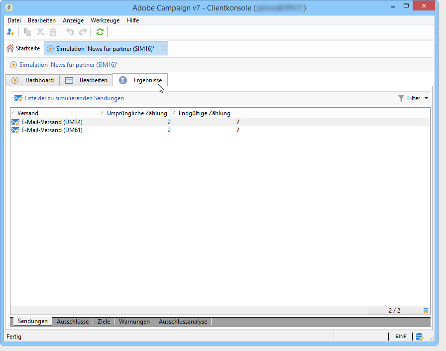

1. In der Unterregisterkarte **[!UICONTROL Sendungen]** werden alle von der Simulation berücksichtigten Sendungen aufgelistet. Es werden zwei Auflistungen angezeigt:

   * Die **[!UICONTROL Ursprüngliche Zählung]** entspricht der Schätzung der Zielgruppe auf Ebene des Versands;
   * Die **[!UICONTROL Endgültige Zählung]** zeigt die Anzahl der nach Ausführung der Simulation verbleibenden Empfänger an.

     Der Unterschied zwischen ursprünglicher und endgültiger Zählung spiegelt die vor der Simulation konfigurierten unterschiedlichen Regeln oder Filter wider.

     Gehen Sie in den Untertab **[!UICONTROL Ausschlüsse]**, um die Details der Berechnung anzusehen.

1. Die **[!UICONTROL Ausschlüsse]** werden nach Sendungen aufgestaffelt dargestellt.

   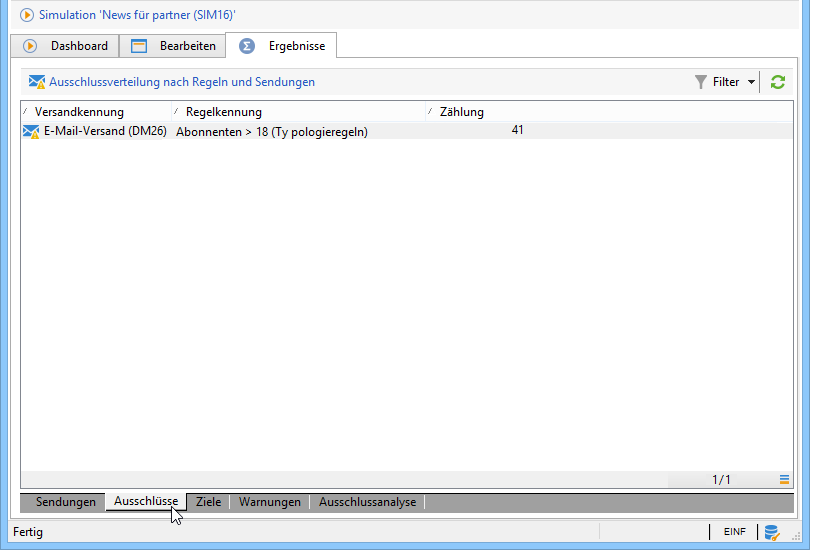

1. Die Unterregisterkarte **[!UICONTROL Warnungen]** enthält alle Warnhinweise, die während der Simulation generiert wurden. Warnhinweise können bei Überschreitung der Kapazität gesendet werden (wenn beispielsweise die Zielgruppe mehr Empfangende enthält, als die festgelegte Kapazität zulässt).
1. In der Unterregisterkarte **[!UICONTROL Ausschlussanalyse]** können Sie eine Tabelle zur Analyse der Ergebnisse erstellen. Benutzende müssen Variablen auf der x-/y-Achse angeben.

   Ein Beispiel zur Erstellung einer Analysetabelle findet sich im Anschluss an den Abschnitt [Ergebnisse analysieren](#exploring-results).

### Anzeigen von Ergebnissen {#viewing-results}

#### Verfolgung {#audit}

Die Registerkarte **[!UICONTROL Audit]** ermöglicht die Überwachung der Simulation. Die Unterregisterkarte **[!UICONTROL SQL-Logs]** ist insbesondere für erfahrene Benutzer hilfreich. Es werden Ausführungslogs im SQL-Format aufgelistet. Damit die SQL-Logs angezeigt werden, muss vor Ausführung der Simulation auf der Registerkarte **[!UICONTROL Allgemein]** die Option **[!UICONTROL SQL-Abfragen im Protokoll speichern]** aktiviert werden.

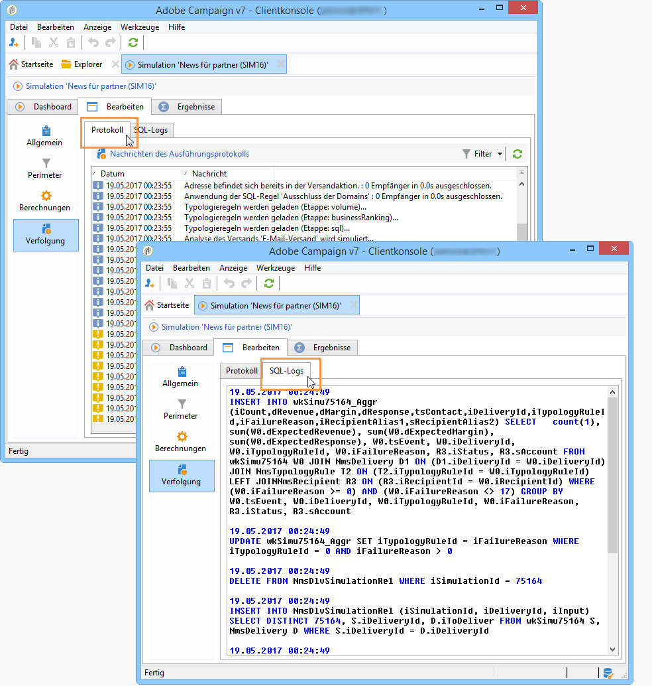

#### Analysieren von Ergebnissen {#exploring-results}

Die Unter-Registerkarte **[!UICONTROL Ausschlussanalyse]** ermöglicht die Analyse der aus der Simulation resultierenden Daten.

Weitere Informationen zur deskriptiven Analyse finden Sie in [diesem Abschnitt](../../reporting/using/about-adobe-campaign-reporting-tools.md).

## Ergebnisse einer Simulation {#results-of-a-simulation}

Die in den Tabs **[!UICONTROL Log]** und **[!UICONTROL Ergebnisse]** dargestellten Indikatoren geben einen ersten Einblick in das Ergebnis der Simulation. Im Tab **[!UICONTROL Berichte]** können Sie eine präzise Analyse der Informationen vornehmen.

### Berichte {#reports}

Um das Ergebnis einer Simulation zu analysieren, nutzen Sie die mit ihr verbundenen Berichte: Sie stellen die Simulationsausschlüsse und ihre Gründe dar.

Standardmäßig werden folgende Berichte angeboten:

* **[!UICONTROL Detail der Simulationsausschlüsse]**: Dieser Bericht bietet eine detaillierte Tabelle aller Ausschlussgründe für alle von dieser Simulation betroffenen Sendungen.
* **[!UICONTROL Simulationszusammenfassung]**: Dieser Bericht zeigt den Umfang der von der Simulation ausgeschlossenen Zielpopulationen gestaffelt nach Sendungen an.
* **[!UICONTROL Zusammenfassung der simulationsbedingten Ausschlüsse]**: Dieser Bericht zeigt eine Tabelle der Ausschlüsse durch die Simlation an. Des weiteren werden die Typologieregeln aufgeführt, die zum Ausschluss geführt haben sowie ihr jeweiliger Anteil an den regelbedingten Ausschlüssen.

>[!NOTE]
>
>Sie können neue Berichte erstellen und diese den angebotenen Berichten hinzufügen. Weiterführende Informationen hierzu finden Sie in [diesem Abschnitt](../../reporting/using/about-adobe-campaign-reporting-tools.md).

Um Berichte zu öffnen, klicken Sie auf den für die jeweilige Simulation im Dashboard verfügbaren **[!UICONTROL Berichte]**-Link.

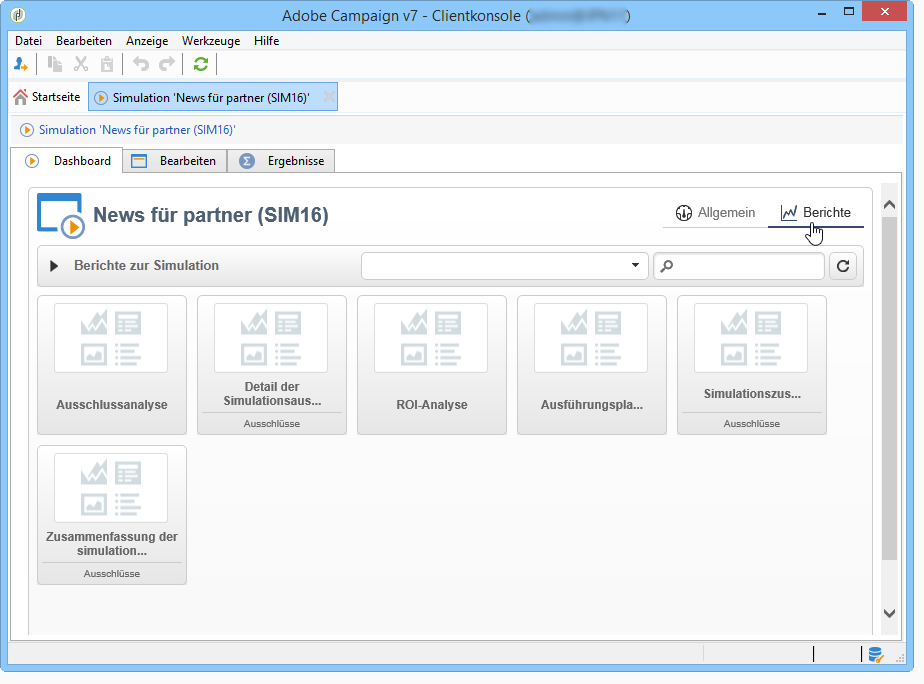

Klicken Sie auf den Link **[!UICONTROL Berichte]** auf dem Dashboard der entsprechenden Simulation, um auf die Berichte zuzugreifen.

### Vergleich von Simulationen {#comparing-simulations-}

Bei wiederholter Ausführung einer Simulation wird das vorherige Ergebnis durch das neu berechnete Ergebnis ersetzt; die Ergebnisse unterschiedlicher Ausführungen können daher nicht angezeigt und miteinander verglichen werden.

Zum Vergleichen der Ergebnisse müssen Sie Berichte verwenden. Mit Adobe Campaign können Sie einen Berichtsverlauf speichern, um ihn später erneut anzuzeigen. Dieser Verlauf wird für den gesamten Lebenszyklus der Simulation gespeichert.

**Beispiel:**

1. Erstellen Sie eine Simulation für einen Versand, der die Typologie **A** anwendet.
1. Öffnen Sie im Tab **[!UICONTROL Berichte]** einen der verfügbaren Berichte, zum Beispiel **[!UICONTROL Detail der simulationsbedingten Ausschlüsse]**.
1. Klicken Sie oben rechts auf das Symbol zur Erstellung eines neuen Verlaufs.

   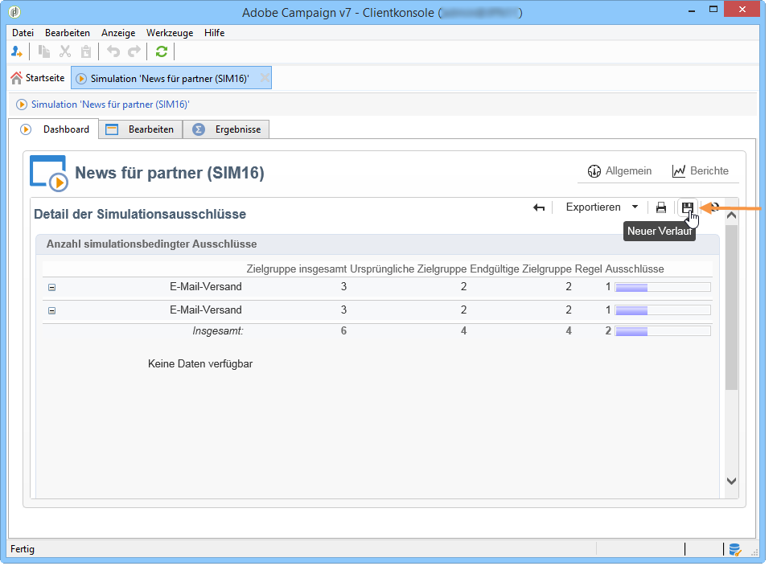

1. Schließen Sie diese Simulation und ändern Sie die Konfiguration der Typologie **A**.
1. Führen Sie die Simulation erneut aus und vergleichen Sie das Ergebnis mit dem in dem Bericht angezeigten Ergebnis, in dem zuvor ein Verlauf erstellt wurde.

   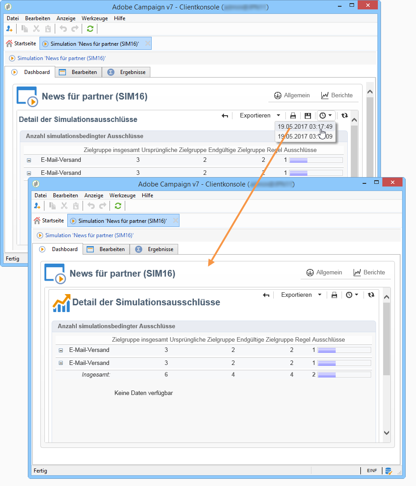

   Es können beliebig viele Berichtsverläufe gespeichert werden.

### Berichtsachsen {#reporting-axes}

Auf der Registerkarte **[!UICONTROL Berechnungen]** können Sie Berichtsachsen bezüglich der Zielgruppe definieren. Diese Achsen werden bei der Ergebnisanalyse verwendet (siehe [Ergebnisse analysieren](#exploring-results)).

>[!NOTE]
>
>Es ist empfehlenswert, die Berichtsachsen in einer Simulationsvorlage zu bestimmen und nicht in jeder einzelnen Simulation.\
>Die Simulationsvorlagen werden im Knoten **[!UICONTROL Ressourcen > Vorlagen > Simulationsvorlagen]** des Adobe Campaign-Navigationsbaums gespeichert.

**Beispiel:**

Es soll eine zusätzliche Berichtsachse über den Empfängerstatus (&quot;Kunde&quot;, &quot;Interessent&quot; oder kein Status) erstellt werden.

1. Um eine Berichtsachse zu definieren, wählen Sie die Tabelle mit den zu verarbeitenden Informationen im Feld **[!UICONTROL Analysedimension]** aus. Diese Informationen sind obligatorisch.
1. An dieser Stelle wird das entsprechende Feld der Empfängertabelle ausgewählt.

   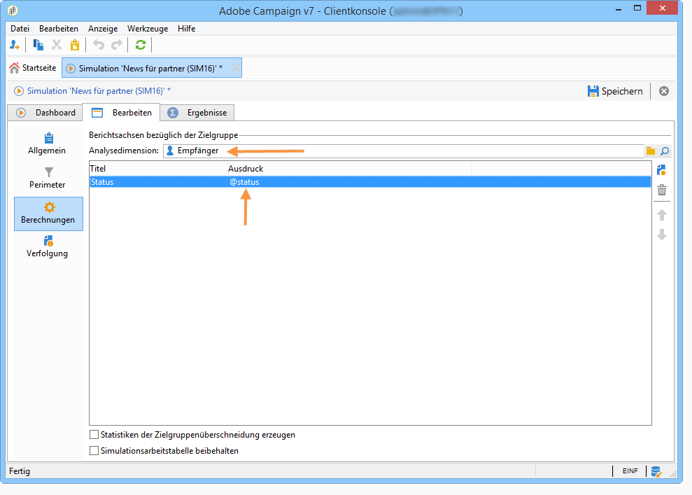

1. Folgende Optionen stehen zur Verfügung:

   * **[!UICONTROL Statistiken der Zielgruppenüberschneidung erzeugen]** gibt alle Überschneidungsstatistiken im Simulationsbericht aus. Überschneidungen sind Empfangende, die innerhalb einer Simulation in mindestens zwei Sendungen angesprochen werden.

     >[!IMPORTANT]
     >
     >Die Auswahl dieser Option verlängert die Ausführungsdauer der Simulation beträchtlich.

   * **[!UICONTROL Simulationsarbeitstabelle beibehalten]**, um Spuren der Simulation zu speichern.

     >[!IMPORTANT]
     >
     >Die systematische Speicherung dieser Tabellen erfordert eine erhöhte Speicherkapazität: Stellen Sie sicher, dass Ihre Datenbank über entsprechenden Speicherplatz verfügt.

Bei der Anzeige der Simulationsergebnisse werden Informationen bezüglich des ausgewählten Ausdrucks im Untertab **[!UICONTROL Überschneidungen]** angezeigt.

Die Überschneidungen geben die Empfänger an, die in mindestens zwei verschiedenen Sendungen einer Simulation den Zielgruppen angehören.

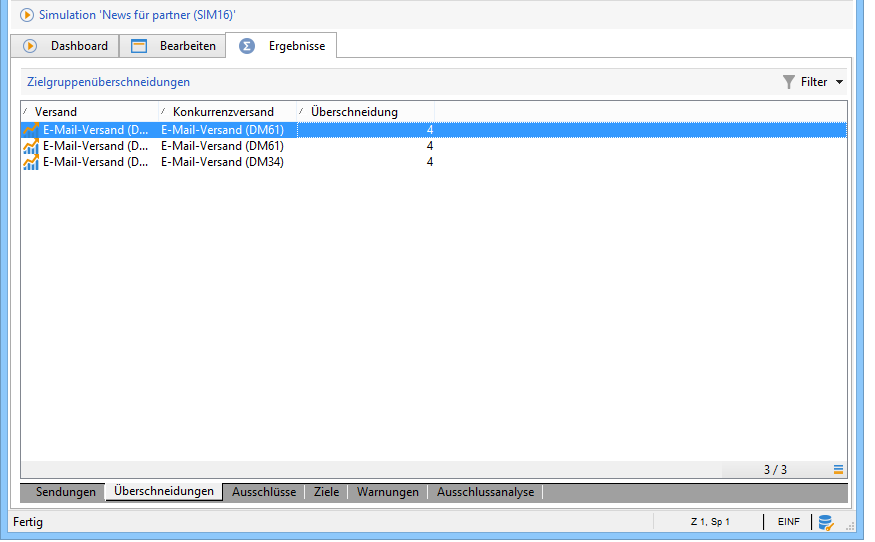

>[!NOTE]
>
>Dieser Untertab wird nur angezeigt, wenn die Option **[!UICONTROL Statistiken der Zielgruppenüberschneidung erzeugen]** aktiviert wurde.

Informationen bezüglich der Berichtsachsen können in den Berichten der Ausschlussanalyse genutzt werden, die im Unter-Tab **[!UICONTROL Ausschlussanalyse]** erstellt werden. Weitere Informationen hierzu finden Sie im Abschnitt [Ergebnisse analysieren](#exploring-results).
