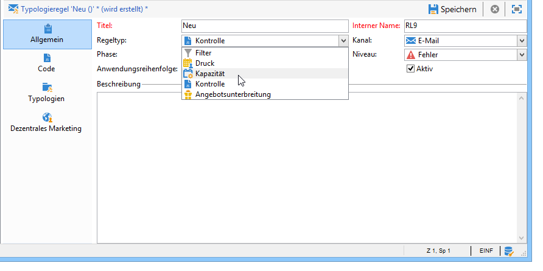
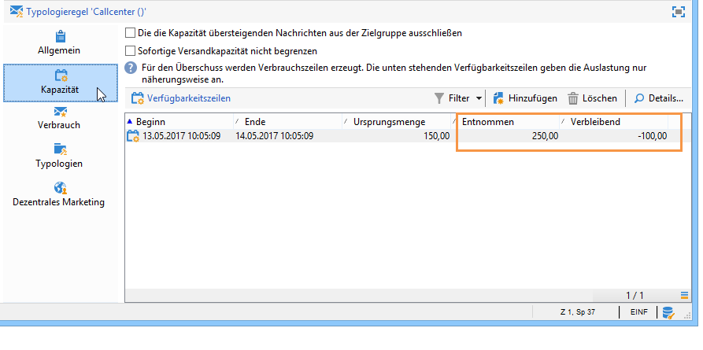
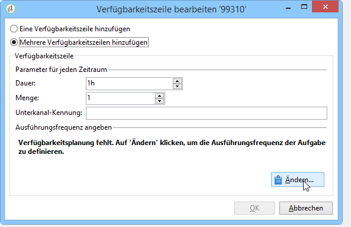
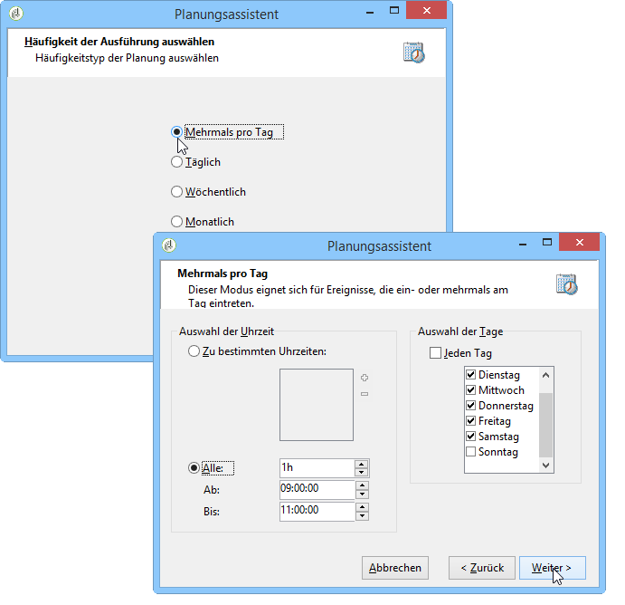
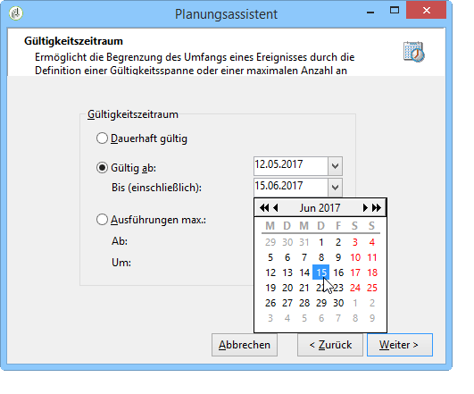
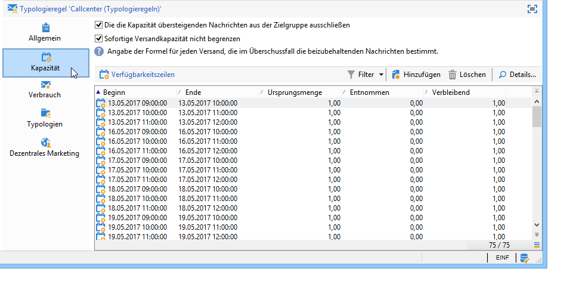
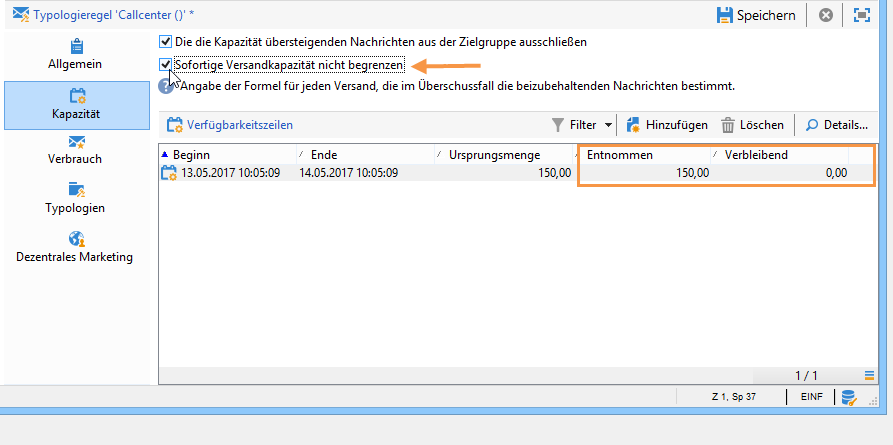

# Kohärenzregeln{#consistency-rules}

## Über Kohärenzregeln {#about-consistency-rules}

Adobe Campaign ermöglicht die Sicherstellung der Kohärenz Ihrer Marketingkommunikation mithilfe einer Reihe von in den Kampagnentypologien enthaltenen Regeln. Diese dienen dazu, die an die Empfänger übermittelten Sendungen in Bezug auf ihr Volumen, ihre Art, ihre Relevanz etc. zu kontrollieren.

Mithilfe von **Kapazitätsregeln** kann etwa verhindert werden, dass die Plattform, die den Versand verarbeitet, überlastet wird. Zum Beispiel dürfen Sonderangebote mit einem Download-Link nicht an eine zu große Population gesendet werden, um den Server nicht zu überladen; eine Telefonkampagne darf die Verarbeitungskapazität der Telefonzentrale nicht überschreiten usw. Weitere Informationen hierzu finden Sie unter [Kontrollieren der Kapazität](#controlling-capacity).

## Kontrollieren der Kapazität {#controlling-capacity}

Stellen Sie vor dem Versand von Nachrichten sicher, dass Ihre physische Infrastruktur über ausreichende Kapazitäten verfügt, um sowohl ausgehende als auch eingehende Nachrichten (z. B. Antworten, Bounces, Anrufe im Callcenter etc.) verarbeiten zu können.

Erstellen Sie hierfür Typologieregeln vom Typ **[!UICONTROL Kapazität]**.

Im folgenden Beispiel wird eine Typologieregel für eine telefonische Treuekampagne erstellt. Die Regel soll die Anzahl der Nachrichten auf 20 pro Tag begrenzen, entsprechend der Verarbeitungskapazität eines Callcenters. Nachdem die Regel auf zwei Sendungen angewendet wurde, kann die Auslastung über die Logs abgelesen werden.

Gehen Sie wie folgt vor, um eine neue Kapazitätsregel zu erstellen:

1. Klicken Sie im Verzeichnisknoten **[!UICONTROL Administration > Kampagnenverwaltung > Typologieverwaltung > Typologieregeln]** auf **[!UICONTROL Neu]**.
1. Wählen Sie eine Regel vom Typ **[!UICONTROL Kapazität]** aus.

   

1. Erstellen Sie im Tab **[!UICONTROL Kapazität]** die Verfügbarkeitszeilen. In unserem Beispiel wären dies Zeiträume, in denen Anrufe getätigt werden können. Wählen Sie einen Zeitraum von 24 Stunden aus und geben Sie als Ursprungsmenge 150 ein, was bedeutet, dass das Callcenter 150 Anrufe pro Tag verarbeiten kann.

   

   >[!NOTE]
   >
   >Die Verfügbarkeitszeilen dienen nur zu Informationszwecken. Wenn Sie Nachrichten bei Erreichen der Kapazitätsbegrenzung ausschließen müssen, lesen Sie den Abschnitt [diesem Abschnitt](#exclude-messages-when-capacity-limit-reached).

1. Weisen Sie diese Regel einer Typologie zu und referenzieren Sie die Typologie in Ihrem Versand, um diese Kapazitätsregel anzuwenden. Weiterführende Informationen hierzu finden Sie in [diesem Abschnitt](applying-rules.md#applying-a-typology-to-a-delivery).
1. Über die Tabs **[!UICONTROL Entnahmen]** und **[!UICONTROL Kapazität]** für diese Regel können Sie die Auslastung der Kapazitäten überwachen.

   Wenn eine Regel in einem Versand verwendet wird, zeigen die Spalten **[!UICONTROL Entnommen]** und **[!UICONTROL Verbleibend]** die verbrauchte Menge an, wie im unten stehenden Beispiel:

   

   Weiterführende Informationen hierzu finden Sie in [diesem Abschnitt](#monitoring-consumption).

## Festlegen der maximalen Auslastung {#defining-the-maximum-load}

Um die maximale Auslastung zu definieren, müssen Sie Verfügbarkeitszeilen festlegen. Dazu stehen zwei Optionen zur Verfügung: Sie können manuell eine oder mehrere Verfügbarkeitszeilen erstellen (siehe [Verfügbarkeitszeilen einzeln hinzufügen](#adding-availability-lines-one-by-one)) oder Verfügbarkeitsbereiche erstellen. Die Häufigkeit dieser Zeiträume kann automatisiert werden (siehe [Mehrere Verfügbarkeitszeilen hinzufügen](#add-a-set-of-availability-lines)).

### Verfügbarkeitszeilen einzeln hinzufügen {#adding-availability-lines-one-by-one}

Um eine einzelne Verfügbarkeitszeile zu erstellen, klicken Sie auf die Schaltfläche **[!UICONTROL Hinzufügen]** und wählen Sie die Option **[!UICONTROL Eine Verfügbarkeitszeile hinzufügen]** aus. Geben Sie den Verfügbarkeitszeitraum und die verfügbare Menge an.

Sie können die Ihrer Verarbeitungskapazität entsprechende Anzahl an Zeilen hinzufügen.

### Mehrere Verfügbarkeitszeilen hinzufügen {#add-a-set-of-availability-lines}

Um Verfügbarkeitszeiträume in einem gegebenen Zeitraum festzulegen, klicken Sie auf die Schaltfläche **[!UICONTROL Hinzufügen]** und wählen Sie die Option **[!UICONTROL Mehrere Verfügbarkeitszeilen hinzufügen]**. Geben Sie die Dauer jedes Zeitraums und die Anzahl der zu erstellenden Zeiträume an.

Um die Zeitraumerstellung zu automatisieren, klicken Sie auf die Schaltfläche **[!UICONTROL Ändern]** und legen Sie die Planung der Zeiträume fest.

Zur Erstellung von Verfügbarkeitszeiträumen an Werktagen zwischen 9 und 17 Uhr mit einer Kapazität von 10 Anrufen pro Stunde, folgen Sie den nachstehenden Schritten:

1. Wählen Sie den Häufigkeitstyp und die Gültigkeitszeiträume aus:

   

1. Geben Sie die Gültigkeitsdaten an:

   

1. Überprüfen Sie die Konfiguration, bevor Sie sie beenden:

   

Der Workflow **[!UICONTROL Planungen]** erstellt automatisch alle entsprechenden Zeilen.

>[!NOTE]
>
>Es wird empfohlen, Verfügbarkeitszeilen über einen Dateiimport zu erstellen. Im Kapazität-Tab können die Verfügbarkeitszeilen anschließend eingesehen und überprüft werden.

## Nachrichten bei Erreichen des Kapazitätslimits ausschließen {#exclude-messages-when-capacity-limit-reached}

Verfügbarkeitszeilen dienen nur zu Informationszwecken. Um überschüssige Nachrichten auszuschließen, aktivieren Sie die Option **[!UICONTROL Von der Zielgruppe ausschließen, wenn die Kapazität überschritten wird]** -Option. Dadurch wird verhindert, dass die Kapazität überschritten wird. Für dieselbe Population wie im vorherigen Beispiel dürfen Verbrauch und verbleibende Kapazität die ursprüngliche Menge nicht übersteigen:

Die maximale Anzahl von Nachrichten, die verarbeitet werden können, ist gleichmäßig über den definierten Verfügbarkeitsbereich verteilt. Dies ist besonders für Callcenter von Bedeutung, da die Anzahl der Anrufe pro Tag begrenzt ist. Im Fall von E-Mail-Sendungen können Sie mit der Option **[!UICONTROL Sofortige Versandkapazität nicht begrenzen]** diesen Verfügbarkeitsbereich ignorieren und gleichzeitig Ihre E-Mails senden.

>[!NOTE]
>
>Bei Überlastung werden die beizubehaltenden Nachrichten nach einer in den Versandeigenschaften bestimmten Formel ausgewählt.

## Überwachen des Verbrauchs {#monitoring-consumption}

Kapazitätsregeln dienen standardmäßig nur Informationszwecken. Wählen Sie die **[!UICONTROL Ausschließen von Nachrichten, die die Kapazität übersteigen, aus der Zielgruppe]** -Option, um zu verhindern, dass die definierte Last überschritten wird. Überschüssige Nachrichten werden in diesem Fall automatisch von Sendungen ausgeschlossen, die diese Typologieregel verwenden.

Im Tab **[!UICONTROL Kapazität]** der Typologieregel haben Sie die Möglichkeit, in der **[!UICONTROL Verbraucht]**-Spalte die Inanspruchnahme der vorhandenen Ressourcen zu verfolgen.

Klicken Sie zur Ansicht der Verbrauchszeilen auf den Tab **[!UICONTROL Verbrauch]** der Regel.
