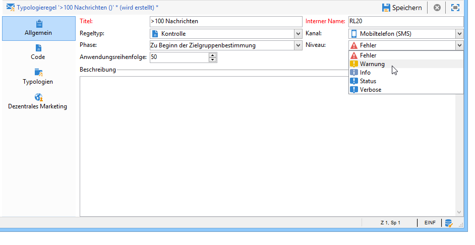
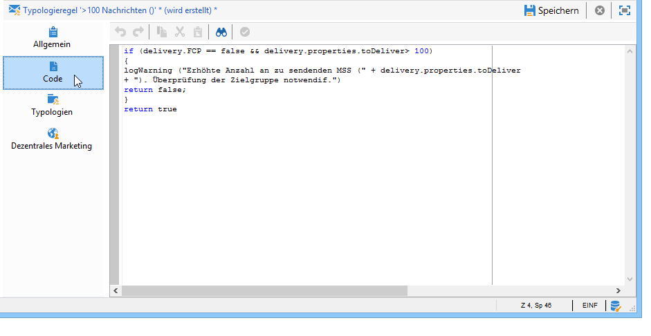
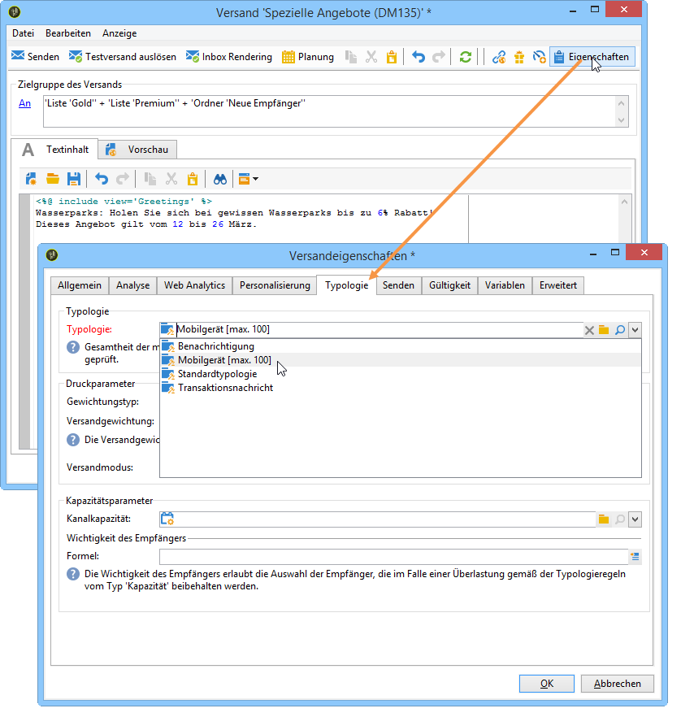
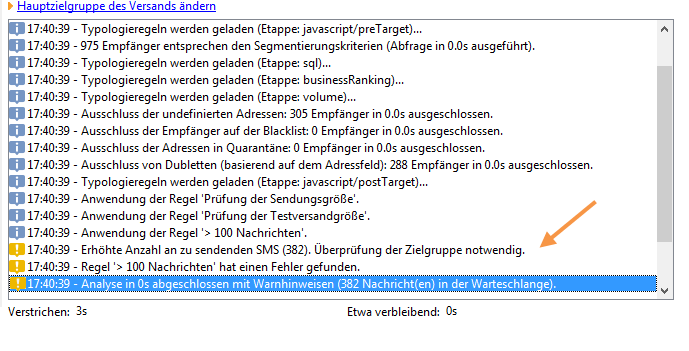
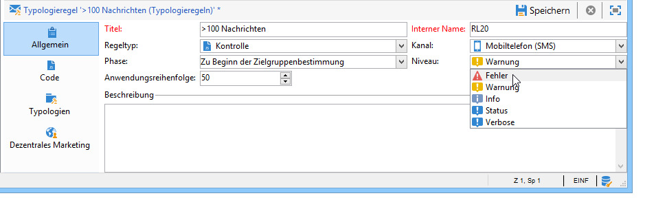
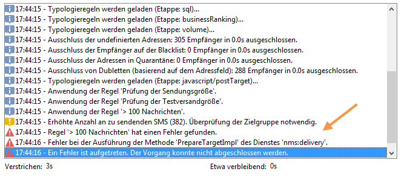

# Kontrollregeln{#control-rules}

## Analyse und Schlichtungskontrollregeln {#analysis-and-arbitration-control-rules}

Kontrollregeln dienen dazu, vor dem Versand die Gültigkeit und Qualität der Nachrichten (korrekte Anzeige aller Zeichen, SMS-Größe, Adressenformat etc.) sicherzustellen.

Mehrere standardmäßige Regeln führen grundlegende Kontrollen durch. Es handelt sich um folgende, in der Benutzeroberfläche durch Fettschrift gekennzeichnete Regeln:

* **[!UICONTROL Betreffvalidierung]** (E-Mail): stellt sicher, dass Betreff und Absenderadresse keine Sonderzeichen enthalten, die bei gewissen E-Mail-Programmen Probleme bereiten könnten.
* **[!UICONTROL Validierung der URL-Titel]** (E-Mail): stellt sicher, dass jede Tracking-URL über einen Titel verfügt.
* **[!UICONTROL URL-Validierung]** (E-Mail): überprüft die Tracking-URLs (Vorhandensein des &quot;&amp;&quot;-Zeichens).
* **[!UICONTROL Validierung der Nachrichtengröße]** (Mobiltelefon): überprüft die Größe von SMS-Nachrichten.
* **[!UICONTROL Prüfung der Gültigkeit]** (E-Mail): stellt sicher, dass die Gültigkeit des Versands ausreichend lang ist, um alle Nachrichten zu versenden.
* **[!UICONTROL Prüfung der Testversandgröße]** (alle Kanäle): erzeugt eine Fehlernachricht, wenn die Test-Zielgruppe mehr als 100 Empfänger enthält.
* **[!UICONTROL Prüfung der Schub-Planung]** (E-Mail): prüft im Falle von Schub-Sendungen, ob der letzte geplante Schub vor dem Ablaufdatum des Versands liegt.
* **[!UICONTROL Validierung des Abmelde-Links]** (E-Mail): prüft, ob in jedem Inhalt (HTML und Text) mindestens eine URL vom Typ &quot;Opt-out&quot; enthalten ist.

## Kontrollregeln erstellen {#creating-a-control-rule}

Sie können nach Bedarf neue Kontrollregeln erstellen. Erstellen Sie dazu eine **[!UICONTROL Kontrolle]** Typologieregel und geben Sie die Kontrollformel in SQL im **[!UICONTROL Code]** Registerkarte.

**Beispiel:**

Im folgenden Beispiel wird eine Regel erstellt, die den Versand eines Angebots auf 100 Empfänger begrenzt. Diese Regel wird in einer Kampagnentypologie referenziert, die in SMS-Sendungen mit dem entsprechenden Angebot verwendet wird.

Gehen Sie wie folgt vor:

1. Erstellen Sie eine **[!UICONTROL Kontrolle]** Typologieregel. Wählen Sie eine **[!UICONTROL Warnung]** Warnhinweisebene.

   

1. Geben Sie im Tab **[!UICONTROL Code]** wie folgt das Script zur Anwendung der gewünschten Schwelle ein:

   

   Das Script erzeugt nun eine Warnung, sobald die Zielgruppe des Versands 100 Empfänger übersteigt:

   ```
   if( delivery.FCP == false && delivery.properties.toDeliver > 100 ) { logWarning("Significant number of SMS to deliver (" + delivery.properties.toDeliver + "). Please make sure the target is correct.") return false; } return true
   ```

1. Verbinden Sie die Regel mit einer Kampagnentypologie und referenzieren Sie diese Typologie im betroffenen SMS-Versand.

   

1. Die Regel wird bei der Versandanaluyse angewandt und erzeugt im gegebenen Fall eine Warnung.

   

   Der Versand ist auch im Falle einer Warnung startbereit.

   Bei einer erhöhten Gravität kann der Versand jedoch nicht gestartet werden.

   

   In diesem Fall ist am Ende der Analyse die Schaltfläche **[!UICONTROL Versand bestätigen]** nicht verfügbar.

   
