# Druckregeln{#pressure-rules}

## Über Marketing-Müdigkeit {#about-marketing-fatigue}

Durch die Implementierung des Werbedruck-Managements können Sie eine Überfrachtung der Datenbankpopulation vermeiden, die zur sogenannten Marketing-Müdigkeit führen würde. Zu diesem Zweck können Sie eine maximale Anzahl von Nachrichten pro Empfängerin bzw. Empfänger definieren. Außerdem können Sie zwischen Kampagnen Schlichtungsregeln implementieren, um die beste Nachricht an die ausgewählte Zielgruppe zu senden.

**Druckregeln** können beispielsweise dazu beitragen, der Marketing-Ermüdung entgegenzusteuern, indem die Zahl der an eine Zielpopulation versendeten Newsletter auf zwei begrenzt wird; unter den zur Auswahl stehenden Nachrichten diejenigen ausgewählt werden, die den Interessen der Abonnentengruppe bestmöglich entsprechen; keine Angebote per SMS an einen unzufriedenen Kunden gesendet werden etc.

Die Kampagnen werden entsprechend der festgelegten Schwellen und des jeweiligen Gewichts jeder Nachricht ausgewählt.

* Ein Schwellenwert ist die höchste Anzahl von Sendungen, die für eine bestimmte Empfängerin oder einen bestimmten Empfänger innerhalb eines bestimmten Zeitraums zulässig ist. Er kann entweder fest oder variabel sein. Er wird in den Einstellungen der Typologieregel festgelegt oder berechnet. Siehe [Maximale Nachrichtenanzahl](#maximum-number-of-messages).
* Die Versandgewichtung ermöglicht die Identifizierung von Sendungen mit der höchsten Priorität im Rahmen der Druckverwaltung. Nachrichten mit der höchsten Gewichtung haben Priorität. Siehe [Nachrichtengewichtung](#message-weight).

Die Schlichtung besteht darin, sicherzustellen, dass geplante Kampagnen mit einer höheren Gewichtung als laufende Kampagnen kein übermäßiges Werben eines Profils auslösen: Ist dies der Fall, wird das Profil von der Versandaktion ausgeschlossen.

Die Schlichtungskriterien (Nachrichtengewichtung und/oder Schwelle der Nachrichtenanzahl) können nach zwei Informationstypen variieren:

* den Präferenzen der Empfänger, die deklarativen Informationen entsprechen: Newsletter-Abonnements, Empfängerstatus (Kunde oder potenzieller Kunde);
* dem Verhalten der Empfänger: Einkäufe, besuchte Links usw.

Die Schlichtungsregel zur Bestimmung der geeigneten Nachrichten wird in der Analyseetappe angewandt. Die Nachricht wird für jede Empfängerin und jeden Empfänger und den betroffenen Zeitraum versandt, wenn folgende Formel wahr ist: **(Anzahl gesendeter Nachrichten) + (Anzahl der Nachrichten mit einer größeren Gewichtung) &lt; Schwelle**

Andernfalls ist die Empfängerin bzw. der Empfänger **[!UICONTROL Ausgeschlossen nach Schlichtung]**. Weitere Informationen hierzu finden Sie unter [Ausschlüsse nach Schlichtung](#exclusion-after-arbitration).

## Druckregel erstellen {#creating-a-pressure-rule}

Um eine Schlichtung zwischen Adobe Campaign-Kampagnen einzurichten, müssen zunächst Kampagnentypologien erstellt und die damit verbundenen Typologieregeln definiert werden.****

Um eine Typologieregel vom Typ **[!UICONTROL Druck]** zu erstellen und zu konfigurieren, durchlaufen Sie folgende Etappen:

1. Klicken Sie im Knoten der Typologieregeln auf das Symbol **[!UICONTROL Neu]** oberhalb der Liste.

   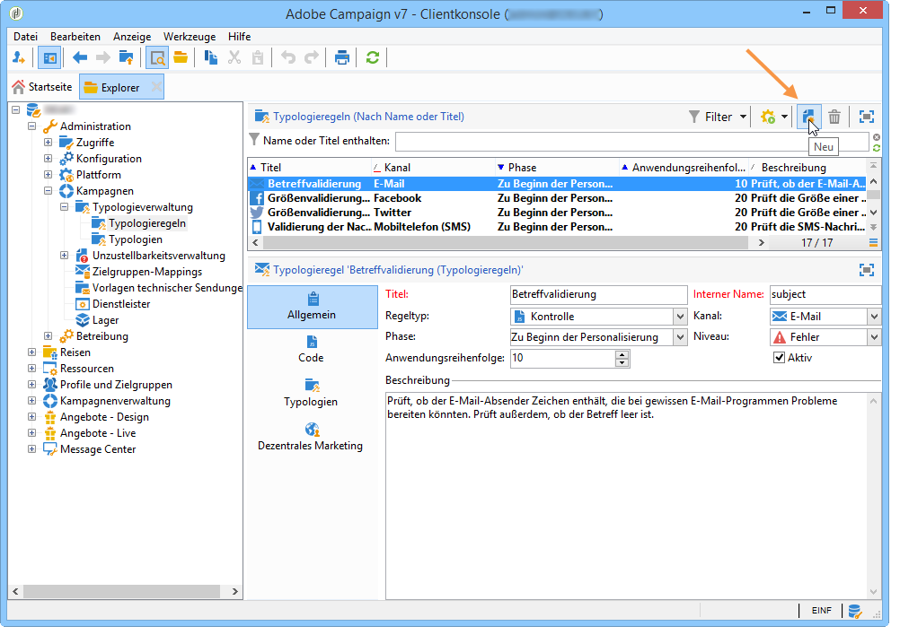

1. Wählen Sie auf der Registerkarte **[!UICONTROL Allgemein]** der neuen Regel den Regeltyp **Druck** aus und geben Sie einen Namen sowie eine Beschreibung ein.

   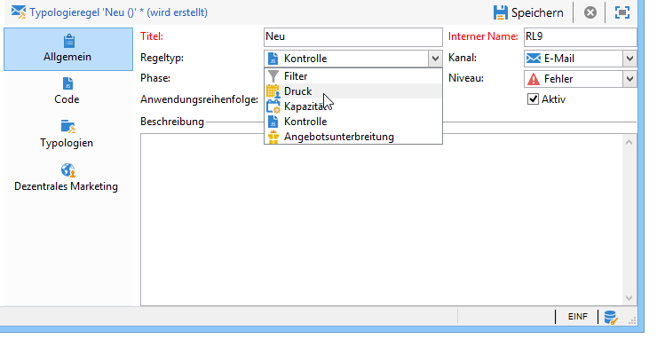

1. Sie können die Ausführungsreihenfolge nach Bedarf ändern. Wenn mehrere Typologieregeln in Form eines Sets von **[!UICONTROL Typologien]** angewendet werden, werden die Regeln mit der niedrigeren Reihenfolge zuerst angewendet. Weitere Informationen hierzu finden Sie unter [Ausführungsreihenfolge](applying-rules.md#execution-order).
1. Definieren Sie im Bereich **[!UICONTROL Berechnungsparameter]** eine Frequenz, wenn Sie die Zielgruppenbestimmung über die nächste tägliche Neuschlichtung hinaus speichern möchten. Weitere Informationen hierzu finden Sie unter [Berechnungsfrequenz anpassen](applying-rules.md#adjusting-calculation-frequency).
1. Gehen Sie in den Tab **[!UICONTROL Druck]** und wählen Sie den Zeitraum im Kalender aus, während dessen die Regel angewandt werden soll.

   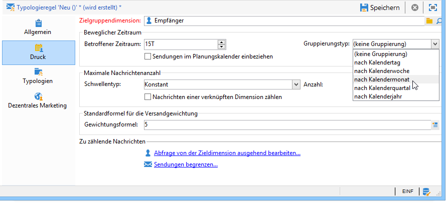

   Die Regel wird auf Sendungen angewandt, deren Kontaktdatum im betroffenen Zeitraum liegt.

   >[!NOTE]
   >
   >Die geplanten Sendungen werden nur berücksichtigt, wenn die Option **[!UICONTROL Sendungen im Planungskalender einbeziehen]** ausgewählt wurde. Lesen Sie diesbezüglich auch den Abschnitt [Festlegen des Zeitraums](#setting-the-period).
   >

1. Geben Sie den Berechnungsmodus der maximalen Nachrichtenanzahl an.

   Die Schwelle stellt die maximale Anzahl der Nachrichten dar, die an einen Empfänger im betreffenden Zeitraum geschickt werden können.

   Die Schwelle ist standardmäßig konstant. Die von der Regel erlaubte maximale Nachrichtenanzahl muss festgelegt werden.

   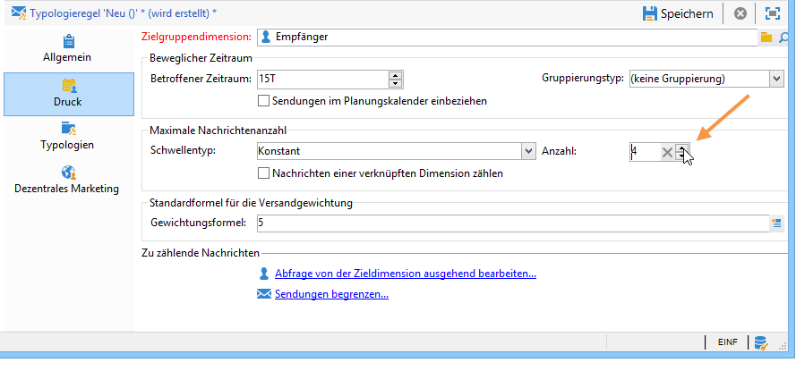

   Um eine variable Schwelle anzugeben, wählen Sie den Wert **[!UICONTROL Empfängerabhängig]** im Feld **[!UICONTROL Schwellentyp]** und öffnen Sie den Ausdruckseditor über das rechts vom Feld gelegene Symbol.

   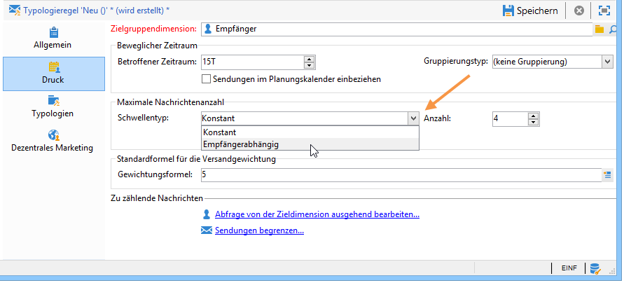

   Weitere Informationen hierzu finden Sie unter [Maximale Nachrichtenanzahl](#maximum-number-of-messages).

1. Geben Sie den Berechnungsmodus der Versandgewichtung an.

   Jeder Versand verfügt über eine Gewichtung, d. h. einen Wert, der die Prioritätsstufe angibt. Dies ermöglicht eine Schlichtung zwischen Kampagnen. Die Gewichtung wird anhand der Formel berechnet, die in der Typologieregel und/oder in ihren Eigenschaften definiert ist. Weitere Informationen hierzu finden Sie unter [Nachrichtengewichtung](#message-weight).

1. Standardmäßig werden bei der Schwellenberechnung alle Nachrichten berücksichtigt. Auf der Registerkarte **[!UICONTROL Einschränkung]** können Sie die von der Typologieregel betroffenen Nachrichten filtern:

   * Im oberen Bereich können die betroffenen Empfänger begrenzt werden.
   * Im unteren Bereich dieses Tabs können die zu zählenden Nachrichten gefiltert werden.

     Im folgenden Beispiel werden nur die im Ordner **NewContacts** gespeicherten Empfänger berücksichtigt und nur Sendungen, die mit **Newsletter** beginnen, sind betroffen.

   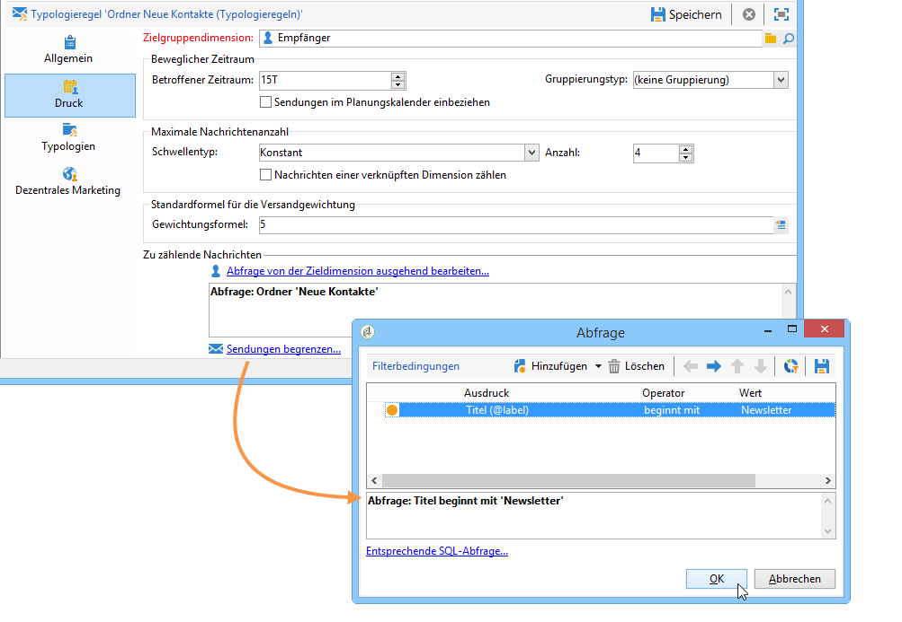

1. In der Registerkarte **[!UICONTROL Typologien]** können die Kampagnentypologien eingesehen werden, die diese Typologieregel anwenden. Zudem kann die Regel an dieser Stelle mit einer oder mehreren existierenden Typologien verknüpft werden. Weitere Informationen finden Sie in der [Dokumentation zu Campaign v8](https://experienceleague.adobe.com/docs/campaign/automation/campaign-optimization/campaign-typologies.html?lang=de){target="_blank"}.

## Definieren von Schwellenwerten und Gewichtungen {#defining-thresholds-and-weights}

### Maximale Nachrichtenanzahl {#maximum-number-of-messages}

In jeder Druckregel wird eine Schwelle definiert, also eine maximale Nachrichtenanzahl, die in einem gewissen Zeitraum an ein Profil gesendet werden kann. Sobald diese Schwelle erreicht ist, können keine Sendungen mehr durchgeführt werden, bis der Zeitraum abgelaufen ist. Durch dieses Verfahren kann eine Empfängerin bzw. ein Empfänger automatisch aus einem Versand ausgeschlossen werden, wenn eine Nachricht die festgelegte Schwelle übersteigt. Dadurch wird verhindert, dass ein Profil zu oft angesprochen wird.

Schwellenwerte können entweder konstant sein oder durch eine Formel mit Variablen berechnet werden. Das bedeutet, dass unterschiedliche Profile in einem bestimmten Zeitraum unterschiedliche Schwellen aufweisen können oder Schwellen sogar innerhalb desselben Profils variieren können.

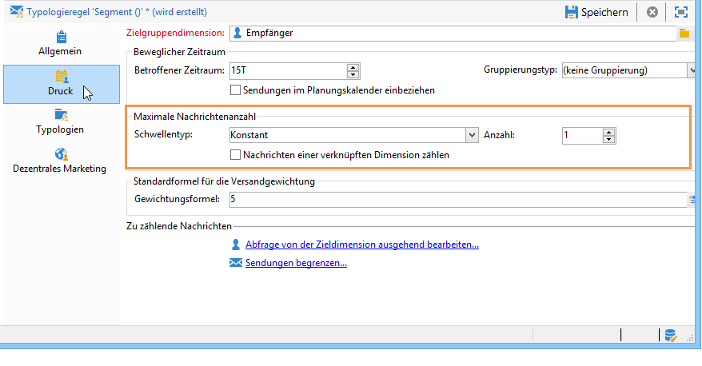

>[!CAUTION]
>
>Eine Schwelle von **0** verhindert jeglichen Versand an die Zielpopulation während des betroffenen Zeitraums.

**Beispiel:**

Sie können die Anzahl der genehmigten Nachrichten entsprechend dem Segment indexieren, zu dem die Empfängerin oder der Empfänger gehört. Dies bedeutet, dass eine Person, die zum Segment „Web“ gehört, mehr Nachrichten erhalten kann als andere Personen. Mit einer Formel vom Typ **[!UICONTROL Iif (@origin=&#39;Web&#39;, 5, 3)]** wäre etwa der Versand von 5 Nachrichten an diese Empfangenden zulässig, für die Empfangende aus anderen Segmenten dagegen nur 3. Die Konfiguration ist wie folgt:

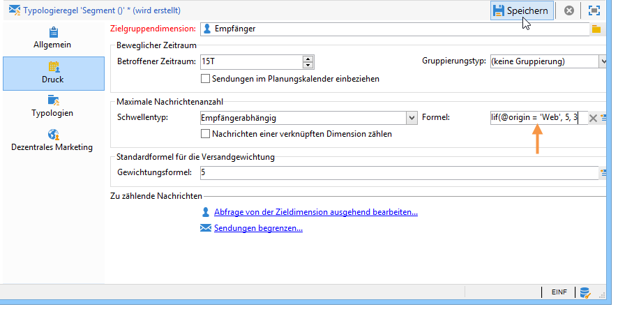

Die definierte Schwelle kann eine in Zusammenhang mit der Zielgruppendimension stehende Dimension berücksichtigen. So können beispielsweise auch die Nachrichten gezählt werden, die an Empfänger gesendet werden, die in der Besuchertabelle gespeichert sind. Ein weiteres Beispiel ist die Begrenzung auf eine Nachricht pro Woche für einen Haushalt mit u. U. mehreren E-Mail-Adressen. Dieser wird über eine mit der Empfängerdimension in Relation stehende Dimension identifiziert. (Näheres zur Besuchertabelle finden Sie in [diesem Abschnitt](../../surveys/using/use-case-creating-a-refer-a-friend-form.md).)

Wählen Sie hierfür die Option **[!UICONTROL Nachrichten einer verknüpften Dimension zählen]**. Wählen Sie danach den Besucher oder die Kontakttabelle aus.

### Nachrichtengewichtung {#message-weight}

Jeder Versand verfügt über eine Gewichtung, die die jeweilige Priorität darstellt. Standardmäßig ist die Versandgewichtung auf den Wert 5 festgelegt. Mit Druckregeln können Sie die Gewichtung der Sendungen festlegen, auf die sie angewendet werden.

Die Gewichtung kann konstant sein oder mithilfe einer Formel empfängerabhängig berechnet werden. Beispielsweise kann die Gewichtung eines Versands den Interessen einer Empfängerin bzw. eines Empfängers entsprechend bestimmt werden.

>[!CAUTION]
>
>Die in einer Regel festgelegte Gewichtung kann für jeden einzelnen Versand über den Tab **[!UICONTROL Eigenschaften]** des jeweiligen Versands überschrieben werden. Klicken Sie auf den **[!UICONTROL Typologie]**-Tab, um die Kampagnentypologie auszuwählen und bei Bedarf die anzuwendende Gewichtung anzugeben.\
>Eine in einer Typologieregel A festgelegte Gewichtung wird jedoch nicht in den Berechnungen einer Typologieregel B berücksichtigt: Die Gewichtung betrifft jeweils nur die Sendungen, die die Regel A anwenden.

**Beispiel:**

Im folgenden Beispiel wird die Gewichtung von Musik-Newslettern abhängig von der Tendenzbewertung der Empfangenden diesbezüglich berechnet. Gehen Sie dazu wie folgt vor:

1. Erstellen Sie ein neues Feld, um die für die Neigung der Empfangenden ermittelten Werte festzuhalten. Dieses Feld, hier **@Music**, kann mit Antworten auf Online-Erhebungen und -Umfragen, erfassten Trackingdaten etc. angereichert werden.
1. Erstellen Sie eine Typologieregel, um die Nachrichtengewichtung auf diesem Feld basierend zu berechnen.

   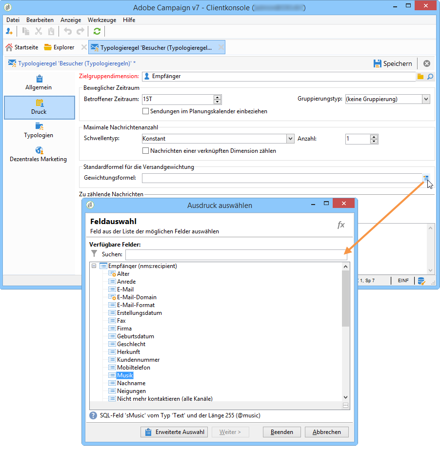

1. Wenden Sie diese Regel auf Nachrichten wie Newsletter, Sonderangebote etc. an. Die Gewichtung dieser Sendungen, also ihre Priorität, hängt folglich von den Neigungswerten des einzelnen Empfängers ab.

## Festlegen des Zeitraums {#setting-the-period}

Die Druckregeln werden für bewegliche Zeiträume von **n** Tagen bestimmt.

Der Zeitraum wird auf der Registerkarte **[!UICONTROL Druck]** der Regel konfiguriert. Sie können die Anzahl der Tage und bei Bedarf den anzuwendenden Gruppierungstyp auswählen (nach Kalendertag, -woche; -monat etc.).

Der Gruppierungstyp ermöglicht die Erweiterung des Werts im Feld **[!UICONTROL Betroffener Zeitraum]** auf den ganzen Tag, die Kalenderwoche, den Kalendermonat oder das Kalenderjahr des jeweiligen Zeitraums.

Beispiel: Eine Druckregel, die eine Schwelle von 2 Nachrichten pro Woche und eine Gruppierung nach Kalendermonaten berechnet, verhindert den Versand von mehr als zwei Sendungen in derselben Woche UND im selben Kalendermonat für den gesamten betroffenen Zeitraum. Achtung: Wenn der Zeitraum in zwei Monate hineinreicht, berücksichtigt die Schwellenberechnung alle Sendungen beider Kalendermonate. Dadurch könnten alle neuen Sendungen während des zweiten Monats verhindert werden. 

Beachten Sie, dass bei der Schwellenwertberechnung standardmäßig nur die bereits durchgeführten Sendungen berücksichtigt werden. Überprüfen Sie in Campaign Classic v7 die Option **[!UICONTROL Sendungen im Planungskalender einbeziehen]**, wenn Sie auch die für den betroffenen Zeitraum geplanten Sendungen berücksichtigen möchten. Der ausgewählte Zeitraum wird in diesem Fall verdoppelt, damit sowohl künftige als auch vorhergegangene Sendungen einbezogen werden können.

Um die berücksichtigten Sendungen auf einen Zeitraum von 15 Tagen zu begrenzen, können Sie entweder

1. den Wert **15T** im Feld **[!UICONTROL Betroffener Zeitraum]** eingeben: Die bis zu 15 Tage vor dem Datum des Versands, auf den die Regel angewendet wird, verschickten Sendungen werden in der Berechnung berücksichtigt;

oder

1. den Wert **7T** im Feld **[!UICONTROL Betroffener Zeitraum]** eingeben UND die Option **[!UICONTROL Sendungen im Planungskalender einbeziehen]** ankreuzen: Die bis zu 7 Tage vor dem Datum des Versands, auf den die Regel angewendet wird, verschickten und bis zu 7 Tage nach besagtem Datum geplanten Sendungen werden in der Berechnung berücksichtigt.

Das Startdatum des Zeitraums hängt von der Konfiguration der Datenbank ab.

Wenn Sie beispielsweise eine 15-Tage-Druckregel ohne Gruppierung auf einen Versand vom 12.11. anwenden, werden Sendungen zwischen dem 27.11. und dem 12.12. berücksichtigt. Berücksichtigt die Druckregel die Sendungen im Planungskalender, werden alle geplanten Sendungen zwischen 27.11. und 27.12. berücksichtigt. Wenn Sie schließlich in der Regel eine Gruppierung nach Kalendermonat festlegen, werden bei der Schwellenberechnung alle Sendungen der Monate November und Dezember einbezogen (vom 1.11. bis zum 31.12.).

**Häufiger Fall**

Um nur Sendungen der laufenden und keine der vorhergehenden Kalenderwoche in der Schwellenberechnung zu berücksichtigen, tragen Sie &#39;0&#39; in das Feld **[!UICONTROL Betroffener Zeitraum]** ein und wählen Sie den **[!UICONTROL Gruppierungstypen]** &#39;nach Kalenderwoche&#39;.

Wenn ein Zeitraum größer als 0 ist (z. B. 1), kann der Berechnungsschwellenwert die Sendungen des Vortages berücksichtigen. Wenn der vorhergehende Tag zugleich der vorhergehenden Woche angehört und es sich beim gewählten Gruppierungstypen um „nach Kalenderwoche“ handelt, wird bei der Schwellenberechnung die gesamte vorhergehende Woche berücksichtigt.

**Beispiel:**

In diesem Beispiel wird eine Druckregel erstellt, die die Kundenansprache auf drei Nachrichten über einen Zeitraum von 15 Tagen hinweg begrenzt, mit einer Gruppierung nach Kalendermonat.

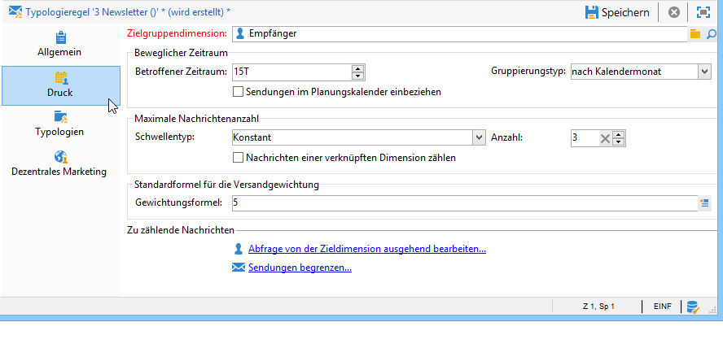

Nehmen wir an, es sind sechs Newsletter gleicher Gewichtung für die Daten 30.4., 3.5., 8.5., 12.5., 22.5. und 30.5. geplant.

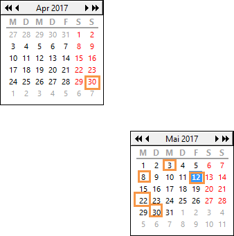

Die für den 12. und 30.5. geplanten Sendungen werden nicht verschickt: Die Sendung vom 12.5. würde die erlaubte Schwelle von drei Nachrichten in 15 Tagen überschreiten und die Sendung vom 30. würde die Schwelle der pro Monat erlaubten Nachrichten überschreiten.

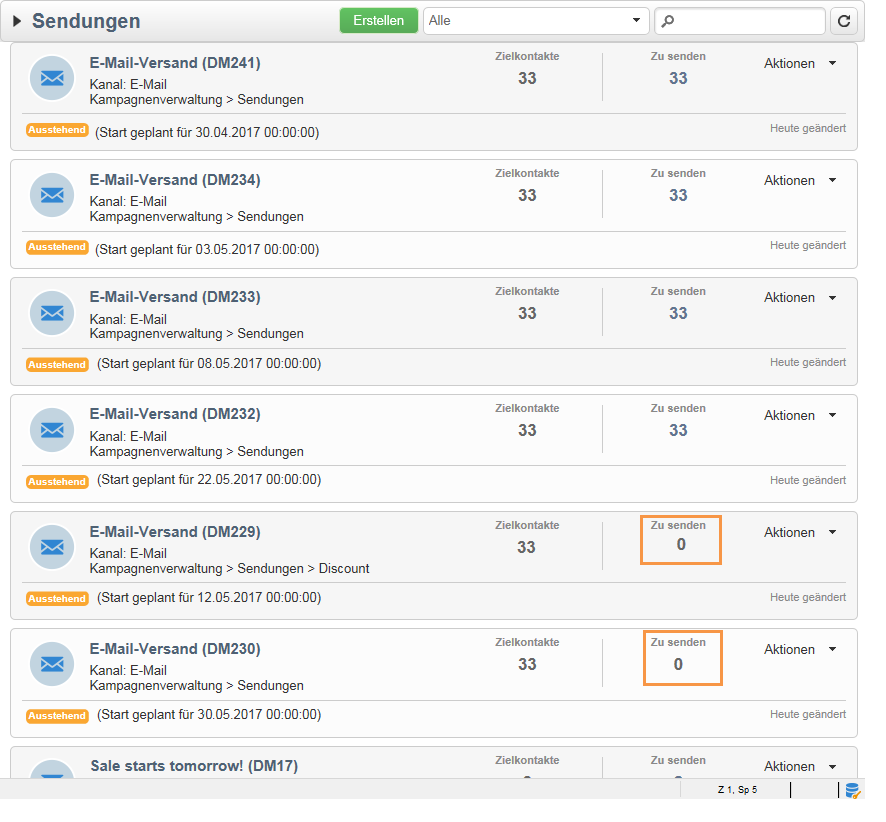

Alle Empfänger dieser Sendungen werden durch die Schlichtung während der Analysephase ausgeschlossen:

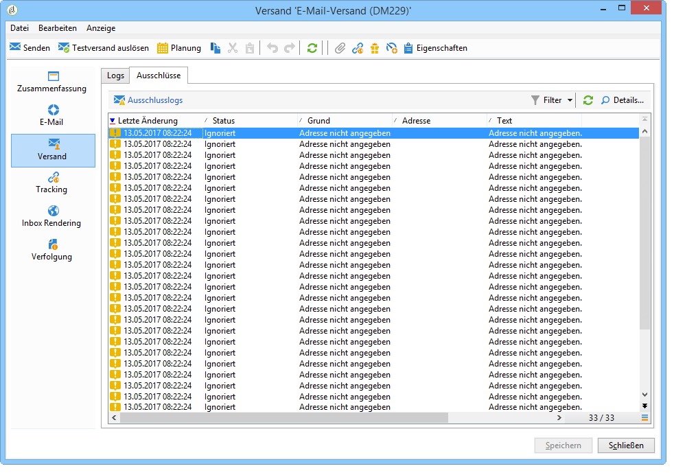

Gruppiert man für die gleiche Regel die Sendungen pro Quartal, werden die Empfänger des **5. Newsletters** ebenfalls ausgeschlossen und der Newsletter wird nicht versendet.

Wenn keine Gruppierung ausgewählt wird, wird nur der **4. Newsletter** nicht versendet, da er in den gleichen zwei Wochen geplant ist wie die ersten drei.

>[!NOTE]
>
>Bei Änderung der Definition einer Typologieregel können Sie eine **Simulation** erstellen, um ihren Einfluss auf die Sendungen, bei denen sie angewendet wird, zu kontrollieren, und die Auswirkungen der Sendungen untereinander zu überprüfen. Weitere Informationen hierzu finden Sie unter [Kampagnensimulationen](campaign-simulations.md).

## Ausschließen nach Schlichtung {#exclusion-after-arbitration}

Die Schlichtung wird jede Nacht durch den technischen Workflow **[!UICONTROL Planungen]** und den Workflow **[!UICONTROL Kampagnenaufträge]** erneut durchgeführt.

Der Workflow **[!UICONTROL Planungen]** berechnet die Daten über die (seit dem Startdatum bis zum jetzigen Zeitpunkt) verstrichene Zeitspanne, die zur Anwendung der Typologieregeln während der Analyse notwendig sind. Außerdem werden die Ausschlusszähler für die Schlichtung jede Nacht neu berechnet.

Adobe Campaign stellt so für jeden Empfänger sicher, dass die Anzahl der zu sendenden Nachrichten die Schwelle nicht überschreitet, unter Berücksichtigung der Anzahl der bereits im betroffenen Zeitraum gesendeten Nachrichten. Diese Informationen sind nur **Indikatoren**, da die Berechnungen zum Zeitpunkt des Versands aktualisiert werden.

Bei Überschreiten der Schwelle werden die in der Kampagnentypologie bestimmten Schlichtungsregeln angewandt und die Empfänger werden durch die Schlichtung von Kampagnen mit geringerer Gewichtung ausgeschlossen.

>[!NOTE]
>
>Wenn mehrere Sendungen die gleiche Gewichtung aufweisen, wird die zeitlich nächstgelegene Kampagne geschickt.

## Anwendungsbeispiele für Druckregeln {#use-cases-on-pressure-rules}

### Anpassen des Schwellenwerts auf Basis von Kriterien {#adapting-the-threshold-based-on-criterion}

Das vorliegende Beispiel zeigt eine Typologieregel, die die Anzahl der wöchentlich gesendeten Nachrichten an Kunden auf vier und an Interessenten auf zwei begrenzt.

Zur Identifikation von Kunden und Interessenten wird das Feld **[!UICONTROL Status]** verwendet, das den Wert 0 für Interessenten und den Wert 1 für bereits bestehende Kunden enthält.

Befolgen Sie die nachstehenden Schritte, um die Regel zu konfigurieren:

1. Erstellen Sie eine neue Typologieregel vom Typ **Druck**.
1. Gehen Sie in den Tab **[!UICONTROL Druck]**, um im Abschnitt **[!UICONTROL Maximale Nachrichtenanzahl]** die Formel zur empfängerabhängigen Schwellenberechnung zu definieren. Wählen Sie daher in der Dropdown-Liste **[!UICONTROL Schwellentyp]** die Option **[!UICONTROL Empfängerabhängig]** aus und klicken Sie anschließend auf das Symbol **[!UICONTROL Ausdruck bearbeiten]**, das sich rechts vom Feld **[!UICONTROL Formel]** befindet.

   Klicken Sie auf die Schaltfläche **[!UICONTROL Erweiterte Auswahl]**, um die Formel zu erstellen.

   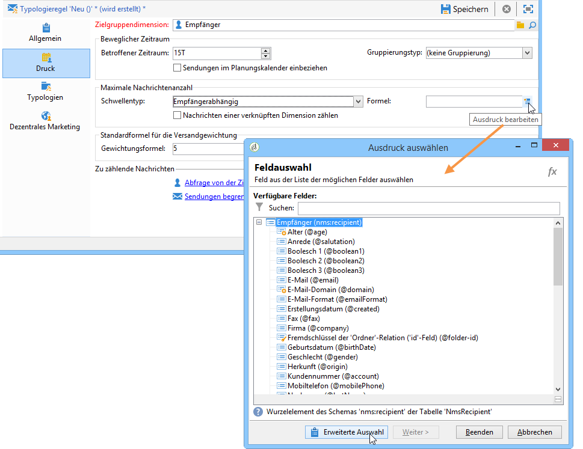

1. Wählen Sie die Option **[!UICONTROL Formel von einem Ausdruck ausgehend erstellen]** aus und klicken Sie auf **[!UICONTROL Weiter]**.

   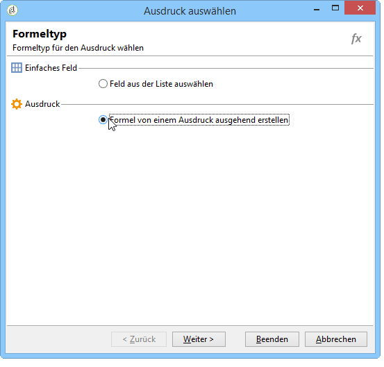

1. Wählen Sie in der Funktionsliste im Knoten **[!UICONTROL Sonstige]** mit einem Doppelklick die Funktion **Iif** aus.

   Wählen Sie anschließend den **Status** des Empfängers im Abschnitt **[!UICONTROL Verfügbare Felder]** aus.

   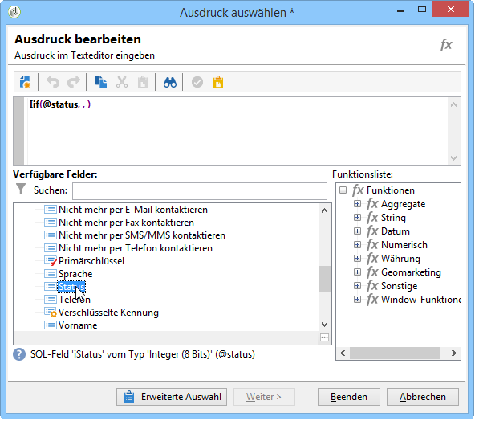

   Geben Sie die folgende Formel ein: **Iif(@status=0,2,4)**

   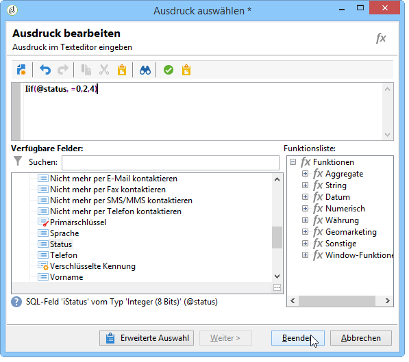

   Diese Formel ordnet einem Status gleich 0 den Wert 2 und jedem anderen Status den Wert 4 zu.

   Klicken Sie auf die Schaltfläche **[!UICONTROL Beenden]**, um die Formel zu bestätigen.

1. Geben Sie den Anwendungszeitraum der Regel an, hier 7 Tage.

   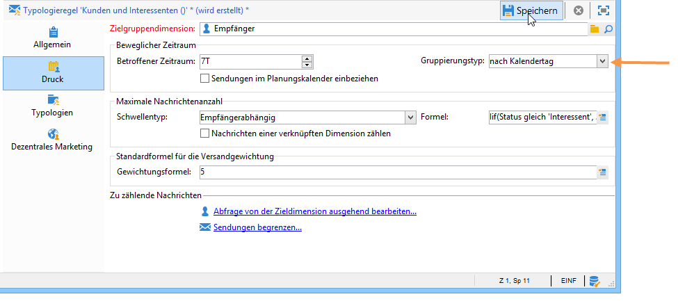

1. Speichern Sie die Regel, um ihre Erstellung zu bestätigen.

Verknüpfen Sie nun die eben erstellte Regel mit einer Typologie, um sie bei Sendungen anwenden zu können. Gehen Sie dazu wie folgt vor:

1. Erstellen Sie eine Kampagnentypologie.
1. Klicken Sie im Tab **[!UICONTROL Regeln]** auf die Schaltfläche **[!UICONTROL Hinzufügen]** und wählen Sie die zuvor erstellte Regel aus.

   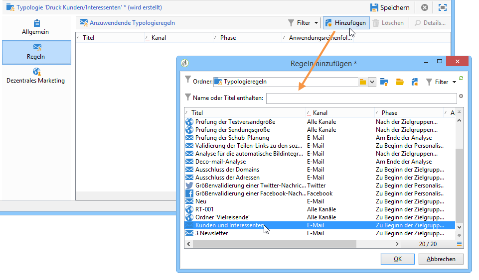

1. Speichern Sie die Typologie, um sie der Liste der bereits vorhandenen Typologien hinzuzufügen.

Um diese Typologie in Ihren Sendungen verwenden zu können, wählen Sie sie wie nachfolgend beschrieben im Tab **[!UICONTROL Typologie]** der jeweiligen Versandeigenschaften aus:

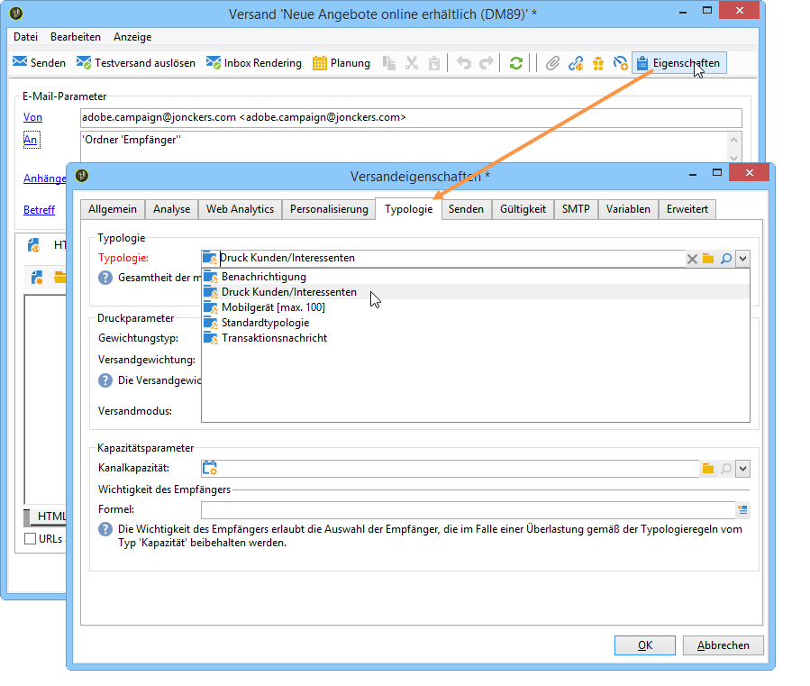

>[!NOTE]
>
>Die Typologie kann auf Ebene der Versandvorlage festgelegt werden, um sie automatisch auf alle mit der jeweiligen Vorlage erstellten Sendungen anzuwenden.

Bei der Versandanalyse werden Empfangende ausgeschlossen, wenn sie bereits eine bestimmte Anzahl an Sendungen erhalten haben. Um diese Informationen anzuzeigen, haben Sie folgende Möglichkeiten:

* das Ergebnis der Analyse ansehen:

  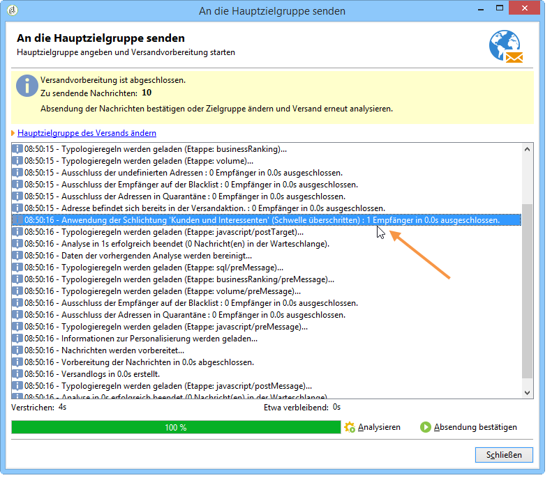

* den Versand öffnen und auf den Tab **[!UICONTROL Sendungen]** sowie den Untertab **[!UICONTROL Ausschlüsse]** klicken:

  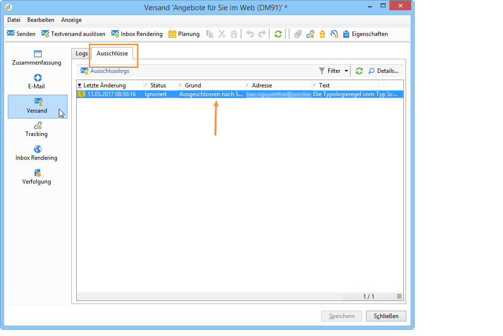

* auf den Tab **[!UICONTROL Verfolgung]** und anschließend den Untertab **[!UICONTROL Ausschlussgründe]** klicken, um die Anzahl der Ausschlüsse und die angewandten Typologieregeln anzeigen zu lassen:

  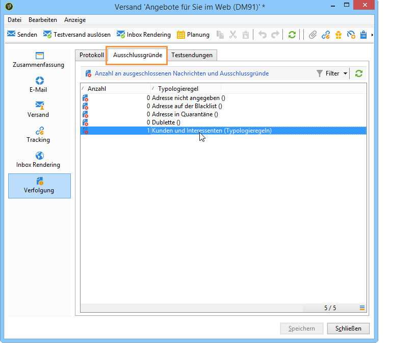

### Berechnen der Versandgewichtung basierend auf dem Empfängerverhalten {#calculating-the-delivery-weight-based-on-behavior}

Je nach Empfängerverhalten können Druckregeln definiert werden. So kann die Versandgewichtung an Kriterien angepasst werden, die je nach Empfängerin bzw. Empfänger variieren. Der Versand einer bestimmten Nachricht kann beispielsweise bevorzugt werden, je nachdem, ob eine Person Ihre Seite besucht, in eine bestimmte Rubrik des letzten Newsletters geklickt oder einen Informationsdienst abonniert hat oder nicht. Auch Antworten auf Umfragen oder Online-Spiele etc. können berücksichtigt werden.

Im folgenden Beispiel möchten wir einen Versand mit der Gewichtung 5 erstellen. Dieser Gewichtung werden Neigungswerte entsprechend dem Empfängerverhalten hinzugefügt: Eine Person, die bereits eine Bestellung auf der Website aufgegeben hat, erhält einen Neigungswert von 5, während einer Person, die noch nie online bestellt hat, ein Neigungswert von 4 zugeordnet wird.

Um diesen Konfigurationstyp durchzuführen, müssen Sie eine Formel verwenden, in der die Nachrichtengewichtung definiert wird. Informationen zu Tendenzbewertungen und Umfrageantworten müssen im Datenmodell verfügbar sein. Im vorliegenden Beispiel wurde das Feld **Neigungen** hinzugefügt.

Befolgen Sie zur Konfiguration die nachstehenden Etappen:

1. Erstellen Sie eine neue Typologieregel vom Typ **Druck**.
1. Bearbeiten Sie die Registerkarte **[!UICONTROL Druck]**. Wir wollen eine empfängerabhängige Formel zur Schwellenwertberechnung erstellen, die auf jeder einzelnen Empfängerin bzw. jedem einzelnen Empfänger basiert: Klicken Sie auf das Symbol **[!UICONTROL Ausdruck bearbeiten]** rechts vom Feld **[!UICONTROL Gewichtungsformel]**.

   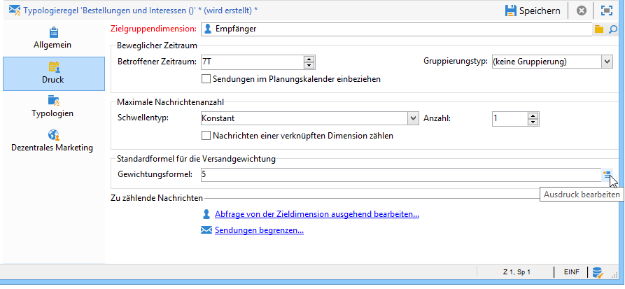

1. Im oberen Abschnitt des Ausdruckeditors wird standardmäßig der Wert **5** angegeben. Dieser Gewichtung soll nun der empfängerabhängige Neigungswert hinzugefügt werden. Positionieren Sie dafür den Zeiger der Maus rechts von der Ziffer 5, geben Sie das Zeichen **+** ein und wählen Sie das Feld **Neigungen** aus.

   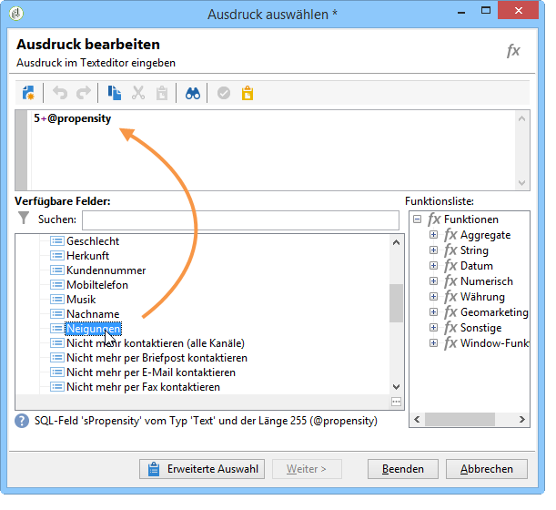

1. Fügen Sie dann einen höheren Wert für Empfängerinnen und Empfänger hinzu, die bereits einen Kauf getätigt haben. Für diese muss die Versandgewichtung um 5, für die anderen nur um 4 erhöht werden.

   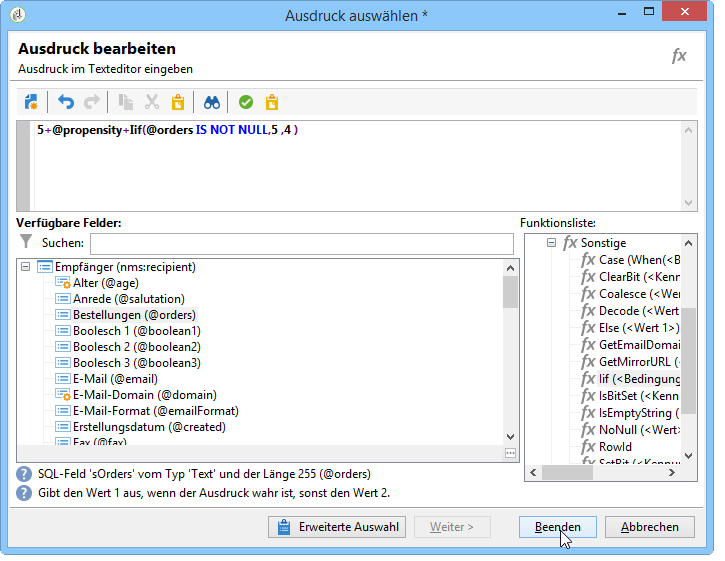

1. Klicken Sie auf die Schaltfläche **[!UICONTROL Beenden]** und speichern Sie die Regel.
1. Fügen Sie die erstellte Regel einer Kampagnentypologie hinzu und verweisen Sie in einem Versand auf die jeweilige Typologie, um ihre Funktionsweise zu überprüfen.

### Senden der Nachrichten mit der höchsten Gewichtung {#sending-only-the-highest-weighted-messages}

Angenommen, Sie möchten an jeden Ihrer Empfänger pro Woche höchstens zwei Nachrichten senden, wobei pro Tag höchstens zwei Nachrichten verschickt werden sollen. Außerdem sollen nur höher gewichtete Nachrichten gesendet werden.

Zu diesem Zweck müssen Sie für denselben Empfänger mehrere Sendungen mit unterschiedlichen Gewichtungen festlegen und eine Druckregel definieren, um Sendungen mit niedrigerer Gewichtung auszuschließen.

Konfigurieren Sie zuerst die Druckregel.

1. Erstellen Sie eine Druckregel. Weitere Informationen hierzu finden Sie unter [Erstellen einer Druckregel](#creating-a-pressure-rule).
1. Wählen Sie im Tab **[!UICONTROL Allgemein]** die Option **[!UICONTROL Zu Beginn der Personalisierung Regel erneut anwenden]** aus.

   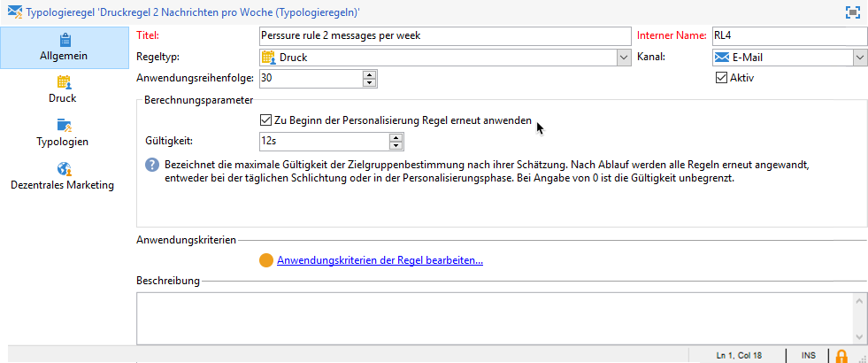

   Diese Option überschreibt den im Feld **[!UICONTROL Frequenz]** definierten Wert und wendet die Regel während der Personalisierung automatisch an. Weitere Informationen hierzu finden Sie unter [Anpassen der Berechnungshäufigkeit](applying-rules.md#adjusting-calculation-frequency).

1. Wählen Sie im Tab **[!UICONTROL Druck]** die Option **[!UICONTROL 7T]** als **[!UICONTROL Betroffener Zeitraum]** und **[!UICONTROL Nach Kalendertag]** als **[!UICONTROL Gruppierungstyp]** aus.
1. Wählen Sie die Option **[!UICONTROL Sendungen im Planungskalender einbeziehen]** aus, um die geplanten Sendungen einzubeziehen.

   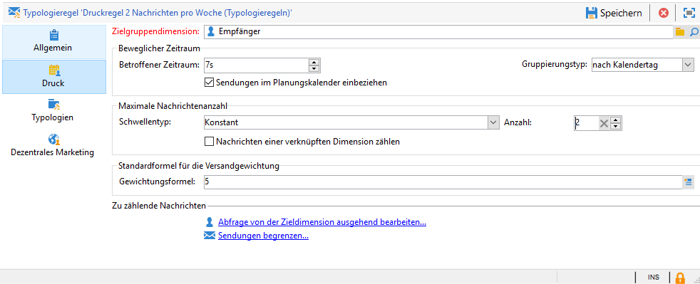

   In dieser Berechnung werden Sendungen berücksichtigt, die bis zu sieben Tage vor dem Verfügbarkeitsdatum und bis zu sieben Tage nach dem Verfügbarkeitsdatum durchgeführt werden. Weitere Informationen hierzu finden Sie unter [Festlegen des Zeitraums](#setting-the-period).

1. Verknüpfen Sie diese Regel im Tab **[!UICONTROL Typologien]** mit einer Kampagnen-Typologie.
1. Speichern Sie Ihre Änderungen.

Erstellen und konfigurieren Sie jetzt einen Workflow für jeden Versand, auf den die Druckregel angewendet werden soll.

1. Kampagne erstellen. Weiterführende Informationen hierzu finden Sie in [diesem Abschnitt](../../campaign/using/setting-up-marketing-campaigns.md#creating-a-campaign).
1. Fügen Sie auf der Registerkarte **[!UICONTROL Zielgruppenbestimmungen und Workflows]** Ihrer Kampagne eine **Abfrage-** Aktivität zu Ihrem Workflow hinzu. Weiterführende Informationen zur Verwendung dieser Aktivität finden Sie in [diesem Abschnitt](../../workflow/using/query.md).
1. Fügen Sie zum Workflow die Aktivität **[!UICONTROL E-Mail-Versand]** hinzu und öffnen Sie ihn. Weiterführende Informationen zur Verwendung dieser Aktivität finden Sie in [diesem Abschnitt](../../workflow/using/delivery.md).
1. Gehen Sie zum Tab **[!UICONTROL Validierungen]** der **[!UICONTROL Versandeigenschaften]** und deaktivieren Sie alle Validierungen.

   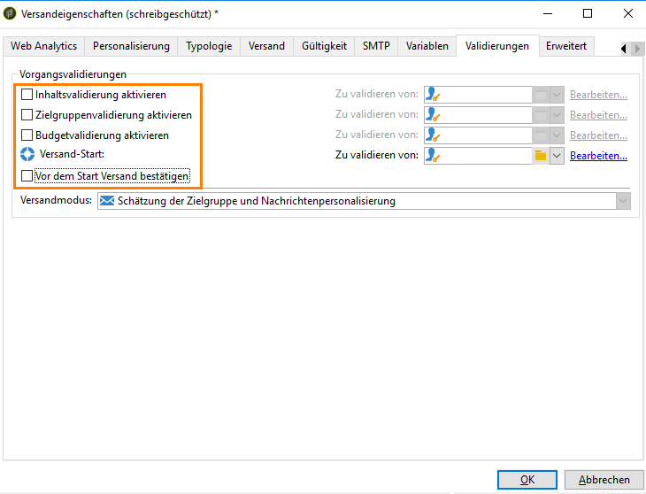

1. Wählen Sie in der Registerkarte **[!UICONTROL Typologie]** der **[!UICONTROL Versandeigenschaften]** die Kampagnentypologie aus, auf die die Regel angewendet werden soll. Definieren Sie eine Versandgewichtung.

   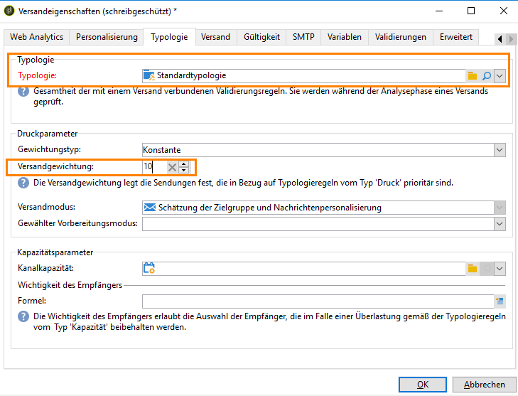

1. Wählen Sie im Versand die Option **[!UICONTROL Planung]** aus und danach **[!UICONTROL Versand planen (automatische Ausführung am geplanten Datum)]**. In unserem Beispiel müssen Sie die Option **[!UICONTROL Formel verwenden]** auswählen.
1. Legen Sie das Extraktionsdatum mit 10 Minuten fest (aktuelles Datum + 10 Minuten).
1. Legen Sie das Kontaktdatum mit dem nächsten Tag fest (aktueller Tag + 1 Tag).

   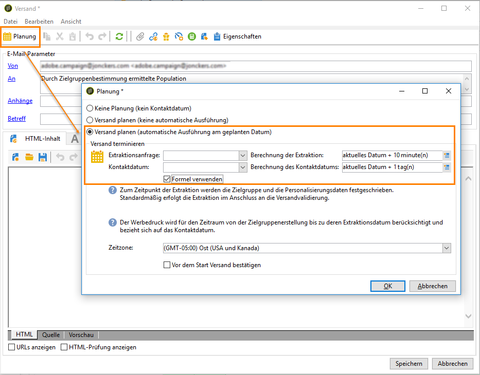

   Damit die Ausschlüsse für die Druckregel erfolgreich implementiert werden können, legen Sie das Extraktionszeitpunkt vor dem Kontaktzeitpunkt sowie vor der erneuten Durchführung der nächtlichen Schlichtung fest. Weitere Informationen hierzu finden Sie unter [Ausschlüsse nach Schlichtung](#exclusion-after-arbitration).

1. Deselektieren Sie die Option **[!UICONTROL Vor dem Start Versand bestätigen]** und speichern Sie Ihre Änderungen.
1. Gehen Sie für alle anderen Sendungen analog vor. Legen Sie dabei für jeden Versand die gewünschte Gewichtung fest.
1. Führen Sie die entsprechenden Workflows zur Vorbereitung und zum Versand der Nachrichten aus.

Wenn die nächtliche Schlichtung angewendet wird, werden die Sendungen mit der niedrigeren Gewichtung für dieselbe Person ausgeschlossen. Nur die Sendungen mit der höchsten Gewichtung werden berücksichtigt. Weitere Informationen hierzu finden Sie unter [Nachrichtengewichtung](#message-weight).

Angenommen, Anfang der Woche wurde den jeweiligen Empfängern schon eine E-Mail gesendet. In der unten stehenden Tabelle finden Sie ein Beispiel für die Konfiguration für zwei weitere Sendungen.

<table> 
 <thead> 
  <tr> 
   <th> Versand  </th> 
   <th> Validierungen  </th> 
   <th> Gewichtung  </th> 
   <th> Extraktionszeitpunkt  </th> 
   <th> Kontaktdatum  </th> 
   <th> Startdatum/-uhrzeit des Versands  </th> 
   <th> Zeitpunkt der Ausführung des Schlichtungs-Workflows  </th> 
   <th> Versandstatus  </th> 
   <th> Versandzeitpunkt  </th> 
  </tr> 
 </thead> 
 <tbody> 
  <tr> 
   <td> Versand 1  </td> 
   <td> Deaktiviert  </td> 
   <td> 5  </td> 
   <td> 15 Uhr  </td> 
   <td> 8 Uhr (nächster Tag)  </td> 
   <td> 14 Uhr  </td> 
   <td> Nachts  </td> 
   <td> Ausgeschlossen  </td> 
   <td> Ausgeschlossen  </td> 
  </tr> 
  <tr> 
   <td> Versand 2  </td> 
   <td> Deaktiviert  </td> 
   <td> 10  </td> 
   <td> 16 Uhr  </td> 
   <td> 9 Uhr (nächster Tag)  </td> 
   <td> 14 Uhr  </td> 
   <td> Nachts  </td> 
   <td> Gesendet  </td> 
   <td> 9 Uhr (nächster Tag)  </td> 
  </tr> 
 </tbody> 
</table>

Nachdem das Extraktionsdatum für die beiden Sendungen überschritten ist, wird die nächtliche Schlichtung vor den Kontaktdaten beider Sendungen erneut angewendet. Dies ermöglicht die Ermittlung aller bereits durchgeführten Sendungen (Empfangende, für die ein Versand verarbeitet und in den Broadlogs aufgezeichnet wurde) sowie der geplanten Sendungen (Empfangende, die für den Empfang einer Nachricht qualifiziert und in den Planungslogs aufgeführt sind).

Nachdem alle durchgeführten und geplanten Sendungen für den in der Druckregel definierten Zeitraum aufgelistet sind, werden sie von Adobe Campaign nach Gewichtung sortiert, wobei der am höchsten gewichtete Versand zuerst kommt. Wenn die in der Druckregel definierte Schwelle erreicht ist (in unserem Beispiel maximal zwei E-Mails pro Woche), werden die Empfangenden vom Versand ausgeschlossen.
