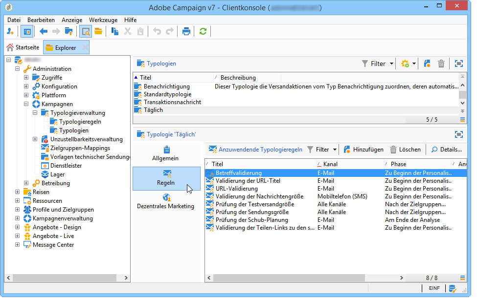

# Über Kampagnentypologien{#about-campaign-typologies}

Campaign Optimization ist das Adobe Campaign-Modul, mit dem Sie die Durchführung von Sendungen steuern, filtern und überwachen können. Um Konflikte zwischen Kampagnen zu vermeiden, kann Adobe Campaign verschiedene Kombinationen durch Anwendung spezifischer Beschränkungsregeln testen. Auf diese Weise werden ein ideal auf Kundenbedürfnisse abgestimmter Nachrichtenversand sowie eine kohärente Unternehmenskommunikation sichergestellt.

 [Diese Funktion im Video entdecken](#typologies-video)

>[!NOTE]
>
>Abhängig von Ihrem Abonnement ist die Kampagnenoptimierung entweder im Lieferumfang enthalten oder als Add-on verfügbar. Überprüfen Sie diesbezüglich bitte Ihren Lizenzvertrag.

## Typologieregeln {#typology-rules}

Mit Adobe Campaign können vier Arten von Typologieregeln erstellt und angewendet werden:

* **Filterregeln**; erlauben es, einen Teil der Zielgruppe anhand von Kriterien auszuschließen. Weiterführende Informationen hierzu finden Sie unter [Filterregeln](../../campaign/using/filtering-rules.md).
* **Druckregeln**; erlauben es, die Marketing-Müdigkeit zu kontrollieren. Weiterführende Informationen hierzu finden Sie unter [Druckregeln](../../campaign/using/pressure-rules.md).
* **Kapazitätsregeln**; erlauben es, die Auslastung zu begrenzen, um optimale Verarbeitungsbedingungen zu gewährleisten. Weitere Informationen hierzu finden Sie unter [Kontrollieren der Kapazitätsauslastung](../../campaign/using/consistency-rules.md#controlling-capacity).
* **Kontrollregeln**; erlauben es, die Gültigkeit von Nachrichten zu überprüfen, bevor sie gesendet werden. Weiterführende Informationen hierzu finden Sie unter [Kontrollregeln](../../campaign/using/control-rules.md).

Nach ihrer Erstellung werden die Typologieregeln in Kampagnentypologien gruppiert, die in den Sendungen referenziert werden. Siehe [Anwenden von Typologien](#applying-typologies).

## Typologien {#typologies}

Eine Kampagnentypologie kann mehrere [Typologieregeln](#typology-rules) enthalten, eine Sendung kann jedoch nur eine Typologie referenzieren.

Im Tab **[!UICONTROL Regeln]** können die anzuwendenden Typologieregeln hinzugefügt, gelöscht oder eingesehen werden.

## Anwenden von Typologien {#applying-typologies}

Gehen Sie wie folgt vor, um eine Typologie zu erstellen und auf Ihre Sendungen anzuwenden:

1. Erstellen Sie Typologieregeln.

   Die Typologieregeln befinden sich im Verzeichnisknoten **[!UICONTROL Administration > Kampagnen > Typologieverwaltung > Typologieregeln]**.

   Erläuterungen zu den verschiedenen in Campaign verfügbaren Regeln finden Sie in den folgenden Abschnitten: [Werbedruck-Regeln](../../campaign/using/pressure-rules.md), [Kapazitätsregeln](../../campaign/using/consistency-rules.md#controlling-capacity), [Kontrollregeln](../../campaign/using/control-rules.md) und [Filterregeln](../../campaign/using/filtering-rules.md).

1. Erstellen Sie eine Typologie und referenzieren Sie diese mit den Regeln, die Sie erstellt haben.

   Die Typologien befinden sich im Verzeichnisknoten **[!UICONTROL Administration > Kampagnenverwaltung > Typologieverwaltung]** > **[!UICONTROL Typologien]**.

1. Konfigurieren Sie Ihre Sendung so, dass sie die von Ihnen erstellte Typologie verwendet. Näheres hierzu finden Sie in [diesem Abschnitt](../../campaign/using/applying-rules.md#applying-a-typology-to-a-delivery).
1. Führen Sie eine Kampagnensimulation durch, um das Verhalten zu testen und anzupassen. Näheres zur Simulation von Kampagnen finden Sie in [diesem Abschnitt](../../campaign/using/campaign-simulations.md).

Bei der Versandvorbereitung werden diejenigen Empfänger ausgeschlossen, die das jeweilige Kriterium erfüllen. Über die Logs können Sie überprüfen, welche Empfänger vom Versand ausgeschlossen wurden. Anwendungsbeispiele für Typologieregeln vom Typ &quot;Druck&quot; finden Sie auf [dieser Seite](../../campaign/using/pressure-rules.md#use-cases-on-pressure-rules).

## Einrichten des Ermüdungsmanagements mithilfe von Typologieregeln {#typologies-video}

In diesem Video wird erläutert, wie Sie das Ermüdungsmanagement in Adobe Campaign Classic mithilfe von Typologieregeln implementieren.

>[!VIDEO](https://video.tv.adobe.com/v/25090?quality=12)

## How to set up fatigue management using predefined filters

Fatigue management controls frequency and quantity of messaging to avoid over-solicitation of recipients. If you do not have the campaign optimization module in your campaign instance, you may configure a predefined filter that will filter the target population by the number of messages received
This video explains how to implement fatigue management in Adobe Campaign Classic by using filters.

>[!VIDEO](https://video.tv.adobe.com/v/25091?quality=12)

**Verwandtes Thema**

* [Anwendung automatischer Geschäftsregeln auf Sendungen über beliebige Kanäle](https://helpx.adobe.com/de/campaign/kb/simplifying-campaign-management-acc.html#Applyautomaticbusinessrulestodeliveriesonanychannel)

* [Über Kampagnentypologien](../../campaign/using/pressure-rules.md)

* [Verwalten der Marketingermüdung anhand von Druckregeln](https://docs.adobe.com/content/help/en/campaign-classic/using/orchestrating-campaigns/campaign-optimization/pressure-rules.html)