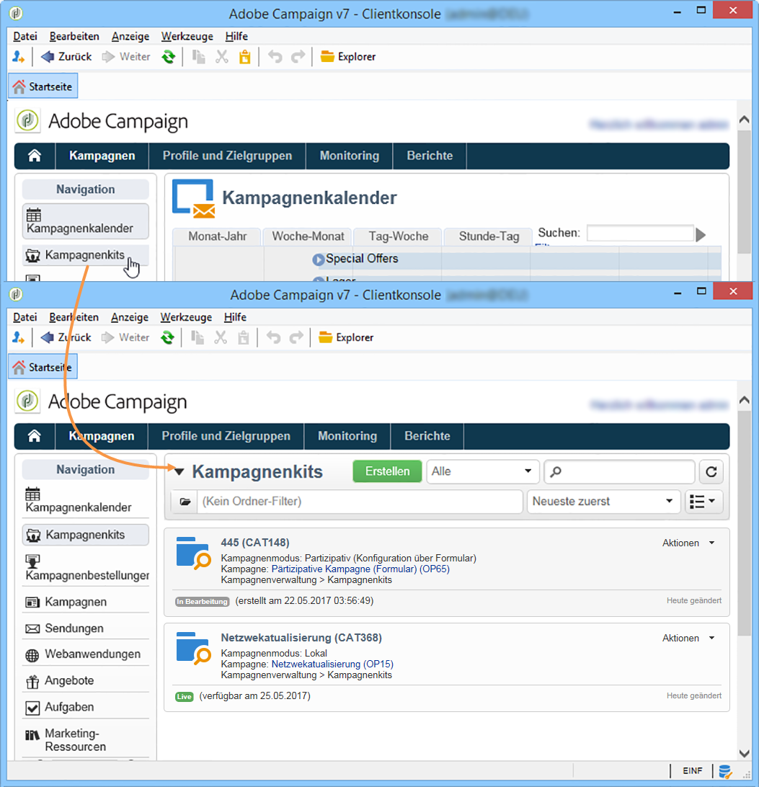
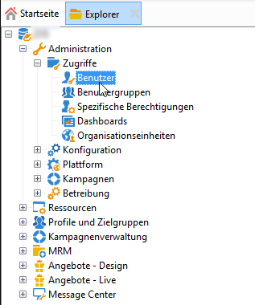
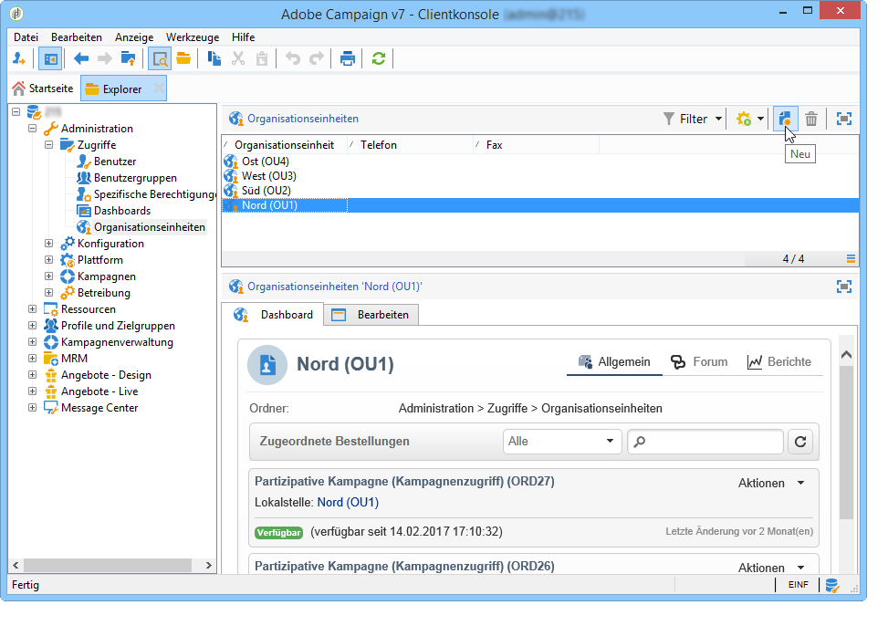
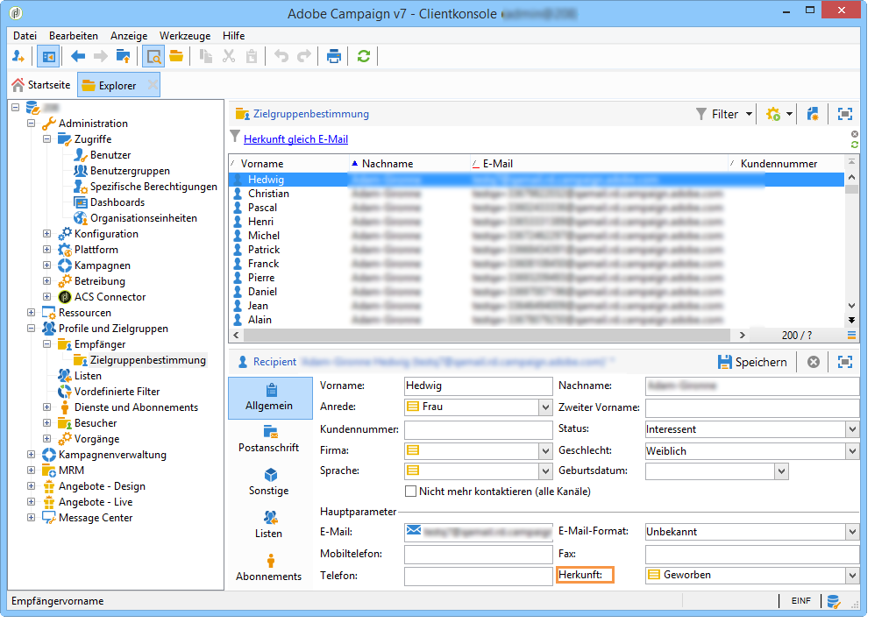

# Über dezentrales Marketing{#about-distributed-marketing}

## Einleitung {#introduction}

Adobe Campaign bietet eine **verteilte Marketing** -Anwendung zur Implementierung von Kooperationskampagnen zwischen zentralen Stellen (Hauptsitz, Marketingabteilungen usw.) und lokalen Stellen (Verkaufspunkte, regionale Agenturen usw.). Diese Zusammenarbeit basiert auf einem freigegebenen Arbeitsbereich, der als der bezeichnet wird **[!UICONTROL list of campaign packages]**, in dem zentral erstellte Kampagnenvorlagen und -instanzen lokalen Entitäten angeboten werden.

Kampagnen präsentieren sich in Form von sogenannten Kits, welche auf eine lokale oder eine partizipative Nutzung ausgelegt sein können. Zur Teilnahme müssen die Lokalstellen die gewünschten Kampagne bestellen. Diese werden erst durch die Validierung der Bestellung seitens der Zentralstelle tatsächlich verfügbar.

>[!CAUTION]
>
>Distributed Marketing ist eine Option von **Campaign**. Bitte überprüfen Sie Ihren Lizenzvertrag.

## Terminologie {#terminology}

### Zentralstelle {#central-entities}

Zentralstellen bestehen aus den Benutzern der Plattform, die die Marketingkommunikation festlegen und die Lokalstellen bei der Erstellung und Ausführung ihrer Kampagnen begleiten.

Mithillfe des dezentralen Marketings können Zentralstellen:

* Lokalstellen Kampagnenkits zur Verfügung stellen;
* Freiräume definieren, innerhalb derer Lokalstellen die Kommunikation mit Kunden und Interessenten in Bezug auf Zielgruppen und Inhalte bestimmen können;
* Kosten verwalten und begrenzen;
* die Durchführung von Kampagnen niederlassungsübergreifend koordinieren.

### Lokalstelle {#local-entities}

Lokalstellen sind beispielsweise Agenturen, Verkaufsstellen oder bestimmte lokale Benutzergruppen (Verantwortliche eines Landes oder einer Region, Verantwortliche einer Marke).

Dezentrales Marketing ermöglicht Lokalstellen eine größere Unabhängigkeit sowie eine Optimierung der Ausführungskosten.

### Lokale Anpassung {#localization}

Lokalstellen haben die Möglichkeit, ihnen zur Verfügung stehende Kampagnen an lokale Gegebenheiten anzupassen. Der Umfang der Anpassungsmöglichkeiten hängt vom Kampagnentyp und kann von der Zielgruppen- bis zur Inhaltsänderung reichen.

### Kampagnenkit-Liste {#list-of-campaign-packages}

Die Kampagnenkit-Liste enthält die Kampagnen, die für Lokalstellen zur Verfügung stehen.

### Kampagnenkit {#campaign-package}

Vorlage oder Kampagneninstanz, die von der Zentralstelle erstellt und den Lokalstellen zur Verfügung gestellt wird.

### Lokale Kampagnen {#local-campaign}

Eine lokale Kampagne ist eine Instanz, die aus einer Vorlage erstellt wurde, auf die in der Liste der **[!UICONTROL campaign packages]** mit einem **bestimmten Ausführungsplan** verwiesen wird. Ziel ist es, einen lokalen Kommunikationsbedarf mithilfe einer von der zentralen Stelle eingerichteten und konfigurierten Kampagnenvorlage zu decken.

Der Umfang der Anpassungsmöglichkeiten für die Lokalstelle ist abhängig von der gewählten Kampagnenart.

Siehe [Erstellen einer lokalen Kampagne](../../campaign/using/creating-a-local-campaign.md).

### Partizipative Kampagnen {#collaborative-campaign}

Eine partizipative Kampagne ist eine Kampagne, deren **Ausführungsplanung von der Zentralstelle festgelegt** wird. Die Lokalstellen können frei entscheiden, ob sie teilnehmen oder nicht. Abhängig von der Konfiguration der Kampagne können Zielgruppe und Inhalt von der Lokalstelle angepasst werden. Es gibt verschiedene Arten partizipativer Kampagnen:

* **[!UICONTROL Collaborative campaign (by form)]**: empfohlen für Kampagnen mit bis zu 300 lokalen Körperschaften. Die lokale Entität kann vordefinierte Parameter für Targeting und die Personalisierung von Inhalten in einem Webformular eingeben. Das Formular kann ein Adobe Campaign-Formular oder ein externes Formular (Extranet-Client) sein. Ein funktionaler Administrator kann das Formular auf der Grundlage einer vom Integrator definierten Formularvorlage definieren und konfigurieren. Um die Kampagne zu bestellen, benötigt die lokale Entität nur Web-Zugriff.
* **[!UICONTROL Collaborative campaign (by campaign)]**: empfohlen für Kampagnen, die auf Dutzende lokale Einrichtungen abzielen. Dieser Kampagnentyp erstellt untergeordnete Kampagnen für jede lokale Entität. Sobald die Kampagne von der zentralen Entität genehmigt **[!UICONTROL collaborative campaign (by campaign)]** wurde, wird sie der lokalen Entität zur Verfügung gestellt, die sie ändern kann. Die Ausführung wird automatisch zwischen übergeordneten und untergeordneten Kampagnen synchronisiert. Die lokale Entität muss Zugriff auf eine Instanz haben, um eine Kampagne zu bestellen und an ihr teilzunehmen.
* **[!UICONTROL Collaborative campaign (by target approval)]**: empfohlen für Kampagnen, die auf mehrere tausend lokale Entitäten abzielen. Lokale Entität erhält eine Kontaktliste, die von der zentralen Entität vordefiniert wurde. Die lokale Entität entscheidet, ob bestimmte Kontakte basierend auf dem Kampagneninhalt über ein Webformular bestehen bleiben sollen. Lokale Einheiten werden von der Liste der ausgewählten Kontakte abgezogen. Um an der Kampagne teilnehmen zu können, benötigt die lokale Entität nur Web-Zugriff.
* **[!UICONTROL Collaborative campaign (simple)]**: Dieser Modus stellt die Kompatibilität mit den spezifischen Ausführungsprozessen früherer Versionen sicher.

Weitere Informationen finden Sie unter [Erstellen einer Kooperationskampagne](../../campaign/using/creating-a-collaborative-campaign.md).

### Kampagnenkit-Bestellung {#ordering-campaign-packages}

Um an einer Kampagne teilnehmen zu können, bestellt die Lokalstelle den entsprechenden Kampagnenkit und gibt hierbei sämtliche für die lokale Anpassung erforderlichen Informationen an.

## Arbeitsbereich {#workspace}

The list of campaign packages can be accessed from the **Campaigns** universe: click the **[!UICONTROL Campaign packages]** link.

Dieses Fenster ermöglicht jedem lokalen Benutzer, die für seine Agentur verfügbaren Kampagnen einzusehen.

Für zentrale Agenturen besteht hier Zugriff auf alle verfügbaren Kampagnenkits.

## Benutzer und Organisationseinheiten {#operators-and-entities}

Start by specifying the central and local entity operators via the **[!UICONTROL Access management]** folder.

### Benutzer {#operators}

Es müssen zentrale und lokale Benutzer erstellt werden.

Central operators must belong to the **[!UICONTROL Central management]** operator group or have the **[!UICONTROL CENTRAL]** named right.

Lokale Operatoren müssen zur **[!UICONTROL Local management]** Operatorgruppe gehören oder über das **[!UICONTROL LOCAL]** Namensrecht verfügen. Sie müssen auch mit ihrer lokalen Einheit verbunden sein.

### Organisationseinheiten {#organizational-entities}

Um eine organisatorische Entität zu erstellen, klicken Sie auf die **[!UICONTROL Administration > Access management > Organizational entities]** Node und dann auf das **[!UICONTROL New]** Symbol oberhalb der Liste der Entitäten.

Jede organisatorische Einheit enthält Identifizierungsinformationen (Etikett, interner Name, Kontaktinformationen usw.) und Gruppen, die am Bestellgenehmigungsprozess beteiligt sind. Diese werden im **[!UICONTROL Notifications and approvals]** Abschnitt auf der **[!UICONTROL General]** Registerkarte definiert.

* Definieren Sie eine Benachrichtigungsgruppe, die bei Aktionen bezüglich der Kampagnenkits informiert wird: Alle Benutzer dieser Gruppe erhalten eine Benachrichtigung, wenn der Kampagnenkit-Liste ein neuer Kit hinzugefügt wird und wenn eine Kampagne verfügbar wird.
* Wählen Sie anschließend die Benutzergruppe aus, die dafür verantwortlich ist, die Kampagnenbestellungen der Lokalstelle zu validieren.
* Legen Sie schließlich fest, welche Benutzergruppe die lokale Kampagne (Zielgruppe, Inhalt, Budget etc.) validieren soll. Diese Gruppe kann bei der Bestellung einer Kampagne verändert werden, sofern die jeweilige Vorlage dies zulässt.

>[!NOTE]
>
>The approval process is presented in the [Approval process](../../campaign/using/creating-a-local-campaign.md#approval-process) section.

## Umsetzung {#implementation}

Dezentrale Marketingkampagnen werden von der Zentralstelle erstellt und publiziert. Anschließend können sie je nach Bedarf von Zentral- und Lokalstellen genutzt werden.

Die Implementierungsetappen hängen vom gewählten Kittyp und dem Umfang der lokalen Verantwortung ab.

### Integratorseitig {#integrator-side}

1. Erstellen Sie die Lokalstellen.
1. Ordnen Sie die Empfänger den für die jeweiligen Lokalstellen verantwortlichen Benutzern zu.

   

1. Legen Sie Berechtigungen und Navigationsregeln für die Lokalstellen fest.
1. Geben Sie die Felder an, die zur lokalen Anpassung der Kampagnen notwendig sind:

   * Bestimmung der Zielgruppe sowie ihrer Maximalgröße;
   * Definition des Inhalts;
   * Ausführungsplanung (Kontakt- und Extraktionsdatum), **nur für lokale Kampagnen**;
   * Erweiterung des Schema der Bestellungen mit allen notwendigen zusätzlichen Felder.

1. Erstellen Sie eine Webformular-Vorlage (über Adobe Campaign oder das Kunden-Extranet), die es ermöglicht, die Parameter der lokalen Anpassung anzuzeigen, Zielgruppe und Budget zu evaluieren, den Inhalt in einer Vorschau zu überprüfen und die Bestellung zu validieren.

   Erstellen Sie für **partizipative Kampagnen mit Zielgruppenvalidierung** die Tabelle, in der die Validierungen für jede Lokalstelle gespeichert werden.

### Administratorseitig {#functional-administrator-side}

Die folgenden Etappen müssen bei jeder Kampagnenerstellung durchlaufen werden.

1. Aktualisieren Sie das Formular mit den für die Kampagnenlokalisierung verwendeten Feldern.
1. Erstellen Sie eine Instanz basierend auf der geeigneten Vorlage (partizipative Kampagne) oder duplizieren Sie die Kampagnenvorlage (lokale Kampagne).
1. Konfigurieren Sie die Kampagne mit den Feldern der lokalen Anpassung und dem Formularverweis.
1. Veröffentlichen Sie die Kampagne.

### Benutzerseitig {#local-operator-side}

Die folgenden Etappen müssen bei jeder Kampagne durchlaufen werden.

1. Legen Sie bei Erhalt der Benachrichtigung zur Verfügbarkeit eines Kampagnenkits gegebenenfalls die Parameter der lokalen Anpassung der Kampagne fest.
1. Evaluieren Sie Zielgruppe, Budget etc.
1. Überprüfen Sie die Vorschau des Kampagneninhalts.
1. Bestellen Sie die Kampagne.

