# Auf Marketing-Kampagnen zugreifen{#accessing-marketing-campaigns}

Mit Adobe Campaign können Sie Marketing-Kampagnen erstellen, konfigurieren, ausführen und analysieren. Die Anwendung stellt somit ein einheitliches Kontrollzentrum dar, über das alle Marketing-Kampagnen verwaltet werden können.

## Grundlagen zum Arbeitsbereich {#workspace-basics}

### Startseite {#home-page}

Sobald die Verbindung mit Adobe Campaign hergestellt wurde, können Sie die verschiedenen Funktionen mithilfe von Links in der Navigationsleiste durchsuchen.

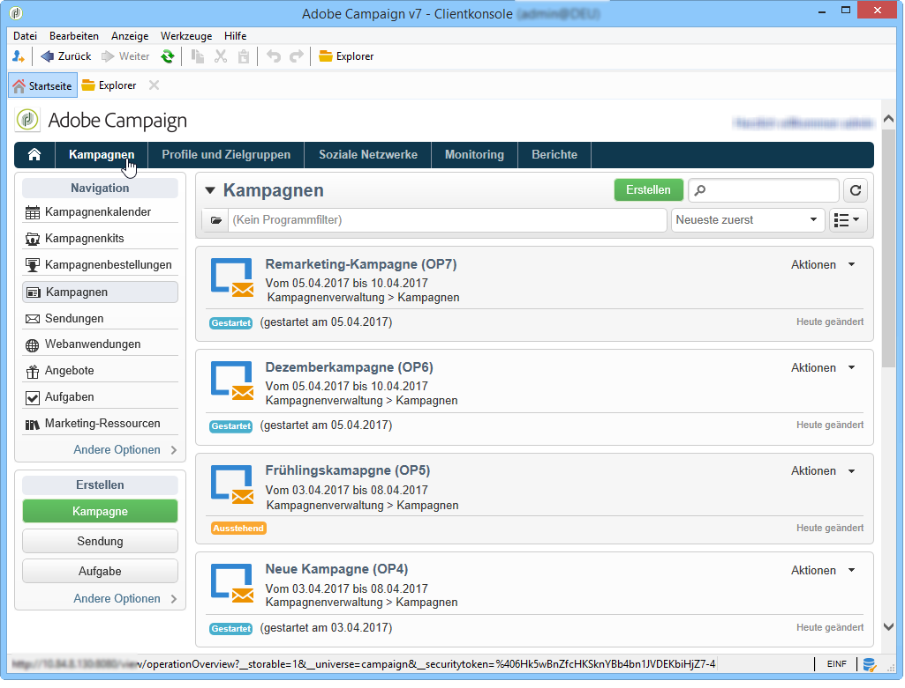

Die Kampagnenelemente befinden sich auf der Registerkarte **[!UICONTROL Kampagnen]**: Hier erhalten Sie einen Überblick über die Marketing-Programme und -Kampagnen sowie deren Untergruppen. Ein Marketing-Programm besteht aus Kampagnen, die aus Sendungen, Aufgaben, verknüpften Ressourcen usw. bestehen. Im Zusammenhang mit der Verwaltung von Marketing-Kampagnen mithilfe von Campaign finden Sie die Informationen zu Sendungen, Budgets, Validierungsverantwortlichen und verknüpften Dokumenten in den Kampagnen.

Der **[!UICONTROL Navigationsblock]** im Tab **[!UICONTROL Kampagnen]** enthält je nach installierten Instanzmodulen verschiedene Einträge. Sie können beispielsweise auf Folgendes zugreifen:

* **Kampagnenkalender**: Kalender der Pläne, Marketing-Programme, Sendungen und Kampagnen. Siehe [Kampagnenkalender](#campaign-calendar).
* **Kampagnen**: Zugriff auf alle in Marketing-Programmen enthaltenen Kampagnen;
* **Sendungen**: Zugriff auf in Kampagnen enthaltene Sendungen;
* **Web-Anwendungen**: Zugriff auf Web-Anwendungen (Formulare, Landingpages usw.).

>[!NOTE]
>
>Der strukturelle Aufbau der Adobe Campaign-Konsole, Berechtigungen sowie die Profilverwaltung werden in [diesem Abschnitt](../../platform/using/adobe-campaign-workspace.md) beschrieben.
>
>Alle Funktionalitäten im Zusammenhang mit Kanälen und Sendungen werden in der [Dokumentation zu Campaign v8](https://experienceleague.adobe.com/docs/campaign/campaign-v8/send/create-message.html?lang=de){target="_blank"} erläutert.

### Kampagnenkalender {#campaign-calendar}

Jede Kampagne gehört zu einem Programm, das wiederum zu einem Plan gehört. Der Zugriff auf Pläne, Programme und Kampagnen erfolgt über das Menü **[!UICONTROL Kampagnenkalender]** auf der Registerkarte **Kampagnen**.

Um einen Plan, ein Programm, eine Kampagne oder einen Versand zu bearbeiten, klicken Sie auf den jeweiligen Titel im Kalender und anschließend auf den Link **[!UICONTROL Öffnen…]**. Das gewünschte Element öffnet sich in einem neuen Tab:

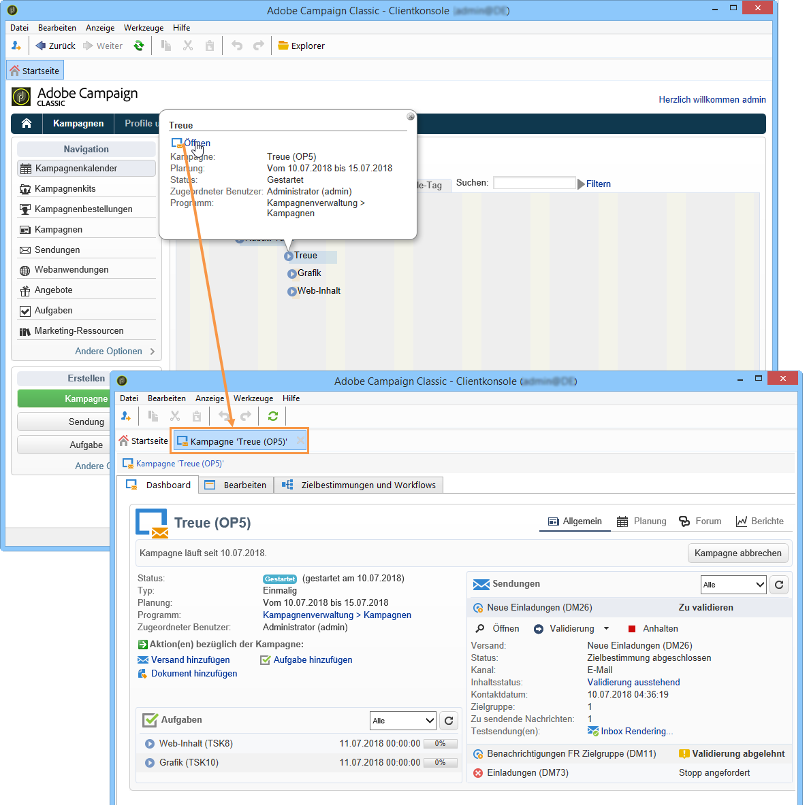

Sie haben die Möglichkeit, die im Kampagnenkalender angezeigten Informationen zu filtern. Klicken Sie hierzu auf den Link **[!UICONTROL Filtern]** und wählen Sie die gewünschten Kriterien aus.

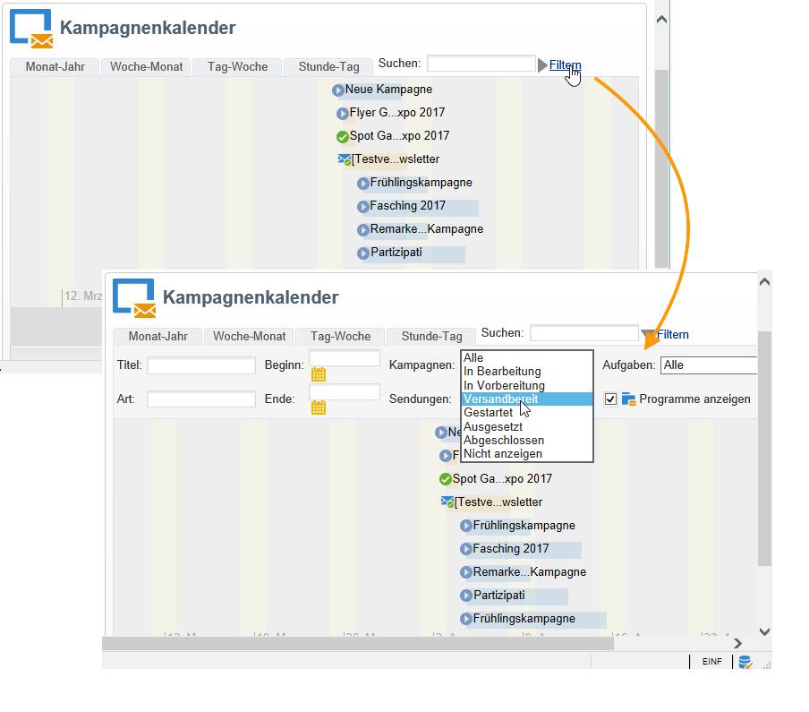

>[!NOTE]
>
>Wenn Sie nach einem Datum filtern, werden alle Kampagnen angezeigt, deren Startdatum nach dem angegebenen Datum liegt und/oder deren Enddatum vor dem angegebenen Datum liegt. Datumsangaben können in den Kalendern rechts von jedem Feld ausgewählt werden.

Sie können zur Filterung der angezeigten Elemente auch das Feld **[!UICONTROL Suchen]** verwenden.

Die den Elementen zugeordneten Symbole geben Auskunft über ihren jeweiligen Status: Abgeschlossen, In Gang, In Bearbeitung usw.

### Navigation in einem Marketing-Programm {#browsing-in-a-marketing-program}

Campaign ermöglicht die Verwaltung von Programmen, die aus verschiedenen Marketing-Kampagnen bestehen. Jede Kampagne enthält Sendungen und die zugehörigen Prozesse und Ressourcen.

#### In einem Programm navigieren {#browsing-a-program}

Zur Konfiguration und Bearbeitung eines Programms stehen die folgenden Registerkarten zur Verfügung:

* Auf der Registerkarte **Planung** können Sie sich den Programmkalender nach Monat, Woche oder Tag anzeigen lassen, indem Sie in der Kalenderkopfzeile auf die jeweilige Registerkarte klicken.

  Bei Bedarf können an dieser Stelle auch Programme, Kampagnen oder Aufgaben erstellt werden.

  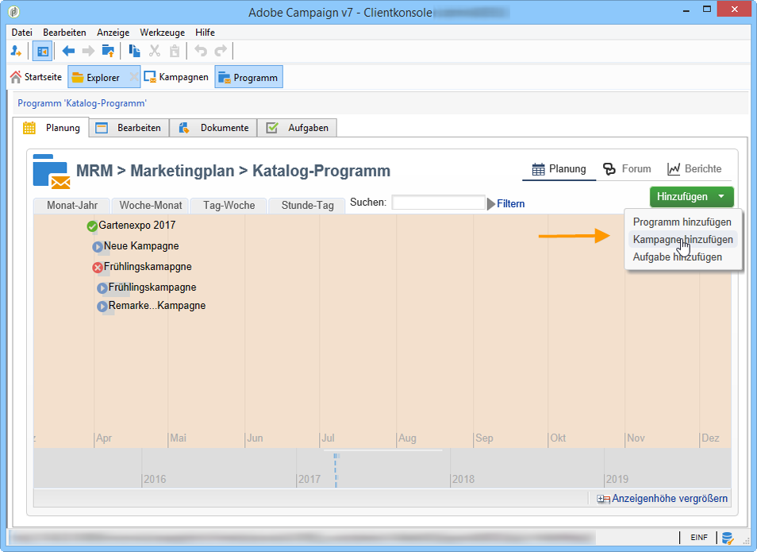

* Über die Registerkarte **Bearbeiten** kann das Programm konfiguriert und verändert werden (Name, Start- und Enddatum, Budget, verknüpfte Dokumente usw.).

  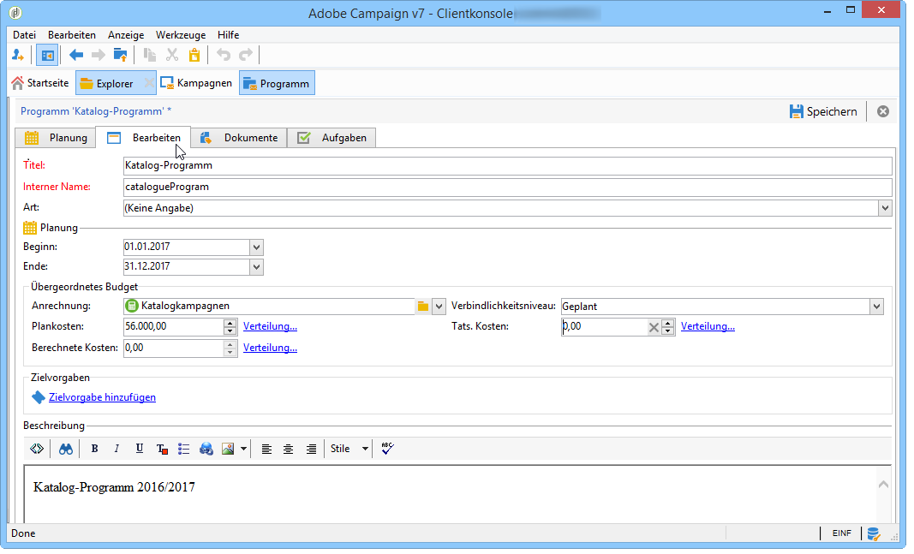

#### Kampagnen durchsuchen {#browsing-campaigns}

Kampagnen sind über den Kampagnenkalender, über den Tab **[!UICONTROL Planung]** des entsprechenden Programms und über die Liste der Kampagnen verfügbar:

1. Über den Kampagnenkalender können Sie die gewünschte Kampagne auswählen und auf den Link **[!UICONTROL Öffnen]** klicken.

   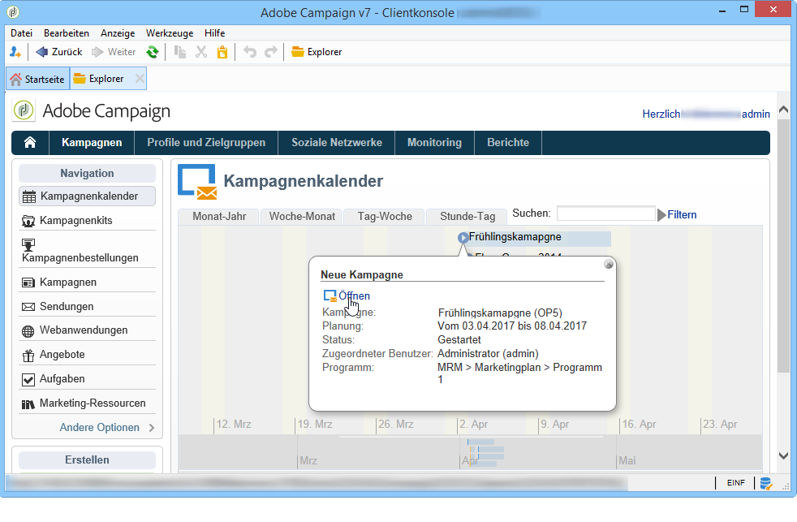

   Die Kampagne öffnet sich daraufhin in einem neuen Tab:

   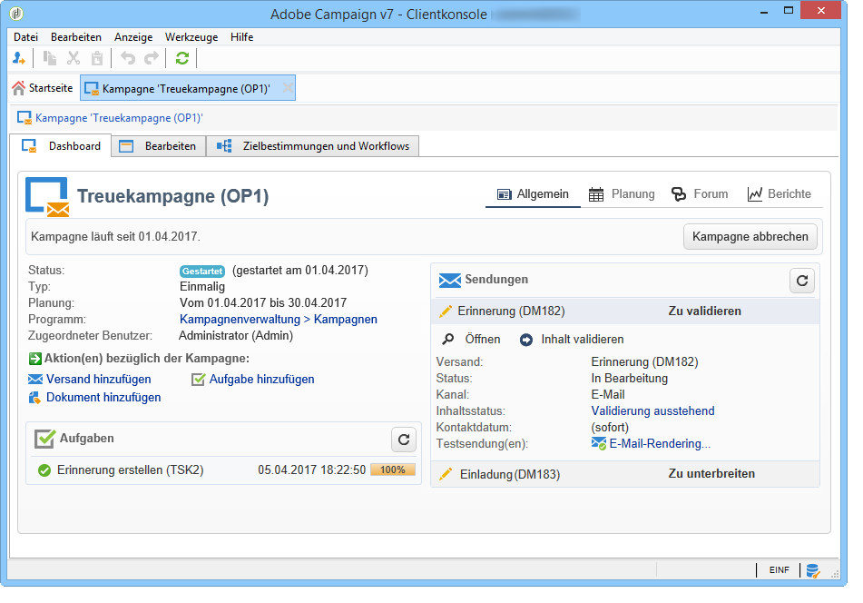

1. Über den Tab **[!UICONTROL Planung]** des Programms kann die Kampagne auf die gleiche Weise wie im Kalender geöffnet werden.
1. Über den Link **[!UICONTROL Kampagnen]** im Tab **[!UICONTROL Kampagnen]** wird eine Liste aller Kampagnen aufgerufen. Klicken Sie auf den Namen der Kampagne, die Sie bearbeiten möchten.

   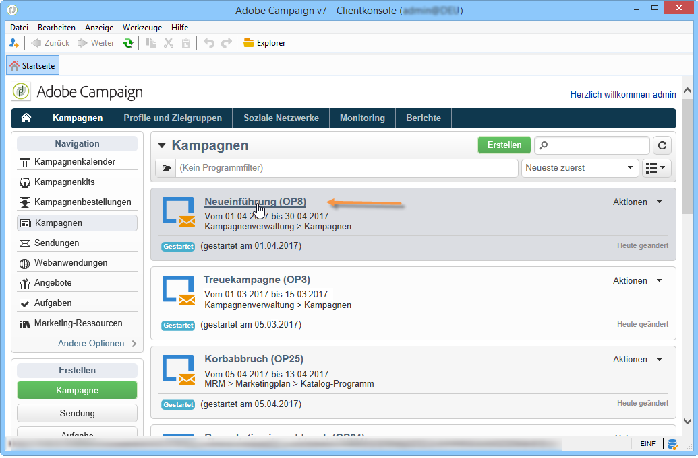

### Steuerung einer Kampagne {#controlling-a-campaign}

#### Dashboard {#dashboard}

Alle Kampagnen, Aufträge und Ressourcen werden in einem zentralen Bildschirm, dem Dashboard, zusammengefasst, um eine kollaborative Verwaltung der Marketing-Aktionen zu ermöglichen.

Das Dashboard einer Kampagne wird als Steuerungsschnittstelle verwendet. Sie greift direkt auf die wichtigsten Phasen der Kampagnenerstellung und -verwaltung zu: Sendungen, Extraktionsdateien, Benachrichtigungen, Budgets usw.

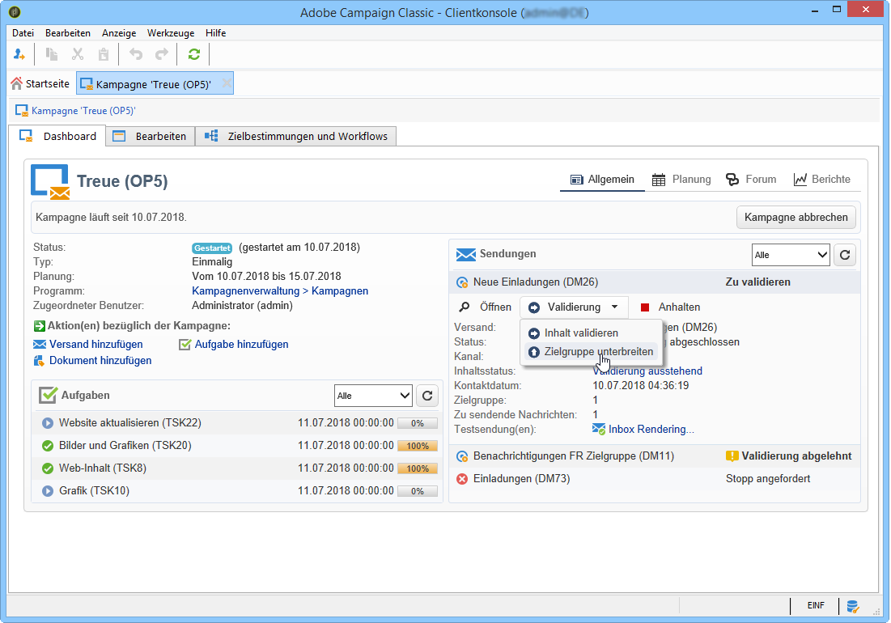

Adobe Campaign ermöglicht den Einsatz kollaborativer Prozesse zur Ausführung und Validierung der unterschiedlichen Etappen von Marketing- und Kommunikationskampagnen, darunter die Budget-, Zielgruppen- und Inhaltsvalidierung.

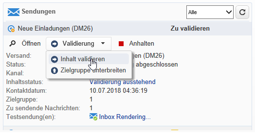

>[!NOTE]
>
>Die Konfiguration von Kampagnenvorlagen wird im Abschnitt [Kampagnenvorlagen](../../campaign/using/marketing-campaign-templates.md#campaign-templates) beschrieben.

#### Planung {#schedule}

Eine Kampagne zentralisiert eine Gruppe von Sendungen. Für jede Kampagne bietet die Planung eine globale Ansicht aller Komponenten: Sie können die Aufgaben und Sendungen anzeigen und leicht darauf zugreifen.

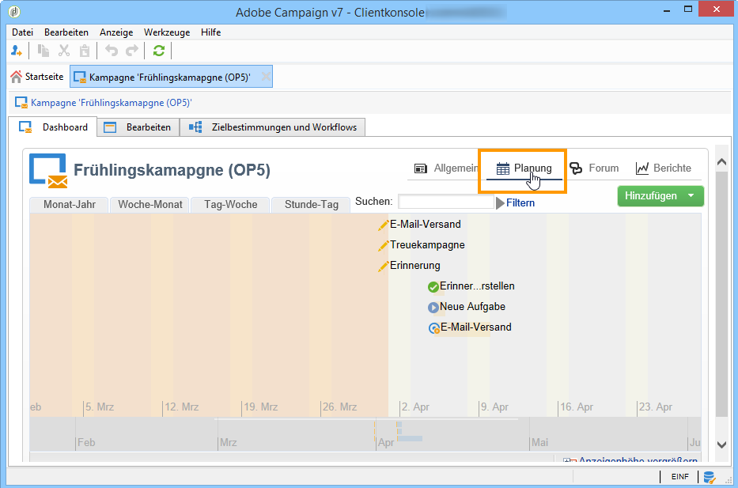

#### Forum {#forum}

Jede Kampagne verfügt über ein dediziertes Forum, in dem beteiligte Benutzerinnen und Benutzer Nachrichten austauschen können.

Weitere Informationen finden Sie in den [Diskussionsforen](../../mrm/using/discussion-forums.md).

#### Berichte {#reports}

Über den Link **[!UICONTROL Berichte]** können die Kampagnenberichte eingesehen werden.

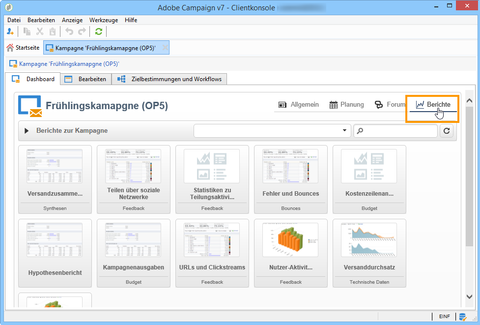

>[!NOTE]
>
>Weitere Informationen zu Berichten finden Sie in [diesem Abschnitt](../../reporting/using/about-adobe-campaign-reporting-tools.md).

#### Konfiguration {#configuration}

Kampagnen werden über Kampagnenvorlagen erstellt. Sie können wiederverwendbare Vorlagen konfigurieren, für die einige Optionen ausgewählt und andere Einstellungen bereits gespeichert wurden. Für jede Kampagne stehen die folgenden Funktionen zur Verfügung:

* Referenzierung von [Dokumenten und Ressourcen](../../campaign/using/marketing-campaign-deliveries.md#managing-associated-documents): Sie können der Kampagne Dokumente (Briefing, Bericht, Bilder usw.) zuordnen. Alle Dokumentenformate werden unterstützt.
* Kostenbestimmung: Mit Adobe Campaign können Sie für jede Kampagne [Kosteneinträge und Kostenberechnungsstrukturen) definieren](../../campaign/using/providers-stocks-and-budgets.md#defining-cost-categories) die bei der Erstellung der Marketing-Kampagne verwendet werden können. Zum Beispiel: Druckkosten, Nutzung einer externen Agentur, Raummiete.
* Definition von Zielvorgaben: Sie können für eine Kampagne quantifizierbare Zielvorgaben definieren, z. B. die Anzahl der Abonnentinnen und Abonnenten, das Geschäftsvolumen usw. Diese Informationen werden später in den Kampagnenberichten verwendet.
* Verwaltung von [Testadressen](../../delivery/using/about-seed-addresses.md) und [Kontrollgruppen](../../campaign/using/marketing-campaign-deliveries.md#defining-a-control-group).
* Validierungsverwaltung: Sie können die zu validierenden Abwandlungen sowie bei Bedarf validierungsverantwortliche Benutzerinnen bzw. Benutzer oder Benutzergruppen auswählen. [Weitere Informationen](../../campaign/using/marketing-campaign-approval.md#checking-and-approving-deliveries)

>[!NOTE]
>
>Wenn Sie die Kampagneneinstellungen öffnen und ändern möchten, klicken Sie auf den Link **[!UICONTROL Erweiterte Kampagnenparameter...]** im Tab **[!UICONTROL Bearbeiten]**.

## Web-Zugriff {#using-the-web-interface-}

Sie können über einen Internet-Browser auf die Bildschirme der Adobe Campaign-Konsole zugreifen, um alle Kampagnen und Sendungen sowie Berichte und Informationen zu den Profilen in Ihrer Datenbank anzuzeigen. Dieser Zugriff ermöglicht keine Erstellung von Einträgen. Abhängig von den Benutzerrechten können Sie die Daten in der Datenbank anzeigen und/oder bearbeiten. Sie können beispielsweise Kampagneninhalte und Zielgruppenbestimmungen genehmigen, einen Versand neu starten oder stoppen, usw.

1. Melden Sie sich wie gewohnt über https://`<your instance>:<port>/view/home` an.
1. Über die unterschiedlichen Rubriken besteht Zugriff auf Listen und weitere Navigationselemente.

   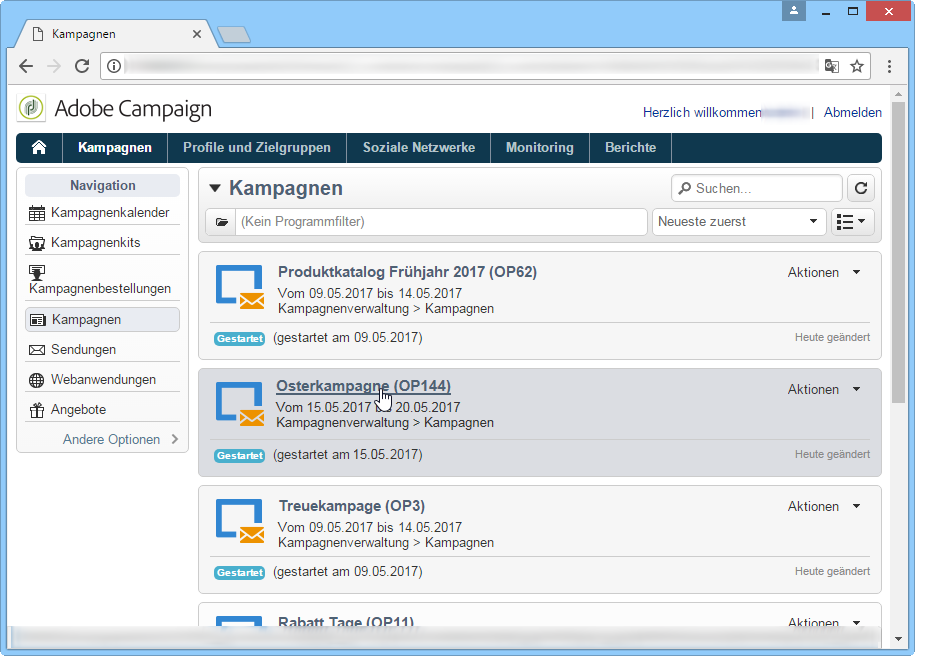

Neben dem Navigieren durch und Ansehen von Kampagnen können Sie auch die folgenden Aufgaben ausführen:

* Überwachen von Aktivitäten in einer Instanz
* Teilnahme an Validierungsprozessen, beispielsweise an der Validierung von Versandinhalten
* Durchführen anderer Schnellaktionen, z. B. Pausieren eines Workflows
* Zugriff auf alle Reporting-Funktionen
* Teilnahme an Forumsdiskussionen

Diese Tabelle fasst die Aktionen zusammen, die Sie über einen Browser für Kampagnen durchführen können:

| Seite  | Aktion |
| --- | --- |
| Liste der Kampagnen, Sendungen, Angebote usw. | Löschen von Listenelementen |
| Kampagne | Abbrechen einer Kampagne |
| Versand | Inhalt und Zielgruppe des Versands validieren Versandinhalt übermitteln Versand bestätigen Versand anhalten und stoppen |
| Web-Programm | Web-Programm erstellen Bearbeiten des Programminhalts und der Eigenschaften Programminhalt als Vorlage speichern Programm veröffentlichen |
| Angebot | Inhalt und Eignung des Angebots validieren Online-Angebot deaktivieren |
| Aufgabe | Aufgabe abschließen Aufgabe abbrechen |
| Marketing-Ressourcen | Ressource validieren Ressource sperren und entsperren |
| Kampagnenkit | Kit zur Genehmigung einreichen Kit genehmigen oder ablehnen Kit abbrechen |
| Kampagnenbestellung | Bestellung erstellen Bestellung annehmen oder ablehnen <!-- Je n'ai pas pu créer de campaign order pour vérifier cela. Peut-on accéder à ces fonctionnalités depuis l'accès web ? --> |
| Lager | Lagerposition löschen |
| Angebotssimulation | Simulation starten und stoppen |
| Zielgruppenbestimmungs-Workflow | Workflow starten, pausieren und stoppen |
| Bericht | Aktuelle Daten im Berichtsverlauf speichern |
| Forum | Diskussion hinzufügen Eine Nachricht in einer Diskussion beantworten Einer Diskussion folgen und das Abonnement beenden |

### Validierungen

Validierungen (beispielsweise einer Zielgruppe oder des Inhalts eines Versands) können über die Web-Schnittstelle erfolgen.

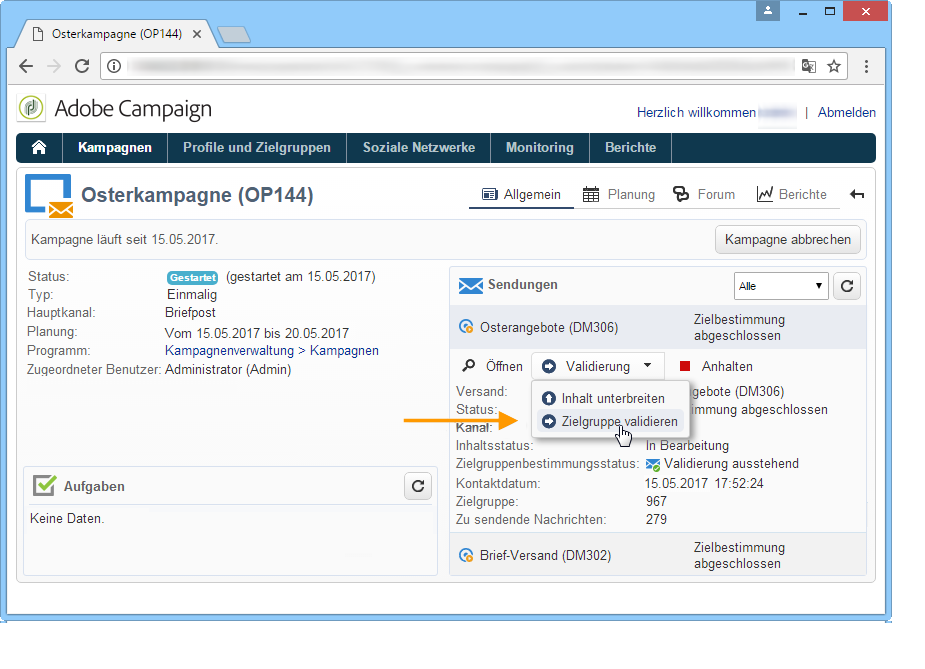

Sie können auch den in den Benachrichtigungsinhalten enthaltenen Link verwenden. Weitere Informationen hierzu finden Sie unter [Kontrolle und Validierung von Sendungen](../../campaign/using/marketing-campaign-approval.md#checking-and-approving-deliveries).

