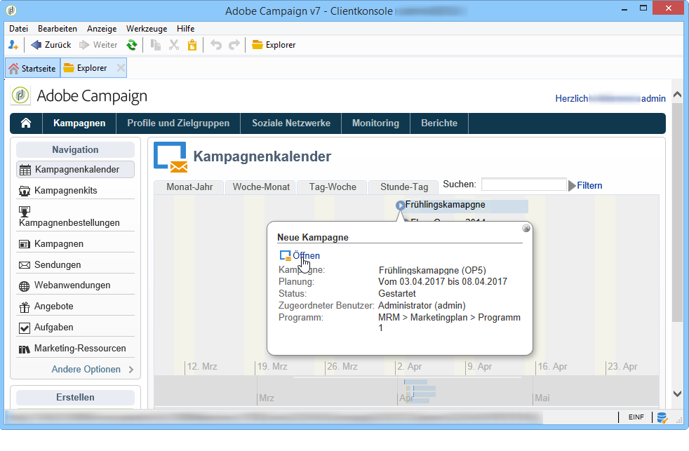

# Zugriff auf Marketingkampagnen{#accessing-marketing-campaigns}

Adobe Campaign ermöglicht die Erstellung, Konfiguration, Ausführung und Analyse von Marketingkampagnen. Die Anwendung stellt somit ein umfassendes Steuerungszentrum dar, über das alle Marketingkampagnen verwaltet werden können.

## Grundlagen zum Arbeitsbereich {#workspace-basics}

### Startseite  {#home-page}

Unmittelbar nach der Herstellung der Verbindung mit Adobe Campaign gelangen Sie auf die Startseite.

Klicken Sie auf die Links in der Navigationsleiste, um auf die verschiedenen Universen zuzugreifen.

Kampagnenelemente befinden sich im **[!UICONTROL Campaigns]** Universum: hier können Sie einen Überblick über die Marketingprogramme und Kampagnen sowie deren Untergruppen sehen. Ein Marketingprogramm besteht aus Kampagnen, die aus Lieferungen, Aufgaben, verknüpften Ressourcen usw. bestehen. Im Zusammenhang mit dem Marketing-Kampagnenmanagement mithilfe von Campaign finden sich die Informationen zu Lieferungen, Budgets, Reviewern und verknüpften Dokumenten in den Kampagnen.

Der Navigationsblock des **[!UICONTROL Campaigns]** Universums bietet je nach installierten Modulen verschiedene Einträge. Sie können beispielsweise auf Folgendes zugreifen:

* **Kampagnenkalender**: Planungs-, Marketing-, Liefer- und Kampagnenkalender. Siehe [Kampagnenkalender](#campaign-calendar).
* **Kampagnen**: Zugriff auf alle in Marketingprogrammen enthaltene Kampagnen;
* **Sendungen**: Zugriff auf in Kampagnen enthaltene Sendungen;
* **Webanwendungen**: Zugriff auf Webanwendungen (Formulare, Umfragen etc.).

>[!NOTE]
>
>Der strukturelle Aufbau der Adobe-Campaign-Konsole, Berechtigungen sowie die Profilverwaltung werden in [diesem Abschnitt](../../platform/using/adobe-campaign-workspace.md) beschrieben.
>
>Im Zusammenhang mit Kanälen und Sendungen stehende Funktionalitäten werden in [diesem Abschnitt](../../delivery/using/communication-channels.md) erläutert.

### Kampagnenkalender {#campaign-calendar}

Jede Kampagne gehört zu einem Programm, das wiederum zu einem Plan gehört. Pläne, Programme und Kampagnen werden über das **[!UICONTROL Campaign calendar]** Menü im **Kampagnenuniversum** aufgerufen.

To edit a plan, program, campaign or delivery, click its name in the calendar and then click **[!UICONTROL Open...]**. It is then displayed in a new tab, as shown below:

Sie können die im Kampagnenkalender angezeigten Informationen filtern. Klicken Sie dazu auf den **[!UICONTROL Filter]** Link und wählen Sie die Filterkriterien aus.

>[!NOTE]
>
>Bei Nutzung der Datumsfilter werden alle Kampagnen angezeigt, deren Beginn nach dem angegeben Datum und/oder deren Ende vor dem angegebenen Datum liegt. Die Daten müssen über die rechts von den Feldern verfügbaren Kalender ausgewählt werden.

You can also use the **[!UICONTROL Search]** field to filter the displayed items.

Die den Elementen zugeordneten Symbole geben Auskunft über ihren jeweiligen Status: Abgeschlossen, In Gang, In Bearbeitung usw.

### Navigation in einem Marketingprogramm {#browsing-in-a-marketing-program}

Campaign ermöglicht die Verwaltung von Programmen, die aus unterschiedlichen Marketingkampagnen bestehen. Jede dieser Kampagnen setzt sich wiederum aus Sendungen und mit diesen verbundenen Vorgängen und Ressourcen zusammen.

#### In einem Programm navigieren {#browsing-a-program}

Zur Konfiguration und Bearbeitung eines Programms stehen die folgenden Tabs zur Verfügung:

* Im Tab **Planung** können Sie den Programmkalender entweder nach Monat, Woche oder Tag angezeigen lassen, indem Sie auf den jeweiligen Tab klicken.

   Bei Bedarf können an dieser Stelle auch Programme, Kampagnen oder Aufgaben erstellt werden.

   

* Über den Tab **Bearbeiten** kann das Programm konfiguriert und verändert werden (Name, Beginn und Ende, Budget, benötigte Dokumente usw.).

   

#### Kampagnen durchsuchen {#browsing-campaigns}

Campaigns can be accessed via the campaign calendar, the **[!UICONTROL Schedule]** tab of the program, or the list of campaigns.

1. Via the campaign calendar, select the campaign you want to display, then click the **[!UICONTROL Open]** link.

   

   Die Kampagne öffnet sich daraufhin in einem neuen Tab:

   

1. Via the **[!UICONTROL Schedule]** tab of the program, the edit mode is the same as via the campaign calendar.
1. Via the **[!UICONTROL Campaigns]** link of the **[!UICONTROL Campaigns]** universe, click the name of the campaign you want to edit.

   

### Steuerung einer Kampagne {#controlling-a-campaign}

#### Dashboard {#dashboard}

Alle Kampagnen, Vorgänge und Ressourcen werden auf einem zentralen Bildschirm, dem Dashboard, zusammengefasst, um eine kollaborative Verwaltung der Marketingaktionen zu ermöglichen.

Das Dashboard einer Kampagne wird wie eine Kontrollschnittstelle verwendet. Es ermöglicht den direkten Zugriff auf die wichtigsten Etappen der Kampagnenerstellung und -verwaltung: Sendungen, Extraktonsdateien, Benachrichtigungen, Budgets usw.

Adobe Campaign ermöglicht den Einsatz kollaborativer Prozesse zur Ausführung und Validierung der unterschiedlichen Etappen von Marketing- und Kommunikationskampagnen, darunter die Budget-, Zielgruppen- und Inhaltsvalidierung.

>[!NOTE]
>
>The configuration of campaign templates is presented in [Campaign templates](../../campaign/using/marketing-campaign-templates.md#campaign-templates).

#### Planung {#schedule}

Eine Kampagne umfasst mehrere Sendungen. Die Planung einer Kampagne bietet eine Gesamtübersicht ihrer Bestandteile sowie einen einfachen Zugriff auf diese.

#### Forum {#forum}

Jede Kampagne verfügt über ein dediziertes Forum, in dem beteiligte Benutzer Nachrichten austauschen können.

For more on this, refer to [Discussion forums](../../campaign/using/discussion-forums.md).

#### Berichte {#reports}

The **[!UICONTROL Reports]** link lets you access the campaign reports.

>[!NOTE]
>
>Weitere Informationen zu Berichten finden Sie in [diesem Abschnitt](../../reporting/using/about-adobe-campaign-reporting-tools.md).

#### Konfiguration {#configuration}

Kampagnen werden basierend auf Kampagnenvorlagen erstellt. Diese wiederverwendbaren Vorlagen werden so konfiguriert, dass bestimmte Optionen und Einstellungen bereits ausgewählt und gespeichert sind. Für jede Kampagne stehen folgende Funktionalitäten zur Verfügung:

* Dokumente und Ressourcen referenzieren: Sie können der Kampagne Dokumente zuordnen (kurz, Bericht, Bilder usw.). Alle Dokumentformate werden unterstützt. Siehe [Verwalten zugehöriger Dokumente](../../campaign/using/marketing-campaign-deliveries.md#managing-associated-documents).
* Definieren der Kosten: Mit Adobe Campaign können Sie für jede Kampagne Kosteneinträge und Kostenberechnungsstrukturen definieren, die bei der Erstellung der Marketing-Kampagne verwendet werden können.Beispiel: Druckkosten, Nutzung einer externen Agentur, Zimmervermietung usw. Siehe [Definieren von Kostenkategorien](../../campaign/using/providers--stocks-and-budgets.md#defining-cost-categories).
* Zielgruppenbestimmung: Im Rahmen einer Kampagne können quantifizierbare Zielvorgaben bestimmt werden, wie z.B. eine zu erreichende Anzahl an Anmeldungen zu einem Event oder ein zu erzielender Umsatz. Diese Informationen werden anschließend in den Kampagnenberichten ausgewertet.
* Managing seed addresses (for more on this, refer to [this section](../../delivery/using/about-seed-addresses.md)) and control groups (refer to [Defining a control group](../../campaign/using/marketing-campaign-deliveries.md#defining-a-control-group)).
* Verwalten von Genehmigungen: Sie können die zu genehmigenden Behandlungen auswählen und bei Bedarf die Prüfer oder Gruppen von Operatoren auswählen. See [Checking and approving deliveries](../../campaign/using/marketing-campaign-approval.md#checking-and-approving-deliveries).

>[!NOTE]
>
>To access the campaign configurations and make changes to them, click the **[!UICONTROL Advanced campaign parameters...]** link in the **[!UICONTROL Edit]** tab. Weitere Informationen zum Festlegen von Parametern auf Kampagnenebene, damit die Auslieferungen automatisch Werte erben, finden Sie in [unserer Technote](https://helpx.adobe.com/campaign/kb/simplifying-campaign-management-acc.html#Setparametersatthecampaignlevelsodeliveriesinheritvaluesautomatically).

## Webzugriff {#using-the-web-interface-}

Sie haben die Möglichkeit, über einen Webbrowser auf die Adobe-Campaign-Konsole zuzugreifen, um alle Kampagnen und ihre Sendungen sowie Berichte und Informationen bezüglich der Profile Ihrer Datenbank einzusehen. Über den Webzugriff können keine Datensätze erstellt werden. Sie können jedoch eingesehen und entsprechend der jeweiligen Benutzerberechtigungen weiterverarbeitet werden. So können beispielsweise Inhalte und Zielgruppen der Kampagnen validiert oder Sendungen unterbrochen werden.

1. Melden Sie sich wie gewohnt über https://`<your instance>:<port>/view/home`an.
1. Über die unterschiedlichen Rubriken besteht Zugriff auf Listen und weitere Navigationselemente.

   

Validierungen (beispielsweise einer Zielgruppe oder des Inhalts eines Versands) können über die Webschnittstelle erfolgen.

Sie können auch den Link in den Benachrichtigungsmeldungen verwenden. Weitere Informationen finden Sie unter [Überprüfen und Genehmigen von Lieferungen](../../campaign/using/marketing-campaign-approval.md#checking-and-approving-deliveries).
