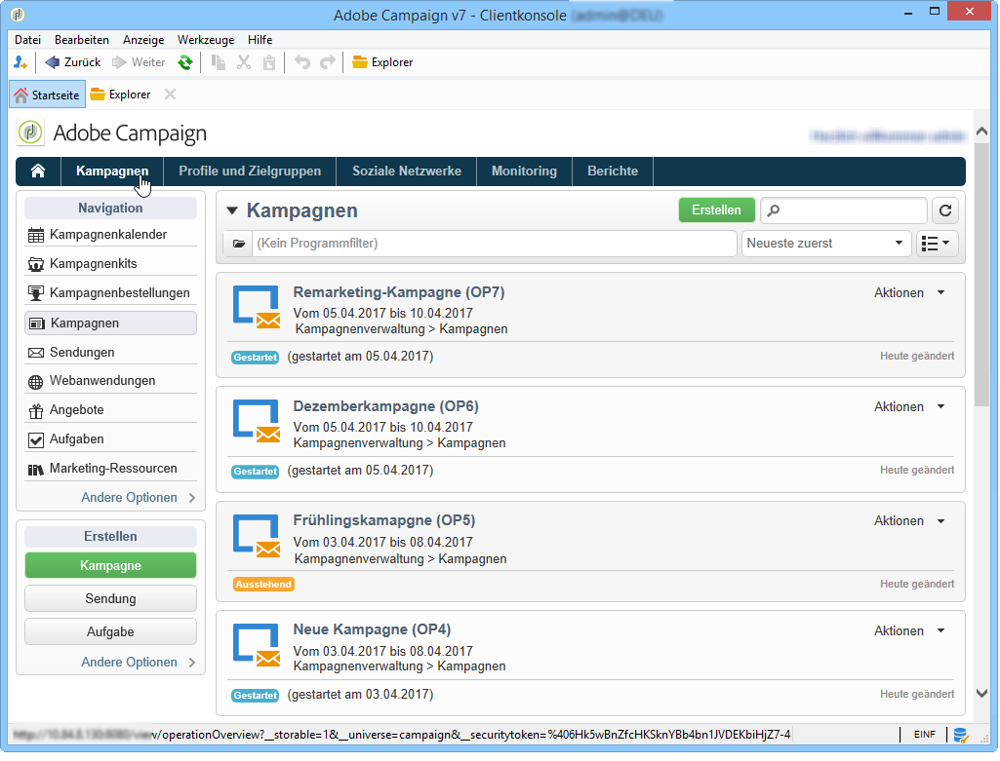
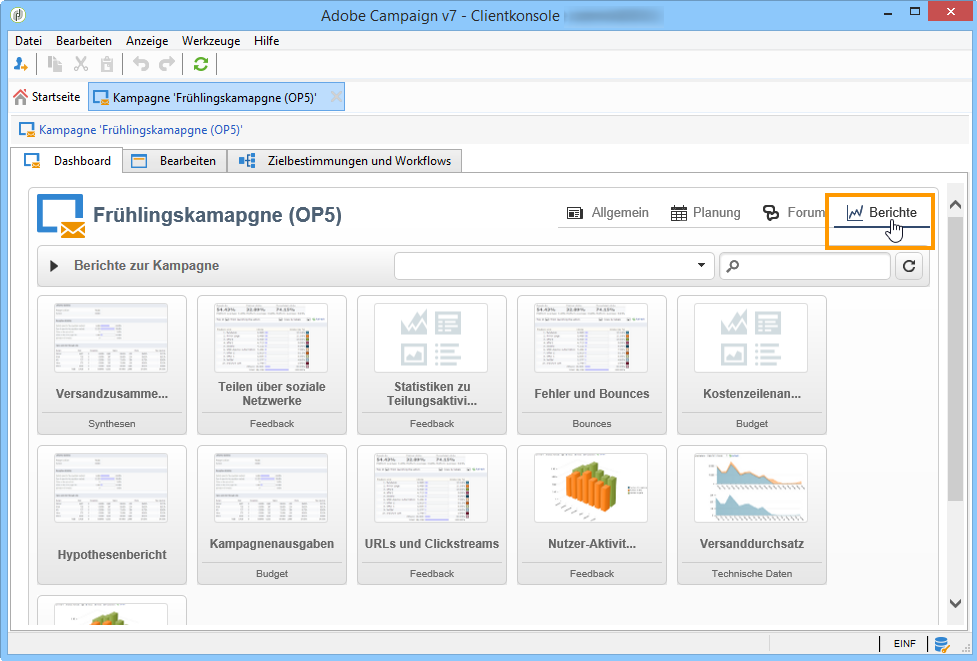

# Auf Marketing-Kampagnen zugreifen{#accessing-marketing-campaigns}

Adobe Campaign ermöglicht die Erstellung, Konfiguration, Ausführung und Analyse von Marketingkampagnen. Die Anwendung stellt somit ein umfassendes Steuerungszentrum dar, über das alle Marketingkampagnen verwaltet werden können.

## Grundlagen zum Arbeitsbereich {#workspace-basics}

### Startseite    {#home-page}

Unmittelbar nach der Herstellung der Verbindung mit Adobe Campaign gelangen Sie auf die Startseite.

Klicken Sie auf die Links in der Navigationsleiste, um auf die verschiedenen Rubriken zuzugreifen.

Kampagnenelemente befinden sich in der Rubrik **[!UICONTROL Kampagnen]**: Hier können Sie einen Überblick über die Marketing-Programme und Kampagnen sowie deren Untergruppen sehen. Ein Marketing-Programm besteht aus Kampagnen, die aus Sendungen, Aufgaben, verknüpften Ressourcen usw. bestehen. Im Zusammenhang mit dem Management von Marketing-Kampagnen mithilfe von Campaign sind die Informationen über Sendungen, Budgets, Validierungsverantwortliche und verlinkte Dokumente in den Kampagnen zu finden.

Der Navigationsblock der Rubrik **[!UICONTROL Kampagnen]** bietet je nach den in der Instanz installierten Modulen unterschiedliche Schnellzugriffe. Beispiele für Zugriffsmöglichkeiten:

* **Kampagnenkalender**: Kalender der Pläne, Marketing-Programme, Sendungen und Kampagnen . Siehe [Kampagnenkalender](#campaign-calendar).
* **Kampagnen**: Zugriff auf alle in Marketingprogrammen enthaltene Kampagnen;
* **Sendungen**: Zugriff auf in Kampagnen enthaltene Sendungen;
* **Webanwendungen**: Zugriff auf Webanwendungen (Formulare, Umfragen etc.).

>[!NOTE]
>
>Der strukturelle Aufbau der Adobe-Campaign-Konsole, Berechtigungen sowie die Profilverwaltung werden in [diesem Abschnitt](../../platform/using/adobe-campaign-workspace.md) beschrieben.
>
>Im Zusammenhang mit Kanälen und Sendungen stehende Funktionalitäten werden in [diesem Abschnitt](../../delivery/using/steps-about-delivery-creation-steps.md) erläutert.

### Kampagnenkalender {#campaign-calendar}

Jede Kampagne gehört zu einem Programm, das wiederum Teil eines Plans ist. Pläne, Programme und ihre Kampagnen sind über den Menüpunkt **[!UICONTROL Kampagnenkalender]** der Rubrik **Kampagnen** zugänglich.

Um einen Plan, ein Programm, eine Kampagne oder einen Versand zu bearbeiten, klicken Sie auf den jeweiligen Titel im Kalender und anschließend auf den Link **[!UICONTROL Öffnen...]**. Das gewünschte Element öffnet sich in einem neuen Tab:

Sie haben die Möglichkeit, die im Kampagnenkalender angezeigten Informationen zu filtern. Klicken Sie hierzu auf den Link **[!UICONTROL Filtern]** und wählen Sie die gewünschten Kriterien aus.

>[!NOTE]
>
>Bei Nutzung der Datumsfilter werden alle Kampagnen angezeigt, deren Beginn nach dem angegeben Datum und/oder deren Ende vor dem angegebenen Datum liegt. Die Daten müssen über die rechts von den Feldern verfügbaren Kalender ausgewählt werden.

Sie können zur Filterung der angezeigten Elemente auch das Feld **[!UICONTROL Suchen]** verwenden.

Die den Elementen zugeordneten Symbole geben Auskunft über ihren jeweiligen Status: Abgeschlossen, In Gang, In Bearbeitung usw.

### Navigation in einem Marketingprogramm {#browsing-in-a-marketing-program}

Campaign ermöglicht die Verwaltung von Programmen, die aus unterschiedlichen Marketingkampagnen bestehen. Jede dieser Kampagnen setzt sich wiederum aus Sendungen und mit diesen verbundenen Vorgängen und Ressourcen zusammen.

#### In einem Programm navigieren {#browsing-a-program}

Zur Konfiguration und Bearbeitung eines Programms stehen die folgenden Tabs zur Verfügung:

* Im Tab **Planung** können Sie den Programmkalender entweder nach Monat, Woche oder Tag angezeigen lassen, indem Sie auf den jeweiligen Tab klicken.

   Bei Bedarf können an dieser Stelle auch Programme, Kampagnen oder Aufgaben erstellt werden.

   

* Über den Tab **Bearbeiten** kann das Programm konfiguriert und verändert werden (Name, Beginn und Ende, Budget, benötigte Dokumente usw.).

   

#### Kampagnen durchsuchen {#browsing-campaigns}

Kampagnen sind über den Kampagnenkalender, über den Tab **[!UICONTROL Planung]** des entsprechenden Programms und über die Liste der Kampagnen verfügbar:

1. Über den Kampagnenkalender können Sie die gewünschte Kampagne auswählen und auf den Link **[!UICONTROL Öffnen]** klicken.

   

   Die Kampagne öffnet sich daraufhin in einem neuen Tab:

   

1. Über den Tab **[!UICONTROL Planung]** des Programms kann die Kampagne auf die gleiche Weise wie im Kalender geöffnet werden.
1. Über den Link **[!UICONTROL Kampagnen]** in der gleichnamigen Rubrik wird eine Liste aller Kampagnen aufgerufen. Klicken Sie auf den Namen einer Kampagne, um diese zu öffnen.****

   

### Steuerung einer Kampagne {#controlling-a-campaign}

#### Dashboard {#dashboard}

Alle Kampagnen, Vorgänge und Ressourcen werden auf einem zentralen Bildschirm, dem Dashboard, zusammengefasst, um eine kollaborative Verwaltung der Marketingaktionen zu ermöglichen.

Das Dashboard einer Kampagne wird wie eine Kontrollschnittstelle verwendet. Es ermöglicht den direkten Zugriff auf die wichtigsten Etappen der Kampagnenerstellung und -verwaltung: Sendungen, Extraktonsdateien, Benachrichtigungen, Budgets usw.

Adobe Campaign ermöglicht den Einsatz kollaborativer Prozesse zur Ausführung und Validierung der unterschiedlichen Etappen von Marketing- und Kommunikationskampagnen, darunter die Budget-, Zielgruppen- und Inhaltsvalidierung.

>[!NOTE]
>
>Die Konfiguration von Kampagnenvorlagen wird im Abschnitt [Kampagnenvorlagen](../../campaign/using/marketing-campaign-templates.md#campaign-templates) beschrieben.

#### Planung {#schedule}

Eine Kampagne umfasst mehrere Sendungen. Die Planung einer Kampagne bietet eine Gesamtübersicht ihrer Bestandteile sowie einen einfachen Zugriff auf diese.

#### Forum {#forum}

Jede Kampagne verfügt über ein dediziertes Forum, in dem beteiligte Benutzer Nachrichten austauschen können.

Weitere Informationen hierzu finden Sie unter [Diskussionsforen](../../campaign/using/discussion-forums.md).

#### Berichte {#reports}

Über den Link **[!UICONTROL Berichte]** können die Kampagnenberichte eingesehen werden.

>[!NOTE]
>
>Weitere Informationen zu Berichten finden Sie in [diesem Abschnitt](../../reporting/using/about-adobe-campaign-reporting-tools.md).

#### Konfiguration {#configuration}

Kampagnen werden basierend auf Kampagnenvorlagen erstellt. Diese wiederverwendbaren Vorlagen werden so konfiguriert, dass bestimmte Optionen und Einstellungen bereits ausgewählt und gespeichert sind. Für jede Kampagne stehen folgende Funktionalitäten zur Verfügung:

* Referenzierung von Dokumenten und Ressourcen: Es besteht die Möglichkeit, der Kampagne Dokumente hinzuzufügen (Anweisungen, Zusammenfassungen, Bilder usw.). Alle Dateiformate werden unterstützt. Siehe [Zugeordnete Dokumente verwalten](../../campaign/using/marketing-campaign-deliveries.md#managing-associated-documents).
* Kostenbestimmung: Adobe Campaign ermöglicht es, für jede Kampagne Kostenstellen und Berechnungsstrukturen für Kosten festzulegen, die im Rahmen der Ausführung einer Marketing-Kampagne verwendet werden können, z. B.: Druckkosten, Inanspruchnahme eines externen Dienstleisters, Saalmiete usw. Siehe [Bestimmung der Kostenstellen](../../campaign/using/providers--stocks-and-budgets.md#defining-cost-categories).
* Zielgruppenbestimmung: Im Rahmen einer Kampagne können quantifizierbare Zielvorgaben bestimmt werden, wie z.B. eine zu erreichende Anzahl an Anmeldungen zu einem Event oder ein zu erzielender Umsatz. Diese Informationen werden anschließend in den Kampagnenberichten ausgewertet.
* Verwaltung von Testadressen (weitere Informationen hierzu finden Sie in [diesem Abschnitt](../../delivery/using/about-seed-addresses.md)) und Kontrollgruppen (siehe [Kontrollgruppen festlegen](../../campaign/using/marketing-campaign-deliveries.md#defining-a-control-group)).
* Validierungsverwaltung: Sie können die zu validierenden Vorgänge sowie bei Bedarf validierungsverantwortliche Benutzer oder Benutzergruppen auswählen. Siehe [Kontrolle und Validierung von Sendungen](../../campaign/using/marketing-campaign-approval.md#checking-and-approving-deliveries).

>[!NOTE]
>
>Zugriff auf und die Möglichkeit der Änderung von Einstellungen der Kampagne besteht über den Link **[!UICONTROL Erweiterte Kampagnenparameter...]** im Tab **[!UICONTROL Bearbeiten.]** Weitere Informationen zum Festlegen von Parametern auf Kampagnenebene, damit die Sendungen zur Kampagne die Werte automatisch erben, finden Sie in [unserer Technote](https://helpx.adobe.com/de/campaign/kb/simplifying-campaign-management-acc.html#Setparametersatthecampaignlevelsodeliveriesinheritvaluesautomatically).

## Webzugriff {#using-the-web-interface-}

Sie haben die Möglichkeit, über einen Webbrowser auf die Adobe-Campaign-Konsole zuzugreifen, um alle Kampagnen und ihre Sendungen sowie Berichte und Informationen bezüglich der Profile Ihrer Datenbank einzusehen. Über den Webzugriff können keine Datensätze erstellt werden. Sie können jedoch eingesehen und entsprechend der jeweiligen Benutzerberechtigungen weiterverarbeitet werden. So können beispielsweise Inhalte und Zielgruppen der Kampagnen validiert oder Sendungen unterbrochen werden.

1. Melden Sie sich wie gewohnt über https://`<your instance>:<port>/view/home` an.
1. Über die unterschiedlichen Rubriken besteht Zugriff auf Listen und weitere Navigationselemente.

   

Validierungen (beispielsweise einer Zielgruppe oder des Inhalts eines Versands) können über die Webschnittstelle erfolgen.

Sie können auch den in den Benachrichtigungsinhalten enthaltenen Link verwenden. Weitere Informationen hierzu finden Sie unter [Kontrolle und Validierung von Sendungen](../../campaign/using/marketing-campaign-approval.md#checking-and-approving-deliveries).
