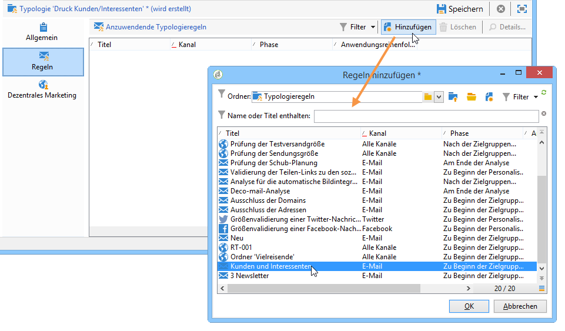
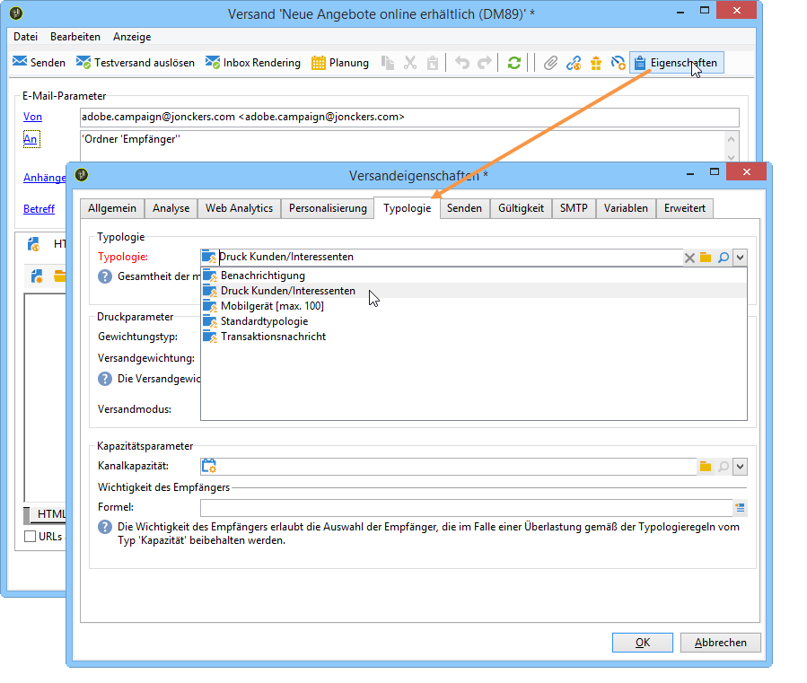
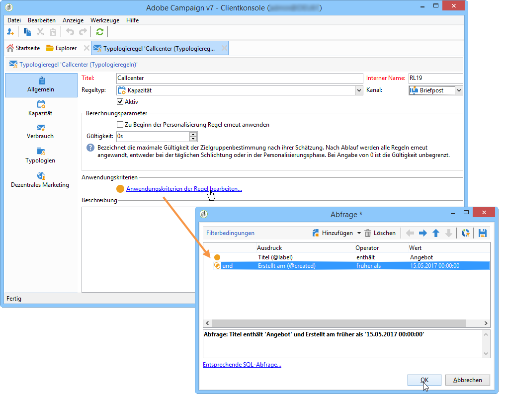
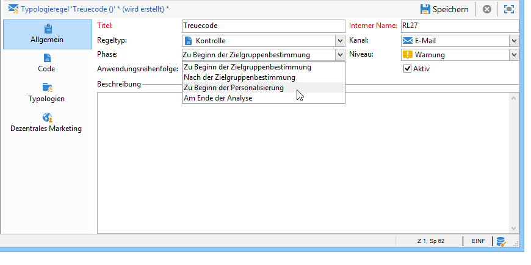
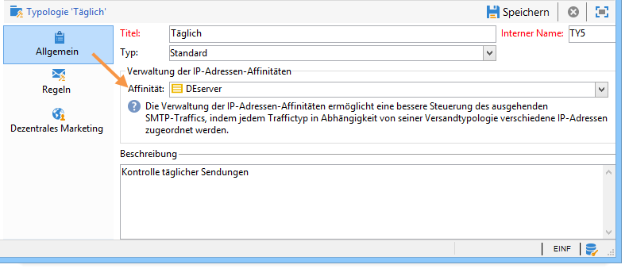
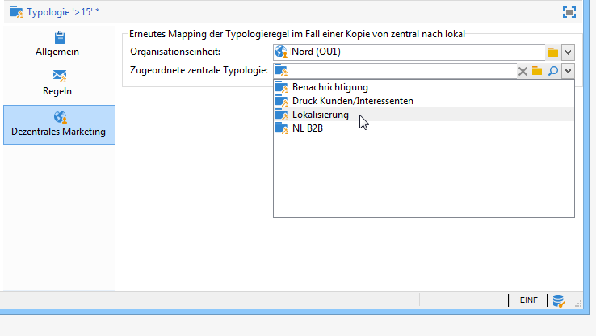

# Regeln anwenden{#applying-rules}

## Typologien auf Sendungen anwenden {#applying-a-typology-to-a-delivery}

Um die von Ihnen erstellten Typologieregeln anzuwenden, müssen Sie sie mit einer Typologie verknüpfen und diese in Ihrer Sendung referenzieren. Gehen Sie hierzu wie folgt vor:

1. Erstellen Sie eine Kampagnentypologie.

   Der Zugriff auf Typologien erfolgt über den Knoten **[!UICONTROL Administration > Campaign Management > Typology management]** > **[!UICONTROL Typologies]** .

1. Go to the **[!UICONTROL Rules]** tab, click the **[!UICONTROL Add]** button and select the rules to apply with this typology.

   

1. Speichern Sie die Typologie, um sie der Liste der bereits vorhandenen Typologien hinzuzufügen.
1. Öffnen Sie die Sendung, auf die Sie die Regeln anwenden möchten.
1. Open the delivery properties and access the **[!UICONTROL Typology]** tab.
1. Wählen Sie die Typologie in der Dropdown-Liste aus.

   

   >[!NOTE]
   >
   >Die Typologie kann auf Ebene der Versandvorlage festgelegt werden, um sie automatisch auf alle mit der jeweiligen Vorlage erstellten Sendungen anzuwenden.

## Anwendungskriterien bestimmen {#defining-application-conditions}

Es besteht die Möglichkeit, das Anwendungsfeld einer Regel Ihren Bedürfnissen entsprechend einzuschränken (mit Ausnahme von Kontrollregeln).

Typologieregeln können demnach so konfiguriert werden, dass sie nur bestimmte Sendungen, in denen sie referenziert sind, oder nur bestimmte Empfänger einer Sendung betreffen.

Um die Anwendungsbedingungen einer Regel zu definieren, klicken Sie auf den **[!UICONTROL Edit the rule application conditions...]** Link auf der **[!UICONTROL General]** Registerkarte.

Bestimmen Sie nun im Abfrage-Editor die Filterbedingungen. Im unten stehenden Beispiel betrifft die Kapazitätsregel nur Sendungen, die den Begriff &quot;Angebot&quot; im Betreff enthalten, und solche, die vor dem 1. April 2013 erstellt wurden.

>[!NOTE]
>
>Für Filterregeln können Sie die Anwendungsbedingung des Filterkriteriums auswählen: Sie können von der Lieferung oder dem Lieferplan abhängen. Weitere Informationen finden Sie unter [Bedingungen für eine Filterregel](../../campaign/using/filtering-rules.md#conditioning-a-filtering-rule).

## Berechnungsfrequenz anpassen {#adjusting-calculation-frequency}

Schlichtungen werden jede Nacht automatisch durch den Datenbankbereinigungs-Workflow neu ausgeführt. Bereits berechnete Werte, die sich nicht täglich verändern, können jedoch beibehalten werden, um die Datenbank nicht zu überlasten.

Wenn beispielsweise ein Prozess die Marketingdatenbank wöchentlich mit Neigungsscores und Bestelldaten der Kunden anreichert, ist es nicht notwendig, auf diesen Werten basierende Daten täglich neu zu berechnen.

Zu diesem Zweck können Sie im **[!UICONTROL Frequency]** Feld der **[!UICONTROL General]** Registerkarte einen maximalen Zeitraum festlegen, in dem das Targeting gespeichert wird. Standardmäßig gibt der Wert **0** an, dass die Berechnung bis zur nächsten Ausführung des täglichen Neuschiedsverfahrens gültig bleibt.

To save the results beyond this period, enter a value greater than 12 in the **[!UICONTROL Frequency]** field: once this period expires, all rules are re-applied.

Mit der **[!UICONTROL Re-apply the rule at the start of personalization]** Option können Sie die Regel während der Personalisierungsphase automatisch anwenden, auch wenn der im Feld angegebene Zeitraum noch gültig ist **[!UICONTROL Frequency]** .

## Phase der Regelanwendung auswählen {#selecting-the-rule-application-phase}

Typologieregeln werden in einer spezifischen Reihenfolge je nach Konfiguration zum Zeitpunkt der Zielgruppenbestimmung, Analyse bzw. Personalisierung des Versands angewendet.

### Anwendungsreihenfolge {#execution-order}

Im Standard-Ausführungsmodus werden die Regeln in der folgenden Reihenfolge ausgeführt:

1. Kontrollregeln, wenn sie zu Beginn der Zielgruppenbestimmung angewendet werden
1. Filterregeln:

   * Nativ in der Anwendung enthaltene Regeln für die Adressenqualifizierung: definierte Adressen/nicht überprüfte Adressen/Adressen auf der Blacklist/Adressen in Quarantäne/Adressenqualität
   * Vom Benutzer definierte Filterregeln
   * Regeln zur Adress- oder Kennungsdeduplizierung (bei Bedarf angewandt);

1. Druckregeln;
1. Kapazitätsregeln;
1. Kontrollregeln, wenn sie am Ende der Zielgruppenbestimmung angewendet werden
1. Kontrollregeln, wenn sie sich auf den Beginn der Personalisierung beziehen. Wenn die Gültigkeitsfrist der benutzerdefinierten Regeln (Kontrolle/Druck/Kapazität) abgelaufen ist und sie daher neu zu berechnen sind, so werden sie in dieser Phase erneut angewandt.
1. Kontrollregeln, wenn sie sich auf das Ende der Personalisierung beziehen.

>[!NOTE]
>
>Wenn Sie das Modul &quot;Interaction&quot; nutzen, werden die Eignungsregeln gleichzeitig mit den Filterregeln (für Angebote in Versandentwürfen) oder während der Personalisierungsphase beim Aufruf des Angebotsmoduls angewendet.

Sie können die Ausführungsreihenfolge von Regeln mit demselben Typ mithilfe des entsprechenden Felds auf der **[!UICONTROL General]** Registerkarte der Regel anpassen. Wenn mehrere Regeln während derselben Meldungsverarbeitungsphase ausgeführt werden, können Sie deren Ausführungsreihenfolge im **[!UICONTROL Execution sequence]** Feld konfigurieren.

Beispielsweise wird eine Druckregel mit einer Anwendungsreihenfolge von 20 vor einer Druckregel mit einem Wert von 30 ausgeführt.

### Kontrollregeln {#control-rules}

Für **[!UICONTROL Control]** Regeln können Sie festlegen, an welchem Punkt des Bereitstellungszeitraums die Regel angewendet wird (vor oder nach dem Targeting, zu Beginn der Personalisierung, am Ende der Analyse). Select the value to apply in the drop-down list of the **[!UICONTROL Phase]** field, in the **[!UICONTROL General]** tab of the typology rule.

Mögliche Werte:

* **[!UICONTROL At the start of targeting]**

   Die Kontrollregel kann in dieser Phase angewandt werden, um im Falle eines Fehlers die Personalisierungsetappe nicht auszuführen.

* **[!UICONTROL After targeting]**

   Wenn Sie die Größe der Zielgruppe kennen müssen, um die Kontrollregel anzuwenden, wählen Sie diese Phase aus.

   For example, the **[!UICONTROL Check proof size]** control rule applies after each targeting stage: this rule prevents message personalization if there are too many proof recipients.

* **[!UICONTROL At the start of personalization]**

   Diese Phase wird ausgewählt, wenn die Kontrolle die Validierung der Nachrichtenpersonalisierung betrifft. Die Nachrichtenpersonalisierung wird während der Analysephase durchgeführt.

* **[!UICONTROL At the end of the analysis]**

   Wenn für eine Überprüfung die Nachrichtenpersonalisierung abgeschlossen sein muss, wählen Sie diese Phase aus.

## Ergänzende Konfigurationen {#additional-configurations}

### Ausgehenden SMTP-Traffic steuern {#control-outgoing-smtp-traffic}

Als Option können Sie das **[!UICONTROL Managing affinities with IP addresses]** Feld verwenden, um Auslieferungen mit dem Lieferserver (MTA) zu verknüpfen. Auf diese Weise können Sie die Anzahl der E-Mails für bestimmte Auslieferungen auf Maschinen oder Ausgabeadressen beschränken.

>[!NOTE]
>
>Affinity management does not apply for **[!UICONTROL Filtering]** typologies.\
>Affinitäten werden direkt in der Konfigurationsdatei der Instanz auf dem Adobe-Campaign-Server bestimmt. Weitere Informationen hierzu finden Sie in [diesem Abschnitt](../../installation/using/about-initial-configuration.md).

### Campaign Optimization und Distributed Marketing {#campaign-optimization-and-distributed-marketing}

Auf der **[!UICONTROL Distributed Marketing]** Registerkarte können Sie die Neuzuordnung von Typologien und/oder Regeln definieren, die angewendet werden, wenn eine freigegebene Kampagne angeordnet und/oder reserviert wird. Typologien/Regeln, die für eine lokale Entität definiert wurden (verknüpft mit den für die zentrale Entität definierten) ersetzen Regeln/Typologien, die mit der zentralen Entität verknüpft sind. Mit der Neuzuordnung können Sie die Regeln der zentralen Entität an die lokalen Entitäten anpassen, die die Kampagne bestellen.

>[!NOTE]
>
>Im Zusammenhang mit den Typologien und Typologieregeln wird der Tab **[!UICONTROL Distributed Marketing]** Dezentrales Marketing angeboten, sofern Ihre Lizenz die Option beinhaltet. Überprüfen Sie Ihren Lizenzvertrag.\
>Weitere Informationen zum verteilten Marketing finden Sie unter [Info zum verteilten Marketing](../../campaign/using/about-distributed-marketing.md).

