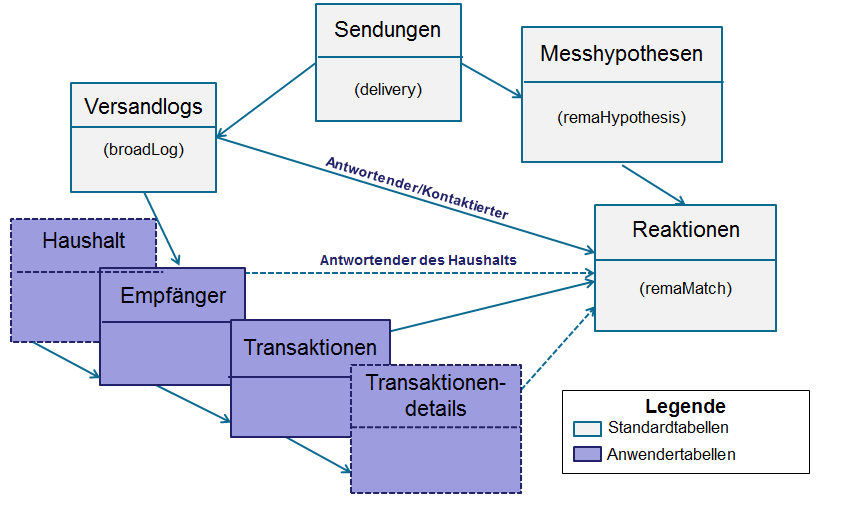
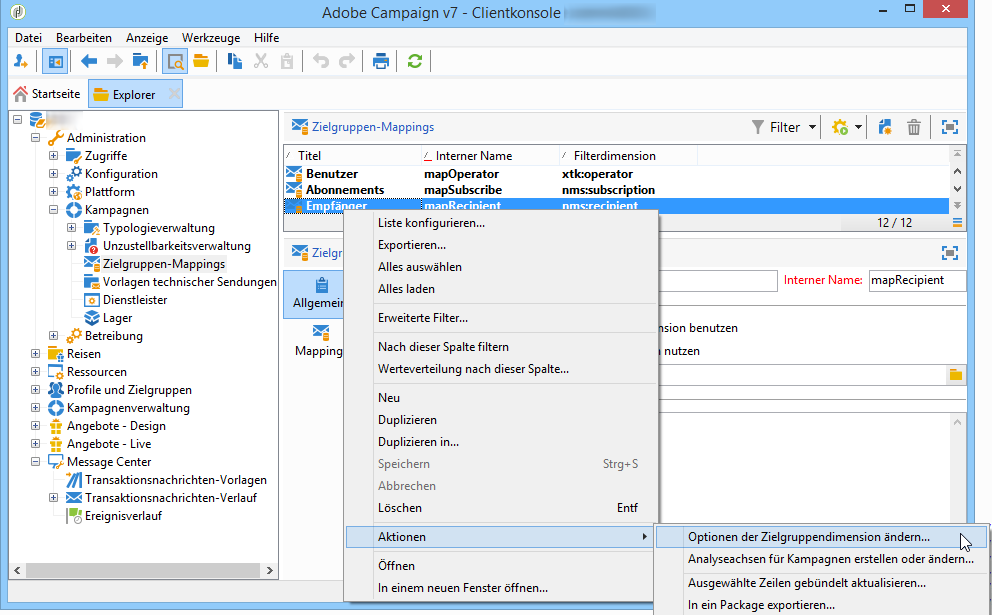
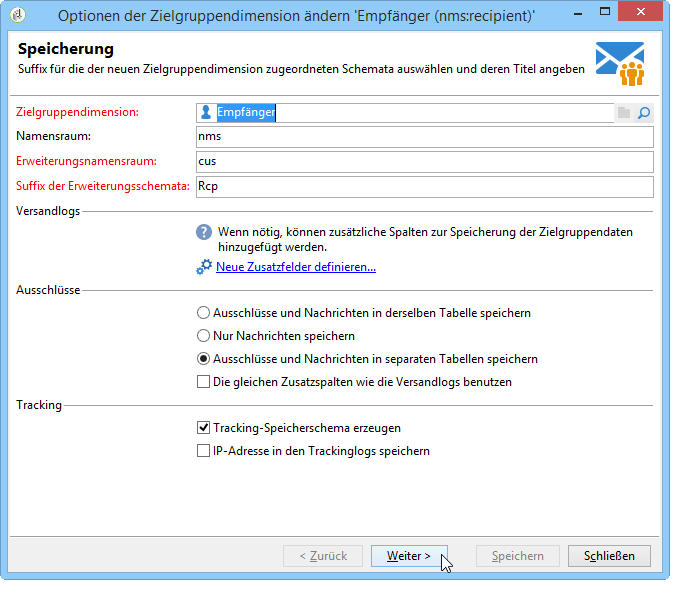
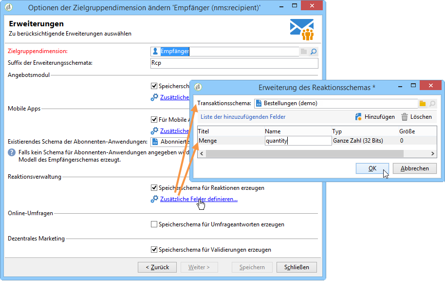

# Konfiguration{#configuration}

Dieses Kapitel richtet sich an die für die Konfiguration der Reaktionsverwaltung zuständigen Benutzer. Die Umsetzung dieser Konfiguration erfordert Kenntnisse über Schemaerweiterung, Workflow-Erstellung und -Verwaltung sowie SQL-Programmierung.

Es wird erklärt, wie die Standard-Datenmodelle den Besonderheiten einer Adobe-Campaign-externen Transaktionstabelle mittels der Individuentabelle angepasst werden. Diese Individuentabelle kann der in Adobe Campaign verfügbaren Empfängertabelle oder einer anderen Tabelle entsprechen.

Messhypothesen werden vom Kampagnenvorgänge-Workflow **[!UICONTROL operationMgt]** gestartet. Jede Hypothese repräsentiert einen separaten Prozess, der asynchron ausgeführt wird und über einen Ausführungsstatus verfügt (In Bearbeitung, Ausstehend, Abgeschlossen etc.). Er unterliegt einer Steuerung, die Prioritätseinschränkungen, Begrenzungen der Anzahl simultaner Prozesse, Zeitpunkte mit geringer Auslastung und die automatische Ausführung mit Ausführungsfrequenz berücksichtigt und verwaltet.

## Schemata konfigurieren {#configuring-schemas}

>[!CAUTION]
>
>Die anwendungseigenen Schemata dürfen nicht verändert werden, da diese im Zuge von Software-Updates verändert oder gelöscht werden können und dies Funktionsstörungen bei der Verwendung von Adobe Campaign zur Folge haben kann. Nutzen Sie stattdessen die Möglichkeit der Schemaerweiterung.

Vor der Anwendung dieser Option müssen die verschiedenen Tabellen (Transaktionen, Transaktionendetails) und ihre Beziehung mit Sendungen, Angeboten und Individuen definiert werden.

### Standardschemata {#standard-schemas}

Das anwendungseigene Schema **[!UICONTROL nms:remaMatch]** enthält die Tabelle der Reaktionslogs d. h. die Relation zwischen Individuen, Hypothese und Transaktionstabelle. Dieses Schema ist als Erbschema für die endgültige Zieltabelle der Reaktionslogs zu verwenden.

Das ebenfalls anwendungseigene Schema **[!UICONTROL nms:remaMatchRcp]** enthält Reaktionslogs der Adobe-Campaign-Empfänger (**[!UICONTROL nms:recipient]**). Um das Schema zu verwenden, muss es zunächst erweitert werden, um anschließend mit der Transaktionstabelle (Bestelldaten) verknüpft werden zu können.

### Transaktionstabellen und -details {#transaction-tables-and-transaction-details}

Die Transaktionstabelle muss über eine direkte Relation mit den Individuen verfügen.

Sie haben darüber hinaus die Möglichkeit, eine die Details der Transaktionen enthaltende Tabelle hinzuzufügen, die selbst nicht direkt mit den Individuen verbunden ist.

Im Fall eines Kassenzettels zum Beispiel ist eine Transaktionstabelle mit dem Kontakt verbunden (die Kassenzettel-Tabelle) und eine zweite Tabelle (die Detailtabelle), welche die Kassenzettelzeilen enthält, ist nur mit der Kassenzettel-Tabelle verbunden. So kann die Hypothese direkt auf Ebene der mit der Kassenzettel-Tabelle verbundenen Detailtabelle (Kassenzettelzeilen) konfiguriert werden.

>[!NOTE]
>
>Wenn Sie die Kennung der Zettelzeilen, die das in der Hypothese erwartete Verhalten beschreibt, beibehalten möchten, können Sie das Schema nms:remaMatchRcp erweitern, um die Kennung hinzuzufügen (in diesem Fall wird diesen Feldern keine ROI-Berechnung zugeordnet).

Es wird zudem dringend empfohlen, ein Ereignisdatum hinzuzufügen.

Die folgende Grafik stellt die Relationen der unterschiedlichen Tabellen nach erfolgter Konfiguration dar:



### Reaktionsverwaltung der Adobe-Campaign-Empfängertabelle {#response-management-with-adobe-campaign-recipients}

In diesem Beispiel wird unter Verwendung der Adobe-Campaign-Empfängertabelle (**[!UICONTROL nms:recipients]**) eine Transaktionstabelle, die die Bestelldaten enthält, in die Reaktionsverwaltung integriert.

Die Tabelle der Antwort-Logs eines **[!UICONTROL nms:remaMatchRcp]**-Empfängers wird erweitert, um einen Link zum Bestelltabelle-Schema hinzuzufügen. Im folgenden Beispiel heißt die Bestelltabelle **demo:purchase**.

1. Gehen Sie im Adobe-Campaign-Explorer in den Knoten **[!UICONTROL Administration]** > **[!UICONTROL Kampagnen]** > **[!UICONTROL Zielgruppen-Mappings]**.
1. Machen Sie einen Rechtsklick auf **Empfänger** und wählen Sie **[!UICONTROL Aktionen]** und **[!UICONTROL Optionen der Zielgruppendimension ändern...]** aus.

   

1. Passen Sie gegebenenfalls in dem sich öffnenden Fenster den **[!UICONTROL Erweiterungsnamensraum]** an und klicken Sie auf **[!UICONTROL Weiter]**.

   

1. Stellen Sie sicher, dass in der Kategorie **[!UICONTROL Reaktionsverwaltung]** die Option **[!UICONTROL Speicherschema für Reaktionen erzeugen]** aktiviert ist.

   Klicken Sie anschließend auf den Link **[!UICONTROL Zusätzliche Felder konfigurieren...]**, um die zugeordnete Transaktionstabelle auszuwählen und der Erweiterung des Schemas nms:remaMatchRcp die gewünschten Felder hinzuzufügen.

   

Folgendes Schema wird daraufhin erstellt:

```
<srcSchema _cs="Reactions (Recipients) (cus)" entitySchema="xtk:srcSchema" extendedSchema="nms:remaMatchRcp" 
img="nms:remaMatch.png" implements="xtk:persist" label="Reactions (Recipients)" mappingType="sql"
name="remaMatchRcp" namespace="cus">  
 <element label="Reactions (Recipients)" name="remaMatchRcp">    
  <key internal="true" name="match">      
   <keyfield xlink="hypothesis"/>      
   <keyfield xlink="broadLog"/>      
   <keyfield xlink="proposition"/>    
  </key>    
  <attribute label="Quantity" name="quantity" type="long"/>    
  <element name="purchase" target="demo:purchase" type="link"/>    
  <element name="hypothesis" revLabel="Reactions (Recipients)" revLink="remaMatchRcp"/>    
  <element applicableIf="HasPackage('nms:coreInteraction')" label="Proposition" name="proposition" target="nms:propositionRcp" type="link"/>   
  <element desc="Message (Delivery log)" label="Message" name="broadLog" target="nms:broadLogRcp" type="link"/>    
  <element label="Respondent" name="responder" target="nms:recipient" type="link"/>  
 </element>  
 <createdBy _cs="Administrator (admin)"/>  
 <modifiedBy _cs="Administrator (admin)"/>
</srcSchema>
```

### Reaktionsverwaltung mit einer benutzerdefinierten Empfängertabelle {#response-management-with-a-personalized-recipient-table}

In diesem Beispiel wird unter Verwendung einer Individuentabelle, also nicht der Adobe-Campaign-Empfängertabelle, eine Tabelle mit Bestelldaten in die Reaktionsverwaltung integriert.

* Erstellung eines neuen Reaktionslog-Schemas basierend auf dem Schema **[!UICONTROL nms:remaMatch]**.

   Da es sich nicht um die Adobe-Campaign-Empfängertabelle handelt, ist es notwendig, ein neues Reaktionslog-Schema auf Grundlage des **[!UICONTROL nms:remaMatch]**-Schemas zu erstellen. Anschließend müssen die Relationen zu den Versandlogs und der die Bestelldaten enthaltenden Transaktionstabelle hinzugefügt werden.

   Im folgenden Beispiel werden das Schema **demo:broadLogPers** und die Transaktionstabelle **demo:purchase** verwendet:

   ```
   <srcSchema desc="Linking of a recipient transaction to a hypothesis"    
   img="nms:remaMatch.png" label="Responses on persons" labelSingular="Responses on a person" name="remaMatchPers" namespace="nms">
     <element name="remaMatchPers" template="nms:remaMatch">
       <key internal="true" name="match">
         <keyfield xlink="hypothesis"/>
        <keyfield xlink="purchase"/>
       </key>
   
       <element name="hypothesis" revLabel="Response logs for persons" revLink="remaMatchPers"/>
       <element applicableIf="HasPackage('nms:interaction')" label="Proposition" name="proposition"
                target="demo:propositionPers" type="link"/>
       <element label="Delivery log" name="broadLog" target="demo:broadLogPers" type="link"/>
     </element>
   </srcSchema>
   ```

* Änderung des Hypothesenformulars im Schema **[!UICONTROL nms:remaHypothesis]**.

   Standardmäßig wird die Liste der Reaktionslogs in den Empfängerlogs angezeigt. Um die neuen, in der vorhergehenden Etappe erstellten Reaktionslogs anzuzeigen, muss daher das Hypothesenformular geändert werden.

   Beispiel:

   ```
    <container type="visibleGroup" visibleIf="[context/@remaMatchStorage]= 'demo:remaMatchPers'">
                 <input hideEditButtons="true" img="nms:remaMatch.png" nolabel="true" refresh="true"
                  toolbarCaption="Responses generated by the hypothesis" type="linklist"
                  xpath="remaMatchPers">
             <input xpath="[.]"/>
             <input xpath="@controlGroup"/>
           </input>
      </container> 
   ```

## Indikatorenverwaltung {#managing-indicators}

Die Option Response Manager wird mit einer Liste vordefinierter Indikatoren geliefert. Sie haben jedoch die Möglichkeit, andere Indikatoren mit benutzerdefinierten Messungen hinzuzufügen.

Erweitern Sie hierzu die Hypothesentabelle, indem Sie zwei Felder für jeden neuen Indikator hinzufügen:

* das erste für die Zielgruppe,
* das zweite für die Kontrollgruppe.

Beispiel:

```
<srcSchema entitySchema="xtk:srcSchema" extendedSchema="nms:remaHypothesis" label="Measurement hypothesis" 
md5="1D4DED54FF8EC2432AED6736EDE6F547" name="remaHypothesis" namespace="demo" xtkschema="xtk:srcSchema">  
    <element name="remaHypothesis">    
        <element name="indicators">      
            <!-- Quantity -->      
            <attribute label="Total contacted" name="contactReactedTotalQuantity" type="long"/>
            <attribute label="Total number of people in the control group" name="proofReactedTotalquantity" type="long"/> 
        </element> 
    </element>
</srcSchema>
```

