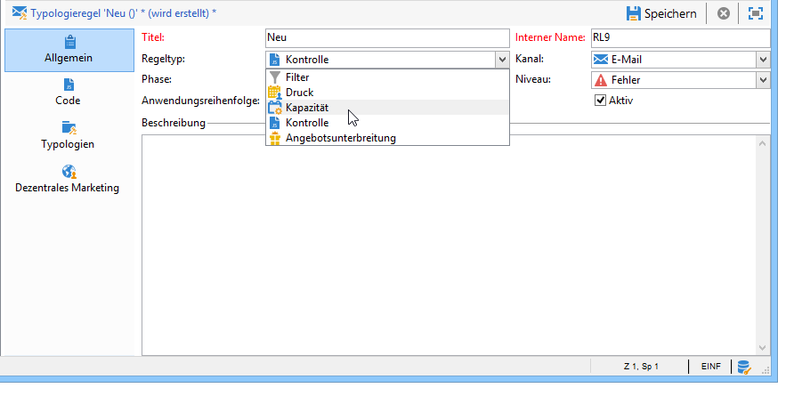
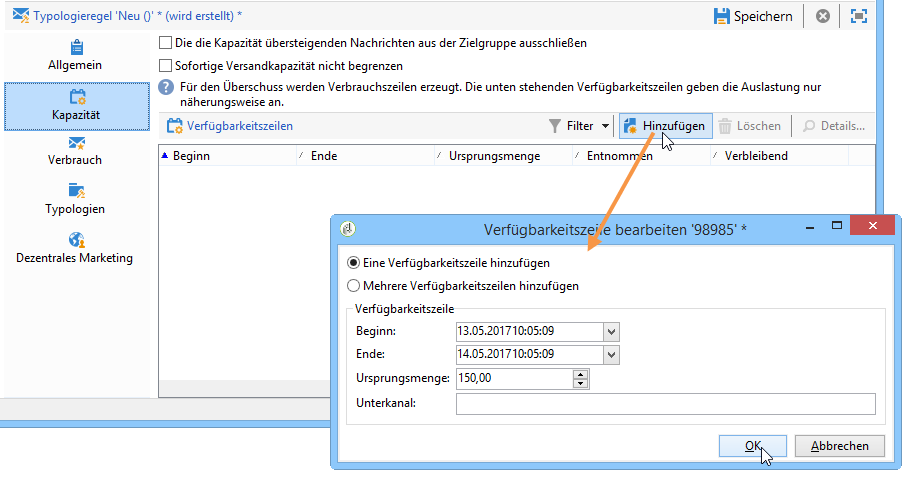
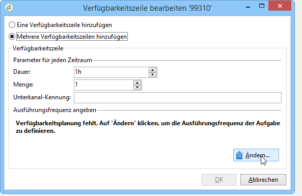
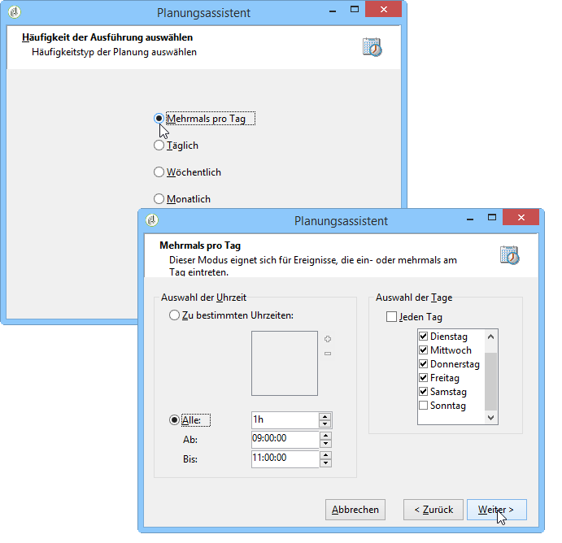
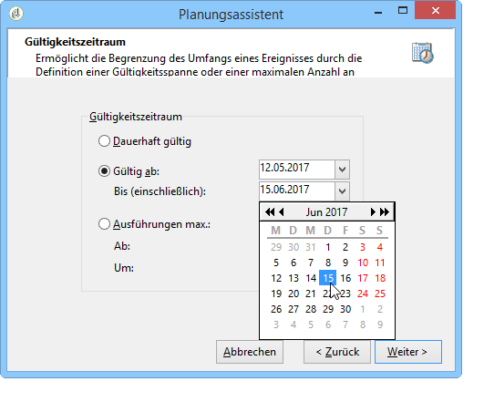
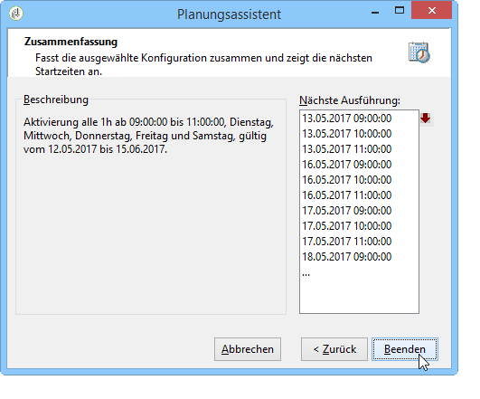
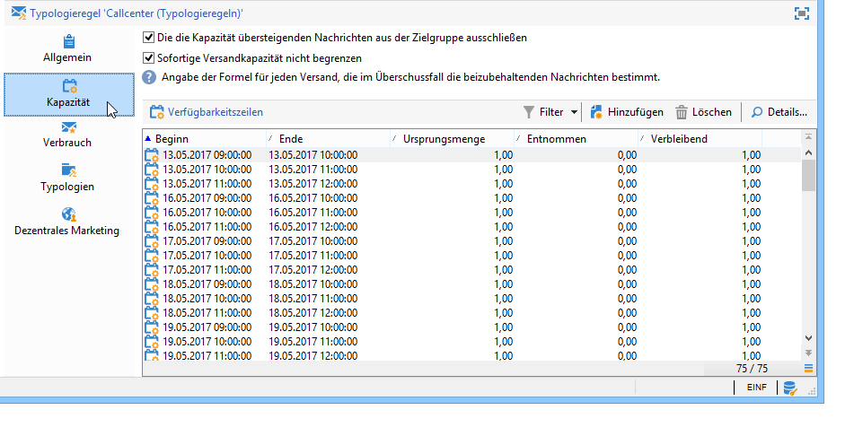
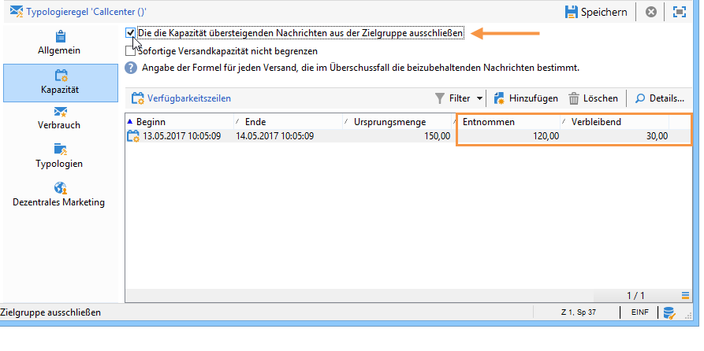
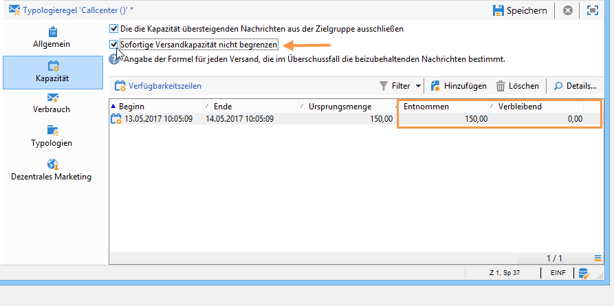
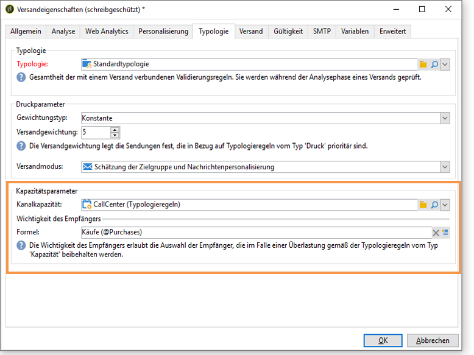

# Kohärenzregeln{#consistency-rules}

## Über Kohärenzregeln {#about-consistency-rules}

Adobe Campaign ermöglicht die Sicherstellung der Kohärenz Ihrer Marketingkommunikation mithilfe einer Reihe von in den Kampagnentypologien enthaltenen Regeln. Diese dienen dazu, die an die Empfänger übermittelten Sendungen in Bezug auf ihr Volumen, ihre Art, ihre Relevanz etc. zu kontrollieren.

**Kapazitätsregeln** können beispielsweise verhindern, dass die Plattform, die von der Auslieferung von Nachrichten betroffen ist, überlastet wird. Beispielsweise dürfen Sonderangebote, die einen Downloadlink enthalten, nicht gleichzeitig an zu viele Personen gesendet werden, um eine Sättigung des Servers zu vermeiden. Telefonkampagnen dürfen die Verarbeitungskapazität von Telefonzentralen usw. nicht überschreiten. For more on this, refer to [Controlling capacity](#controlling-capacity).

## Kontrollieren der Kapazitätsauslastung {#controlling-capacity}

Stellen Sie vor dem Versand von Nachrichten sicher, dass Ihre physische Infrastruktur über ausreichende Kapazitäten verfügt, um sowohl ausgehende als auch eingehende Nachrichten (z. B. Antworten, Bounces, Anrufe im Callcenter etc.) verarbeiten zu können.

To do this, you need to create **[!UICONTROL Capacity]** typology rules.

Im folgenden Beispiel wird eine Typologieregel für eine telefonische Treuekampagne erstellt. Die Regel soll die Anzahl der Nachrichten auf 20 pro Tag begrenzen, entsprechend der Verarbeitungskapazität eines Callcenters. Nachdem die Regel auf zwei Sendungen angewendet wurde, kann die Auslastung über die Logs abgelesen werden.

Gehen Sie wie folgt vor, um eine neue Kapazitätsregel zu erstellen:

1. Klicken Sie unter dem **[!UICONTROL Administration > Campaign management > Typology management > Typology rules]** Knoten auf **[!UICONTROL New]**.
1. Select a **[!UICONTROL Capacity]** rule type.

   

1. Erstellen Sie auf der **[!UICONTROL Capacity]** Registerkarte die Verfügbarkeitszeilen: in unserem Beispiel sind dies Zeiträume, in denen Anrufe durchgeführt werden können. Wählen Sie einen Zeitraum von 24 Stunden und geben Sie 150 in die ursprüngliche Menge ein, was bedeutet, dass das Call-Center 150 Anrufe pro Tag verarbeiten kann.

   

   >[!NOTE]
   >
   >Die Verfügbarkeitszeilen dienen nur als Richtwerte. Sie können bei Bedarf jedoch auch festlegen, dass bei Erreichen der Kapazitätsbegrenzung Nachrichten ausgeschlossen werden. Näheres hierzu finden Sie in [diesem Abschnitt](#exclude-messages-when-capacity-limit-reached).

1. Weisen Sie diese Regel einer Typologie zu und referenzieren Sie die Typologie in Ihrer Sendung, damit die Kapazitätsregel von dieser angewendet wird. Näheres hierzu finden Sie in [diesem Abschnitt](../../campaign/using/applying-rules.md#applying-a-typology-to-a-delivery).
1. You can monitor consumption from the rule **[!UICONTROL Consumptions]** and **[!UICONTROL Capacity]** tabs.

   When a rule is used in a delivery, the **[!UICONTROL Consumed]** and **[!UICONTROL Remaining]** columns provide information on the load, as shown below:

   

   Weiterführende Informationen hierzu finden Sie in [diesem Abschnitt](#monitoring-consumption).

## Maximale Auslastung festlegen {#defining-the-maximum-load}

Um die maximale Auslastung zu definieren, müssen Sie Verfügbarkeitslinien definieren. Dazu stehen zwei Optionen zur Verfügung: Sie können manuell eine oder mehrere Verfügbarkeitszeilen erstellen (siehe [Verfügbarkeitszeilen einzeln](#adding-availability-lines-one-by-one)hinzufügen) oder Verfügbarkeitsbereiche erstellen. Die Häufigkeit dieser Zeiträume kann automatisiert werden (siehe [Hinzufügen einer Reihe von Verfügbarkeitslinien](#add-a-set-of-availability-lines)).

### Verfügbarkeitszeilen einzeln hinzufügen {#adding-availability-lines-one-by-one}

Um eine Verfügbarkeitszeile zu erstellen, klicken Sie auf die **[!UICONTROL Add]** Schaltfläche und wählen Sie **[!UICONTROL Add an availability line]**. Geben Sie den Verfügbarkeitszeitraum und den verfügbaren Ladevorgang ein.

Sie können die Ihrer Verarbeitungskapazität entsprechende Anzahl an Zeilen hinzufügen.

### Mehrere Verfügbarkeitszeilen hinzufügen {#add-a-set-of-availability-lines}

Um die Verfügbarkeitszeiträume für eine bestimmte Zeit zu definieren, klicken Sie auf die **[!UICONTROL Add]** Schaltfläche und wählen Sie die **[!UICONTROL Add a set of availability lines]** Option aus. Geben Sie eine Dauer für jeden Zeitraum und die Anzahl der zu erstellenden Zeiträume an.

To automate the frequency of page creation, click the **[!UICONTROL Change]** button and define time period scheduling.

Zur Erstellung von Verfügbarkeitszeiträumen an Werktagen zwischen 9 und 17 Uhr mit einer Kapazität von 10 Anrufen pro Stunde, folgen Sie den nachstehenden Schritten:

1. Wählen Sie den Häufigkeitstyp und die Gültigkeitszeiträume aus:

   

1. Geben Sie die Gültigkeitsdaten an:

   

1. Überprüfen Sie die Konfiguration, bevor Sie sie beenden:

   

The **[!UICONTROL Forecasting]** workflow automatically creates all matching lines.

>[!NOTE]
>
>Es wird empfohlen, Verfügbarkeitszeilen über einen Dateiimport zu erstellen. Im Kapazität-Tab können die Verfügbarkeitszeilen anschließend eingesehen und überprüft werden.

## Nachrichten bei Erreichen der Kapazitätsbegrenzung ausschließen {#exclude-messages-when-capacity-limit-reached}

Verfügbarkeitslinien dienen nur zu Informationszwecken. Um überschüssige Nachrichten auszuschließen, aktivieren Sie die **[!UICONTROL Exclude from the target messages in excess of capacity]** Option. Dadurch wird verhindert, dass die Kapazität überschritten wird. Für dieselbe Population wie im vorigen Beispiel darf der Verbrauch und die Restkapazität die ursprüngliche Menge nicht überschreiten:

Die Anzahl der zu verarbeitenden Meldungen wird gleichmäßig über den definierten Verfügbarkeitsbereich aufgeschlüsselt. Dies gilt insbesondere für Call-Center, da die maximale Anzahl von Anrufen pro Tag begrenzt ist. Bei E-Mail-Auslieferungen können Sie mit der **[!UICONTROL Do not limit instantaneous delivery capacity]** Option diesen Verfügbarkeitsbereich ignorieren und gleichzeitig Ihre E-Mails versenden.

>[!NOTE]
>
>Bei Überlastung werden die beizubehaltenden Nachrichten nach einer in den Versandeigenschaften bestimmten Formel ausgewählt.

## Verbrauch kontrollieren {#monitoring-consumption}

Standardmäßig dienen Kapazitätsregeln nur Anzeigezwecken. Wählen Sie die **[!UICONTROL Exclude messages in excess of capacity from the target]** Option, um zu verhindern, dass die definierte Last überschritten wird. In diesem Fall werden überschüssige Nachrichten automatisch mit dieser Typologieregel aus den Lieferungen ausgeschlossen.

To monitor consumptions, view the values displayed in the **[!UICONTROL Consumed]** column of the **[!UICONTROL Capacity]** tab in the typology rule.

To view consumption lines, click the **[!UICONTROL Consumptions]** tab in the rule.
