# Verwaltung von Budgets{#controlling-costs}

## Über die Budgetverwaltung {#about-cost-control}

Adobe Campaign ermöglicht mit dem MRM-Modul die Kontrolle der geplanten, eingesetzten und berechneten Marketing-Kosten sowie ihre Verteilung nach Kategorie.

Die für die unterschiedlichen Kampagnenvorgänge anfallenden Kosten werden einem zuvor festgesetzten Budget zugeteilt. Die Beträge können in verschiedene Kategorien verteilt werden, um eine bessere Lesbarkeit und detailliertere Berichte der Marketingkosten zu ermöglichen.

Die Budgetverwaltung und -verfolgung sind in einem dedizierten Knoten des Adobe-Campaign-Navigationsbaums zentralisiert. Von hier aus können Sie alle Budgets sowie die zugeteilten, reservierten, eingesetzten und verbrauchten Beträge kontrollieren.

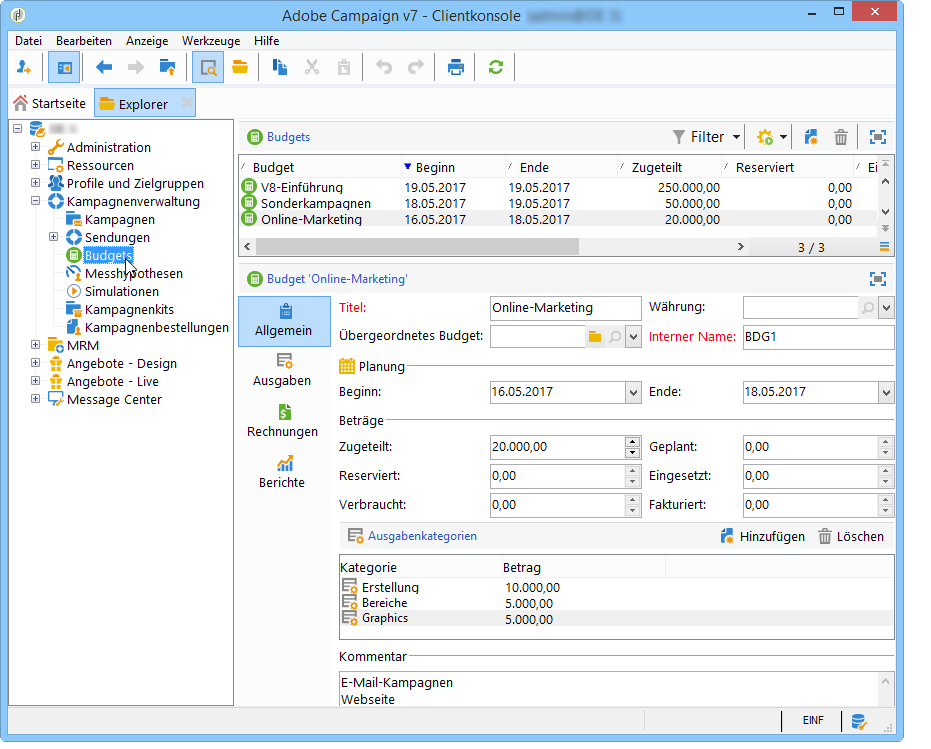

Zur Nutzung der Budget-Verwaltung mit MRM sind folgende Etappen umzusetzen:

1. Festlegung des Budgets;

   For more on this, refer to [Creating a budget](#creating-a-budget).

1. Bestimmung des Kostenberechnungsmodus;

   Kostenstrukturen werden für die Dienstleister definiert. See [Creating a service provider and its cost categories](../../campaign/using/providers--stocks-and-budgets.md#creating-a-service-provider-and-its-cost-categories).

1. Bestimmung der Kampagnenkosten (Sendungen/Aufgaben);

   Die Kosten, die durch die Auslieferungen und Aufgaben entstehen, werden einzeln oder global für die Kampagnenvorlage eingegeben. See [Calculation of costs and stocks](../../campaign/using/marketing-campaign-deliveries.md#calculation-of-costs-and-stocks).

1. Konsolidierung;

   gemäß dem Erfüllungsstatus der Aufgaben, Sendungen und Kampagnen werden die Kosten berechnet und dem entsprechenden Budget übermittelt.

   When the creation of the campaign is sufficiently advanced, the progress status of the campaign budget can be changed to **[!UICONTROL Specified]**. The calculated cost of the program is then entered automatically with the costs calculated on the campaign. See [Cost commitment, calculation and charging](#cost-commitment--calculation-and-charging).

## Erstellung von Budgets {#creating-a-budget}

Die Budgets werden in der Karte über den **[!UICONTROL Campaign management > Budgets]** Knoten erstellt. Mit der **[!UICONTROL New]** Schaltfläche in der Symbolleiste können Sie ein Budget erstellen.

* Neues Budget hinzufügen

   Click the **[!UICONTROL New]** icon, name and save the budget.

* Zugeteilten Betrag eingeben

   Geben Sie den zugewiesenen Betrag in das entsprechende Feld ein. Die anderen Beträge werden automatisch eingegeben. Siehe [Berechnen von Beträgen](#calculating-amounts).

* Gültigkeitszeitraum bestimmen

   Geben Sie Beginn und Ende der Budgetplanung ein. Es handelt sich hierbei lediglich um Richtwerte.

* Ausgaben

   Erstellen Sie die Ausgabekategorien, mit denen die diesem Budget zugewiesenen Kosten für Kampagnen, Aufgaben usw. verknüpft werden können. Siehe [Ausgabenkategorien](#expense-categories).

   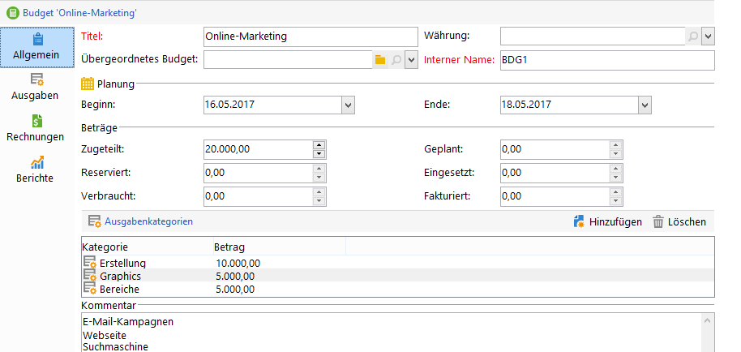

>[!NOTE]
>
>Sie können ein übergeordnetes Budget auswählen.
>
>Weitere Informationen finden Sie unter [Verknüpfen eines Budgets mit einem anderen](#linking-a-budget-to-another).

### Betragsberechnung {#calculating-amounts}

Der Anfangsbestand eines Budgets verringert sich im Zuge der ihm zugeordneten Kampagnen, Sendungen oder Aufgaben um die anfallenden Kosten, sobald diese geplant oder realisiert wurden. Der Status der Beträge (Geplant, Reserviert, Eingesetzt, Verbraucht, Fakturiert) hängt vom Kostentyp und dem Verbindlichkeitsniveau ab, die in der Kamapgne, der Sendung oder der Aufgabe festgelegt wurden.

>[!NOTE]
>
>The amounts entered for the categories must match the budget envelope defined in the **[!UICONTROL Allocated]** field.

In Kampagnen können je nach Verbindlichkeitsniveau Kosten für eine zukünftige Aktion geplant, eingesetzt oder reserviert werden.

>[!CAUTION]
>
>Wenn eine Kampagne erstellt wird, **[!UICONTROL Budget]** muss der Status &quot;Fortschritt in&quot;auf **[!UICONTROL Defined]** eingestellt werden, damit die Kosten bei der Ausführung berücksichtigt werden. Ist der Status **[!UICONTROL Being edited]** vorhanden, werden die Kosten nicht konsolidiert.
>   
>Die Option **[!UICONTROL Commitment level]** stellt eine Prognose der Kosten für die Zukunft dar, bevor sie dem Haushalt in Rechnung gestellt werden. Je nach Fortschritt einer Kampagne, Aufgabe oder Bereitstellung können Sie entscheiden, eine höhere oder niedrigere Verpflichtungsstufe zuzuweisen (1). Geplant, 2. Reserviert, 3. Zugegeben) mit dem Kombinationsfeld.

Beispiel: Die Kosten einer Web-Kampagne werden auf 45 000 Euro geschätzt.

For the campaign, when the budget creation status is set to **[!UICONTROL Defined]**, the real cost of the campaign (or, if none, the computed cost) will be carried over into the budget totals.

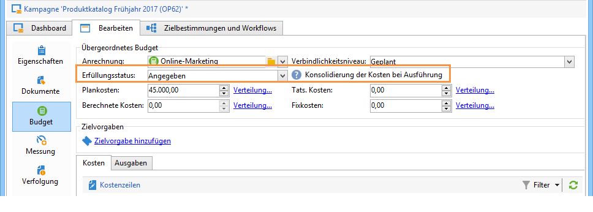

According to the level of commitment of the campaign budget, the amount will be entered in the **[!UICONTROL Planned]**, **[!UICONTROL Reserved]** or **[!UICONTROL Committed]** field.

Das Verbindlichkeitsniveau kann geändert werden:

* in der **Kampagnenebene** im **[!UICONTROL Budget]** Fenster auf der **[!UICONTROL Edit]** Registerkarte. Hier werden Budgets, Kosten und Ausgaben konfiguriert.
* in der **Aufgabenebene** im **[!UICONTROL Expenses and revenues]** Fenster.

When the budget is **[!UICONTROL Reserved]**, the update is performed automatically for the charged budget.

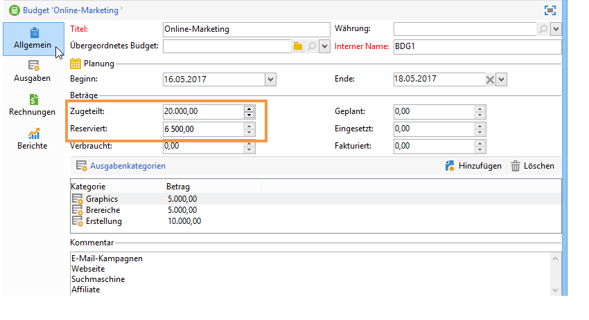

Der Ablauf entspricht dem der Aufgaben:

When an expenditure gives rise to an invoice and the invoice is paid, its amount is then entered in the **[!UICONTROL Invoiced]** field.

### Ausgabenkategorien {#expense-categories}

Die Beträge können in verschiedene Ausgabenkategorien verteilt werden, um die Daten besser lesbar zu machen und die Marketinginvestitionen detaillierter zu melden. Die Ausgabekategorien werden während der Erstellung des Budgets über den **[!UICONTROL Budgets]** Knoten des Baumes definiert.

To add a category, click the **[!UICONTROL Add]** button in the lower section of the window.

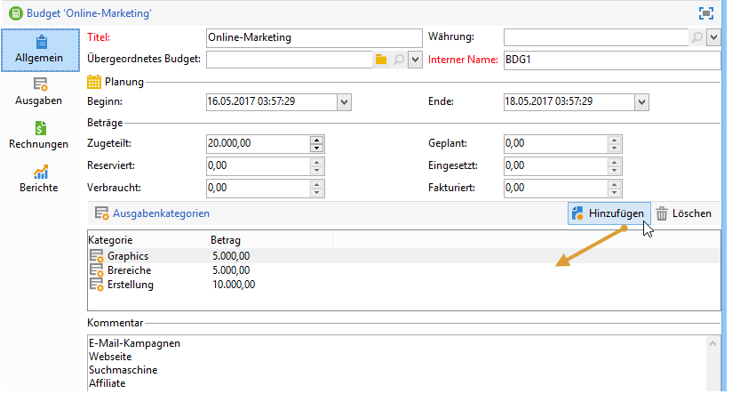

Sie können eine der existierenden Kategorien auswählen oder eine neue definieren, indem Sie sie direkt in das Feld eingeben. Bei der Bestätigung Ihrer Eingabe wird Ihnen ermöglicht, die Kategorie der Liste der existierenden Kategorien hinzuzufügen und sie bei Bedarf einer Art zuzuordnen. Diese Informationen werden in den Budgetberichten ausgewertet.

### Zuordnung von Budgets untereinander {#linking-a-budget-to-another}

Sie können ein Budget mit einem Hauptbudget verknüpfen. Wählen Sie dazu das Hauptbudget im **[!UICONTROL related budget]** Bereich der Sekundarhaushalte aus.

Dem Hauptbudget wird daraufhin ein Tab zur Auflistung der untergeordneten Budgets hinzugefügt.

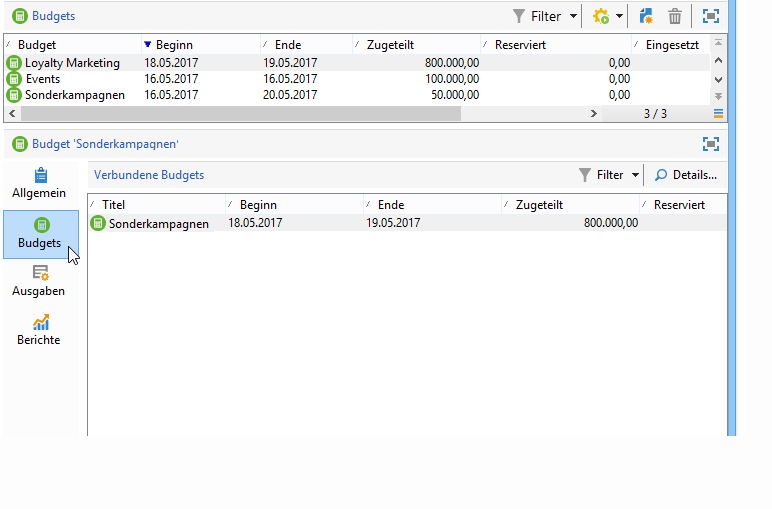

Diese Informationen werden in den Budgetberichten ausgewertet.

## Hinzufügung von Ausgabezeilen {#adding-expense-lines}

Ausgabezeilen werden dem Budget automatisch hinzugefügt. Sie werden bei der Versandanalyse und beim Abschluss einer Aufgabe erstellt.

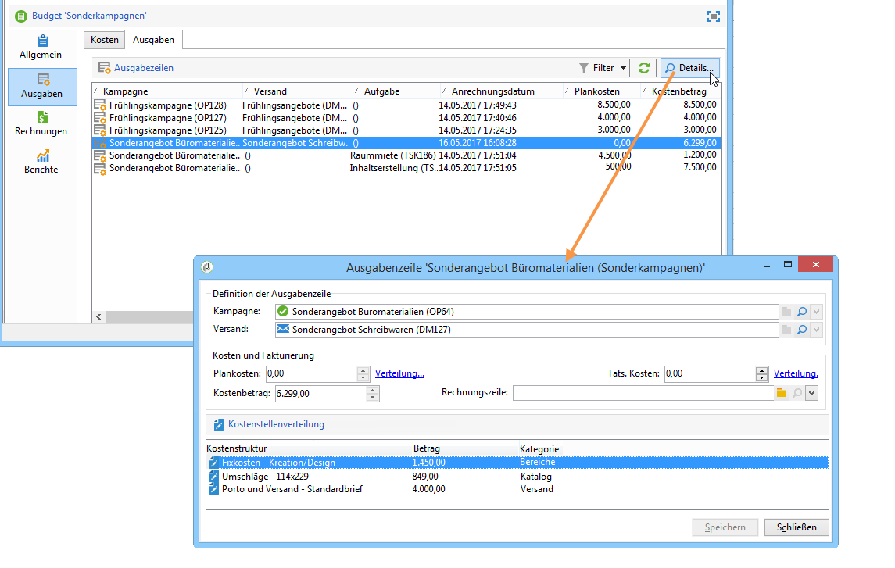

Die für Kampagnen, Sendungen oder Aufgaben anfallenden Kosten werden in den Ausgabenzeilen des Budgets, dem sie zugeteilt sind, zusammengefasst. Diese Ausgabenzeilen werden abhängig von den Kostenstellen des beteiligten Dienstleisters erstellt und ausgehend von den verbundenen Kostenstrukturen berechnet.

Damit enthält jede Ausgabenzeile folgende Informationen:

* die Kampagne und Sendung oder Aufgabe, der sie zugeordnet ist;
* den ausgehend von den Kostenstrukturen oder den Plankosten berechneten Betrag;
* die tatsächlichen Kosten der Sendung oder der betreffenden Aufgabe;
* die entsprechende Rechnungszeile (ausschließlich in MRM);
* die Liste der berechneten Kosten je Kostenstelle (wenn eine Kostenstruktur existiert).

Im obigen Beispiel enthält die bearbeitete Ausgabenzeile die Kosten, die für die Bereitstellung **neuer Karten** für die Kampagne &quot; **Loyalty Spring Pack** &quot;berechnet wurden. Wenn die Bereitstellung bearbeitet wird, können Sie auf der **[!UICONTROL Direct Mail]** Registerkarte sehen, wie die Ausgabenzeile berechnet wird.

Als Grundlage der Kostenberechnung für diesen Versand dienen die für den betroffenen Dienstleister ausgewählten Kostenstellen.

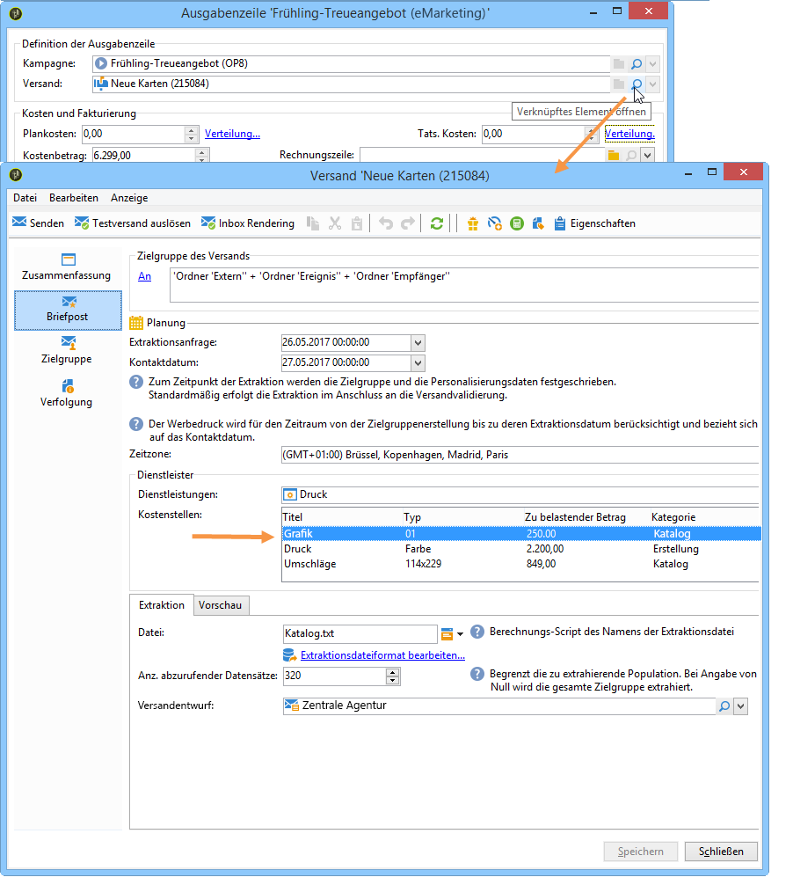

Abhängig von diesen Kostenstellen werden die entsprechenden Kostenstrukturen zur Berechnung der Ausgabenzeilen angewandt. Im vorliegenden Beispiel handelt es sich um folgenden Kostenstrukturen für den betroffenen Dienstleister:

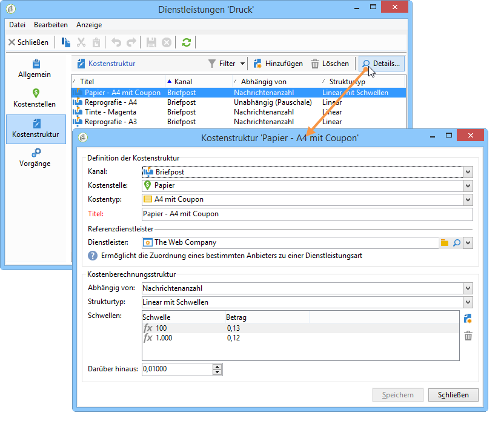

>[!NOTE]
>
>Kostenkategorien und Strukturen werden unter [Erstellen eines Dienstleisters und dessen Kostenkategorien](../../campaign/using/providers--stocks-and-budgets.md#creating-a-service-provider-and-its-cost-categories)dargestellt.

## Entstehung, Berechnung und Anrechnung von Kosten {#cost-commitment--calculation-and-charging}

Kosten können in Sendungen und Aufgaben entstehen. Abhängig vom Bearbeitungsfortschritt des jeweiligen Vorgangs wird der Kostenstatus aktualisiert.

### Kostenarten {#cost-calculation-process}

Kosten werden in drei Kategorien eingeteilt:

1. Plankosten

   Die geschätzten vorläufigen Kosten sind eine Schätzung der Kosten für die Prozesse der Kampagne. Solange sie bearbeitet wird, werden die eingegebenen Beträge nicht konsolidiert. Er muss über den **[!UICONTROL Specified]** Status verfügen, damit die in die Berechnungen einzugebenden Beträge berücksichtigt werden.

   Dieser Betrag wird manuell eingegeben und kann in mehrere Ausgabekategorien unterteilt werden. Klicken Sie zum Aufschlüsseln der Kosten auf den **[!UICONTROL Breakdown...]** Link und dann auf die Schaltfläche, um einen neuen Betrag zu definieren **[!UICONTROL Add]** .

   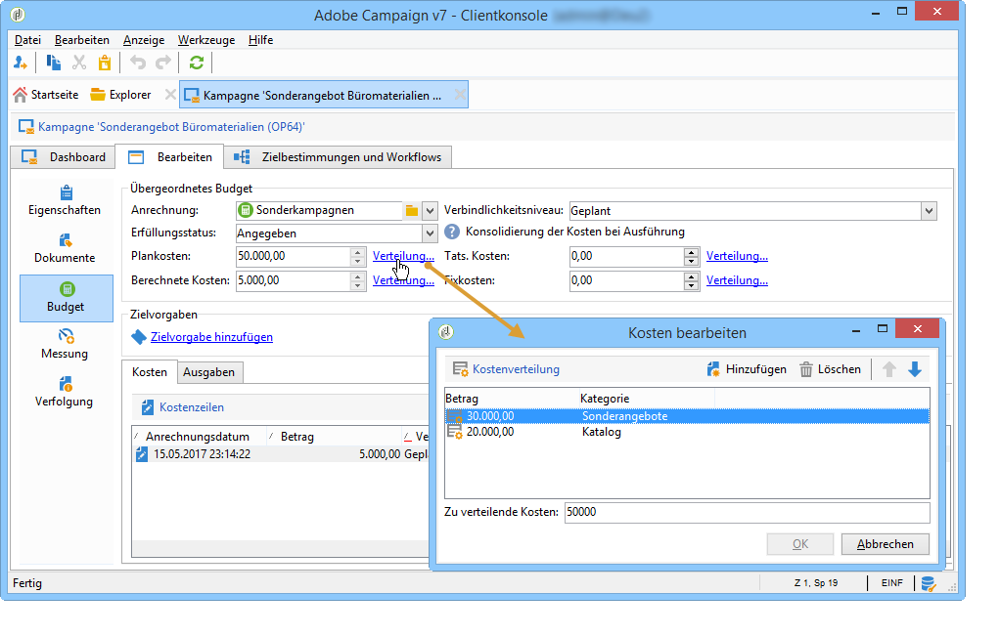

   Jeder Kostenbetrag kann einer Kategorie zugeordnet werden. Dies ermöglicht eine Übersicht der Kostenverteilung nach Ausgabenkategorien im übergeordneten Budget sowie in den Budgetberichten.

1. Berechnete Kosten

   Die berechneten Kosten hängen vom betroffenen Element (Kampagne, Versand, Aufgabe etc.) und seinem Status ab (In Bearbeitung, In Gang, Abgeschlossen). Sobald die tatsächlichen Kosten angegeben sind, wird dieser Betrag grundsätzlich von den berechneten Kosten übernommen.

   Wenn die tatsächlichen Kosten nicht angegeben sind, gelten folgende Regeln:

   * In einer sich in Bearbeitung befindenden Kampagne entsprechen die berechneten Kosten dem Betrag der Plankosten der Kampagne. Wenn diese nicht global für die Kampagne angegeben wurden, setzen sich die berechneten Kosten aus der Summe der Plankosten der einzelnen Sendungen und Aufgaben der Kampagne zusammen. Nach Abschluss der Kampagne entsprechen die berechneten Kampagnenkosten der Summe aller berechneten Kosten.
   * In einem noch nicht analysierten Versand entsprechen die berechneten Kosten dem Betrag der Plankosten. Wenn die Analyse bereits stattgefunden hat, setzen sich die berechneten Kosten aus den basierend auf den Kostenstrukturen des Dienstleisters und der Anzahl der ausgewählten Empfänger berechneten Beträgen zusammen.
   * In einer gestarteten Aufgabe werden die Plankosten als berechnete Kosten verwendet. Nach Abschluss der Aufgabe entsprechen die berechneten Kosten der Summe aller basierend auf den Kostenstrukturen des Dienstleisters und - falls zutreffend - der Anzahl an insgesamt benötigten Tagen berechneten Kosten.
   * Sowohl für Marketingpläne als auch für Programme entsprechen die berechneten Kosten der Summe der für die verknüpften Kampagnen berechneten Kosten. Wenn diese nicht angegeben sind, werden die Plankosten anstelle der berechneten Kosten verwendet.
   >[!NOTE]
   >
   >The **[!UICONTROL Breakdown]** link lets you view the details of the calculation and the last cost calculation date.

1. Tatsächliche Kosten

   Tats. Kosten werden manuell erfasst und bei Bedarf zwischen unterschiedlichen Ausgabenkategorien verteilt.

### Anrechnung auf Budgets {#calculation-and-charging}

Kosten werden mithilfe der Kostenstrukturen berechnet und auf die in den betroffenen Kampagnen, Sendungen oder Aufgaben ausgewählten Budgets angerechnet.

Über die Billigung des Budgets kann eine Prüfung der für Kampagnen gebundenen Beträge durchgeführt werden. In einer Kampagne können zusätzliche Aufgaben im Kontrollkästchenstil erstellt werden, um andere Genehmigungen einzurichten. Siehe [Aufgabenarten](../../campaign/using/creating-and-managing-tasks.md#types-of-task).

### Beispiel {#example}

Im Folgenden wird eine Kampagne mit folgenden Elementen erstellt:

* Briefpost-Versand mit Kostenstrukturen eines Dienstleisters
* Aufgabe mit Fixkosten
* Aufgabe mit Tageskosten

#### 1. Schritt - Budget erstellen {#step-1---creating-the-budget}

Erstellen Sie ein neues Budget über den **[!UICONTROL Campaign management > Budgets]** Knoten.

Definieren Sie ein Budget von 10.000 Euro im **[!UICONTROL Allocated]** Bereich des **[!UICONTROL Amounts]** Einzelplans. Fügen Sie im unteren Bereich des Fensters zwei Ausgabekategorien hinzu:

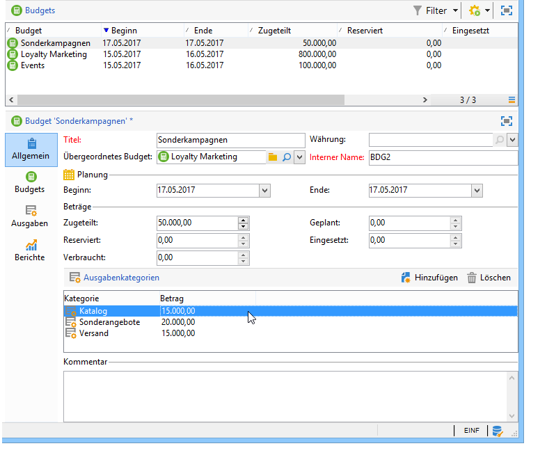

#### 2. Schritt - Dienstleister konfigurieren und Kostenstrukturen festlegen {#step-2---configuring-the-service-provider-and-defining-the-cost-structures}

Create a service provider and a service template with its cost structure from the **[!UICONTROL Administration > Campaigns]** node.

Weitere Informationen finden Sie unter [Erstellen eines Dienstanbieters und dessen Kostenkategorien](../../campaign/using/providers--stocks-and-budgets.md#creating-a-service-provider-and-its-cost-categories).

* Erstellen Sie für Direktpostsendungen Kostenkategorien **[!UICONTROL Envelopes]** (Typen 114 x 229 und 162 x 229) **[!UICONTROL Postage]** und **[!UICONTROL Print]** (Typen A3 und A4). Erstellen Sie dann die folgenden Kostenstrukturen:

   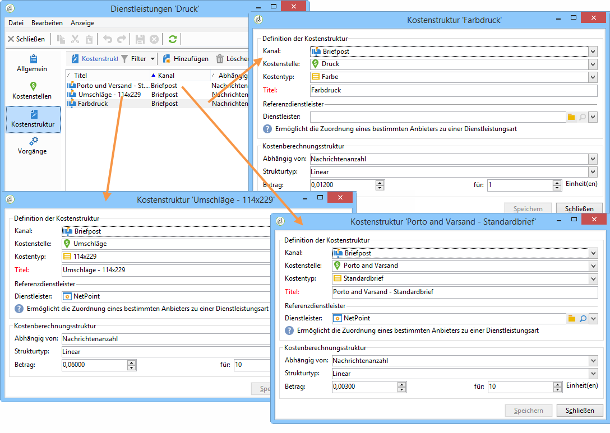

   Fügen Sie in den Kostenstellen Fixkosten vom Typ &quot;Festpreis&quot; hinzu, deren Betrag in der entsprechenden Kostenstruktur leer ist. (Dieser wird einzeln für jeden Versand angegeben.)

   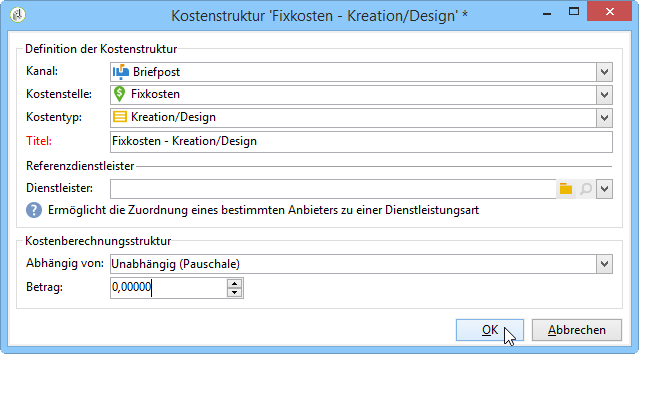

* Erstellen Sie für die Aufgaben die folgenden zwei Kostenstellen:

   1. **[!UICONTROL Room reservation]** (Kleines Zimmer und großes Zimmer) mit einer **festen** Kostenstruktur in Höhe von 300 und 500 Euro:

      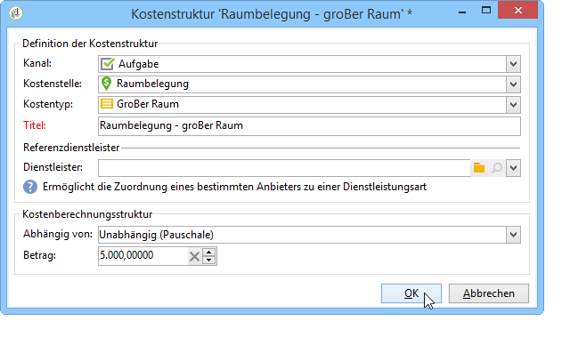

   1. **[!UICONTROL Creation]** (**Content template** type) mit einer **täglichen** Kostenstruktur von 300 Euro:

      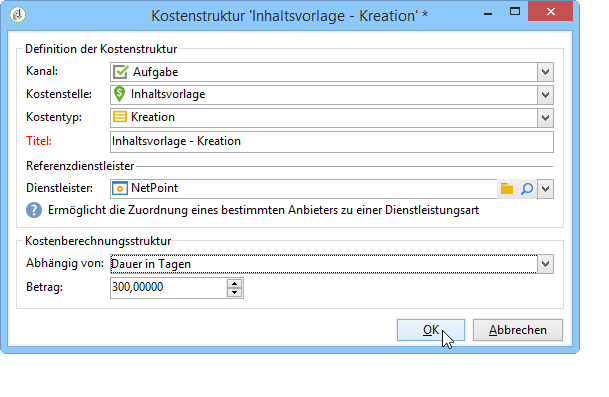

#### 3. Schritt - Anfallende Kosten auf das Kampagnenbudget anrechnen {#step-3---charging-the-budget-in-the-campaign}

Erstellen Sie eine Kampagne und wählen Sie das im 1. Schritt erstellte Budget aus.

>[!NOTE]
>
>Das im Programm ausgewählte Budget wird standardmäßig für alle Kampagnen des Programms angewandt.

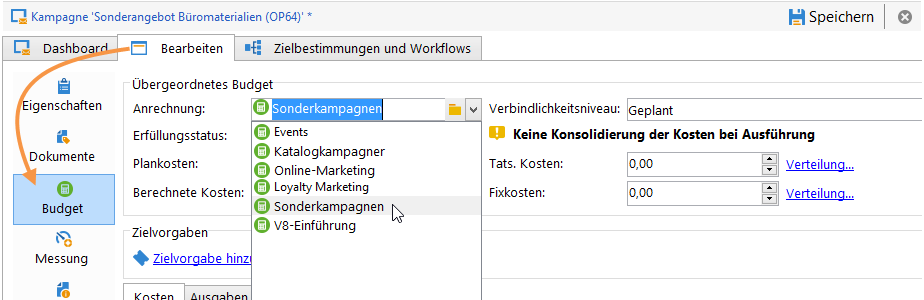

Geben Sie die Plankosten mit Verteilung an:

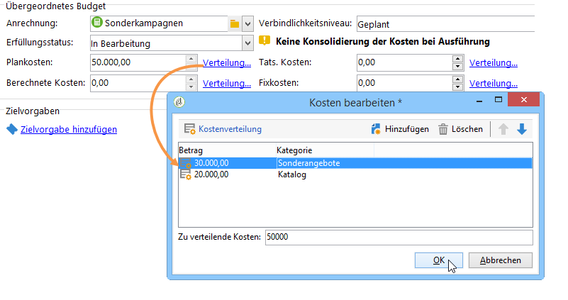

Klicken Sie auf **[!UICONTROL Ok]** und bestätigen Sie **[!UICONTROL Save]** diese Informationen. Die berechneten Kosten der Kampagne werden dann mit den geschätzten vorläufigen Kosten aktualisiert.

#### 4. Schritt - Briefpost-Versand erstellen {#step-4---creating-the-direct-mail-delivery}

Erstellen einen Kampagnen-Workflow mit einer Abfrage zur Zielgruppenbestimmung. Stellen Sie sicher, dass die Postadresse der ausgewählten Empfänger angegeben ist.

Erstellen Sie nun einen Briefpost-Versand und wählen Sie den im zweiten Schritt erstellten Dienstleister aus: Die Kostenstellen werden automatisch angezeigt.

Überschreiben Sie die Kosten der Briefumschläge und fügen Sie Fixkosten hinzu. Wählen Sie zudem die von diesen Kosten betroffenen Kategorien aus.

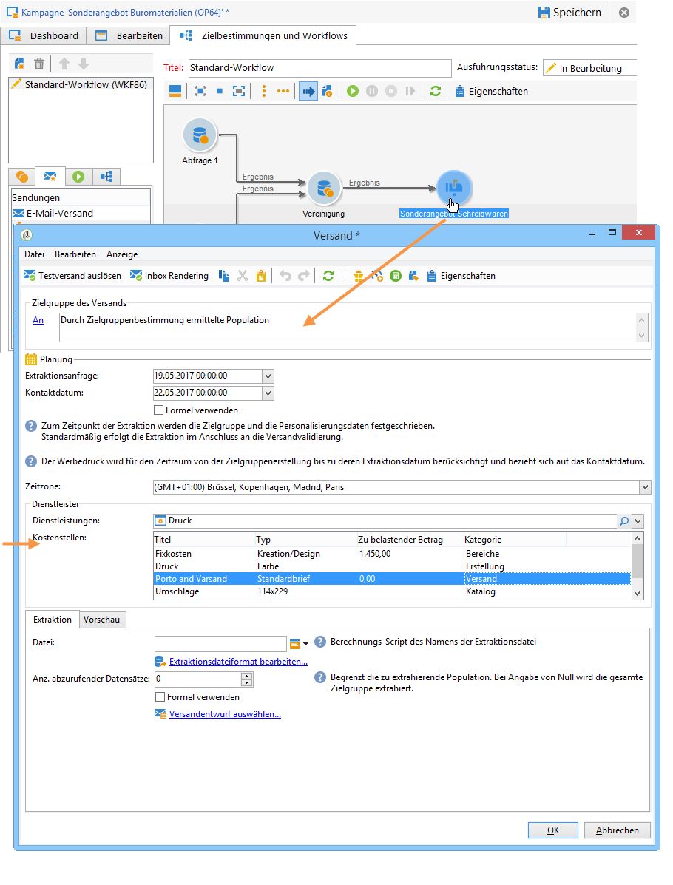

>[!NOTE]
>
>Wenn eine der Kostenstellen nicht verwendet wird, fallen durch diese keinerlei Ausgaben an.

Starten Sie den gerade erstellten Workflow, um die Analyse zu beginnen und die Kosten zu berechnen.

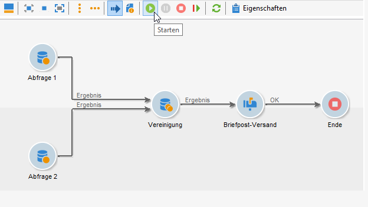

Wenn die Budgetvalidierung für diese Kampagne aktiviert wurde, validieren Sie das Budget über das Dashboard. Sie können an dieser Stelle auch die Validierung der Kostenstellen überprüfen.

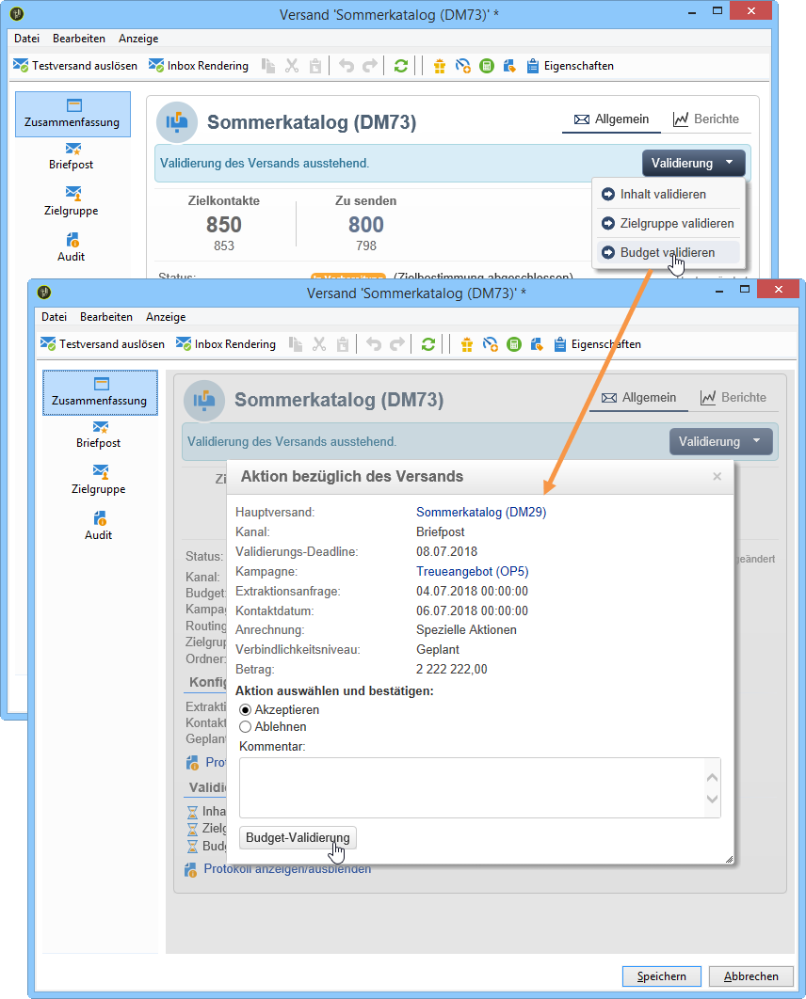

Die Ausgabenzeile für die Bereitstellung wird auf der **[!UICONTROL Edit > Budget]** Registerkarte der Kampagne hinzugefügt. Bearbeiten Sie sie, um die Details der Berechnung anzuzeigen.

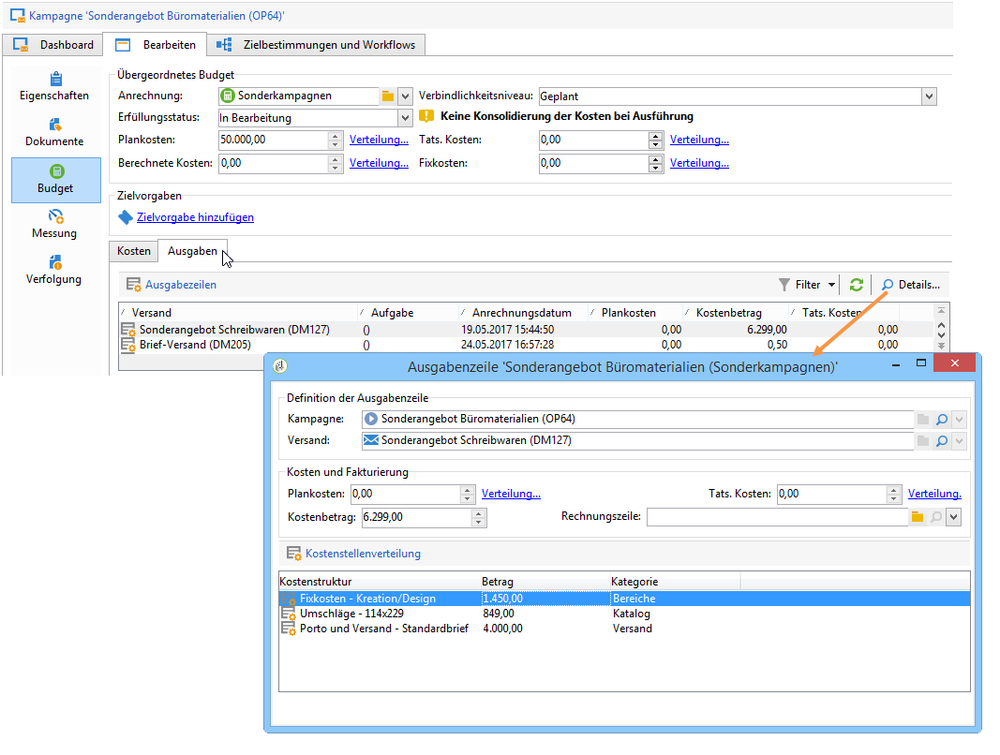

Auf Versandniveau werden die berechneten Kosten mit folgenden Daten aktualisiert:

Beim Bearbeiten der berechneten Kosten können Sie die Kostenverteilung sowie Status und Datum der Kostenberechnung überprüfen.

#### 5. Schritt - Aufgaben erstellen {#step-5---creating-tasks}

Zu dieser Kampagne fügen wir die beiden Aufgaben hinzu, für die die Kostenstrukturen zuvor erstellt wurden (siehe [Schritt 2 - Konfigurieren des Dienstanbieters und Definieren der Kostenstrukturen](#step-2---configuring-the-service-provider-and-defining-the-cost-structures)). Klicken Sie dazu im Kampagnen-Dashboard auf die **[!UICONTROL Add a task]** Schaltfläche. Benennen Sie die Aufgabe und klicken Sie auf **[!UICONTROL Save]**.

Konfigurieren Sie sie wie folgt:

In the **[!UICONTROL Properties]** tab, select the service and the corresponding cost category:

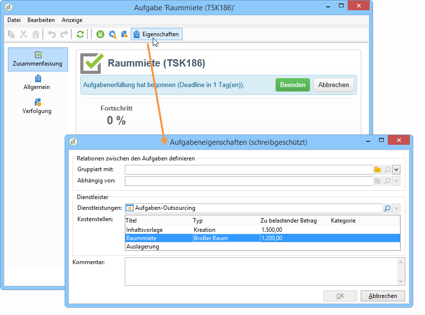

Next, click the **[!UICONTROL Expenses and revenue]** icon of the task and specify the estimated provisional cost.

Mit Speicherung der Aufgabe übernehmen die berechneten Kosten den für die Plankosten angegebenen Wert.

Wenn die Aufgabe abgeschlossen ist (Status **[!UICONTROL Finished]** ), werden die berechneten Kosten automatisch mit den Kosten des großen Raumes aktualisiert, wie in der Kostenstruktur angegeben. Diese Kosten werden auch in dieser Kategorie in der Aufschlüsselung angezeigt.

Erstellen Sie auf die gleiche Weise eine zweite Aufgabe mit einer Planung über fünf Tage und verbinden Sie sie mit der zuvor erstellen Kostenstruktur.

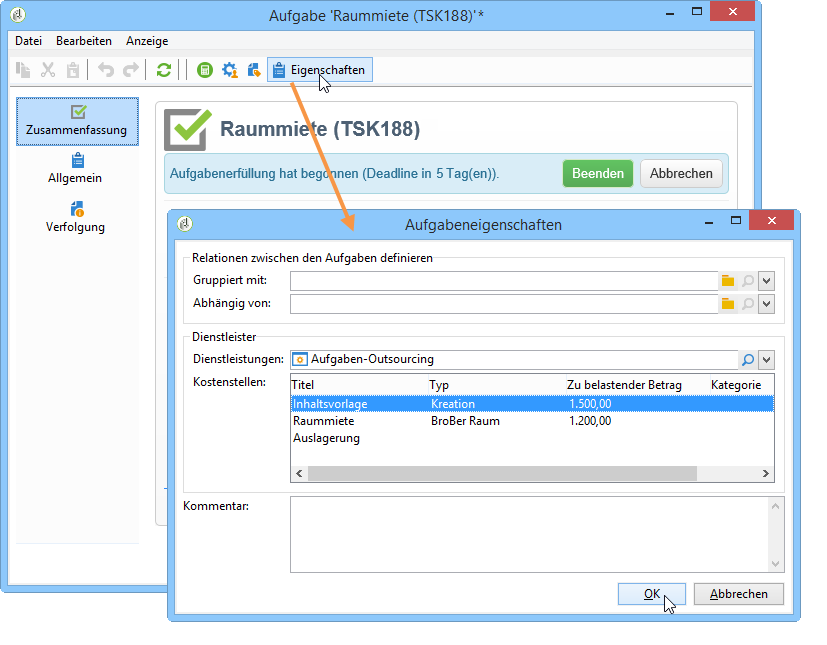

Nach Abschluss der Aufgabe übernehmen die berechneten Kosten den aus der Kostenstruktur stammenden Wert, in unserem Beispiel also 1500 Euro (5 Tage x 300 Euro).

#### 6. Schritt - Status des Kampagnenbudgets aktualisieren {#step-6---update-the-campaign-budget-status}

When the campaign is configured, its status can be updated by setting it to **[!UICONTROL Specified]**. The calculated cost of the campaign will then indicate the sum of the calculated costs of the delivery and the tasks of the campaign:

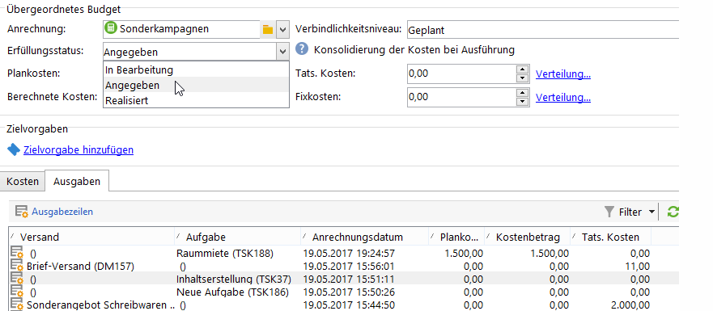

#### Validierung von Budgets {#budget-approval}

Bei aktivierter Validierung kann das Budget über einen Link im Kampagnen-Dashboard validiert werden. Der Link wird angezeigt, sobald der Zielgruppen-Workflow gestartet und wenn ein Briefpost-Versand zu validieren ist.

Sie können die Validierung über diesen Link akzeptieren oder ablehnen. Wenn Benachrichtigungen für die Kampagne aktiviert wurden, kann die Validierung zudem über die Benachrichtigungs-E-Mail erfolgen.

Nach Budgetvalidierung und Abschluss des Versands werden die Kosten automatisch über einen speziellen technischen Workflow weiter verarbeitet.

## Lagerergänzungen und Rechnungen {#orders-and-invoices}

Im Kontext von MRM können Sie bei Dienstleistern aufgebebene Bestellungen und zugehörige Rechnungen erfassen. Der gesamte Kreislauf von Bestellungen, Wareneingängen und Rechnungen kann über Adobe Campaign verwaltet werden.

### Lagerergänzungen {#order-creation}

To save a new order with a service provider, click the **[!UICONTROL MRM > Orders]** node of the tree, and then click the **[!UICONTROL New]** button.

Geben Sie die Nummer der Lagerergänzung, den entsprechenden Dienstleister sowie die Gesamtkosten für die Lagerergänzung an.

### Rechnungen {#issuing-and-tracking-invoices}

Sie können für jeden Dienstleister Rechnungen speichern und ihren Status sowie das betroffene Budget angeben.

Invoices are created and stored in the **[!UICONTROL MRM > Invoices]** node of the Adobe Campaign tree.

Eine Rechnung besteht aus Rechnungslinien, deren Gesamtsumme die automatische Berechnung des Betrags erlaubt. Diese Zeilen werden manuell auf der **[!UICONTROL Invoice lines]** Registerkarte erstellt. Sie können einer Bestellung zugeordnet werden, um die Informationen in die Bestellungen hochzuladen.

The invoices of each service provider are displayed in the **[!UICONTROL Invoices]** tab of the profile:

Im **[!UICONTROL Details]**-Tab kann der Inhalt der jeweiligen Rechnung eingesehen werden.

Click **[!UICONTROL Add]** to create a new invoice.
