# Partizipative Kampagne erstellen{#creating-a-collaborative-campaign-intro}

Partizipative Kampagnen werden von Zentralstellen auf Basis der Kampagnenvorlagen des **dezentralen Marketing** erstellt. Lesen Sie hierzu [diese Seite](../../campaign/using/about-distributed-marketing.md#collaborative-campaign).

## Partizipative Kampagne erstellen {#creating-a-collaborative-campaign}

Klicken Sie zum Konfigurieren einer kollaborativen Kampagne auf die **[!UICONTROL Campaign management > Campaigns]** Node und dann auf das **[!UICONTROL New]** Symbol.

>[!NOTE]
>
>Apart from **[!UICONTROL collaborative campaigns (by campaign)]**, these campaigns can be configured and executed via a web interface.

Die Basiskonfiguration einer partizipativen Kampagne gleicht der der Vorlage einer lokalen Kampagne. Die Besonderheiten der unterschiedlichen partizipativen Kampagnentypen werden nachstehend beschrieben.

### Partizipative Kampagne (Formular){#by-form}

Zum Erstellen einer Kampagnen für die Zusammenarbeit (nach Formular) muss die **[!UICONTROL Collaborative campaign (by form)]** Vorlage ausgewählt werden.

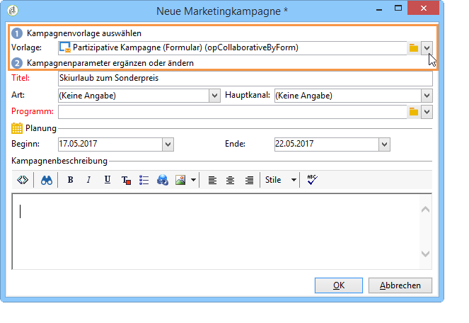

In the **[!UICONTROL Edit]** tab, click the **[!UICONTROL Advanced campaign settings...]** link to access the **Distributed Marketing** tab.

Select the **By form** Web interface. This type of interface lets you create personalization fields that will be used by local entities when ordering a campaign. Siehe [Erstellen einer lokalen Kampagne (nach Formular)](../../campaign/using/examples.md#creating-a-local-campaign--by-form-).

Speichern Sie Ihre Kampagne. You can now use it from the **Campaign packages** view in the **Campaign** universe, by clicking the **[!UICONTROL Create]** button.

The **[!UICONTROL Campaign Package]** view allows you to use local campaign templates (out-of-the-box or duplicated), as well as reference campaigns for collaborative campaigns, with the aim of creating campaigns for your different organizational entities.

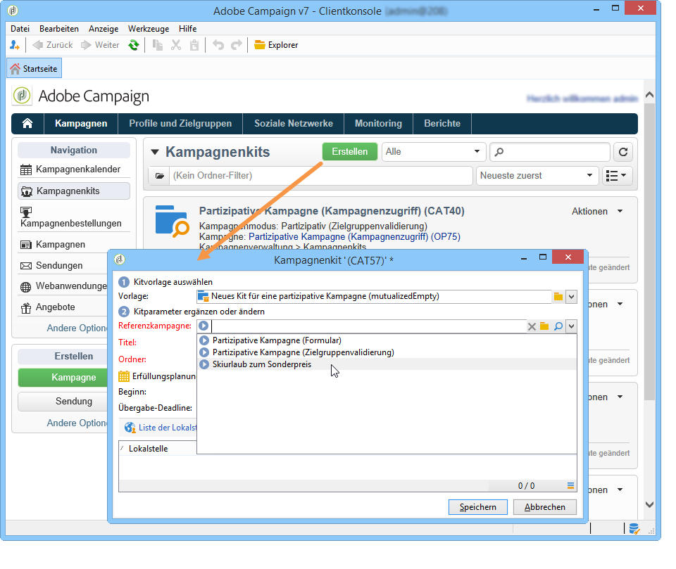

### Partizipative Kampagne (Kampagnenzugriff){#by-campaign}

Um eine Kampagnenkampagne (nach Kampagne) zu erstellen, muss die **[!UICONTROL Collaborative campaign (by campaign) (opCollaborativeByCampaign)]** Vorlage ausgewählt werden.

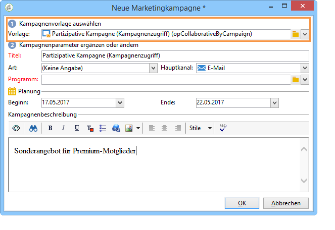

Die Lokalstelle kann bei der Kampagnenbestellung die von der Zentralstelle festgelegten Kriterien erfassen und die Kampagne vor der Bestellung evaluieren.

Wenn die Bestellung einer **Partizipativen Kampagne mit Kampagnenzugriff** von der Zentraleinheit validiert wurde, wird eine Kindkampagne für die Lokalstelle erstellt. Sobald diese der Lokalstelle zur Verfügung steht, kann die Lokalstelle folgende Parameter verändern:

* Kampagnenworkflow,
* Typologieregeln,
* Personalisierungsfelder.

Die Kindkampagne wird von der Lokalstelle, die Elternkampagne von der Zentralstelle ausgeführt.

The central entity can view all child campaigns linked with a **Collaborative campaign (by campaign)** from this dashboard (via the **[!UICONTROL List of associated campaigns]** link).

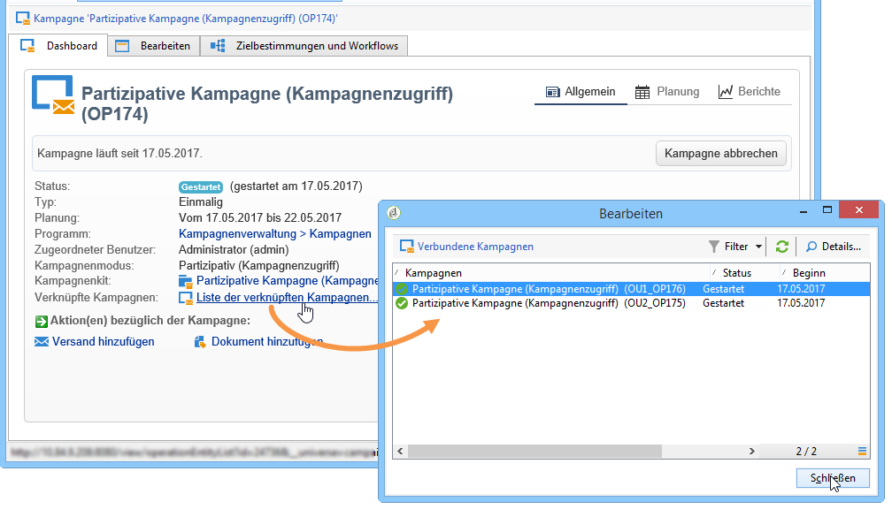

### Partizipative Kampagne (Zielgruppenvalidierung){#by-target-approval}

Um eine gemeinschaftliche Kampagne (nach Zielgenehmigung) zu erstellen, muss die **[!UICONTROL Collaborative campaign (by target approval)]** Vorlage ausgewählt werden.

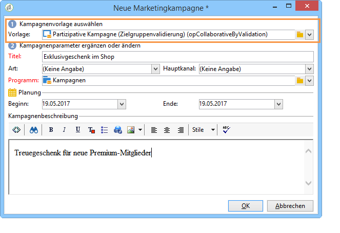

>[!NOTE]
>
>In diesem Modus muss die Zentralstelle keine Lokalstellen angeben.

Der Kampagnenworkflow muss die Aktivität **Lokale Validierung** beinhalten. Diese hat folgende Parameter:

* **[!UICONTROL Action to perform]** : Benachrichtigung zur Zielgruppenvalidierung.
* **[!UICONTROL Distribution context]** : Explizit.
* **[!UICONTROL Data distribution]** : Verteilung lokaler Entitäten.

**Die Datenverteilung** eines lokalen Entitätsverteilungstyps muss erstellt werden. Mit der Datenverteilungsvorlage können Sie die Anzahl der Datensätze aus einer Liste von Gruppierungswerten begrenzen. Klicken Sie **[!UICONTROL Resources > Campaign management > Data distribution]** in auf das **[!UICONTROL New]** Symbol, um eine neue zu erstellen **[!UICONTROL Data distribution]**. For more information on data distribution, refer to the [Workflows](../../workflow/using/using-the-local-approval-activity.md#step-1--creating-the-data-distribution-template-) guide.

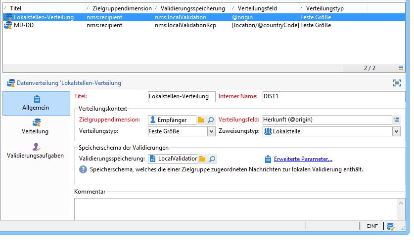

Wählen Sie die **Targeting-Dimension** und die **[!UICONTROL Distribution field]**. Wählen Sie **[!UICONTROL Assignment type]** für &quot; **Lokale Entität**&quot;aus.

In the **[!UICONTROL Distribution]** tab, add a field for each local entity and specify the value.

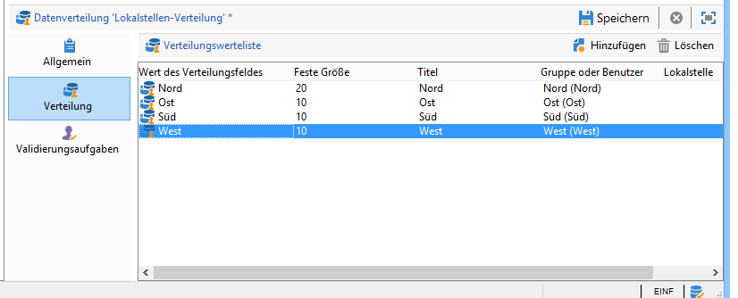

Es besteht die Möglichkeit, der **Versand**-Aktivität eine zweite **Zielgruppenvalidierung**-Aktivität anzuschließen, um einen Bericht über letztere zu konfigurieren.

In der Bestätigungs-E-Mail der Kampagnenerstellung erhält die Lokalstelle eine Liste mit Kontakten, die von den von der Zentralstelle bestimmten Parametern abhängt.

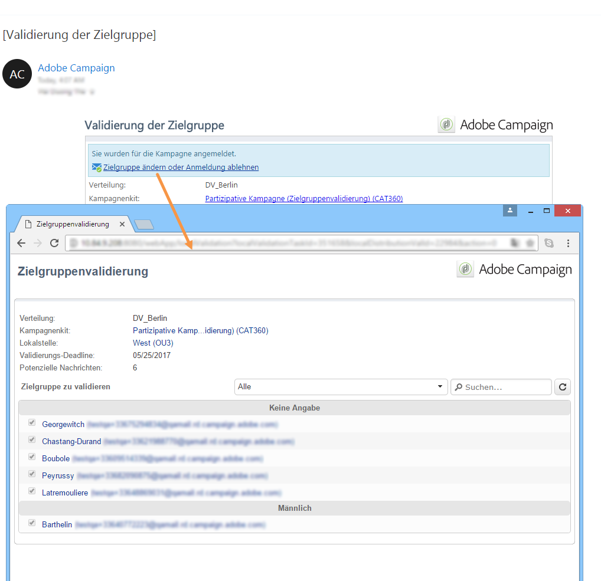

Der Lokalstelle steht es frei, je nach Kampagneninhalt bestimmte Kontakte zu entfernen.

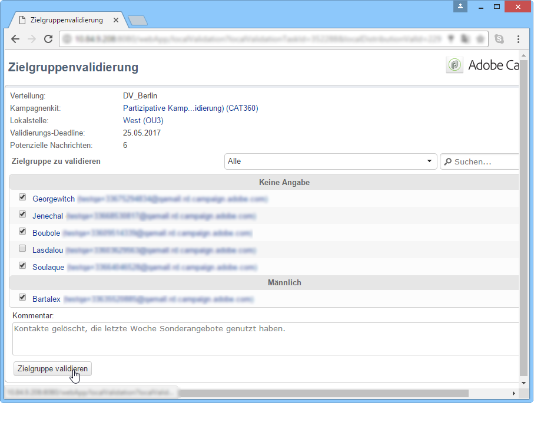

### Partizipative Kampagne (ohne Konfiguration){#simple}

To create a simple collaborative campaign, the **[!UICONTROL Collaborative campaign (simple)]** template must be selected.

## Partizipative Kampagnenkits erstellen {#creating-a-collaborative-campaign-package}

Um die Kampagne den Lokalstellen zur Verfügung zu stellen, muss die Zentralstelle ein Kampagnenkit erstellen.

Gehen Sie wie folgt vor:

1. In the **[!UICONTROL Navigation]** section on the **Campaigns** page, click the **[!UICONTROL Campaign packages]** link.
1. Click the **[!UICONTROL Create]** button.
1. The section at the top of the window lets you select the **[!UICONTROL New collaborative package (mutualizedEmpty)]** template.
1. Geben Sie die Referenzkampagne an.
1. Bestimmen Sie Titel und Speicherort des Kampagnenkits und legen Sie die Ausführungsplanung fest.

### Datum-Funktionen  {#dates}

Beginn- und Enddatum bestimmen die Dauer der Sichtbarkeit der Kampagne in der Kampagnenkit-Liste.

Für **partizipative Kampagnen** muss die Zentralstelle einen Anmeldeschluss und gegebenenfalls eine Übergabe-Deadline angeben.

>[!NOTE]
>
>Die **[!UICONTROL Personalization deadline]** ermöglicht es der zentralen Stelle, einen Termin festzulegen, innerhalb dessen die lokalen Entitäten die Dokumente (Tabellen, Bilder) bereitgestellt haben müssen, die zur Konfiguration der Kampagne verwendet werden sollen. Dies ist keine obligatorische Option. Das seitliche Stepping dieses Datums hat keine Auswirkungen auf die Kampagnenimplementierung.

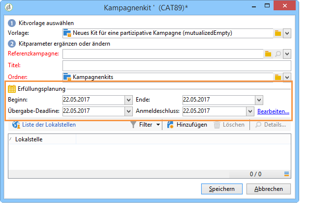

### Audience {#audience}

Die Zentralstelle muss für die Teilnahme an der Kampagne vorgesehenen Lokalstellen bei der Erstellung der partizipativen Kampagne angeben, außer bei Kampagnen mit Zielgruppenvalidierung.

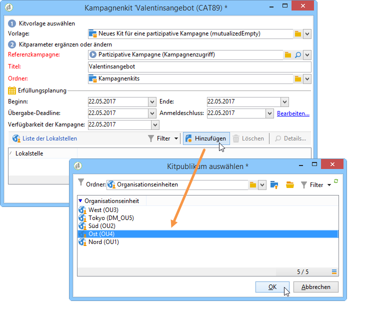

>[!CAUTION]
>
>**[!UICONTROL Simple, by form and by campaign collaborative campaign kits]** kann nur genehmigt werden, wenn die entsprechenden lokalen Stellen angegeben wurden.

### Validierungsmodi {#approval-modes}

In **partizipativen Kampagnen** kann der Validierungsmodus für Bestellungen ausgewählt werden:

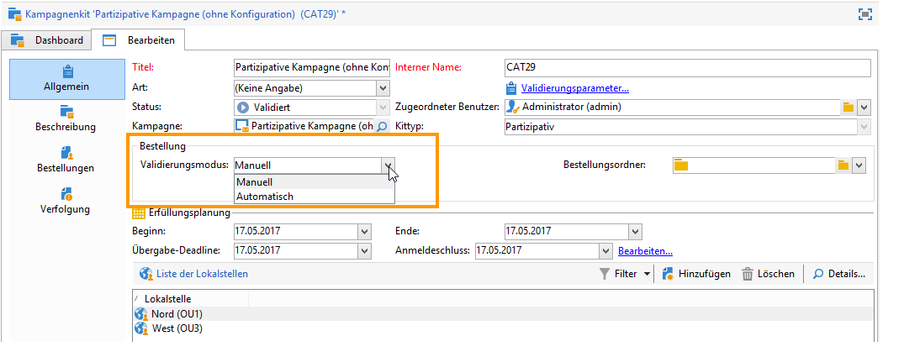

Im manuellen Modus muss sich die Lokalstelle für die Kampagne anmelden, um teilnehmen zu können.

Im automatischen Modus wird die Lokalstelle automatisch für die Kampagne angemeldet. Sie kann sich abmelden oder die Konfiguration der Kampagne verändern, ohne dass eine Validierung der Zentralstelle notwendig ist.

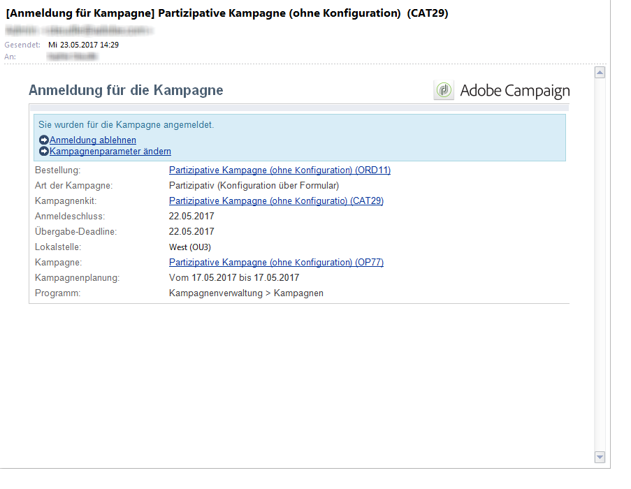

### Benachrichtigungen {#notifications}

Die Konfiguration der Benachrichtigungen entspricht der für lokale Kampagnen. Siehe hierzu [diesen Abschnitt](../../campaign/using/creating-a-local-campaign.md#notifications).

## Kampagne bestellen {#ordering-a-campaign}

Wenn der Kampagnenkit-Liste eine partizipative Kampagne hinzugefügt wird, werden die Lokalstellen, die dem von der Zentralstelle bestimmten Publikum angehören, hiervon per E-Mail informiert (**partizipative Kampagnen mit Zielgruppenvalidierung** haben kein vordefiniertes Publikum). Die Benachrichtigungs-E-Mail enthält einen Link zur Bestellung der Kampagne, wie im folgenden Beispiel:

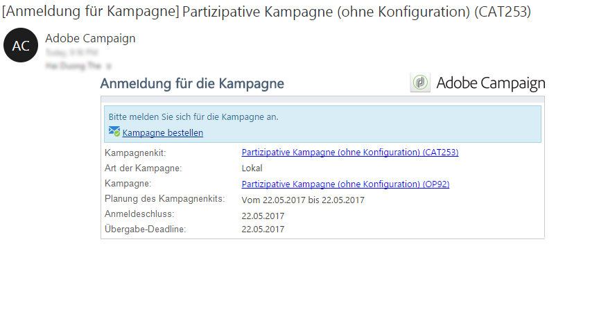

In der Nachricht können die Lokalstellen die vom zentralen Benutzer verfasste Beschreibung des Kits sowie gegebenenfalls die der Kampagne zugeordneten Dokumente ansehen. Diese Dokumente stellen zusätzliche Informationen zur Kampagne bereit, sind jedoch kein Teil der Kampagne.

Durch Zugriff auf die Webschnittstelle kann die Lokalstelle Informationen über gewünschte Anpassungen der partizipativen Kampagne geben, die sie bestellen möchte:

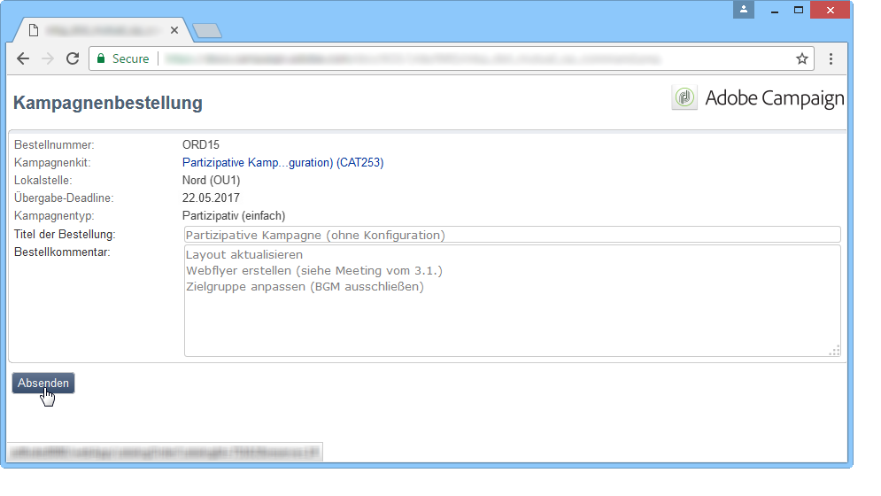

Nach Speicherung der Bestellung erhält der validierungsverantwortliche Benutzer der Lokalstelle eine Benachrichtigungs-E-Mail zur Validierung der Bestellung.

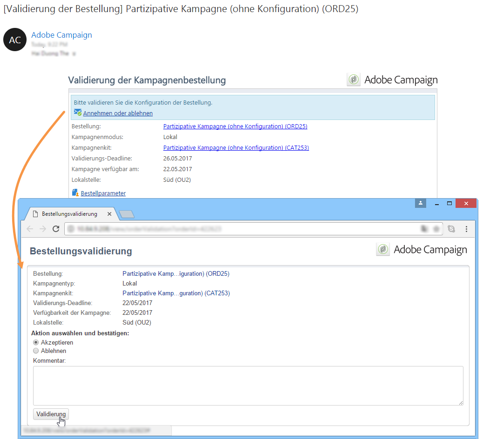

For more on this, refer to the [Approval process](../../campaign/using/creating-a-local-campaign.md#approval-process) section.

## Bestellung bestätigen {#approving-an-order}

Die Validierung der Bestellung eines partizipativen Kampagnenkits entspricht der von lokalen Kampagnen. Siehe hierzu [diesen Abschnitt](../../campaign/using/creating-a-local-campaign.md#approving-an-order).
