# Lokale Kampagnen{#creating-a-local-campaign}

Eine lokale Kampagne ist eine Instanz, die aus einer Vorlage erstellt wurde, auf die in der Liste der **[!UICONTROL campaign packages]** mit einem **bestimmten Ausführungsplan** verwiesen wird. Ziel ist es, einen lokalen Kommunikationsbedarf mithilfe einer von der zentralen Stelle eingerichteten und konfigurierten Kampagnenvorlage zu decken. Die wichtigsten Schritte zur Durchführung einer lokalen Operation sind folgende:

**Zentralstellenseitig**

1. Erstellen Sie eine Vorlage für eine lokale Kampagne.
1. Erstellen Sie anhand dieser ein Kampagnenkit.
1. Publizieren Sie das Kampagnenkit.
1. Validieren Sie die Bestellungen.

**Lokalstellenseitig**

1. Bestellen Sie die Kampagne.
1. Führen Sie die Kampagne aus.

## Vorlage für eine lokale Kampagne erstellen {#creating-a-local-campaign-template}

To create a campaign package, you must first create the **campaign template** via the **[!UICONTROL Resources > Templates]** node.

To create a new local template, duplicate the default **[!UICONTROL Local campaign (opLocal)]** template.

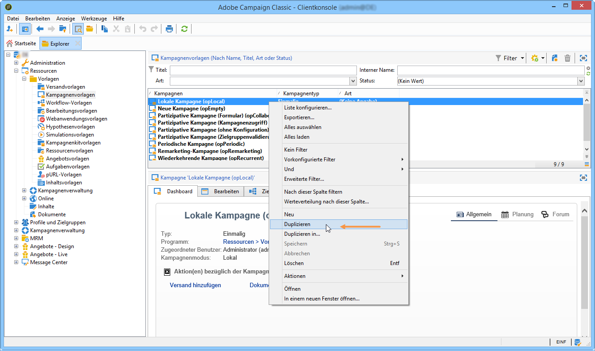

Benennen Sie die Kampagnenvorlage und erfassen Sie die verfügbaren Felder.

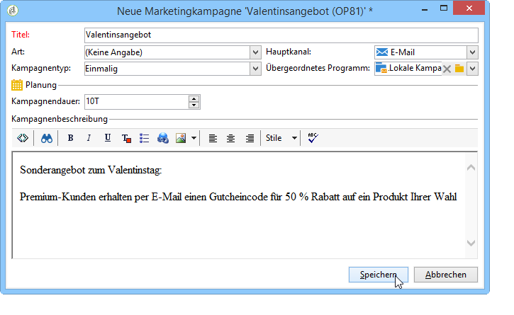

Klicken Sie im Kampagnenfenster auf die **[!UICONTROL Edit]** Registerkarte und dann auf den **[!UICONTROL Advanced campaign settings...]** Link.

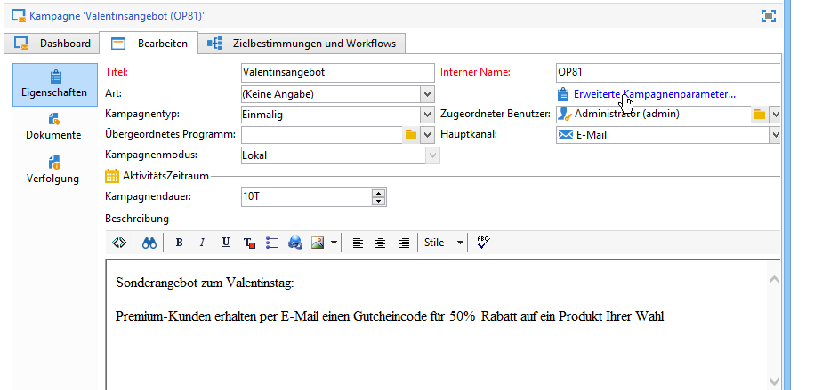

### Webschnittstelle {#web-interface}

Im Tab **Dezentrales Marketing** sind der Webschnittstellentyp sowie die Standardwerte und die erweiterten Parameter festzulegen, die bei der Bestellung von den Lokalstellen zu erfassen sind.

Die Webschnittstelle stellt ein Formular dar, dass von der Lokalstelle bei der Kampagnenbestellung auszufüllen ist.

Wählen Sie den Webschnittstellentyp aus, der für die auf dieser Vorlage basierenden Kampagnen angewandt werden soll:

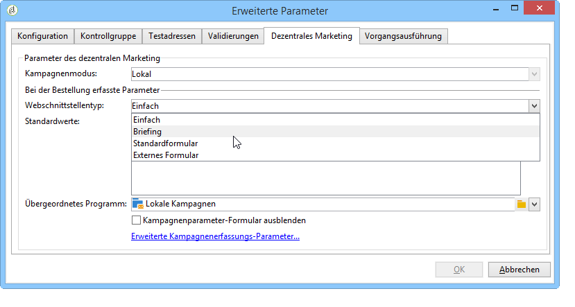

Es stehen vier unterschiedliche Webschnittstellentypen zur Verfügung:

* **[!UICONTROL By brief]** : muss eine Beschreibung der Kampagnenkonfigurationen bereitgestellt werden. Nachdem die Bestellung genehmigt wurde, konfiguriert und führt die zentrale Entität die Kampagne als Ganzes aus.

   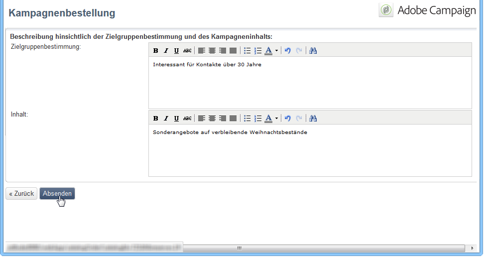

* **[!UICONTROL By form]** : lokale Entitäten haben Zugriff auf ein Webformular, in dem sie je nach verwendeter Vorlage den Inhalt, das Ziel, seine maximale Größe sowie Erstellungs- und Extraktionsdaten mithilfe von Personalisierungsfeldern bearbeiten können. Eine lokale Entität kann das Ziel bewerten und Inhalte aus diesem Webformular in der Vorschau anzeigen.

   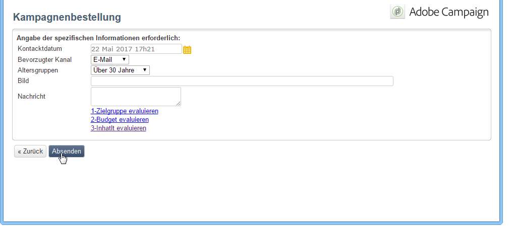

   The form offered is specified in a Web application that must be selected in a drop-down list from the **[!UICONTROL Web Interface]** field in the template&#39;s **[!UICONTROL Advanced campaign settings...]** link. Siehe [Erstellen einer lokalen Kampagne (nach Formular)](../../campaign/using/examples.md#creating-a-local-campaign--by-form-).

   >[!NOTE]
   >
   >Bei der verwendeten Webanwendung handelt es sich um ein Beispiel. Um ein Formular zu verwenden, muss vorab eine spezifische Webanwendung erstellt werden. Lesen Sie hierzu den Abschnitt [APIs](../../configuration/using/about-web-services.md).

   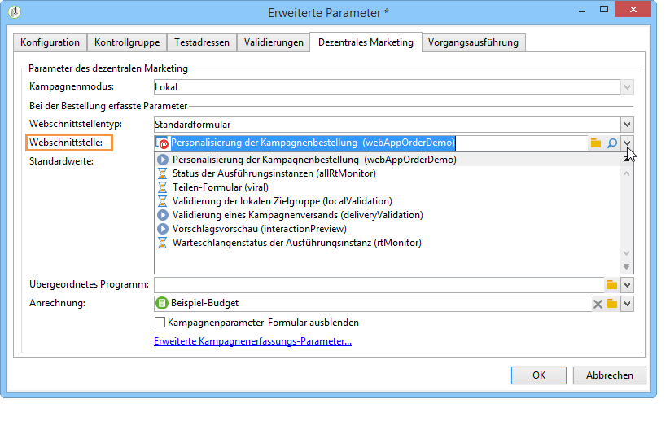

* **[!UICONTROL By external form]** : lokale Entität hat Zugriff auf Kampagnenparameter in ihrem Extranet (nicht Adobe Campaign). Diese Parameter sind identisch mit denen einer **lokalen Kampagne (nach Formular)**.
* **[!UICONTROL Pre-set]** : eine lokale Entität bestellt eine Kampagne mit dem Standardformular, ohne es zu lokalisieren.

   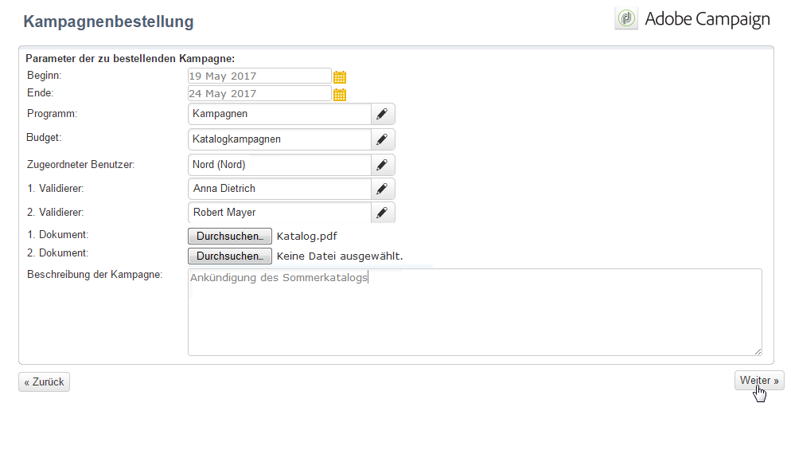

### Standardwerte {#default-values}

Wählen Sie die **[!UICONTROL Default values]** von lokalen Entitäten auszufüllen. Beispiel:

* Kontakt- und Extraktionsdatum,
* Zielgruppeneigenschaften (Altersgruppe etc.).

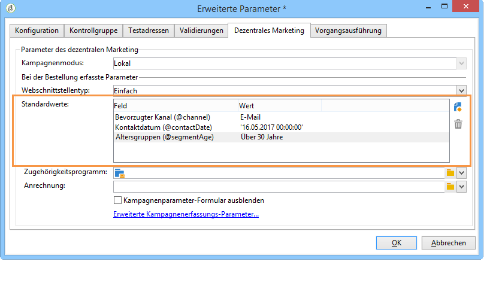

Füllen Sie die Felder **[!UICONTROL Parent marketing program]** und **[!UICONTROL Charge]** aus.

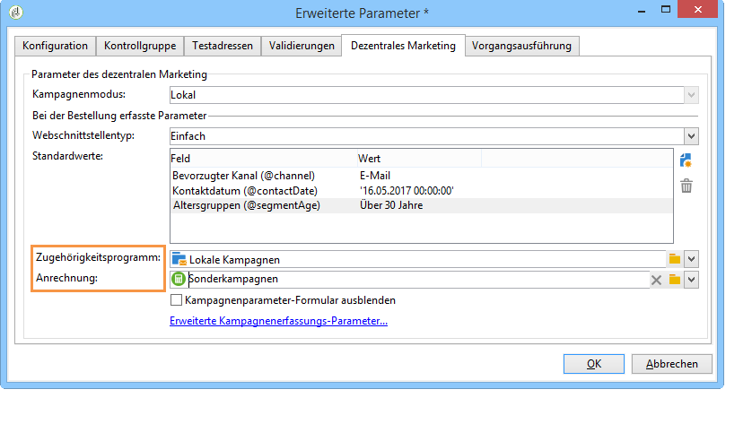

### Validierungen {#approvals}

Über den **[!UICONTROL Advanced parameters for campaign entry]** Link können Sie die maximale Anzahl von Prüfern angeben.

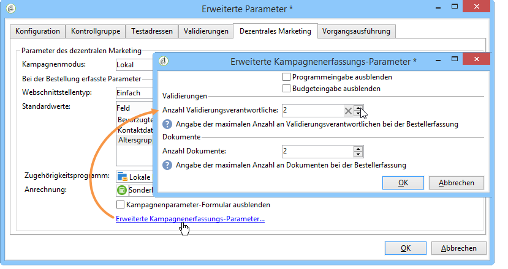

Die Validierer werden von der Lokalstelle bei der Kampagnenbestellung angegeben.

Wenn keine Angabe validierungsverantwortlicher Benutzer für die Kampagnen gewünscht ist, muss die Anzahl auf 0 gesetzt werden.

### Dokumente {#documents}

Sie können lokalen Entitätsbetreibern gestatten, Dokumente (Textdateien, Tabellen, Bilder, Kampagnenbeschreibungen usw.) beim Erstellen der Bestellung mit der lokalen Kampagne zu verknüpfen. Über den **[!UICONTROL Advanced parameters for campaign entry...]** Link können Sie die Anzahl der Dokumente einschränken. Geben Sie dazu einfach die maximal zulässige Zahl in das **[!UICONTROL Number of documents]** Feld ein.

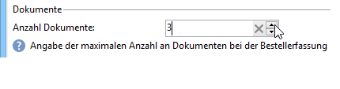

Bei der Bestellung eines Kampagnenkits bietet das Eingabeformular die Möglichkeit, so viele Dokumente wie im entsprechenden Feld angegeben hinzuzufügen.

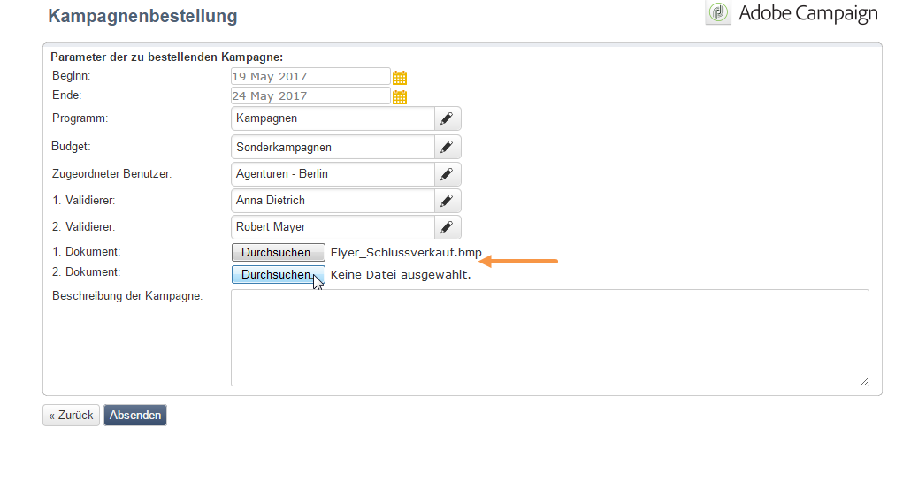

If you do not wish to display a document upload field, enter **[!UICONTROL 0]** in the **[!UICONTROL Number of documents]** field.

>[!NOTE]
>
>Das **[!UICONTROL Advanced parameters for campaign entry]** kann durch eine Überprüfung deaktiviert werden **[!UICONTROL Do not display the page used to enter the campaign parameters]**.

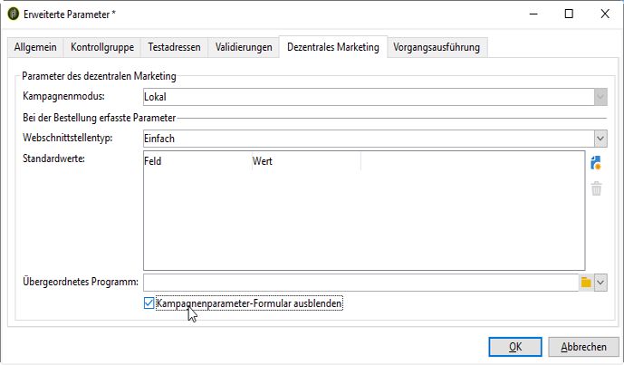

### Workflow {#workflow}

Erstellen Sie auf der **[!UICONTROL Targeting and workflows]** Registerkarte den Kampagnen-Workflow, der die im Abschnitt **[!UICONTROL Default values]** angegebenen Elemente erfasst **[!UICONTROL Advanced campaign settings...]** und die Auslieferungen erstellt.

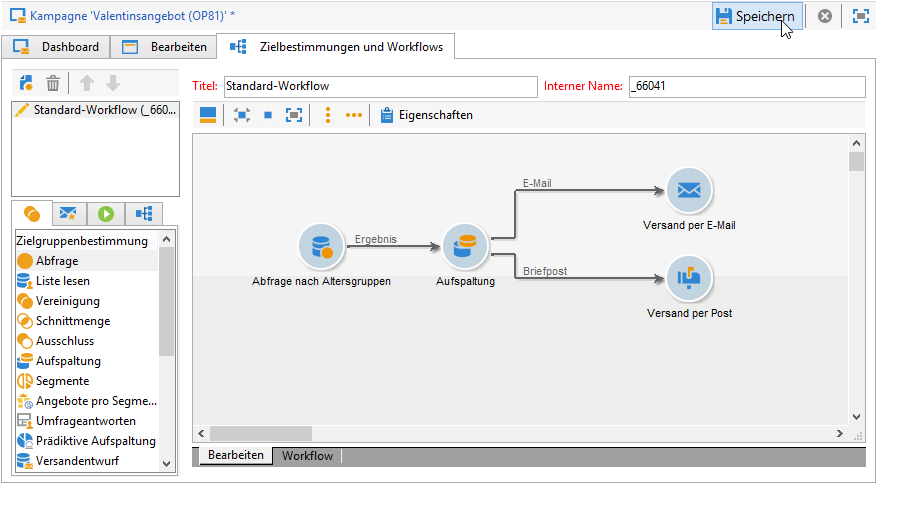

Double click the **[!UICONTROL Query]** activity to configure it according to the specified **[!UICONTROL Default values]**.

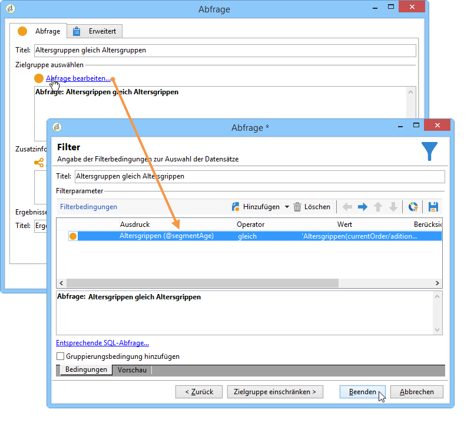

### Versand {#delivery}

In the **[!UICONTROL Audit]** tab, click the **[!UICONTROL Detail...]** icon to view the **[!UICONTROL Scheduling]** for the selected delivery.

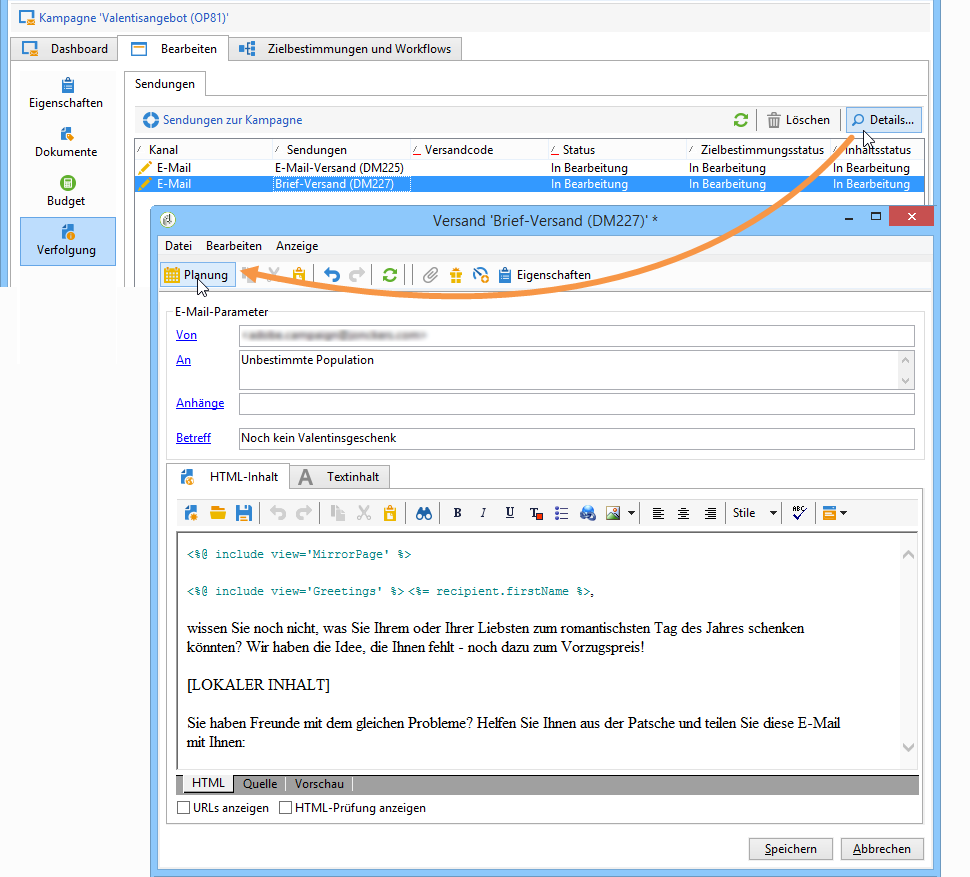

The **[!UICONTROL Scheduling]** icon lets you configure the delivery&#39;s contact and execution date.

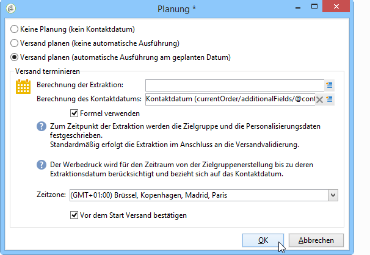

Konfigurieren Sie bei Bedarf die Maximalgröße des Versands:

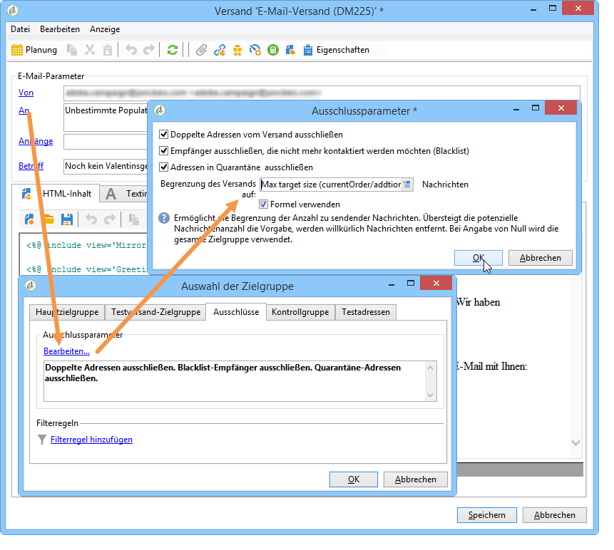

Suchen Sie nach HTML Ihrer Bereitstellung. Verwenden Sie in **[!UICONTROL Delivery > Current order > Additional fields]** diesem Beispiel das **[!UICONTROL Age segment]** Feld, um die Bereitstellung entsprechend dem Alter des Ziels zu suchen.

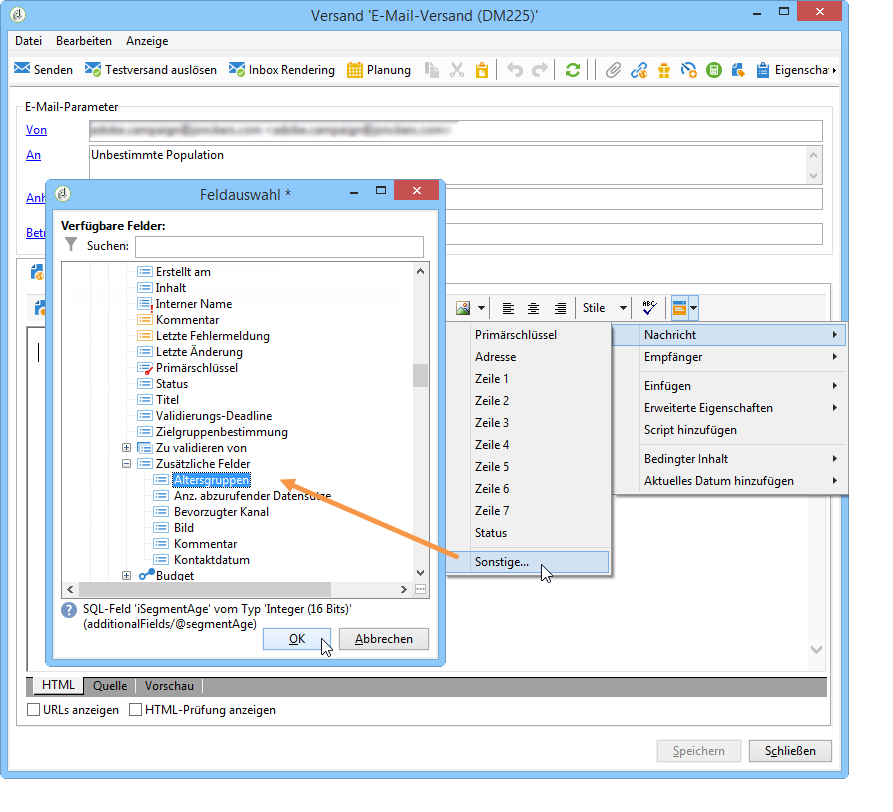

Speichern Sie Ihre Kampagnenvorlage. You can now use it from the **Campaign packages** view in the **Campaigns** universe, by clicking the **[!UICONTROL Create]** button.

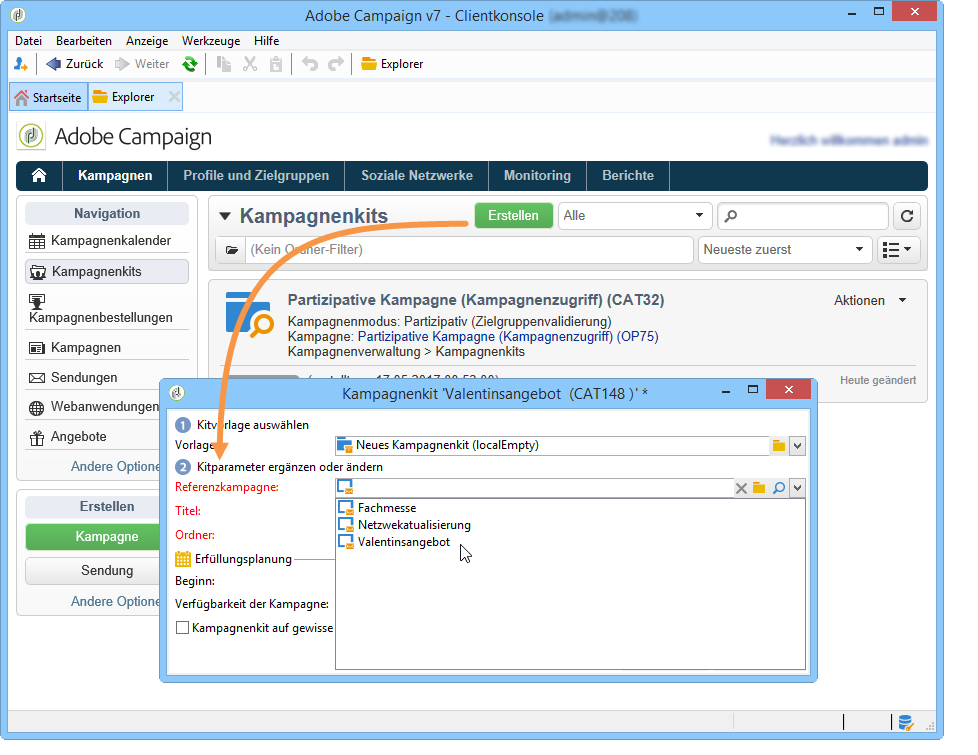

>[!NOTE]
>
>Campaign templates and their general configuration are detailed in [Campaign templates](../../campaign/using/marketing-campaign-templates.md#campaign-templates).

## Kampagnenkit erstellen {#creating-the-campaign-package}

Um die Kampagnenvorlage den Lokalstellen zur Verfügung zu stellen, muss sie der Liste hinzugefügt werden. Hierzu muss die Zentralstelle ein neues Kit erstellen.

Gehen Sie wie folgt vor:

1. In the **[!UICONTROL Navigation]** section on the **Campaigns** page, click the **[!UICONTROL Campaign packages]** link.
1. Click the **[!UICONTROL Create]** button.

   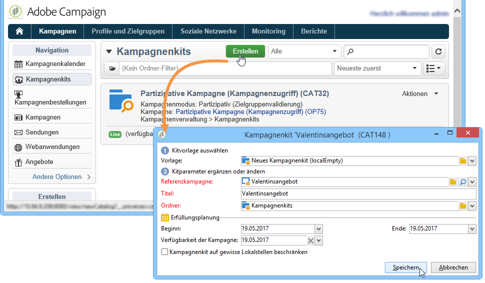

1. Im oberen Bereich des Fensters kann die [zuvor](#creating-a-local-campaign-template) definierte Kampagnenkit-Vorlage ausgewählt werden.

   Standardmäßig wird die **[!UICONTROL New local campaign package (localEmpty)]** Vorlage für lokale Kampagnen verwendet.

1. Bestimmen Sie Titel und Speicherort des Kampagnenkits und legen Sie die Ausführungsplanung fest.

### Datum-Funktionen  {#dates}

Beginn- und Enddatum bestimmen die Dauer der Sichtbarkeit der Kampagne in der Kampagnenkit-Liste.

Ab dem Verfügbarkeitsdatum können die Lokalstellen die Kampagne bestellen.

>[!CAUTION]
>
>Um an einer Kampagne teilnehmen zu können, muss diese vor dem Anmeldeschluss von der Lokalstelle bestellt werden.

Diese und andere Informationen sind über den Link in der den Lokalstellen gesendeten Benachrichtigungs-E-Mail zugänglich:

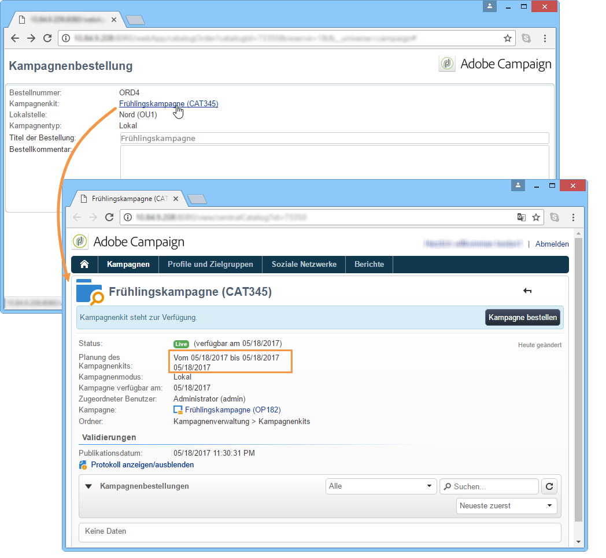

### Audience {#audience}

Bei einer lokalen Kampagne kann die zentrale Entität die beteiligten lokalen Entitäten angeben, indem sie die **[!UICONTROL Limit the package to a set of local entities]**.

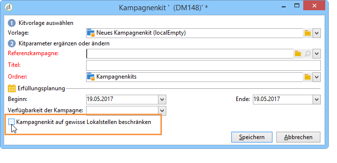

### Ergänzende Konfigurationen {#additional-settings}

Once the package is saved, the central entity can edit it from the **[!UICONTROL Edit]** tab.

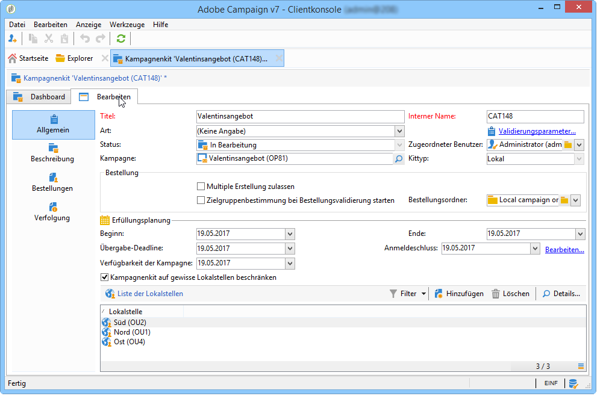

From the **[!UICONTROL General]** tab, the central entity can:

* configure the campaign package reviewer(s) from the **[!UICONTROL Approval parameters...]** link,
* die Erfüllungsplanung überprüfen,
* Lokalstellen hinzufügen oder entfernen.

>[!NOTE]
>
>Standardmäßig kann jede Lokalstelle eine **lokale Kampagne** nur ein einziges Mal bestellen.
>   
>Check the **[!UICONTROL Enable multiple creation]** option to allow several local campaigns to be created from the campaign package.

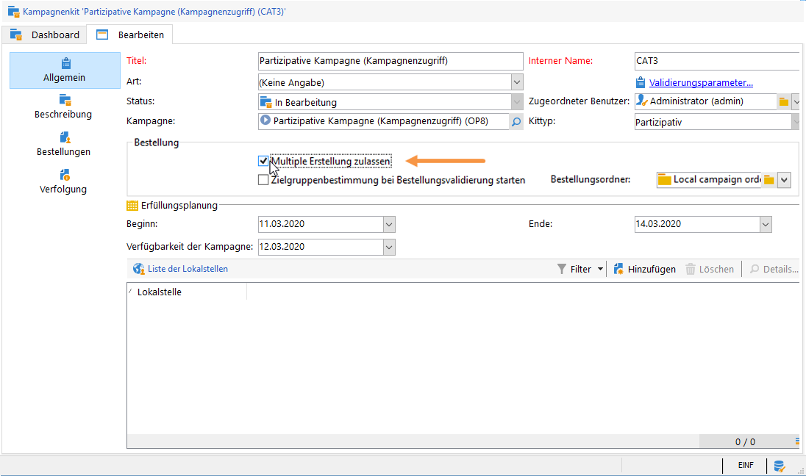

### Benachrichtigungen {#notifications}

Wenn eine Kampagne verfügbar wird oder der Registrierungszeitpunkt erreicht ist, wird eine Nachricht an die Betreiber der lokalen Benachrichtigungsgruppe gesendet. For more on this, refer to [Organizational entities](../../campaign/using/about-distributed-marketing.md#organizational-entities).

## Kampagne bestellen {#ordering-a-campaign}

Kampagnenkits werden für Lokalstellen verfügbar, sobald sie validiert wurden und ihr Ausführungszeitraum begonnen hat. Lokale Akteure werden per E-Mail informiert, wenn ein neues Kampagnenkit verfügbar ist (sobald dessen Verfügbarkeitsdatum erreicht ist).

>[!NOTE]
>
>Wenn bei der Erstellung des Kampagnenkits bestimmte Lokalstellen angegeben wurden, erhalten nur diese eine Benachrichtigung. Andernfalls werden alle Lokalstellen benachrichtigt.

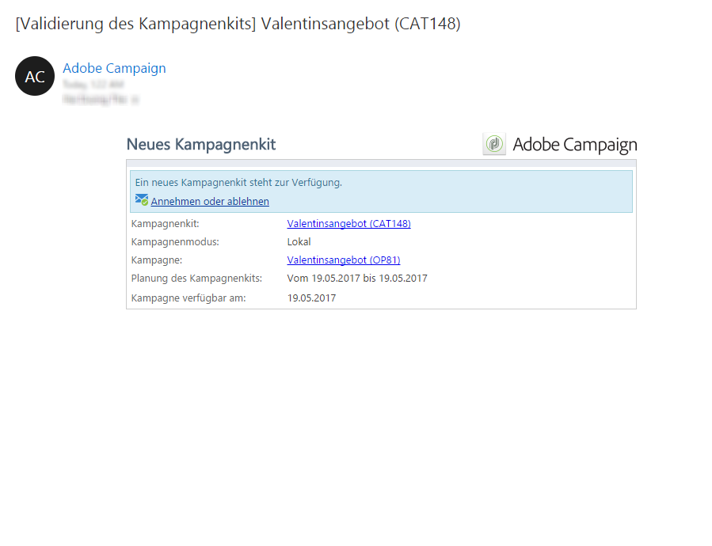

Um eine von der Zentralstelle angebotene Kampagne nutzen zu können, muss die Lokalstelle den entsprechenden Kit bestellen.

Gehen Sie wie folgt vor:

1. Click **[!UICONTROL Order campaign]** in the notification message, or the corresponding button in Adobe Campaign.

   Geben Sie Ihre Kennung und Ihr Passwort ein, um die Bestellung vorzunehmen. Sie werden zu der Webanwendung weitergeleitet, die das von der Zentralstelle konfigurierte Formular enthält.

   >[!NOTE]
   >
   >Webanwendungen werden im [Webfunktionen](../../web/using/about-web-applications.md)-Handbuch näher erläutert.

1. Enter the necessary information in the first page (order label and comment) and click **[!UICONTROL Next]**.

   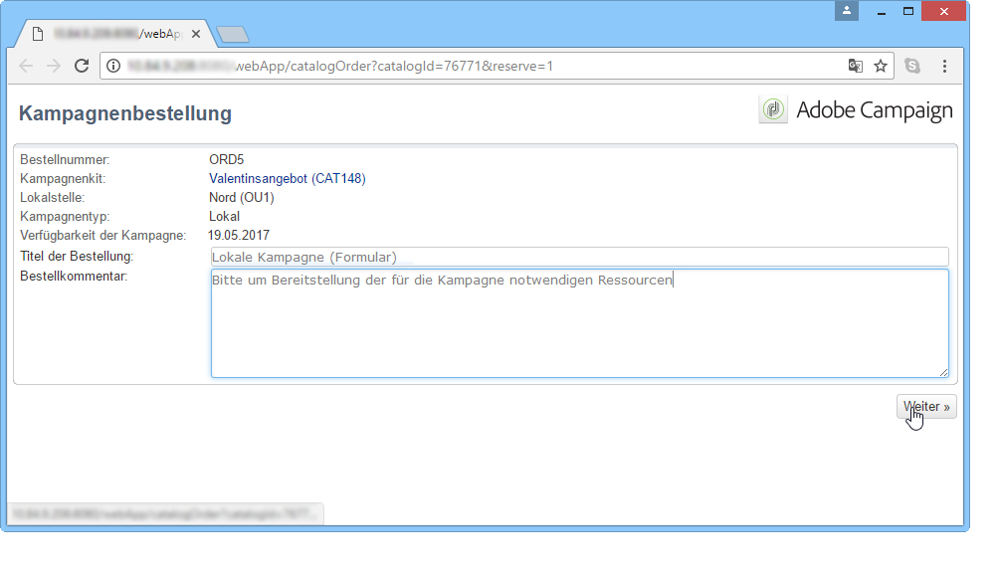

   Konfigurieren Sie die verfügbaren Parameter und bestätigen Sie die Bestellung.

   Der Verantwortliche der der bestellenden Lokalstelle übergeordneten Organisationseinheit wird per E-Mail zur Validierung der Bestellung aufgefordert.

   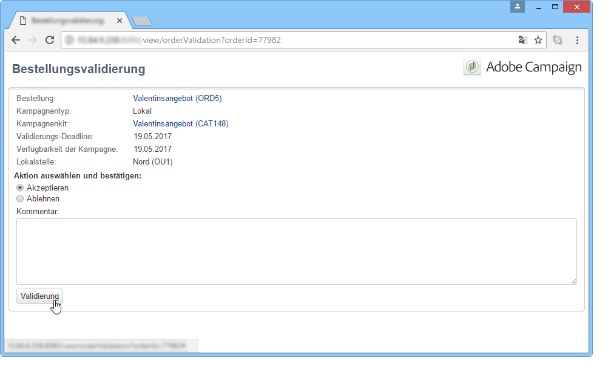

1. Die Information wird zu Lokal- und Zentralstelle weitergeleitet. Während jede Lokalstelle nur ihre eigenen Bestellungen sieht, kann die Zentralstelle alle Bestellungen aller Lokalstellen einsehen, wie im folgenden Beispiel:

   

   Die Benutzer können Details der Bestellung anzeigen lassen:

   

   The **[!UICONTROL Edit]** tab contains information entered by the local entity when ordering the campaign.

   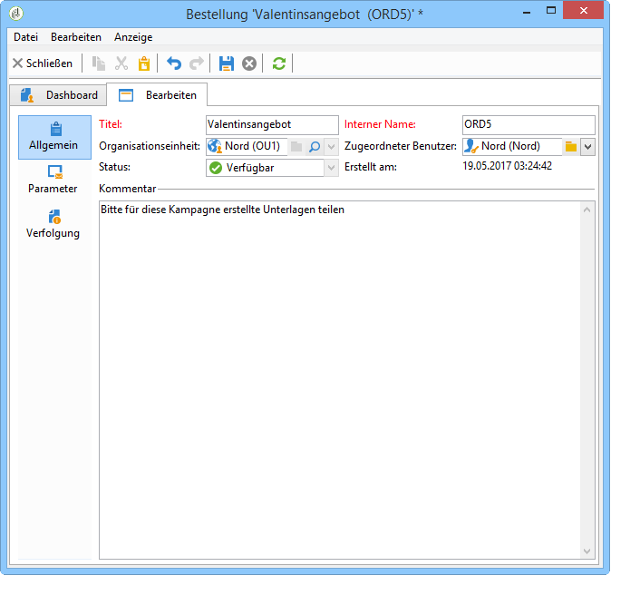

1. Zum endgültigen Abschluss der Bestellung muss diese nun auch von der Zentralstelle validiert werden.

   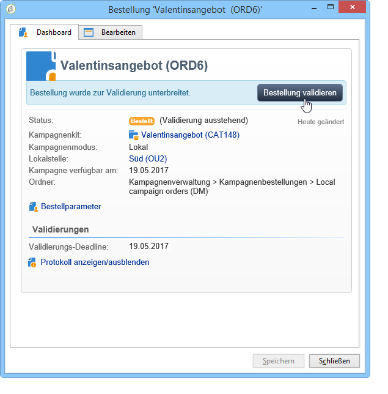

   For more on this, refer to the [Approval process](#approval-process) section.

1. The local operator is then notified that the campaign is available: campaign availability can be found in the list of campaign packages within the **Campaigns** universe. The campaign can then be used. For more on this, refer to [Accessing campaigns](../../campaign/using/accessing-campaigns.md).

   The **[!UICONTROL Start targeting with order approval]** option lets the local entity run the campaign as soon as the order has been approved.

   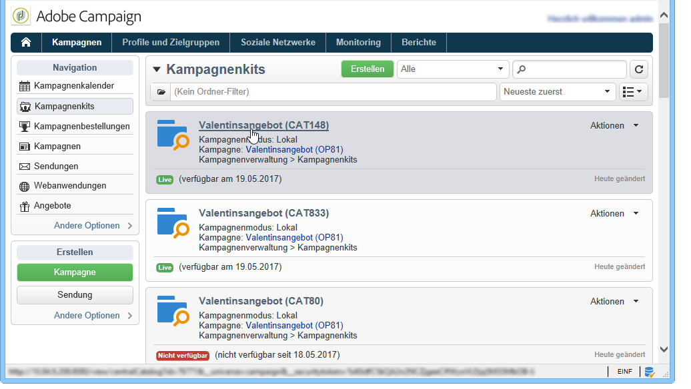

## Bestellung bestätigen {#approving-an-order}

Um die Bestellung einer Kampagne zu bestätigen, muss die Zentralstelle diese validieren.

The **[!UICONTROL Campaign orders]** overview, accessed via the **Campaigns** universe lets you view the status of campaign orders and approve them.

>[!NOTE]
>
>Solange eine Bestellung noch nicht validiert wurde, kann sie von lokalen Benutzern verändert werden.

### Validierungsprozess {#approval-process}

#### E-Mail-Benachrichtigung {#email-notification}

Wenn eine Lokalstelle eine Kampagne bestellt hat, werden die validierungsverantwortlichen Benutzer der Lokalstelle per E-Mail benachrichtigt, wie im folgenden Beispiel:

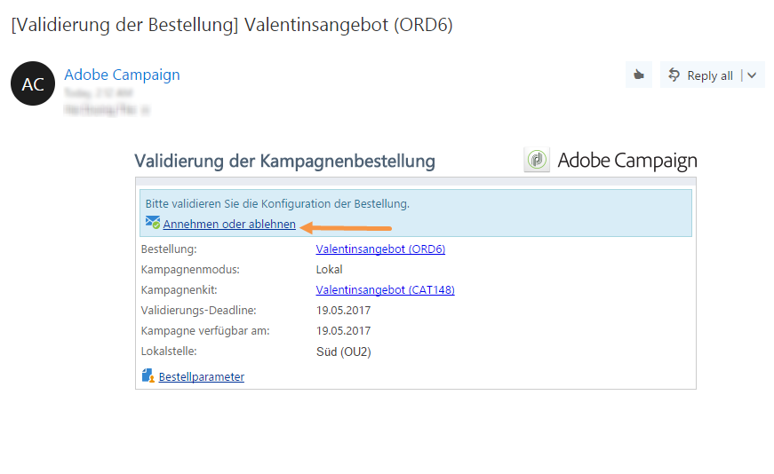

>[!NOTE]
>
>Die Auswahl der Prüfer wird im Abschnitt [Prüfer](#reviewers) angezeigt. Sie können die Bestellung annehmen oder ablehnen.

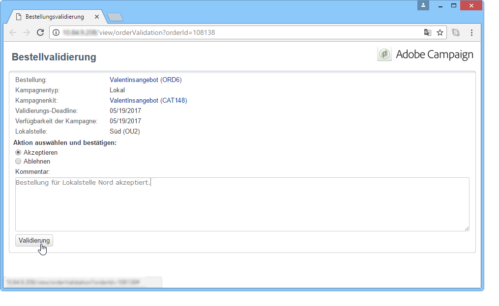

#### Validierung über die Adobe-Campaign-Konsole {#approving-via-the-adobe-campaign-console}

The order may also be approved via the console, in the campaign order overview. To approve an order, select it and click **[!UICONTROL Approve the order]**.

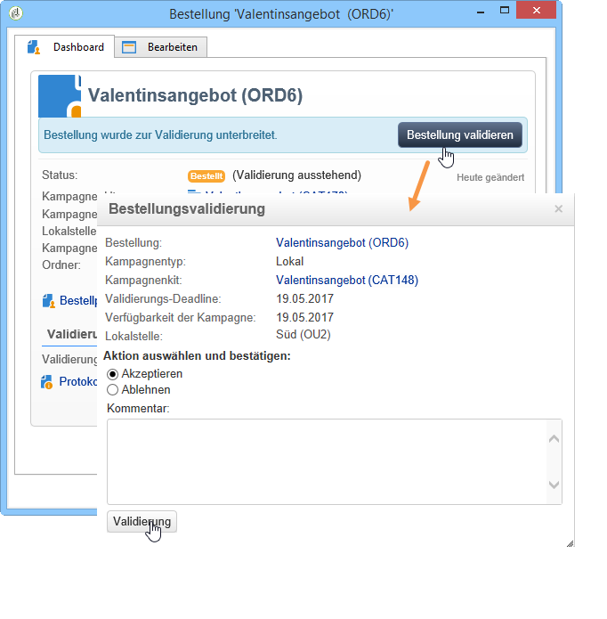

>[!NOTE]
>
>Die Kampagne kann bis zum Verfügbarkeitsdatum der Kampagne bearbeitet und neu konfiguriert werden. Lokale Entitäten können die Kampagne auch durch Klicken auf die **[!UICONTROL Cancel]** Schaltfläche ablehnen.

#### Kampagnen erstellen  {#creating-a-campaign}

Wenn eine Bestellung validiert wurde, kann es von der Lokalstelle konfiguriert und ausgeführt werden.

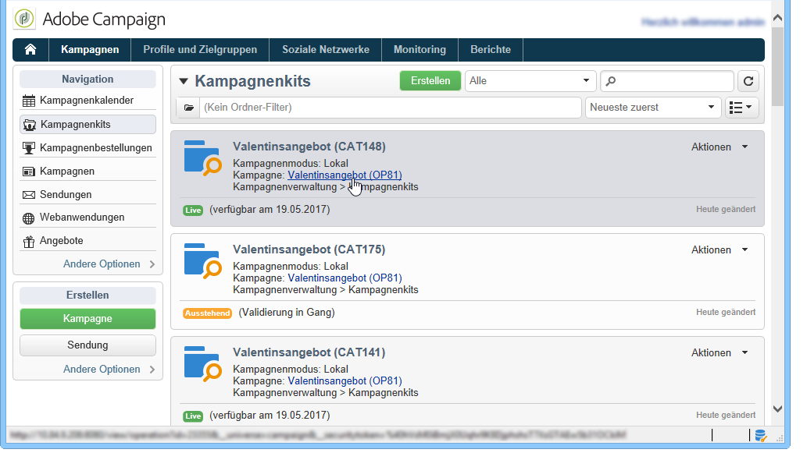

For more on this, refer to [Accessing campaigns](../../campaign/using/accessing-campaigns.md).

### Ablehnung einer Validierung {#rejecting-an-approval}

Ein validierungsverantwortlicher Benutzer kann die Validierung eines Kampagnenkits oder einer Bestellung ablehnen.

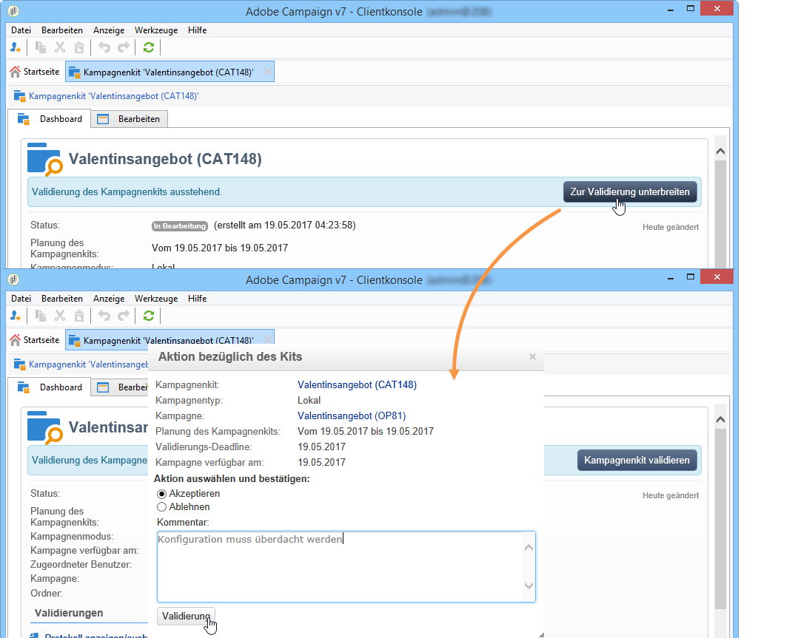

Wenn der validierungsverantwortliche Benutzer eine Bestellung ablehnt, werden die betroffenen Lokalstellen hiervon automatisch per E-Mail benachrichtigt. Die E-Mail enthält gegebenenfalls einen Kommentar des Validierers.

Die Ablehnung wird in der Liste der Kampagnenkits oder der Kampagnenbestellungen angezeigt. Für Lokalstellen mit Zugriff auf die Adobe-Campaign-Konsole ist dies eine weitere Möglichkeit, über Ablehnungen informiert zu werden.

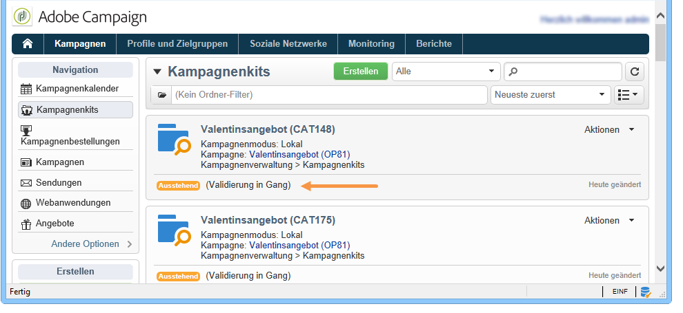

They can view the related comment in the campaign package&#39;s **[!UICONTROL Edit]** tab.

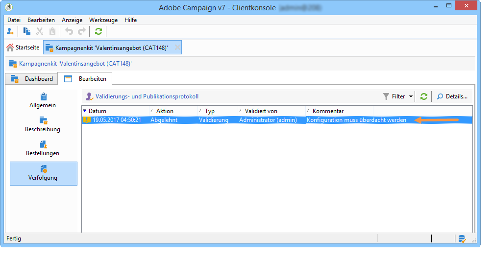

### Validierung {#reviewers}

Die validierungsverantwortlichen Benutzer werden per E-Mail benachrichtigt, wenn eine Validierung erforderlich ist.

Für jede lokale Entität werden die Prüfer für die Genehmigung der Kampagnenbestellung und die Genehmigung der Kampagne ausgewählt. Weitere Informationen zur Auswahl lokaler Prüfer finden Sie unter [Organisatorische Elemente](../../campaign/using/about-distributed-marketing.md#organizational-entities).

>[!NOTE]
>
>Die Auswahl der validierungsverantwortlichen Benutzer ist nur möglich, wenn die Bestellung noch nicht validiert wurde.

### Abbruch einer Bestellung {#canceling-an-order}

The central agency can cancel an order using the **[!UICONTROL Delete]** button, located on the order dashboard.

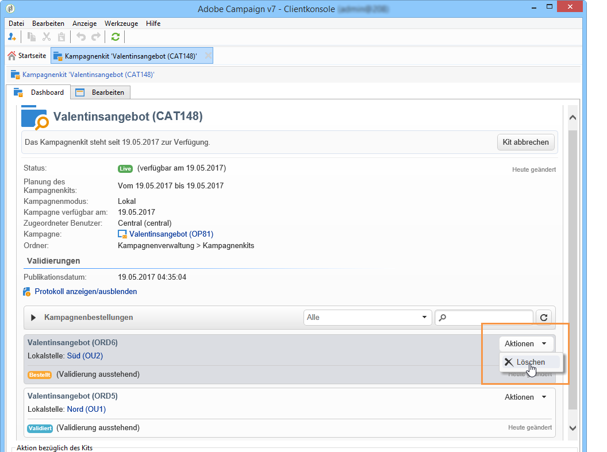

This cancels the campaign in the **[!UICONTROL Campaign orders]** view.
