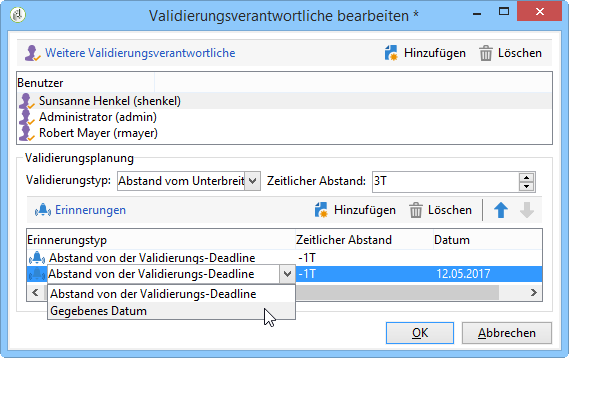

# Verwaltung von Aufgaben{#creating-and-managing-tasks}

## Über Aufgaben {#about-tasks}

Adobe Campaign ermöglicht die Erstellung von Aufgaben sowie die Verwaltung ihres gesamten Lebenszyklus innerhalb der Anwendung selbst. Die Ausführung von Programmen und Kampagnen kann in Aufgaben unterteilt werden, die Adobe-Campaign-Benutzern oder externen Dienstleistern zugeordnet werden. Dank dieser Funktionsweise ist eine reibungslose Zusammenarbeit aller internen und externen Projektbeteiligten möglich.

Die Aufgaben können in der Aufgabenliste und über das Dashboard einer Kampagne erstellt, angesehen und verfolgt werden. Ansicht und Verfolgung sind darüber hinaus auch in den Marketingplan-, Programm- und Kampagnenkalendern möglich.

Aufgaben werden Kampagnen zugeordnet und können von anderen Aufgaben abhängig sein. Jede Aufgabe weist einen Status, eine Priorität, einen geplanten Zeitaufwand sowie eventuell verbundene Kosten auf.

Alle Aufgaben sind in einer Liste gruppiert, auf die über das **Kampagnenuniversum** zugegriffen werden kann. For more on this, refer to [Accessing tasks](#accessing-tasks).

Sie können auch im Kalender des Programms, dem sie angehören, angezeigt werden.

## Zugriff auf Aufgaben {#accessing-tasks}

### Aufgaben anzeigen {#displaying-tasks}

The tasks are displayed in the task list accessible via the **[!UICONTROL Campaigns]** universe.

Hier werden alle Aufgaben des aktuellen Benutzers aufgeführt.

Weitere Informationen finden Sie unter [Ausführungsstatus einer Aufgabe](#execution-status-of-a-task) und [Status einer Aufgabe](#progress-status-of-a-task).

### Aufgaben filtern {#filtering-tasks}

When you display this view, it is automatically filtered in order to display only **[!UICONTROL operator tasks]**. You can also filter the tasks using the fields in the upper section of the window.

### Aufgaben bearbeiten {#editing-tasks}

Klicken Sie auf eine Aufgabe, um sie zu bearbeiten.

## Aufgabenerstellung {#creating-a-new-task}

To create a task, click the **[!UICONTROL Tasks]** link in the Campaigns universe and select **[!UICONTROL Create]**.

Der Name der Aufgabe, die Kampagne, der sie zugeordnet ist, sowie ihr Start- und Enddatum müssen angeben werden.

Click **[!UICONTROL Save]** to create the task.

Aufgaben können zudem über das Dashboard einer Kampagne erstellt werden: In diesem Fall werden sie automatisch der Kampagne zugeordnet, über die sie erstellt wurden.

Nachdem eine Aufgabe erstellt wurde, wird sie dem Kampagnenplan und der Liste der Aufgaben hinzugefügt. Um eine Aufgabe zu bearbeiten, wählen Sie sie aus dem Zeitplan aus oder klicken Sie in der Aufgabenübersicht auf ihren Namen und klicken Sie auf den **[!UICONTROL Open]** Link.

Geben Sie folgende Parameter an, um sie zu konfigurieren:

* Manager und Teilnehmer: beziehen Sie sich auf [Manager und Teilnehmer](#manager-and-participants).
* Der Erstellungsplan: Siehe [Ausführungsplan](#execution-schedule).
* Mittelbindungen: bezieht sich auf [Ausgaben und Einnahmen](#expenses-and-revenues).

It is also possible to ad reviewers (refer to [Reviewers](#reviewers)) and referenced documents (refer to [Documents referenced](#documents-referenced)).

Task life cycle is presented in [Life cycle](#life-cycle).

### Verantwortlicher und Teilnehmer {#manager-and-participants}

Der für eine Aufgabe verantwortliche Benutzer ist als Einziger dazu berechtigt, die Aufgabe zu beenden.

Wenn ein Adobe Campaign-Operator eine Aufgabe erstellt, wird diese automatisch zugewiesen. Um einen anderen Operator auszuwählen, verwenden Sie das **[!UICONTROL Assigned to]** Feld.

>[!NOTE]
>
>Die Benutzerverwaltung wird in diesem [Abschnitt](../../platform/using/access-management.md) beschrieben.

Neben dem Verantwortlichen können auch andere an der Ausführung der Aufgabe beteiligte Benutzer angegeben werden. Diese können nur den ihnen zugewiesenen Teil der Aufgabe validieren; sie sind nicht dazu berechtigt, sie abzuschließen.

Sie werden mithilfe des **[!UICONTROL Resources]** Symbols in der Taskleiste ausgewählt. Klicken Sie auf **[!UICONTROL Add]** und wählen Sie die betreffenden Operatoren aus.

Klicken Sie auf **[!UICONTROL Ok]** und geben Sie dann die Verwendungsrate ein: Dies steht für die dem Operator für die Dauer der Aufgabenausführung zugewiesene Last. Dieser Satz ist nur ein Hinweis und wird als Prozentsatz ausgedrückt.

Beispiel: Für eine Aufgabe wird eine Erfüllungsplanung von 10 Tagen festgelegt und einem Benutzer eine Auslastung von 50 % zugewiesen. Der Benutzer wird demnach für eine Dauer von 10 Tagen während der Hälfte seiner Arbeitszeit für die Aufgabenerfüllung eingesetzt.

Zudem ist es möglich, für jeden Benutzer einen geplanten sowie einen realisierten Arbeitsaufwand festzulegen. Diese Angaben dienen ebenfalls nur informativen Zwecken.

Sie können eine Erinnerung festlegen, die den an der Erfüllung der Aufgabe beteiligten Benutzern vor dem Enddatum der Aufgabe automatisch zugeschickt wird.

You can view the Adobe Campaign operator profile via the **[!UICONTROL Edit link]** icon.

Über das Benutzer-Dashboard kann dessen Arbeitslast, d.h. seine anderen Aufgaben, eingesehen werden.

### Validierung {#reviewers}

Neben den Teilnehmern können Sie auch Operatoren definieren, die die Aufgabe überprüfen, sobald sie von der für sie zuständigen Person geschlossen wurde. Klicken Sie dazu auf die **[!UICONTROL Enable task approval]** Option unten links im **[!UICONTROL Resources]** Fenster. Dies kann ein einzelner Operator, eine Gruppe von Operatoren oder eine Liste von Operatoren sein.

To specify a list of operators, click the **[!UICONTROL Edit...]** link to the right of the first reviewer and add as many operators as necessary, as shown below:

Im unteren Teil dieses Fensters wird die Validierungsplanung festgelegt. Standardmäßig müssen die validierenden Benutzer die Aufgabe innerhalb von drei Tagen nach ihrem Unterbreitungsdatum validieren. Hierfür kann in der Validierungsplanung eine Erinnerung konfiguriert werden, die den betroffenen Benutzern automatisch vor dem Ablauf der Validierungsfrist zugeschickt wird.

Die für die Aufgabe verantwortliche Person kann sich die Aufgabe zuweisen, sie zu genehmigen, auch wenn andere Betreiber bereits damit beauftragt wurden. Wenn kein Prüfer definiert wurde, werden die Benachrichtigungen an die für die Aufgabe zuständige Person gesendet. Alle anderen Adobe Campaign-Operatoren mit **[!UICONTROL Administrator]** Berechtigungen können die Aufgabe ebenfalls genehmigen. Sie erhalten jedoch keine Benachrichtigungen.

### Referenzierte Dokumente {#documents-referenced}

Es ist möglich, einer Aufgabe Dokumente und Marketingressourcen hinzuzufügen (weitere Informationen finden Sie unter [Verwalten von Marketingressourcen](../../campaign/using/managing-marketing-resources.md)). Öffnen Sie dazu die Aufgabe und klicken Sie auf das **[!UICONTROL Documents]** Symbol in der Taskleiste.

Klicken Sie auf **[!UICONTROL Add]** und wählen Sie das Dokument aus, das Sie der Aufgabe hinzufügen möchten. Wenden Sie denselben Prozess für Marketingressourcen an.

Die referenzierten Dokumente erscheinen in den an die verschiedenen beteiligten Benutzer gesendeten Benachrichtigungen sowie im Dashboard der Aufgabe.

### Planung {#execution-schedule}

Die Gültigkeitsdauer einer Aufgabe wird in den Feldern **[!UICONTROL Start]** und **[!UICONTROL End]** angegeben. Die geplante Last gibt die während des Zeitraums zu leistende Arbeitslast an. Er wird in Tagen oder Stunden ausgedrückt.

>[!NOTE]
>
>The life cycle of a task is presented in [Life cycle](#life-cycle).

The **[!UICONTROL Workload performed]** field also expressed in days and hours, lets you manually update the progress of the task with respect to the scheduled workload.

Der Prozentsatz **[!UICONTROL Progress status]** der Aufgabe wird automatisch auf der Grundlage der Aufgaben der beteiligten Betreiber aktualisiert. Es kann manuell eingegeben werden.

Der Fortschritt wird im Aufgaben-Dashboard angezeigt.

Die gleiche Information ist auch dem Kampagnen-Dashboard zu entnehmen.

If the task execution schedule end date has been reached but the task is not completed, the task will be **[!UICONTROL Late]**. A warning message will also be displayed to alert operators.

Weitere Informationen finden Sie unter [Status einer Aufgabe](#progress-status-of-a-task).

### Ausgaben und Einnahmen {#expenses-and-revenues}

Für jede Aufgabe können verbundene Ausgaben und geplante Einnahmen festgelegt werden. Diese werden berechnet und dann in der Kampagne konsolidert, der die Aufgabe zugeordnet ist.

To specify this information, click the **[!UICONTROL Expenses and revenue]** icon in the task toolbar.

Standardmäßig entspricht das in den Aufgabendetails angezeigte Budget dem der Kampagne, der die Aufgabe zugeordnet ist.

>[!NOTE]
>
>Weitere Informationen zu Ausgaben und Budgets finden Sie unter [Kostenbindung, Berechnung und Anrechnung](../../campaign/using/controlling-costs.md#cost-commitment--calculation-and-charging).

Im gleichen Fenster besteht die Möglichkeit, zu erfüllende Zielvorgaben festzulegen. Die Vorgaben entsprechend den geplanten Einnahmen der Aufgabe.

### Dienstleister {#service-providers}

Auch die Beteiligung externer Dienstleister an der Aufgabenverwaltung kann verzeichnet werden.

Öffnen Sie hierzu die Aufgabeneigenschaften und wählen Sie den entsprechenden Dienstleister aus. Die mit dem Dienstleister verbundenen Kostenstellen werden automatisch im mittleren Abschnitt des Fensters aufgelistet.

Weitere Informationen finden Sie unter [Erstellen eines Dienstanbieters und dessen Kostenkategorien](../../campaign/using/providers--stocks-and-budgets.md#creating-a-service-provider-and-its-cost-categories).

Wählen Sie die im Zusammenhang mit der Aufgabe anfallenden Kostenstellen aus. Geben Sie hierzu den Kostentyp an und fügen Sie gegebenenfalls einen zu belastenden Betrag hinzu.

>[!NOTE]
>
>The method for managing budgets and costs is presented in [Controlling costs](../../campaign/using/controlling-costs.md).

Jeder ausgewählte Dienstleister wird im Aufgaben-Dashboard angezeigt.

### Überfällige Aufgaben {#late-tasks}

Eine Aufgabe verspätet sich, wenn sie ihr Enddatum erreicht hat, ohne dass ihr Status in **[!UICONTROL Finished]** geändert wird. Standardmäßig wird kein Operator gewarnt, wenn eine Aufgabe zu spät kommt. Sie können die Zustellung einer E-Mail-Benachrichtigung konfigurieren: alle Operatoren können benachrichtigt werden, selbst wenn sie nicht an der Aufgabe beteiligt sind.

Wechseln Sie zum **[!UICONTROL Resources]** Feld und fügen Sie den Operator zum **[!UICONTROL Assignation]** Feld hinzu. Um mehrere Personen zu benachrichtigen, wählen Sie eine Gruppe von Operatoren aus.

### Erstbenachrichtigungen {#initial-notifications}

Wenn Sie eine Aufgabe erstellen oder verändern, deren Beginn in der Zukunft liegt, bietet Adobe Campaign die Möglichkeit, den Verantwortlichen der Aufgabe zum gegebenen Zeitpunkt per E-Mail zu informieren.

Wenn die Aufgabe, die Sie erstellen, zeitlich weit entfernt liegt, kann der Versand der Benachrichtigungs-E-Mail für einen Zeitpunkt kurz vor dem Beginn der Aufgabe programmiert werden. Wenn die Aufgabe zum Beispiel erst in einem Monat beginnt, können Sie den Verantwortlichen der Aufgabe eine Woche vor dem Beginn benachrichtigen.

To schedule a notification, go to the **[!UICONTROL Resources]** box and use the **[!UICONTROL Initial notification]** field.

* Für Aufgaben in Kampagnen sind Datum und Uhrzeit genau festzulegen.
* For tasks within campaign templates, the notification time is expressed as the time remaining before the task starts (for instance, if you enter 2d in the **[!UICONTROL Initial notification]** field, the email will be sent 2 days before the task start date).

Auch wenn eine Benachrichtigung programmiert wurde, schlägt Adobe Campaign beim Speichern der Aufgabe vor, sofort eine Benachrichtigung zu senden. Die programmierte Benachrichtigung wird auch beim Nutzen dieses Vorschlags gesendet.

### Mit einem Programm verknüpfte Aufgabe {#task-linked-to-a-program}

Aufgaben können auch direkt in einem Programm erstellt werden, um Aktionen zu verwalten, die die globale Organisation und keine bestimmte Kampagne betreffen (beispielsweise eine Besprechung über die nächsten Kampagnen innerhalb eines Programms). Die Aufgaben erscheinen dann im Kalender des Programms.

Um eine direkt mit einem Programm verknüpfte Aufgabe zu erstellen, gehen Sie wie folgt vor:

1. Open the program schedule: on the home page, go to **[!UICONTROL Campaigns > Browse > Other choices > Programs]**. The overall program schedule opens in the right-hand section of the window.
1. Klicken Sie im Kalender auf das gewünschte Programm. Es erscheint ein Fenster mit der Beschreibung des Programms.
1. In this window, click **[!UICONTROL Open]**. The program schedule opens.
1. Klicken Sie auf die **[!UICONTROL Add]** Schaltfläche über dem Zeitplan auf der rechten Seite und dann auf **[!UICONTROL Add a task]**.

### Verfügbarkeit der Benutzer {#operator-availability}

Im Task-Dashboard zeigt ein Symbol neben dem Namen des Operators an, dass er während des von der Aufgabe abgedeckten Zeitraums bereits an einer anderen Aufgabe oder einem anderen Ereignis arbeitet. (Aufgabe, die der Betreiber übernimmt oder an Folgendem beteiligt ist: wird im **[!UICONTROL Assigned to]** Feld oder im **[!UICONTROL Resources]** Feld &quot;Aufgabe&quot;angezeigt.

### Aufgabe in einem Workflow {#task-in-a-workflow}

Using a **[!UICONTROL Task]** element in a campaign workflow enables you to define two scenarios depending on whether or not the task is approved.

In the campaign workflows, the **[!UICONTROL Task]** activity is found in the **[!UICONTROL Flow control]** tab.

## Aufgabenarten {#types-of-task}

Im Zusammenhang mit einer Kampagne können spezifische Aufgaben erstellt werden. Die Art von Aufgabe wird über die Auswahl der Vorlage bestimmt.

Folgende Arten von Aufgaben können geplant werden:

* **[!UICONTROL Control task]**, siehe [Kontrollaufgaben](#control-tasks),
* **[!UICONTROL Marketing resource creation task]**, siehe [Gruppierungsaufgabe](#grouping-task),
* **[!UICONTROL Grouping task]**, siehe [Gruppierungsaufgabe](#grouping-task),
* **[!UICONTROL Notification task]**, siehe [Benachrichtigungsaufgabe](#notification-task).

>[!NOTE]
>
>**[!UICONTROL Control task]** und **[!UICONTROL Grouping]** Aufgaben können **nur** über das Kampagnen-Dashboard erstellt werden.\
>Sie werden in der Aufgabenzuordnung des Operators angezeigt, dem sie zugewiesen wurden. Siehe [Zugreifen auf Aufgaben](#accessing-tasks).

### Kontrollaufgaben {#control-tasks}

A **[!UICONTROL Control task]** is linked to delivery approval: approval of targeting, content, extraction file, budget or proof.

Die erstellte Aufgabe wird dem Kampagnen-Dashboard hinzugefügt.

Von hier aus kann die Aufgabe konfiguriert und bearbeitet werden.

### Aufgaben zur Erstellung von Marketing-Ressourcen {#marketing-resource-creation-task}

Aufgaben zur Erstellung von Marketing-Ressourcen dienen der Erstellung und Publikation von Marketing-Ressourcen. Wenn eine Ressource über eine Aufgabe und nicht nur über die Ressource selbst verwaltet wird, können Sie:

* den Erstellungsprozess der Ressource von einer Kampagne aus steuern;
* den Erstellungsprozess der Ressource in einem Kalender verfolgen;
* die Erstellungsplanung der Ressource verwalten (Erinnungen, Benachrichtigungen);
* die mit der Erarbeitung der Ressource verbundenen Kosten erfassen und kontrollieren;
* die Ressource über die Aufgabe validieren und publizieren (sofern die entsprechende Option aktiviert ist).

#### Zusammenspiel von Aufgaben und ihnen zugeordneten Ressourcen {#interaction-between-the-task-and-its-linked-resource}

Aufgaben zur Erstellung einer Marketing-Ressource interagieren mit denen ihnen zugeordneten Ressourcen. Dies bedeutet:

* Die Erarbeitungsplanung einer Ressource und die mit ihr verbundenen Kosten werden über die Aufgabe verwaltet, der sie zugordnet ist.
* Die Benutzer können wie gewohnt mit der Ressource weiterarbeiten (sie down- und uploaden, sperren und entsperren), ohne dass sich dies auf die Aufgabe auswirkt.
* Die Genehmigung und Veröffentlichung der Ressourcen kann über folgende Aufgaben erfolgen: Wenn die **[!UICONTROL Publish the marketing resource]** Option aktiviert ist, wird die Ressource nach Abschluss der Aufgabe automatisch genehmigt und veröffentlicht. Wenn die Option nicht aktiviert ist, interagieren die Aufgabe und die Ressource nicht: Das Handeln auf der einen Seite hat keine Auswirkungen auf die andere.

   Sie können eine Reihe verknüpfter Aufgaben verwenden, um einen vollständigen Genehmigungszyklus zu definieren. Aktivieren Sie die **[!UICONTROL Publish the marketing resource]** Option nur für die letzte Aufgabe: alle Aufgaben abgeschlossen werden müssen, damit die Ressource veröffentlicht werden kann. Wenn Sie außerdem eine untergeordnete Marketingressourcenaufgabe erstellen, wird die Ressource automatisch in der untergeordneten Aufgabe ausgewählt.

   * **Über die Ressource**: Wenn die Ressource validiert oder zur Validierung unterbreitet wird, hat dies keinerlei Auswirkung auf die Aufgabe.
   * **Über die Aufgabe**: Wenn die **[!UICONTROL Publish the marketing resource]** Option in der Aufgabe aktiviert ist, wird die Ressource nach Abschluss der Aufgabe automatisch genehmigt und veröffentlicht (siehe oben). Wenn die Option nicht aktiviert ist, werden die Aufgabe und die Ressource nicht interagiert: Das Handeln auf der einen Seite hat keine Auswirkungen auf die andere.

#### Aufgabe zur Erstellung einer Marketing-Ressource konfigurieren {#configuring-a-marketing-resource-creation-task}

Die Person, die die Aufgabe überprüft, ist nicht notwendig, die Person, die den in der Ressource definierten Inhalt überprüft. Wenn die **[!UICONTROL Publish the marketing resource]** Option jedoch aktiviert ist (siehe unten), ist der Aufgabenprüfer berechtigt, den Ressourceninhalt zu genehmigen, da beim Beenden der Aufgabe die Ressource automatisch genehmigt wird (oder, wenn kein Prüfer definiert ist, der Aufgabenmanager).

In the **[!UICONTROL Marketing resource]** field, define the resource you want to manage via this task. Sie haben folgende Möglichkeiten:

* Select an existing resource: the drop-down list offers all resources with the status **[!UICONTROL Being edited]**.
* Erstellen einer Ressource: Klicken Sie auf das **[!UICONTROL Select the link]** Symbol und dann auf das **[!UICONTROL Create]** Symbol.

The **[!UICONTROL Publish the marketing resource]** option lets you automate resource publishing: once the task is **[!UICONTROL Finished]**, the status of the resource automatically switches to **[!UICONTROL Published]**, even if it was neither submitted for approval or approved, including if the reviewer who completes the task isn&#39;t the content reviewer defined in the resource.

Die **[!UICONTROL Publish the resource]** Schaltfläche wird zur Verfügung gestellt, und der Reviewer für Ressourcenveröffentlichungen erhält eine Benachrichtigungs-E-Mail, um ihm mitzuteilen, dass er bereit ist, veröffentlicht zu werden. Auf der **[!UICONTROL Edit > Tracking]** Registerkarte wird die Überprüfung und Veröffentlichung durch den Aufgabenprüfer sichtbar. Wenn ein Workflow zur Nachbearbeitung von Ressourcen definiert wurde, wird er jetzt ausgeführt.

### Gruppierungsaufgaben {#grouping-task}

The **[!UICONTROL Grouping task]** type task lets you group several tasks and synchronize the management of their progress and their approval.

Gruppierungsaufgaben haben weder Ausgaben noch mit ihnen verbundene Ressourcen.

Im Dashboard einer Gruppierungsaufgabe können alle in ihr zusammengefassten Aufgaben eingesehen werden. Diese können nach Bedarf gefiltert werden.

Gruppierungsaufgaben verfügen über einen Link, der die Erstellung von enthaltenen Aufgaben erleichtert.

To create a grouped task based on a grouping task, go to the campaign dashboard and click the name of the grouping task to display its description, then click **[!UICONTROL Add a task]**.

However, if you have already created a task that you want to link to a grouping task, you can do it via the **[!UICONTROL Linked to]** field of the **[!UICONTROL Properties]** box.

### Benachrichtigungsaufgaben {#notification-task}

Benachrichtigungsaufgaben ermöglichen es, den Versand von E-Mails (an Benutzer, Benutzergruppen, Dienstleister usw.) zu konfigurieren. Es können zum Beispiel E-Mails konfiguriert werden, die eine Person an den bevorstehenden Abschluss einer Kampagne erinnert. Auch Dokumente können vor dem Beginn einer Kampagne zu ihrer Vorbereitung durch die Benutzer versandt werden. Auf diese Weise wird der Informationsaustausch in der entsprechenden Kampagne oder im Programm protokolliert und Sie erhalten eine vollständige Übersicht über ausgeführte Aktionen.

#### Workflow-Lebenszyklen {#life-cycle}

Benachrichtigungsaufgaben erfordern keine Validierung. Ihr Zyklus ist daher einfacher als der einer Standardaufgabe:

Eine Benachrichtigungsaufgabe kann folgende Status haben:

* **[!UICONTROL Scheduled]** bis zum Senden der E-Mail
* **[!UICONTROL In progress]** sobald die E-Mail gesendet wurde und bis das Enddatum erreicht ist
* **[!UICONTROL Finished]** nach Erreichen des Enddatums.

#### Konfiguration {#configuration}

Bei der Erstellung müssen folgende Elemente der Aufgabe erfasst werden:

* **[!UICONTROL Assigned to]** : der Operator oder die Gruppe von Operatoren, die die E-Mail erhalten. Wenn Sie die Aufgabe erneut zuweisen, nachdem die E-Mail gesendet wurde, wird die E-Mail nicht an den neuen Operator gesendet (dazu müssen Sie die Aufgabe neu initialisieren und das Startdatum ändern).
* **Beginn der Aufgabe**: Es handelt sich um das Datum, an dem die Benachrichtigungs-E-Mail versandt wird. Dieses Datum muss zum Zeitpunkt der Aufgabenspeicherung zwingend in der Zukunft liegen.
* **Enddatum** der Aufgabe: Datum, an dem sich der Aufgabenstatus ändert **[!UICONTROL Finished]**. Das Enddatum ist standardmäßig mit dem Anfangsdatum identisch. Wenn Sie der Aufgabe jedoch eine Dauer zuweisen, können Sie bei Bedarf die Zeit symbolisieren, die der Bediener im Zeitplan einhalten muss.
* **[!UICONTROL Description]** : Der hier eingegebene Text wird im Text der Benachrichtigungs-E-Mail angezeigt.

   

Sie können der Aufgabe und der Benachrichtigungs-E-Mail eine Anlage hinzufügen. Klicken Sie dazu auf das **[!UICONTROL Documents]** Symbol in der Symbolleiste in der oberen rechten Ecke.

## Workflow-Lebenszyklen {#life-cycle-1}

### Relationen zwischen Aufgaben {#links-between-tasks}

Mit der **[!UICONTROL Properties]** Schaltfläche in jeder Aufgabe können Sie die Verknüpfungen zwischen Aufgaben in einer Kampagne definieren. Sie können Aufgaben mithilfe einer Gruppenaufgabe in Unteraufgaben aufteilen (siehe [Verknüpfte Aufgaben](#linked-tasks)) oder Abhängigkeiten zwischen den Aufgaben definieren (siehe [Gruppieren von Aufgaben](#grouping-tasks)).

#### Gruppierung von Aufgaben {#linked-tasks}

Use the **[!UICONTROL Linked task]** field to associate tasks with a grouping task. Siehe [Aufgabenarten](#types-of-task).

Im folgenden Beispiel wird die Validierung der Zielgruppenbestimmung in vier Unteraufgaben aufgeteilt.

Jede Unteraufgabe ist eine Standardaufgabe, die mit der Hauptaufgabe verknüpft ist.

#### Abhängigkeit von Aufgaben {#grouping-tasks}

Use the **[!UICONTROL Grouped to]** field to make the execution of a task depend on the execution of another task.

Die Abhängigkeit zwischen den Aufgaben wird mithilfe von Pfeilen im Kampagnen-Dashboard dargestellt.

Bei gruppierten Aufgaben weist Adobe Campaign der untergeordneten Aufgabe automatisch das Enddatum der übergeordneten Aufgabe als Startdatum zu. Wenn beispielsweise eine **Einladung** erstellen am 15. Oktober um 15:30 Uhr endet, beginnt die untergeordnete Aufgabe Einladung per E-Mail **** senden am 15. Oktober um 15:30 Uhr.

Wenn Sie außerdem das Ende einer übergeordneten Aufgabe verschieben, können einige der untergeordneten Aufgaben betroffen sein: Dies sind die untergeordneten Aufgaben, deren Status **[!UICONTROL Scheduled]** und deren Startdatum vor dem neuen Enddatum der übergeordneten Aufgabe liegt. Die Dauer der Aufgabe bleibt gleich. Wenn das Startdatum einer untergeordneten Aufgabe nach dem neuen Enddatum der übergeordneten Aufgabe liegt, wirkt sich dies nicht auf die untergeordnete Aufgabe aus.

**Beispiel**

Eine Hauptaufgabe, deren Ende für den 9. Oktober um 17 Uhr geplant ist, hat zwei Unteraufgaben: Aufgabe A und Aufgabe B. Der Beginn von Aufgabe A ist für den 10. Oktober um 14 Uhr, der von Aufgabe B für den 12. Oktober um 8 Uhr geplant.

Nun wird das Ende der Hauptaufgabe auf den 11. Oktober um 13 Uhr verschoben. Dadurch verschiebt sich nur der Beginn von Aufgabe A auf den 11. Oktober um 13 Uhr.

### Ausführungsstatus einer Aufgabe {#execution-status-of-a-task}

Der Status einer Aufgabe kann in der Aufgabenübersicht eingesehen werden. Er wird jeden Tag automatisch enstprechend der ausgeführten Benutzeraktionen aktualisiert.

Eine Aufgabe kann sein: **[!UICONTROL Scheduled]**, **[!UICONTROL In progress]**, **[!UICONTROL Finished]**, **[!UICONTROL Canceled]** oder **[!UICONTROL Pending approval]****[!UICONTROL Rejected]**.

* Wenn eine Aufgabe erstellt wird, ist dies der Fall, **[!UICONTROL Scheduled]** wenn ihr Startdatum in der Zukunft liegt. Dieser Status wird beibehalten, bis das Startdatum erreicht ist.
* Once it has been started, the task is **[!UICONTROL In progress]**. When the person in charge of the task closes it, it changes to **[!UICONTROL Finished]**.
* Wenn ein Prüfer definiert wurde, wird die Aufgabe **[!UICONTROL Pending approval]** beendet, sobald die dafür verantwortliche Person sie schließt und der Prüfer sie genehmigt. Wenn der Prüfer sie ablehnt, wird die Aufgabe **[!UICONTROL Rejected]** ausgeführt.
* A task can be canceled by the person responsible for it via the dashboard or the **[!UICONTROL Task map]** by clicking the **[!UICONTROL Cancel]** button.
* Um eine Aufgabe zu planen, geben Sie ein Startdatum in die Zukunft ein. Anschließend können Sie eine erste Benachrichtigung an die Adobe Campaign-Operatoren senden, die an der Ausführung der Aufgabe beteiligt sind. See [Complete task life cycle](#complete-task-life-cycle).

>[!NOTE]
>
>* Der Status der Aufgabe wird automatisch aktualisiert.
>* Eine Aufgabe, die nicht von ihrem Verantwortlichen geschlossen wurde, erscheint auch nach Ablauf ihres Gültigkeitszeitraums in den laufenden Aufgaben. In diesem Fall informiert ein Warnhinweis die Benutzer darüber, dass die Aufgabe überfällig ist.
>

### Fortschritt einer Aufgabe {#progress-status-of-a-task}

Zusätzlich zum Ausführungsstatus kann eine Aufgabe mit einem Statusstatus verknüpft werden: **[!UICONTROL Late]**, **[!UICONTROL To approve]**, **[!UICONTROL To do today]** oder **[!UICONTROL To do this week]**. Diese Informationen werden gemäß dem Aufgabenplan automatisch eingegeben.

Sie können die Liste der Aufgaben nach Erfüllungs- oder Fortschrittstatus filtern.

For more on this, refer to [Accessing tasks](#accessing-tasks).

### Vollständiger Lebenszyklus einer Aufgabe {#complete-task-life-cycle}

Im Folgenden werden die Etappen des vollständigen Zyklus einer Aufgabe dargestellt, für die der Verantwortliche beteiligte und validerende Benutzer festgelegt hat.

1. Die verantwortliche Person erstellt die Aufgabe und gibt die verschiedenen Felder ein. For more on this, refer to [Creating a new task](#creating-a-new-task).

   Bei Erstellung und Änderung einer **in der Zukunft geplanten** Aufgabe (das Beginndatum der Aufgabe darf noch nicht erreicht sein) können der Verantwortliche sowie alle Beteiligten per E-Mail über die Planung einer neuen Aufgabe informiert werden.

   

   To send this first notification, click **[!UICONTROL Yes]**. This notification tells them about the next task and includes details on content and the number of days remaining until its deadline.

   When a task is created and scheduled for the future, its status is **[!UICONTROL Scheduled]**.

1. On the task start date, the person responsible and the participants receive a notification telling them that the task is started. Its status changes to **[!UICONTROL In progress]**.
1. Wenn ein Beteiligter seinen Teil der Aufgabe abgeschlossen hat, kann er die Aufgabe auf zweierlei Weisen erfüllen:

   * über die Benachrichtigungs-E-Mail;
   * im Dashboard der Aufgabe über die Konsole oder die Web-Schnittstelle.

      

1. Nach jeder neuen Validierung wird der Fortschritt der Aufgabe automatisch aktualisiert.

   

1. Der Verantwortliche wird bei jedem Teilabschluss der Aufgabe durch einen Beteiligten benachrichtigt.

   Er kann den Fortschritt der Aufgabe im Aufgaben-Dashboard verfolgen.

   

1. Wenn der Verantwortliche die Aufgabe als abgeschlossen erachtet, kann er sie entweder über die Benachrichtigungs-E-Mail,die er zu Beginn der Aufgabe erhalten hat, über die Konsole oder über die Webschnittstelle beenden.

   

   >[!NOTE]
   >
   >Der Verantwortliche kann die Aufgabe jederzeit beenden, auch wenn noch nicht alle Beteiligten ihre Aufgabenteil erfüllt haben. Der Fortschritt wird dann automatisch auf 100 % gesetzt.

1. The task status changes to **[!UICONTROL To approve]**, and a notification is sent to the reviewer.

   Dieser validiert die Aufgabe über die Benachrichtigungs-E-Mail, die Konsole oder die Webschnittstelle.

   Er kann das Kampagnen-Dashboard zur Validierung nutzen:

   

   Er kann die Aufgabe auch direkt über deren Validierungsschaltfläche validieren:

   

   >[!NOTE]
   >
   >The task status will only change to **[!UICONTROL To approve]** if you have enabled the **[!UICONTROL Enable task validation]** option in the **[!UICONTROL Resources]** window of the task.\
   >If the reviewer rejects the task, its status changes to **[!UICONTROL Rejected]**, and the task life cycle starts again automatically.

1. The task status changes to **[!UICONTROL Finished]**. A notification is sent to everyone involved.

   >[!NOTE]
   >
   >Sobald eine Aufgabe abgeschlossen ist, kann ihr Lebenszyklus von der dafür verantwortlichen Person neu initialisiert werden. Öffnen Sie dazu die Aufgabe und klicken Sie auf den **[!UICONTROL Reset task to execute it again...]** Link unten im Dashboard.

