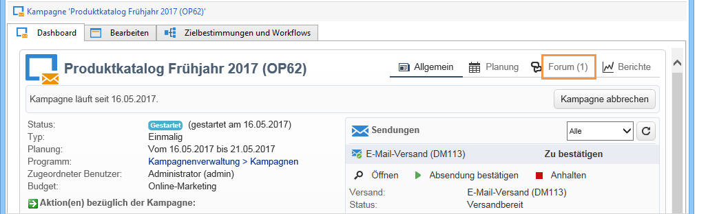
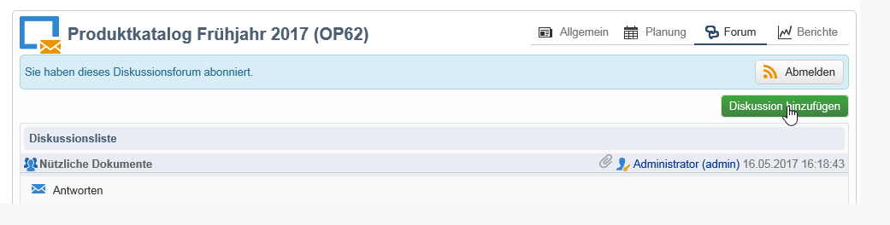
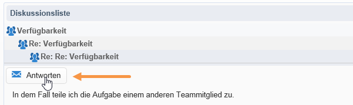
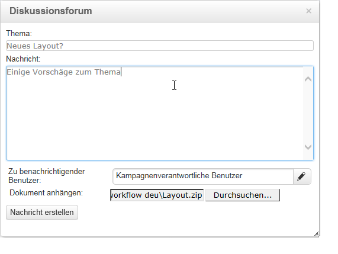
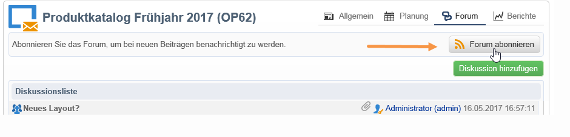
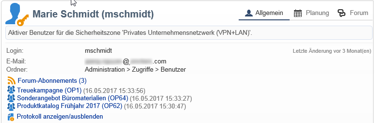
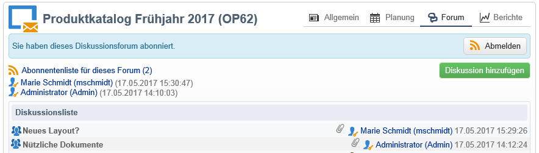

# Diskussionsforen{#discussion-forums}

Adobe-Campaign-Benutzer haben die Möglichkeit, über Diskussionsforen Informationen auszutauschen. Die folgenden Elemente bieten ihr eigenes Forum: Pläne, Programme, Kampagnen, Ressourcen, Simulationen und Lager. Jeder Benutzer verfügt zudem über ein persönliches Forum. Alle Diskussionen sind öffentlich, auch die der Benutzer-Foren.

Benutzer können Foren abonnieren, um per E-Mail über jede gepostete Nachricht informiert zu werden.

## Zugriff auf ein Forum {#accessing-a-forum}

Um auf das Forum einer Kampagne, eines Benutzers usw. zuzugreifen, klicken Sie auf die Schaltfläche **[!UICONTROL Forum]** rechts oben im jeweiligen Dashboard. Nach dem Titel der Schaltfläche werden in Klammern die Gesamtzahl aller Nachrichten des Forums angegeben.

## Nutzung eines Forums {#using-a-forum}

Nachrichten und ihre Antworten werden chronologisch geordnet (von neu nach alt).

Um den Inhalt einer Nachricht anzuzeigen, klicken Sie auf ihren Titel.

**Neue Diskussionen beginnen**

Um eine neue Diskussion zu beginnen, klicken Sie auf die Schaltfläche **[!UICONTROL Diskussion hinzufügen]** rechts oben. Daraufhin erscheint das Fenster **[!UICONTROL Diskussionsforum]** (siehe weiter unten).

**Nachrichten in einer existierenden Diskussion posten**

Um eine Nachricht in einer existierenden Diskussion zu posten, öffnen Sie die Nachricht, auf die Sie antworten möchten, und klicken Sie auf den Link **[!UICONTROL Antworten]** links oberhalb der Nachricht. Das Fenster **[!UICONTROL Diskussionsforum]** erscheint (siehe unten).

Wenn Sie auf eine Nachricht antworten, wird der Autor der Nachricht per E-Mail benachrichtigt.

**Nachrichten schreiben**

Gehen Sie ins Fenster **[!UICONTROL Diskussionsforum]**:

1. Geben Sie den gewünschten Text im Feld **[!UICONTROL Nachricht]** und gegebenenfalls einen Diskussionstitel im Feld **[!UICONTROL Thema]** ein.

   

1. Bei Bedarf:

   * Wenn Sie möchten, dass eine nicht abonnierte Person an der Diskussion teilnimmt, nutzen Sie das Feld **[!UICONTROL Zu benachrichtigender Benutzer]**. Der eingetragene Benutzer erhält eine Benachrichtigungs-E-Mail speziell für diese Nachricht, er wird nicht automatisch zum Abonnent. Um mehrere Benutzer zu benachrichtigen, wählen Sie eine Benutzergruppe aus.
   * Über das Feld **[!UICONTROL Durchsuchen]** können Sie der Nachricht ein Dokument anhängen. Das angehängte Dokument wird auch der Benachrichtigungs-E-Mail hinzugefügt. Jeder Nachricht kann nur eine Datei angehängt werden. Verwenden Sie eine komprimierte Datei, um mehrere Dokumente zu senden.

1. Klicken Sie auf **[!UICONTROL Nachricht erstellen]**, um eine Nachricht im Forum zu posten.

>[!NOTE]
>
>Wenn die Nachricht gepostet wurde, kann sie nicht mehr geändert oder gelöscht werden.

## Posts in persönliche Benutzerforen {#posting-to-the-personal-forum-of-an-operator}

Sie haben die Möglichkeit, eine Nachricht im persönlichen Forum eines Benutzers zu posten, wenn sich diese zum Beispiel nicht auf eine bestimmte Kampagne bezieht, Sie jedoch den Diskussionsverlauf in Adobe Campaign verfolgen möchten. Die persönlichen Benutzerforen sind öffentlich, alle Benutzer können die darin enthaltenen Nachrichten lesen. Der jeweilige Benutzer wird per E-Mail über jede in seinem Forum gepostete Nachricht informiert.

Es gibt folgende Möglichkeiten, auf ein Benutzerforum zuzugreifen:

* Wählen Sie, wenn Sie über die entsprechenden Berechtigungen verfügen, im Knoten **[!UICONTROL Administration > Zugriffe > Benutzer]** das Dashboard des gewünschten Benutzers aus und klicken Sie auf die Schaltfläche **[!UICONTROL Forum]** oben rechts.
* Suchen Sie andernfalls den Namen des Benutzers in Adobe Campaign (zum Beispiel über eine von ihm gepostete Forumsnachricht oder eine ihm zugeordnete Aufgabe) und klicken Sie auf diesen, um auf sein Dashboard zuzugreifen. Sie können zudem Ihren Administrator bitten, Ihnen eine Ansicht auf den Benutzerordner zu erstellen.

## Abonnieren eines Forums {#subscribing-to-a-forum}

Sie können ein Forum abonnieren, um den enthaltenen Diskussionen zu folgen und über jede im Forum gepostete Nachricht per E-Mail informiert zu werden. Die E-Mail enthält sowohl die Nachricht als auch mögliche Anhänge. Sie können direkt auf die Nachricht antworten, indem Sie in den E-Mail-Body klicken und sich anschließend über den Adobe-Campaign-Webzugriff anmelden. Wenn Sie ein Forum abonnieren, ist dies für alle Benutzer sichtbar.

* Um ein Forum zu abonnieren, klicken Sie auf die Schaltfläche **[!UICONTROL Forum abonnieren]** rechts oberhalb der Diskussionsliste.

   

   Daraufhin erscheint ein blaues Band, in dem ihr Abonnement bestätigt wird.

* Wenn Sie sich von einem Forum abmelden möchten, klicken Sie auf die Schaltfläche **[!UICONTROL Abmelden]** in dem blauen Band.

   

* In Ihrem persönlichen Dashboard werden die von Ihnen abonnierten Foren aufgelistet. Klicken Sie auf den Link **[!UICONTROL Forum-Abonnements]**, um die Liste anzuzeigen, und anschließend auf das Forum, auf das Sie zugreifen möchten.

   

   Weitere Informationen zu persönlichen Dashboards finden Sie in [diesem Abschnitt](../../platform/using/access-management.md#operators).

* Um die Abonnenten eines Forums anzuzeigen, klicken Sie auf **[!UICONTROL Abonnentenliste für dieses Forum]** oberhalb der Nachrichtenliste.

   

## Überprüfung des Benachrichtigungsversands {#checking-notification-delivery}

Falls Abonnenten eines Forums nicht die erwarteten Benachrichtigungen erhalten, empfehlen wir folgende Vorgehensweise:

* Stellen Sie sicher, dass die Benutzer eine E-Mail-Adresse in ihrem Profil angebeben haben.
* Gehen Sie zum Knoten **[!UICONTROL Administration > Betreibung > Technische Workflows > Kampagnenprozesse]** und stellen Sie sicher, dass der Workflow **[!UICONTROL Vorgänge in Diskussionsforen]** gestartet und nicht fehlgeschlagen ist.
* Überprüfen Sie die Versandlogs, die wie folgt zugänglich sind:

   * Gehen Sie von der Adobe-Campaign-Startseite aus zu **[!UICONTROL Kampagnen > Navigation > Sendungen]** und öffnen Sie den Versand **[!UICONTROL Benachrichtigungen bezüglich Diskussionforen]**.
   * Gehen Sie im Explorer zum Knoten **[!UICONTROL Administration > Automatisch erstellte Objekte > Technische Sendungen > Workflow-Benachrichtigungen]** und klicken Sie auf **[!UICONTROL Benachrichtigungen bezüglich Diskussionsforen]**.

   Im Fenster **[!UICONTROL Benachrichtigungen bezüglich Diskussionsforen]** befinden sich die Versandlogs im Tab **[!UICONTROL Bearbeiten > Versand]**. Überprüfen Sie ebenfalls die Tabs **[!UICONTROL Verfolgung > Protokoll]** und **[!UICONTROL Ausschlussgründe]**.

