# Beispiele{#examples}

## Erstellung einer lokalen Kampagne (Standardformular) {#creating-a-local-campaign--by-form-}

Der Webschnittstellentyp **Standardformular** impliziert die Nutzung einer **Webanwendung**. Diese kann entsprechend ihrer Konfiguration unterschiedliche anzupassende Elemente enthalten. Beispielsweise besteht die Möglichkeit, der Lokalstelle Links zur Evaluierung von Zielgruppe, Budget und Inhalt über dedizierte APIs zur Verfügung zu stellen.

>[!NOTE]
>
>Die diversen APIs werden in einem separaten Dokument beschrieben, auf das je nach Lizenzvertrag Zugriff besteht, siehe [APIs](../../configuration/using/about-web-services.md).

>[!NOTE]
>
>Die in diesem Beispiel verwendete Webanwendung ist nicht standardmäßig in Adobe Campaign vorhanden. Um in einer Kampagne ein Formular benutzen zu können, muss vorab die entsprechende Webanwendung erstellt werden.

When creating the campaign template, click the **[!UICONTROL Zoom]** icon within the **[!UICONTROL Web interface]** option of the **[!UICONTROL Advanced campaign settings...]** link to access details of the Web application.

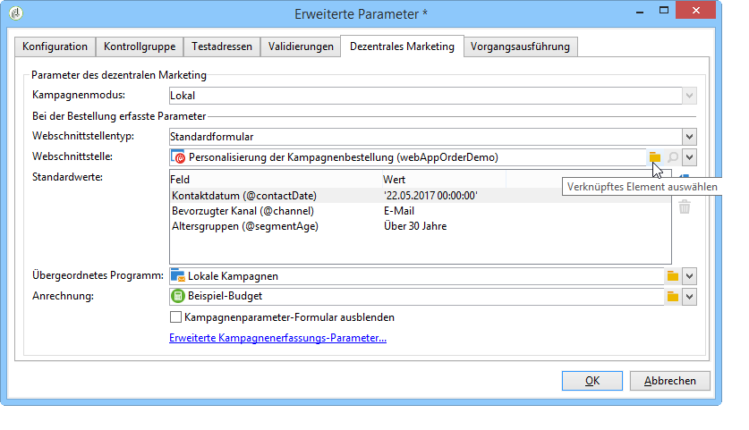

>[!NOTE]
>
>Die Konfiguration der Webanwendung kann nur in der Kampagnenvorlage vorgenommen werden.

In the **[!UICONTROL Edit]** tab, select the **Campaign order** activity and open it to access its content.

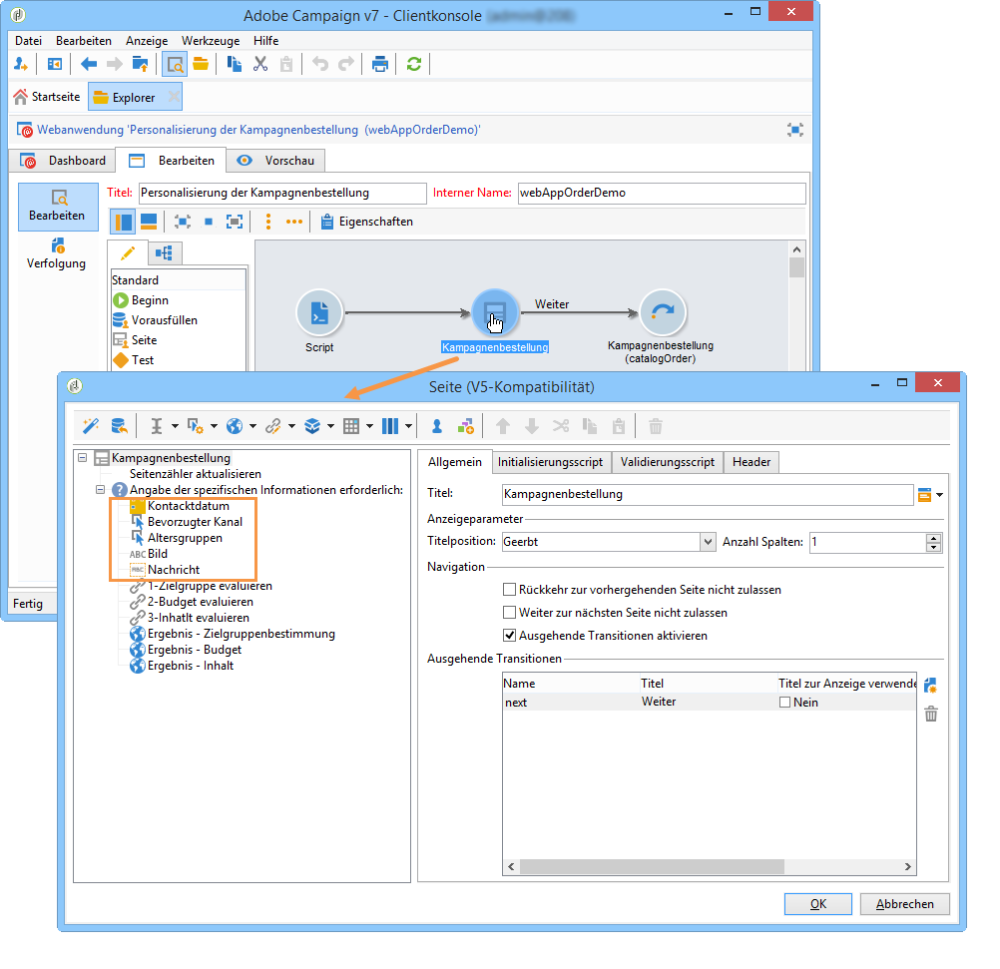

Im vorliegenden Beispiel enthält die Aktivität **Kampagnenbestellung**:

* Felder, die von der Lokalstelle bei der Bestellung angegeben werden;

   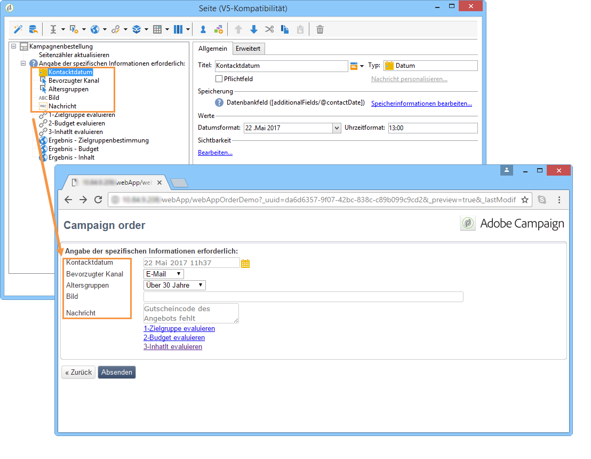

* Links, die der Lokalstelle die Evaluierung der Kampagne ermöglichen (z. B. Zielgruppe, Budget, Inhalt etc.);

   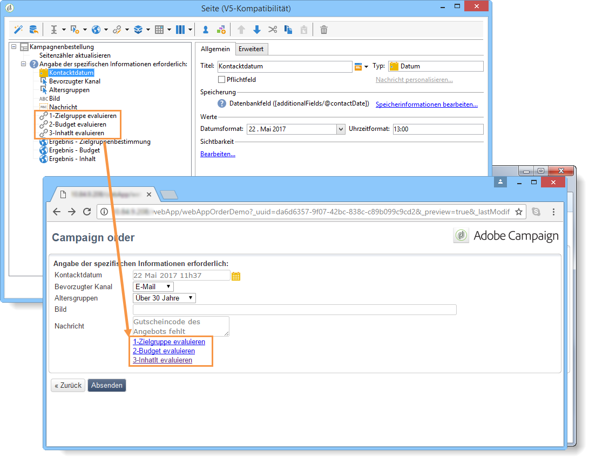

* Scripts, die die Berechnung und Anzeige der Ergebnisse der vorhergenden Evaluierungen ermöglichen.

   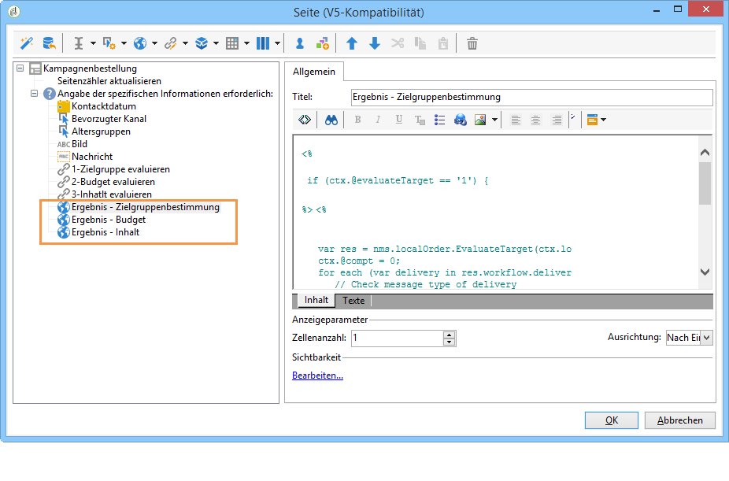

Im vorliegenden Beispiel werden die folgenden APIs verwendet:

* Zur Zielgruppen-Evaluierung:

   ```
   var res = nms.localOrder.EvaluateTarget(ctx.localOrder);
   ```

* Zur Budget-Evaluierung:

   ```
   var res = nms.localOrder.EvaluateDeliveryBudget(ctx.@deliveryId, NL.XTK.parseNumber(ctx.@compt));
   ```

* Zur Inhalts-Evaluierung:

   ```
   var res = nms.localOrder.EvaluateContent(ctx.localOrder, ctx.@deliveryId, "html", resSeed.@id);
   ```

## Creating a collaborative campaign (by target approval) {#creating-a-collaborative-campaign--by-target-approval-}

### Einleitung {#introduction}

Sie sind Marketingleiter einer großen Bekleidungsmarke, die über einen Onlineshop und mehrere Filialen in ganz Deutschland verfügt. Zum Frühlingsanfang möchten Sie Ihre besten Kunden von einem Sonderangebot profitieren lassen: 50 % Rabatt auf die Sommerkleidung des Katalogs.

Dieses Angebot soll nur den Kunden unterbreitet werden, die seit Jahresbeginn für mehr als 300 € in einer Ihrer Filialen eingekauft haben.

Sie entschließen sich daher, mithilfe der Distributed-Marketing-Option eine partizipative Kampagne mit Zielgruppenvalidierung zu erstellen: Diese ermöglicht es Ihnen, die zuvor beschriebenen besten Kunden Ihrer Filialen je nach Region auszuwählen und ihnen das entsprechende Angebot zukommen zu lassen.

Der erste Teil des Beispiels stellt die Perspektive der Lokalstellen dar: Sie erhalten bei der Erstellung der Kampagne eine Benachrichtigungs-E-Mail, über die sie die Kampagne konfigurieren, evaluieren und bestellen können.

Der zweite Teil detailliert, wie diese Kampagnenart von der Zentralstelle erstellt wird.

Zusammenfassend sind folgende Etappen zu durchlaufen:

**Lokalstellenseitig**

1. Rufen Sie über die Benachrichtigung bezüglich der Erstellung der Kampagne die von der Zentralstelle ausgewählte Kontaktliste auf.
1. Wählen Sie die gewünschten Kontakte aus und validieren Sie Ihre Teilnahme an der Kampagne.

**Zentralstellenseitig**

1. Erstellen Sie eine **[!UICONTROL Data distribution]** Aktivität.
1. Erstellen Sie die partizipative Kampagne.
1. Veröffentlichen Sie die Kampagne.

### Teilnehmende Lokalstellen {#local-entity-side}

1. Die zur Teilnahme an der Kampagne ausgewählten Lokalstellen erhalten per E-Mail eine Benachrichtigung.

   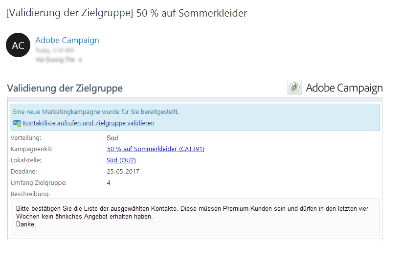

1. By clicking the **[!UICONTROL Access your contact list and approve targeting]** link, the local entity is given access (via Web browser) to the list of clients selected for the campaign.

   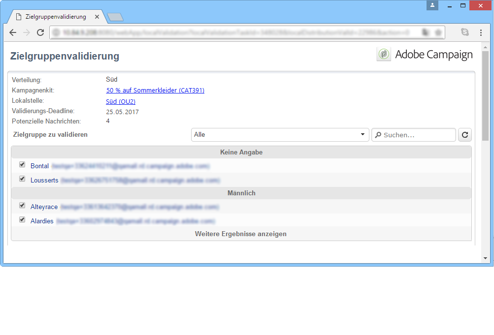

1. Die Lokalstelle entnimmt der Liste die Kontakte, die vor Kurzem bereits ein ähnliches Angebot erhalten haben.

   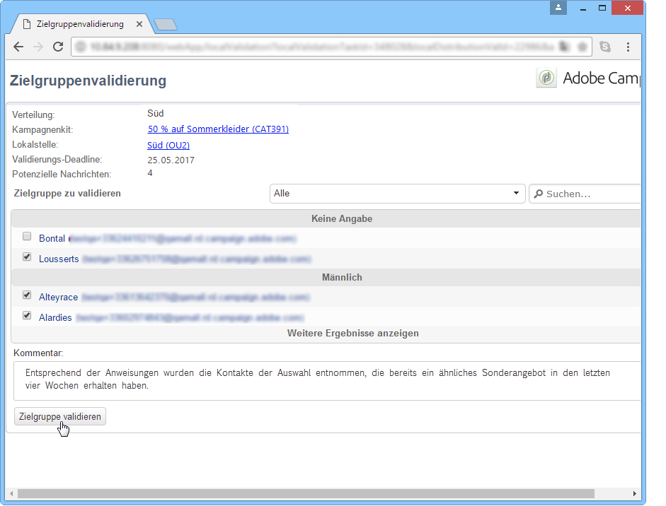

Nach den Validierungen kann die Kampagne automatisch beginnen.

### Zuständige Zentralstelle {#central-entity-side}

#### Datenverteilungs-Aktivität erstellen {#creating-a-data-distribution-activity}

1. Um eine gemeinschaftliche Kampagne (nach Zielgenehmigung) einzurichten, müssen Sie zunächst eine erstellen **[!UICONTROL Data distribution activity]**. Klicken Sie auf das **[!UICONTROL New]** Symbol im **[!UICONTROL Resources > Campaign management > Data distribution]** Knoten.

   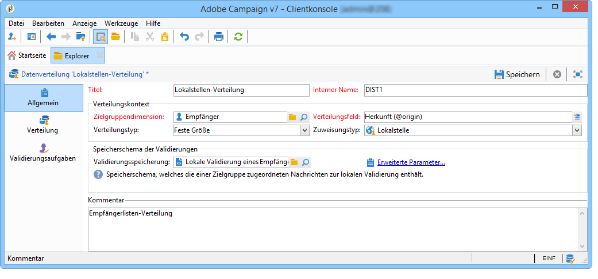

1. In the **[!UICONTROL General]** tab, you must specify:

   * the **[!UICONTROL Targeting dimension]**. Here the **Data distribution** is carried out on the **Recipients**.
   * the **[!UICONTROL Distribution type]**. You can choose a **Fixed size** or a **Size as a percentage**.
   * the **[!UICONTROL Assignment type]**. Select the **Local entity** option.
   * the **[!UICONTROL Distribution type]**. Here, it is the **[!UICONTROL Origin (@origin)]** field present in the Recipient table that lets you identify the relationship between the contact and the local entity.
   * Das **[!UICONTROL Approval storage]** Feld. Wählen Sie die Option **Lokale Genehmigung des Empfängers** .

1. In the **[!UICONTROL Breakdown]** tab, specify:

   * the **[!UICONTROL Distribution field value]**, which corresponds to the local entities involved in the upcoming campaign.
   * the local entity **[!UICONTROL label]**.
   * die **[!UICONTROL Size]** (feste oder prozentuale Angabe). Der Standardwert **** 0 umfasst die Auswahl aller Empfänger, die mit der lokalen Entität verknüpft sind.
   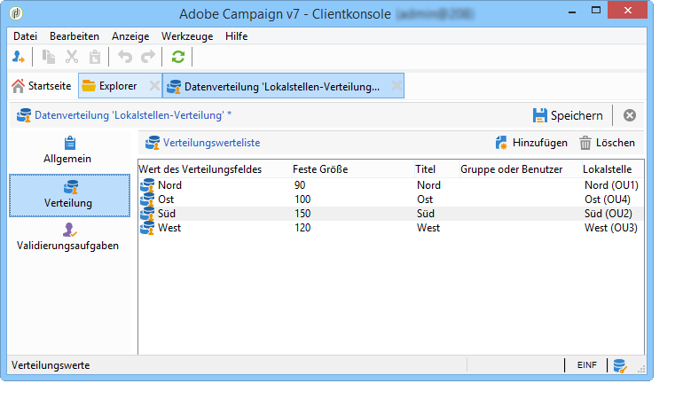

1. Speichern Sie die neue Datenverteilung.

#### Partizipative Kampagne erstellen {#creating-a-collaborative-campaign}

1. Erstellen Sie auf der **[!UICONTROL Campaign management > Campaign]** Node eine neue **[!UICONTROL collaborative campaign (by target approval)]**.
1. Erstellen Sie auf der **[!UICONTROL Targeting and workflows]** Registerkarte einen Workflow für Ihre Kampagne. Dies muss eine **Teilungsaktivität** enthalten, bei der die **[!UICONTROL Record count limitation]** Aktivität durch die **[!UICONTROL Data distribution]** Aktivität definiert wird.

   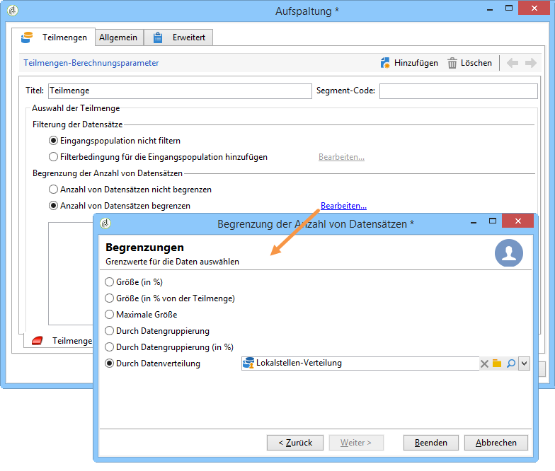

1. Add a **[!UICONTROL Local approval]** action where you can specify:

   * den Inhalt der Benachrichtigung, die die Lokalstellen erhalten;
   * die Validierungserinnerung;
   * die vorgezogene Bearbeitung der Kampagne nach Validierung.
   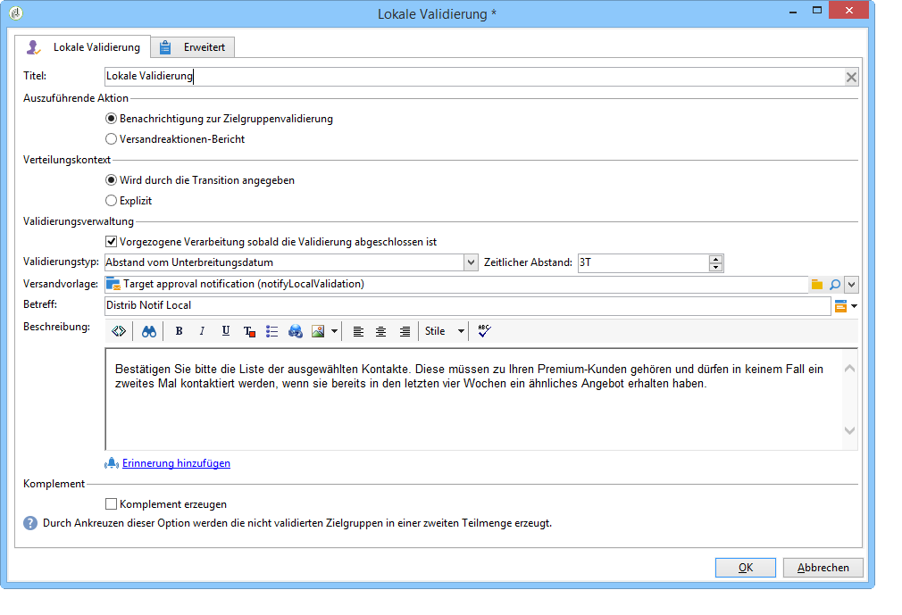

1. Speichern Sie die Kampagne.

#### Kampagne veröffentlichen {#publishing-the-campaign}

Erstellen Sie nun ausgehend von der Rubrik **Kampagnen** aus ein **Kampagnenkit**.

1. Wählen Sie Ihre **[!UICONTROL Reference campaign]**. Auf der **[!UICONTROL Edit]** Registerkarte Ihres Pakets können Sie die für Ihre Kampagne **[!UICONTROL Approval mode]** zu verwendende auswählen:

   * im Modus **Manuell** nehmen die Lokalstellen an der Kampagne teil, wenn Sie die Einladung der Zentralstelle akzeptieren. Sie können bei Bedarf die vorausgewählten Kontakte löschen. Eine Validierung der Teilnahme durch einen Vorgesetzten ist zwingend erforderlich.
   * im Modus **Automatisch** sind die Lokalstellen verpflichtet, an der Kampagne teilzunehmen, sofern sie sich nicht manuell abmelden. Sie können Kontakte löschen, ohne dass eine weitere Validierung erforderlich ist.
   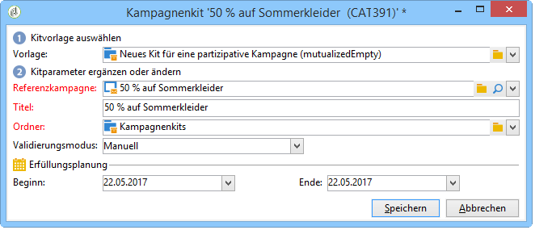

1. In the **[!UICONTROL Description]** tab, you can add a description for your campaign as well as any documents to be sent to the local entities.

   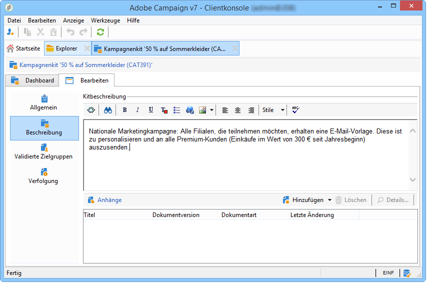

1. Validieren Sie das Kit und starten Sie den Workflow, um das Kit zu publizieren und es für die Lokalstellen in der Kampagnenkit-Liste zur Verfügung zu stellen.

   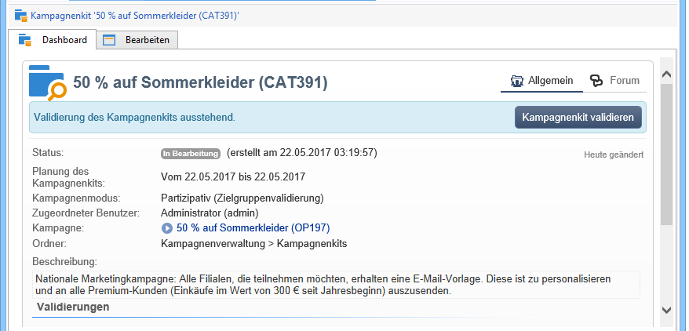

## Creating a collaborative campaign (by form) {#creating-a-collaborative-campaign--by-form-}

### Einleitung {#introduction-1}

Sie sind Marketingleiter einer großen Kosmetikmarke, die über einen Onlineshop und mehrere Filialen in ganz Deutschland verfügt. Um Ihr Lager zu räumen, möchten Sie ein Sonderangebot für zwei unterschiedliche Kundenkategorien erstellen: Die erste Kategorie enthält alle Kunden, die älter als 30 sind und Produkte für reifere Haut angeboten bekommen sollen. Die zweite Kategorie enthält Kunden unter 30 Jahren, die Angebote für Produkte erhalten sollen, die für unreine oder normale Haut geeignet sind.

Sie entschließen sich daher, mithilfe der Distributed-Marketing-Option eine partizipative Kampagne mit Formular zu erstellen: Diese ermöglicht es Ihnen, die Kunden der unterschiedlichen Filialen nach Altersgruppen auszuwählen. Die Kunden erhalten einen entsprechend ihrem Alter personalisierten E-Mail-Versand mit dem jeweiligen Sonderangebot.

Der erste Teil des Beispiels stellt die Perspektive der Lokalstellen dar: Sie erhalten bei der Erstellung der Kampagne eine Benachrichtigungs-E-Mail, über die sie die Kampagne konfigurieren, evaluieren und bestellen können.

Der zweite Teil detailliert, wie diese Kampagnenart von der Zentralstelle erstellt wird.

Zusammenfassend sind folgende Etappen zu durchlaufen:

**Lokalstellenseitig**

1. Rufen Sie über die Benachrichtigung bezüglich der Erstellung der Kampagne das Online-Formular auf.
1. Passen Sie die lokal Kampagne an, indem Sie Zielgruppe, Inhalt und Versandumfang angeben.
1. Evaluieren Sie die lokale Anpassung und überarbeiten Sie sie, sofern notwendig.
1. Validieren Sie Ihre Teilnahme.
1. Der Manager (der Lokal- oder Zentralstelle) genehmigt Konfiguration und Teilnahme.

**Zentralstellenseitig**

1. Erstellen Sie die partizipative Kampagne.
1. Konfigurieren Sie die Kampagne **[!UICONTROL Advanced campaign settings...]** so, wie Sie es bei einer lokalen Kampagne tun würden.
1. Konfigurieren Sie den Kampagnen- sowie den Versand-Workflow wie für eine lokale Kampagne.
1. Aktualisieren Sie das Webformular.
1. Erstellen und veröffentlichen Sie das Kampagnenkit.

### Teilnehmende Lokalstellen {#local-entity-side-1}

1. Die zur Teilnahme an der Kampagne ausgewählten Lokalstellen werden per E-Mail über die Veröffentlichung der Kampagne benachrichtigt.

   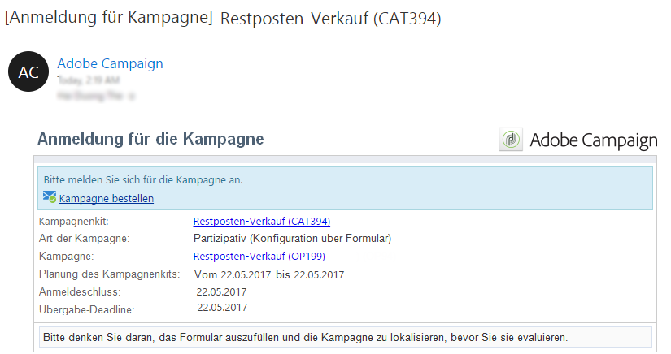

1. Jede Lokalstelle füllt das personalisierte Formular aus und:

   * evaluiert Zielgruppe und Budget,
   * überprüft die Vorschau des Versandinhalts,
   * validiert ihre Teilnahme.

      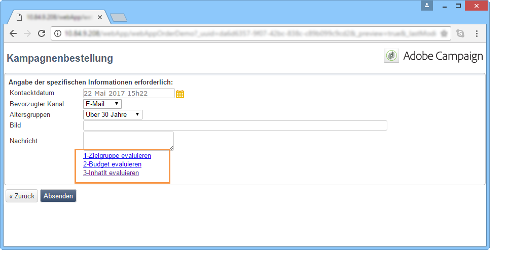

1. Der für die Validierung der Bestellungen verantwortliche Benutzer genehmigt die Teilnahme.

   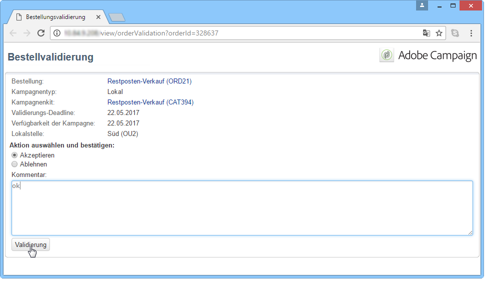

### Zuständige Zentralstelle {#central-entity-side-1}

1. Um eine partizipative Kampagne mit Formular zu erstellen, muss zunächst eine Referenzkampagne mithilfe der Vorlage **Partizipative Kampagne (Formular) (opCollaborativeByForm)** erstellt werden.

   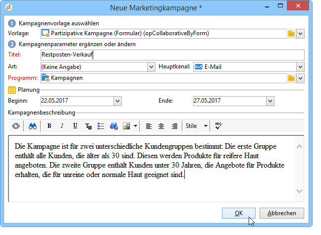

1. Klicken Sie auf der **[!UICONTROL Edit]** Registerkarte der Kampagne auf den **[!UICONTROL Advanced campaign settings...]** Link, um die Kampagne als lokale Kampagne zu konfigurieren. Siehe [Erstellen einer lokalen Kampagne (nach Formular)](#creating-a-local-campaign--by-form-).

   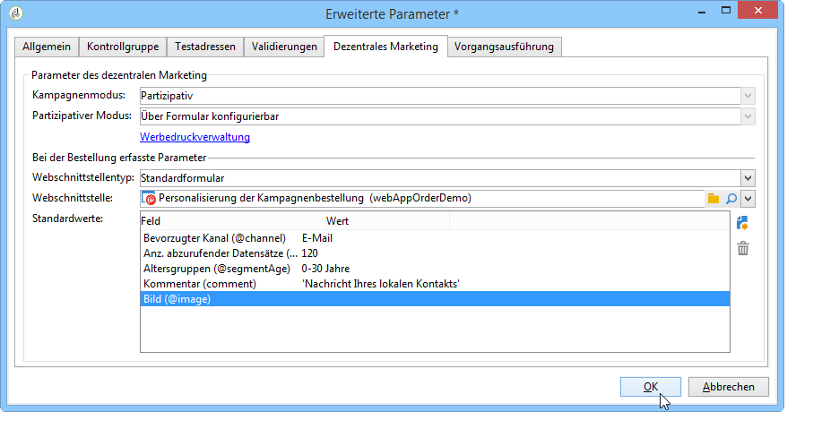

1. Konfigurieren Sie den Kampagnen-Workflow und das Webformular. Siehe [Erstellen einer lokalen Kampagne (nach Formular)](#creating-a-local-campaign--by-form-).
1. Erstellen Sie das Kampagnenkit. Geben Sie hierbei die Ausführungsplanung sowie die betroffenen Lokalstellen an.

   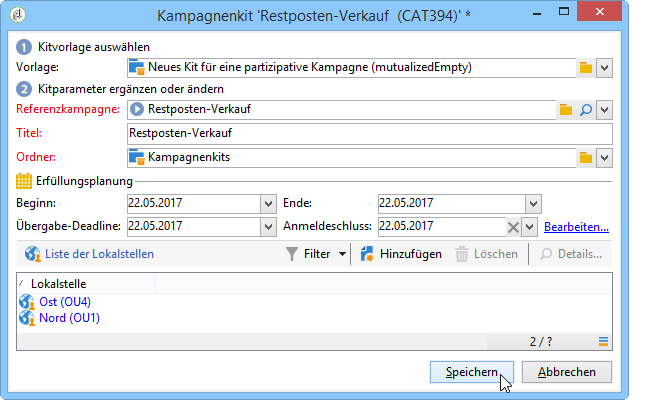

1. Finalize the package configuration by selecting the approval mode in the **[!UICONTROL Edit]** tab.

   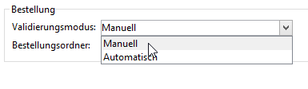

1. From the **[!UICONTROL Description]** tab, you can enter a campaign package description, a notification message to be sent to local entities when the package is published, and attach any informative documents to your campaign package.

   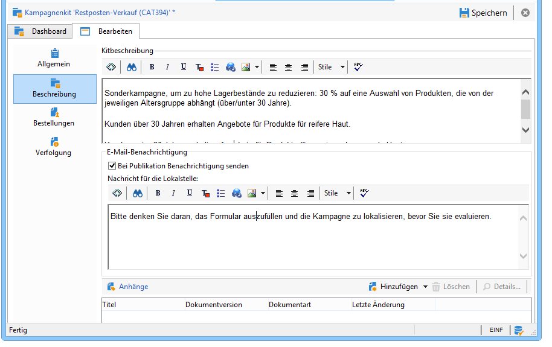

1. Validieren Sie das Kit, um es in der Kampagnenkit-Liste zu veröffentlichen.

   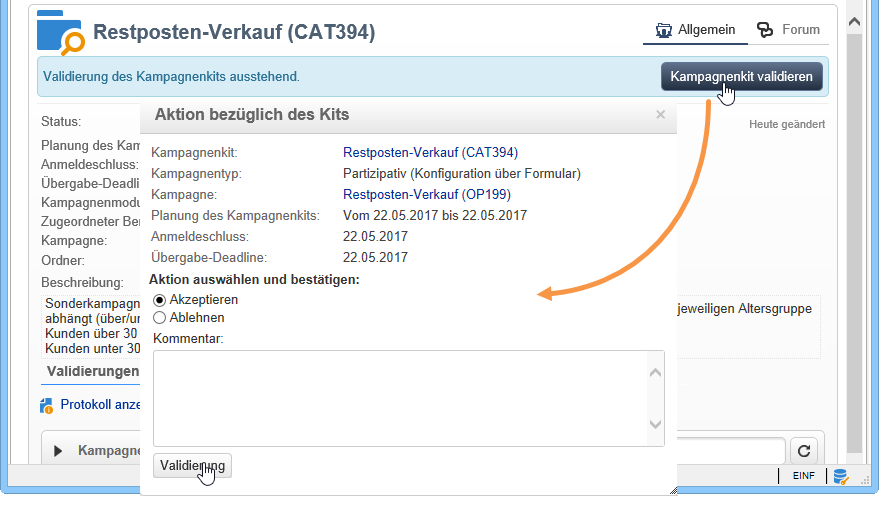

