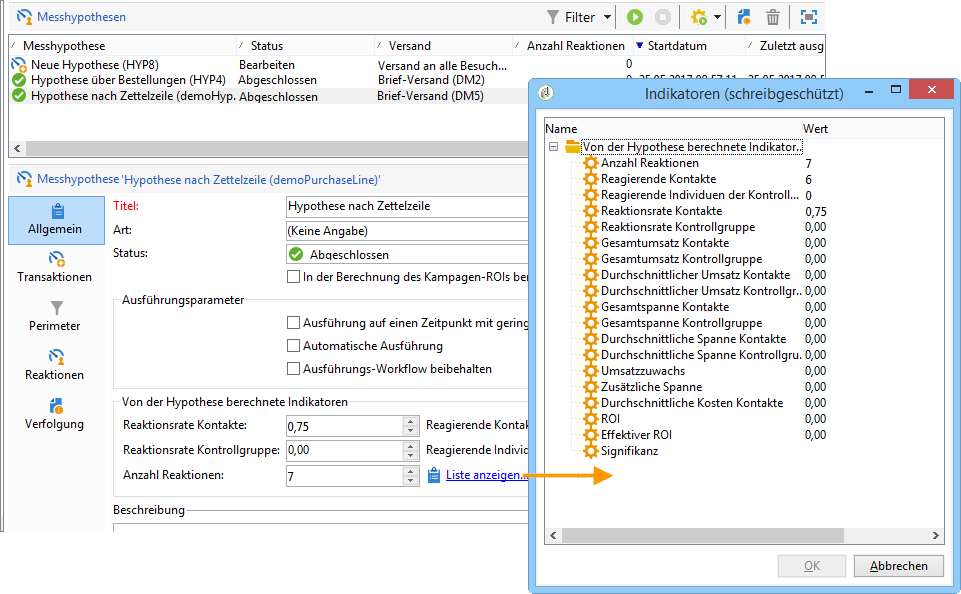
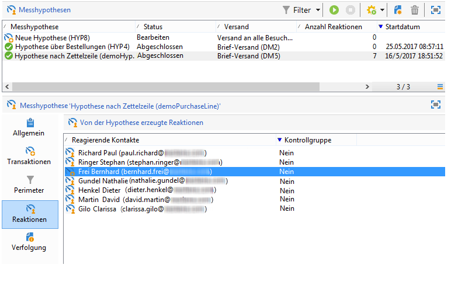
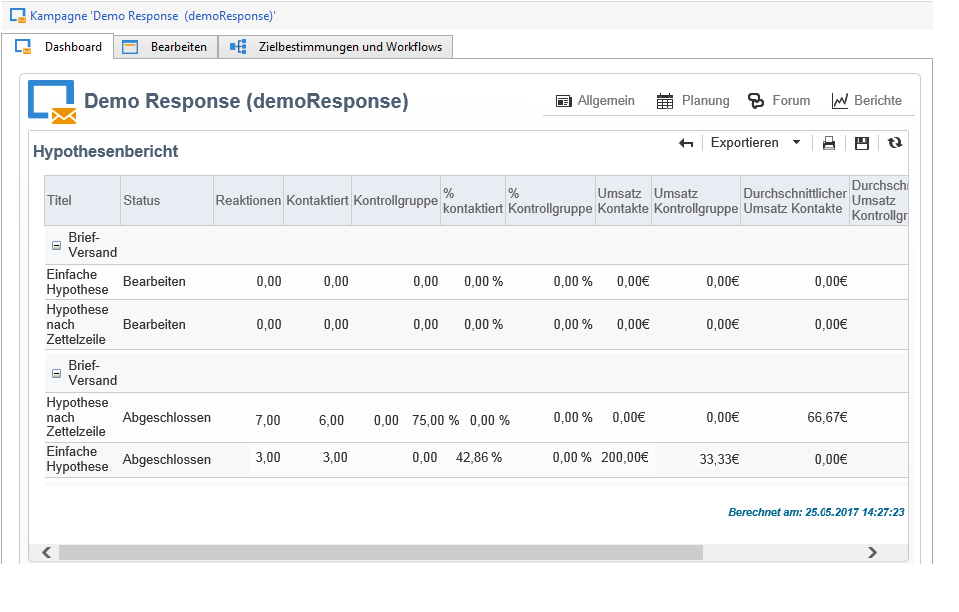
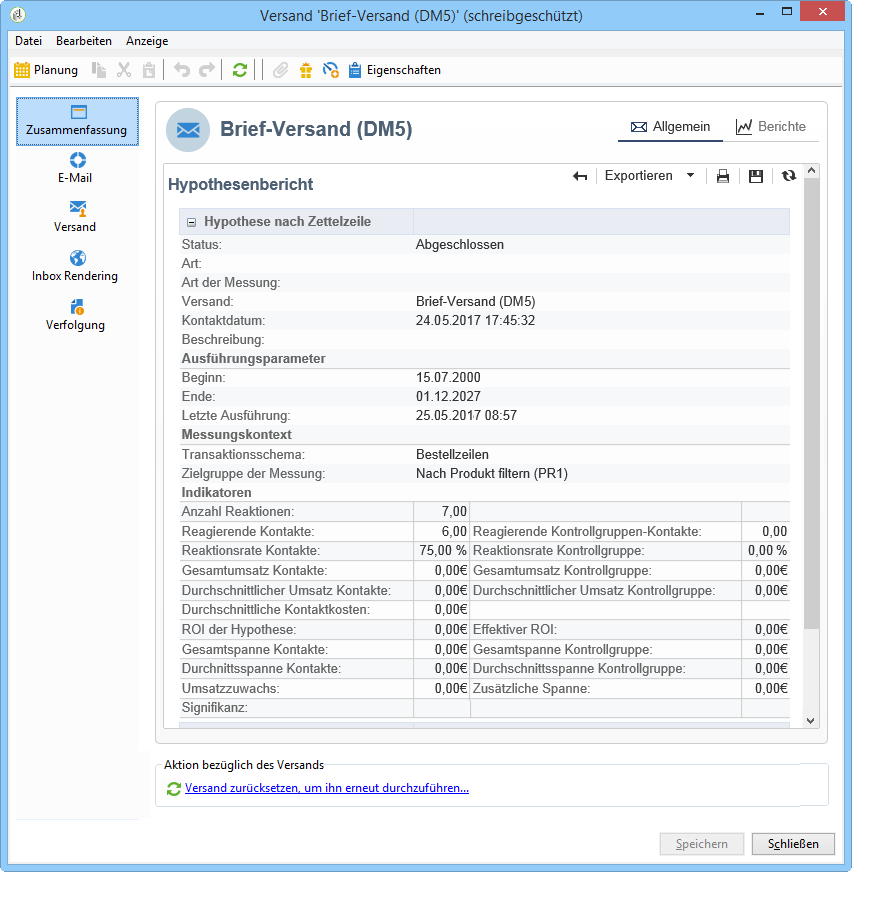

# Hypothesenverfolgung{#hypothesis-tracking}

Das Ergebnis der Hypothesenberechnungen kann auf unterschiedlichen Ebenen der Adobe-Campaign-Plattform eingesehen werden. So sind die von der Hypothese berechneten Indikatoren und die Empfängerreaktionen in der Messhypothese selbst verfügbar; sie werden darüber hinaus auch in den betreffenden Kampagnen und Sendungen in Form von Hypothesenberichten anschaulich dargestellt.

## Hypothesenergebnisse {#hypothesis-results}

### Indicators {#indicators}

Nach Berechnung der Hypothese werden mehrere Messindikatoren automatisch aktualisiert. Diese sind im Tab **[!UICONTROL Allgemein]** der Hypothese verfügbar.

Es handelt sich um folgende Indikatoren:

* **Reagierende Kontakte**: Anzahl der kontaktierten Individuen, die der Abfrage der Hypothese entsprechen.
* **Reaktionsrate Kontakte**: Anzahl reagierender Kontakte/Kontakte des Versands insgesamt.
* **Reagierende Individuen der Kontrollgruppe**: Anzahl der der Hypothese entsprechenden Individuen der Kontrollgruppe.
* **Reaktionsrate Kontrollgruppe**: Anzahl von reagierenden Individuen der Kontrollgruppe/Individuen der Kontrollgruppe des Versands insgesamt.
* **Anzahl Reaktionen**: Anzahl der Datensätze in der Tabelle, die die Beziehung zwischen Individuen, Hypothese und Transaktionstabelle enthält.

Klicken Sie auf den Link **[!UICONTROL Liste anzeigen]**, um eine Liste aller Indikatoren anzuzeigen:

Folgende Informationen werden von den Indikatoren bereitgestellt:

* **Gesamtumsatz Kontakte**: Summe der durch die kontaktierten Individuen generierten Einnahmen.
* **Gesamtumsatz Kontrollgruppe**: Summe der durch die Anzahl der Individuen der Kontrollgruppe generierten Einnahmen.
* **Durchschnittlicher Umsatz Kontakte**: Summe Einnahmen/Anzahl Kontakte.
* **Durchschnittlicher Umsatz Kontrollgruppe**: Summe Einnahmen/Anzahl Individuen der Kontrollgruppe.
* **Gesamtspanne Kontakte**: Insgesamt durch die kontaktierten Individuen generierte Spanne.
* **Gesamtspanne Kontrollgruppe**: Insgesamt durch die Individuen der Kontrollgruppe generierte Spanne.
* **Durchschnittliche Spanne Kontakte**: Gesamtspanne/Anzahl Kontakte.
* **Durchschnittliche Spanne Kontrollgruppe**: Gesamtspanne/Anzahl Individuen der Kontrollgruppe.
* **Umsatzzuwachs**: (Durchschnittlicher Umsatz der Kontakte - Durchschnittlicher Umsatz der Individuen in der Kontrollgruppe) x Anzahl Kontakte.
* **Zusätzliche Spanne**: (Durchschnittliche Spanne der Kontakte - Durchschnittliche Spanne der Individuen in der Kontrollgruppe) / Anzahl Kontakte.
* **Durchschnittliche Kosten Kontakte**: Berechnete Kosten des Versands / Anzahl Kontakte.
* **ROI**: Berechnete Kosten des Versands / Gesamtspanne Kontakte.
* **Effektiver ROI**: Berechnete Kosten des Versands / Zusätzliche Spanne.
* **Signifikanz**: enthält Werte von 0 bis 3, die die jeweilige Signifikanz der Kampagne ausdrücken.

### Reaktionen {#reactions}

Sie können die durch die Hypothesen generierten Empfängerreaktionen im Tab **[!UICONTROL Reaktionen]** einsehen.

1. Gehen Sie nach Abschluss der Hypothesenberechnung in den Knoten **[!UICONTROL Kampagnenverwaltung > Messhypothesen]** des Adobe-Campaign-Navigationsbaums.
1. Wählen Sie die gewünschte Hypothese aus der Liste aus und klicken Sie auf den Tab **[!UICONTROL Reaktionen]**, um die Liste der Empfänger anzuzeigen, die im Anschluss an die Marketingkampagne möglicherweise eine Bestellung tätigen.

   

## Berichte {#reports}

Im **[!UICONTROL Hypothesenbericht]** können Sie die Ergebnisse der Hypothesen zu Kampagnen und Sendungen einsehen. Dieser Bericht enthält die von der Hypothese berechneten Indikatoren (weitere Informationen finden Sie unter [Indikatoren](#indicators)).

* **In der Kampagne**: Klicken Sie auf den Link **[!UICONTROL Berichte]** der betreffenden Kampagne und wählen Sie den **[!UICONTROL Hypothesenbericht]** aus. Dieser Bericht enthält die Liste der Sendungen der Kampagne sowie die für jeden Versand berechneten Hypothesen.

   

* **Im Versand**: Öffnen Sie den betreffenden Versand, klicken Sie auf die Schaltfläche **[!UICONTROL Berichte]** im Tab **[!UICONTROL Zusammenfassung]** und wählen Sie den **[!UICONTROL Hypothesenbericht]** aus. Der Bericht enthält alle für den Versand berechneten Hypothesen.

   
