# Verwaltung von Ressourcen{#managing-marketing-resources}

Adobe Campaign ermöglicht die Verwaltung und Verfolgung der im Lebenszyklus der Kampagnen eingebundenen Marketing-Ressourcen. Hierbei kann es sich zum Beispiel um Broschüren, Layouts oder andere Kommunikationsträger handeln, die von mehreren Benutzern bearbeitet werden.

Status, Verlauf und aktuelle Version der über Adobe Campaign verwalteten Marketing-Ressourcen können jederzeit angezeigt werden.

## Hinzufügung von Marketing-Ressourcen {#adding-a-marketing-resource}

Marketing-Ressourcen sind über die Kampagnen-Rubrik zugänglich.

To add a resource, click the **[!UICONTROL Create]** button.

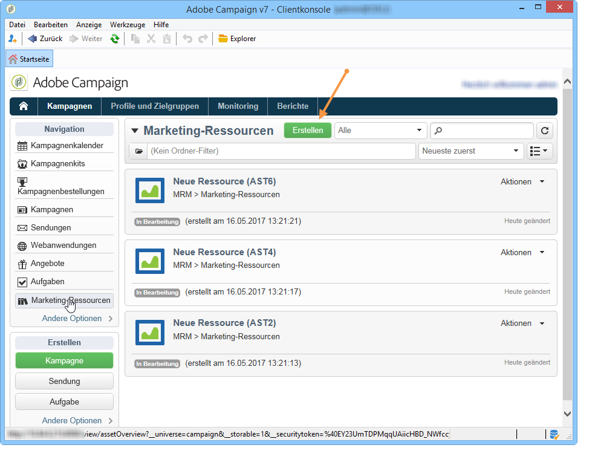

Um eine Ressource auf dem Adobe Campaign-Server verfügbar zu machen, müssen Sie die gewünschte Ressource hinzufügen, indem Sie sie in den mittleren Bereich des Editors ziehen und dort ablegen. Sie können auch auf den **[!UICONTROL Upload file to server...]** Link klicken.

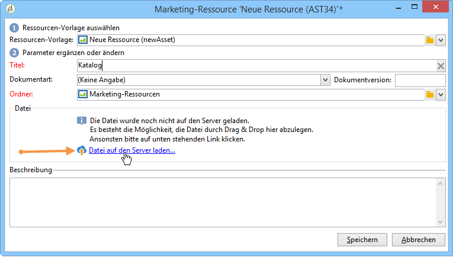

Über eine Bestätigungsnachricht kann der Upload gestartet werden.

Nach Abschluss des Uploads wird die Ressource zur Liste der verfügbaren Ressourcen hinzugefügt. Sie steht Adobe Campaign-Operatoren zur Verfügung. Sie können sie (über die **[!UICONTROL Preview]** Registerkarte) anzeigen, eine Kopie erstellen, um sie zu ändern, oder die Datei auf dem Server aktualisieren (über die **[!UICONTROL Edit]** Registerkarte).

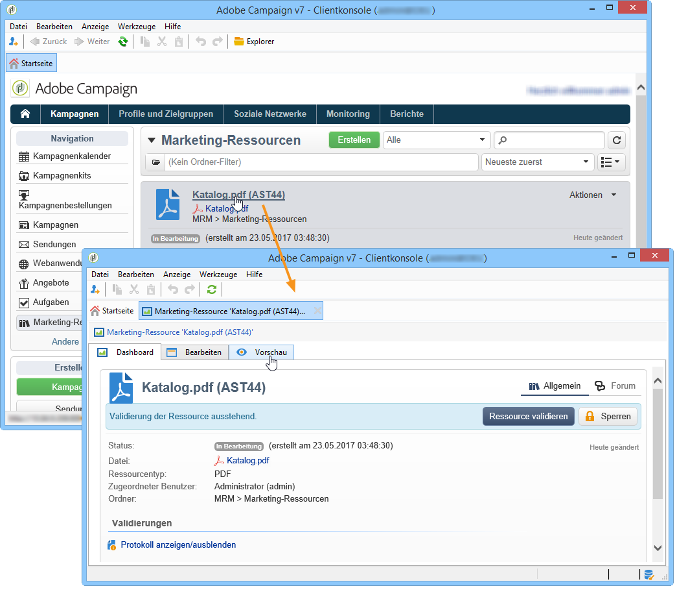

Klicken Sie auf die **[!UICONTROL General]** Registerkarte, um die Operatoren oder Gruppen von Operatoren auszuwählen, die für die Überwachung, Verfolgung und Genehmigung dieser Ressource zuständig sind. Die Auswahl des Prüfers erfolgt über den **[!UICONTROL Advanced parameters]** Link.

* Der Benutzer, dem die Ressource zugeordnet wurde, ist für ihre Verfolgung verantwortlich.
* Der für die Validierung verantwortliche Benutzer wird benachrichtigt, sobald der Validierungsprozess der Ressource gestartet wurde.

   If no reviewer is selected, the resource **[!UICONTROL cannot be]** subject to approval.

* Bei Bedarf kann zudem in der Rubrik Verfolgung ein Korrekturleser bestimmt werden.

Sie können ein (indikatives) Verfügbarkeitsdatum für die Ressource angeben. Nach diesem Datum wird es mit dem **[!UICONTROL Late]** Status angezeigt.

## Kollaboratives Arbeiten an Ressourcen {#collaborative-work-on-resources}

Sie haben die Möglichkeit, eine Marketing-Ressource jederzeit zu ändern und zu aktualisieren sowie bei Bedarf andere Adobe-Campaign-Benutzer davon in Kenntnis zu setzen. Sie können:

* Ressourcen lokal herunterladen, um sie zu bearbeiten;
* Dateien auf dem Server aktualisieren und für andere Benutzer zugänglich machen;
* Ressourcen sperren, um Änderungen durch andere Benutzer zu verbieten.

>[!NOTE]
>
>Die **[!UICONTROL History]** Registerkarte enthält das Download- und Aktualisierungsprotokoll für die Ressource. Über die **[!UICONTROL Details]** Schaltfläche können Sie die ausgewählte Version anzeigen:

### Ressourcen sperren/entsperren {#locking-unlocking-a-resource}

Nach ihrer Erstellung sind die Ressourcen für die Benutzer im Dashboard der Marketing-Ressourcen verfügbar und sie können bearbeitet und verändert werden.

Wenn ein Benutzer an einer Ressource Änderungen vornehmen möchte, empfiehlt es sich, diese zuvor zu sperren, damit andere Benutzer sie nicht zur gleichen Zeit bearbeiten können. Die Ressource wird damit für den Benutzer reserviert: Sie bleibt zugänglich, kann aber von anderen Benutzern weder publiziert noch auf dem Server aktualisiert werden.

Folgende Nachricht informiert Benutzer, die auf eine reservierte Ressource zugreifen möchten:

The **[!UICONTROL Tracking]** tab indicates the name of the operator who locked the resource and the planned update date.

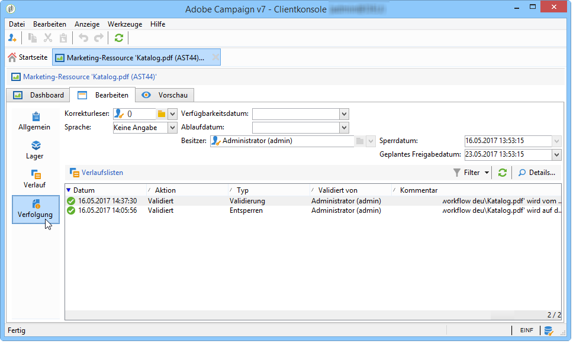

To lock a resource, you must click the resource followed by the **[!UICONTROL Lock]** button in the resource dashboard.

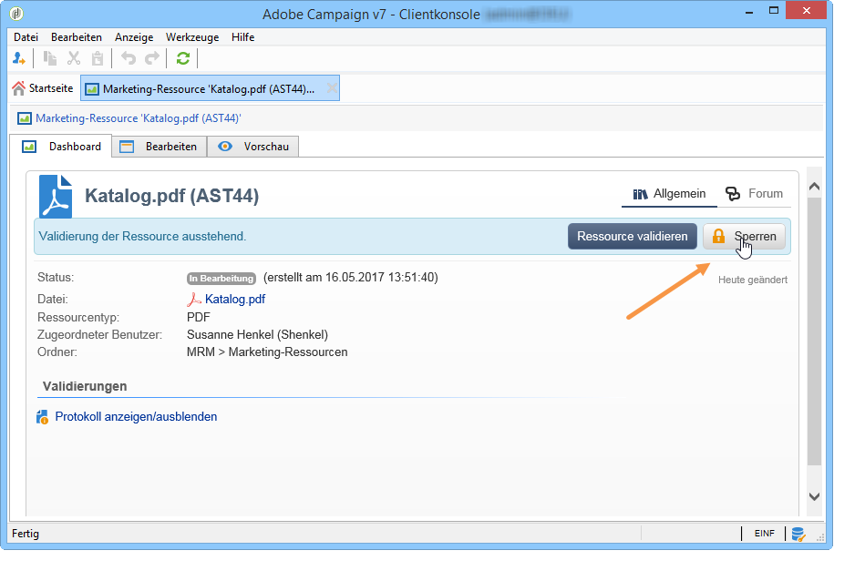

You can indicate the planned return date in the **[!UICONTROL Tracking]** tab of the resource.

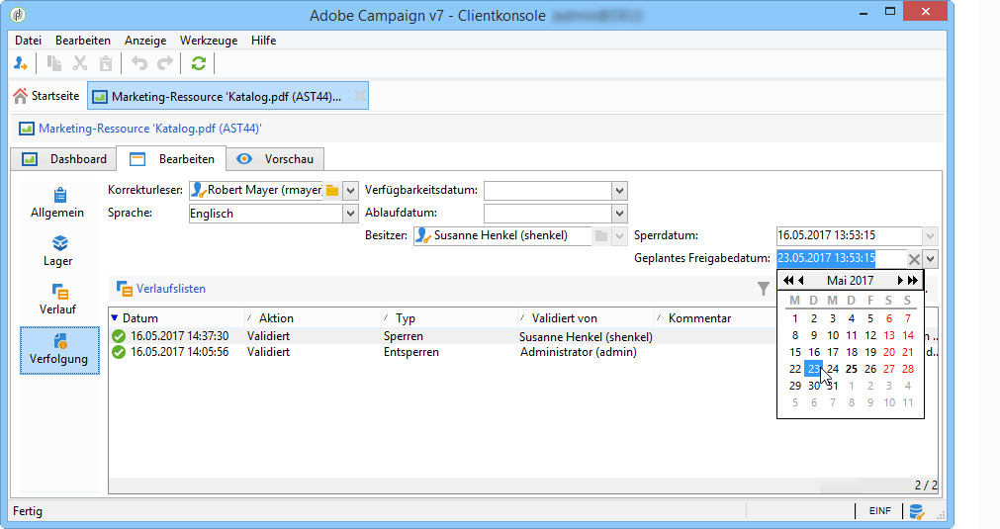

Auf diese Weise können andere Adobe-Campaign-Benutzer darüber informiert werden, wann die Ressource wieder entsperrt wird.

Nach der Aktualisierung wird die Ressource automatisch entsperrt, um sie wieder für alle Benutzer verfügbar zu machen.

Sie kann jedoch bei Bedarf auch manuell über das Dashboard entsperrt werden.

>[!NOTE]
>
>Nur der Benutzer, der die Ressource gesperrt hat, und solche mit Administrator-Berechtigungen sind befugt, eine gesperrte Ressource zu entsperren.

### Diskussionsforen {#discussion-forums}

An einer Ressource beteiligte Benutzer haben im Tab **[!UICONTROL Forum]** die Möglichkeit, Informationen austauschen.

[Diskussionsforen](../../campaign/using/discussion-forums.md) erläutern, wie Diskussionsforen in Adobe Campaign funktionieren.

## Lebenszyklus von Marketing-Ressourcen {#life-cycle-of-a-marketing-resource}

Bei der Erstellung einer Ressource werden Adobe-Campaign-Benutzer für den Entwurf sowie die Korrektur, Validerung und Publikation der Ressource bestimmt. Für diese Vorgänge kann eine Dauer definiert werden.

The **[!UICONTROL Tracking]** tab lets you monitor any actions carried out on the resource: approvals, approval refusals, related comments, or publications.

The **[!UICONTROL History]** tab displays file transfers carried out for this resource.

### Validierungsprozess {#approval-process}

Das erwartete Verfügbarkeitsdatum wird in den Ressourcendetails angezeigt, sofern es auf der **[!UICONTROL Tracking]** Registerkarte angegeben wurde. Sobald dieses Datum erreicht ist, können Sie den Genehmigungsprozess über die Schaltfläche im Ressourcen-Dashboard ausführen **[!UICONTROL Submit for approval]** . Der Ressourcenstatus wechselt dann zu **[!UICONTROL Approval in progress]**.

A resource can be approved via the **[!UICONTROL Approve resource]** button on its dashboard.

Autorisierte Operatoren können dann die Genehmigung akzeptieren oder ablehnen. Diese Aktion ist möglich, über die gesendete E-Mail-Nachricht (durch Klicken auf den Link in der Benachrichtigungsmeldung) oder über die Konsole (durch Klicken auf die Schaltfläche **[!UICONTROL Approve]** ).

Im Validierungsfenster kann ein Kommentar eingegeben werden.

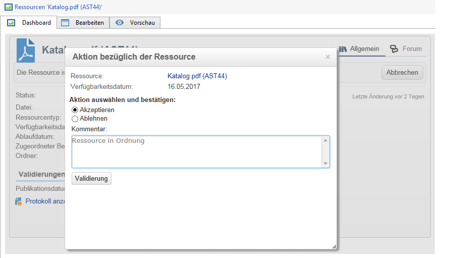

The **[!UICONTROL Tracking]** tab enables all operators to track the various stages of the approval process.

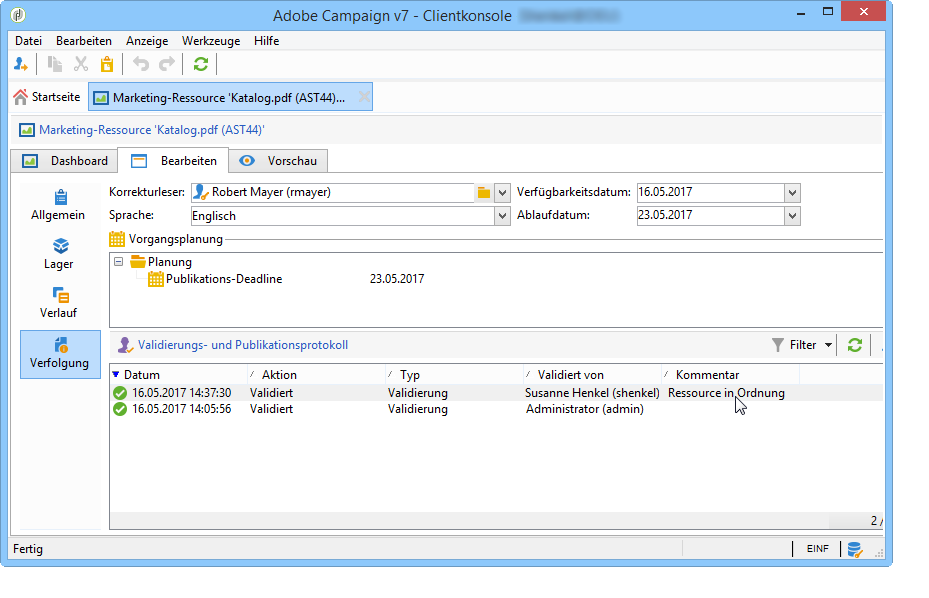

>[!NOTE]
>
>Neben dem in jeder Marketing-Ressource bestimmten Validierer sind auch Benutzer mit Administrator-Berechtigungen sowie der Ressourcen-Verantwortliche befugt, die jeweilige Ressource zu validieren.

### Ressourcen veröffentlichen {#publishing-a-resource}

Nach bestätigter Validierung muss die Marketing-Ressource publiziert werden. Der Publikationsprozess ist separat, den jeweiligen Nutzerbedürfnissen entsprechend zu implementieren. So können Ressourcen beispielsweise auf einem Extranet oder einem beliebigen anderen Server publiziert, bzw. einem externen Dienstleister übermittelt werden usw.

To publish a resource, click the **[!UICONTROL Publish]** button in the editing zone of the marketing resource dashboard.

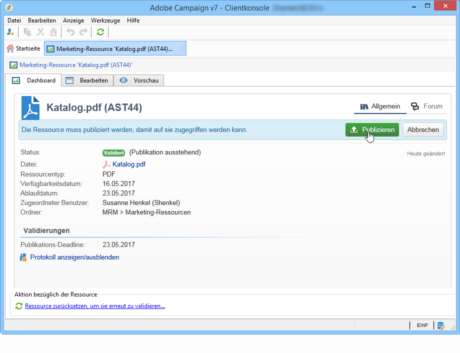

Die Ressourcenpublikation kann auch über einen Workflow automatisiert werden.

Eine Ressource zu publizieren bedeutet, sie verfügbar zu machen, zum Beispiel zur Verwendung in einer Aufgabe. Der eigentliche Vorgang der Publikation hängt von der Art der Ressource ab: Ein Flyer zum Beispiel kann zum Druck als Datei an einen Dienstleister geschickt oder aber auf einer Webseite online gestellt werden.

Damit Adobe Campaign veröffentlicht, müssen Sie einen geeigneten Workflow erstellen und ihn mit der Ressource verknüpfen. Öffnen Sie dazu das **[!UICONTROL Advanced settings]** Feld der Ressource und wählen Sie dann den gewünschten Workflow im **[!UICONTROL Post-processing]** Feld aus.

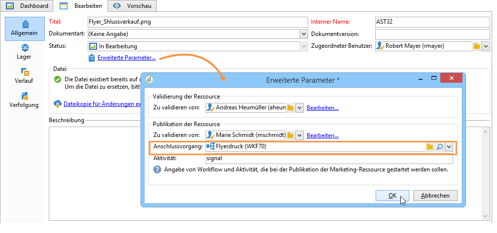

Der Workflow wird ausgeführt, wenn

* When the reviewer clicks the **[!UICONTROL Publish resource]** link (or, if no reviewer was defined, the person in charge of the resource).
* If the resource is managed via a marketing resource creation task, it will be executed when the task is set to **[!UICONTROL Finished]**, as long as the **[!UICONTROL Publish the marketing resource]** box is checked in the task (Refer to [Marketing resource creation task](../../campaign/using/creating-and-managing-tasks.md#marketing-resource-creation-task))

Wenn ein Workflow nicht sofort gestartet wird (z. B. wenn der Workflow gestoppt wird), ändert sich der Status der Ressource in **[!UICONTROL Pending publication]**. Nach dem Starten des Workflows ändert sich der Status der Ressource in **[!UICONTROL Published]**. Dieser Status berücksichtigt keine möglichen Fehler im Veröffentlichungsprozess. Überprüfen Sie den Status Ihres Workflows, um sicherzustellen, dass er ordnungsgemäß ausgeführt wurde.

## Verknüpfung von Ressourcen mit einer Kampagne {#linking-a-resource-to-a-campaign}

### Ressourcen referenzieren {#referencing-a-marketing-resource}

Marketing-Ressourcen können mit Kampagnen verknüpft werden, sofern diese Option in der Kampagnenvorlage ausgewählt wurde.

>[!NOTE]
>
>For details on how to create and configure campaign templates, refer to [Campaign templates](../../campaign/using/marketing-campaign-templates.md#campaign-templates).

Click the **[!UICONTROL Documents > Resources]** tab in the campaign dashboard, then click **[!UICONTROL Add]** to select the resource concerned.

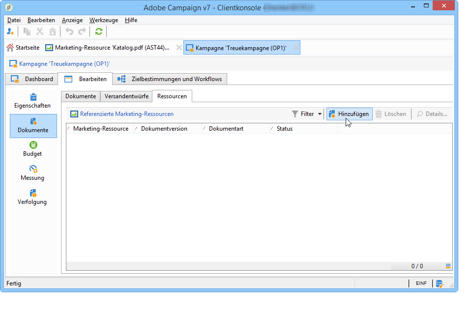

Sie können die Ressourcen nach Status, Dokumentart und Ressourcentyp filtern oder einen benutzerdefinierten Filter anwenden.

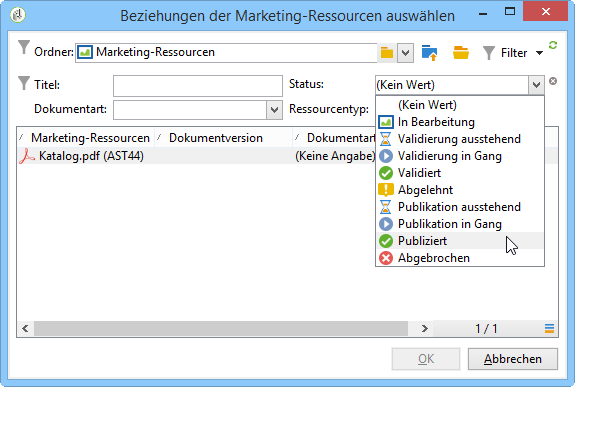

Klicken Sie auf die Schaltfläche **[!UICONTROL OK]**, um die ausgewählte Ressource der Liste der referenzierten Marketing-Ressourcen dieser Kampagne hinzuzufügen.

Über die Schaltfläche **[!UICONTROL Details]** kann die Ressource angesehen und bearbeitet werden.

Die hinzugefügten Ressourcen werden im Dashboard angezeigt. Von dort aus können sie auch bearbeitet werden.

### Ressourcen einem Versandentwurf hinzufügen {#adding-a-marketing-resource-to-a-delivery-outline}

Marketing-Ressourcen können über Versandentwürfe mit Sendungen verknüpft werden.

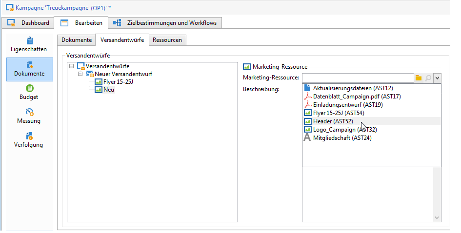

>[!NOTE]
>
>Weitere Informationen zu den Lieferumrissen finden Sie unter [Verknüpfen und Strukturieren von Ressourcen, die über einen Lieferplan](../../campaign/using/marketing-campaign-deliveries.md#associating-and-structuring-resources-linked-via-a-delivery-outline)verknüpft sind.

## Lagerverwaltung {#stock-management}

Sie können eine Marketing-Ressource mit einem oder mehreren Lagern verknüpfen, um den Vorrat zu verwalten und bei unzureichendem Vorrat einen Warnhinweis im Dashboard anzuzeigen.

>[!NOTE]
>
>For more information on stock management in Adobe Campaign, refer to [Stock management](../../campaign/using/providers--stocks-and-budgets.md#stock-management).

Um eine Marketing-Ressource mit einem Lager zu verknüpfen, öffnen Sie die Lagerübersicht und bearbeiten oder erstellen Sie ein Lager. Fügen Sie eine Lagerposition hinzu und wählen Sie die entsprechende Marketing-Ressource aus.

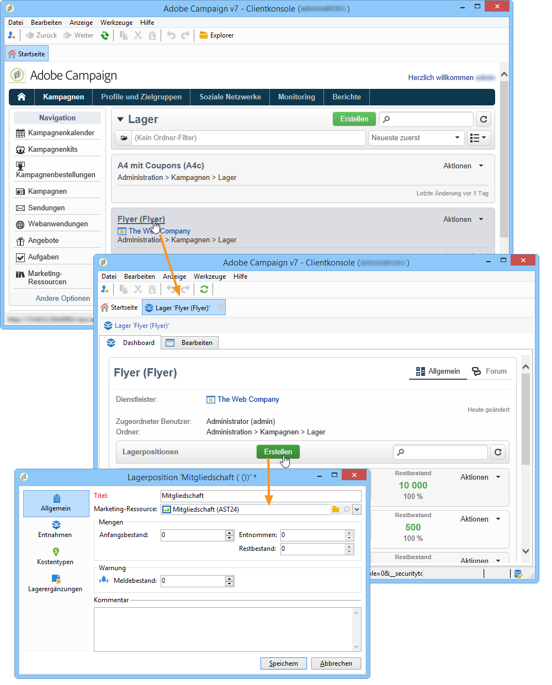

If necessary, you can edit the selected resource via the **[!UICONTROL Edit the link]** icon (magnifying glass) located to the right of the resource once it has been selected.

Geben Sie den Anfangsbestand sowie den Meldebestand an und speichern Sie.

Das Lager wird im Detail der Ressource angegeben.

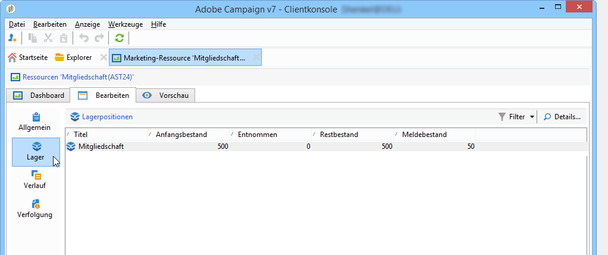

Wenn der Lagerbestand unzureichend ist, wird den zuständigen Benutzern ein Warnhinweis gesendet.

## Erweiterte Funktionen {#advanced-functions}

Mit dem Dashboard Marketing-Ressourcen können Sie die üblichen Vorgänge durchführen: hinzufügen, bearbeiten, sperren/entsperren, genehmigen, veröffentlichen. Sie können andere Arten von Marketingressourcen erstellen und über die Adobe-Kampagnenstruktur auf erweiterte Funktionen zugreifen. Klicken Sie dazu auf **[!UICONTROL Explorer]** der Adobe Campaign-Homepage.

By default, marketing resources are stored in the **[!UICONTROL MRM > Marketing resources]** node of the tree.

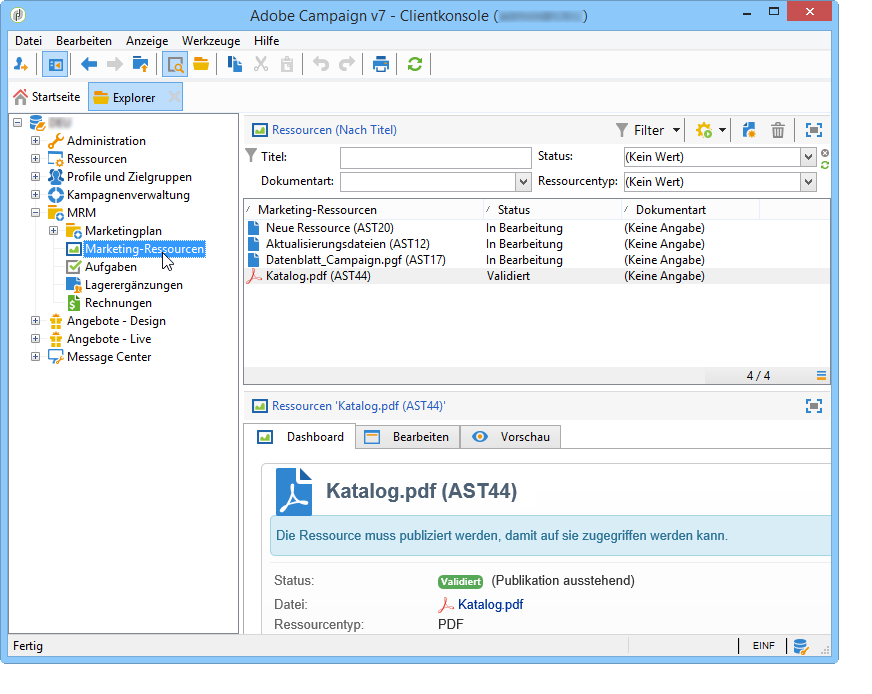

Folgende Ressourcen können über diese Ansicht hinzufügt werden:

* Datei
* HTML
* Text
* URL

