# Einrichten und Verwalten des Validierungsprozesses {#approving-marketing-campaigns}

Jeder Schritt eines Versands kann einer Validierung unterzogen werden, um eine vollständige Überwachung und Kontrolle der Kampagnenprozesse sicherzustellen. Dazu gehören Zielgruppenbestimmung, Inhalt, Budget, Extraktion und das Senden eines Testversands.

Benachrichtigungs-E-Mails werden an die [!DNL Adobe Campaign] Benutzer gesendet, die als Validierungsverantwortliche deklariert wurden, um sie über eine Validierungsanfrage zu informieren. Vergewissern Sie sich, dass die Validierungsverantwortlichen über die **erforderlichen Berechtigungen** zur Validierung verfügen und dass ihre Sicherheitszone korrekt definiert ist. [Weitere Informationen zur Auswahl von Validierungsverantwortlichen](#selecting-reviewers).

Das Genehmigungsverfahren wird unter [Übersicht über das Genehmigungsverfahren](#checking-and-approving-deliveries) beschrieben.

>[!NOTE]
>
>Nur die für einen Versand verantwortliche Person kann den Versand starten. Damit andere Benutzer (oder Benutzergruppen) einen Versand starten können, müssen sie im Feld **[!UICONTROL Versand-Start:]** als Validierungsverantwortliche hinzugefügt werden.\
>[Weitere Informationen zur Auswahl von Validierungsverantwortlichen](#selecting-reviewers).

## Grundprinzip {#operating-principle-}

Die unten stehende Abbildung zeigt beispielhaft die Standardnachricht, die für Budget-Validierungen versendet wird:

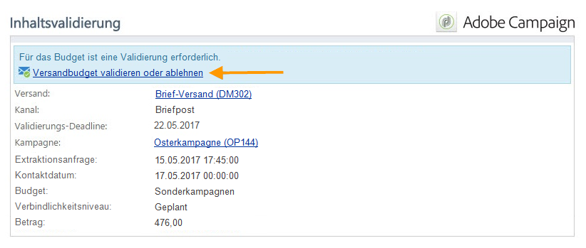

Die Validierungsverantwortlichen können dann entscheiden, ob sie das Budget validieren möchten oder nicht.

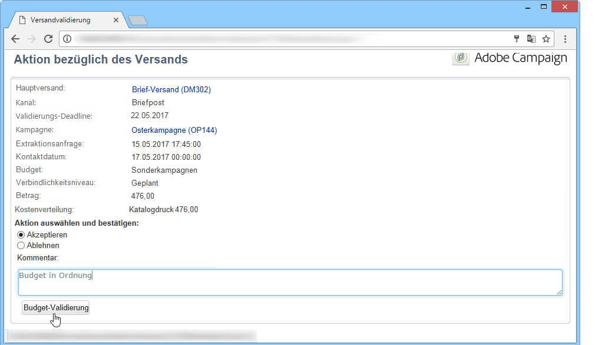

Die jeweilige Entscheidung des Validierungsverantwortlichen wird im Dashboard des Versands angezeigt.

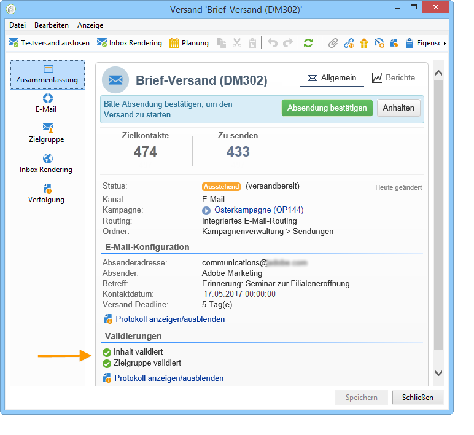

Diese Informationen sind auch in den Validierungsprotokollen der Kampagne verfügbar. Der Zugriff auf diese Protokolle erfolgt über die Registerkarte **[!UICONTROL Bearbeiten > Tracking > Validierungen]**.

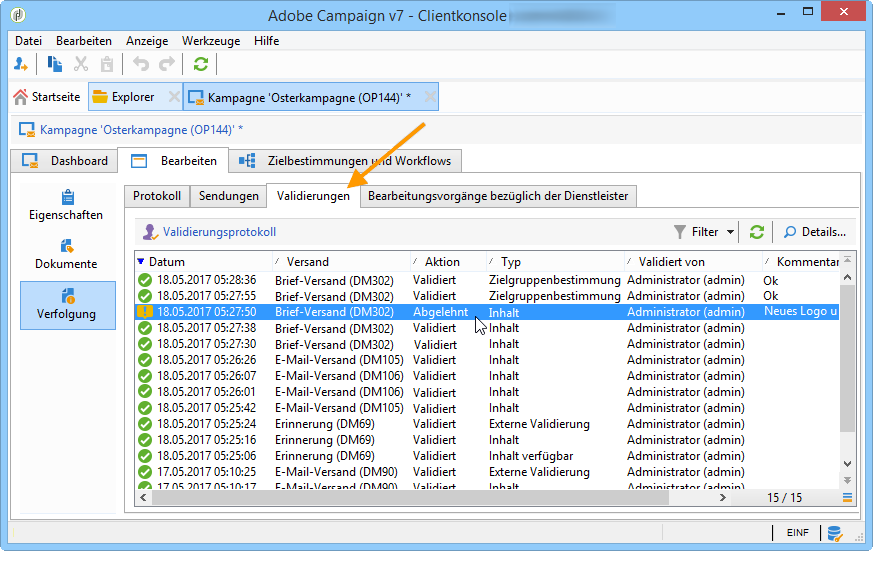

Derartige Benachrichtigungs-E-Mails werden für jeden Prozess, für den die Validierung aktiviert wurde, an den angegebenen Benutzer gesendet.

Validierungen können in Kampagnenvorlagen sowie in jeder Kampagne und jedem Versand aktiviert werden.

Alle Vorgänge, für die eine Validierung erforderlich ist, werden in der Kampagnenvorlage ausgewählt **[!UICONTROL Eigenschaften]** > **[!UICONTROL Erweiterte Kampagneneinstellungen…]** > **[!UICONTROL Registerkarte]**). Die für die Validierung zuständigen Benutzer werden ebenfalls dort ausgewählt und erhalten Benachrichtigungen, es sei denn, diese Option ist deaktiviert. Weitere Informationen hierzu finden Sie unter [Schritte zum Genehmigen eines Versands](#approving-processes).

Diese Konfiguration kann auf Ebene der mit dieser Vorlage erstellten Kampagnen sowie in jedem Versand einzeln überschrieben werden. Klicken Sie hierzu auf die Schaltfläche **[!UICONTROL Eigenschaften]** und anschließend auf den Tab **[!UICONTROL Validierungen]**.

Im nachfolgenden Beispiel wird der Inhalt des Briefpost-Versands nicht zur Validierung unterbreitet:

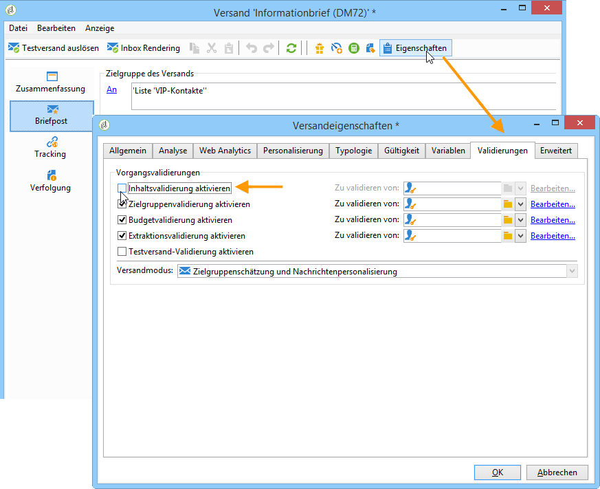

## Auswahl von Validierungsverantwortlichen {#selecting-reviewers}

Für jeden Validierungstyp werden die für die Validierung verantwortlichen Benutzer oder Benutzergruppen aus der Dropdown-Liste im Versand ausgewählt. Weitere Benutzer können mit dem Link **[!UICONTROL Bearbeiten...]** hinzugefügt werden. In diesem Fenster können Sie auch die Validierungs-Deadline bearbeiten.

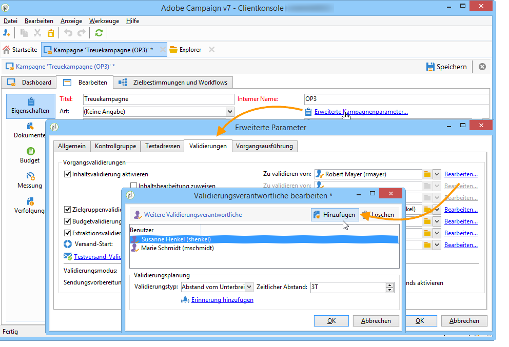

Wenn kein Prüfer angegeben ist, ist der Kampagnenverantwortliche für die Validierungen verantwortlich und erhält die Benachrichtigungen. Diese Person wird auf der Registerkarte **[!UICONTROL Bearbeiten > Eigenschaften]** der Kampagne angegeben:

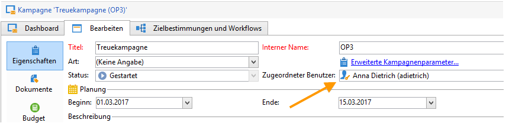

>[!NOTE]
>
>Alle anderen [!DNL Adobe Campaign] mit **[!UICONTROL Administrator]**-Rechten können ebenfalls Vorgänge genehmigen, erhalten jedoch keine Benachrichtigungen.\
>Wenn validierungsverantwortliche Benutzer definiert sind, kann der kampagnenverantwortliche Benutzer standardmäßig nicht die Validierung vornehmen oder den Versand starten. Wenn Sie zulassen möchten, dass der kampagnenverantwortliche Benutzer Sendungen validieren und starten kann, geben Sie für die Option **NmsCampaign_Activate_OwnerConfirmation** den Wert **1** ein.

## Validierungsmodi {#approval-modes}

### Validierung über das Dashboard {#approval-via-the-dashboard}

Um einen Vorgang über die Konsole oder die Web-Schnittstelle zu genehmigen, klicken Sie auf den entsprechenden Link im Kampagnen-Dashboard. Vorgänge können auch über die Versandverfolgung oder das Versand-Dashboard validiert werden.

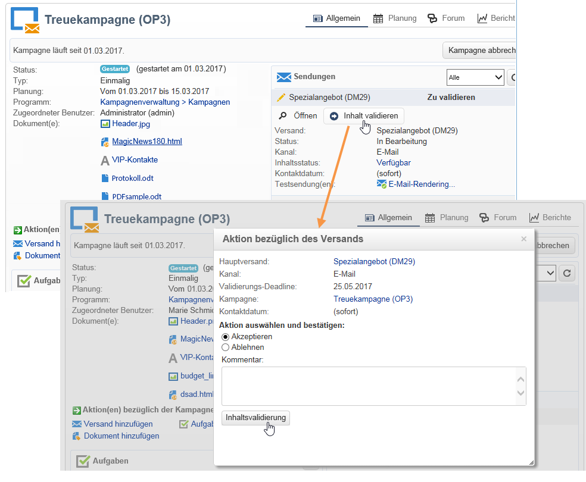

Überprüfen Sie die zu validierenden Informationen und entscheiden Sie, ob Sie die Validierung akzeptieren oder ablehnen. Erfassen Sie gegebenenfalls einen Kommentar und klicken Sie zum Speichern auf **[!UICONTROL OK]**.

>[!NOTE]
>
>Wenn ein Vorgang bereits von einem anderen Benutzer validiert wurde, ist der Validierungs-Link nicht mehr verfügbar.

### Validierung über Benachrichtigungsinhalte {#approval-via-notification-messages}

Klicken Sie auf den Link, der im Benachrichtigungsinhalt verfügbar ist (siehe [Benachrichtigungen](#notifications)). Sie müssen sich wie folgt anmelden:

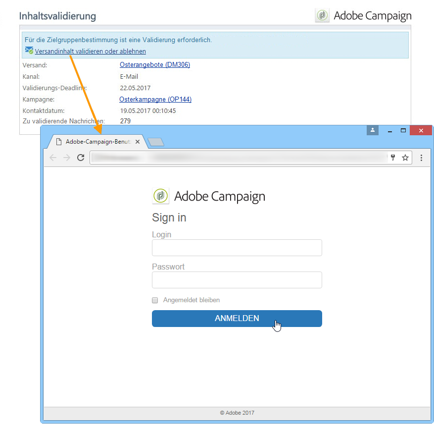

Wählen Sie **[!UICONTROL Akzeptieren]** oder **[!UICONTROL Ablehnen]** und erfassen Sie gegebenenfalls einen Kommentar.

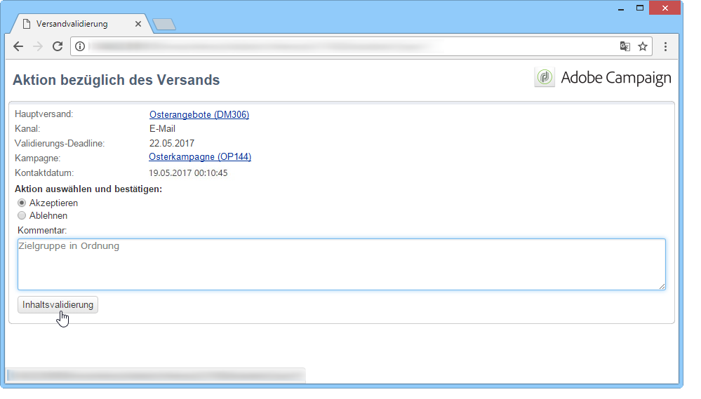

Klicken Sie auf die Schaltfläche **[!UICONTROL Validieren]**.

>[!NOTE]
>
>Wenn der Vorgang Warnungen erzeugt hat, erscheint in der Benachrichtigung ein Warnhinweis.

### Validierungs-Tracking {#approval-tracking}

Informationen zur Validierung werden an verschiedenen Orten gespeichert:

* Im Validierungsprotokoll der Kampagne, im Untertab **[!UICONTROL Validierungen]** des Tabs **[!UICONTROL Bearbeiten > Verfolgung]**:

  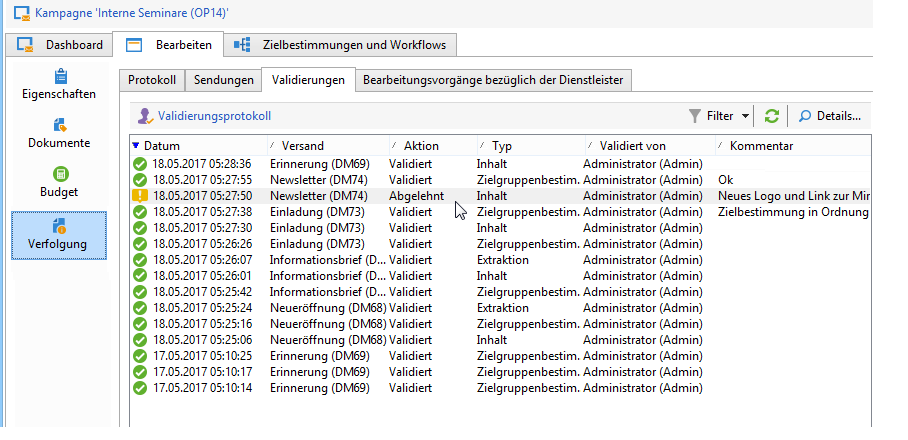

* Im Versandprotokoll der Kampagne, im Untertab **[!UICONTROL Sendungen]** des Tabs **[!UICONTROL Bearbeiten > Verfolgung]**:

  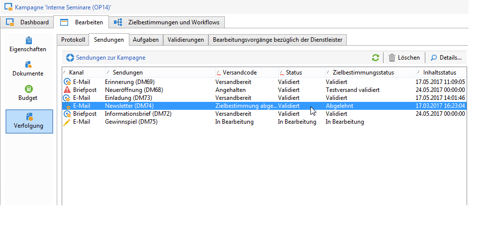

* Der Validierungsstatus jedes Versands kann über die Option **[!UICONTROL Protokoll anzeigen/ausblenden]** im Tab **[!UICONTROL Zusammenfassung]** eingesehen werden:

  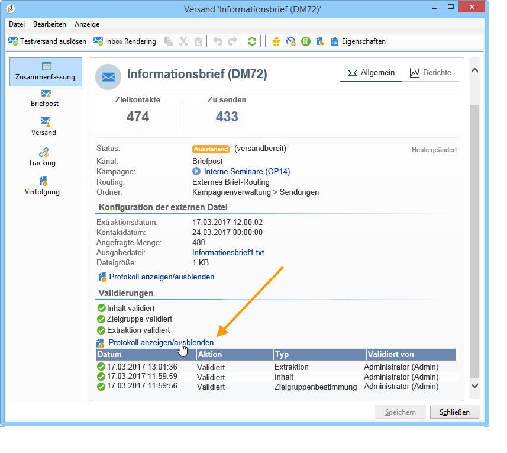

* Diese Informationen sind zudem über den Tab **[!UICONTROL Verfolgung > Validierungen]** jedes Versands zugänglich.

  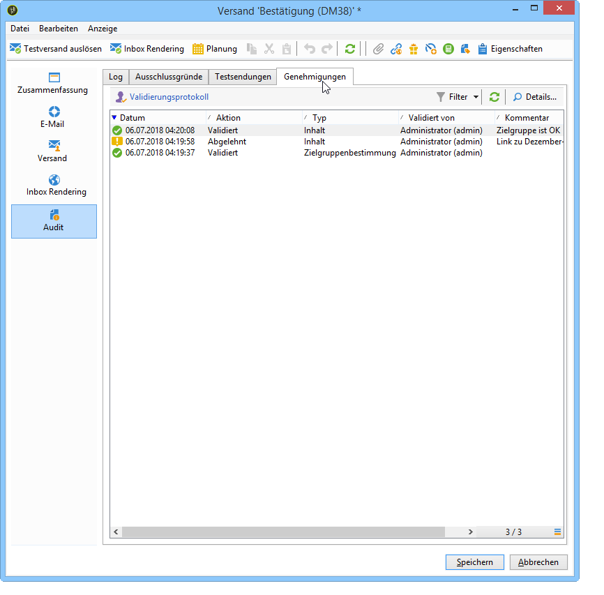

>[!NOTE]
>
>Wenn ein Benutzer einen Auftrag akzeptiert oder abgelehnt hat, können andere Benutzer die Validierung nicht mehr bearbeiten.

### Automatische und manuelle Validierung {#automatic-and-manual-approval}

Wenn bei der Erstellung eines Zielgruppen-Workflows die Validierung automatisch erfolgt (Standardmodus), zeigt [!DNL Adobe Campaign] den Validierungs-Link an oder sendet eine Benachrichtigung, sobald eine Validierung erforderlich ist.

Um den Validierungsmodus (manuell oder automatisch) auszuwählen, klicken Sie auf den Tab **[!UICONTROL Bearbeiten > Eigenschaften]** der Kampagne oder der Kampagnenvorlage, anschließend auf die Option **[!UICONTROL Erweiterte Kampagnenparameter]** und schließlich auf den Tab **[!UICONTROL Validierungen]**.

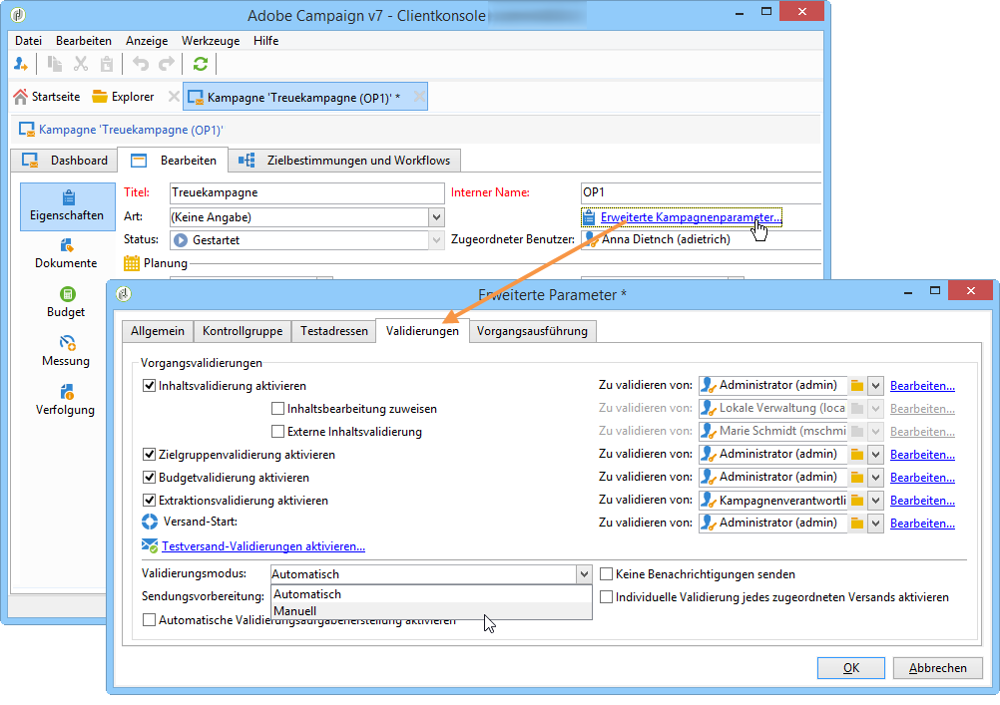

>[!NOTE]
>
>Der gewählte Validierungsmodus wird auf alle Sendungen der Kampagne angewandt.

Bei der Erstellung eines Zielgruppen-Workflows vermeidet die manuelle Validierung die Erstellung von Validierungs-Links oder den automatischen Versand von Benachrichtigungen. Das Kampagnen-Dashboard bietet einen Link **[!UICONTROL Zielgruppenbestimmung zur Genehmigung übermitteln]**, um den Genehmigungsprozess manuell zu starten.

Über eine Bestätigungsnachricht können die Validierungen der ausgewählten Aufgräge für diesen Versand erlaubt werden.

Die Validierungsschaltflächen werden dann im Kampagnen-Dashboard (für diesen Versand), im Versand-Dashboard und im Versand-Tracking angezeigt. Wenn Benachrichtigungen aktiviert sind, werden sie parallel gesendet.

Diese Art der Validierungsaktivierung ermöglicht es, die Zielgruppenbestimmungsrecherchen zu bearbeiten, ohne die validierenden Benutzer fälschlicherweise zu benachrichtigen.

## Benachrichtigungen {#notifications}

Benachrichtigungen sind spezifische E-Mail-Nachrichten, die an Validierungsverantwortliche gesendet werden, um sie darüber zu informieren, dass eine Genehmigung für einen Prozess aussteht. Wenn der Benutzer auf den Link in der Nachricht klickt, wird eine Authentifizierungsseite angezeigt, und nach der Anmeldung kann der Benutzer die Informationen einsehen und den Auftrag genehmigen oder ablehnen. Im Genehmigungsfenster kann auch ein Kommentar eingegeben werden.

Der Inhalt der E-Mail-Benachrichtigungen kann angepasst werden. Siehe [Inhalt der Benachrichtigungen](#notification-content).

### Aktivieren/Deaktivieren von Benachrichtigungen {#enabling-disabling-notification}

Benachrichtigungs-E-Mails werden automatisch versendet, wenn die Validierung des entsprechenden Auftrags in der Kampagnenvorlage, der Kampagne selbst oder im betreffenden Versand aktiviert wurde. Benachrichtigungen können jedoch deaktiviert werden, um nur Validierungen über die Konsole zu erlauben.

Öffnen Sie hierzu das Fenster der Validierungseinstellungen der Kampagne oder der betreffenden Kampagnenvorlage (Tab **[!UICONTROL Bearbeiten > Eigenschaften]** > **[!UICONTROL Erweiterte Kampagneneigenschaften...]** > **[!UICONTROL Validierungen]**) und aktivieren Sie die Option **[!UICONTROL Keine Benachrichtigungen senden]**.

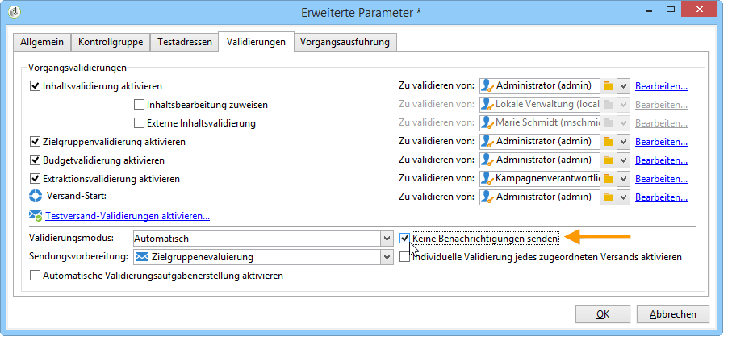

### Inhalt der Benachrichtigungen {#notification-content}

Der Benachrichtigungsinhalt wird in einer bestimmten Vorlage definiert: **[!UICONTROL Benachrichtigung über Validierungen für die Marketing-Kampagne]**. Diese Vorlage wird im Ordner **[!UICONTROL Administration > Kampagnenverwaltung > Vorlagen technischer Sendungen]** des [!DNL Adobe Campaign] gespeichert.

## Prüfen und Validieren von Sendungen {#checking-and-approving-deliveries}

[!DNL Adobe Campaign] können Sie im kollaborativen Modus Validierungsprozesse für die wichtigsten Phasen der Marketing-Kampagne einrichten.

Bei Briefpost-Sendungen können [!DNL Adobe Campaign] die Extraktionsdatei vor dem Versand an den Router einsehen. Bei Bedarf können sie das Format ändern und die Extraktion erneut starten. Lesen Sie diesbezüglich den Abschnitt [Validieren einer Extraktionsdatei](#approving-an-extraction-file).

Für jede Kampagne können Sie die Versandzielgruppe, den Inhalt (siehe [Inhalt genehmigen](#approving-content) und die Kosten validieren. [!DNL Adobe Campaign] für die Validierung zuständigen Benutzer können per E-Mail benachrichtigt werden und eine Validierung über die Konsole oder eine Web-Verbindung annehmen oder ablehnen. Siehe [Schritte zur Validierung eines Versands](#approving-processes).

Sobald diese Validierungsphasen beendet sind, kann der Versand gestartet werden. [Weitere Informationen zum Starten eines Versands](../../campaign/using/marketing-campaign-deliveries.md#starting-a-delivery).

### Schritte zur Validierung eines Versands {#approving-processes}

Die Phasen, für die eine Validierung erforderlich ist, werden im Kampagnen-Dashboard (über die Konsole der Web-Schnittstelle) angezeigt. Sie werden auch in der Versandverfolgungstabelle und im Versand-Dashboard angezeigt.

Die Kampagne erhält daraufhin den Status **[!UICONTROL Zu validieren]**.

>[!NOTE]
>
>Passen Sie die Kampagnenvorlage an, um die Prozesse auszuwählen, für die eine Validierung erforderlich ist. Weitere Informationen hierzu finden Sie im Abschnitt [Kampagnenvorlagen](../../campaign/using/marketing-campaign-templates.md#campaign-templates).
>

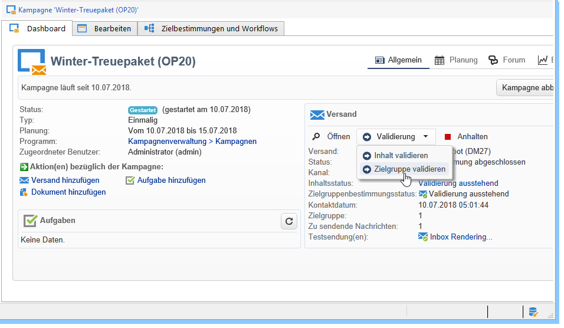

>[!NOTE]
>
>Wenn in einem Zielgruppen-Workflow während der Nachrichtenvorbereitung ein Konfigurationsfehler auftritt, wird der Link **[!UICONTROL Nachrichtenvorbereitung neu starten]** im Dashboard angezeigt. Korrigieren Sie den Fehler und klicken Sie anschließend auf diesen Link, um die Nachrichtenvorbereitung ohne die Zielbestimmung erneut durchzuführen.

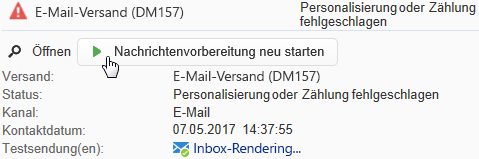

Folgende Validierungsvorgänge stehen für Kampagnensendungen zur Verfügung:

* **Zielgruppenbestimmung, Inhalt und Budget**

  Wenn die Optionen **[!UICONTROL Zielgruppenvalidierung aktivieren]**, **[!UICONTROL Inhaltsvalidierung aktivieren]** oder **[!UICONTROL Budgetvalidierung aktivieren]** im Fenster der Validierungseinstellungen ausgewählt sind, werden die entsprechenden Links im Dashboard der Kampagne für die betreffenden Sendungen angezeigt.

  >[!NOTE]
  >
  >Die Budgetvalidierung ist nur verfügbar, wenn die Zielgruppenvalidierung im Fenster der Validierungseinstellungen aktiviert ist. Der Link zur Budgetvalidierung wird erst nach der Zielgruppenanalyse angezeigt. Außerdem wird dieser Link zusammen mit dem Link für die Zielgruppenvalidierung angezeigt.

  Wenn die Optionen **[!UICONTROL Inhaltsbearbeitung zuweisen]** oder **[!UICONTROL Externe Inhaltsvalidierung]** im Fenster der Validierungseinstellungen ausgewählt sind, werden im Dashboard die entsprechenden Links **[!UICONTROL Inhalt unterbreiten]** und **[!UICONTROL Externe Inhaltsvalidierung]** angezeigt.

  Die Inhaltsvaldiierung ermöglicht den Zugriff auf die durchgeführtenTestsendungen.

* **Validierung der Extraktion (Briefpost)**

  Wenn die Option **[!UICONTROL Extraktionsvalidierung aktivieren]** im Fenster der Validierungseinstellungen ausgewählt ist, muss die Extraktionsdatei validiert werden, bevor der Router benachrichtigt werden kann.

  Die Extraktionsvalidierung erfolgt im Zuge der Inhaltsvalidierung. Klicken Sie diesbezüglich auf den im Kampagnen-Dashbord angezeigten Link **[!UICONTROL Inhalt validieren]**:

  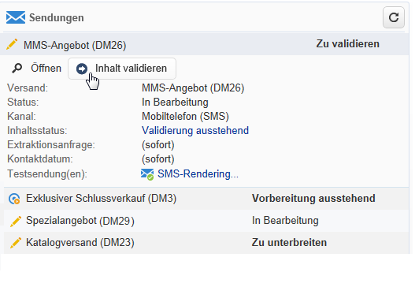

  Über das Validierungsfenster kann eine Vorschau der Extraktionsdatei angesehen und die Validierung akzeptiert oder abgelehnt werden.

  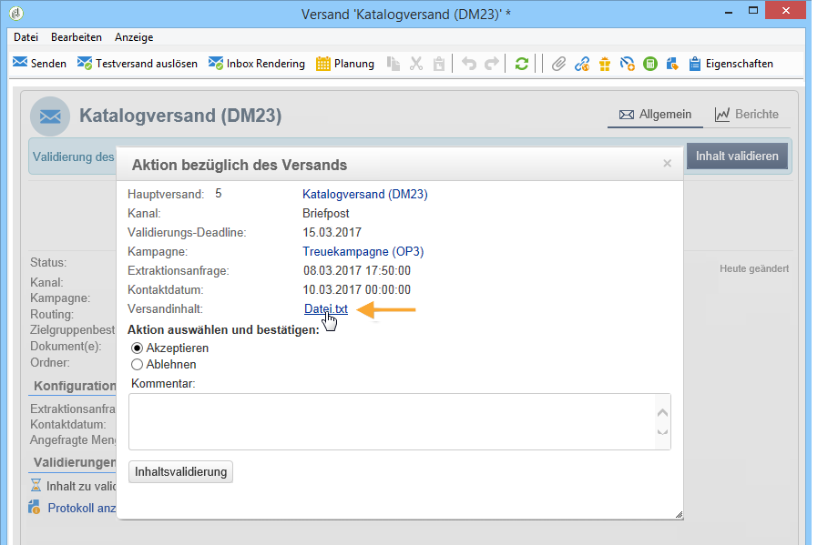

  >[!NOTE]
  >
  >Die Vorschau der Extraktionsdatei bezieht sich nur auf ein Datenbeispiel. Es wird nicht die gesamte Ausgabedatei geladen.

* **Validierung der Sendungen**

  Die **[!UICONTROL Individuelle Validierung jedes zugeordneten Versands aktivieren]** wird für einen Hauptversand verwendet, der mit sekundären Sendungen verknüpft ist. Standardmäßig ist diese Option nicht aktiviert, sodass eine Gesamtvalidierung des Hauptversands durchgeführt werden kann. Wenn diese Option aktiviert ist, muss jeder Versand einzeln validiert werden.

  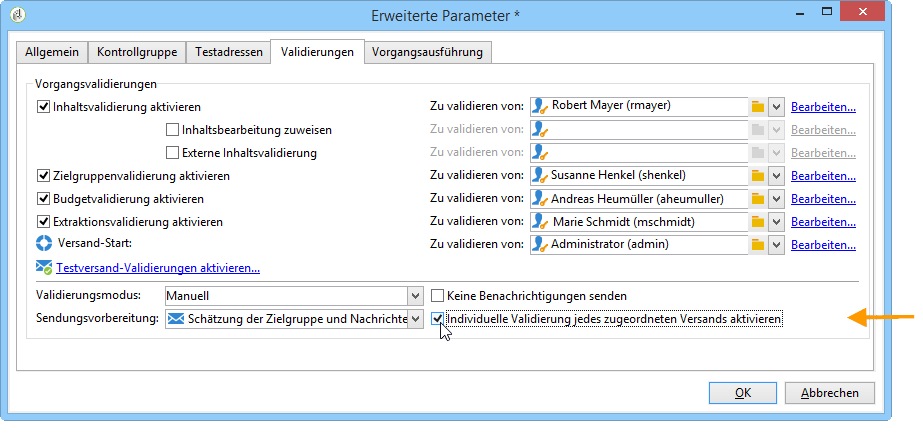

### Auswahl zu validierender Prozesse {#choosing-the-processes-to-be-approved}

Die Validierungsphasen werden mit der der Kampagne zugeordneten Vorlage definiert. Wählen Sie die zu validierenden Elemente aus der Vorlage aus und geben Sie die [!DNL Adobe Campaign] Benutzer an, die für diese Validierungen verantwortlich sind. Weitere Informationen zu Kampagnenvorlagen finden Sie unter [Kampagnenvorlagen](../../campaign/using/marketing-campaign-templates.md#campaign-templates).

>[!NOTE]
>
>Die Validierungskonfiguration für die Kampagne (oder Kampagnenvorlage) gilt für alle zukünftigen Sendungen, die mit dieser Kampagne verknüpft sind. Konfigurationsänderungen werden nicht auf vorherige Sendungen angewendet.

Die Einstellungen können jedoch für jede Kampagne und jeden Versand überschrieben werden.

Um die Validierungseinstellungen einer Kampagne zu verändern, klicken Sie auf den Tab **[!UICONTROL Bearbeiten > Eigenschaften]**, öffnen Sie den Link **[!UICONTROL Erweitere Kampagnenparameter...]** und gehen Sie in den Untertab **[!UICONTROL Validierungen]**.

Sie können die zu validierenden Prozesse auswählen und die Auswahl aufheben, damit [!DNL Adobe Campaign] für die Validierung verantwortlichen Benutzer bestimmt werden können. Dabei kann es sich um einzelne Benutzer, eine Benutzergruppe oder eine Benutzerliste handeln.

Um eine Benutzerliste zu erstellen, klicken Sie auf den Link **[!UICONTROL Bearbeiten...]** rechts von dem Feld, in dem der erste Validierungsverantwortliche angegeben wird. Fügen Sie nun so viele zusätzliche Benutzer wie nötig hinzu, wie im folgenden Beispiel:

>[!NOTE]
>
>* Wenn eine Liste von Validierungsverantwortlichen definiert ist, wird ein Auftrag validiert, sobald ein Validierungsverantwortlicher ihn akzeptiert hat. Der entsprechende Validierungs-Link wird dann nicht mehr im Dashboard angezeigt. Wenn das Senden von Benachrichtigungen aktiviert ist und ein anderer Validierungsverantwortlicher auf den Validierungs-Link in der Benachrichtigung klickt, wird ihm mitgeteilt, dass ein anderer Validierungsverantwortlicher den Auftrag bereits validiert hat.
>* Im unteren Bereich des Bearbeitungsfensters für Validierungsverantwortliche können Sie einen Validierungsplan für die Kampagne definieren. Standardmäßig haben Validierungsverantwortliche ab dem Unterbreitungsdatum drei Tage Zeit, um einen Prozess zu validieren. Es ist möglich, eine Erinnerung zu konfigurieren, die automatisch vor Ablauf der Validierungsfrist an die betroffenen Benutzer gesendet wird.
>* Es besteht die Möglichkeit, den betreffenden Benutzern vor dem Ende der Validierungsfrist eine automatische Erinnerung zu senden.
>

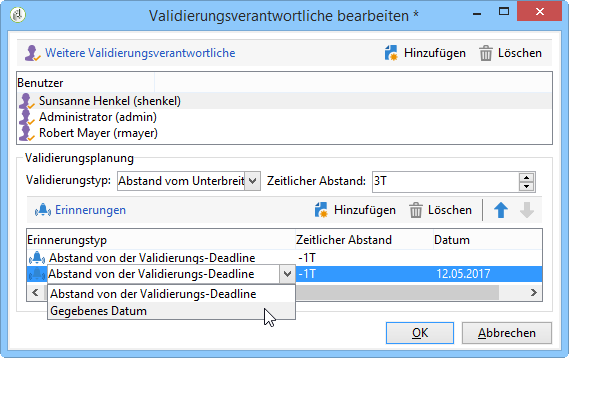

Um die Validierungsdaten und automatische Erinnerungen jeden Versands einzusehen und zu verändern, gehen Sie in den Tab **[!UICONTROL Verfolgung]** und klicken Sie auf **[!UICONTROL Validierungen]**.

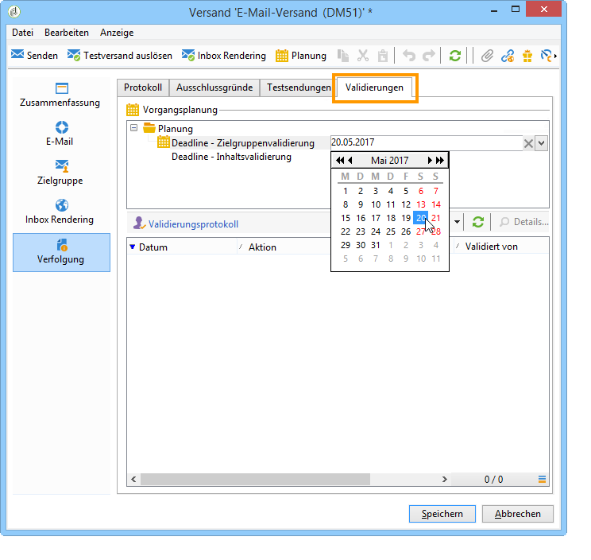

>[!NOTE]
>
>Dieser Tab wird mit dem Beginn der Inhaltsvalidierung verfügbar.

### Validieren eines Inhalts {#approving-content}

>[!CAUTION]
>
>Um einen Inhalt zu genehmigen, ist ein Testversandzyklus obligatorisch. Mit Testsendungen können Sie die Anzeige von Informationen und Personalisierungsdaten validieren und prüfen, ob Links funktionieren. Erfahren Sie, wie Sie einen Korrekturabzug in [Korrekturabzug erstellen](../../delivery/using/steps-validating-the-delivery.md#sending-a-proof) erstellen.
>
>Die im Folgenden beschriebenen Funktionen für die Inhaltsvalidierung beziehen sich auf den Testversand.

Es ist möglich, einen Validierungszyklus für Inhalte zu konfigurieren. Wählen Sie dazu im Fenster mit den Validierungseinstellungen die Option **[!UICONTROL Inhaltsvalidierung aktivieren]**. Die Inhaltsvalidierung gliedert sich in folgende Schritte:

1. Nach der Erstellung eines neuen Versands klickt der Kampagnenverantwortliche auf den Link **[!UICONTROL Inhalt unterbreiten]** im Kampagnen-Dashboard, um den Zyklus der Inhaltsvalidierung zu starten.

   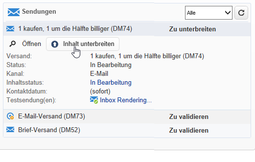

   >[!NOTE]
   >
   >Wenn im Fenster der Validierungseinstellungen die Option **[!UICONTROL Testversand aktivieren]** (für einen E-Mail-Versand) oder die Option **[!UICONTROL Testversandvalidierung]** (für einen Briefpost-Versand) aktiviert ist, erfolgt der Testversand automatisch.

1. Der Inhaltsverantwortliche wird daraufhin per E-Mail benachrichtigt und entscheidet, ob er den Inhalt validiert oder nicht:

   * über die Benachrichtigungs-E-Mail:

     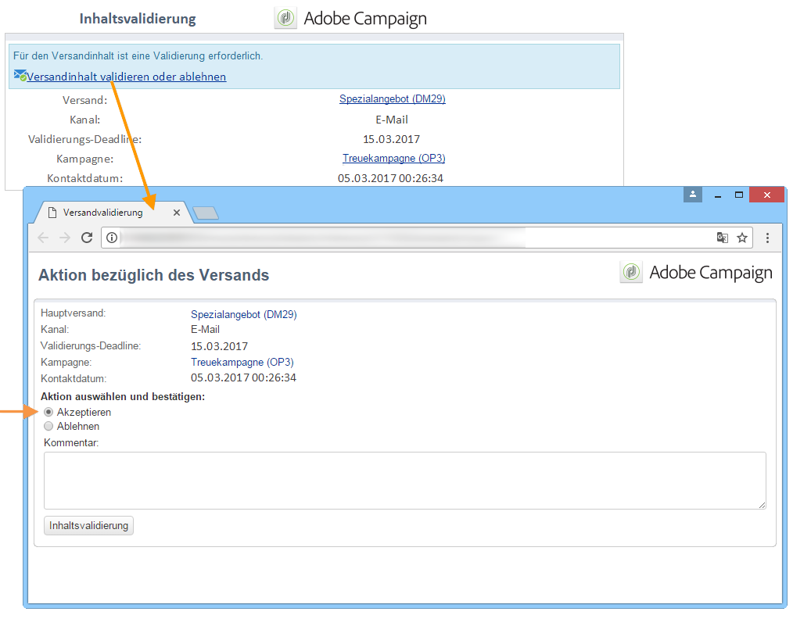

     >[!NOTE]
     >
     >Die Benachrichtigungs-E-Mail enthält einen Link zu den erfolgten Testsendungen und zur Nachrichtendarstellung nach E-Mail-Anbieter (Inbox Rendering), sofern die Option **Delivrability** in dieser Instanz aktiviert wurde.

   * über die Konsole oder die Webschnittstelle, in der Versandverfolgung oder dem Kampagnen- oder Versand-Dashboard:

     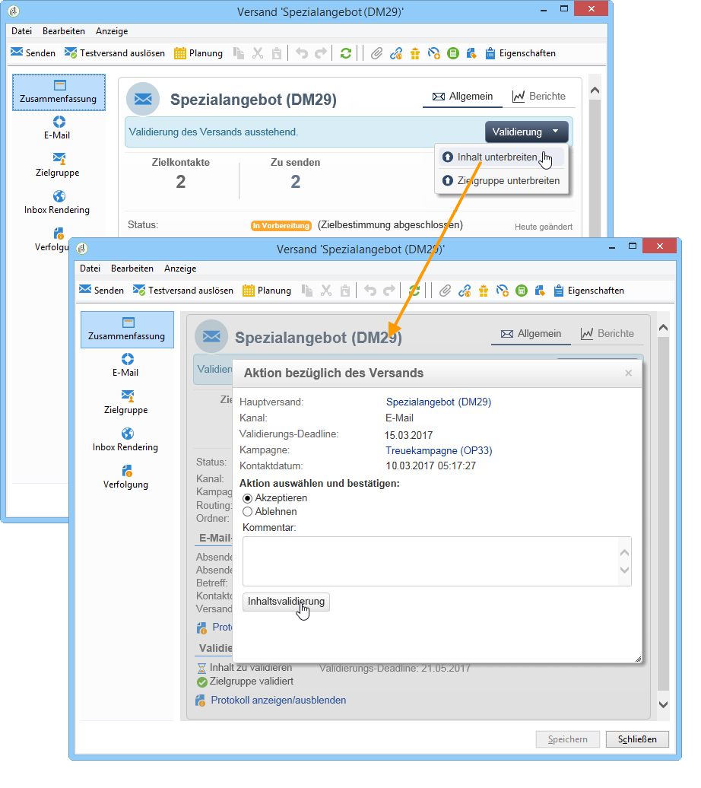

     >[!NOTE]
     >
     >Im Kampagnen-Dashboard kann die Liste der durchgeführten Testsendungen durch Öffnen des Links **[!UICONTROL Inbox Rendering…]** angezeigt werden. Klicken Sie auf das Symbol **[!UICONTROL Details]** rechts von der Liste, um ihren Inhalt anzuzeigen.

     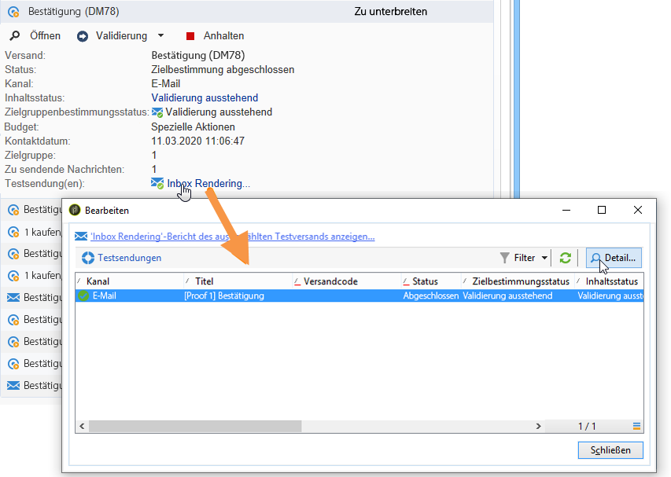

1. Der Kampagnenverantwortliche wird per E-Mail benachrichtigt, ob der Inhalt validiert wurde oder nicht.

   >[!NOTE]
   >
   >Die für die Kampagne verantwortliche Person kann zu jedem Zeitpunkt den Zyklus der Inhaltsvaldierung neu starten. Öffnen Sie hierzu den Link oberhalb der Zeile **[!UICONTROL Inhaltsstatus]** im Kampagnen-Dashboard (auf Ebene des Versands) und klicken Sie auf **[!UICONTROL Inhaltsvalidierung zurücksetzen, um sie erneut durchzuführen]**.

   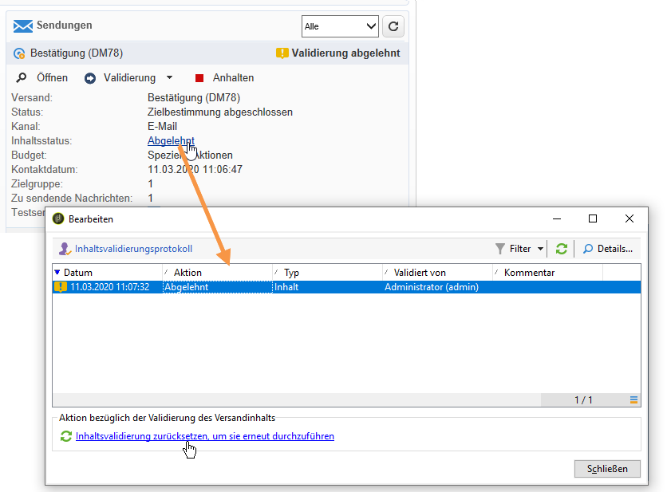

#### Zuweisen einer Inhaltsbearbeitung {#assign-content-editing}

Diese Option ermöglicht die Bestimmung einer für die Inhaltsbearbeitung verantwortlichen Person, zum Beispiel einen Webmaster. Wenn die Option **[!UICONTROL Inhaltsbearbeitung zuweisen]** im Fenster der Validierungseinstellungen aktiviert ist, werden zwischen der Versanderstellung und dem Versand der Benachrichtigungs-E-Mail an die Inhaltsverantwortlichen mehrere Validierungsetappen hinzugefügt:

1. Nach Erstellung eines neuen Versands klickt der Kampagnenverantwortliche auf den Link **[!UICONTROL Inhaltsbearbeitung unterbreiten]** im Kampagnen-Dashboard, um den Inhaltsbearbeitungszyklus zu starten.

   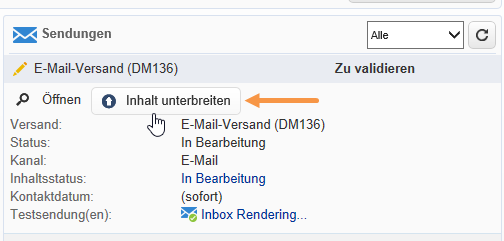

1. Der Verantwortliche der Inhaltsbearbeitung erhält daraufhin eine E-Mail, die ihn über die Inhaltsfreigabe informiert.

   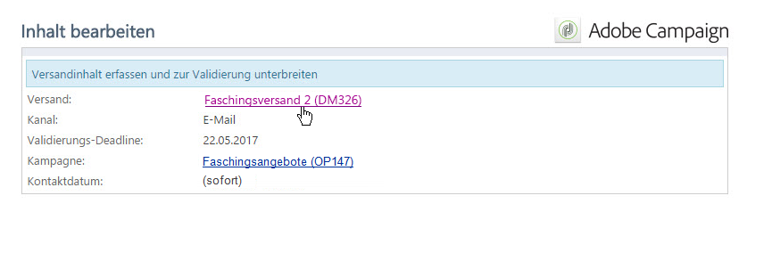

1. Diese Person kann sich dann bei der Konsole anmelden, den Versand öffnen und diesen mittels eines vereinfachten Assistenten bearbeiten, um den Betreffs, HTML- und Textinhalte zu änder und Testsendungen durchzuführen.

   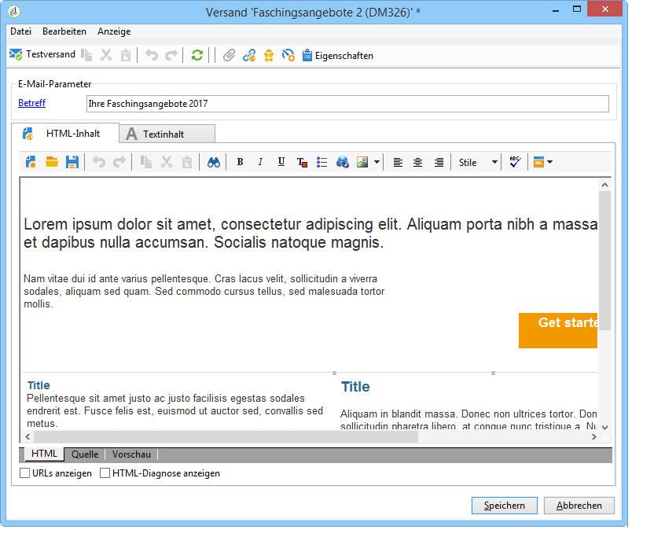

   >[!NOTE]
   >
   >Wenn im Fenster der Validierungseinstellungen die Option **[!UICONTROL Testversand aktivieren]** (für einen E-Mail-Versand) oder die Option **[!UICONTROL Testversandvalidierung]** (für einen Briefpost-Versand) aktiviert ist, erfolgt der Testversand automatisch.

1. Nach Beendigung der Bearbeitung kann der Verantwortliche der Inhaltsbearbeitung den Inhalt zur Verfügung stellen.

   Hierfür hat er folgende Möglichkeiten:

   * Klicken Sie über **[!UICONTROL Konsole auf]** Link „Verfügbare Inhalte[!DNL Adobe Campaign] .

     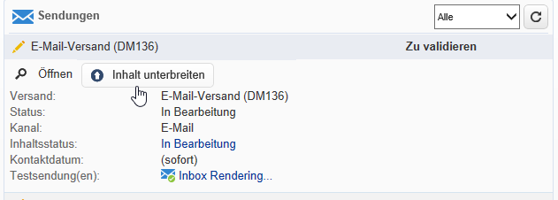

   * Klick auf den in der Benachrichtigungs-E-Mail enthaltenen Link und Validierung der Inhaltsfreigabe.

     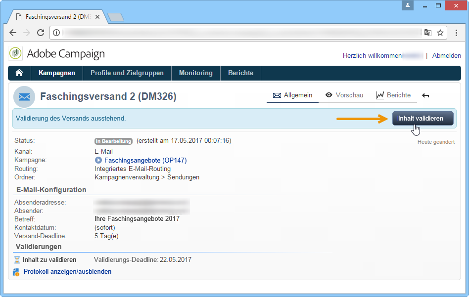

     Der Benutzer kann der Validierung einen Kommentar hinzufügen, bevor er den Inhalt dem Kampagnenverantwortlichen unterbreitet.

     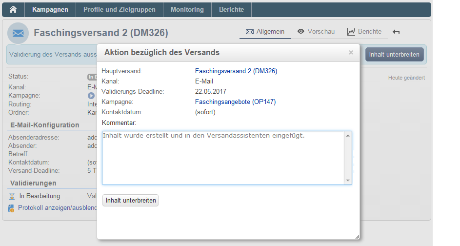

     Über die Benachrichtigungs-E-Mail kann der Kampagnenverantwortliche den ihm unterbreiteten Inhalt akzeptieren oder ablehnen.

     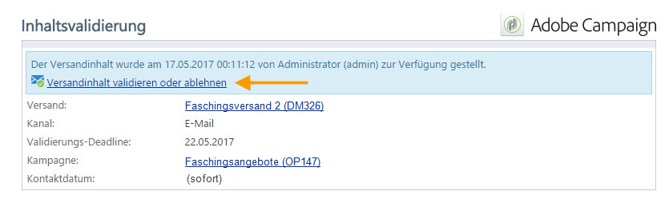

#### Externe Inhaltsvalidierung {#external-content-approval}

Mit dieser Option können Sie einen externen Benutzer definieren, der für die Validierung des Versand-Renderings zuständig ist, z. B. für die Markenkommunikation, die Konsistenz der Tarife usw. Wenn die Option **[!UICONTROL Externe Inhaltsvalidierung]** im Fenster der Validierungseinstellungen ausgewählt ist, werden mehrere Validierungsschritte zwischen der Inhaltsvalidierung und dem Versand der Benachrichtigung an den Kampagnenverantwortlichen hinzugefügt:

1. Der externe Inhaltsverantwortliche wird per E-Mail benachrichtigt, sobald der Inhalt intern validiert wurde und die externe Validierung erfolgen muss.
1. Die Benachrichtigungs-E-Mail enthält Links zu den Testsendungen, die der Überprüfung der Darstellung des Versandinhalts dienen, und eine Schaltfläche, über die der Versandinhalt validiert oder abgelehnt werden kann.

   >[!NOTE]
   >
   >Diese Links sind nur verfügbar, wenn eine oder mehrere Testsendungen durchgeführt wurden. Andernfalls ist das Versand-Rendering nur über die Konsole oder die Web-Schnittstelle verfügbar.

   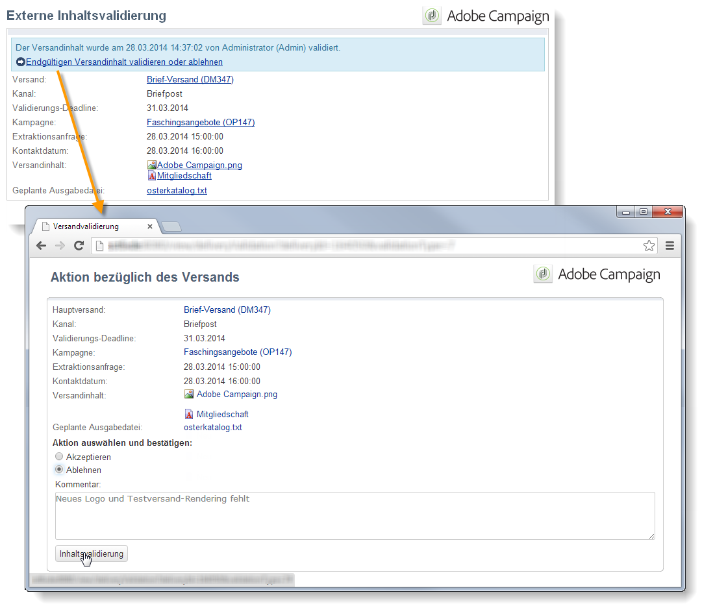

### Validieren einer Extraktionsdatei {#approving-an-extraction-file}

Bei Offline-Sendungen generiert [!DNL Adobe Campaign] eine Extraktionsdatei, die je nach Einrichtung an den Router gesendet wird. Ihr Inhalt hängt von der verwendeten Exportvorlage ab.

Sobald Inhalt, Zielgruppenbestimmung und Budget validiert sind, erhält der Versand den Status **[!UICONTROL Extraktion ausstehend]**, bis der Extraktions-Workflow für Kampagnen gestartet wird.

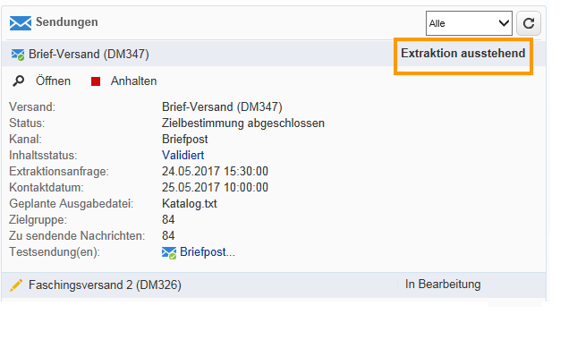

Wenn das Datum der Extraktionsanfrage erreicht ist, wird die Extraktionsdatei erstellt und der Versandstatus wird zu **[!UICONTROL Datei zu validieren]**.

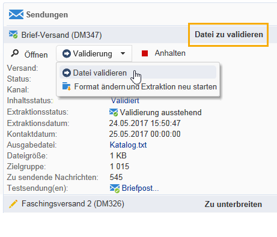

Sie können den Inhalt der Extraktionsdatei ansehen, indem Sie auf ihren Titel klicken. Über die verschiedenen Links im Dashboard haben Sie zudem die Möglichkeit, die Datei zu validieren oder bei Bedarf ihr Format zu verändern und die Extraktion erneut durchzuführen.

Nachdem die Datei validiert wurde, können Sie die Benachrichtigungs-E-Mail an den Router senden. Weitere Informationen finden Sie unter [Starten eines Offline-Versands](../../campaign/using/marketing-campaign-deliveries.md#starting-an-offline-delivery).
