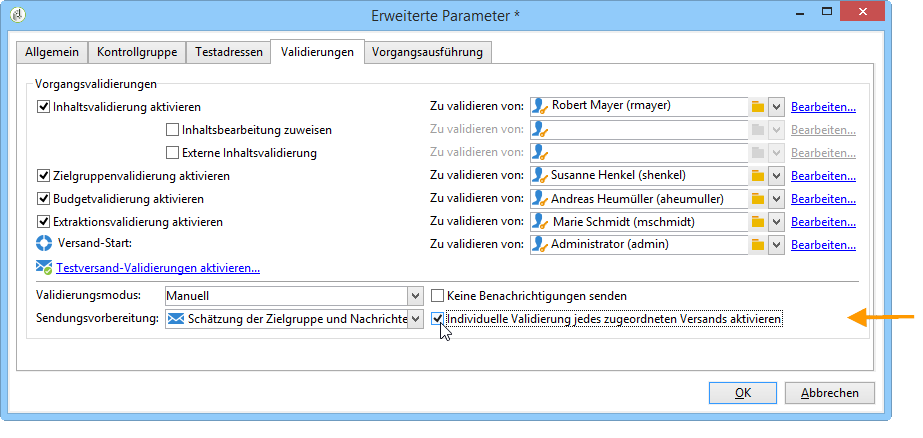
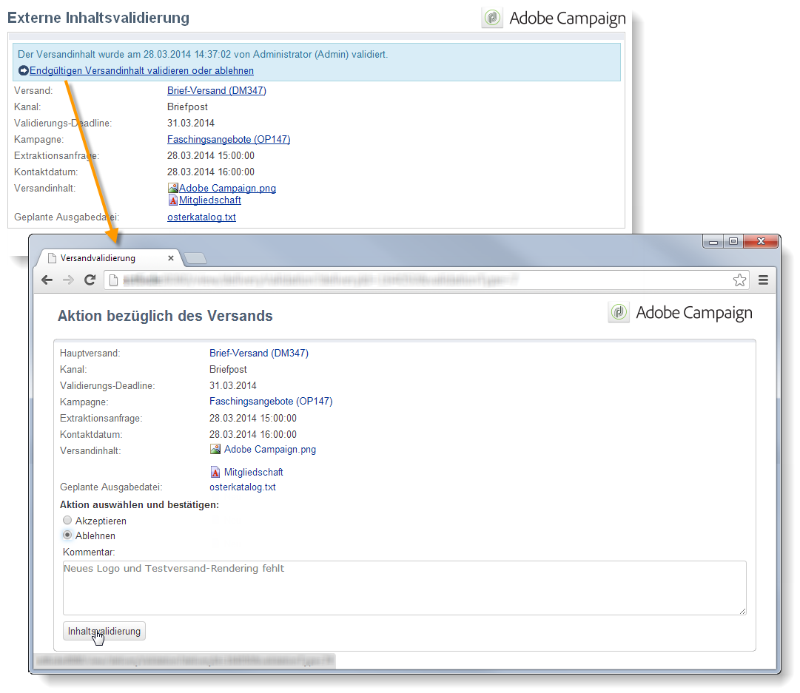

# Validieren von Marketing-Kampagnen {#approving-marketing-campaigns}

## Validierungsprozess {#approval-process}

Jede Etappe eines Versands kann zur Validierung unterbreitet werden, um eine umfassende Steuerung und Kontrolle der unterschiedlichen Kampagnenprozesse sicherzustellen. Hierzu gehören Zielbestimmung, Inhalt, Budget, Extraktion und BAT-Versand.

>[!NOTE]
>
>Sie müssen überprüfen, ob die Validierer über die entsprechenden Berechtigungen zur Validierung verfügen. Vergewissern Sie sich auch, dass ihre Sicherheitszone richtig definiert ist.

Die als validierungsverantwortlich ernannten Adobe-Campaign-Benutzer werden per E-Mail über Validierungsanfragen benachrichtigt.

Der Validierungsprozess wird unter [Kontrolle und Validierung von Sendungen](#checking-and-approving-deliveries) beschrieben.

>[!NOTE]
>
>Standardmäßig kann nur der für den Versand verantwortliche Benutzer den Start desselben auslösen. Damit andere Benutzer (oder Benutzergruppen) einen Versand starten können, müssen diese im Feld **[!UICONTROL Versand-Start:]** als Validierungsverantwortliche hinzugefügt werden.\
>Weiterführende Informationen finden Sie unter [Auswahl der validierungsverantwortlichen Benutzer](#selecting-reviewers).

### Grundprinzip {#operating-principle-}

Unten stehende Abbildung zeigt beispielhaft die Standard-E-Mail, die für Budgetvalidierungen versendet wird:

Die validierungsverantwortlichen Benutzer können die Validierung der betreffenden Etappe akzeptieren oder ablehnen.

Die jeweilige Entscheidung des Validierers wird im Dashboard des Versands angezeigt.

Zudem wird die Entscheidung in den Validierungslogs der Kampagne dokumentiert, die über den Tab **[!UICONTROL Bearbeitung > Verfolgung > Validierungen]** zugänglich sind:

Derartige Benachrichtigungs-E-Mails werden für jeden Prozess, für den die Validierung aktiviert wurde, an den angegebenen Benutzer gesendet.

Validierungen können in Kampagnenvorlagen sowie in jeder Kampagne und jedem Versand aktiviert werden.

Die zu validierenden Prozesse sowie die jeweiligen Validierungsverantwortlichen werden in der Kampagnenvorlage bestimmt (im Tab **[!UICONTROL Eigenschaften]** > **[!UICONTROL Erweiterte Kampagnenparameter]** > **[!UICONTROL Validierungen]**). Die Validierer erhalten Benachrichtigungs-E-Mails, sofern diese Option nicht deaktiviert wird. Weitere Informationen hierzu finden Sie im Abschnitt [Vorgänge validieren](#approving-processes).

Diese Konfiguration kann auf Ebene der mit dieser Vorlage erstellten Kampagnen sowie in jedem Versand einzeln überschrieben werden. Klicken Sie hierzu auf die Schaltfläche **[!UICONTROL Eigenschaften]** und anschließend auf den Tab **[!UICONTROL Validierungen]**.

Im nachfolgenden Beispiel wird der Inhalt des Briefpost-Versands nicht zur Validierung unterbreitet:

### Auswahl der validierungsverantwortlichen Benutzer {#selecting-reviewers}

Für jeden Validierungstyp können die validierenden Benutzer oder Benutzergruppen in der Dropdown-Liste der betreffenden Validierung ausgewählt werden. Über den Link **[!UICONTROL Bearbeiten...]** lassen sich weitere Benutzer hinzufügen. In diesem Fenster haben Sie auch die Möglichkeit, die Validierungs-Deadline zu verändern.

Wenn kein validierungsverantwortlicher Benutzer ausgewählt wurde, ist der Kampagnenverantwortliche für die Validierung zuständig. Er erhält daraufhin die Benachrichtigungen. Der Kampagnenverantwortliche wird im Tab **[!UICONTROL Bearbeiten > Eigenschaften]** der Kampagne ernannt:

>[!NOTE]
>
>Alle über **[!UICONTROL Administrator]**-Berechtigungen verfügende Adobe-Campaign-Benutzer sind ebenfalls befugt, Prozesse zu validieren. Sie erhalten jedoch keine Benachrichtigungen.\
>Wenn validierungsverantwortliche Benutzer definiert sind, kann der kampagnenverantwortliche Benutzer standardmäßig nicht die Validierung vornehmen oder den Versand starten. Wenn Sie zulassen möchten, dass der kampagnenverantwortliche Benutzer Sendungen validieren und starten kann, geben Sie für die Option **NmsCampaign_Activate_OwnerConfirmation** den Wert **1** ein.

### Validierungsmodi {#approval-modes}

#### Validierung über das Dashboard {#approval-via-the-dashboard}

Um einen Vorgang über Konsole oder Webschnittstelle zu validieren, klicken Sie auf den entsprechenden Link im Kampagnen-Dashboard. Die Validierung kann auch über die Versandverfolgung oder das Versand-Dashboard erfolgen.

Überprüfen Sie die zu validierenden Informationen und entscheiden Sie, ob Sie die Validierung akzeptieren oder ablehnen. Erfassen Sie gegebenenfalls einen Kommentar und klicken Sie zum Speichern auf **[!UICONTROL OK]**.

>[!NOTE]
>
>Wenn ein Vorgang bereits von einem anderen Benutzer validiert wurde, ist der Validierungslink nicht mehr verfügbar.

#### Validierung über Benachrichtiguns-E-Mails {#approval-via-notification-messages}

Klicken Sie auf den Link, der im Benachrichtigungsinhalt verfügbar ist (siehe [Benachrichtigungen](#notifications)). Sie werden gebeten, sich zu identifizieren, wie nachfolgend gezeigt:

Wählen Sie **[!UICONTROL Akzeptieren]** oder **[!UICONTROL Ablehnen]** und erfassen Sie gegebenenfalls einen Kommentar.

Klicken Sie auf die Schaltfläche **[!UICONTROL Validieren]**.

>[!NOTE]
>
>Wenn der Vorgang Warnungen erzeugt hat, erscheint in der Benachrichtigung ein Warnhinweis.

#### Validierungsverfolgung {#approval-tracking}

Informationen zur Validierung werden an verschiedenen Orten gespeichert:

* Im Validierungsprotokoll der Kampagne, im Untertab **[!UICONTROL Validierungen]** des Tabs **[!UICONTROL Bearbeiten > Verfolgung]**:

   

* Im Versandprotokoll der Kampagne, im Untertab **[!UICONTROL Sendungen]** des Tabs **[!UICONTROL Bearbeiten > Verfolgung]**:

   

* Der Validierungsstatus jedes Versands kann über die Option **[!UICONTROL Protokoll anzeigen/ausblenden]** im Tab **[!UICONTROL Zusammenfassung]** eingesehen werden:

   

* Diese Informationen sind zudem über den Tab **[!UICONTROL Verfolgung > Validierungen]** jedes Versands zugänglich.

   

>[!NOTE]
>
>Wenn ein Benutzer einen Vorgang akzeptiert oder abgelehnt hat, können andere Benutzer die Validierung nicht mehr bearbeiten.

#### Automatische und manuelle Validierung {#automatic-and-manual-approval}

Wenn bei der Erstellung eines Zielgruppen-Workflows die Validierung automatisch erfolgt (Standardmodus), zeigt Adobe Campaign den Validierungslink an oder sendet eine Benachrichtigung, sobald eine Validierung erforderlich ist.

Um den Validierungsmodus (manuell oder automatisch) auszuwählen, klicken Sie auf den Tab **[!UICONTROL Bearbeiten > Eigenschaften]** der Kampagne oder der Kampagnenvorlage, anschließend auf die Option **[!UICONTROL Erweiterte Kampagnenparameter]** und schließlich auf den Tab **[!UICONTROL Validierungen]**.

>[!NOTE]
>
>Der gewählte Validierungsmodus wird auf alle Sendungen der Kampagne angewandt.

Die manuelle Validierung hingegen verhindert bei der Erstellung eines Zielgruppen-Workflows die automatische Generierung von Validierungslinks und den automatischen Versand von Benachrichtigungen. Im Dashboard der Kampagne wird daraufhin der Link **[!UICONTROL Zielgruppe zur Validierung unterbreiten]** verfügbar, um die Validierung manuell zu starten.

Über eine Bestätigungsnachricht können die Validierungen der ausgewählten Prozesse für diesen Versand erlaubt werden.

Daraufhin werden die Validierungsschaltflächen im Dashboard der Kampagne (für diesen Versand), im Dashboard des Versands sowie in der Versandverfolgung angezeigt. Wenn die Benachrichtigungen aktiviert wurden, werden diese parallel versendet.

Diese Art der Validierungsaktivierung ermöglicht es, die Zielbestimmungsrecherchen zu bearbeiten, ohne die validierenden Benutzer fälschlicherweise zu benachrichtigen.

### Benachrichtigungen {#notifications}

Benachrichtigungen sind spezifische E-Mails, die den validierungsverantwortlichen Benutzern gesendet werden, um diese über auf Validierung wartende Prozesse zu informieren. Der in der Nachricht enthaltene Link führt zu einer Webschnittstelle, in der sich der Benutzer identifizieren muss. Nach der Anmeldung kann er die betreffenden Elemente einsehen, den Prozess validieren oder nicht und seine Entscheidung mit einem Kommentar begründen.

Der Inhalt der E-Mail-Benachrichtigungen kann angepasst werden. Siehe [Inhalt der Benachrichtigungen](#notification-content).

#### Aktivierung/Deaktivierung von Benachrichtigungen {#enabling-disabling-notification}

Benachrichtigungs-E-Mails werden automatisch versendet, wenn die Validierung des entsprechenden Prozesses in der Kampagnenvorlage, der Kampagne selbst oder dem betreffenden Versand aktiviert wurde. Die Benachrichtigungen können jedoch auch deaktiviert werden, um nur Validierungen über die Konsole zu erlauben.

Öffnen Sie hierzu das Fenster der Validierungseinstellungen der Kampagne oder der betreffenden Kampagnenvorlage (Tab **[!UICONTROL Bearbeiten > Eigenschaften]** > **[!UICONTROL Erweiterte Kampagneneigenschaften...]** > **[!UICONTROL Validierungen]**) und aktivieren Sie die Option **[!UICONTROL Keine Benachrichtigungen senden]**.

#### Inhalt der Benachrichtigungen {#notification-content}

Der Benachrichtigungsinhalt wird in der dedizierten Vorlage **[!UICONTROL Validierungsbenachrichtigung bezüglich einer Marketingkampage]** festgelegt. Sie können im Ordner **[!UICONTROL Administration > Kampagnen > Vorlagen technischer Sendungen]** des Adobe-Campaign-Explorers darauf zugreifen.

## Kontrolle und Validierung von Sendungen {#checking-and-approving-deliveries}

Adobe Campaign ermöglicht den Einsatz von partizipativen Validierungsprozessen für die wichtigsten Etappen einer Marketing-Kampagne.

Bei Briefpost-Versand können Adobe Campaign-Benutzer die Extraktionsdatei vor der Übermittlung an den Router einsehen. Bei Bedarf haben sie die Möglichkeit, das Format zu verändern und die Extraktion erneut zu starten. Lesen Sie diesbezüglich den Abschnitt [Extraktionsdatei validieren](#approving-an-extraction-file).

Für jede Kampagne können Sie die Versandzielgruppe, den Inhalt (siehe [Inhalt validieren](#approving-content)) und die Kosten validieren. Die für die Validierung zuständigen Adobe Campaign-Benutzer können per E-Mail benachrichtigt werden und eine Validierung über die Konsole oder eine Web-Verbindung annehmen oder ablehnen. Lesen Sie diesbezüglich den Abschnitt [Vorgänge validieren](#approving-processes).

Sobald diese Validierungsphasen beendet sind, kann der Versand gestartet werden. Lesen Sie diesbezüglich den Abschnitt [Starten eines Versands](../../campaign/using/marketing-campaign-deliveries.md#starting-a-delivery).

>[!NOTE]
>
>Mehr Informationen über Validierungsmodi und Tracking finden Sie im Abschnitt [Validierungsprozess](#approval-process).

### Vorgänge validieren {#approving-processes}

Die Phasen, für die eine Validierung erforderlich ist, werden im Kampagnen-Dashboard (über die Konsole der Web-Schnittstelle) angezeigt. Sie werden auch in der Versandverfolgungstabelle und im Versand-Dashboard angezeigt.

Die Kampagne erhält daraufhin den Status **[!UICONTROL Zu validieren]**.

>[!NOTE]
>
>* Um die Prozesse auszuwählen, für die eine Validierung erforderlich ist, ändern Sie die Kampagnenvorlage. Weitere Informationen hierzu finden Sie im Abschnitt [Kampagnenvorlagen](../../campaign/using/marketing-campaign-templates.md#campaign-templates).
>
>* Lesen Sie hierzu auch den Abschnitt [Validierungsprozess](#approval-process).

>[!NOTE]
>
>Wenn in einem Zielgruppen-Workflow bei der Vorbereitung der Nachrichten ein Fehler bezüglich der Konfiguration auftritt, erscheint im Dashboard der Link **[!UICONTROL Nachrichtenvorbereitung neu starten]**. Korrigieren Sie den Fehler und klicken Sie anschließend auf diesen Link, um die Nachrichtenvorbereitung ohne die Zielbestimmung erneut durchzuführen.

Folgende Validierungsvorgänge stehen für Kampagnensendungen zur Verfügung:

* **Validierung von Zielgruppe, Inhalt und Budget**

   Wenn die Optionen **[!UICONTROL Zielgruppenvalidierung aktivieren]**, **[!UICONTROL Inhaltsvalidierung aktivieren]** oder **[!UICONTROL Budgetvalidierung aktivieren]** im Fenster der Validierungseinstellungen ausgewählt sind, werden die entsprechenden Links im Dashboard der Kampagne für die betreffenden Sendungen angezeigt.

   >[!NOTE]
   >
   >Die Budgetvalidierung ist nur verfügbar, wenn die Zielgruppenvalidierung im Fenster der Validierungseinstellungen aktiviert wurde. Der Link zur Budgetvalidierung wird erst nach der Zielgruppenanalyse und zur gleichen Zeit wie der Link zur Zielgruppenvalidierung angezeigt.

   Wenn die Optionen **[!UICONTROL Inhaltsbearbeitung zuweisen]** oder **[!UICONTROL Externe Inhaltsvalidierung]** im Fenster der Validierungseinstellungen ausgewählt sind, werden im Dashboard die entsprechenden Links **[!UICONTROL Inhalt unterbreiten]** und **[!UICONTROL Externe Inhaltsvalidierung]** angezeigt.

   Die Inhaltsvaldiierung ermöglicht den Zugriff auf die durchgeführtenTestsendungen.

* **Validierung der Extraktion (Briefpost)**

   Wenn die Option **[!UICONTROL Extraktionsvalidierung aktivieren]** im Fenster der Validierungseinstellungen ausgewählt ist, muss die Extraktionsdatei validiert werden, bevor der Router benachrichtigt werden kann.

   Die Extraktionsvalidierung erfolgt im Zuge der Inhaltsvalidierung. Klicken Sie diesbezüglich auf den im Kampagnendashbord angezeigten Link **[!UICONTROL Inhalt validieren]**:

   

   Über das Validierungsfenster kann eine Vorschau der Extraktionsdatei angesehen und die Validierung akzeptiert oder abgelehnt werden.

   

   >[!NOTE]
   >
   >Die Vorschau der Extraktionsdatei basiert nur auf einer Datenstichprobe. Sie lädt nicht die gesamte Ausgabedatei.

* **Validierung der Sendungen**

   Die Option **[!UICONTROL Individuelle Validierung jedes zugeordneten Versands aktivieren]** wird dann genutzt, wenn einem Hauptversand Nebensendungen zugeordnet sind. Diese Option ist standardmäßig deaktiviert, dies ermöglicht eine globale Validierung des Hauptversands. Bei Aktivierung der Option muss jeder Versand einzeln validiert werden.

   

#### Auswahl der zu validierenden Prozesse {#choosing-the-processes-to-be-approved}

Die Validierungsphasen werden mit der der Kampagne zugeordneten Vorlage definiert. Sie müssen die Elemente in der Vorlage auswählen, die genehmigt werden sollen, und die Adobe Campaign-Benutzer angeben, die für diese Validierungen verantwortlich sein werden. Weitere Informationen hierzu finden Sie im Abschnitt [Kampagnenvorlagen](../../campaign/using/marketing-campaign-templates.md#campaign-templates).

>[!NOTE]
>
>Die Validierungskonfiguration der Kampagne oder der Kampagnenvorlage gilt für alle zukünftigen Sendungen der jeweiligen Kampagne. Veränderungen der Konfiguration werden nicht auf vorhergehende Sendungen angewandt.

Die Einstellungen können jedoch für jede Kampagne und jeden Versand überschrieben werden.

Um die Validierungseinstellungen einer Kampagne zu verändern, klicken Sie auf den Tab **[!UICONTROL Bearbeiten > Eigenschaften]**, öffnen Sie den Link **[!UICONTROL Erweitere Kampagnenparameter...]** und gehen Sie in den Untertab **[!UICONTROL Validierungen]**.

Hier können Sie die zu validierenden Vorgänge aus- und abwählen sowie die für die Validierung verantwortlichen Adobe-Campaign-Benutzer bestimmen. Es kann sich hierbei um einzelne Benutzer, Benutzergruppen oder eine Liste von Benutzern handeln.

Um eine Benutzerliste zu erstellen, klicken Sie auf den Link **[!UICONTROL Bearbeiten...]** rechts von dem Feld, in dem der erste Validierungsverantwortliche angegeben wird. Fügen Sie nun so viele zusätzliche Benutzer wie nötig hinzu, wie im folgenden Beispiel:

>[!NOTE]
>
>* Bei Auswahl einer Liste von Validierungsverantwortlichen wird der Vorgang validiert, sobald einer der Benutzer der Liste diesen akzeptiert hat. Der entsprechende Validierungslink wird dann nicht mehr im Dashboard angezeigt. Wenn der Benachrichtigungsversand aktiviert ist und ein anderer Validierer daraufhin auf den Validierungslink in der Benachrichtigung klickt, so wird diesem gemeldet, dass der Vorgang bereits von einem anderen Benutzer validiert wurde.
>* Im unteren Abschnitt des Fensters der Validierungseinstellungen kann eine Validierungsplanung für die jeweilige Kampagne festgelegt werden. Standardmäßig haben Validierungsverantwortliche nach dem Unterbreitungsdatum 3 Tage Zeit, um einen Vorgang zu validieren.
>* Es besteht die Möglichkeit, den betreffenden Benutzern vor dem Ende der Validierungsfrist eine automatische Erinnerung zu senden.
>

Um die Validierungsdaten und automatische Erinnerungen jeden Versands einzusehen und zu verändern, gehen Sie in den Tab **[!UICONTROL Verfolgung]** und klicken Sie auf **[!UICONTROL Validierungen]**.

>[!NOTE]
>
>Dieser Tab wird mit dem Beginn der Inhaltsvalidierung verfügbar.

### Inhalt validieren {#approving-content}

>[!CAUTION]
>
>Um Inhalt zu validieren, muss ein Testversand durchgeführt werden. Dieser ermöglicht die Validierung von Anzeige, Layout und Personalisierungsdaten sowie die Überprüfung der Links. Nähere Informationen über die Erstellung eines Testversands und seinen Lebenszyklus finden Sie im Abschnitt [Nachrichten senden](../../delivery/using/steps-validating-the-delivery.md#sending-a-proof).
>
>Die im Folgenden beschriebenen Funktionen sind lediglich als die Testsendungen ergänzend zu betrachten.

Es ist möglich, einen Validierungszyklus für Inhalte zu konfigurieren. Wählen Sie dazu im Fenster mit den Validierungseinstellungen die Option **[!UICONTROL Inhaltsvalidierung aktivieren]**. Die Inhaltsvalidierung gliedert sich in folgende Schritte:

1. Nach der Erstellung eines neuen Versands klickt der Kampagnenverantwortliche auf den Link **[!UICONTROL Inhalt unterbreiten]** im Kampagnen-Dashboard, um den Zyklus der Inhaltsvalidierung zu starten.

   

   >[!NOTE]
   >
   >Wenn im Fenster der Validierungseinstellungen die Option **[!UICONTROL Testversand aktivieren]** (für einen E-Mail-Versand) oder die Option **[!UICONTROL Testversandvalidierung]** (für einen Briefpost-Versand) aktiviert ist, erfolgt der Testversand automatisch.

1. Der Inhaltsverantwortliche wird daraufhin per E-Mail benachrichtigt und entscheidet, ob der den Inhalt validiert oder nicht:

   * über die Benachrichtigungs-E-Mail:

      

      >[!NOTE]
      >
      >Die Benachrichtigungs-E-Mail enthält einen Link zu den erfolgten Testsendungen und zur Nachrichtendarstellung nach E-Mail-Anbieter (Inbox Rendering), sofern die Option **Delivrability** in dieser Instanz aktiviert wurde.

   * über die Konsole oder die Webschnittstelle, in der Versandverfolgung oder dem Kampagnen- oder Versand-Dashboard:

      

      >[!NOTE]
      >
      >Im Kampagnen-Dashboard kann die Liste der durchgeführten Testsendungen durch Öffnen des Links **[!UICONTROL Inbox Rendering...]** angezeigt werden. Klicken Sie auf das Symbol **[!UICONTROL Details]** rechts von der Liste, um ihren Inhalt anzuzeigen.

      

1. Der Kampagnenverantwortliche wird per E-Mail informiert, ob der Inhalt validiert wurde oder nicht.

   >[!NOTE]
   >
   >Der Kampagnenverantwortliche kann zu jedem Zeitpunkt den Zyklus der Inhaltsvaldierung neu starten. Öffnen Sie hierzu den Link oberhalb der Zeile **[!UICONTROL Inhaltsstatus]** im Kampagnen-Dashboard (auf Ebene des Versands) und klicken Sie auf **[!UICONTROL Inhaltsvalidierung zurücksetzen, um sie erneut durchzuführen]**.

   

#### Inhaltsbearbeitung zuweisen {#assign-content-editing}

Diese Option ermöglicht die Bestimmung eines Verantwortlichen für die Inhaltsbearbeitung, zum Beispiel einen Webmaster. Wenn die Option **[!UICONTROL Inhaltsbearbeitung zuweisen]** im Fenster der Validierungseinstellungen aktiviert ist, werden zwischen der Versanderstellung und dem Benachrichtigungsversand an den Inhaltsverantwortlichen mehrere Validierungsetappen hinzugefügt:

1. Nach Erstellung eines neuen Versands klickt der Kampagnenverantwortliche auf den Link **[!UICONTROL Inhaltsbearbeitung unterbreiten]** im Kampagnen-Dashboard, um den Inhaltsbearbeitungszyklus zu starten.

   

1. Der Verantwortliche der Inhaltsbearbeitung erhält daraufhin eine E-Mail, die ihn über die Inhaltsfreigabe informiert.

   

1. Er kann sich dann mit der Konsole verbinden, um den Versand zu öffnen und diesen mittels eines vereinfachten Assistenten zu bearbeiten, der die Änderung des Betreffs, der HTML- und Textinhalte sowie die Durchführung von Testsendungen ermöglicht.

   

   >[!NOTE]
   >
   >Wenn im Fenster der Validierungseinstellungen die Option **[!UICONTROL Testversand aktivieren]** (für einen E-Mail-Versand) oder die Option **[!UICONTROL Testversandvalidierung]** (für einen Briefpost-Versand) aktiviert ist, erfolgt der Testversand automatisch.

1. Nach Beendigung der Bearbeitung kann der Verantwortliche der Inhaltsbearbeitung den Inhalt zur Verfügung stellen.

   Hierfür hat er folgende Möglichkeiten:

   * Klick auf den Link **[!UICONTROL Inhalt unterbreiten]** über die Adobe-Campaign-Konsole.

      

   * Klick auf den in der Benachrichtigungs-E-Mail enthaltenen Link und Validierung der Inhaltsfreigabe.

      

      Der Benutzer kann der Validierung einen Kommentar hinzufügen, bevor er den Inhalt dem Kampagnenverantwortlichen unterbreitet.

      

      Über die Benachrichtigungs-E-Mail kann der Kampagnenverantwortliche den ihm unterbreiteten Inhalt akzeptieren oder ablehnen.

      

#### Externe Inhaltsvalidierung {#external-content-approval}

Diese Option ermöglicht die Bestimmung eines externen Inhaltsverantwortlichen, der die Darstellung (z. B. die Kohärenz der Kommunikation der Marke oder die angekündigten Tarife) des Versands validiert. Wenn die Option **[!UICONTROL Externe Inhaltsvalidierung]** im Fenster der Validierungseinstellungen aktiviert ist, werden zwischen der Inhaltsvalidierung durch den Inhaltsverantwortlichen und dem Benachrichtigungsversand an den Kampagnenverantwortlichen mehrere Validierungsetappen hinzugefügt:

1. Der externe Inhaltsverantwortliche wird per E-Mail benachrichtigt, sobald der Inhalt intern validiert wurde und die externe Validierung erfolgen muss.
1. Die Benachrichtigungs-E-Mail enthält Links zu den Testsendungen, die der Überprüfung der Darstellung des Versandinhalts dienen, und eine Schaltfläche, über die der Versandinhalt validiert oder abgelehnt werden kann.

   >[!NOTE]
   >
   >Diese Links sind nur verfügbar, wenn eine oder mehrere Testsendungen durchgeführt wurden. Die Darstellung des Versandinhalts kann andernfalls nur über die Konsole oder die Webschnittstelle überprüft werden.

   

### Extraktionsdatei validieren {#approving-an-extraction-file}

Für Offline-Sendungen erzeugt Adobe Campaign eine Extraktionsdatei, die, je nach Konfiguration, dem Router übermittelt wird. Der Inhalt der Datei hängt von der verwendeten Exportvorlage ab.

Sobald Inhalt, Zielgruppe und Budget validiert sind, erhält der Versand den Status **[!UICONTROL Extraktion ausstehend]**, bis der Extraktions-Workflow für Kampagnen gestartet wird.

Wenn das Datum der Extraktionsanfrage erreicht ist, wird die Extraktionsdatei erstellt und der Versandstatus wird zu **[!UICONTROL Datei zu validieren]**.

Sie können den Inhalt der Extraktionsdatei ansehen, indem Sie auf ihren Titel klicken. Über die verschiedenen Links im Dashboard haben Sie zudem die Möglichkeit, die Datei zu validieren oder bei Bedarf ihr Format zu verändern und die Extraktion erneut durchzuführen.

Nachdem die Datei validiert wurde, können Sie die Benachrichtigungs-E-Mail an den Router senden. Weitere Informationen finden Sie unter [Starten eines Offline-Versands](../../campaign/using/marketing-campaign-deliveries.md#starting-an-offline-delivery).
