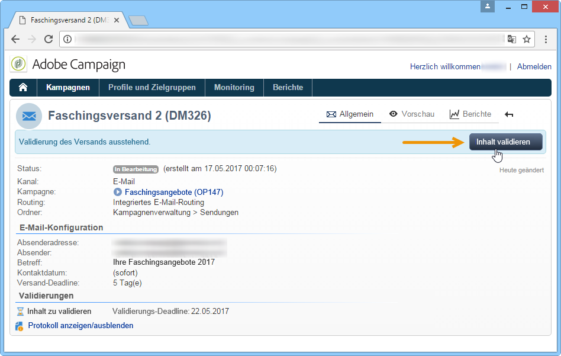

# Genehmigen von Marketingkampagnen {#approving-marketing-campaigns}

## Validierungsprozess {#approval-process}

Jede Etappe eines Versands kann zur Validierung unterbreitet werden, um eine umfassende Steuerung und Kontrolle der unterschiedlichen Kampagnenprozesse sicherzustellen. Hierzu gehören Zielbestimmung, Inhalt, Budget, Extraktion und BAT-Versand.

>[!NOTE]
>
>Sie müssen überprüfen, ob die Prüfer über die entsprechenden Rechte zur Genehmigung verfügen. Vergewissern Sie sich auch, dass ihre Sicherheitszone korrekt definiert ist.

Die als validierungsverantwortlich ernannten Adobe-Campaign-Benutzer werden per E-Mail über Validierungsanfragen benachrichtigt.

Das Genehmigungsverfahren wird bei der [Überprüfung und Genehmigung von Lieferungen](#checking-and-approving-deliveries)beschrieben.

>[!NOTE]
>
>Nur der Lieferinhaber kann eine Lieferung starten. Damit ein anderer Operator (oder eine Operatorgruppe) eine Auslieferung starten kann, müssen Sie diese als Überprüfer in das **[!UICONTROL Delivery start:]** Feld einfügen.\
>Siehe auch [Auswählen von Prüfern](#selecting-reviewers).

### Grundprinzip {#operating-principle-}

Unten stehende Abbildung zeigt beispielhaft die Standard-E-Mail, die für Budgetvalidierungen versendet wird:

Die validierungsverantwortlichen Benutzer können die Validierung der betreffenden Etappe akzeptieren oder ablehnen.

Die jeweilige Entscheidung des Validierers wird im Dashboard des Versands angezeigt.

The information is also available in the approval logs of the campaign (Accessed via the **[!UICONTROL Edit > Tracking > Approvals]** tab):

Derartige Benachrichtigungs-E-Mails werden für jeden Prozess, für den die Validierung aktiviert wurde, an den angegebenen Benutzer gesendet.

Validierungen können in Kampagnenvorlagen sowie in jeder Kampagne und jedem Versand aktiviert werden.

Alle Aufträge, für die eine Genehmigung erforderlich ist, werden in der Kampagnenvorlage ausgewählt ( **[!UICONTROL Properties]** > **[!UICONTROL Advanced campaign settings...]** > **[!UICONTROL Approvals]** Registerkarte), ebenso wie die für die Genehmigung zuständigen Operatoren (sie erhalten Benachrichtigungen, es sei denn, diese Option ist nicht aktiviert). For more on this, refer to [Approving processes](#approving-processes).

These settings can be overridden for each campaign created using this template, and individually for each campaign delivery: click the **[!UICONTROL Properties]** button, then the **[!UICONTROL Approvals]** tab.

Im nachfolgenden Beispiel wird der Inhalt des Briefpost-Versands nicht zur Validierung unterbreitet:

### Auswahl der validierungsverantwortlichen Benutzer {#selecting-reviewers}

Für jeden Genehmigungstyp werden die für die Genehmigung verantwortlichen Betreiber oder Gruppen von Betreibern aus der Dropdownliste in der Lieferung ausgewählt. Zusätzliche Operatoren können über den **[!UICONTROL Edit...]** Link hinzugefügt werden. In diesem Fenster können Sie auch den Genehmigungszeitpunkt bearbeiten.

Wenn kein Prüfer angegeben ist, ist der Kampagnenmanager für die Genehmigung verantwortlich und erhält die Benachrichtigungen. Der Kampagnenmanager wird auf der **[!UICONTROL Edit > Properties]** Registerkarte der Kampagne angegeben:

>[!NOTE]
>
>Alle über **[!UICONTROL Administrator]**-Berechtigungen verfügende Adobe-Campaign-Benutzer sind ebenfalls befugt, Prozesse zu validieren. Sie erhalten jedoch keine Benachrichtigungen.\
>Wenn validierungsverantwortliche Benutzer definiert sind, kann der kampagnenverantwortliche Benutzer standardmäßig nicht die Validierung vornehmen oder den Versand starten. Wenn Sie zulassen möchten, dass der kampagnenverantwortliche Benutzer Sendungen validieren und starten kann, geben Sie für die Option **NmsCampaign_Activate_OwnerConfirmation** den Wert **1** ein.

### Validierungsmodi {#approval-modes}

#### Validierung über das Dashboard {#approval-via-the-dashboard}

Um einen Vorgang über Konsole oder Webschnittstelle zu validieren, klicken Sie auf den entsprechenden Link im Kampagnen-Dashboard. Die Validierung kann auch über die Versandverfolgung oder das Versand-Dashboard erfolgen.

Überprüfen Sie die zu genehmigenden Informationen, entscheiden Sie, ob Sie die Genehmigung annehmen oder ablehnen möchten, und geben Sie bei Bedarf einen Kommentar ein. Klicken Sie **[!UICONTROL Ok]** zum Speichern.

>[!NOTE]
>
>Wenn ein Vorgang bereits von einem anderen Benutzer validiert wurde, ist der Validierungslink nicht mehr verfügbar.

#### Validierung über Benachrichtiguns-E-Mails {#approval-via-notification-messages}

Klicken Sie auf den Link, der in der Benachrichtigung verfügbar ist (siehe [Benachrichtigungen](#notifications)). Sie werden gebeten, sich selbst zu identifizieren, wie nachfolgend gezeigt:

Select **[!UICONTROL Accept]** or **[!UICONTROL Reject]** and enter a comment if necessary.

Klicks **[!UICONTROL Validate]**.

>[!NOTE]
>
>Wenn der Vorgang Warnungen erzeugt hat, erscheint in der Benachrichtigung ein Warnhinweis.

#### Validierungsverfolgung {#approval-tracking}

Informationen zur Validierung werden an verschiedenen Orten gespeichert:

* Im Protokoll zur Genehmigung der Kampagne, **[!UICONTROL Approvals]** Unterregisterkarte der **[!UICONTROL Edit > Tracking]** Registerkarte:

   

* Im Kampagnenbereitstellungsprotokoll, Unterregisterkarte **[!UICONTROL Deliveries]** der **[!UICONTROL Edit > Tracking]** Registerkarte:

   

* The approval status for each delivery can be viewed by clicking the **[!UICONTROL Hide/show log]** option of the **[!UICONTROL Summary]** tab.

   

* This information can also be accessed via the **[!UICONTROL Tracking > Approvals]** tab of each delivery:

   

>[!NOTE]
>
>Wenn ein Benutzer einen Vorgang akzeptiert oder abgelehnt hat, können andere Benutzer die Validierung nicht mehr bearbeiten.

#### Automatische und manuelle Validierung {#automatic-and-manual-approval}

Wenn bei der Erstellung eines Zielgruppen-Workflows die Validierung automatisch erfolgt (Standardmodus), zeigt Adobe Campaign den Validierungslink an oder sendet eine Benachrichtigung, sobald eine Validierung erforderlich ist.

To choose the approval mode (manual or automatic), click the **[!UICONTROL Edit > Properties]** tab of the campaign or campaign template, then click **[!UICONTROL Advanced campaign settings...]** and finally the **[!UICONTROL Approvals]** tab.

>[!NOTE]
>
>Der gewählte Validierungsmodus wird auf alle Sendungen der Kampagne angewandt.

Beim Erstellen eines Targeting-Workflows können Sie mit der manuellen Genehmigung vermeiden, dass Genehmigungslinks erstellt oder Benachrichtigungen automatisch gesendet werden. Das Kampagnen-Dashboard bietet dann einen **[!UICONTROL Submit targeting for approval]** Link, über den der Genehmigungsprozess manuell gestartet werden kann.

Mit einer Bestätigungsmeldung können Sie Genehmigungen für die für diese Bereitstellung ausgewählten Aufträge genehmigen.

Daraufhin werden die Validierungsschaltflächen im Dashboard der Kampagne (für diesen Versand), im Dashboard des Versands sowie in der Versandverfolgung angezeigt. Wenn die Benachrichtigungen aktiviert wurden, werden diese parallel versendet.

Diese Art der Validierungsaktivierung ermöglicht es, die Zielbestimmungsrecherchen zu bearbeiten, ohne die validierenden Benutzer fälschlicherweise zu benachrichtigen.

### Benachrichtigungen {#notifications}

Benachrichtigungen sind spezifische E-Mails, die den validierungsverantwortlichen Benutzern gesendet werden, um diese über auf Validierung wartende Prozesse zu informieren. Der in der Nachricht enthaltene Link führt zu einer Webschnittstelle, in der sich der Benutzer identifizieren muss. Nach der Anmeldung kann er die betreffenden Elemente einsehen, den Prozess validieren oder nicht und seine Entscheidung mit einem Kommentar begründen.

Der Inhalt von Benachrichtigungs-E-Mails kann personalisiert werden. Siehe [Benachrichtigungsinhalt](#notification-content).

#### Aktivierung/Deaktivierung von Benachrichtigungen {#enabling-disabling-notification}

Benachrichtigungs-E-Mails werden automatisch versendet, wenn die Validierung des entsprechenden Prozesses in der Kampagnenvorlage, der Kampagne selbst oder dem betreffenden Versand aktiviert wurde. Die Benachrichtigungen können jedoch auch deaktiviert werden, um nur Validierungen über die Konsole zu erlauben.

Bearbeiten Sie dazu das Genehmigungsfenster der Kampagne oder Kampagnenvorlage ( **[!UICONTROL Edit > Properties]** > **[!UICONTROL Advanced campaign settings...]** > **[!UICONTROL Approvals]** Registerkarte) und wählen Sie **[!UICONTROL Do not enable notification sending]**.

#### Inhalt der Benachrichtigungen {#notification-content}

Benachrichtigungsinhalte werden in einer bestimmten Vorlage definiert: **[!UICONTROL Notification of validations for the marketing campaign]**. Diese Vorlage wird im **[!UICONTROL Administration > Campaign management > Technical delivery templates]** Ordner der Adobe Campaign-Struktur gespeichert.

## Kontrolle und Validierung von Sendungen {#checking-and-approving-deliveries}

Mit Adobe Campaign können Sie Genehmigungsprozesse für die Hauptphasen der Marketingkampagne im kollaborativen Modus einrichten.

Bei Direktversand können Adobe Campaign-Operatoren die Extraktionsdatei vor dem Versand an den Router anzeigen und bei Bedarf das Format ändern und die Extraktion erneut starten. See [Approving an extraction file](#approving-an-extraction-file).

Für jede Kampagne können Sie das Bereitstellungsziel, den Inhalt (siehe [Genehmigen von Inhalten](#approving-content)) und die Kosten genehmigen. Die für die Genehmigung zuständigen Adobe Campaign-Betreiber können per E-Mail benachrichtigt werden und eine Genehmigung von der Konsole oder über eine Webverbindung akzeptieren oder ablehnen. Siehe [Genehmigen von Prozessen](#approving-processes).

Nach Abschluss dieser Prüfphasen kann die Bereitstellung gestartet werden. Siehe [Starten einer Bereitstellung](../../campaign/using/marketing-campaign-deliveries.md#starting-a-delivery).

>[!NOTE]
>
>For further information about approval modes and tracking, see [Approval process](#approval-process).

### Vorgänge validieren {#approving-processes}

Die Phasen, für die eine Genehmigung erforderlich ist, werden im Kampagnen-Dashboard (über die Konsole der Weboberfläche) angezeigt. Sie werden auch in der Tabelle für die Lieferverfolgung und im Dashboard für die Bereitstellung angezeigt.

At this point, the status of the campaign is **[!UICONTROL To validate]**.

>[!NOTE]
>
>* Um die Prozesse auszuwählen, für die eine Genehmigung erforderlich ist, ändern Sie die Kampagnenvorlage. For more on this, refer to [Campaign templates](../../campaign/using/marketing-campaign-templates.md#campaign-templates).
   >
   >
* Also refer to the section on the [Approval process](#approval-process).

>[!NOTE]
>
>Wenn in einem Targeting-Arbeitsablauf während der Nachrichtenvorbereitung ein Fehler im Zusammenhang mit einem Konfigurationsproblem auftritt, wird der **[!UICONTROL Restart message preparation]** Link im Dashboard angezeigt. Korrigieren Sie den Fehler und klicken Sie auf diesen Link, um die Nachrichtenvorbereitung unter Umgehung der Targeting-Phase neu zu starten.

Folgende Validierungsvorgänge stehen für Kampagnensendungen zur Verfügung:

* **Validierung von Zielgruppe, Inhalt und Budget**

   Wenn die **[!UICONTROL Enable target approval]**- **[!UICONTROL Enable content approval]** oder **[!UICONTROL Enable budget approval]** -Optionen im Fenster mit den Auftragsbestätigungseinstellungen ausgewählt sind, werden die entsprechenden Links im Kampagnen-Dashboard für die betreffenden Auslieferungen angezeigt.

   >[!NOTE]
   >
   >Die Budgetvalidierung ist nur verfügbar, wenn die Zielgruppenvalidierung im Fenster der Validierungseinstellungen aktiviert wurde. Der Link zur Budgetvalidierung wird erst nach der Zielgruppenanalyse und zur gleichen Zeit wie der Link zur Zielgruppenvalidierung angezeigt.

   Wenn die **[!UICONTROL Assign content editing]** bzw. **[!UICONTROL External content approval]** Optionen im Fenster mit den Genehmigungseinstellungen ausgewählt sind, zeigt das Dashboard die Links **[!UICONTROL Available content]** und **[!UICONTROL External content approval]** Links an.

   Die Inhaltsvaldiierung ermöglicht den Zugriff auf die durchgeführtenTestsendungen.

* **Validierung der Extraktion (Briefpost)**

   When **[!UICONTROL Enable extraction approval]** is selected in the approval settings window, the extracted file must be approved before the router can be notified.

   An **[!UICONTROL Approve content]** link is available on the campaign dashboard as shown below:

   

   Über das Validierungsfenster kann eine Vorschau der Extraktionsdatei angesehen und die Validierung akzeptiert oder abgelehnt werden.

   

   >[!NOTE]
   >
   >Die Vorschau der Extraktionsdatei basiert nur auf einer Datenstichprobe. Sie lädt nicht die gesamte Ausgabedatei.

* **Validierung der Sendungen**

   Die **[!UICONTROL Enable individual approval of each associated delivery]** Option wird für eine Hauptlieferung verwendet, die mit Nebenlieferungen verbunden ist. Standardmäßig ist diese Option nicht ausgewählt, sodass eine Gesamtgenehmigung der Hauptauslieferung durchgeführt werden kann. Wenn diese Option aktiviert ist, muss jede Lieferung einzeln genehmigt werden.

   

#### Auswahl der zu genehmigenden Prozesse {#choosing-the-processes-to-be-approved}

Die Genehmigungsphasen werden mit der der Kampagne zugeordneten Vorlage definiert. Sie müssen die Elemente auswählen, die in der Vorlage genehmigt werden sollen, und die Adobe Campaign-Operatoren angeben, die für diese Genehmigungen verantwortlich sind. For more on this, refer to [Campaign templates](../../campaign/using/marketing-campaign-templates.md#campaign-templates).

>[!NOTE]
>
>Die Validierungskonfiguration der Kampagne oder der Kampagnenvorlage gilt für alle zukünftigen Sendungen der jeweiligen Kampagne. Veränderungen der Konfiguration werden nicht auf vorhergehende Sendungen angewandt.

Die Einstellungen können jedoch für jede Kampagne und jeden Versand überschrieben werden.

For a campaign, click the **[!UICONTROL Edit > Properties]** tab, then the **[!UICONTROL Advanced campaign settings...]** link, and finally the **[!UICONTROL Approvals]** sub-tab to access the approvals configuration page.

Hier können Sie die zu validierenden Vorgänge aus- und abwählen sowie die für die Validierung verantwortlichen Adobe-Campaign-Benutzer bestimmen. Es kann sich hierbei um einzelne Benutzer, Benutzergruppen oder eine Liste von Benutzern handeln.

To select a list of operators, click the **[!UICONTROL Edit...]** link to the right of the field designating the first reviewer and add as many operators as necessary, as shown below:

>[!NOTE]
>
>* Bei Auswahl einer Liste von Validierungsverantwortlichen wird der Vorgang validiert, sobald einer der Benutzer der Liste diesen akzeptiert hat. Der entsprechende Validierungslink wird dann nicht mehr im Dashboard angezeigt. Wenn der Benachrichtigungsversand aktiviert ist und ein anderer Validierer daraufhin auf den Validierungslink in der Benachrichtigung klickt, so wird diesem gemeldet, dass der Vorgang bereits von einem anderen Benutzer validiert wurde.
>* Im unteren Abschnitt des Fensters der Validierungseinstellungen kann eine Validierungsplanung für die jeweilige Kampagne festgelegt werden. Standardmäßig haben Validierungsverantwortliche nach dem Unterbreitungsdatum 3 Tage Zeit, um einen Vorgang zu validieren.
>* Es besteht die Möglichkeit, den betreffenden Benutzern vor dem Ende der Validierungsfrist eine automatische Erinnerung zu senden.
>

For each delivery, click the **[!UICONTROL Audit]** button and the **[!UICONTROL Approvals]** tab to view and edit approval dates and automatic reminders.

>[!NOTE]
>
>Dieser Tab wird mit dem Beginn der Inhaltsvalidierung verfügbar.

### Inhalt validieren {#approving-content}

>[!CAUTION]
>
>Um Inhalt zu validieren, muss ein Testversand durchgeführt werden. Dieser ermöglicht die Validierung von Anzeige, Layout und Personalisierungsdaten sowie die Überprüfung der Links. Nähere Informationen über die Erstellung eines Testversands und seinen Lebenszyklus finden Sie im Abschnitt [Nachrichten senden](../../delivery/using/steps-validating-the-delivery.md#sending-a-proof).
>
>Die im Folgenden beschriebenen Funktionen sind lediglich als die Testsendungen ergänzend zu betrachten.

Es ist möglich, einen Genehmigungszyklus für Inhalte zu konfigurieren. Wählen Sie dazu die **[!UICONTROL Enable content approval]** Option im Fenster mit den Genehmigungseinstellungen. Die wichtigsten Schritte des Genehmigungszyklus für Inhalte sind:

1. After creating a new delivery, the campaign manager clicks the **[!UICONTROL Submit content]** link on the campaign dashboard to start the content approval cycle.

   

   >[!NOTE]
   >
   >Wenn die **[!UICONTROL Enable the sending of proofs]** Option (für E-Mail-Auslieferungen) oder **[!UICONTROL Enable the sending and approval of proofs]** (für Direktversand-Sendungen) im Fenster mit den Genehmigungseinstellungen ausgewählt wurde, werden die Nachweise automatisch gesendet.

1. Der Inhaltsverantwortliche wird daraufhin per E-Mail benachrichtigt und entscheidet, ob der den Inhalt validiert oder nicht:

   * über die Benachrichtigungs-E-Mail:

      

      >[!NOTE]
      >
      >Die Benachrichtigungs-E-Mail enthält einen Link zu den erfolgten Testsendungen und zur Nachrichtendarstellung nach E-Mail-Anbieter (Inbox Rendering), sofern die Option **Delivrability** in dieser Instanz aktiviert wurde.

   * über die Konsole oder die Webschnittstelle, in der Versandverfolgung oder dem Kampagnen- oder Versand-Dashboard:

      

      >[!NOTE]
      >
      >Mit diesem Kampagnen-Dashboard können Sie die Liste der gesendeten Beweise anzeigen, indem Sie auf den **[!UICONTROL Inbox rendering...]** Link klicken. Klicken Sie zum Anzeigen des Inhalts auf das **[!UICONTROL Detail]** Symbol rechts neben der Liste.

      

1. An die für die Kampagne verantwortliche Person wird eine Benachrichtigungs-E-Mail gesendet, in der sie darüber informiert wird, ob der Inhalt genehmigt wurde.

   >[!NOTE]
   >
   >Die für die Kampagne verantwortliche Person kann den Inhaltsgenehmigungszyklus jederzeit neu starten. Klicken Sie dazu auf den Link in der **[!UICONTROL Content status]** Zeile des Kampagnen-Dashboards (auf Bereitstellungsebene) und klicken Sie dann auf **[!UICONTROL Reset content approval to submit it again]**.

   

#### Inhaltsbearbeitung zuweisen {#assign-content-editing}

Mit dieser Option können Sie eine Person definieren, die für die Bearbeitung von Inhalten zuständig ist, z. B. einen Webmaster. Wenn die **[!UICONTROL Assign content editing]** Option im Fenster mit den Genehmigungseinstellungen ausgewählt ist, werden zwischen der Erstellung der Zustellung und der Übermittlung der Benachrichtigungs-E-Mail an die für den Inhalt zuständige Person mehrere Genehmigungsschritte hinzugefügt:

1. After creating a new delivery, the person responsible for the campaign clicks the **[!UICONTROL Submit content editing]** link in the campaign dashboard to start the content editing cycle.

   

1. Der Verantwortliche der Inhaltsbearbeitung erhält daraufhin eine E-Mail, die ihn über die Inhaltsfreigabe informiert.

   

1. Er kann sich dann mit der Konsole verbinden, um den Versand zu öffnen und diesen mittels eines vereinfachten Assistenten zu bearbeiten, der die Änderung des Betreffs, der HTML- und Textinhalte sowie die Durchführung von Testsendungen ermöglicht.

   

   >[!NOTE]
   >
   >Wenn die **[!UICONTROL Enable the sending of proofs]** Option (für E-Mail-Auslieferungen) oder **[!UICONTROL Enable the sending and approval of proofs]** (für Direktversand-Sendungen) im Fenster mit den Genehmigungseinstellungen ausgewählt wurde, werden die Nachweise automatisch gesendet.

1. Nach Beendigung der Bearbeitung kann der Verantwortliche der Inhaltsbearbeitung den Inhalt zur Verfügung stellen.

   Hierfür hat er folgende Möglichkeiten:

   * click the **[!UICONTROL Available content]** link via the Adobe Campaign console.

      

   * Klick auf den in der Benachrichtigungs-E-Mail enthaltenen Link und Validierung der Inhaltsfreigabe.

      

      Der Benutzer kann der Validierung einen Kommentar hinzufügen, bevor er den Inhalt dem Kampagnenverantwortlichen unterbreitet.

      

      Über die Benachrichtigungs-E-Mail kann der Kampagnenverantwortliche den ihm unterbreiteten Inhalt akzeptieren oder ablehnen.

      

#### Externe Inhaltsvalidierung {#external-content-approval}

Mit dieser Option können Sie einen externen Operator definieren, der für die Genehmigung der Wiedergabe zuständig ist, z. B. Konsistenz der Markenkommunikation, Preise usw. Wenn die **[!UICONTROL External content approval]** Option im Fenster mit den Genehmigungseinstellungen ausgewählt ist, werden zwischen der Inhaltsgenehmigung und der Übermittlung der Benachrichtigung an die für die Kampagne verantwortliche Person mehrere Genehmigungsschritte hinzugefügt:

1. Der externe Inhaltsverantwortliche wird per E-Mail benachrichtigt, sobald der Inhalt intern validiert wurde und die externe Validierung erfolgen muss.
1. Die Benachrichtigungs-E-Mail enthält Links zu den Testsendungen, die der Überprüfung der Darstellung des Versandinhalts dienen, und eine Schaltfläche, über die der Versandinhalt validiert oder abgelehnt werden kann.

   >[!NOTE]
   >
   >Diese Links sind nur verfügbar, wenn eine oder mehrere Testsendungen durchgeführt wurden. Die Darstellung des Versandinhalts kann andernfalls nur über die Konsole oder die Webschnittstelle überprüft werden.

   

### Extraktionsdatei validieren {#approving-an-extraction-file}

Für Offline-Sendungen erzeugt Adobe Campaign eine Extraktionsdatei, die, je nach Konfiguration, dem Router übermittelt wird. Der Inhalt der Datei hängt von der verwendeten Exportvorlage ab.

When the content, targeting and budget have been approved, the delivery changes to **[!UICONTROL Extraction pending]** until the extraction workflow for the campaigns is launched.

On the extraction request date, the extraction file is created and the delivery status changes to **[!UICONTROL File to approve]**.

Sie können den Inhalt der Extraktionsdatei ansehen, indem Sie auf ihren Titel klicken. Über die verschiedenen Links im Dashboard haben Sie zudem die Möglichkeit, die Datei zu validieren oder bei Bedarf ihr Format zu verändern und die Extraktion erneut durchzuführen.

Nachdem die Datei genehmigt wurde, können Sie die Benachrichtigungs-E-Mail an den Router senden. Weitere Informationen finden Sie unter [Offline-Bereitstellung](../../campaign/using/marketing-campaign-deliveries.md#starting-an-offline-delivery)starten.
