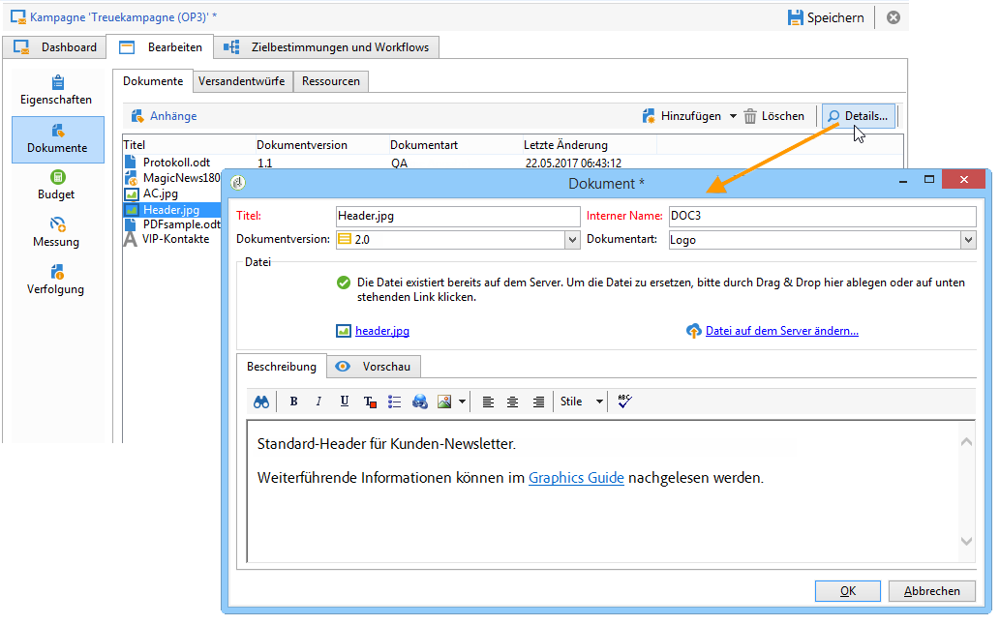
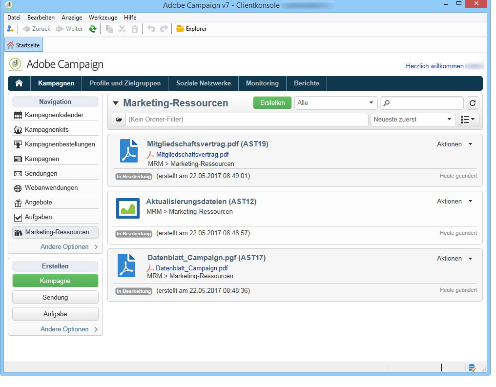
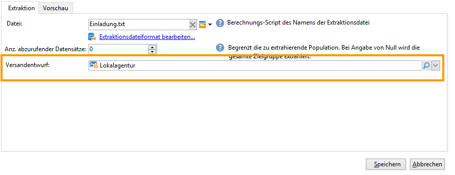

# Verwalten der zugehörigen Dokumente {#managing-associated-documents}

Sie können einer Kampagne verschiedene Dokumente zuordnen: Berichte, Fotos, Webseiten, Diagramme usw. Diese Dokumente können in jedem beliebigen Format vorliegen (Microsoft Word, PowerPoint, PNG, JPG, Acrobat PDF usw.).

>[!IMPORTANT]
>
>Diese Funktion ist für kleine Assets und Dokumente vorgesehen.

In einer Kampagne können Sie auch auf andere Elemente verweisen, wie z. B. Werbegutscheine oder Sonderangebote in Bezug auf eine bestimmte Marke oder ein bestimmtes Geschäft usw. Wenn diese Elemente in einem Entwurf enthalten sind, können sie einem Briefpost-Versand zugeordnet werden. Lesen Sie diesbezüglich [Ressourcen in einem Versandentwurf verknüpfen](#associating-and-structuring-resources-linked-via-a-delivery-outline).

>[!NOTE]
>
>Das Marketing Resource Management-Modul von Campaign ermöglicht Ihnen zudem die Verwaltung einer Ressourcenbibliothek, in der mehrere Benutzer zusammenarbeiten können. [Weitere Informationen](../../campaign/using/managing-marketing-resources.md).

## Dokumente hinzufügen {#adding-documents}

Dokumente können einer Kampagne (kontextrelevante Dokumente) oder einem Programm (allgemeine Dokumente) zugeordnet werden.

Der Tab **[!UICONTROL Dokumente]** enthält:

* die Liste aller für den Inhalt notwendigen Dokumente (Vorlagen, Bilder usw.), die von berechtigten Adobe-Campaign-Benutzern lokal heruntergeladen werden können;
* Informationen für den Router enthaltende Dokumente, wenn vorhanden.

Die Dokumente werden über den Tab **[!UICONTROL Bearbeiten > Dokumente]** einem Programm oder einer Kampagne zugeordnet.

Es besteht darüber hinaus die Möglichkeit, Dokumente über einen im Dashboard angebotenen Link einer Kampagne zuzuordnen.

Klicken Sie auf das Symbol **[!UICONTROL Details]**, um den Inhalt einer Datei anzusehen und ergänzende Informationen hinzuzufügen.

Im Abschnitt **[!UICONTROL Dokument(e)]** des Kampagnen-Dashboards werden alle der Kampagne zugeordneten Dokumente aufgelistet, wie im folgenden Beispiel:

Über die Links können die Dokumente geöffnet und bearbeitet werden.

## Ressourcen in einem Versandentwurf verknüpfen {#associating-and-structuring-resources-linked-via-a-delivery-outline}

>[!NOTE]
>
>Versandentwürfe werden ausschließlich im Rahmen von Briefpost-Kampagnen verwendet.

Ein Versandentwurf kennzeichnet einen strukturierten Satz von Elementen (Dokumente, Geschäfte, Werbegutscheine usw.), der vom Unternehmen für eine bestimmte Kampagne erstellt wurde.

Diese Elemente sind in Versandentwürfen gruppiert und jedem Versandentwurf wird ein Versand zugeordnet. Auf diesen Versand wird in der an den **Dienstleister** gesendeten Extraktionsdatei verwiesen, um an den Versand angehängt zu werden. Sie können beispielsweise einen Versandentwurf erstellen, der sich auf eine Filiale und die von ihr verwendeten Marketing-Prospekte bezieht.

Versandentwürfe ermöglichen es, in Kampagnen externe Elemente zu strukturieren, die einem Versand nach bestimmten Kriterien hinzugefügt werden: zugehörige Filiale, bewilligtes Sonderangebot, Einladung zu einem lokalen Event usw.

### Erstellen eines Versandentwurfs {#creating-an-outline}

Um einen Versandentwurf zu erstellen, klicken Sie auf den Untertab **[!UICONTROL Versandentwürfe]** im Tab **[!UICONTROL Bearbeiten > Dokumente]** der betreffenden Kampagne.

>[!NOTE]
>
>Sollte dieser Tab nicht vorhanden sein, ist die Funktionalität für diese Kampagne nicht verfügbar. Überprüfen Sie in diesem Fall die Konfiguration der Kampagnenvorlage.
>   
>Weiterführende Informationen zu Vorlagen finden Sie in [diesem Abschnitt](../../campaign/using/marketing-campaign-templates.md#campaign-templates).

Klicken Sie anschließend auf **[!UICONTROL Versandentwurf hinzufügen]**. Es wird ein Navigationsbaum für die Kampagne erstellt:

1. Machen Sie einen Rechtsklick auf den Wurzelknoten und wählen Sie **[!UICONTROL Neu > Versandentwürfe]** aus, um einen neuen Versandentwurf hinzuzufügen.
1. Machen Sie einen Rechtsklick auf den soeben erstellten Versandentwurf und wählen Sie beispielsweise **[!UICONTROL Neu > Artikel]** oder **[!UICONTROL Neu > Personalisierungsfelder]** aus.

Ein Versandentwurf kann Artikel, Personalisierungsfelder, Ressourcen und Angebote enthalten:

* Artikel sind beispielsweise physische Dokumente, die an dieser Stelle referenziert und beschrieben und schließlich dem Versand angehängt werden.
* Personalisierungsfelder ermöglichen die Erstellung von mit Sendungen (und nicht Empfängern) verbundenen Personalisierungselementen. So können Werte erstellt werden, die in Sendungen mit einer spezifischen Zielgruppe verwendet werden (z. B. Willkommensangebot, prozentuale Ermäßigung). Sie werden in Adobe Campaign erstellt und über den Link **[!UICONTROL Personalisierungsfelder importieren...]** in den jeweiligen Entwurf importiert.

   

   Über das Symbol **[!UICONTROL Hinzufügen]** rechts vom Bereich der Liste können dem Entwurf auch direkt Personalisierungselemente hinzugefügt werden.

   

* Ressourcen sind Marketing-Ressourcen, auf die Sie über die Startseite durch Klicken auf die Schaltfläche **[!UICONTROL Ressourcen]** im Tab **[!UICONTROL Kampagnen]** zugreifen können.

   

   >[!NOTE]
   >
   >Weiterführende Informationen zu Marketing-Ressourcen finden Sie in [diesem Abschnitt](../../campaign/using/managing-marketing-resources.md).

### Auswählen eines Versandentwurfs {#selecting-an-outline}

Sie können für jeden Versand über den Bereich der Extraktionskonfiguration einen Entwurf auswählen, wie im folgenden Beispiel:

Der ausgewählte Entwurf wird daraufhin im unteren Abschnitt des Fenster angezeigt. Er kann über das rechts vom Feld gelegene Lupensymbol geöffnet oder über die Dropdown-Liste durch einen anderen ersetzt werden:

Diese Information wird ebenfalls im Tab **[!UICONTROL Zusammenfassung]** des Versands angezeigt:

### Extraktionsergebnis {#extraction-result}

In der dem Dienstleister übermittelten Extraktionsdatei werden der Name des Entwurfs sowie gegebenenfalls seine Eigenschaften (Kosten, Beschreibung usw.) dem Inhalt hinzugefügt, entsprechend der Informationen in der Exportvorlage, die dem Dienstleister zugeordnet wurde.

Im folgenden Beispiel werden der Titel, die Plankosten sowie die Beschreibung des dem Versand zugeordneten Entwurfs der Extraktionsdatei hinzugefügt.

Die Exportvorlage muss dem gewählten Dienstleister für den betreffenden Versand zugeordnet sein. Siehe [diesen Abschnitt](../../campaign/using/providers--stocks-and-budgets.md#creating-service-providers-and-their-cost-structures).

>[!NOTE]
>
>Weiterführende Informationen zu Exporten finden Sie in [diesem Abschnitt](../../platform/using/get-started-data-import-export.md).
