# Sendungen zur Marketing-Kampagne {#marketing-campaign-deliveries}

Sendungen können über das Dashboard einer Kampagne, einen Kampagnenworkflow oder direkt über die Übersicht der Sendungen erstellt werden.

## Sendungen erstellen {#creating-deliveries}

Um einen mit einer Kampagne verknüpften Versand zu erstellen, klicken Sie auf den Link **[!UICONTROL Versand hinzufügen]** im Dashboard der Kampagne.

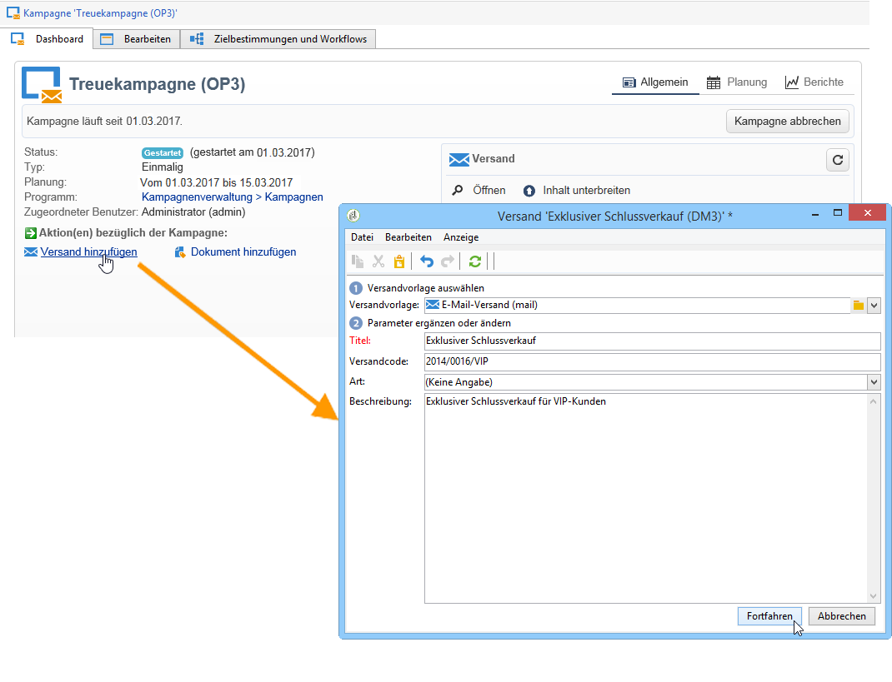

Die angebotenen Parameter werden den unterschiedlichen Versandtypen angepasst (Briefpost, E-Mail, Mobile-Kanäle, Fax oder Telefon).

>[!NOTE]
>
>Weitere Informationen zur Erstellung und Konfiguration von Sendungen finden Sie unter [Nachrichten senden](../../delivery/using/communication-channels.md).

## Zielgruppe bestimmen {#selecting-the-target-population}

Der Kampagnenverantwortliche bestimmt für jeden Versand

* die Hauptzielgruppe. Weiterführende Informationen finden Sie unter [Erstellen einer Hauptzielgruppe im Workflow](#building-the-main-target-in-a-workflow) und [Zielgruppe bestimmen](#selecting-the-target-population).
* die Kontrollgruppe. Weiterführende Informationen finden Sie unter [Bestimmen einer Kontrollgruppe](#defining-a-control-group).
* die Testadressen. Weiterführende Informationen hierzu finden Sie in [diesem Abschnitt](../../delivery/using/about-seed-addresses.md).

Einige dieser Parameter werden bereits durch die Kampagnenvorlage festgelegt.

>[!NOTE]
>
>Kampagnenvorlagen werden in [Kampagnenvorlagen](../../campaign/using/marketing-campaign-templates.md#campaign-templates) dargestellt.

Zur Bestimmung einer Versand-Zielgruppe können Sie die in Ihrer Datenbank enthaltenen Empfänger mithilfe von Kriterien filtern. Dieser Auswahlmodus wird im Abschnitt [Nachrichten senden](../../delivery/using/steps-defining-the-target-population.md) beschrieben.

### Beispiel: Versand an eine Gruppe von Empfängern {#example--delivering-to-a-group-of-recipients}

Sie haben die Möglichkeit, eine Population in eine Liste zu importieren und diese Liste als Zielgruppe eines Versands zu verwenden.

1. Öffnen Sie hierzu den betreffenden Versand und klicken Sie auf den Link **[!UICONTROL An]**, um die Zielpopulation zu ändern.

1. Markieren Sie im Tab **[!UICONTROL Hauptzielgruppe]** die Option **[!UICONTROL Von der Datenbank ausgehend bestimmt]** und klicken Sie auf **[!UICONTROL Hinzufügen]**, um Empfänger auszuwählen.

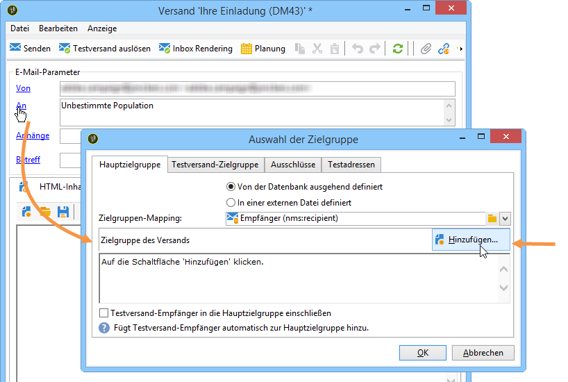

1. Markieren Sie den Zielgruppentyp **[!UICONTROL Empfängerliste]** und klicken Sie auf **[!UICONTROL Weiter]**, um die Liste auszuwählen, die die gewünschten Emfpänger enthält. Klicken Sie zum Abschluss auf .

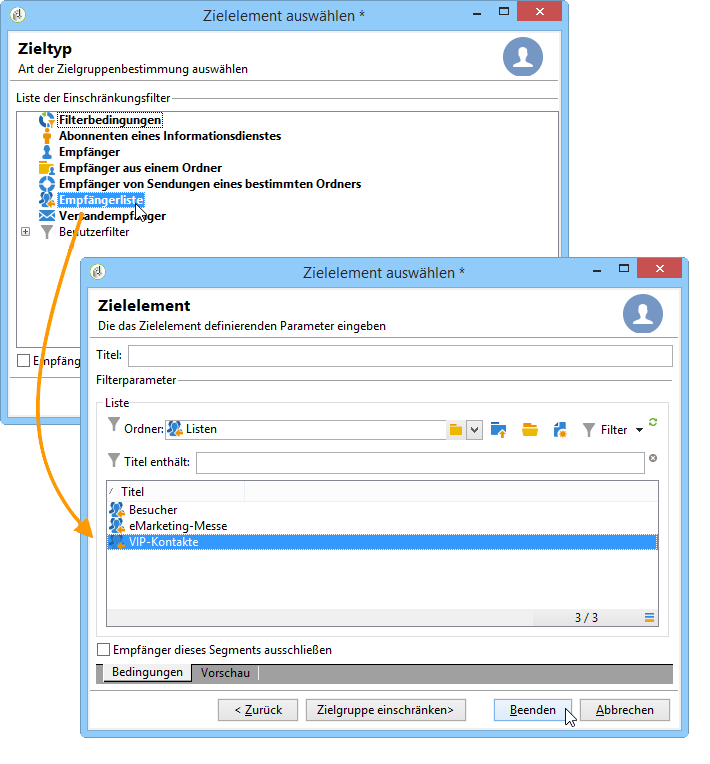

### Erstellen einer Hauptzielgruppe im Workflow {#building-the-main-target-in-a-workflow}

Die Hauptzielgruppe eines Versands kann auch über einen Zielgruppen-Workflow bestimmt werden: Die grafische Umgebung ermöglicht die Erstellung einer Zielgruppe mithilfe von Abfragen, Tests und Aktivitäten wie Vereinigungen, Deduplizierungen, Aufspaltungen usw.

Eine detaillierte Beschreibung der Funktionsweise des Workflow-Moduls erhalten Sie im Handbuch [Automatisierung mithilfe von Workflows](../../workflow/using/executing-a-workflow.md#architecture).

>[!IMPORTANT]
>
>Für dieselbe Kampagne können maximal 28 Workflows eingerichtet werden. Zusätzliche Workflows sind in der Benutzeroberfläche nicht sichtbar und können Fehler verursachen.

#### Erstellen eines Zielgruppen-Workflows {#creating-a-targeting-workflow}

Die Zielgruppenbestimmung kann mithilfe einer Kombination von Filterkriterien erfolgen, die in einem Workflow grafisch verdeutlicht wird. So ist es möglich, je nach Bedarf Gruppen oder Untergruppen zu erstellen und als Zielpopulation zu verwenden. Klicken Sie zum Öffnen des Workflow-Editors auf den Tab **[!UICONTROL Zielbestimmungen und Workflows]** der entsprechenden Kampagne.

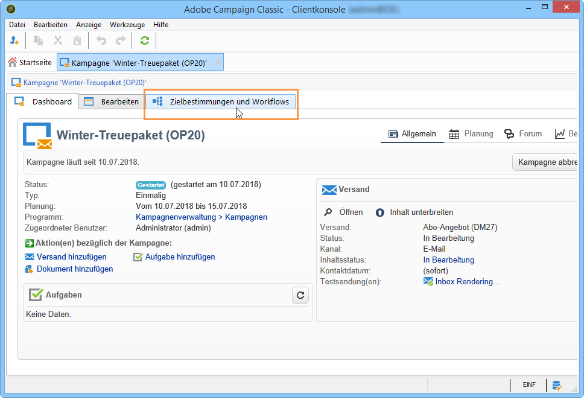

Die Zielpopulation wird über eine oder mehrere in einem Workflow platzierte Abfragen aus der Adobe-Campaign-Datenbank extrahiert. Weiterführende Informationen zum Erstellen einer Abfrage finden Sie in [diesem Abschnitt](../../workflow/using/query.md).

Sie können Abfragen starten und die resultierenden Populationen über Aktivitäten wie Vereinigung, Schnittmenge, Aufspaltung, Ausschluss weiter einschränken oder vergrößern.

Wählen Sie die gewünschten Aktivitäten aus den links vom Arbeitsbereich liegenden Menüs aus und reihen Sie diese aneinander, um die Zielgruppe zu erstellen.

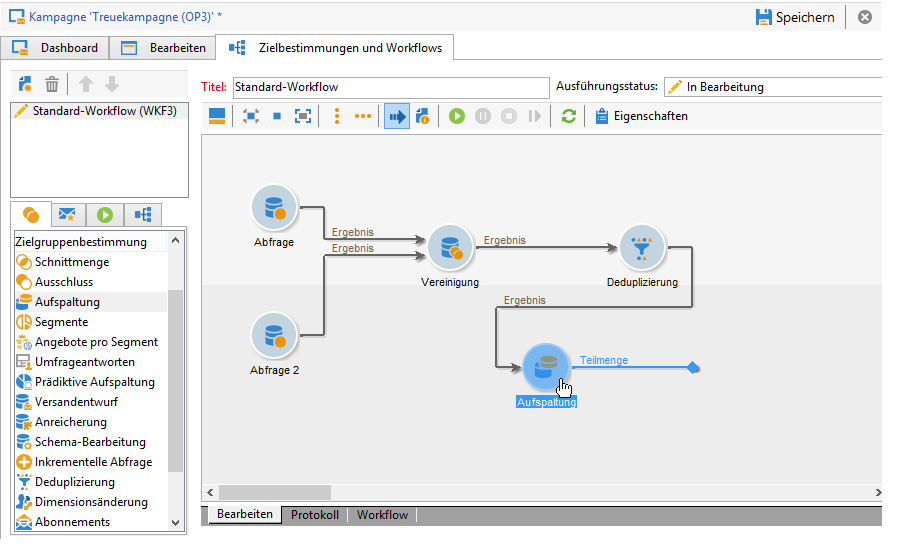

Verbinden Sie die zur Zielgruppenerstellung notwendigen Zielbestimmungs- und Steuerungsaktivitäten im Diagramm miteinander: Sie können die Zielgruppenbestimmung bereits während ihrer Erstellung ausführen, um die aus der Datenbank extrahierte Population zu überprüfen.

>[!NOTE]
>
>Beispiele und Anleitungen zum Definieren von Abfragen finden Sie in [diesem Abschnitt](../../workflow/using/query.md).

Im linken Bereich des Editors befindet sich eine Bibliothek grafischer Objekte, die Aktivitäten repräsentieren. Der erste Tab enthält Aktivitäten zur Zielgruppenbestimmung, der zweite Aktivitäten zur Steuerung. Letztere werden gelegentlich zur Koordinierung der Zielgruppenbestimmungs-Aktivitäten verwendet.

Über die Symbolleiste des Workflow-Editors besteht Zugriff auf Funktionen zur Formatierung und Ausführung des Zielgruppen-Workflows.

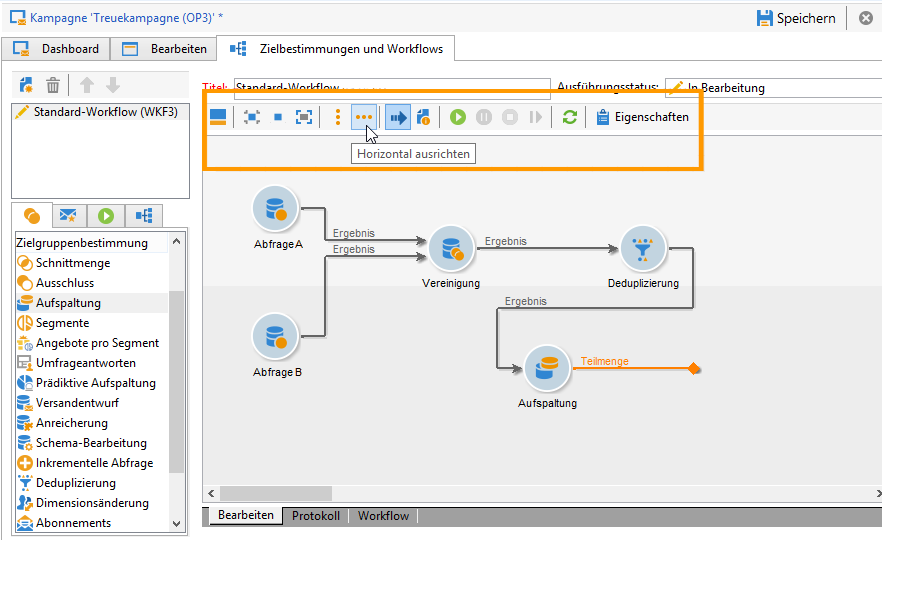

>[!NOTE]
>
>Die zur Erstellung des Workflow-Diagramms verfügbaren Aktivitäten sowie alle Anzeige- und Layoutfunktionalitäten werden im Handbuch [Automatisierung mithilfe von Workflows](../../workflow/using/executing-a-workflow.md#architecture) dargestellt.

Es besteht die Möglichkeit, mehrere Zielgruppen-Workflows für eine einzelne Kampagne zu erstellen. Gehen Sie wie folgt vor, um einen Workflow hinzuzufügen:

1. Positionieren Sie den Mauszeiger im linken oberen Abschnitt des Workflow-Editors, machen Sie einen Rechtsklick und wählen Sie **[!UICONTROL Hinzufügen]** aus. Sie können auch die Schaltfläche **[!UICONTROL Neu]** oberhalb dieses Bereichs nutzen.

   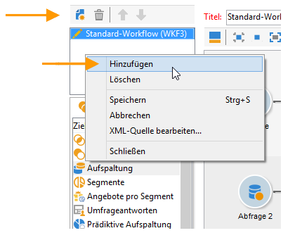

1. Wählen Sie die Workflow-Vorlage **[!UICONTROL Neuer Workflow]** aus und benennen Sie den Workflow.
1. Klicken Sie auf **[!UICONTROL OK]**, um die Workflow-Erstellung zu bestätigen, und entwerfen Sie das Diagramm des Workflows.

#### Workflow ausführen {#executing-a-workflow}

Benutzer mit entsprechenden Berechtigungen können Zielgruppen-Workflows manuell über die Schaltfläche **[!UICONTROL Starten]** in der Symbolleiste ausführen.

Die Zielgruppenbestimmung kann so konfiguriert werden, dass sie entsprechend einer Planungsaktivität (Planungsassistent) oder abhängig von einem Ereignis (externes Signal, Dateiimport usw.) automatisch ausgeführt wird.

Bei Aktionen bezüglich der Ausführung des Zielgruppen-Workflows (Start, Stopp, Pause etc.) handelt es sich um **asynchrone** Prozesse: Der jeweilige Befehl wird gespeichert und wird ausgeführt, sobald der Server verfügbar ist.

Über die Symbolleiste hingegen kann die Ausführung des Zielgruppen-Workflows unmittelbar gesteuert werden.

* Starten oder neu starten

   * Bei Klick auf das Symbol **[!UICONTROL Starten]** werden alle Aktivitäten des Zielgruppen-Workflows aktiviert, die über keine eingehende Verbindung verfügen (außer Sprünge vom Typ &quot;Ziel&quot;).

      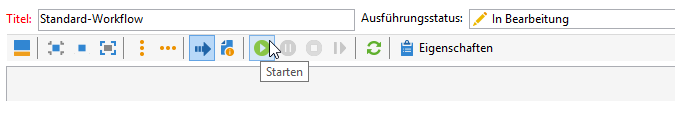

      Die Anfrage wird vom Server erfasst, was sich im Ausführungsstatus widerspiegelt:

      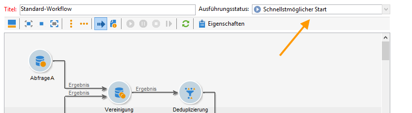

      Anschließend wechselt der Prozessstatus auf **[!UICONTROL Gestartet]**.

   * Sie können den Zielgruppen-Workflow über das entsprechende Symbol der Menüleiste neu starten. Dieser Befehl kann besonders dann nützlich sein, wenn das Symbol **[!UICONTROL Starten]** nicht verfügbar ist, beispielsweise wenn der Workflow gerade angehalten wird. Klicken Sie in diesem Fall auf das Symbol **[!UICONTROL Neu starten]**, um den Neustart vorzuziehen. Diese Anfrage wird daraufhin vom Server erfasst, wie am Ausführungsstatus zu erkennen ist:

      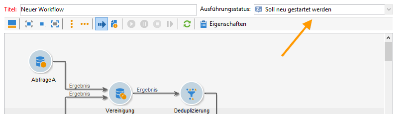

      Anschließend wechselt der Prozessstatus auf **[!UICONTROL Gestartet]**.

* Anhalten oder aussetzen

   * Über die Symbolleiste kann die Ausführung des Zielgruppen-Workflows angehalten oder ausgesetzt werden.

      Bei Klick auf das Symbol **[!UICONTROL Aussetzen]** werden laufende Prozesse **[!UICONTROL nicht]** abgebrochen, es wird jedoch bis zur Wiederaufnahme keine andere Aktivität gestartet.

      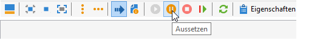

      Die Anfrage wird vom Server erfasst und vom Ausführungsstatus angezeigt:

      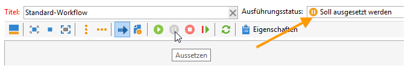

      Ein Zielgruppen-Workflow kann auch automatisch ausgesetzt werden, wenn die Ausführung eine bestimmte Aktivität erreicht: Machen Sie hierzu einen Rechtsklick auf die Aktivität, ab der der Workflow ausgesetzt werden soll, und klicken Sie auf **[!UICONTROL Aktivieren, aber nicht ausführen]**.

      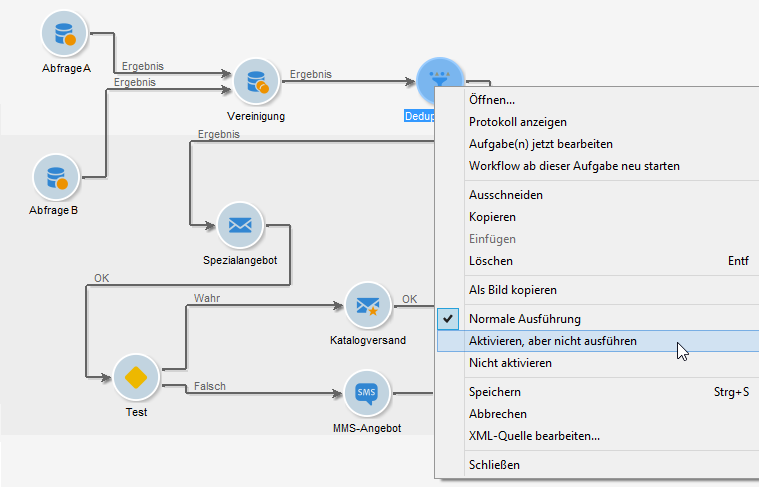

      Die Konfiguration wird von einem spezifischen Symbol in der Grafik repräsentiert.

      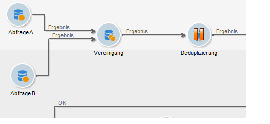

      >[!NOTE]
      >
      >Diese Option erweist sich insbesondere in Entwurfs- und Testphasen einer Zielbestimmung als nützlich.

      Klicken Sie auf **[!UICONTROL Starten]**, um die Ausführung wieder aufzunehmen.

   * Klicken Sie auf das Symbol **[!UICONTROL Anhalten]**, um die Ausführung zu stoppen.

      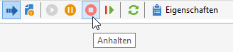

      Die Anfrage wird vom Server erfasst und vom Ausführungsstatus angezeigt:

      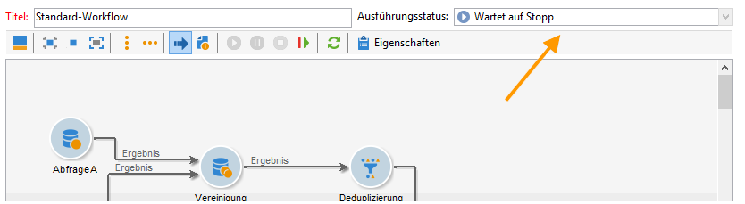
   Ein Zielgruppen-Workflow kann auch automatisch angehalten werden, wenn die Ausführung eine bestimmte Aktivität erreicht: Machen Sie hierzu einen Rechtsklick auf die Aktivität, ab der der Workflow angehalten werden soll, und klicken Sie auf **[!UICONTROL Nicht aktivieren]**.

   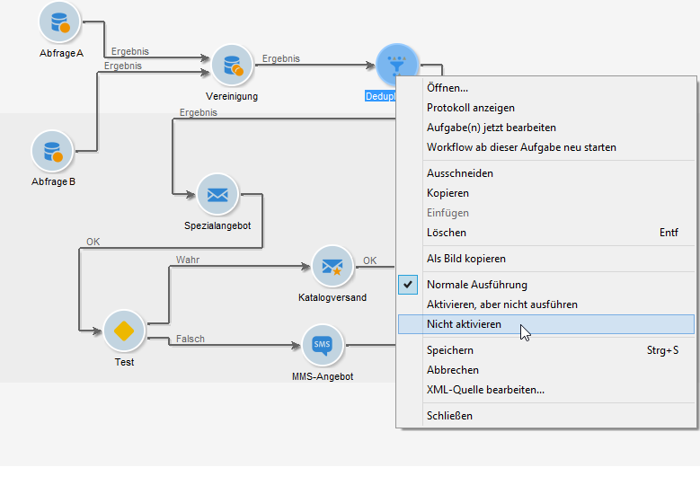

   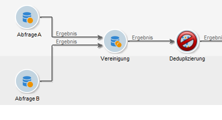

   Die Konfiguration wird von einem spezifischen Symbol in der Grafik repräsentiert.

   >[!NOTE]
   >
   >Diese Option erweist sich insbesondere in Entwurfs- und Testphasen einer Zielbestimmung als nützlich.

* Unbedingter Stopp

   Wählen Sie im Explorer **[!UICONTROL Administration > Betreibung > Automatisch erstellte Objekte > Kampagnen-Workflows]** aus, um auf einen beliebigen Campaign-Workflow zuzugreifen und diesen zu steuern.

   Sie können Ihren Workflow stoppen, indem Sie das Symbol **[!UICONTROL Aktionen]** und danach **[!UICONTROL Unbedingter Stopp]** auswählen. Damit wird Ihr Kampagnen-Workflow sofort angehalten.

   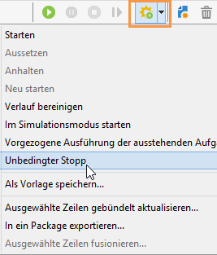

### Bestimmen einer Kontrollgruppe {#defining-a-control-group}

Bei der Kontrollgruppe handelt es sich um eine Population, die den Versand nicht erhält. Sie erlaubt es, Verhaltensunterschiede im Vergleich zu den Empfängern der Zielgruppe, die den Versand erhält, und somit die Auswirkungen einer Kampagne zu messen.

Die Kontrollgruppe kann aus der Hauptzielgruppe extrahiert werden und/oder aus einer speziellen Abfrage hervorgehen.

#### Aktivieren der Kontrollgruppe für eine Kampagne {#activating-the-control-group-for-a-campaign}

Sie können eine Kontrollgruppe auf Kampagnenebene erstellen: In letzterem Fall wird die erstellte Kontrollgruppe für alle Sendungen der betreffenden Kampagne angewandt.

1. Bearbeiten Sie die betreffende Kampagne; klicken Sie dazu auf den Tab **[!UICONTROL Bearbeiten]**.
1. Klicken Sie auf **[!UICONTROL Erweiterte Kampagnenparameter]**.

   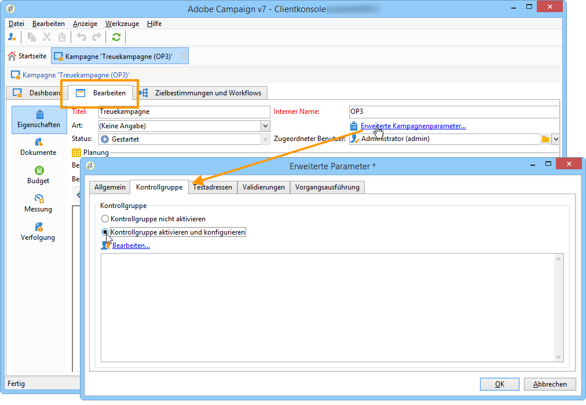

1. Wählen Sie die Option **[!UICONTROL Kontrollgruppe aktivieren und konfigurieren]**.
1. Klicken Sie auf **[!UICONTROL Bearbeiten...]**, um die Kontrollgruppe zu konfigurieren.

   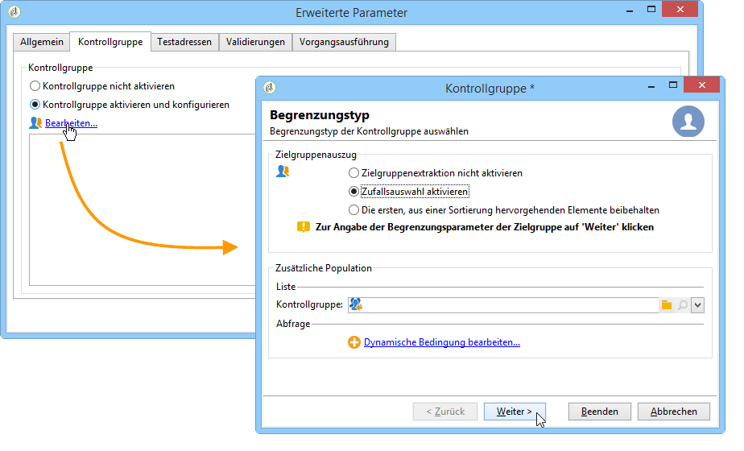

Das Konfigurationsverfahren wird unter [Extraktion der Kontrollgruppe aus der Hauptzielgruppe](#extracting-the-control-group-from-the-main-target) und [Hinzufügen einer zusätzlichen Population](#adding-a-population) beschrieben.

#### Aktivieren der Kontrollgruppe für einen Versand {#activating-the-control-group-for-a-delivery}

Sie können eine Kontrollgruppe auf Versandebene erstellen: In letzterem Fall wird die erstellte Kontrollgruppe für alle Sendungen der betreffenden Kampagne angewandt.

Die in einer Kampagne vorgenommene Konfiguration einer Kontrollgruppe gilt standardmäßig für jeden Versand dieser Kampagne. Sie kann jedoch für einzelne Sendungen angepasst werden.

>[!NOTE]
>
>Wenn Sie eine Kontrollgruppe für eine Kampagne bestimmt haben und eine andere für einen Versand dieser Kampagne konfigurieren, so wird nur die für den Versand bestimmte Kontrollgruppe angewandt.

1. Bearbeiten Sie den betreffenden Versand und klicken Sie auf den Link **[!UICONTROL An]** des Abschnitts **[!UICONTROL E-Mail-Parameter]**.

   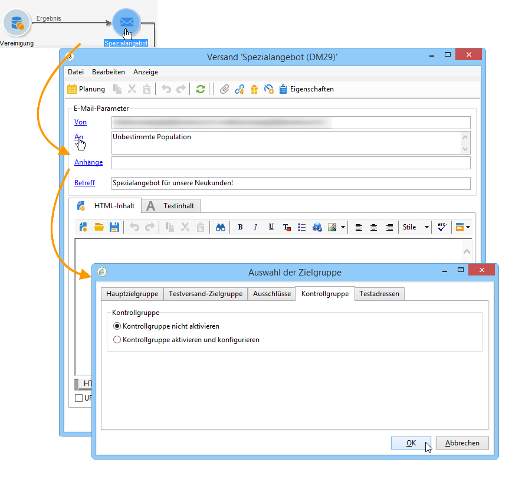

1. Klicken Sie auf den Tab **[!UICONTROL Kontrollgruppe]** und wählen Sie dann **[!UICONTROL Kontrollgruppe aktivieren und konfigurieren]**.
1. Klicken Sie auf **[!UICONTROL Bearbeiten...]**, um die Kontrollgruppe zu konfigurieren.

Das Konfigurationsverfahren wird unter [Extraktion der Kontrollgruppe aus der Hauptzielgruppe](#extracting-the-control-group-from-the-main-target) und [Hinzufügen einer zusätzlichen Population](#adding-a-population) beschrieben.

#### Extraktion der Kontrollgruppe aus der Hauptzielgruppe {#extracting-the-control-group-from-the-main-target}

Sie haben die Möglichkeit, Empfänger der Hauptzielgruppe eines Versands zu extrahieren: Die Empfänger werden in diesem Fall von der Zielgruppe der von dieser Konfiguration betroffenen Versandaktionen abgezogen. Diese Extraktion kann zufällig oder durch Sortierung der Empfänger erfolgen.

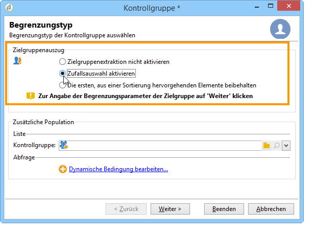

Um eine Kontrollgruppe zu extrahieren, aktivieren Sie diese auf Kampagnen- oder Versandniveau und wählen Sie eine der folgenden Optionen: **[!UICONTROL Zufallsauswahl aktivieren]** oder **[!UICONTROL Die ersten, aus einer Sortierung hervorgehenden Elemente beibehalten]**.

* **[!UICONTROL Zufallsauswahl aktivieren]**: Diese Option wendet eine Zufallsauswahl auf die Empfänger der Zielgruppe an. Wenn Sie anschließend einen Grenzwert von 100 festlegen, wird die Kontrollgruppe aus 100 zufällig aus der Zielgruppe ausgewählten Empfängern zusammengesetzt. Die angewandte Zufallsauswahl hängt von der Datenbank-Engine ab.
* **[!UICONTROL Die ersten, aus einer Sortierung hervorgehenden Elemente beibehalten]**: Diese Option ermöglicht die Begrenzung der Kontrollgruppe nach einer oder mehreren Sortierreihenfolgen. Wenn Sie das Feld **[!UICONTROL Alter]** als Kriterium auswählen und anschließend einen Grenzwert von 100 angeben, wird die Kontrollgruppe aus den 100 jüngsten Empfängern zusammengesetzt. Es könnte sich zum Beispiel anbieten, eine Kontrollgruppe aus Kontakten zusammenzustellen, die besonders wenig oder besonders viele Einkäufe tätigen und diese mit dem Verhalten der kontaktierten Empfänger zu vergleichen.

Klicken Sie auf **[!UICONTROL Weiter]**, um (bei Bedarf) die Sortierreihenfolge festzulegen und die Empfängerbegrenzung zu bestimmen.

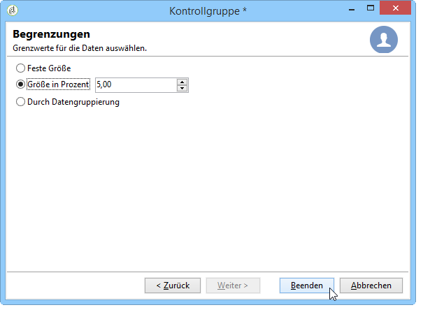

Diese Konfiguration entspricht der einer Aufspaltungsaktivität im Workflow, die die Unterteilung einer Zielgruppe in mehrere Teilmengen ermöglicht. Die Kontrollgruppe entspricht einer dieser Teilmengen. Weitere Informationen hierzu finden Sie in [diesem Abschnitt](../../workflow/using/executing-a-workflow.md#architecture).

### Hinzufügen einer zusätzlichen Population {#adding-a-population}

Sie können eine neue, als Kontrollgruppe zu verwendende Population bestimmen. Diese Population kann aus einer Gruppe von Empfängern oder aus einer spezifischen Abfrage hervorgehen.

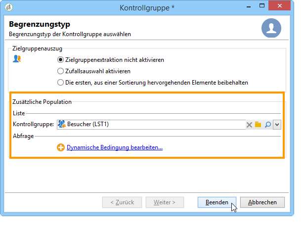

>[!NOTE]
>
>Der Abfrageeditor von Adobe Campaign wird in [diesem Abschnitt](../../workflow/using/query.md) beschrieben.

## Starten eines Versands {#starting-a-delivery}

Sobald alle Validierungen erteilt wurden, kann der Versand gestartet werden. Der Versandvorgang hängt dann von der Art des Versands ab. Informationen zu E-Mail- oder Mobile-Kanal-Versand finden Sie unter [Starten eines Online-Versands](#starting-an-online-delivery) und zu Briefpost-Versand unter [Starten eines Offline-Versands](#starting-an-offline-delivery).

### Starten eines Online-Versands {#starting-an-online-delivery}

Wenn alle Validierungsanfragen akzeptiert wurden, erhält der Versand den Status **[!UICONTROL Zu bestätigen]** und kann von einem Benutzer gestartet werden. Gegebenenfalls wird der Adobe-Campaign-Benutzer (oder die Benutzergruppe), der für die Validierung des Versandstarts zuständig ist, über den startbereiten Versand informiert.

>[!NOTE]
>
>Wenn in den Versandeigenschaften ein spezifischer Benutzer oder eine Benutzergruppe zur Validierung des Versandstarts angegeben wurden, besteht die Möglichkeit, dieses Recht auch dem versandverantwortlichen Benutzer einzuräumen. Aktivieren Sie in diesem Fall die Option **NMS_ActivateOwnerConfirmation**, indem Sie den Wert **1** angeben. Der Zugriff auf diese Option erfolgt im Knoten **[!UICONTROL Administration]** > **[!UICONTROL Plattform]** > **[!UICONTROL Optionen]** des Adobe-Campaign-Explorers.
>  
>Um die entsprechende Option zu deaktivieren, ist der Wert **0** anzugeben. In diesem Fall kann die Versandvalidierung nur durch die in den Versandeigenschaften angegebenen Benutzer oder Benutzergruppen bzw. einen Administrator erfolgen.

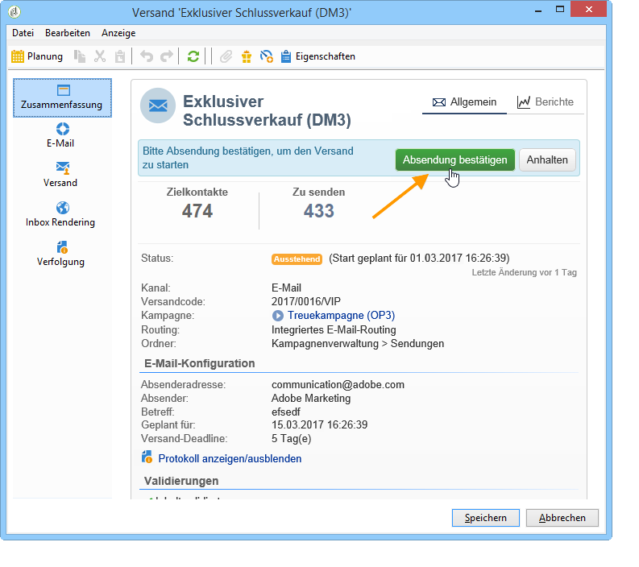

Diese Information wird ebenfalls im Dashboard der Kampagne angezeigt. Über den Link **[!UICONTROL Versand bestätigen]** kann der Versand gestartet werden.

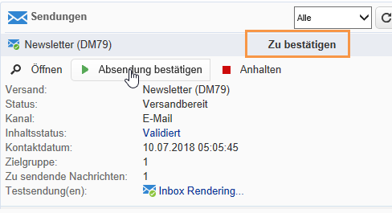

Zur Sicherheit werden Sie in einer Pop-up-Nachricht zur Bestätigung des Vorgangs aufgefordert.

### Starten eines Offline-Versands {#starting-an-offline-delivery}

Wenn alle Validierungen akzeptiert wurden, erhält der Versand den Status **[!UICONTROL Extraktion ausstehend]**. Die Extraktionsdateien werden über einen spezifischen Workflow erstellt, der standardmäßig automatisch startet, wenn ein Briefversand auf Extraktion wartet. Laufende Vorgänge dieser Art werden im Dashboard angezeigt und können über den entsprechenden Link bearbeitet werden.

>[!NOTE]
>
>Die technischen Workflows für Kampagnenprozesse werden in der [Liste der Kampagnenprozesse](../../workflow/using/campaign.md) dargestellt.

**1. Schritt - Datei validieren**

Wenn der Extraktions-Workflow korrekt ausgeführt wurde, muss die Extrationsdatei validiert werden (sofern die Validierung der Extraktionsdatei in der Versandkonfiguration aktiviert wurde).

Weiterführende Informationen finden Sie unter [Extraktionsdatei validieren](../../campaign/using/marketing-campaign-approval.md#approving-an-extraction-file).

**2. Schritt - Nachricht an den Dienstleister validieren**

* Nachdem die Validierung der Extraktionsdatei akzeptiert wurde, kann der Testversand der Benachrichtigungs-E-Mail an den Router erzeugt werden. Diese E-Mail wird über eine Versandvorlage erstellt und muss validiert werden.

   >[!NOTE]
   >
   >Diese Etappe ist nur dann verfügbar, wenn die Durchführung und Validierung von Testsendungen im Fenster der Validierungseinstellungen aktiviert wurden.

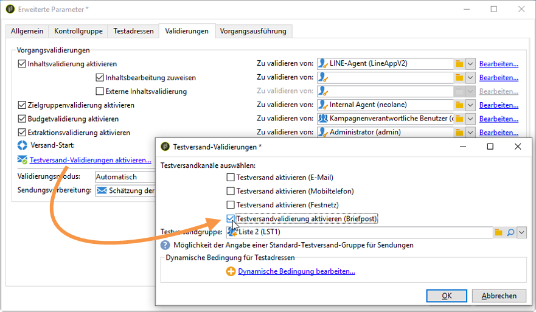

* Klicken Sie auf die Schaltfläche **[!UICONTROL Testversand]**, um Testsendungen zu erstellen.

   Zunächst muss die Zielgruppe der Testsendungen bestimmt werden.

   Sie können so viele Testsendungen erstellen wie nötig. Auf die durchgeführten Testsendungen besteht Zugriff über den Link **[!UICONTROL Briefpost...]** in den Versanddetails.

   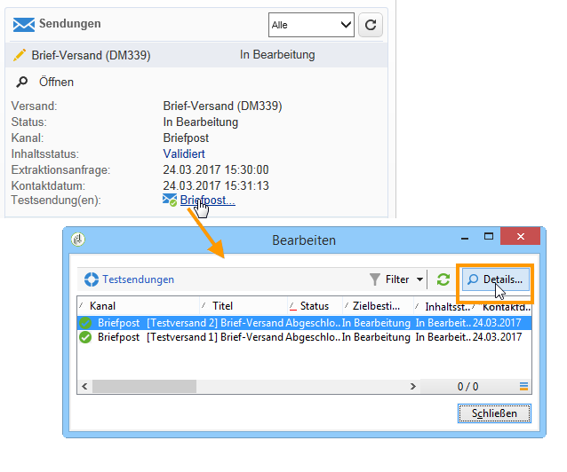

* Der Versand erhält nun den Status **[!UICONTROL Zu unterbreiten]**. Klicken Sie auf die Schaltfläche **[!UICONTROL Testsendungen unterbreiten]** um den Validierungsprozess zu starten.

   

* Der Versandstatus wird daraufhin zu **[!UICONTROL Testversand zu validieren]**. Über die entsprechende Schaltfläche kann die Validierung erfolgen.

   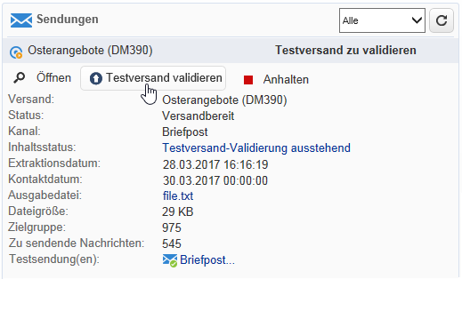

   Im Validierungs-Pop-up können Sie die Validierung akzeptieren oder ablehnen oder zur Extraktionsetappe zurückkehren.

   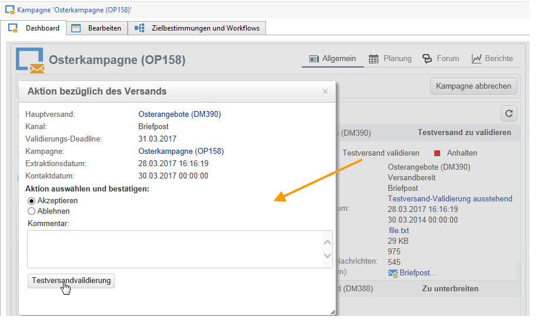

* Die Extraktionsdatei wird dann dem Router gesendet und der Versand ist beendet.

### Kosten- und Lagerberechnung {#calculation-of-costs-and-stocks}

Die Dateiextraktion startet zwei Vorgänge: die Berechnung der Budgets und die Berechnung der Lagerbestände. Die Budgetzeilen werden aktualisiert.

* Im Kampagnentab **[!UICONTROL Budget]** findet die Budgetverwaltung statt. Die Summe der Kostenzeilen wird im Feld **[!UICONTROL Berechnete Kosten]** des Haupttabs der Kampagne und des übergeordneten Programms angezeigt. Die Beträge werden auch im Budget der Kampagne übernommen.

   Die tatsächlichen Kosten werden am Ende entsprechend der vom Router kommunizierten Informationen berechnet: Nur die tatsächlich versendeten Briefe werden fakturiert.

* Die Lagerbestände werden im Knoten **[!UICONTROL Administration > Kampagnen > Lager]** und die Kostenstrukturen im Knoten **[!UICONTROL Administration > Kampagnen > Dienstleister]** des Navigationsbaums bestimmt.

   Lagerpositionen können auf Ebene der Lager angezeigt werden. Öffnen Sie eine Lagerposition, um den Anfangsbestand festzulegen. Der Bestand wird mit jedem Versand dekrementiert. Sie haben die Möglichkeit, einen Meldebestand mit Benachrichtigungen zu konfigurieren.

>[!NOTE]
>
>Weiterführende Informationen zu Kostenberechnungen und Lagerverwaltung finden Sie unter [Dienstleister, Lager und Budgets](../../campaign/using/providers--stocks-and-budgets.md).

## Zugeordnete Dokumente verwalten {#managing-associated-documents}

Sie können einer Kampagne unterschiedliche Dokumente zuordnen: Berichte, Fotos, Web-Seiten, Schemata etc. Die Dokumente können beliebigen Formats sein (Microsoft Word, PowerPoint, PNG, JPEG, Acrobat PDF etc.). Informationen zum Verknüpfen von Dokumenten mit einer Kampagne finden Sie unter [Hinzufügen von Dokumenten](#adding-documents).

>[!IMPORTANT]
>
>Diese Funktionalität eignet sich nur für kleine Dokumente.

Sie haben auch die Möglichkeit, externe Elemente in Kampagnen zu referenzieren, wie zum Beispiel Gutscheine, zweig- oder verkaufsstellenspezifische Angebote etc. Diese können in einem Versandentwurf zusammengefasst und einem Briefpost-Versand zugeordnet werden. Lesen Sie diesbezüglich [Ressourcen in einem Versandentwurf verknüpfen](#associating-and-structuring-resources-linked-via-a-delivery-outline).

>[!NOTE]
>
>MRM ermöglicht Ihnen zudem die Verwaltung einer Ressourcenbibliothek, in der mehrere Benutzer partizipativ arbeiten können. Lesen Sie diesbezüglich [Verwalten von Marketing-Ressourcen](../../campaign/using/managing-marketing-resources.md).

### Hinzufügen von Dokumenten {#adding-documents}

Dokumente können einer Kampagne (kontextrelevante Dokumente) oder einem Programm (allgemeine Dokumente) zugeordnet werden.

Der Tab **[!UICONTROL Dokumente]** enthält:

* die Liste aller für den Inhalt notwendigen Dokumente (Vorlagen, Bilder usw.), die von berechtigten Adobe-Campaign-Benutzern lokal heruntergeladen werden können;
* Informationen für den Router enthaltende Dokumente, wenn vorhanden.

Die Dokumente werden über den Tab **[!UICONTROL Bearbeiten > Dokumente]** einem Programm oder einer Kampagne zugeordnet.

Es besteht darüber hinaus die Möglichkeit, Dokumente über einen im Dashboard angebotenen Link einer Kampagne zuzuordnen.

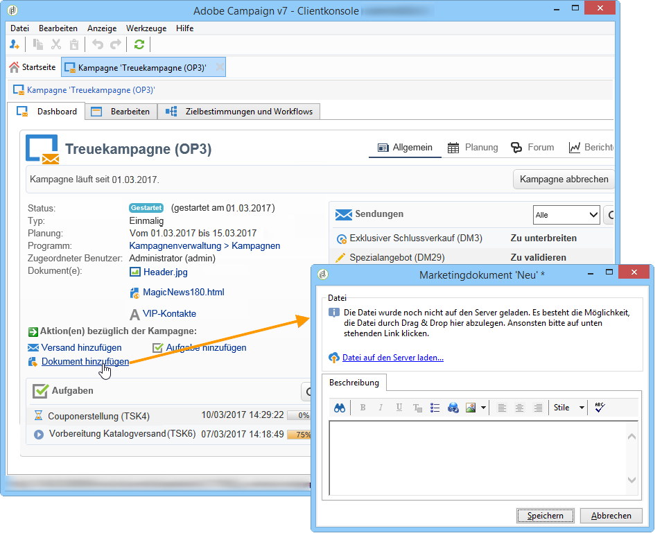

Klicken Sie auf das Symbol **[!UICONTROL Details]**, um den Inhalt einer Datei anzusehen und ergänzende Informationen hinzuzufügen.

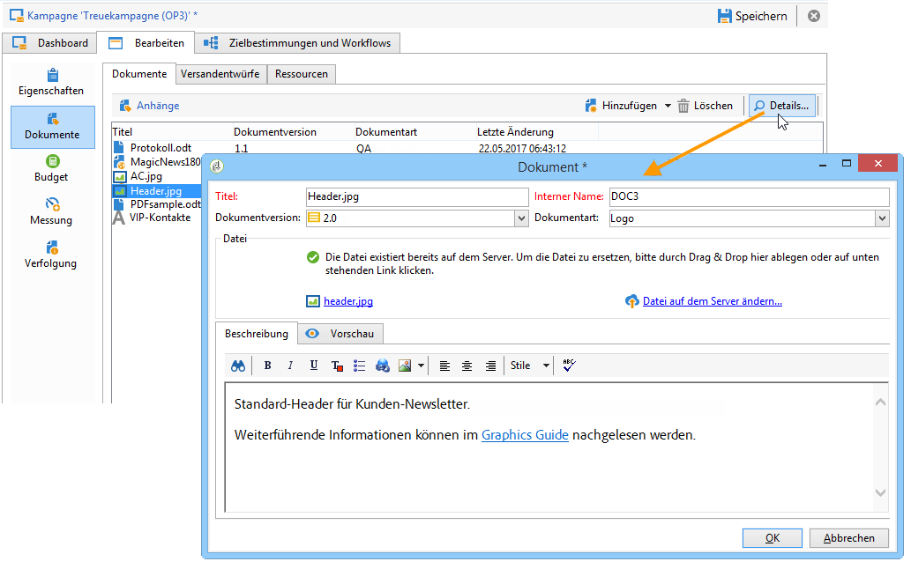

Im Abschnitt **[!UICONTROL Dokument(e)]** des Kampagnen-Dashboards werden alle der Kampagne zugeordneten Dokumente aufgelistet, wie im folgenden Beispiel:

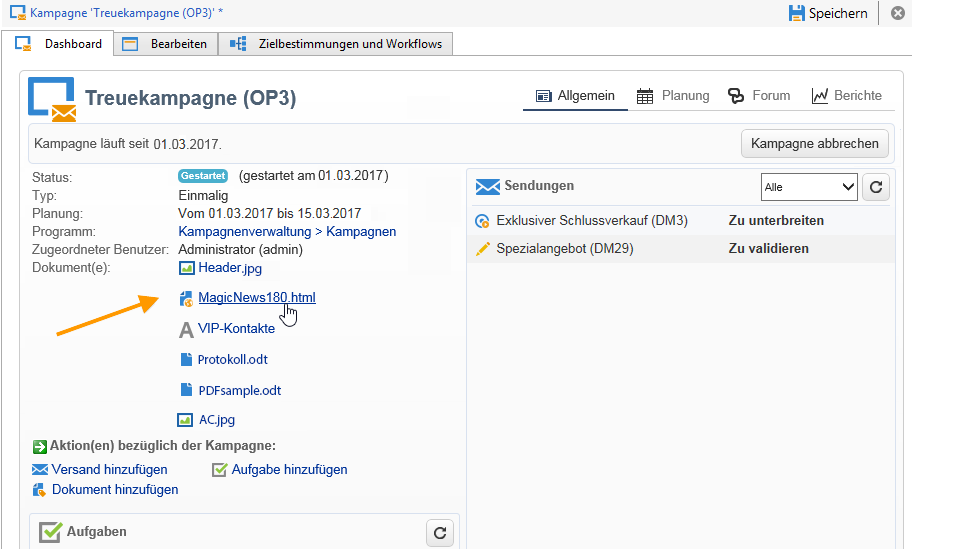

Über die Links können die Dokumente geöffnet und bearbeitet werden.

### Ressourcen in einem Versandentwurf verknüpfen {#associating-and-structuring-resources-linked-via-a-delivery-outline}

>[!NOTE]
>
>Versandentwürfe werden ausschließlich im Rahmen von Briefversand-Kampagnen verwendet.

Ein Versandentwurf stellt eine strukturierte Einheit von Elementen dar (Dokumente, Gutscheine etc.), die für eine bestimmte Kampagne erstellt wurden.

Der bestimmte Elemente umfassende Versandentwurf wird einem Versand angefügt: Im Versand wird der Entwurf in der dem **Dienstleister** übermittelten Extraktionsdatei referenziert, um schließlich als Anhang des Versands verschickt zu werden. Sie können beispielsweise einen Versandentwurf erstellen, der von einer Zweigstelle verwendete Marketingbroschüren enthält.

Versandentwürfe ermöglichen es, in Kampagnen externe Elemente zu strukturieren, die einem Versand nach bestimmten Kriterien hinzugefügt werden: bewilligtes Sonderangebot, Einladung zu einem lokalen Event etc.

#### Versandentwurf erstellen {#creating-an-outline}

Um einen Versandentwurf zu erstellen, klicken Sie auf den Untertab **[!UICONTROL Versandentwürfe]** im Tab **[!UICONTROL Bearbeiten > Dokumente]** der betreffenden Kampagne.

>[!NOTE]
>
>Sollte dieser Tab nicht vorhanden sein, ist die Funktionalität für diese Kampagne nicht verfügbar. Überprüfen Sie in diesem Fall die Konfiguration der Kampagnenvorlage.
>   
>Weitere Informationen hierzu finden Sie im Abschnitt [Kampagnenvorlagen](../../campaign/using/marketing-campaign-templates.md#campaign-templates).

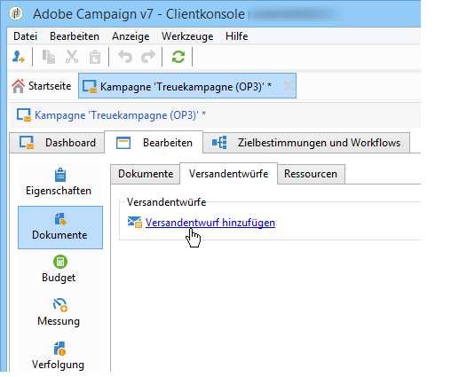

Klicken Sie anschließend auf **[!UICONTROL Versandentwurf hinzufügen]**. Es wird ein Navigationsbaum für die Kampagne erstellt:

1. Machen Sie einen Rechtsklick auf den Wurzelknoten und wählen Sie **[!UICONTROL Neu > Versandentwürfe]** aus, um einen neuen Versandentwurf hinzuzufügen.
1. Machen Sie einen Rechtsklick auf den soeben erstellten Versandentwurf und wählen Sie beispielsweise **[!UICONTROL Neu > Artikel]** oder **[!UICONTROL Neu > Personalisierungsfelder]** aus.

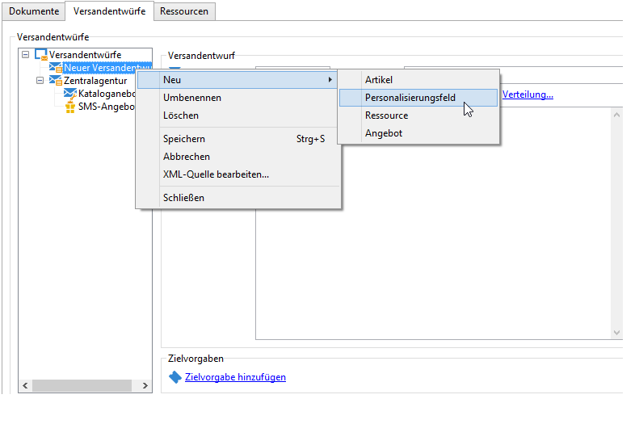

Ein Versandentwurf kann Artikel, Personalisierungsfelder, Ressourcen und Angebote enthalten:

* Artikel sind beispielsweise physische Dokumente, die an dieser Stelle referenziert und beschrieben und schließlich dem Versand angehängt werden.
* Personalisierungsfelder ermöglichen die Erstellung von mit Sendungen (und nicht Empfängern) verbundenen Personalisierungselementen. So können Werte erstellt werden, die in Sendungen mit einer spezifischen Zielgruppe verwendet werden (z. B. Willkommensangebot, prozentuale Ermäßigung). Sie werden in Adobe Campaign erstellt und über den Link **[!UICONTROL Personalisierungsfelder importieren...]** in den jeweiligen Entwurf importiert.

   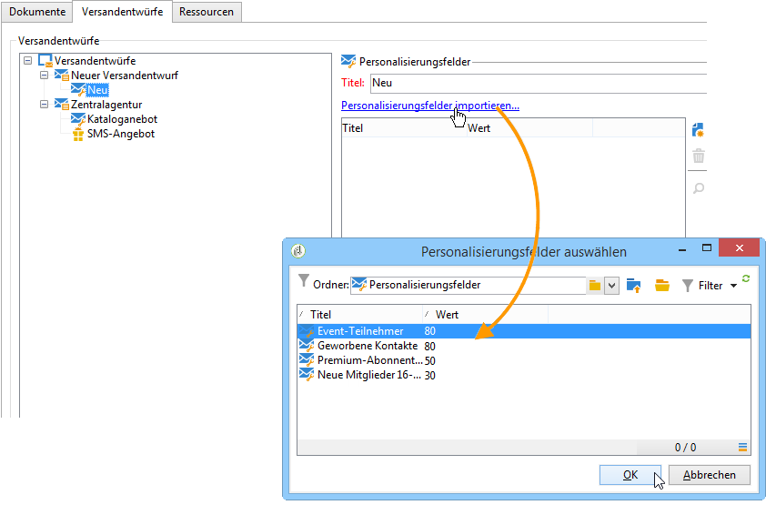

   Über das Symbol **[!UICONTROL Hinzufügen]** rechts vom Bereich der Liste können dem Entwurf auch direkt Personalisierungselemente hinzugefügt werden.

   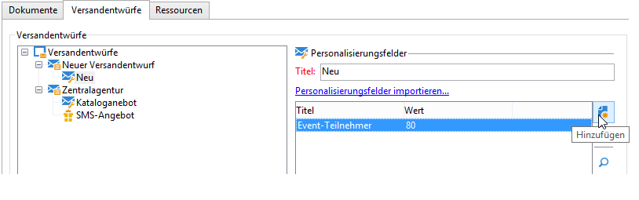

* Ressourcen sind Marketing-Ressourcen, auf die Sie über die Startseite durch Klick auf die Schaltfläche **[!UICONTROL Ressourcen]** in der Rubrik **[!UICONTROL Kampagnen]** zugreifen können.

   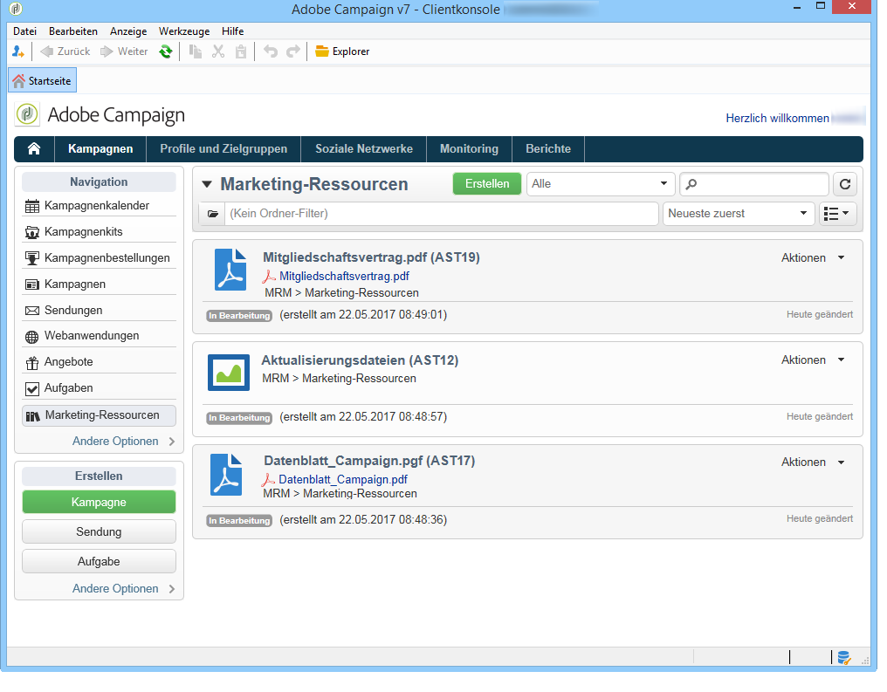

   >[!NOTE]
   >
   >Weiterführende Informationen zu Marketing-Ressourcen finden Sie unter [Verwalten von Marketing-Ressourcen](../../campaign/using/managing-marketing-resources.md).

#### Einen Versandentwurf auswählen {#selecting-an-outline}

Sie können für jeden Versand über den Bereich der Extraktionskonfiguration einen Entwurf auswählen, wie im folgenden Beispiel:

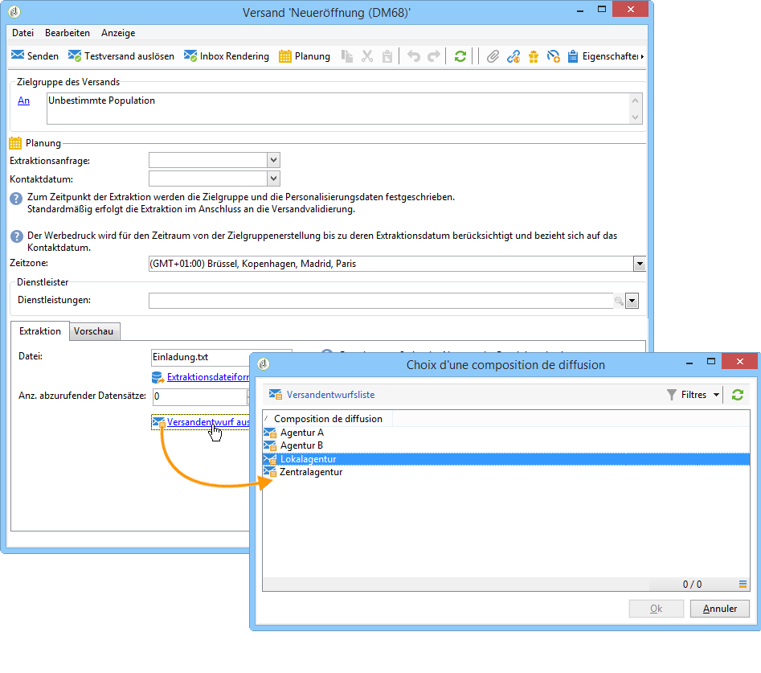

Der ausgewählte Entwurf wird daraufhin im unteren Abschnitt des Fenster angezeigt. Er kann über das rechts vom Feld gelegene Lupensymbol geöffnet oder über die Dropdown-Liste durch einen anderen ersetzt werden:

Diese Information wird ebenfalls im Tab **[!UICONTROL Zusammenfassung]** des Versands angezeigt:

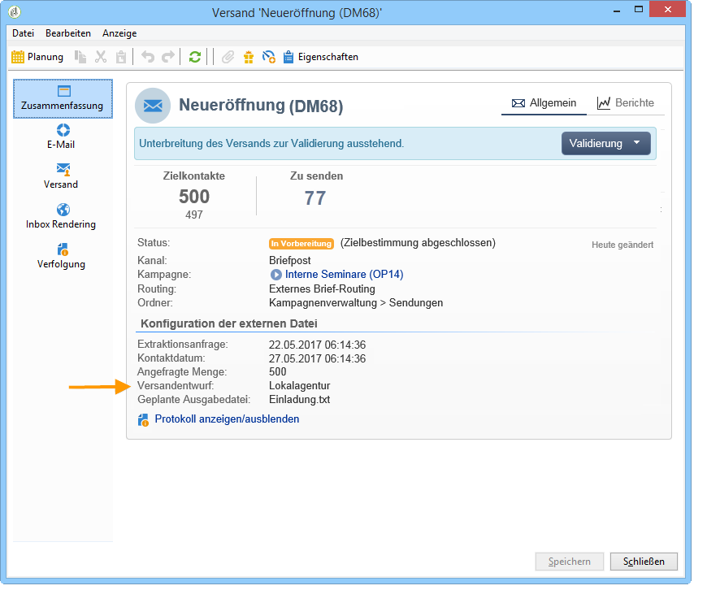

#### Extraktionsergebnis {#extraction-result}

In der dem Dienstleister übermittelten Extraktionsdatei werden der Name des Entwurfs sowie gegebenenfalls seine Eigenschaften (Kosten, Beschreibung usw.) dem Inhalt hinzugefügt, entsprechend der Informationen in der Exportvorlage, die dem Dienstleister zugeordnet wurde.

Im folgenden Beispiel werden der Titel, die Plankosten sowie die Beschreibung des dem Versand zugeordneten Entwurfs der Extraktionsdatei hinzugefügt.

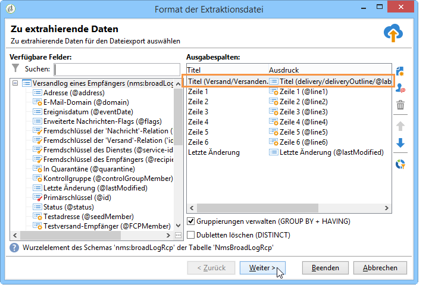

Die Exportvorlage muss dem gewählten Dienstleister für den betreffenden Versand zugeordnet sein. Lesen Sie diesbezüglich den Abschnitt [Erstellung von Dienstleistern und deren Kostenstrukturen](../../campaign/using/providers--stocks-and-budgets.md#creating-service-providers-and-their-cost-structures).

>[!NOTE]
>
>Weitere Informationen zu Exporten finden Sie im Abschnitt [Erste Schritte](../../platform/using/generic-imports-and-exports.md).
