# Sendungen für eine Marketing-Kampagne {#marketing-campaign-deliveries}

Sendungen können über das Dashboard einer Kampagne, einen Kampagnen-Workflow oder direkt über die Übersicht der Sendungen erstellt werden.

Wenn Sendungen aus einer Kampagne erstellt werden, werden sie mit dieser Kampagne verknüpft und auf der Kampagnenebene konsolidiert.

[Funktion im Video kennenlernen](#create-email-video).

## Erstellen von Sendungen {#creating-deliveries}

Um einen mit einer Kampagne verknüpften Versand zu erstellen, klicken Sie auf den Link **[!UICONTROL Versand hinzufügen]** im Dashboard der Kampagne.

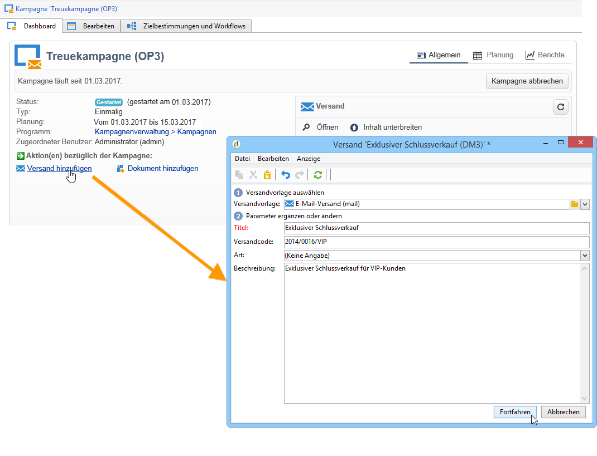

Die vorgeschlagenen Konfigurationen sind an die unterschiedlichen Versandtypen angepasst: Briefpost, E-Mail, Mobile-Kanäle. Weitere Informationen finden Sie in der [Dokumentation zu Campaign v8](https://experienceleague.adobe.com/docs/campaign/campaign-v8/send/create-message.html?lang=de){target="_blank"}.

## Starten eines Versands {#starting-a-delivery}

Sobald alle Validierungen erteilt wurden, kann der Versand gestartet werden. Der Versandvorgang hängt dann von der Art des Versands ab. Informationen zu E-Mail- oder Mobile-Kanal-Sendungen finden Sie unter [Starten eines Online-Versands](#starting-an-online-delivery) und zu Briefpost-Sendungen unter [Starten eines Offline-Versands](#starting-an-offline-delivery).

### Starten eines Online-Versands {#starting-an-online-delivery}

Sobald alle Validierungsanfragen bestätigt wurden, ändert sich der Versandstatus zu **[!UICONTROL Ausstehende Bestätigung]** und kann von einer Benutzerin bzw. einem Benutzer gestartet werden. Gegebenenfalls wird die Adobe Campaign-Benutzerin bzw. der Adobe Campaign-Benutzer (oder die Benutzergruppe), die bzw. der als prüfende Person ernannt wurde, zum Starten des Versands aufgefordert, sobald ein Versand startbereit ist.

>[!NOTE]
>
>Wenn in den Versandeigenschaften ein spezifischer Benutzer oder eine Benutzergruppe zur Validierung des Versandstarts angegeben wurden, besteht die Möglichkeit, dieses Recht auch dem versandverantwortlichen Benutzer einzuräumen. Aktivieren Sie in diesem Fall die Option **NMS_ActivateOwnerConfirmation**, indem Sie den Wert **1** angeben. Die Verwaltung der Optionen erfolgt über den Knoten **[!UICONTROL Administration]** > **[!UICONTROL Plattform]** > **[!UICONTROL Optionen]** im Adobe Campaign-Explorer.
>  
>Um diese Option zu deaktivieren, geben Sie als Wert **0** ein. Der Prozess der Versandbestätigung ist dann der Standardprozess. Nur die in den Versandeigenschaften zum Senden ernannte Person oder Benutzergruppe (oder eine bzw. ein Admin) kann den Versand bestätigen und ausführen.

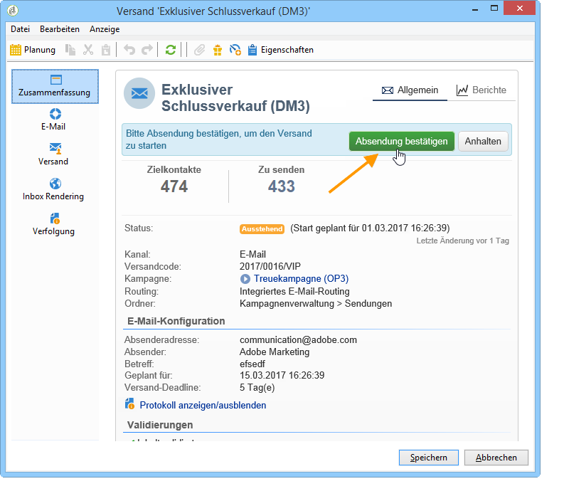

Die Informationen werden auch auf dem Kampagnen-Dashboard angezeigt. Der Link **[!UICONTROL Absendung bestätigen]** ermöglicht es, den Versand zu beginnen.

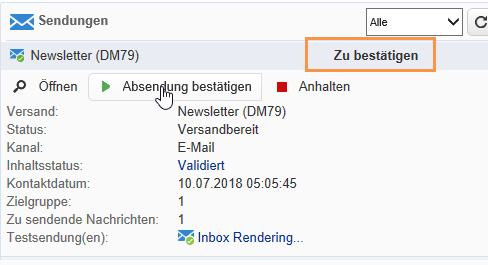

Zur Sicherheit werden Sie in einer Pop-up-Nachricht zur Bestätigung der Aktion aufgefordert.

### Starten eines Offline-Versands {#starting-an-offline-delivery}

Sobald alle Validierungen erteilt wurden, ändert sich der Versandstatus in **[!UICONTROL Extraktion ausstehend]**. Die Extraktionsdateien werden über einen spezifischen Workflow erstellt, der standardmäßig automatisch startet, wenn ein Briefpost-Versand auf Extraktion wartet. Wenn ein Prozess in Bearbeitung ist, wird er im Dashboard angezeigt und kann über seinen Link bearbeitet werden.

>[!NOTE]
>
>Die technischen Workflows zum Campaign-Package finden Sie in der [Liste der technischen Workflows](../../workflow/using/about-technical-workflows.md).

**1. Schritt - Datei validieren**

Wenn der Extraktions-Workflow korrekt ausgeführt wurde, muss die Extrationsdatei validiert werden (sofern die Validierung der Extraktionsdatei in der Versandkonfiguration aktiviert wurde).

Weitere Informationen hierzu finden Sie unter [Validieren einer Extraktionsdatei](../../campaign/using/marketing-campaign-approval.md#approving-an-extraction-file).

**Schritt 2: Validieren der Nachricht an den Dienstleister**

* Nachdem die Extraktionsdatei validiert wurde, können Sie den Testversand der Router-Benachrichtigungs-E-Mail generieren. Diese E-Mail-Nachricht basiert auf einer Versandvorlage. Sie muss validiert werden.

  >[!NOTE]
  >
  >Diese Etappe ist nur dann verfügbar, wenn die Durchführung und Validierung von Testsendungen im Fenster der Validierungseinstellungen aktiviert wurden.

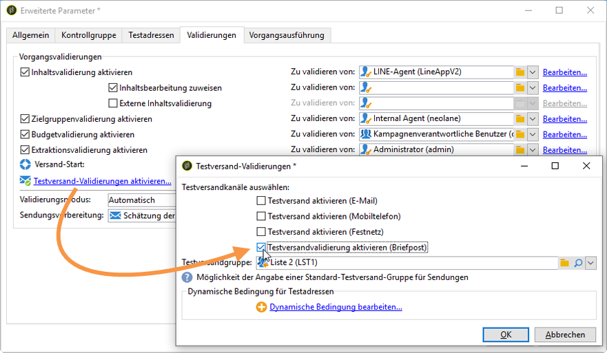

* Klicken Sie auf die Schaltfläche **[!UICONTROL Testversand]**, um Testsendungen zu erstellen.

  Zunächst muss die Zielgruppe der Testsendungen bestimmt werden.

  Sie können so viele Testsendungen wie nötig erstellen. Über den Link **[!UICONTROL Briefpost…]** der Versanddetails können Sie auf sie zugreifen.

  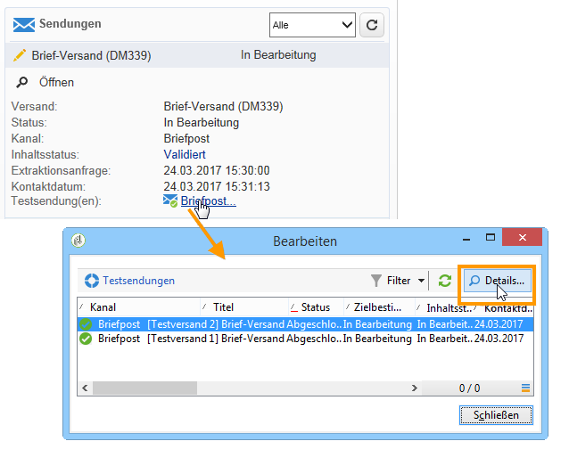

* Der Versandstatus ändert sich zu **[!UICONTROL Zu unterbreiten]**. Klicken Sie auf die Schaltfläche **[!UICONTROL Testsendungen unterbreiten]**, um den Validierungsprozess zu beginnen.

  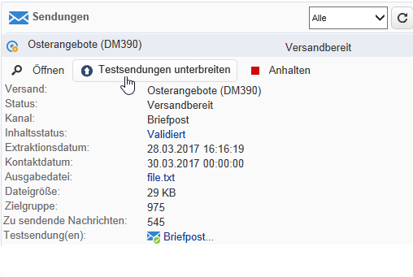

* Der Versandstatus wird daraufhin zu **[!UICONTROL Testversand zu validieren]**. Über die entsprechende Schaltfläche kann die Validierung erfolgen.

  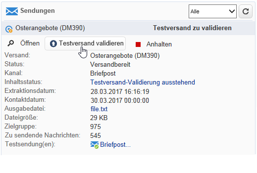

  Im Validierungs-Pop-up können Sie die Validierung akzeptieren oder ablehnen oder zur Extraktionsetappe zurückkehren.

  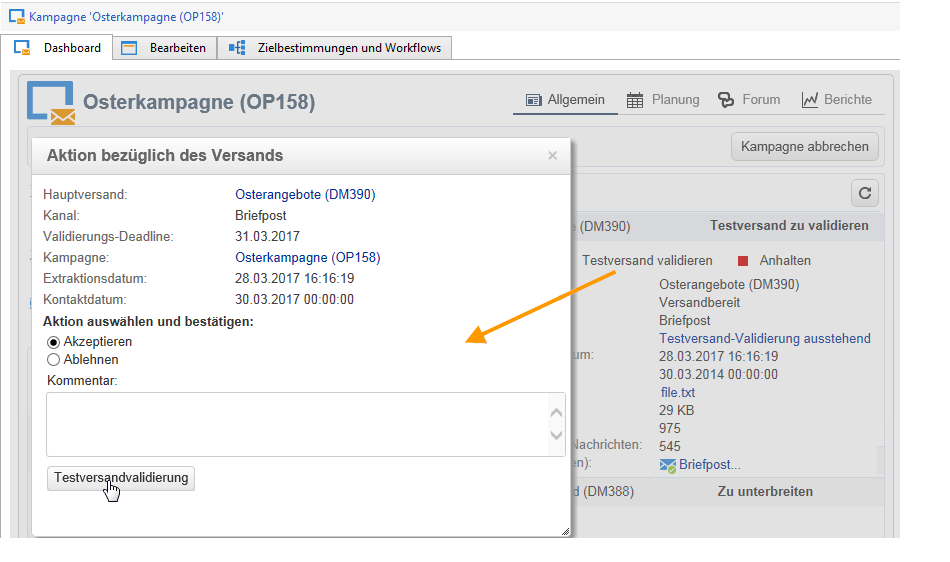

* Die Extraktionsdatei wird dann dem Router gesendet und der Versand ist beendet.

### Kosten- und Lagerberechnung {#calculation-of-costs-and-stocks}

Durch die Dateiextraktion werden zwei Vorgänge gestartet: Budgetberechnung und Bestandsberechnung. Die Budgeteinträge werden aktualisiert.

* Die Registerkarte **[!UICONTROL Budget]** ermöglicht die Budgetverwaltung der Kampagne. Die Summe der Kostenzeilen wird im Feld **[!UICONTROL Berechnete Kosten]** des Haupttabs der Kampagne und des übergeordneten Programms angezeigt. Die Beträge werden auch im Kampagnenbudget angezeigt.

  Die tatsächlichen Kosten werden am Ende entsprechend der vom Router kommunizierten Informationen berechnet. Nur tatsächlich gesendete Nachrichten werden fakturiert.

* Die Lagerbestände werden im Knoten **[!UICONTROL Administration > Kampagnen > Lager]** und die Kostenstrukturen im Knoten **[!UICONTROL Administration > Kampagnen > Dienstleister]** des Navigationsbaums bestimmt.

  Lagerpositionen werden im Bestandsabschnitt angezeigt. Um den Anfangsbestand zu definieren, öffnen Sie eine Lagerposition. Der Bestand verringert sich mit jedem Versand. Sie können eine Warnstufe und Benachrichtigungen definieren.

>[!NOTE]
>
>Weiterführende Informationen zu Kostenberechnungen und Lagerverwaltung finden Sie unter [Dienstleister, Lager und Budgets](../../campaign/using/providers-stocks-and-budgets.md).

## Verwalten der zugehörigen Dokumente {#managing-associated-documents}

Sie können einer Kampagne verschiedene Dokumente zuordnen: Bericht, Foto, Web-Seite, Diagramm usw. Diese Dokumente können in jedem beliebigen Format vorliegen (Microsoft Word, PowerPoint, PNG, JPG, Acrobat PDF usw.). [In diesem Abschnitt](../../campaign/using/marketing-campaign-assets.md) erfahren Sie, wie Sie Dokumente mit einer Kampagne verknüpfen.

>[!IMPORTANT]
>
>Diese Funktionalität eignet sich nur für kleine Dokumente.

Sie haben auch die Möglichkeit, externe Elemente in Kampagnen zu referenzieren, wie zum Beispiel Gutscheine, zweig- oder verkaufsstellenspezifische Angebote etc. Diese können in einem Versandentwurf zusammengefasst und einem Briefpost-Versand zugeordnet werden. [Weitere Informationen](#associating-and-structuring-resources-linked-via-a-delivery-outline).

>[!NOTE]
>
>Wenn Sie MRM verwenden, können Sie auch eine Bibliothek von Marketing-Ressourcen verwalten, die mehreren Teilnehmern für die gemeinsame Arbeit zur Verfügung stehen. Siehe [Verwaltung von Marketing-Ressourcen](../../mrm/using/managing-marketing-resources.md).

### Dokumente hinzufügen {#adding-documents}

Dokumente können auf Kampagnenebene (kontextuelle Dokumente) oder Programmebene (allgemeine Dokumente) zugeordnet werden.

Der Tab **[!UICONTROL Dokumente]** enthält:

* Die Liste aller für den Inhalt erforderlichen Dokumente (Vorlage, Bilder usw.), die von Adobe Campaign-Benutzenden mit entsprechenden Berechtigungen lokal heruntergeladen werden können,
* Informationen für den Router enthaltende Dokumente, wenn vorhanden.

Die Dokumente werden über den Tab **[!UICONTROL Bearbeiten > Dokumente]** einem Programm oder einer Kampagne zugeordnet.

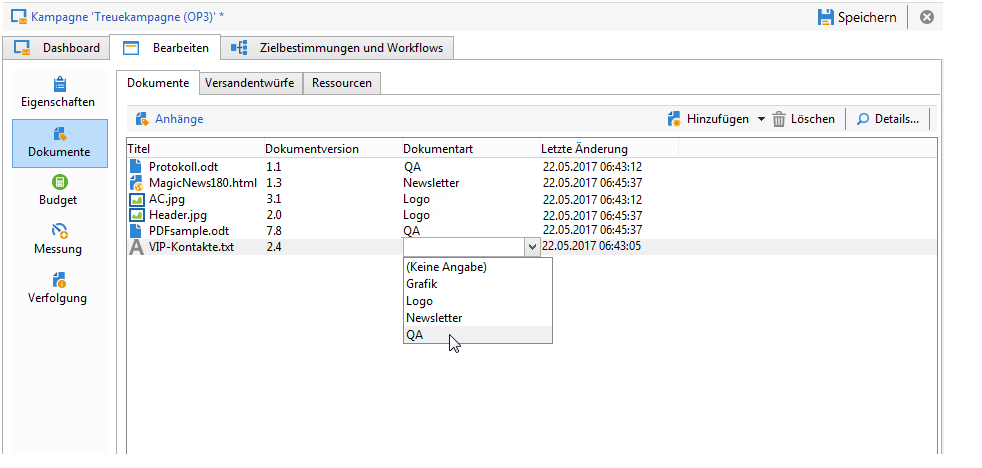

Es besteht darüber hinaus die Möglichkeit, Dokumente über einen im Dashboard angebotenen Link einer Kampagne zuzuordnen.

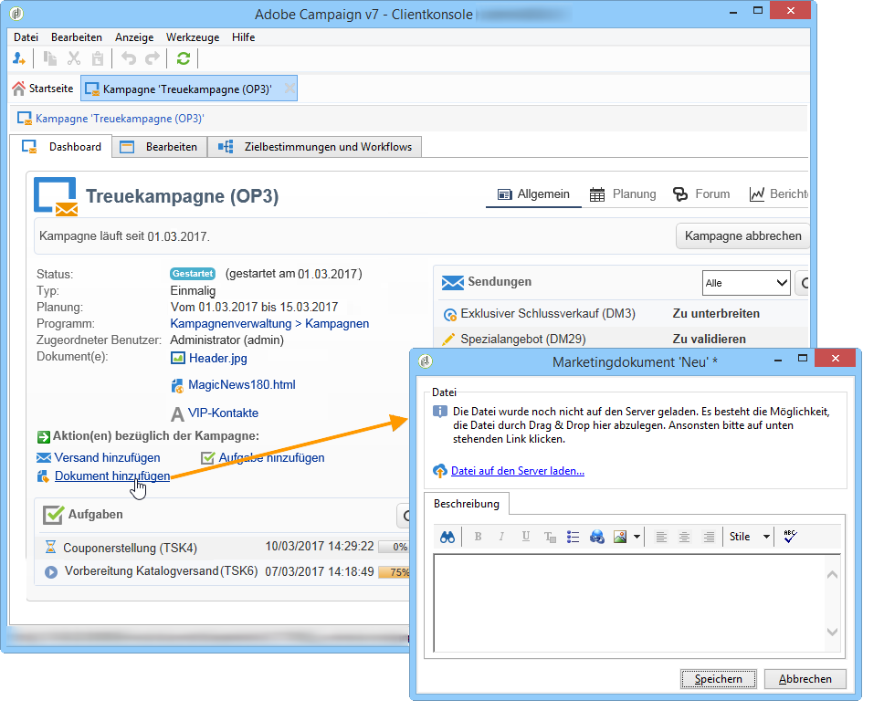

Klicken Sie auf das Symbol **[!UICONTROL Details]**, um den Inhalt einer Datei anzusehen und ergänzende Informationen hinzuzufügen.

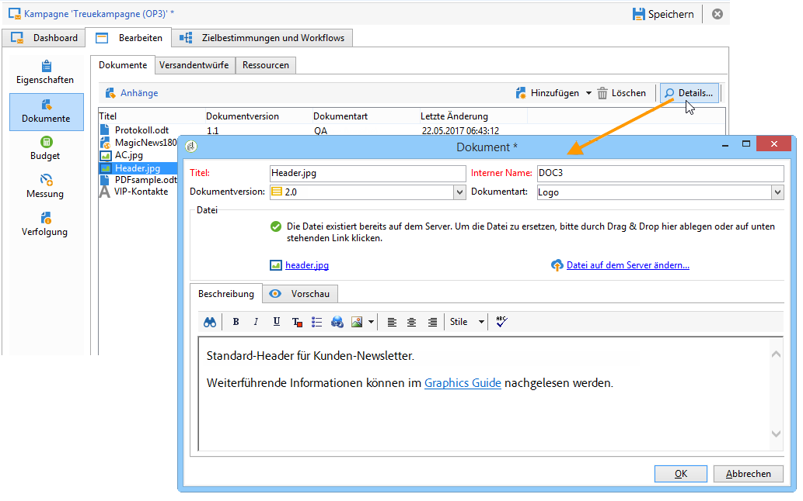

Im Abschnitt **[!UICONTROL Dokument(e)]** des Kampagnen-Dashboards werden alle der Kampagne zugeordneten Dokumente aufgelistet, wie im folgenden Beispiel:

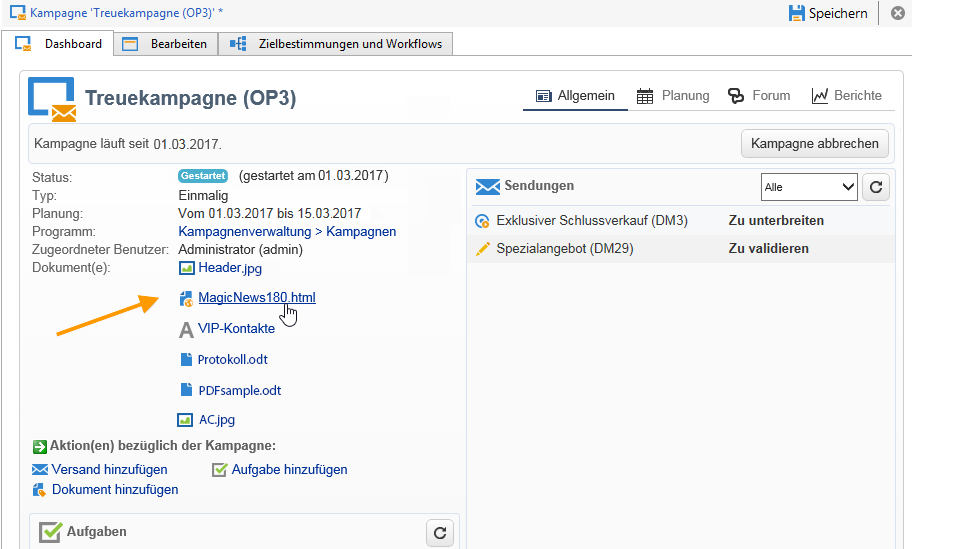

Über die Links können die Dokumente geöffnet und bearbeitet werden.

### Ressourcen in einem Versandentwurf verknüpfen {#associating-and-structuring-resources-linked-via-a-delivery-outline}

>[!NOTE]
>
>Versandentwürfe werden ausschließlich im Rahmen von Briefpost-Kampagnen verwendet.

Ein Versandentwurf stellt eine strukturierte Gruppe von Elementen dar (Dokumente, Zweigstellen/Shops, Werbe-Coupons usw.), die im Unternehmen und für eine bestimmte Kampagne erstellt wurden.

Diese Elemente werden in Versandentwürfen gruppiert und ein bestimmter Versandentwurf wird mit einem Versand verknüpft. Dieser wird in der an den **Dienstleister** gesendeten Extraktionsdatei referenziert, um an den Versand angehängt werden zu können. Sie können beispielsweise einen Versandentwurf erstellen, der sich auf eine Filiale und die von ihr verwendeten Marketing-Prospekte bezieht.

Versandentwürfe ermöglichen es, in Kampagnen externe Elemente zu strukturieren, die einem Versand nach bestimmten Kriterien hinzugefügt werden: bewilligtes Sonderangebot, Einladung zu einem lokalen Event etc.

#### Erstellen eines Versandentwurfs {#creating-an-outline}

Um einen Versandentwurf zu erstellen, klicken Sie auf den Untertab **[!UICONTROL Versandentwürfe]** im Tab **[!UICONTROL Bearbeiten > Dokumente]** der betreffenden Kampagne.

>[!NOTE]
>
>Wenn diese Registerkarte nicht vorhanden ist, ist diese Funktion für diese Kampagne nicht verfügbar. Weitere Informationen finden Sie im Abschnitt zur Konfiguration von Kampagnenvorlagen.
>   
>Weitere Informationen hierzu finden Sie im Abschnitt [Kampagnenvorlagen](../../campaign/using/marketing-campaign-templates.md#campaign-templates).

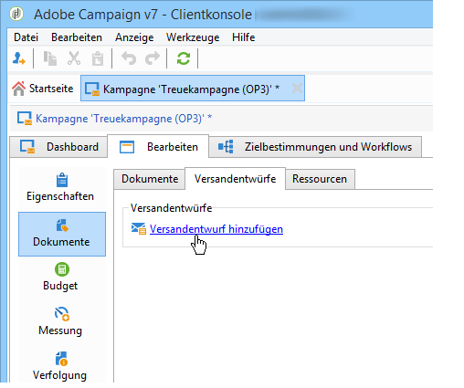

Klicken Sie anschließend auf **[!UICONTROL Versandentwurf hinzufügen]**. Es wird ein Navigationsbaum für die Kampagne erstellt:

1. Machen Sie einen Rechtsklick auf den Wurzelknoten und wählen Sie **[!UICONTROL Neu > Versandentwürfe]** aus, um einen neuen Versandentwurf hinzuzufügen.
1. Machen Sie einen Rechtsklick auf den soeben erstellten Versandentwurf und wählen Sie beispielsweise **[!UICONTROL Neu > Artikel]** oder **[!UICONTROL Neu > Personalisierungsfelder]** aus.

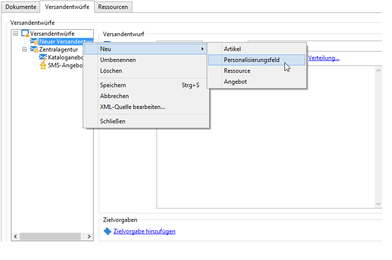

Ein Versandentwurf kann Artikel, Personalisierungsfelder, Ressourcen und Angebote enthalten:

* Artikel sind beispielsweise physische Dokumente, die an dieser Stelle referenziert und beschrieben und schließlich dem Versand angehängt werden.
* Personalisierungsfelder ermöglichen es Ihnen, Personalisierungselemente zu erstellen, die sich auf Sendungen und nicht auf Empfangende beziehen. Daher ist das Erstellen von Werten möglich, die in Sendungen für eine bestimmte Zielgruppe (Willkommensangebot, Rabatt usw.) verwendet werden können. Sie werden in Adobe Campaign erstellt und über den Link **[!UICONTROL Personalisierungsfelder importieren…]** in den Entwurf importiert.

  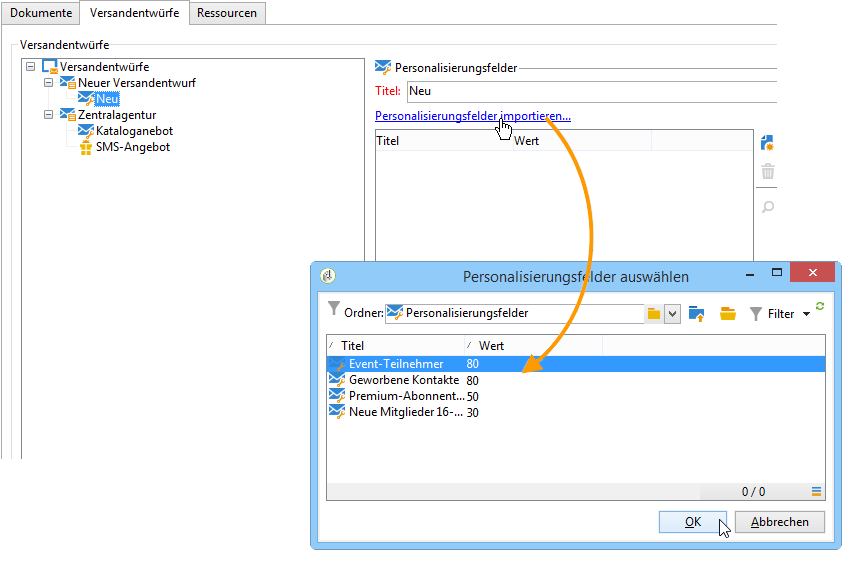

  Über das Symbol **[!UICONTROL Hinzufügen]** rechts vom Bereich der Liste können in dem Entwurf auch direkt Personalisierungselemente erstellt werden.

  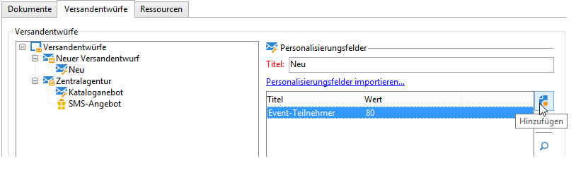

* Ressourcen sind Marketing-Ressourcen, auf die Sie über die Startseite durch Klicken auf die Schaltfläche **[!UICONTROL Ressourcen]** im Tab **[!UICONTROL Kampagnen]** zugreifen können.

  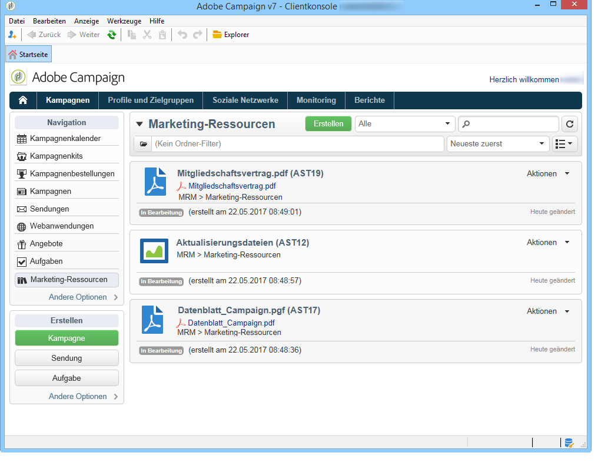

  >[!NOTE]
  >
  >Weiterführende Informationen zu Marketing-Ressourcen finden Sie unter [Verwalten von Marketing-Ressourcen](../../mrm/using/managing-marketing-resources.md).

#### Auswählen eines Versandentwurfs {#selecting-an-outline}

Sie können für jeden Versand über den Bereich der Extraktionskonfiguration einen Entwurf auswählen, wie im folgenden Beispiel:

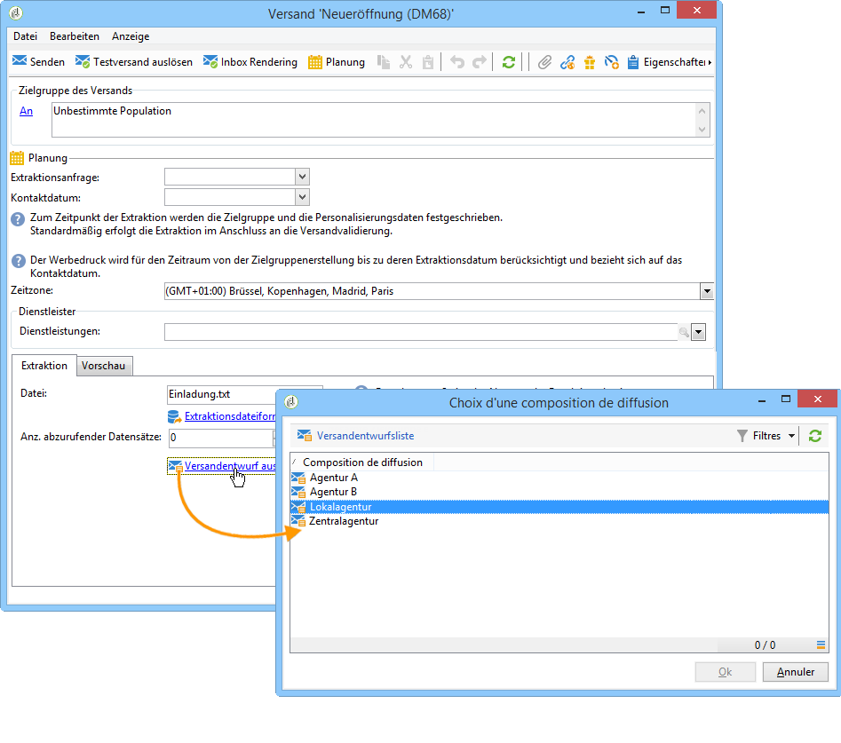

Der ausgewählte Entwurf wird dann im unteren Abschnitt des Fensters angezeigt. Er kann über das Symbol rechts im Fenster oder mithilfe der Dropdown-Liste bearbeitet werden:

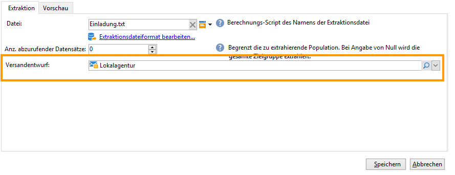

Diese Information wird ebenfalls im Tab **[!UICONTROL Zusammenfassung]** des Versands angezeigt:

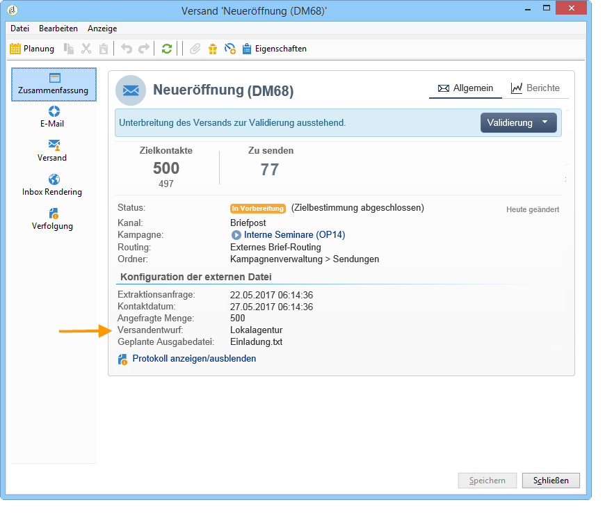

#### Extraktionsergebnis {#extraction-result}

In der extrahierten und an den Dienstleister gesendeten Datei werden dem Inhalt der Name des Entwurfs und gegebenenfalls die Eigenschaften (Kosten, Beschreibung usw.) hinzugefügt und zwar entsprechend der Informationen in der mit dem Dienstleister verknüpften Exportvorlage.

Im folgenden Beispiel werden der Titel, die Plankosten sowie die Beschreibung des dem Versand zugeordneten Entwurfs der Extraktionsdatei hinzugefügt.

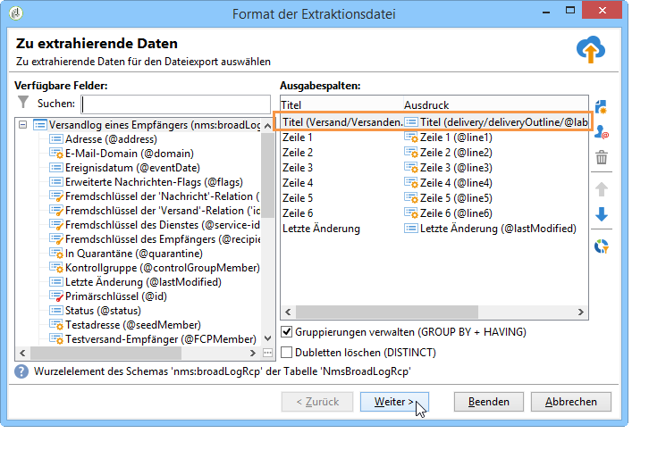

Die Exportvorlage muss dem gewählten Dienstleister für den betreffenden Versand zugeordnet sein. Lesen Sie diesbezüglich den Abschnitt [Erstellung von Dienstleistern und deren Kostenstrukturen](../../campaign/using/providers-stocks-and-budgets.md#creating-service-providers-and-their-cost-structures).

>[!NOTE]
>
>Weitere Informationen zu Exporten finden Sie im Abschnitt [Erste Schritte](../../platform/using/get-started-data-import-export.md).

#### Anleitungsvideo {#create-email-video}

In diesem Video wird das Erstellen einer Kampagne und einer E-Mail in Adobe Campaign beschrieben.

>[!VIDEO](https://video.tv.adobe.com/v/25604?quality=12)

Weitere Anleitungsvideos zu Campaign finden Sie [hier](https://experienceleague.adobe.com/docs/campaign-classic-learn/tutorials/overview.html?lang=de).

