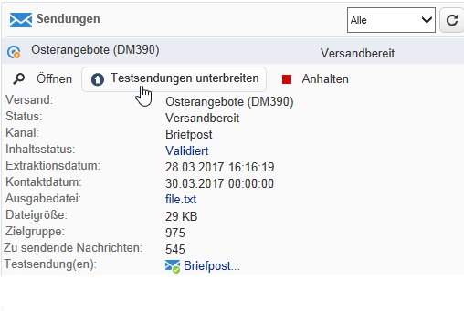

# Sendungen zur Marketing-Kampagne {#marketing-campaign-deliveries}

Sendungen können über das Dashboard einer Kampagne, einen Kampagnenworkflow oder direkt über die Übersicht der Sendungen erstellt werden.

Wenn Sendungen aus einer Kampagne erstellt werden, werden sie mit dieser Kampagne verknüpft und auf der Kampagnenebene konsolidiert.

[ Funktion im Video kennenlernen](#create-email-video).

## Sendungen erstellen {#creating-deliveries}

Um einen mit einer Kampagne verknüpften Versand zu erstellen, klicken Sie auf den Link **[!UICONTROL Versand hinzufügen]** im Dashboard der Kampagne.

Die vorgeschlagenen Konfigurationen sind an die unterschiedlichen Versandtypen angepasst: Briefpost, E-Mail, Mobile-Kanäle. [Mehr dazu](../../delivery/using/steps-about-delivery-creation-steps.md).

## Starten eines Versands {#starting-a-delivery}

Sobald alle Validierungen erteilt wurden, kann der Versand gestartet werden. Der Versandvorgang hängt dann von der Art des Versands ab. Informationen zu E-Mail- oder Mobile-Kanal-Sendungen finden Sie unter [Starten eines Online-Versands](#starting-an-online-delivery) und zu Briefpost-Sendungen unter [Starten eines Offline-Versands](#starting-an-offline-delivery).

### Starten eines Online-Versands {#starting-an-online-delivery}

Wenn alle Validierungsanfragen akzeptiert wurden, erhält der Versand den Status **[!UICONTROL Zu bestätigen]** und kann von einem Benutzer gestartet werden. Gegebenenfalls wird der Adobe-Campaign-Benutzer (oder die Benutzergruppe), der für die Validierung des Versandstarts zuständig ist, über den startbereiten Versand informiert.

>[!NOTE]
>
>Wenn in den Versandeigenschaften ein spezifischer Benutzer oder eine Benutzergruppe zur Validierung des Versandstarts angegeben wurden, besteht die Möglichkeit, dieses Recht auch dem versandverantwortlichen Benutzer einzuräumen. Aktivieren Sie in diesem Fall die Option **NMS_ActivateOwnerConfirmation**, indem Sie den Wert **1** angeben. Der Zugriff auf diese Option erfolgt im Knoten **[!UICONTROL Administration]** > **[!UICONTROL Plattform]** > **[!UICONTROL Optionen]** des Adobe-Campaign-Explorers.
>  
>Um die entsprechende Option zu deaktivieren, ist der Wert **0** anzugeben. In diesem Fall kann die Versandvalidierung nur durch die in den Versandeigenschaften angegebenen Benutzer oder Benutzergruppen bzw. einen Administrator erfolgen.

Diese Information wird ebenfalls im Dashboard der Kampagne angezeigt. Über den Link **[!UICONTROL Versand bestätigen]** kann der Versand gestartet werden.

Zur Sicherheit werden Sie in einer Pop-up-Nachricht zur Bestätigung des Vorgangs aufgefordert.

### Starten eines Offline-Versands {#starting-an-offline-delivery}

Wenn alle Validierungen akzeptiert wurden, erhält der Versand den Status **[!UICONTROL Extraktion ausstehend]**. Die Extraktionsdateien werden über einen spezifischen Workflow erstellt, der standardmäßig automatisch startet, wenn ein Briefversand auf Extraktion wartet. Laufende Vorgänge dieser Art werden im Dashboard angezeigt und können über den entsprechenden Link bearbeitet werden.

>[!NOTE]
>
>Die technischen Workflows zum Campaign-Package finden Sie in der [Liste der technischen Workflows](../../workflow/using/about-technical-workflows.md).

**1. Schritt - Datei validieren**

Wenn der Extraktions-Workflow korrekt ausgeführt wurde, muss die Extrationsdatei validiert werden (sofern die Validierung der Extraktionsdatei in der Versandkonfiguration aktiviert wurde).

Weiterführende Informationen finden Sie unter [Extraktionsdatei validieren](../../campaign/using/marketing-campaign-approval.md#approving-an-extraction-file).

**2. Schritt - Nachricht an den Dienstleister validieren**

* Nachdem die Validierung der Extraktionsdatei akzeptiert wurde, kann der Testversand der Benachrichtigungs-E-Mail an den Router erzeugt werden. Diese E-Mail wird über eine Versandvorlage erstellt und muss validiert werden.

   >[!NOTE]
   >
   >Diese Etappe ist nur dann verfügbar, wenn die Durchführung und Validierung von Testsendungen im Fenster der Validierungseinstellungen aktiviert wurden.

* Klicken Sie auf die Schaltfläche **[!UICONTROL Testversand]**, um Testsendungen zu erstellen.

   Zunächst muss die Zielgruppe der Testsendungen bestimmt werden.

   Sie können so viele Testsendungen erstellen wie nötig. Auf die durchgeführten Testsendungen besteht Zugriff über den Link **[!UICONTROL Briefpost...]** in den Versanddetails.

   

* Der Versand erhält nun den Status **[!UICONTROL Zu unterbreiten]**. Klicken Sie auf die Schaltfläche **[!UICONTROL Testsendungen unterbreiten]** um den Validierungsprozess zu starten.

   

* Der Versandstatus wird daraufhin zu **[!UICONTROL Testversand zu validieren]**. Über die entsprechende Schaltfläche kann die Validierung erfolgen.

   

   Im Validierungs-Pop-up können Sie die Validierung akzeptieren oder ablehnen oder zur Extraktionsetappe zurückkehren.

   

* Die Extraktionsdatei wird dann dem Router gesendet und der Versand ist beendet.

### Kosten- und Lagerberechnung {#calculation-of-costs-and-stocks}

Die Dateiextraktion startet zwei Vorgänge: die Berechnung der Budgets und die Berechnung der Lagerbestände. Die Budgetzeilen werden aktualisiert.

* Im Kampagnentab **[!UICONTROL Budget]** findet die Budgetverwaltung statt. Die Summe der Kostenzeilen wird im Feld **[!UICONTROL Berechnete Kosten]** des Haupttabs der Kampagne und des übergeordneten Programms angezeigt. Die Beträge werden auch im Budget der Kampagne übernommen.

   Die tatsächlichen Kosten werden am Ende entsprechend der vom Router kommunizierten Informationen berechnet: Nur die tatsächlich versendeten Briefe werden fakturiert.

* Die Lagerbestände werden im Knoten **[!UICONTROL Administration > Kampagnen > Lager]** und die Kostenstrukturen im Knoten **[!UICONTROL Administration > Kampagnen > Dienstleister]** des Navigationsbaums bestimmt.

   Lagerpositionen können auf Ebene der Lager angezeigt werden. Öffnen Sie eine Lagerposition, um den Anfangsbestand festzulegen. Der Bestand wird mit jedem Versand dekrementiert. Sie haben die Möglichkeit, einen Meldebestand mit Benachrichtigungen zu konfigurieren.

>[!NOTE]
>
>Weiterführende Informationen zu Kostenberechnungen und Lagerverwaltung finden Sie unter [Dienstleister, Lager und Budgets](../../campaign/using/providers--stocks-and-budgets.md).

## Zugeordnete Dokumente verwalten {#managing-associated-documents}

Sie können einer Kampagne unterschiedliche Dokumente zuordnen: Berichte, Fotos, Web-Seiten, Schemata etc. Die Dokumente können beliebigen Formats sein (Microsoft Word, PowerPoint, PNG, JPEG, Acrobat PDF etc.). Erfahren Sie, wie Sie Dokumente mit einer Kampagne [in diesem Abschnitt](../../campaign/using/marketing-campaign-assets.md) verknüpfen.

>[!IMPORTANT]
>
>Diese Funktionalität eignet sich nur für kleine Dokumente.

Sie haben auch die Möglichkeit, externe Elemente in Kampagnen zu referenzieren, wie zum Beispiel Gutscheine, zweig- oder verkaufsstellenspezifische Angebote etc. Diese können in einem Versandentwurf zusammengefasst und einem Briefpost-Versand zugeordnet werden. [Weitere Informationen](#associating-and-structuring-resources-linked-via-a-delivery-outline).

>[!NOTE]
>
>MRM ermöglicht Ihnen zudem die Verwaltung einer Ressourcenbibliothek, in der mehrere Benutzer partizipativ arbeiten können. Lesen Sie diesbezüglich [Verwalten von Marketing-Ressourcen](../../campaign/using/managing-marketing-resources.md).

### Hinzufügen von Dokumenten {#adding-documents}

Dokumente können einer Kampagne (kontextrelevante Dokumente) oder einem Programm (allgemeine Dokumente) zugeordnet werden.

Der Tab **[!UICONTROL Dokumente]** enthält:

* die Liste aller für den Inhalt notwendigen Dokumente (Vorlagen, Bilder usw.), die von berechtigten Adobe-Campaign-Benutzern lokal heruntergeladen werden können;
* Informationen für den Router enthaltende Dokumente, wenn vorhanden.

Die Dokumente werden über den Tab **[!UICONTROL Bearbeiten > Dokumente]** einem Programm oder einer Kampagne zugeordnet.

Es besteht darüber hinaus die Möglichkeit, Dokumente über einen im Dashboard angebotenen Link einer Kampagne zuzuordnen.

Klicken Sie auf das Symbol **[!UICONTROL Details]**, um den Inhalt einer Datei anzusehen und ergänzende Informationen hinzuzufügen.

Im Abschnitt **[!UICONTROL Dokument(e)]** des Kampagnen-Dashboards werden alle der Kampagne zugeordneten Dokumente aufgelistet, wie im folgenden Beispiel:

Über die Links können die Dokumente geöffnet und bearbeitet werden.

### Ressourcen in einem Versandentwurf verknüpfen {#associating-and-structuring-resources-linked-via-a-delivery-outline}

>[!NOTE]
>
>Versandentwürfe werden ausschließlich im Rahmen von Briefversand-Kampagnen verwendet.

Ein Versandentwurf stellt eine strukturierte Einheit von Elementen dar (Dokumente, Gutscheine etc.), die für eine bestimmte Kampagne erstellt wurden.

Der bestimmte Elemente umfassende Versandentwurf wird einem Versand angefügt: Im Versand wird der Entwurf in der dem **Dienstleister** übermittelten Extraktionsdatei referenziert, um schließlich als Anhang des Versands verschickt zu werden. Sie können beispielsweise einen Versandentwurf erstellen, der von einer Zweigstelle verwendete Marketingbroschüren enthält.

Versandentwürfe ermöglichen es, in Kampagnen externe Elemente zu strukturieren, die einem Versand nach bestimmten Kriterien hinzugefügt werden: bewilligtes Sonderangebot, Einladung zu einem lokalen Event etc.

#### Versandentwurf erstellen {#creating-an-outline}

Um einen Versandentwurf zu erstellen, klicken Sie auf den Untertab **[!UICONTROL Versandentwürfe]** im Tab **[!UICONTROL Bearbeiten > Dokumente]** der betreffenden Kampagne.

>[!NOTE]
>
>Sollte dieser Tab nicht vorhanden sein, ist die Funktionalität für diese Kampagne nicht verfügbar. Überprüfen Sie in diesem Fall die Konfiguration der Kampagnenvorlage.
>   
>Weitere Informationen hierzu finden Sie im Abschnitt [Kampagnenvorlagen](../../campaign/using/marketing-campaign-templates.md#campaign-templates).

Klicken Sie anschließend auf **[!UICONTROL Versandentwurf hinzufügen]**. Es wird ein Navigationsbaum für die Kampagne erstellt:

1. Machen Sie einen Rechtsklick auf den Wurzelknoten und wählen Sie **[!UICONTROL Neu > Versandentwürfe]** aus, um einen neuen Versandentwurf hinzuzufügen.
1. Machen Sie einen Rechtsklick auf den soeben erstellten Versandentwurf und wählen Sie beispielsweise **[!UICONTROL Neu > Artikel]** oder **[!UICONTROL Neu > Personalisierungsfelder]** aus.

Ein Versandentwurf kann Artikel, Personalisierungsfelder, Ressourcen und Angebote enthalten:

* Artikel sind beispielsweise physische Dokumente, die an dieser Stelle referenziert und beschrieben und schließlich dem Versand angehängt werden.
* Personalisierungsfelder ermöglichen die Erstellung von mit Sendungen (und nicht Empfängern) verbundenen Personalisierungselementen. So können Werte erstellt werden, die in Sendungen mit einer spezifischen Zielgruppe verwendet werden (z. B. Willkommensangebot, prozentuale Ermäßigung). Sie werden in Adobe Campaign erstellt und über den Link **[!UICONTROL Personalisierungsfelder importieren...]** in den jeweiligen Entwurf importiert.

   

   Über das Symbol **[!UICONTROL Hinzufügen]** rechts vom Bereich der Liste können dem Entwurf auch direkt Personalisierungselemente hinzugefügt werden.

   

* Ressourcen sind Marketing-Ressourcen, auf die Sie über die Startseite durch Klick auf die Schaltfläche **[!UICONTROL Ressourcen]** in der Rubrik **[!UICONTROL Kampagnen]** zugreifen können.

   

   >[!NOTE]
   >
   >Weiterführende Informationen zu Marketing-Ressourcen finden Sie unter [Verwalten von Marketing-Ressourcen](../../campaign/using/managing-marketing-resources.md).

#### Einen Versandentwurf auswählen {#selecting-an-outline}

Sie können für jeden Versand über den Bereich der Extraktionskonfiguration einen Entwurf auswählen, wie im folgenden Beispiel:

Der ausgewählte Entwurf wird daraufhin im unteren Abschnitt des Fenster angezeigt. Er kann über das rechts vom Feld gelegene Lupensymbol geöffnet oder über die Dropdown-Liste durch einen anderen ersetzt werden:

Diese Information wird ebenfalls im Tab **[!UICONTROL Zusammenfassung]** des Versands angezeigt:

#### Extraktionsergebnis {#extraction-result}

In der dem Dienstleister übermittelten Extraktionsdatei werden der Name des Entwurfs sowie gegebenenfalls seine Eigenschaften (Kosten, Beschreibung usw.) dem Inhalt hinzugefügt, entsprechend der Informationen in der Exportvorlage, die dem Dienstleister zugeordnet wurde.

Im folgenden Beispiel werden der Titel, die Plankosten sowie die Beschreibung des dem Versand zugeordneten Entwurfs der Extraktionsdatei hinzugefügt.

Die Exportvorlage muss dem gewählten Dienstleister für den betreffenden Versand zugeordnet sein. Lesen Sie diesbezüglich den Abschnitt [Erstellung von Dienstleistern und deren Kostenstrukturen](../../campaign/using/providers--stocks-and-budgets.md#creating-service-providers-and-their-cost-structures).

>[!NOTE]
>
>Weitere Informationen zu Exporten finden Sie im Abschnitt [Erste Schritte](../../platform/using/get-started-data-import-export.md).

#### Anleitungsvideo {#create-email-video}

In diesem Video wird das Erstellen einer Kampagne und einer E-Mail in Adobe Campaign erläutert.

>[!VIDEO](https://video.tv.adobe.com/v/25604?quality=12)

Weitere Anleitungsvideos zu Campaign finden Sie [hier](https://experienceleague.adobe.com/docs/campaign-classic-learn/tutorials/overview.html?lang=de).