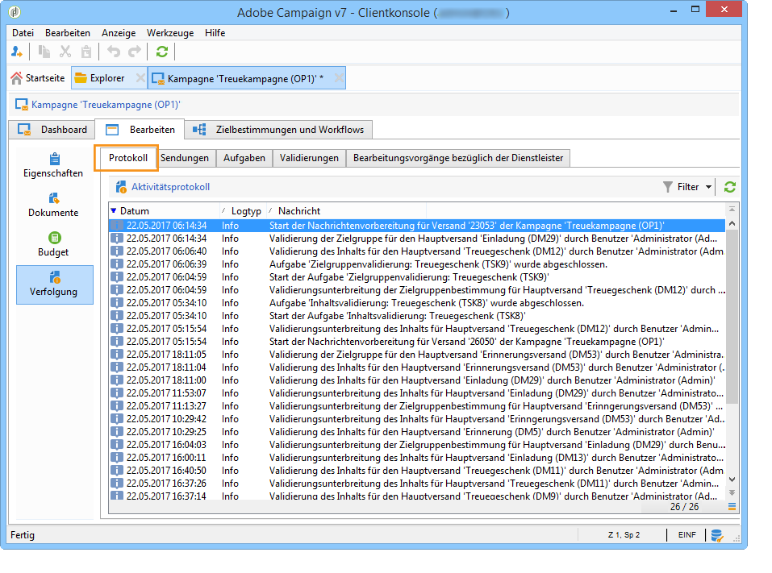
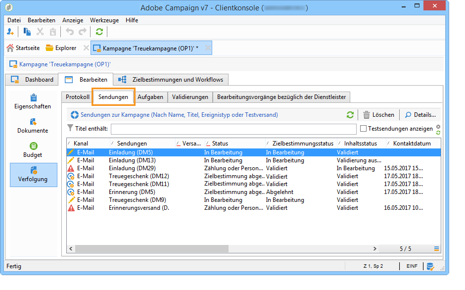
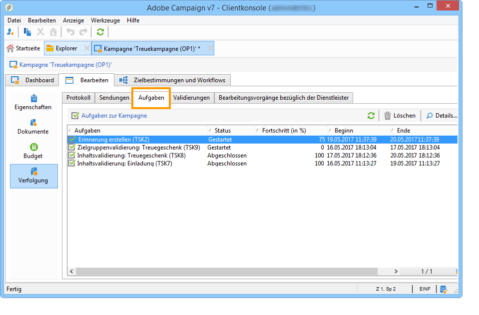
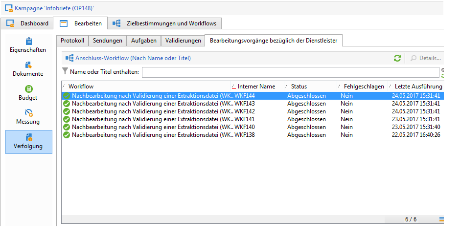
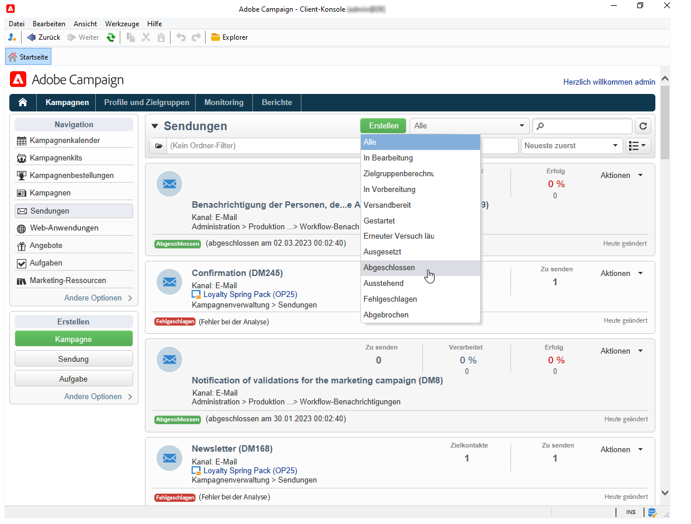

# Überwachen von Marketing-Kampagnen {#monitoring-marketing-campaigns}

## Kampagnen verfolgen {#tracking-a-campaign}

In jeder Kampagne können über den Tab **[!UICONTROL Verfolgung]** die ausgeführten Prozesse sowie ihre Status eingesehen werden. Die Informationen sind in diverse Untertabs eingeteilt.

* Im Aktivitätenprotokoll wird die Ausführung allgemeiner Kampagnenprozesse protokolliert: Workflow-Erstellung oder -Start, Validierung, Extraktion usw.

   

* Im Untertab **[!UICONTROL Sendungen]** werden alle Sendungen der Kampagne zusammengefasst. Sie können aus dieser Übersicht heraus geöffnet werden. Wählen Sie hierzu den gewünschten Versand aus und klicken Sie auf das Symbol **[!UICONTROL Details]**.

   

* Im Unter-Tab **[!UICONTROL Aufgaben]** werden alle mit dieser Kampagne verbundenen Aufgaben aufgelistet. Sie können aus dieser Übersicht heraus geöffnet oder gelöscht werden. Aufgaben sind nur mit der Anwendung MRM verfügbar. Sie werden unter [Verwaltung von Aufgaben](../../campaign/using/creating-and-managing-tasks.md) genauer beschrieben.

   

* Die zur Generierung der Nachrichten an Dienstleister erstellten Workflows werden im Untertab **[!UICONTROL Bearbeitungsvorgänge bezüglich der Dienstleister]** aufgelistet. Klicken Sie auf das Symbol **[!UICONTROL Details]**, um den ausgewählten Workflow anzuzeigen.

   

## Versandverfolgung {#delivery-tracking}

Eine Liste der Sendungen ist über die gleichnamige Schaltfläche in der Kampagnen-Rubrik verfügbar.****

In dieser Liste werden die Schlüsselindikatoren jedes Versands angezeigt: Status, Zielkontakte, übergeordnete Kampagne usw.

Um den Status eines Versands zu überprüfen, öffnen Sie diesen. Im Dashboard und den verschiedenen Tabs finden Sie alle notwendigen Informationen.

>[!NOTE]
>
>Sendungen und ihre Details werden im Abschnitt [Nachrichten senden](../../delivery/using/about-message-tracking.md) beschrieben.

## Verarbeitung verfolgen {#execution-tracking}

Sie können den Status der Sendungen einsehen, indem Sie auf die Schaltfläche **[!UICONTROL Sendungen]** in der Rubrik „Kampagnen“ der Adobe Campaign-Startseite klicken. Siehe [Versandverfolgung](#delivery-tracking).

Informationen bezüglich der in einer Kampagne ausgeführten Prozesse werden im Tab **[!UICONTROL Bearbeiten > Verfolgung]** der jeweiligen Kampagne zusammengefasst. Siehe [Kampagnen verfolgen](#tracking-a-campaign).
