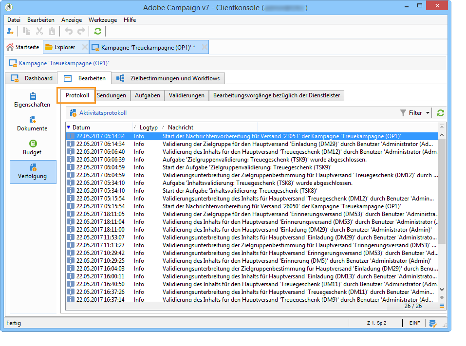
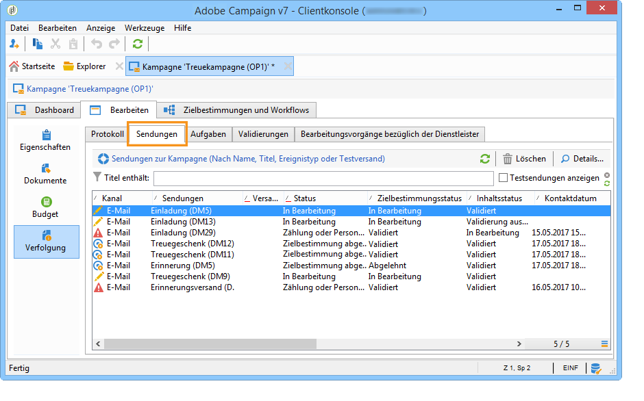
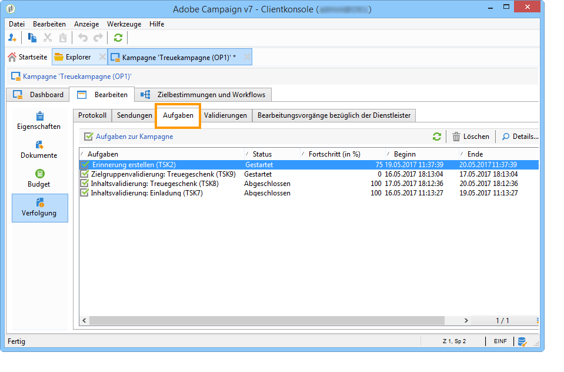
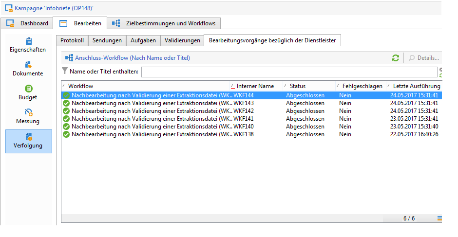
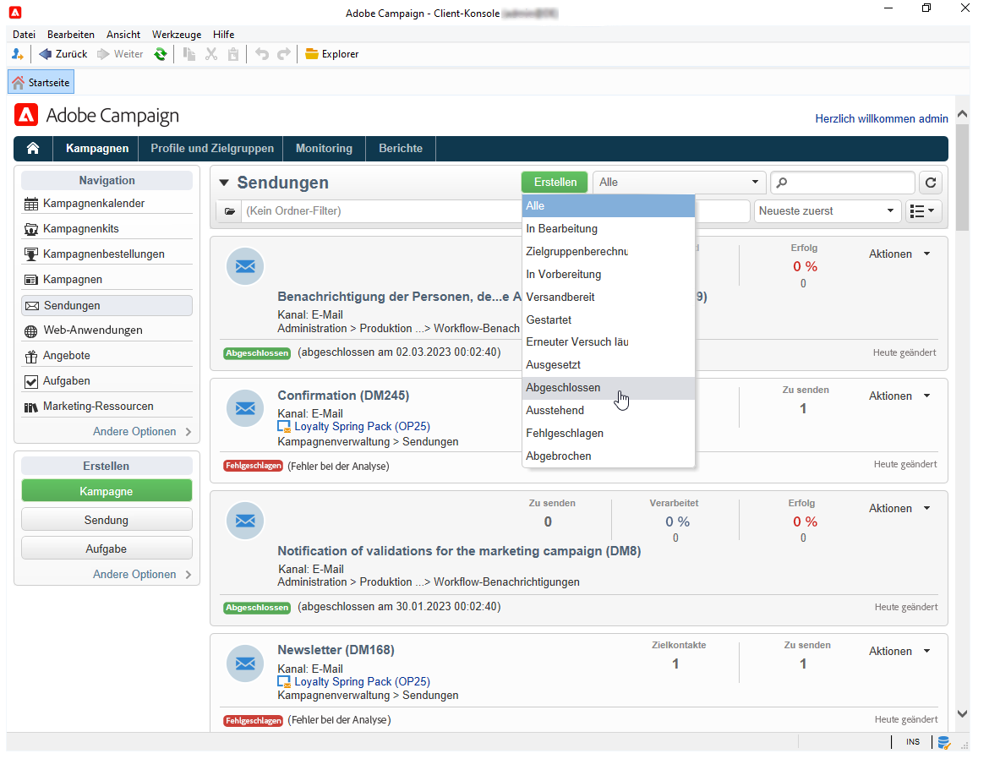

# Überwachen von Marketing-Kampagnen {#monitoring-marketing-campaigns}

## Verfolgen einer Kampagne {#tracking-a-campaign}

Für jede Kampagne zeigt die Registerkarte **[!UICONTROL Tracking]** alle Aufträge und deren Status an. Über diese Unterregisterkarte kann auf folgende Informationen zugegriffen werden:

* Im Aktivitätenprotokoll wird die Ausführung allgemeiner Kampagnenprozesse protokolliert: Workflow-Erstellung oder -Start, Validierung, Extraktion usw.

  

* In der Unterregisterkarte **[!UICONTROL Sendungen]** werden alle Sendungen der Kampagne zusammengefasst. Sie können aus dieser Übersicht heraus geöffnet werden. Wählen Sie dazu einen Versand aus und klicken Sie auf das Symbol **[!UICONTROL Details]**.

  

* Die Unterregisterkarte **[!UICONTROL Aufgaben]** gruppiert alle mit der Kampagne verknüpften Aufgaben. In dieser Ansicht können Sie sie bearbeiten oder löschen. Aufgaben sind in der MRM-Anwendung verfügbar. Weitere Informationen dazu finden Sie in [diesem Abschnitt](../../mrm/using/creating-and-managing-tasks.md).

  

* Die zur Generierung der Nachrichten an Dienstleister erstellten Workflows werden in der Unterregisterkarte **[!UICONTROL Bearbeitungsvorgänge bezüglich der Dienstleister]** aufgelistet. Klicken Sie auf das Symbol **[!UICONTROL Details]**, um den ausgewählten Workflow anzuzeigen.

  

## Versandverfolgung {#delivery-tracking}

Eine Liste der Sendungen ist über die gleichnamige Schaltfläche in der Kampagnen-Rubrik verfügbar.****

In dieser Liste werden die Schlüsselindikatoren jedes Versands angezeigt: Status, Zielkontakte, übergeordnete Kampagne usw.

Um den Status eines Versands zu überprüfen, öffnen Sie diesen. Im Dashboard und den verschiedenen Tabs finden Sie alle notwendigen Informationen.

>[!NOTE]
>
>Informationen zu Versanddetails finden Sie in [diesem Abschnitt](../../delivery/using/about-message-tracking.md).

## Verarbeitung verfolgen {#execution-tracking}

Sie können den Status der Sendungen einsehen, indem Sie auf die Schaltfläche **[!UICONTROL Sendungen]** in der Rubrik „Kampagnen“ der Adobe Campaign-Startseite klicken. Siehe [Versandverfolgung](#delivery-tracking).

Informationen über die in einer Kampagne ausgeführten Prozesse werden in der Registerkarte **[!UICONTROL Bearbeiten > Audit]** der Kampagne erfasst. Dort können Sie die Liste der Sendungen in der Kampagne anzeigen. [Weitere Informationen](#tracking-a-campaign).
