# Auswählen der Zielgruppe für Ihre Kampagnen {#marketing-campaign-deliveries}

In einer Marketing-Kampagne können Sie für jeden Versand Folgendes definieren:

* Die Zielgruppe: Erfahren Sie mehr über das [Erstellen der Zielgruppe in einem Workflow](#building-the-main-target-in-a-workflow) und das [Auswählen der Zielpopulation](#selecting-the-target-population).
* Eine Kontrollgruppe: Weitere Informationen finden Sie in [diesem Abschnitt](#defining-a-control-group).
* Testadressen: Weitere Informationen finden Sie in [diesem Abschnitt](../../delivery/using/about-seed-addresses.md).

Einige dieser Informationen werden von der [Kampagnenvorlage](../../campaign/using/marketing-campaign-templates.md#campaign-templates) übernommen.

Um die Versandzielgruppe zu erstellen, können Sie Filterkriterien für die Empfänger in der Datenbank definieren. Dieser Auswahlmodus für Empfänger wird in [diesem Abschnitt](../../delivery/using/steps-defining-the-target-population.md) vorgestellt.

## Versand an eine Gruppe

Sie haben die Möglichkeit, eine Population in eine Liste zu importieren und diese Liste als Zielgruppe eines Versands zu verwenden. Gehen Sie dazu wie folgt vor:

1. Bearbeiten Sie hierzu den betreffenden Versand und klicken Sie auf den Link **[!UICONTROL An]**, um die Zielpopulation zu ändern.

1. Markieren Sie im Tab **[!UICONTROL Hauptzielgruppe]** die Option **[!UICONTROL Von der Datenbank ausgehend bestimmt]** und klicken Sie auf **[!UICONTROL Hinzufügen]**, um Empfänger auszuwählen.

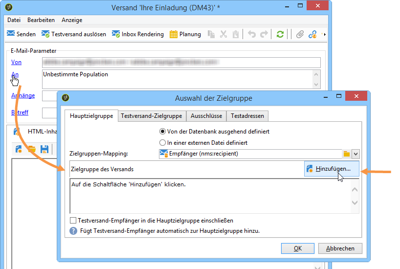

1. Wählen Sie **[!UICONTROL Empfängerliste]** aus und klicken Sie auf **[!UICONTROL Weiter]**, um sie auszuwählen.

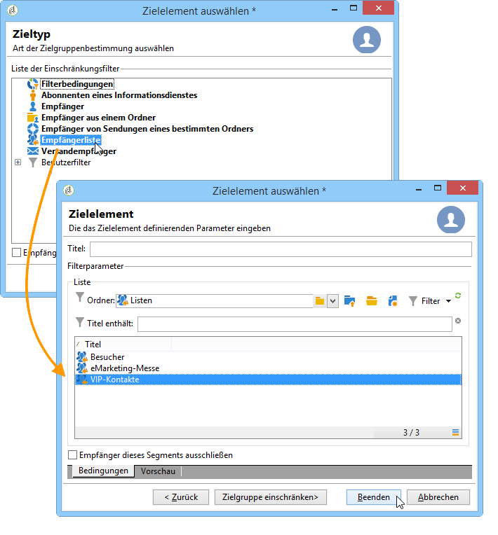

## Erstellen der Zielgruppe in einem Campaign-Workflow {#building-the-main-target-in-a-workflow}

Die Hauptzielgruppe eines Versands kann auch über einen Campaign-Workflow definiert werden: Die grafische Umgebung ermöglicht die Erstellung einer Zielgruppe mithilfe von Abfragen, Tests und Operatoren wie Vereinigungen, Deduplizierungen, Aufspaltungen usw.

>[!IMPORTANT]
>
>Sie können einer Kampagne nicht mehr als 28 Workflows hinzufügen. Jenseits dieses Grenzwerts werden keine zusätzlichen Workflows mehr in der Benutzeroberfläche angezeigt und können Fehler hervorrufen.

### Erstellen eines Workflows {#creating-a-targeting-workflow}

Die Zielgruppenbestimmung kann durch eine Kombination von Filterbedingungen erfolgen, die in einem Workflow grafisch verdeutlicht werden. Sie können Populationen und Unterpopulationen erstellen, die Ihren Anforderungen entsprechend ausgewählt werden. Um den Workflow-Editor anzuzeigen, klicken Sie im Campaign-Dashboard auf die Registerkarte **[!UICONTROL Zielgruppenbestimmung und Workflows]**.

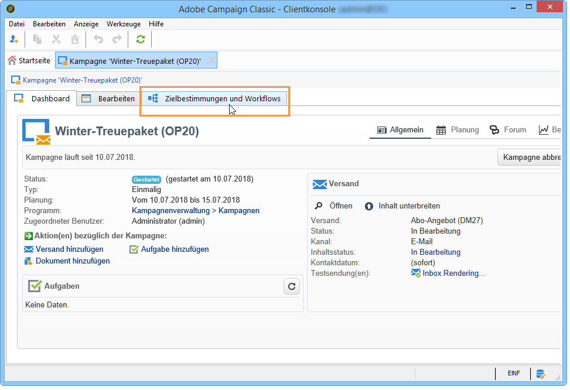

Die Zielpopulation wird über eine oder mehrere in einem Workflow platzierte Abfragen aus der Adobe Campaign-Datenbank extrahiert. Weiterführende Informationen zum Erstellen einer Abfrage finden Sie in [diesem Abschnitt](../../workflow/using/query.md).

Sie können Abfragen starten und die resultierenden Populationen über Aktivitäten wie Vereinigung, Schnittmenge, Aufspaltung, Ausschluss weiter einschränken oder vergrößern.

Wählen Sie die gewünschten Aktivitäten aus den links vom Arbeitsbereich liegenden Menüs aus und reihen Sie diese aneinander, um die Zielgruppe zu erstellen.

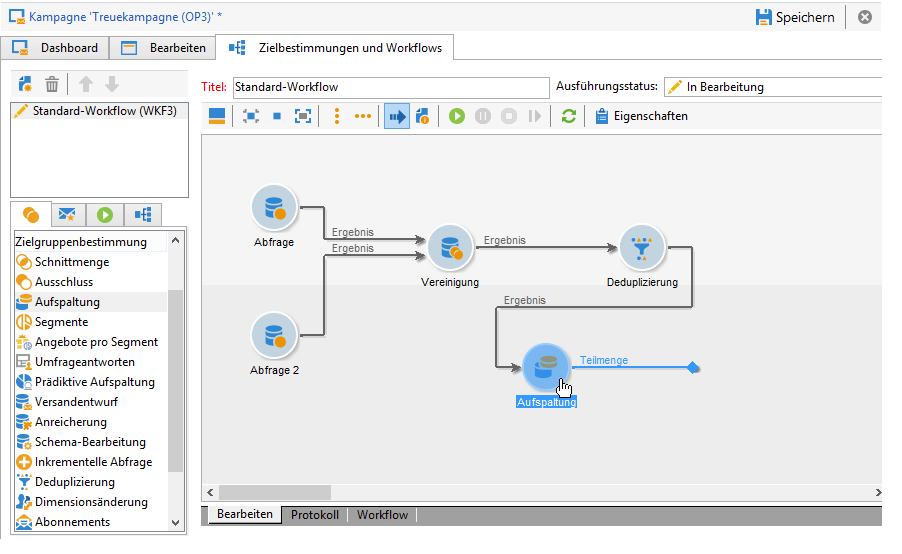

Verknüpfen Sie im Diagramm die Zielgruppenbestimmungs- und Planungsabfragen, die für die Zielgruppenerstellung im Diagramm erforderlich sind. Sie können die Zielgruppenbestimmung bereits während der Erstellung durchführen, um die aus der Datenbank extrahierte Population zu überprüfen.

>[!NOTE]
>
>Beispiele und Anleitungen zum Definieren von Abfragen finden Sie in [diesem Abschnitt](../../workflow/using/query.md).

Der linke Bereich des Editors enthält eine Bibliothek mit grafischen Objekten, die Aktivitäten darstellen. Die erste Registerkarte enthält die Zielgruppenbestimmungsaktivitäten, die zweite Registerkarte enthält die Flusssteuerungsaktivitäten, die gelegentlich zur Koordinierung von Zielgruppenbestimmungsaktivitäten verwendet werden.

Über die Symbolleiste des Workflow-Editors besteht Zugriff auf Funktionen zur Formatierung und Ausführung des Zielgruppen-Workflows.

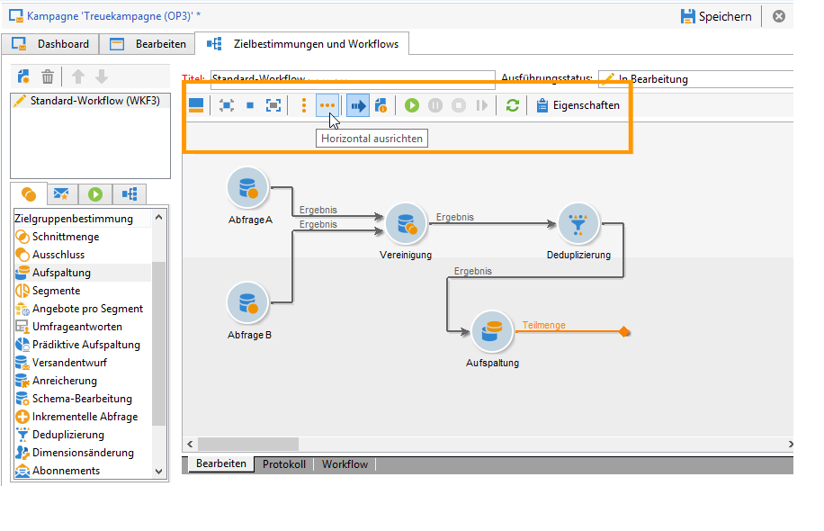

>[!NOTE]
>
>Die zur Erstellung des Workflow-Diagramms verfügbaren Aktivitäten sowie alle Anzeige- und Layoutfunktionalitäten werden im Handbuch [Automatisierung mithilfe von Workflows](../../workflow/using/architecture.md) dargestellt.

Sie können mehrere Zielgruppen-Workflows für eine einzelne Kampagne erstellen. So fügen Sie einen Workflow hinzu:

1. Positionieren Sie den Mauszeiger im linken oberen Abschnitt des Workflow-Editors, machen Sie einen Rechtsklick und wählen Sie **[!UICONTROL Hinzufügen]** aus. Sie können auch die Schaltfläche **[!UICONTROL Neu]** oberhalb dieses Bereichs nutzen.

   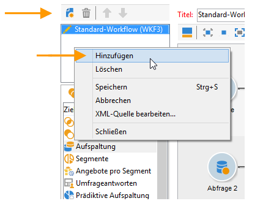

1. Wählen Sie die Workflow-Vorlage **[!UICONTROL Neuer Workflow]** aus und benennen Sie den Workflow.
1. Klicken Sie auf **[!UICONTROL OK]**, um die Workflow-Erstellung zu bestätigen, und entwerfen Sie das Diagramm des Workflows.

### Ausführen eines Workflows {#executing-a-workflow}

Benutzer mit entsprechenden Berechtigungen können Zielgruppen-Workflows manuell über die Schaltfläche **[!UICONTROL Starten]** in der Symbolleiste ausführen.

Die Zielgruppenbestimmung kann so konfiguriert werden, dass sie entsprechend einer Planungsaktivität (Planungsassistent) oder abhängig von einem Ereignis (externes Signal, Dateiimport usw.) automatisch ausgeführt wird.

Aktionen im Zusammenhang mit der Ausführung des Zielgruppen-Workflows (Start, Stopp, Pause usw.) sind **asynchrone** Prozesse: Der Befehl wird gespeichert und wird wirksam, sobald der Server für die Anwendung verfügbar ist.

Über die Symbolleiste hingegen kann die Ausführung des Zielgruppen-Workflows unmittelbar gesteuert werden.

* Starten oder neu starten

   * Über **[!UICONTROL Symbol]** Starten“ können Sie den Zielgruppenbestimmungs-Workflow starten. Wenn Sie auf dieses Symbol klicken, werden alle Aktivitäten ohne Eingabeübergang aktiviert (mit Ausnahme von Endpunktsprüngen).

     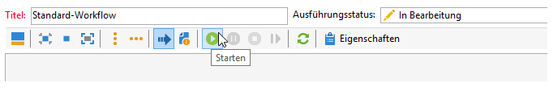

     Die Anfrage wird vom Server erfasst, was sich im Ausführungsstatus widerspiegelt:

     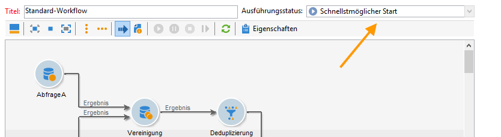

     Anschließend wechselt der Prozessstatus auf **[!UICONTROL Gestartet]**.

   * Sie können den Zielgruppen-Workflow über das entsprechende Symbol der Menüleiste neu starten. Dieser Befehl kann besonders dann nützlich sein, wenn das Symbol **[!UICONTROL Starten]** nicht verfügbar ist, beispielsweise wenn der Workflow gerade angehalten wird. Klicken Sie in diesem Fall auf das Symbol **[!UICONTROL Neu starten]**, um den Neustart vorzuziehen. Diese Anfrage wird daraufhin vom Server erfasst, wie am Ausführungsstatus zu erkennen ist:

     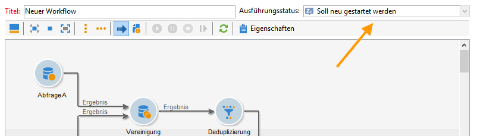

     Anschließend wechselt der Prozessstatus auf **[!UICONTROL Gestartet]**.

* Anhalten oder aussetzen

   * Über die Symbolleiste kann die Ausführung des Zielgruppen-Workflows angehalten oder ausgesetzt werden.

     Bei Klick auf das Symbol **[!UICONTROL Aussetzen]** werden laufende Prozesse **[!UICONTROL nicht]** abgebrochen, es wird jedoch bis zum Neustart keine andere Aktivität gestartet.

     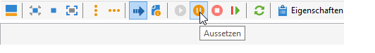

     Die Anfrage wird vom Server erfasst und vom Ausführungsstatus angezeigt:

     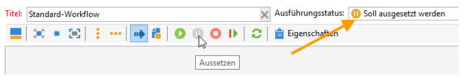

     Ein Zielgruppen-Workflow kann auch automatisch ausgesetzt werden, wenn die Ausführung eine bestimmte Aktivität erreicht: Klicken Sie dazu mit der rechten Maustaste auf die Aktivität, ab der der Zielgruppen-Workflow ausgesetzt werden soll, und wählen Sie **[!UICONTROL Aktivieren, aber nicht ausführen]**.

     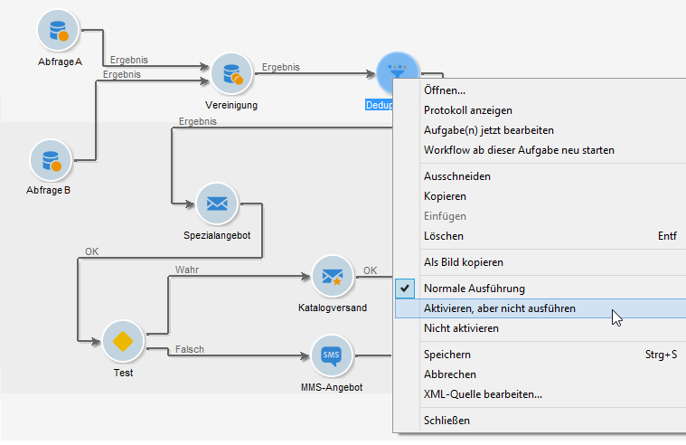

     Die Konfiguration wird von einem spezifischen Symbol in der Grafik repräsentiert.

     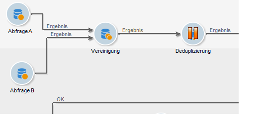

     >[!NOTE]
     >
     >Diese Option erweist sich insbesondere in Entwurfs- und Testphasen einer Zielgruppenbestimmung als nützlich.

     Klicken Sie auf **[!UICONTROL Starten]**, um die Ausführung wieder aufzunehmen.

   * Klicken Sie auf das Symbol **[!UICONTROL Anhalten]**, um die Ausführung zu stoppen.

     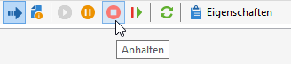

     Die Anfrage wird vom Server erfasst und vom Ausführungsstatus angezeigt:

     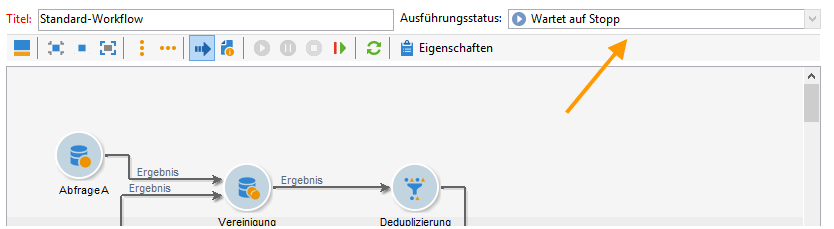

  Ein Zielgruppen-Workflow kann auch automatisch angehalten werden, wenn die Ausführung eine bestimmte Aktivität erreicht: Klicken Sie dazu mit der rechten Maustaste auf die Aktivität, von der aus der Zielgruppen-Workflow gestoppt werden soll, und wählen Sie **[!UICONTROL Nicht aktivieren]**.

  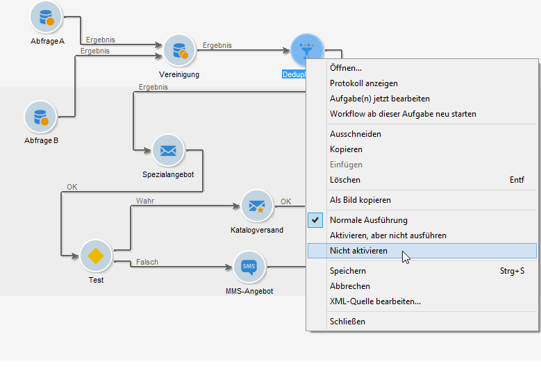

  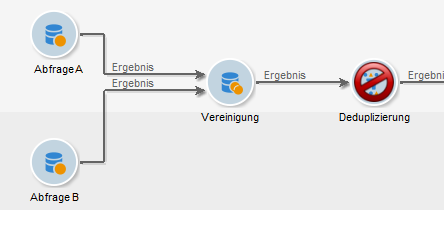

  Die Konfiguration wird von einem spezifischen Symbol in der Grafik repräsentiert.

  >[!NOTE]
  >
  >Diese Option erweist sich insbesondere in Entwurfs- und Testphasen einer Zielgruppenbestimmung als nützlich.

* Unbedingter Stopp

  Wählen Sie im Explorer **[!UICONTROL Administration > Betreibung > Automatisch erstellte Objekte > Kampagnen-Workflows]** aus, um auf einen beliebigen Campaign-Workflow zuzugreifen und diesen zu steuern.

  Sie können Ihren Workflow bedingungslos stoppen, indem Sie auf das Symbol **[!UICONTROL Aktionen]** klicken und **[!UICONTROL Bedingungsloser]** Stopp auswählen. Mit dieser Aktion wird Ihr Kampagnen-Workflow beendet.

  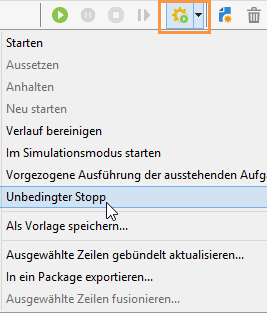

  >[!CAUTION]
  >
  >„Unbedingter Stopp“ steht nur Admins zur Verfügung.

## Hinzufügen einer Kontrollgruppe {#defining-a-control-group}

Bei der Kontrollgruppe handelt es sich um eine Population, die den Versand nicht erhält. Sie erlaubt es, Verhaltensunterschiede im Vergleich zu den Empfängern der Zielgruppe, die den Versand erhält, und somit die Auswirkungen einer Kampagne zu messen.

Die Kontrollgruppe kann aus der Hauptzielgruppe extrahiert werden und/oder aus einer speziellen Abfrage hervorgehen.

### Aktivieren der Kontrollgruppe für eine Kampagne {#activating-the-control-group-for-a-campaign}

Sie können eine Kontrollgruppe auf Kampagnenebene erstellen: In letzterem Fall wird die erstellte Kontrollgruppe für alle Sendungen der betreffenden Kampagne angewandt.

1. Bearbeiten Sie die betreffende Kampagne; klicken Sie dazu auf den Tab **[!UICONTROL Bearbeiten]**.
1. Klicken Sie auf **[!UICONTROL Erweiterte Kampagnenparameter]**.

   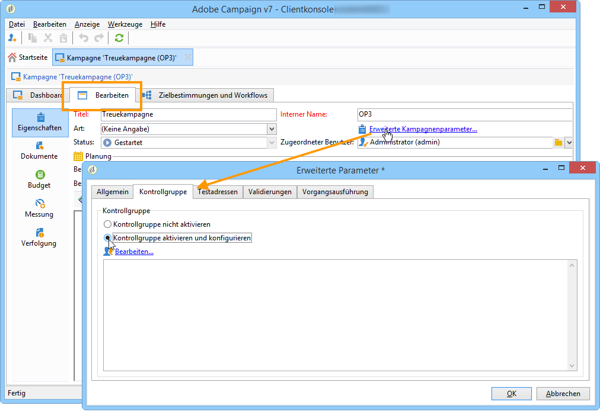

1. Wählen Sie die Option **[!UICONTROL Kontrollgruppe aktivieren und konfigurieren]**.
1. Klicken Sie auf **[!UICONTROL Bearbeiten...]**, um die Kontrollgruppe zu konfigurieren.

   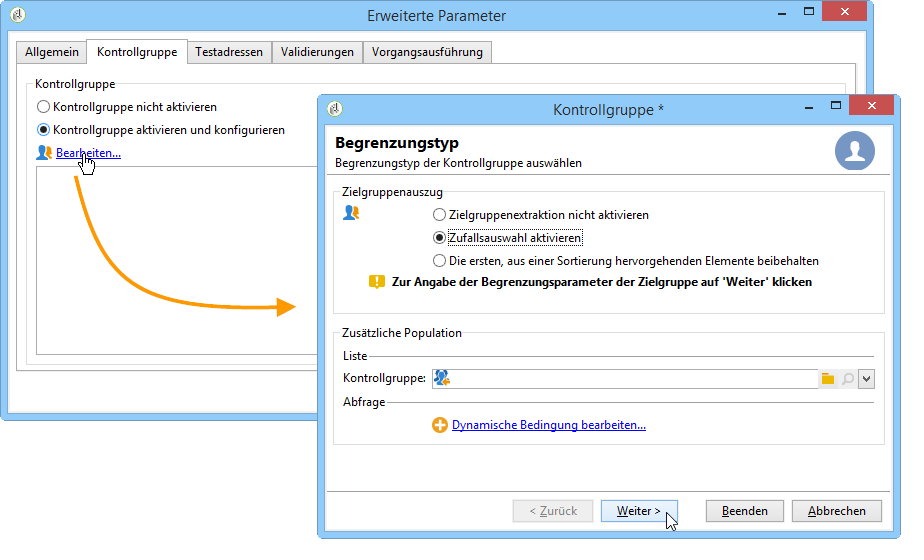

Das Konfigurationsverfahren wird unter [Extraktion der Kontrollgruppe aus der Hauptzielgruppe](#extracting-the-control-group-from-the-main-target) und [Hinzufügen einer Kontrollgruppe &#x200B;](#adding-a-population) beschrieben.

### Aktivieren der Kontrollgruppe für einen Versand {#activating-the-control-group-for-a-delivery}

Sie können eine Kontrollgruppe auf Versandebene erstellen: In letzterem Fall wird die erstellte Kontrollgruppe für alle Sendungen der betreffenden Kampagne angewandt.

Standardmäßig gilt die auf Kampagnenebene definierte Kontrollgruppenkonfiguration für jeden Versand dieser Kampagne. Sie können die Kontrollgruppe jedoch für einen einzelnen Versand anpassen.

>[!NOTE]
>
>Wenn Sie eine Kontrollgruppe für eine Kampagne bestimmt haben und eine andere für einen Versand dieser Kampagne konfigurieren, so wird nur die für den Versand bestimmte Kontrollgruppe angewandt.

1. Bearbeiten Sie den betreffenden Versand und klicken Sie auf den Link **[!UICONTROL An]** des Abschnitts **[!UICONTROL E-Mail-Parameter]**.

   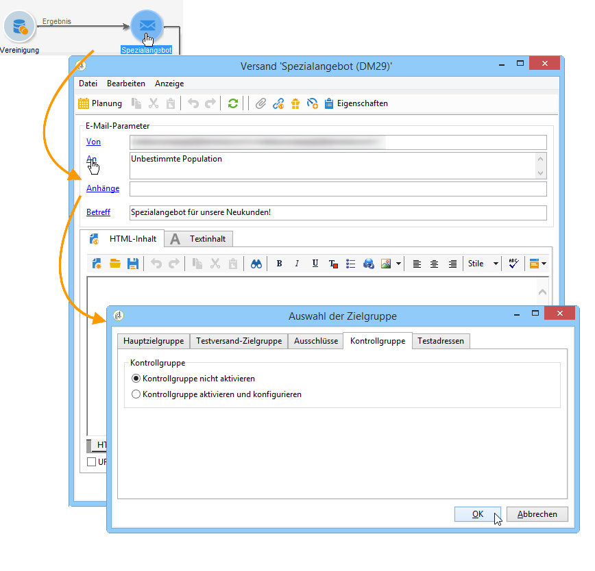

1. Klicken Sie auf die Registerkarte **[!UICONTROL Kontrollgruppe]** und wählen Sie dann **[!UICONTROL Kontrollgruppe aktivieren und konfigurieren]**.
1. Klicken Sie auf **[!UICONTROL Bearbeiten...]**, um die Kontrollgruppe zu konfigurieren.

Das Konfigurationsverfahren wird unter [Extraktion der Kontrollgruppe aus der Hauptzielgruppe](#extracting-the-control-group-from-the-main-target) und [Hinzufügen einer Kontrollgruppe &#x200B;](#adding-a-population) beschrieben.

### Extrahieren der Kontrollgruppe aus der Hauptzielgruppe {#extracting-the-control-group-from-the-main-target}

Sie können Empfänger aus der Hauptzielgruppe des Versands extrahieren. In diesem Fall werden die Empfangenden aus der Zielgruppe der von dieser Konfiguration betroffenen Versandaktionen übernommen. Diese Extraktion kann zufällig oder durch Sortieren der Empfangenden erfolgen.

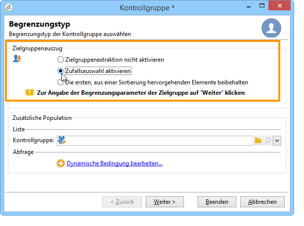

Um eine Kontrollgruppe zu extrahieren, aktivieren Sie diese auf Kampagnen- oder Versandniveau und wählen Sie eine der folgenden Optionen: **[!UICONTROL Zufallsauswahl aktivieren]** oder **[!UICONTROL Die ersten, aus einer Sortierung hervorgehenden Elemente beibehalten]**.

* **[!UICONTROL Zufallsauswahl aktivieren]** : Mit dieser Option wird eine Zufallsauswahl auf die Empfangenden in der Zielpopulation angewendet. Wenn Sie dann den Schwellenwert auf 100 setzen, besteht die Kontrollgruppe aus 100 zufällig aus der Zielpopulation ausgewählten Empfangenden. Die Auswahl der Stichprobe hängt von der Datenbank-Engine ab.
* **[!UICONTROL Die ersten, aus einer Sortierung hervorgehenden Elemente beibehalten]**: Diese Option ermöglicht die Begrenzung der Kontrollgruppe nach einer oder mehreren Sortierreihenfolgen. Wenn Sie das Feld **[!UICONTROL Alter]** als Sortierkriterium wählen und dann 100 als Schwellenwert definieren, setzt sich die Kontrollgruppe aus den 100 jüngsten Empfangenden zusammen. Es könnte zum Beispiel interessant sein, eine Kontrollgruppe zu definieren, die nur Empfangende umfasst, die wenige bzw. häufige Käufe tätigen, und ihr Verhalten mit dem der kontaktierten Empfangenden zu vergleichen.

Klicken Sie auf **[!UICONTROL Weiter]**, um (bei Bedarf) die Sortierreihenfolge festzulegen und die Empfängerbegrenzung zu bestimmen.

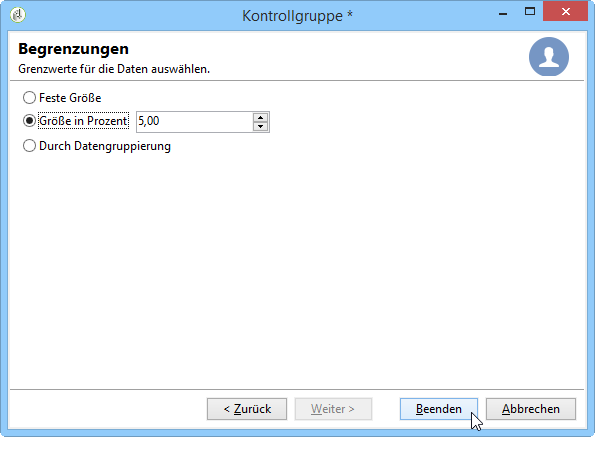

Diese Konfiguration entspricht der Freigabeaktivität im Workflow, mit der Sie die Zielgruppe in Teilmengen aufteilen können. Die Kontrollgruppe ist eine dieser Teilmengen. Weitere Informationen hierzu finden Sie in [diesem Abschnitt](../../workflow/using/architecture.md).

### Verwenden einer neuen Population als Kontrollgruppe {#adding-a-population}

Sie können eine neue Population definieren, die als Kontrollgruppe verwendet werden soll. Diese Population kann aus einer Empfängergruppe stammen oder über eine bestimmte Abfrage erstellt werden.

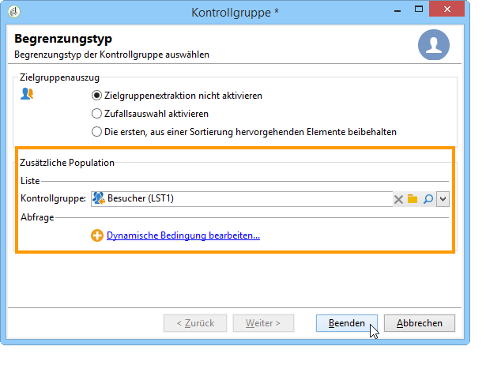

>[!NOTE]
>
>Der Abfrage-Editor von Adobe Campaign wird in [diesem Abschnitt](../../workflow/using/query.md) beschrieben.

#### Anleitungsvideo {#create-email-video}

In diesem Video wird das Erstellen einer Kampagne und einer E-Mail in Adobe Campaign beschrieben.

>[!VIDEO](https://video.tv.adobe.com/v/25604?quality=12)

Weitere Anleitungsvideos zu Campaign finden Sie [hier](https://experienceleague.adobe.com/docs/campaign-classic-learn/tutorials/overview.html?lang=de).
