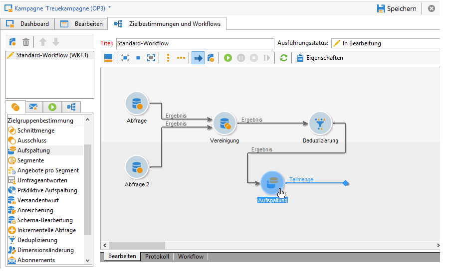
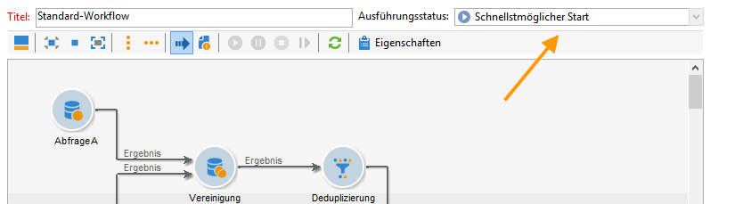
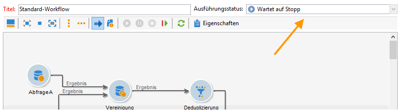
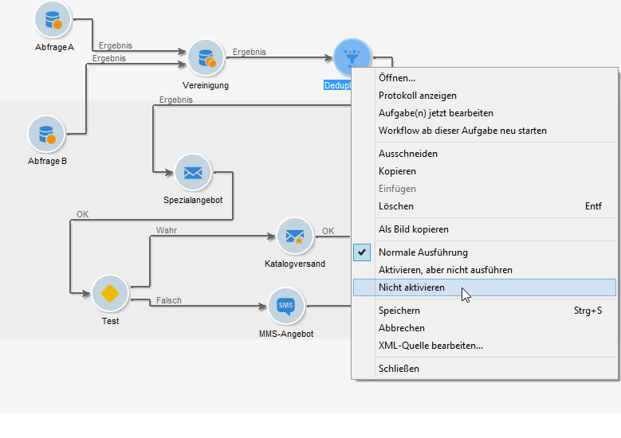
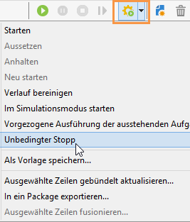
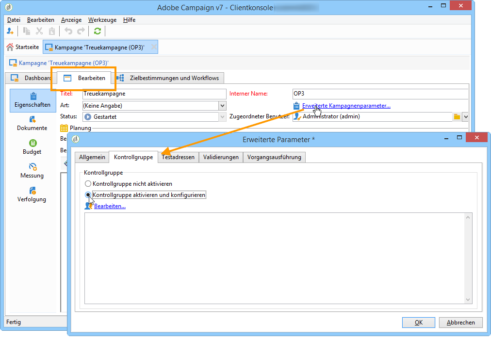
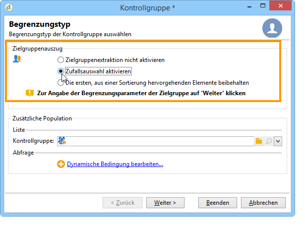

# Auswählen der Audience für Ihre Kampagnen {#marketing-campaign-deliveries}

In einer Marketing-Kampagne können Sie für jeden Versand Folgendes definieren:

* Die Audience: Erfahren Sie mehr über das [Erstellen der Audience in einem Workflow](#building-the-main-target-in-a-workflow) und das [Auswählen der Zielpopulation](#selecting-the-target-population).
* Eine Kontrollgruppe: Weitere Informationen finden Sie in [diesem Abschnitt](#defining-a-control-group).
* Testadressen: Weitere Informationen finden Sie in [diesem Abschnitt](../../delivery/using/about-seed-addresses.md).

Einige dieser Informationen werden von der [Kampagnenvorlage](../../campaign/using/marketing-campaign-templates.md#campaign-templates) übernommen.

Um die Versandzielgruppe zu erstellen, können Sie Filterkriterien für die Empfänger in der Datenbank definieren. Dieser Auswahlmodus für Empfänger wird in [diesem Abschnitt](../../delivery/using/steps-defining-the-target-population.md) vorgestellt.

## Versand an eine Gruppe

Sie haben die Möglichkeit, eine Population in eine Liste zu importieren und diese Liste als Zielgruppe eines Versands zu verwenden. Gehen Sie dazu wie folgt vor:

1. Bearbeiten Sie hierzu den betreffenden Versand und klicken Sie auf den Link **[!UICONTROL An]**, um die Zielpopulation zu ändern.

1. Markieren Sie im Tab **[!UICONTROL Hauptzielgruppe]** die Option **[!UICONTROL Von der Datenbank ausgehend bestimmt]** und klicken Sie auf **[!UICONTROL Hinzufügen]**, um Empfänger auszuwählen.

1. Wählen Sie **[!UICONTROL Empfängerliste]** aus und klicken Sie auf **[!UICONTROL Weiter]**, um sie auszuwählen.

## Erstellen der Audience in einem Campaign-Workflow {#building-the-main-target-in-a-workflow}

Die Hauptzielgruppe eines Versands kann auch über einen Campaign-Workflow definiert werden: Die grafische Umgebung ermöglicht die Erstellung einer Zielgruppe mithilfe von Abfragen, Tests und Funktionen wie Vereinigungen, Deduplizierungen, Aufspaltungen usw.

>[!IMPORTANT]
>
>Sie können einer Kampagne nicht mehr als 28 Workflows hinzufügen. Jenseits dieses Grenzwerts werden keine zusätzlichen Workflows mehr in der Benutzeroberfläche angezeigt und können Fehler hervorrufen.

### Erstellen eines Workflows {#creating-a-targeting-workflow}

Die Zielgruppenbestimmung kann mithilfe einer Kombination von Filterbedingungen in einer grafischen Abfolge in einem Workflow erfolgen. Sie können Populationen und Unterpopulationen erstellen, die entsprechend Ihren Anforderungen angesprochen werden. Um den Workflow-Editor anzuzeigen, klicken Sie im Campaign-Dashboard auf die Registerkarte **[!UICONTROL Zielgruppenbestimmung und Workflows]**.

Die Zielpopulation wird über eine oder mehrere in einem Workflow platzierte Abfragen aus der Adobe Campaign-Datenbank extrahiert. Informationen zum Erstellen einer Abfrage finden Sie unter [diesem Abschnitt](../../workflow/using/query.md).

Sie können Abfragen starten und die resultierenden Populationen über Aktivitäten wie Vereinigung, Schnittmenge, Aufspaltung, Ausschluss weiter einschränken oder vergrößern.

Wählen Sie die gewünschten Aktivitäten aus den links vom Arbeitsbereich liegenden Menüs aus und reihen Sie diese aneinander, um die Zielgruppe zu erstellen.

Verbinden Sie die zur Zielgruppenerstellung notwendigen Zielbestimmungs- und Steuerungsaktivitäten im Diagramm miteinander: Sie können die Zielgruppenbestimmung bereits während ihrer Erstellung ausführen, um die aus der Datenbank extrahierte Population zu überprüfen.

>[!NOTE]
>
>Beispiele und Anleitungen zum Definieren von Abfragen finden Sie in [diesem Abschnitt](../../workflow/using/query.md).

Im linken Bereich des Editors befindet sich eine Bibliothek grafischer Objekte, die Aktivitäten repräsentieren. Der erste Tab enthält Aktivitäten zur Zielgruppenbestimmung, der zweite Aktivitäten zur Steuerung. Letztere werden gelegentlich zur Koordinierung der Zielgruppenbestimmungs-Aktivitäten verwendet.

Über die Symbolleiste des Workflow-Editors besteht Zugriff auf Funktionen zur Formatierung und Ausführung des Zielgruppen-Workflows.

>[!NOTE]
>
>Die zur Erstellung des Workflow-Diagramms verfügbaren Aktivitäten sowie alle Anzeige- und Layoutfunktionalitäten werden im Handbuch [Automatisierung mithilfe von Workflows](../../workflow/using/architecture.md) dargestellt.

Es besteht die Möglichkeit, mehrere Zielgruppen-Workflows für eine einzelne Kampagne zu erstellen. Gehen Sie wie folgt vor, um einen Workflow hinzuzufügen:

1. Gehen Sie zum linken oberen Bereich des Workflow-Erstellungsbereichs, klicken Sie mit der rechten Maustaste darauf und wählen Sie **[!UICONTROL Hinzufügen]**. Sie können auch die **[!UICONTROL Neu]** oberhalb dieses Bereichs.

   

1. Wählen Sie die Workflow-Vorlage **[!UICONTROL Neuer Workflow]** aus und benennen Sie den Workflow.
1. Klicken Sie auf **[!UICONTROL OK]**, um die Workflow-Erstellung zu bestätigen, und entwerfen Sie das Diagramm des Workflows.

### Ausführen eines Workflows {#executing-a-workflow}

Benutzer mit entsprechenden Berechtigungen können Zielgruppen-Workflows manuell über die Schaltfläche **[!UICONTROL Starten]** in der Symbolleiste ausführen.

Die Zielgruppenbestimmung kann so konfiguriert werden, dass sie entsprechend einer Planungsaktivität (Planungsassistent) oder abhängig von einem Ereignis (externes Signal, Dateiimport usw.) automatisch ausgeführt wird.

Die Aktionen im Zusammenhang mit der Ausführung des Zielgruppen-Workflows (Start, Stopp, Pause etc.) are **asynchron** Prozesse: Der Befehl wird gespeichert und wird ausgeführt, sobald der Server verfügbar ist, um ihn anzuwenden.

Über die Symbolleiste hingegen kann die Ausführung des Zielgruppen-Workflows unmittelbar gesteuert werden.

* Starten oder neu starten

   * Bei Klick auf das Symbol **[!UICONTROL Starten]** werden alle Aktivitäten des Zielgruppen-Workflows aktiviert, die über keine eingehende Verbindung verfügen (außer Sprünge vom Typ &quot;Ziel&quot;).

     

     Die Anfrage wird vom Server erfasst, was sich im Ausführungsstatus widerspiegelt:

     

     Anschließend wechselt der Prozessstatus auf **[!UICONTROL Gestartet]**.

   * Sie können den Zielgruppen-Workflow über das entsprechende Symbolleistensymbol neu starten. Dieser Befehl kann nützlich sein, wenn die Variable **[!UICONTROL Starten]** -Symbol nicht verfügbar ist, z. B. wenn der Workflow zur Zielgruppenbestimmung angehalten wird. Klicken Sie in diesem Fall auf die **[!UICONTROL Neu starten]** -Symbol, um den Neustart vorherzusehen. Der Server berücksichtigt die Anfrage, da ihr Status Folgendes anzeigt:

     

     Anschließend wechselt der Prozessstatus auf **[!UICONTROL Gestartet]**.

* Anhalten oder aussetzen

   * Über die Symbolleiste kann die Ausführung des Zielgruppen-Workflows angehalten oder ausgesetzt werden.

     Bei Klick auf das Symbol **[!UICONTROL Aussetzen]** werden laufende Prozesse **[!UICONTROL nicht]** abgebrochen, es wird jedoch bis zur Wiederaufnahme keine andere Aktivität gestartet.

     

     Die Anfrage wird vom Server erfasst und vom Ausführungsstatus angezeigt:

     

     Sie können einen Zielgruppen-Workflow auch automatisch anhalten, wenn die Ausführung eine bestimmte Aktivität erreicht. Klicken Sie dazu mit der rechten Maustaste auf die Aktivität, ab der der Zielgruppen-Workflow ausgesetzt werden soll, und wählen Sie **[!UICONTROL Aktivieren, aber nicht ausführen]**.

     

     Die Konfiguration wird von einem spezifischen Symbol in der Grafik repräsentiert.

     

     >[!NOTE]
     >
     >Diese Option erweist sich insbesondere in Entwurfs- und Testphasen einer Zielbestimmung als nützlich.

     Klicken Sie auf **[!UICONTROL Starten]**, um die Ausführung wieder aufzunehmen.

   * Klicken Sie auf das Symbol **[!UICONTROL Anhalten]**, um die Ausführung zu stoppen.

     

     Die Anfrage wird vom Server erfasst und vom Ausführungsstatus angezeigt:

     

  Ein Zielgruppen-Workflow kann auch automatisch angehalten werden, wenn die Ausführung eine Aktivität erreicht. Klicken Sie dazu mit der rechten Maustaste auf die Aktivität, von der aus der Zielgruppen-Workflow gestoppt werden soll, und wählen Sie **[!UICONTROL Nicht aktivieren]**.

  

  

  Die Konfiguration wird von einem spezifischen Symbol in der Grafik repräsentiert.

  >[!NOTE]
  >
  >Diese Option erweist sich insbesondere in Entwurfs- und Testphasen einer Zielbestimmung als nützlich.

* Unbedingter Stopp

  Wählen Sie im Explorer **[!UICONTROL Administration > Betreibung > Automatisch erstellte Objekte > Kampagnen-Workflows]** aus, um auf einen beliebigen Campaign-Workflow zuzugreifen und diesen zu steuern.

  Sie können Ihren Workflow stoppen, indem Sie das Symbol **[!UICONTROL Aktionen]** und danach **[!UICONTROL Unbedingter Stopp]** auswählen. Damit wird Ihr Kampagnen-Workflow sofort angehalten.

  

## Hinzufügen einer Kontrollgruppe {#defining-a-control-group}

Bei der Kontrollgruppe handelt es sich um eine Population, die den Versand nicht erhält. Sie erlaubt es, Verhaltensunterschiede im Vergleich zu den Empfängern der Zielgruppe, die den Versand erhält, und somit die Auswirkungen einer Kampagne zu messen.

Die Kontrollgruppe kann aus der Hauptzielgruppe extrahiert werden und/oder aus einer speziellen Abfrage hervorgehen.

### Aktivieren der Kontrollgruppe für eine Kampagne {#activating-the-control-group-for-a-campaign}

Sie können eine Kontrollgruppe auf Kampagnenebene erstellen: In letzterem Fall wird die erstellte Kontrollgruppe für alle Sendungen der betreffenden Kampagne angewandt.

1. Bearbeiten Sie die betreffende Kampagne; klicken Sie dazu auf den Tab **[!UICONTROL Bearbeiten]**.
1. Klicken Sie auf **[!UICONTROL Erweiterte Kampagnenparameter]**.

   

1. Wählen Sie die Option **[!UICONTROL Kontrollgruppe aktivieren und konfigurieren]**.
1. Klicken Sie auf **[!UICONTROL Bearbeiten...]**, um die Kontrollgruppe zu konfigurieren.

   

Das Konfigurationsverfahren wird unter [Extraktion der Kontrollgruppe aus der Hauptzielgruppe](#extracting-the-control-group-from-the-main-target) und [Hinzufügen einer Kontrollgruppe ](#adding-a-population) beschrieben.

### Aktivieren der Kontrollgruppe für einen Versand {#activating-the-control-group-for-a-delivery}

Sie können eine Kontrollgruppe auf Versandebene erstellen: In letzterem Fall wird die erstellte Kontrollgruppe für alle Sendungen der betreffenden Kampagne angewandt.

Die in einer Kampagne vorgenommene Konfiguration einer Kontrollgruppe gilt standardmäßig für jeden Versand dieser Kampagne. Sie kann jedoch für einzelne Sendungen angepasst werden.

>[!NOTE]
>
>Wenn Sie eine Kontrollgruppe für eine Kampagne bestimmt haben und eine andere für einen Versand dieser Kampagne konfigurieren, so wird nur die für den Versand bestimmte Kontrollgruppe angewandt.

1. Bearbeiten Sie den betreffenden Versand und klicken Sie auf den Link **[!UICONTROL An]** des Abschnitts **[!UICONTROL E-Mail-Parameter]**.

   

1. Klicken Sie auf den Tab **[!UICONTROL Kontrollgruppe]** und wählen Sie dann **[!UICONTROL Kontrollgruppe aktivieren und konfigurieren]**.
1. Klicken Sie auf **[!UICONTROL Bearbeiten...]**, um die Kontrollgruppe zu konfigurieren.

Das Konfigurationsverfahren wird unter [Extraktion der Kontrollgruppe aus der Hauptzielgruppe](#extracting-the-control-group-from-the-main-target) und [Hinzufügen einer Kontrollgruppe ](#adding-a-population) beschrieben.

### Extrahieren der Kontrollgruppe aus der Hauptzielgruppe {#extracting-the-control-group-from-the-main-target}

Sie haben die Möglichkeit, Empfänger der Hauptzielgruppe eines Versands zu extrahieren: Die Empfänger werden in diesem Fall von der Zielgruppe der von dieser Konfiguration betroffenen Versandaktionen abgezogen. Diese Extraktion kann zufällig oder durch Sortierung der Empfänger erfolgen.

Um eine Kontrollgruppe zu extrahieren, aktivieren Sie diese auf Kampagnen- oder Versandniveau und wählen Sie eine der folgenden Optionen: **[!UICONTROL Zufallsauswahl aktivieren]** oder **[!UICONTROL Die ersten, aus einer Sortierung hervorgehenden Elemente beibehalten]**.

* **[!UICONTROL Zufallsauswahl aktivieren]**: Diese Option wendet eine Zufallsauswahl auf die Empfänger der Zielgruppe an. Wenn Sie anschließend einen Grenzwert von 100 festlegen, wird die Kontrollgruppe aus 100 zufällig aus der Zielgruppe ausgewählten Empfängern zusammengesetzt. Die angewandte Zufallsauswahl hängt von der Datenbank-Engine ab.
* **[!UICONTROL Nur die ersten Datensätze nach der Sortierung beibehalten]** : Mit dieser Option können Sie eine Begrenzung festlegen, die auf einer oder mehreren Sortierreihenfolgen basiert. Wenn Sie das Feld **[!UICONTROL Alter]** als Sortierkriterium wählen und dann 100 als Schwellenwert definieren, setzt sich die Kontrollgruppe aus den 100 jüngsten Empfangenden zusammen. Es könnte zum Beispiel interessant sein, eine Kontrollgruppe zu definieren, die nur Empfangende umfasst, die wenige bzw. häufige Käufe tätigen, und ihr Verhalten mit dem der kontaktierten Empfangenden zu vergleichen.

Klicken Sie auf **[!UICONTROL Weiter]**, um (bei Bedarf) die Sortierreihenfolge festzulegen und die Empfängerbegrenzung zu bestimmen.

Diese Konfiguration entspricht einer Teilungsaktivität im Workflow, mit der die Zielgruppe in Teilmengen unterteilt werden kann. Die Kontrollgruppe ist eine dieser Teilmengen. Siehe Abschnitt [diesem Abschnitt](../../workflow/using/architecture.md) für weitere Informationen.

### Verwenden einer neuen Population als Kontrollgruppe {#adding-a-population}

Sie können eine neue, als Kontrollgruppe zu verwendende Population bestimmen. Diese Population kann aus einer Gruppe von Empfängern oder aus einer spezifischen Abfrage hervorgehen.

>[!NOTE]
>
>Der Abfrageeditor von Adobe Campaign wird in [diesem Abschnitt](../../workflow/using/query.md) beschrieben.

#### Anleitungsvideo {#create-email-video}

In diesem Video wird das Erstellen einer Kampagne und einer E-Mail in Adobe Campaign beschrieben.

>[!VIDEO](https://video.tv.adobe.com/v/25604?quality=12)

Weitere Anleitungsvideos zu Campaign finden Sie [hier](https://experienceleague.adobe.com/docs/campaign-classic-learn/tutorials/overview.html?lang=de).
