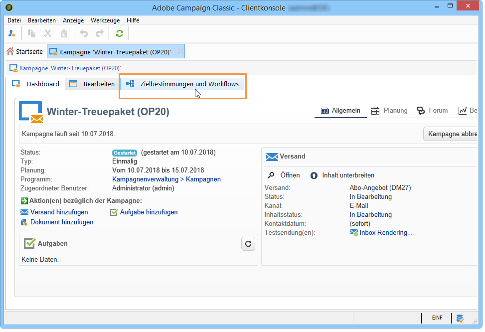
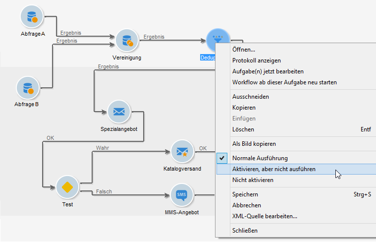
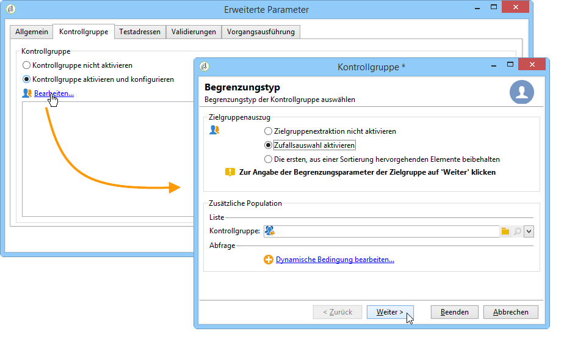
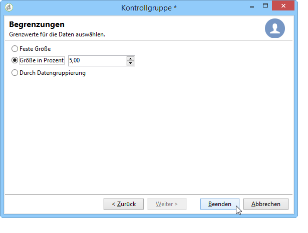
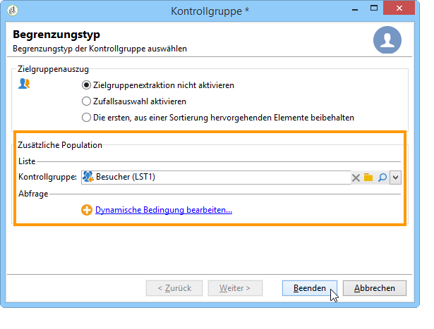

# Wählen Sie die Audience Ihrer Kampagnen {#marketing-campaign-deliveries}

In einer Marketing-Kampagne können Sie für jeden Versand Folgendes definieren:

* Die Audience: Erfahren Sie mehr über das [Erstellen der Audience in einem Workflow](#building-the-main-target-in-a-workflow) und das [Auswählen der Zielpopulation](#selecting-the-target-population).
* Eine Kontrollgruppe - Weitere Informationen finden Sie in [diesem Abschnitt](#defining-a-control-group).
* Testadressen: Weitere Informationen finden Sie in [diesem Abschnitt](../../delivery/using/about-seed-addresses.md).

Einige dieser Informationen können von der [Kampagnenvorlage](../../campaign/using/marketing-campaign-templates.md#campaign-templates) übernommen werden.

Um die Versandzielgruppe zu erstellen, können Sie Filterkriterien für die Empfänger in der Datenbank definieren. Dieser Auswahlmodus für Empfänger wird in [diesem Abschnitt](../../delivery/using/steps-defining-the-target-population.md) vorgestellt.

## An eine Gruppe senden

Sie haben die Möglichkeit, eine Population in eine Liste zu importieren und diese Liste als Zielgruppe eines Versands zu verwenden. Gehen Sie dazu wie folgt vor:

1. Bearbeiten Sie den betreffenden Versand und klicken Sie auf den Link **[!UICONTROL Bis]**, um die Zielgruppe zu ändern.

1. Markieren Sie im Tab **[!UICONTROL Hauptzielgruppe]** die Option **[!UICONTROL Von der Datenbank ausgehend bestimmt]** und klicken Sie auf **[!UICONTROL Hinzufügen]**, um Empfänger auszuwählen.

1. Wählen Sie **[!UICONTROL Empfängerliste]** aus und klicken Sie auf **[!UICONTROL Weiter]**, um sie auszuwählen.

## Erstellen Sie die Audience in einem Kampagne-Workflow {#building-the-main-target-in-a-workflow}

Die wichtigste Zielgruppe eines Versands kann auch im Arbeitsablauf für die Kampagne definiert werden: Mit dieser grafischen Umgebung können Sie eine Zielgruppe mithilfe von Abfragen, Tests und Operatoren erstellen: Vereinigung, Deduplizierung-Duplikate, Freigabe usw.

>[!IMPORTANT]
>
>Sie dürfen einer Kampagne nicht mehr als 28 Workflows hinzufügen. Jenseits dieses Grenzwerts werden keine zusätzlichen Workflows mehr in der Benutzeroberfläche angezeigt und können Fehler hervorrufen.

### Erstellen eines Workflows {#creating-a-targeting-workflow}

Die Zielgruppenbestimmung kann mithilfe einer Kombination von Filterkriterien erfolgen, die in einem Workflow grafisch verdeutlicht wird. So ist es möglich, je nach Bedarf Gruppen oder Untergruppen zu erstellen und als Zielpopulation zu verwenden. Klicken Sie zum Öffnen des Workflow-Editors auf den Tab **[!UICONTROL Zielbestimmungen und Workflows]** der entsprechenden Kampagne.

Die Zielpopulation wird über eine oder mehrere in einem Workflow platzierte Abfragen aus der Adobe-Campaign-Datenbank extrahiert. Weiterführende Informationen zum Erstellen einer Abfrage finden Sie in [diesem Abschnitt](../../workflow/using/query.md).

Sie können Abfragen starten und die resultierenden Populationen über Aktivitäten wie Vereinigung, Schnittmenge, Aufspaltung, Ausschluss weiter einschränken oder vergrößern.

Wählen Sie die gewünschten Aktivitäten aus den links vom Arbeitsbereich liegenden Menüs aus und reihen Sie diese aneinander, um die Zielgruppe zu erstellen.

Verbinden Sie die zur Zielgruppenerstellung notwendigen Zielbestimmungs- und Steuerungsaktivitäten im Diagramm miteinander: Sie können die Zielgruppenbestimmung bereits während ihrer Erstellung ausführen, um die aus der Datenbank extrahierte Population zu überprüfen.

>[!NOTE]
>
>Beispiele und Anleitungen zum Definieren von Abfragen finden Sie in [diesem Abschnitt](../../workflow/using/query.md).

Im linken Bereich des Editors befindet sich eine Bibliothek grafischer Objekte, die Aktivitäten repräsentieren. Der erste Tab enthält Aktivitäten zur Zielgruppenbestimmung, der zweite Aktivitäten zur Steuerung. Letztere werden gelegentlich zur Koordinierung der Zielgruppenbestimmungs-Aktivitäten verwendet.

Über die Symbolleiste des Workflow-Editors besteht Zugriff auf Funktionen zur Formatierung und Ausführung des Zielgruppen-Workflows.

>[!NOTE]
>
>Die zur Erstellung des Workflow-Diagramms verfügbaren Aktivitäten sowie alle Anzeige- und Layoutfunktionalitäten werden im Handbuch [Automatisierung mithilfe von Workflows](../../workflow/using/architecture.md) dargestellt.

Es besteht die Möglichkeit, mehrere Zielgruppen-Workflows für eine einzelne Kampagne zu erstellen. Gehen Sie wie folgt vor, um einen Workflow hinzuzufügen:

1. Positionieren Sie den Mauszeiger im linken oberen Abschnitt des Workflow-Editors, machen Sie einen Rechtsklick und wählen Sie **[!UICONTROL Hinzufügen]** aus. Sie können auch die Schaltfläche **[!UICONTROL Neu]** oberhalb dieses Bereichs nutzen.

   

1. Wählen Sie die Workflow-Vorlage **[!UICONTROL Neuer Workflow]** aus und benennen Sie den Workflow.
1. Klicken Sie auf **[!UICONTROL OK]**, um die Workflow-Erstellung zu bestätigen, und entwerfen Sie das Diagramm des Workflows.

### Ausführen eines Workflows{#executing-a-workflow}

Benutzer mit entsprechenden Berechtigungen können Zielgruppen-Workflows manuell über die Schaltfläche **[!UICONTROL Starten]** in der Symbolleiste ausführen.

Die Zielgruppenbestimmung kann so konfiguriert werden, dass sie entsprechend einer Planungsaktivität (Planungsassistent) oder abhängig von einem Ereignis (externes Signal, Dateiimport usw.) automatisch ausgeführt wird.

Bei Aktionen bezüglich der Ausführung des Zielgruppen-Workflows (Start, Stopp, Pause etc.) handelt es sich um **asynchrone** Prozesse: Der jeweilige Befehl wird gespeichert und wird ausgeführt, sobald der Server verfügbar ist.

Über die Symbolleiste hingegen kann die Ausführung des Zielgruppen-Workflows unmittelbar gesteuert werden.

* Starten oder neu starten

   * Bei Klick auf das Symbol **[!UICONTROL Starten]** werden alle Aktivitäten des Zielgruppen-Workflows aktiviert, die über keine eingehende Verbindung verfügen (außer Sprünge vom Typ &quot;Ziel&quot;).

      

      Die Anfrage wird vom Server erfasst, was sich im Ausführungsstatus widerspiegelt:

      

      Anschließend wechselt der Prozessstatus auf **[!UICONTROL Gestartet]**.

   * Sie können den Zielgruppen-Workflow über das entsprechende Symbol der Menüleiste neu starten. Dieser Befehl kann besonders dann nützlich sein, wenn das Symbol **[!UICONTROL Starten]** nicht verfügbar ist, beispielsweise wenn der Workflow gerade angehalten wird. Klicken Sie in diesem Fall auf das Symbol **[!UICONTROL Neu starten]**, um den Neustart vorzuziehen. Diese Anfrage wird daraufhin vom Server erfasst, wie am Ausführungsstatus zu erkennen ist:

      

      Anschließend wechselt der Prozessstatus auf **[!UICONTROL Gestartet]**.

* Anhalten oder aussetzen

   * Über die Symbolleiste kann die Ausführung des Zielgruppen-Workflows angehalten oder ausgesetzt werden.

      Bei Klick auf das Symbol **[!UICONTROL Aussetzen]** werden laufende Prozesse **[!UICONTROL nicht]** abgebrochen, es wird jedoch bis zur Wiederaufnahme keine andere Aktivität gestartet.

      

      Die Anfrage wird vom Server erfasst und vom Ausführungsstatus angezeigt:

      

      Ein Zielgruppen-Workflow kann auch automatisch ausgesetzt werden, wenn die Ausführung eine bestimmte Aktivität erreicht: Machen Sie hierzu einen Rechtsklick auf die Aktivität, ab der der Workflow ausgesetzt werden soll, und klicken Sie auf **[!UICONTROL Aktivieren, aber nicht ausführen]**.

      

      Die Konfiguration wird von einem spezifischen Symbol in der Grafik repräsentiert.

      

      >[!NOTE]
      >
      >Diese Option erweist sich insbesondere in Entwurfs- und Testphasen einer Zielbestimmung als nützlich.

      Klicken Sie auf **[!UICONTROL Starten]**, um die Ausführung wieder aufzunehmen.

   * Klicken Sie auf das Symbol **[!UICONTROL Anhalten]**, um die Ausführung zu stoppen.

      

      Die Anfrage wird vom Server erfasst und vom Ausführungsstatus angezeigt:

      
   Ein Zielgruppen-Workflow kann auch automatisch angehalten werden, wenn die Ausführung eine bestimmte Aktivität erreicht: Machen Sie hierzu einen Rechtsklick auf die Aktivität, ab der der Workflow angehalten werden soll, und klicken Sie auf **[!UICONTROL Nicht aktivieren]**.

   

   

   Die Konfiguration wird von einem spezifischen Symbol in der Grafik repräsentiert.

   >[!NOTE]
   >
   >Diese Option erweist sich insbesondere in Entwurfs- und Testphasen einer Zielbestimmung als nützlich.

* Unbedingter Stopp

   Wählen Sie im Explorer **[!UICONTROL Administration > Betreibung > Automatisch erstellte Objekte > Kampagnen-Workflows]** aus, um auf einen beliebigen Campaign-Workflow zuzugreifen und diesen zu steuern.

   Sie können Ihren Workflow stoppen, indem Sie das Symbol **[!UICONTROL Aktionen]** und danach **[!UICONTROL Unbedingter Stopp]** auswählen. Damit wird Ihr Kampagnen-Workflow sofort angehalten.

   

## hinzufügen einer Kontrollgruppe {#defining-a-control-group}

Bei der Kontrollgruppe handelt es sich um eine Population, die den Versand nicht erhält. Sie erlaubt es, Verhaltensunterschiede im Vergleich zu den Empfängern der Zielgruppe, die den Versand erhält, und somit die Auswirkungen einer Kampagne zu messen.

Die Kontrollgruppe kann aus der Hauptzielgruppe extrahiert werden und/oder aus einer speziellen Abfrage hervorgehen.

### Aktivieren der Kontrollgruppe für eine Kampagne {#activating-the-control-group-for-a-campaign}

Sie können eine Kontrollgruppe auf Kampagnenebene erstellen: In letzterem Fall wird die erstellte Kontrollgruppe für alle Sendungen der betreffenden Kampagne angewandt.

1. Bearbeiten Sie die betreffende Kampagne; klicken Sie dazu auf den Tab **[!UICONTROL Bearbeiten]**.
1. Klicken Sie auf **[!UICONTROL Erweiterte Kampagnenparameter]**.

   

1. Wählen Sie die Option **[!UICONTROL Kontrollgruppe aktivieren und konfigurieren]**.
1. Klicken Sie auf **[!UICONTROL Bearbeiten...]**, um die Kontrollgruppe zu konfigurieren.

   

Das Konfigurationsverfahren wird unter [Extraktion der Kontrollgruppe aus der Hauptzielgruppe](#extracting-the-control-group-from-the-main-target) und [Hinzufügen einer Kontrollgruppe ](#adding-a-population) beschrieben.

### Aktivieren der Kontrollgruppe für einen Versand {#activating-the-control-group-for-a-delivery}

Sie können eine Kontrollgruppe auf Versandebene erstellen: In letzterem Fall wird die erstellte Kontrollgruppe für alle Sendungen der betreffenden Kampagne angewandt.

Die in einer Kampagne vorgenommene Konfiguration einer Kontrollgruppe gilt standardmäßig für jeden Versand dieser Kampagne. Sie kann jedoch für einzelne Sendungen angepasst werden.

>[!NOTE]
>
>Wenn Sie eine Kontrollgruppe für eine Kampagne bestimmt haben und eine andere für einen Versand dieser Kampagne konfigurieren, so wird nur die für den Versand bestimmte Kontrollgruppe angewandt.

1. Bearbeiten Sie den betreffenden Versand und klicken Sie auf den Link **[!UICONTROL An]** des Abschnitts **[!UICONTROL E-Mail-Parameter]**.

   

1. Klicken Sie auf den Tab **[!UICONTROL Kontrollgruppe]** und wählen Sie dann **[!UICONTROL Kontrollgruppe aktivieren und konfigurieren]**.
1. Klicken Sie auf **[!UICONTROL Bearbeiten...]**, um die Kontrollgruppe zu konfigurieren..

Das Konfigurationsverfahren wird unter [Extraktion der Kontrollgruppe aus der Hauptzielgruppe](#extracting-the-control-group-from-the-main-target) und [Hinzufügen einer Kontrollgruppe ](#adding-a-population) beschrieben.

### Extrahieren Sie die Kontrollgruppe aus der Haupt-Zielgruppe {#extracting-the-control-group-from-the-main-target}

Sie haben die Möglichkeit, Empfänger der Hauptzielgruppe eines Versands zu extrahieren: Die Empfänger werden in diesem Fall von der Zielgruppe der von dieser Konfiguration betroffenen Versandaktionen abgezogen. Diese Extraktion kann zufällig oder durch Sortierung der Empfänger erfolgen.

Um eine Kontrollgruppe zu extrahieren, aktivieren Sie diese auf Kampagnen- oder Versandniveau und wählen Sie eine der folgenden Optionen: **[!UICONTROL Zufallsauswahl aktivieren]** oder **[!UICONTROL Die ersten, aus einer Sortierung hervorgehenden Elemente beibehalten]**.

* **[!UICONTROL Zufallsauswahl aktivieren]**: Diese Option wendet eine Zufallsauswahl auf die Empfänger der Zielgruppe an. Wenn Sie anschließend einen Grenzwert von 100 festlegen, wird die Kontrollgruppe aus 100 zufällig aus der Zielgruppe ausgewählten Empfängern zusammengesetzt. Die angewandte Zufallsauswahl hängt von der Datenbank-Engine ab.
* **[!UICONTROL Die ersten, aus einer Sortierung hervorgehenden Elemente beibehalten]**: Diese Option ermöglicht die Begrenzung der Kontrollgruppe nach einer oder mehreren Sortierreihenfolgen. Wenn Sie das Feld **[!UICONTROL Alter]** als Kriterium auswählen und anschließend einen Grenzwert von 100 angeben, wird die Kontrollgruppe aus den 100 jüngsten Empfängern zusammengesetzt. Es könnte sich zum Beispiel anbieten, eine Kontrollgruppe aus Kontakten zusammenzustellen, die besonders wenig oder besonders viele Einkäufe tätigen und diese mit dem Verhalten der kontaktierten Empfänger zu vergleichen.

Klicken Sie auf **[!UICONTROL Weiter]**, um (bei Bedarf) die Sortierreihenfolge festzulegen und die Empfängerbegrenzung zu bestimmen.

Diese Konfiguration entspricht der einer Aufspaltungsaktivität im Workflow, die die Unterteilung einer Zielgruppe in mehrere Teilmengen ermöglicht. Die Kontrollgruppe entspricht einer dieser Teilmengen. Weitere Informationen hierzu finden Sie in [diesem Abschnitt](../../workflow/using/architecture.md).

### Neue Population als Kontrollgruppe {#adding-a-population} verwenden

Sie können eine neue, als Kontrollgruppe zu verwendende Population bestimmen. Diese Population kann aus einer Gruppe von Empfängern oder aus einer spezifischen Abfrage hervorgehen.

>[!NOTE]
>
>Der Abfrageeditor von Adobe Campaign wird in [diesem Abschnitt](../../workflow/using/query.md) beschrieben.

#### Tutorial {#create-email-video}

In diesem Video wird das Erstellen einer Kampagne und einer E-Mail in Adobe Campaign erläutert.

>[!VIDEO](https://video.tv.adobe.com/v/25604?quality=12)

Weitere Anleitungsvideos zu Campaign finden Sie [hier](https://experienceleague.adobe.com/docs/campaign-classic-learn/tutorials/overview.html?lang=de).