# Erstellen und Konfigurieren von Kampagnenvorlagen {#campaign-templates}

Alle Marketing-Kampagnen basieren auf einer Vorlage, in der die Hauptmerkmale und -funktionen gespeichert sind. Kampagnenvorlagen werden im Knoten **[!UICONTROL Ressourcen > Vorlagen > Kampagnenvorlagen]** zentralisiert. Eine Standardvorlage wird standardmäßig bereitgestellt. Sie können eine neue Kampagne unter Verwendung aller verfügbaren Module (Dokumente, Aufgaben, Testadressen usw.) erstellen. Die angebotenen Module hängen jedoch von Ihren Rechten und der Konfiguration Ihrer Adobe Campaign-Plattform ab.

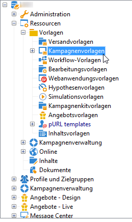

>[!NOTE]
>
>Um den Navigationsbaum anzuzeigen, klicken Sie auf das Symbol **[!UICONTROL Explorer]** auf der Startseite.

Es wird eine native Vorlage bereitgestellt, mit der Sie eine Kampagne erstellen können, für die keine bestimmte Konfiguration definiert wurde. Sie können Ihre Kampagnenvorlagen erstellen und konfigurieren und dann Kampagnen aus diesen Vorlagen erstellen.

 Weitere Informationen zur Erstellung von Kampagnen finden Sie in [diesem Video](../../campaign/using/marketing-campaign-deliveries.md#create-email-video).

## Erstellen einer Kampagnenvorlage {#creating-or-duplicating-a-campaign-template}

Gehen Sie wie folgt vor, um eine Kampagnenvorlage zu erstellen:

1. Öffnen Sie den Campaign-**Explorer**.
1. Klicken Sie in **Ressourcen > Vorlagen> Kampagnenvorlagen** auf die Option **Neu** in der Symbolleiste über der Liste mit Vorlagen.

   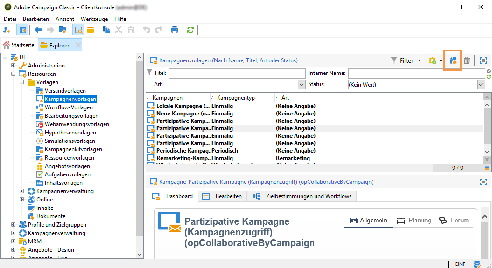

1. Geben Sie den Titel der neuen Kampagnenvorlage ein.
1. Klicken Sie auf **Speichern** und öffnen Sie die Vorlage erneut.
1. Füllen Sie bei Bedarf im **Bearbeiten**-Tab das Feld **Interner Name** aus und ergänzen Sie andere erforderliche Angaben.
1. Wählen Sie **Erweiterte Kampagnenparameter**, um Ihrer Kampagnenvorlage einen Workflow hinzuzufügen.

   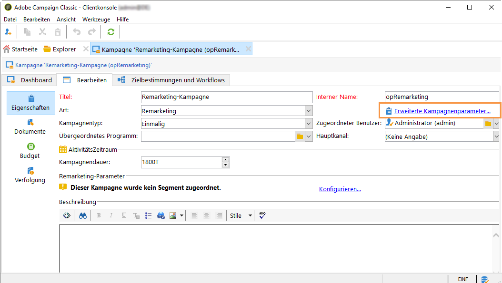

1. Ändern Sie den Wert für **Zielgruppenbestimmungen und Workflows** auf **Ja**.

   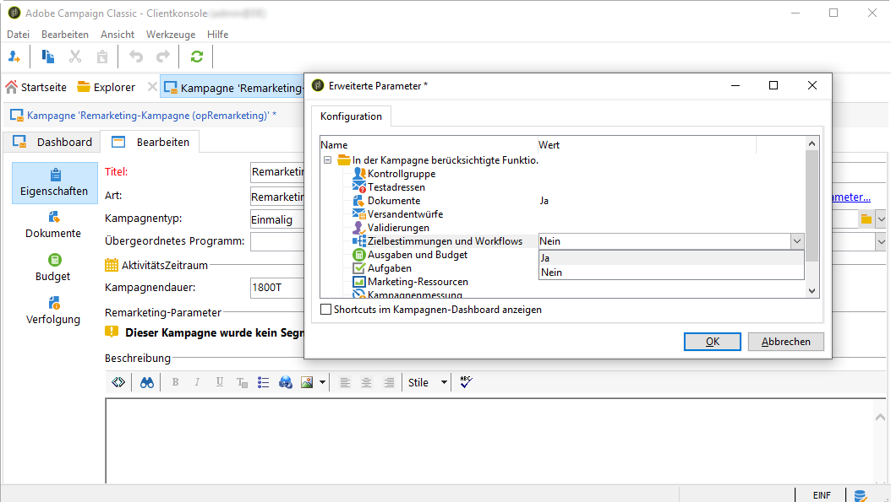

1. Klicken Sie im Tab **Zielgruppenbestimmungen und Workflows** auf die Option **Workflow hinzufügen...**.

   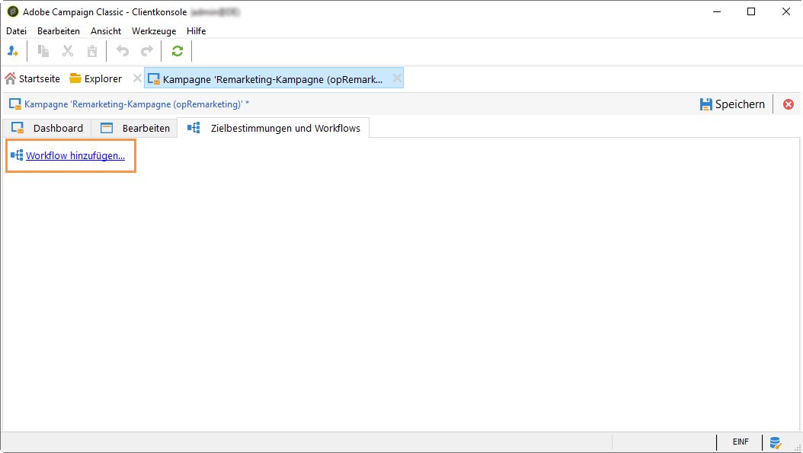

1. Füllen Sie das Feld **Titel** aus und klicken Sie auf **Ok**.
1. Erstellen Sie Ihren Workflow entsprechend Ihren Anforderungen.
1. Klicken Sie auf **Speichern**. Ihre Vorlage kann jetzt in einer Kampagne verwendet werden.

Es besteht auch die Möglichkeit, die Standardvorlage zu **duplizieren** und ihre Konfiguration zu verwenden und anzupassen.

Die unterschiedlichen Registerkarten und Unterregisterkarten der Kampagnenvorlage ermöglichen den Zugriff auf die Einstellungen. Sie werden im Abschnitt [Allgemeine Konfiguration](#general-configuration) beschrieben.

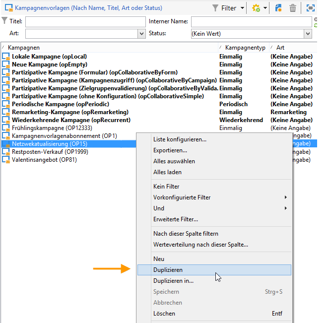

## Auswählen von Modulen {#select-modules}

Über den Link **[!UICONTROL Erweiterte Kampagnenparameter...]** können Sie Aufträge für die auf dieser Vorlage basierenden Kampagnen aktivieren und deaktivieren. Wählen Sie die Funktionen aus, die Sie in den über diese Vorlage erstellten Kampagnen aktivieren möchten.

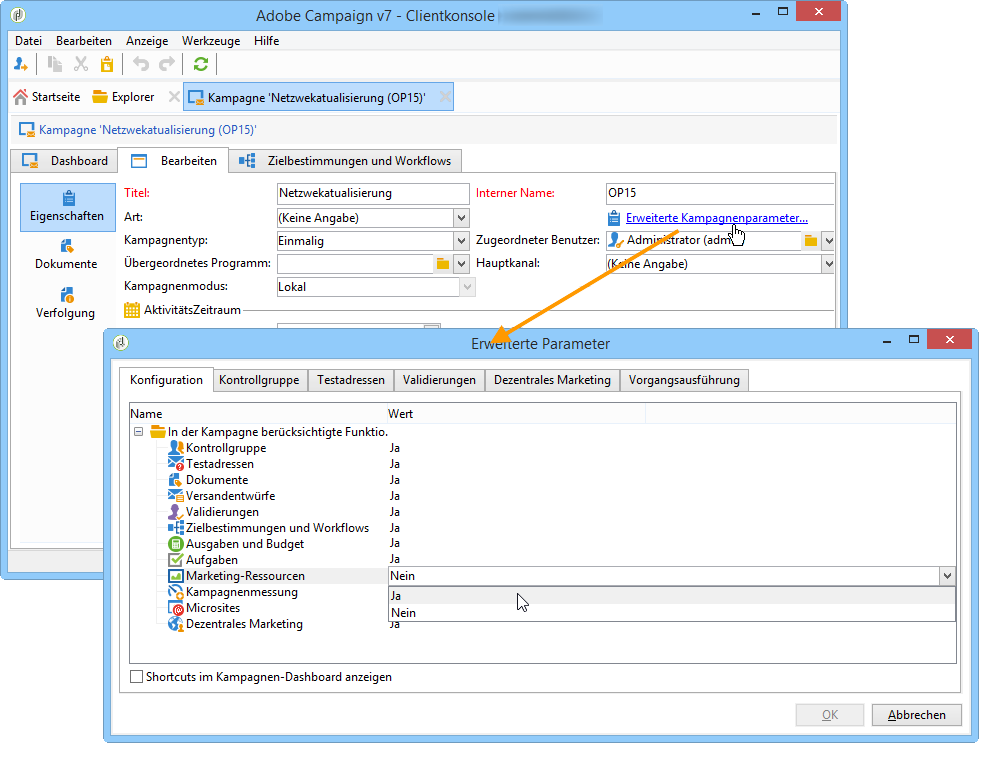

Wenn keine Funktion ausgewählt ist, werden die den Prozess betreffenden Elemente (Menüs, Symbole, Optionen, Registerkarten, Unterregisterkarten usw.) Wird nicht in der Benutzeroberfläche der Vorlage oder in auf dieser Vorlage basierenden Kampagnen angezeigt. Die Tabs links von den Kampagnendetails entsprechen in der Regel den in der Vorlage ausgewählten Prozessen. Wenn beispielsweise **Ausgaben und Budget** nicht ausgewählt ist, wird der entsprechende Tab **[!UICONTROL Budget]** nicht in Kampagnen angezeigt, die auf dieser Vorlage basieren.

Darüber hinaus werden dem Kampagnen-Dashboard Verknüpfungen zu den Konfigurationsfenstern hinzugefügt. Wenn eine Funktion aktiviert ist, ermöglicht ein direkter Link den Zugriff darauf über das Kampagnen-Dashboard.

Beispielsweise werden mit dieser Konfiguration:

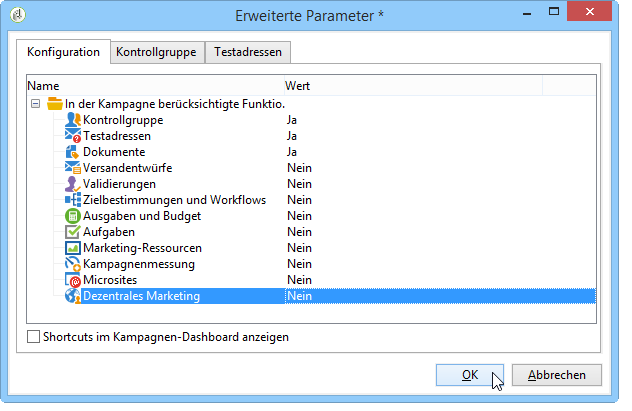

foglende Links im Dashboard der Kampagne angeboten (der Link **[!UICONTROL Aufgabe hinzufügen]** fehlt):

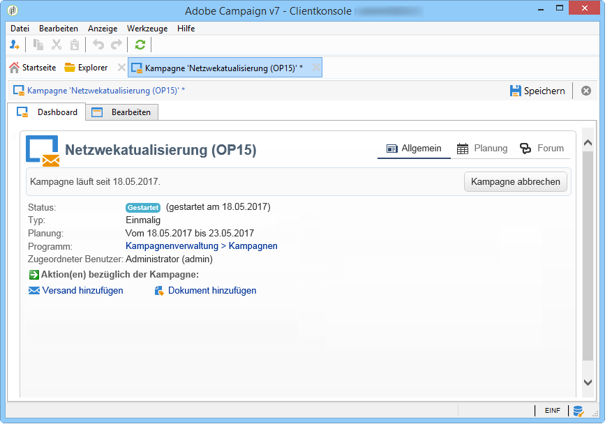

Und nur die folgenden Tabs werden angezeigt:

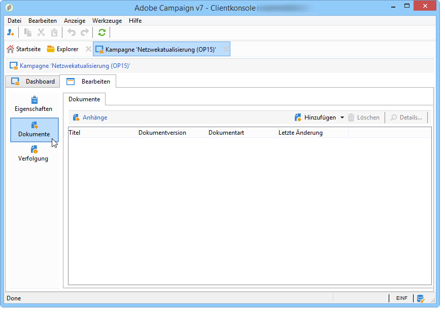

Mit folgender Konfiguration dagegen:

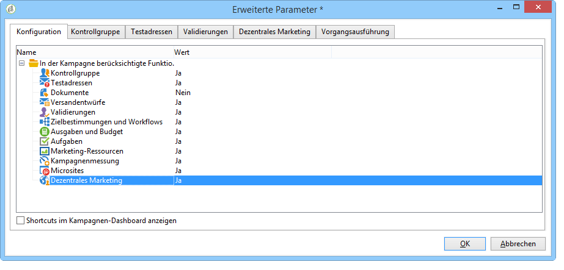

werden diese Links und Tabs angezeigt:

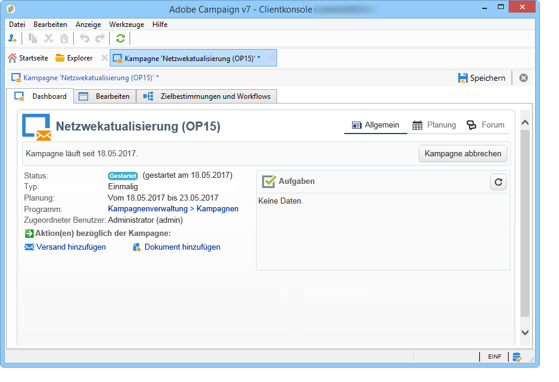

## Typologie von Modulen {#typology-of-enabled-modules}

* **Kontrollgruppe**

  Wenn dieses Modul ausgewählt wird, wird eine zusätzliche Registerkarte zu den erweiterten Einstellungen der Vorlage und der auf dieser Vorlage basierenden Kampagnen hinzugefügt. Die Konfiguration kann über die Vorlage oder einzeln für jede Kampagne definiert werden. Weitere Informationen zu Kontrollgruppen finden Sie in [diesem Abschnitt](../../campaign/using/marketing-campaign-deliveries.md#defining-a-control-group).

  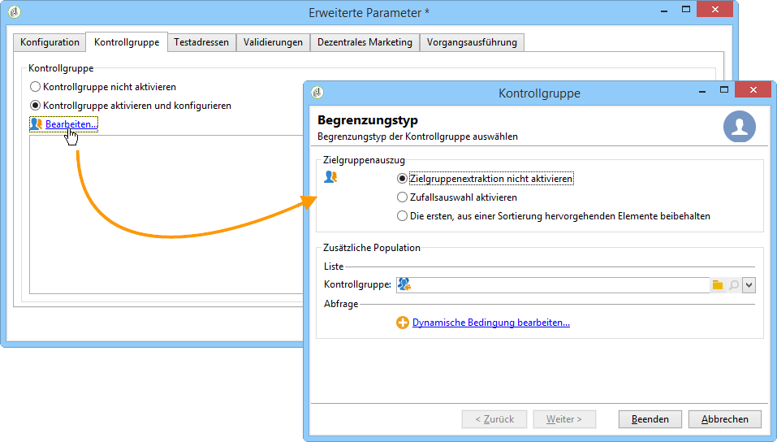

* **Testadressen**

  Wenn dieses Modul ausgewählt wird, wird eine zusätzliche Registerkarte zu den erweiterten Einstellungen der Vorlage und der auf dieser Vorlage basierenden Kampagnen hinzugefügt. Die Konfiguration kann über die Vorlage oder einzeln für jede Kampagne definiert werden. Weitere Informationen zu Testadressen finden Sie in [diesem Abschnitt](../../delivery/using/about-seed-addresses.md).

  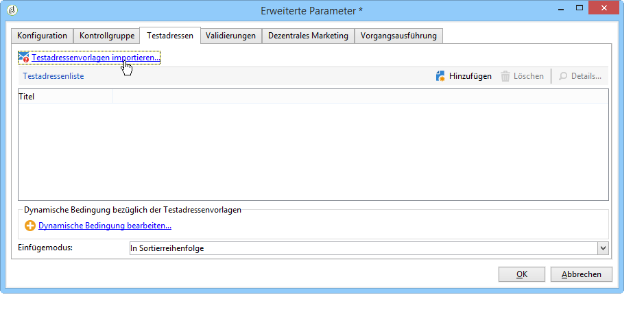

* **Dokumente**

  Wenn dieses Modul ausgewählt wird, wird eine zusätzliche Registerkarte zur Registerkarte **[!UICONTROL Bearbeitung]** der Vorlage und der auf dieser Vorlage basierenden Kampagnen hinzugefügt. Anhänge können für jede Kampagne in der Vorlage oder einzeln hinzugefügt werden. Weitere Informationen zu Dokumenten finden Sie in [diesem Abschnitt](../../campaign/using/marketing-campaign-deliveries.md#managing-associated-documents).

  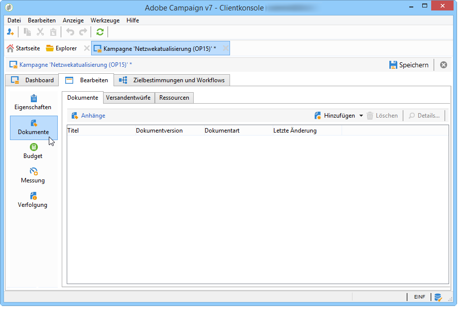

* **Versandentwurf**

  Wenn dieses Modul ausgewählt wird, wird dem Tab **[!UICONTROL Dokumente]** der Unter-Tab **[!UICONTROL Versandentwürfe]** hinzugefügt, um für die Kampagne unterschiedliche Versandentwürfe zu erstellen. Weitere Informationen zu Versandentwürfen finden Sie in [diesem Abschnitt](../../campaign/using/marketing-campaign-deliveries.md#associating-and-structuring-resources-linked-via-a-delivery-outline).

  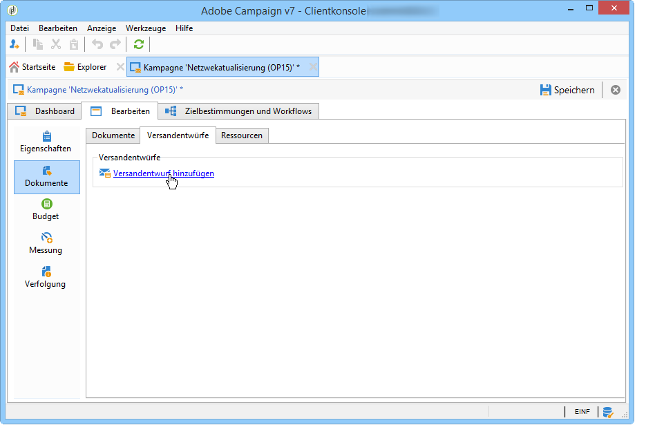

* **Zielgruppenbestimmungen und Workflows**

  Wenn das Modul **[!UICONTROL Zielgruppenbestimmungen und Workflows]** ausgewählt wird, wird ein Tab zum Erstellen eines oder mehrerer Workflows für Kampagnen hinzugefügt, die auf dieser Vorlage basieren. Workflows können basierend auf dieser Vorlage auch einzeln für jede Kampagne konfiguriert werden.Weitere Informationen zu Kampagnen-Workflows finden Sie [ diesem Abschnitt](../../campaign/using/marketing-campaign-deliveries.md#building-the-main-target-in-a-workflow).

  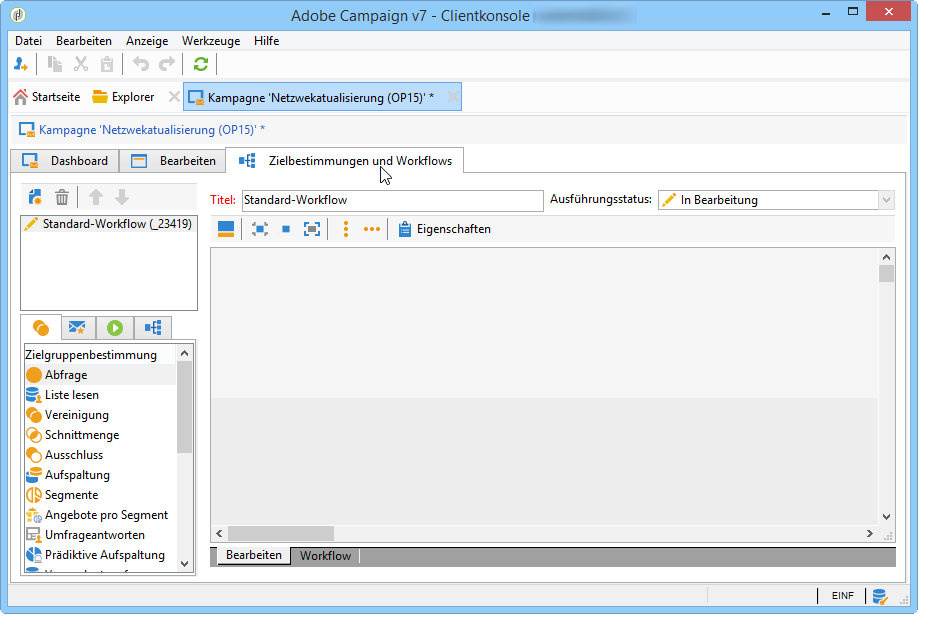

  Darüber hinaus wird mit Aktivierung dieses Moduls in den erweiterten Parametern der Kampagne ein zusätzlicher Tab hinzugefügt, in dem die Ausführungsprioritäten der Prozesse bestimmt werden können.

  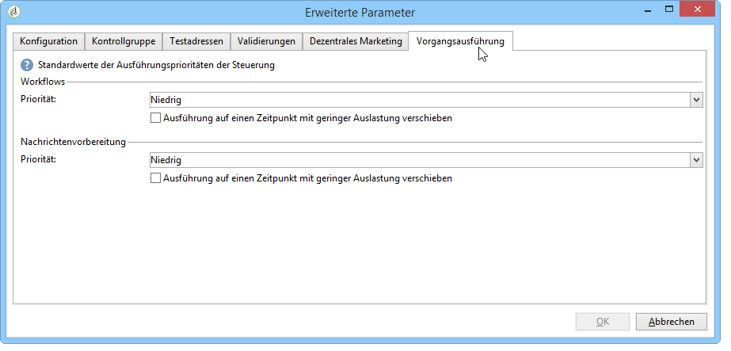

* **Validierung**

  Wenn das Modul **[!UICONTROL Validierung]** ausgewählt wird, können Sie zu validierende Prozesse sowie validierungsverantwortliche Benutzer bestimmen. Weitere Informationen zu Validierungen finden Sie in [diesem Abschnitt](../../campaign/using/marketing-campaign-approval.md#selecting-reviewers).

  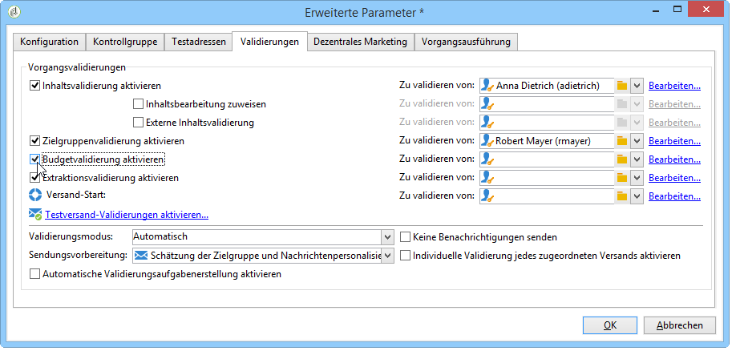

  Sie können wählen, ob Sie die Prozessvalidierung über die Registerkarte **[!UICONTROL Genehmigungen]** im Abschnitt mit den erweiterten Einstellungen der Vorlagen aktivieren möchten oder nicht. Die Vorgänge, für die die Validierung ausgewählt wird, müssen validiert werden, damit der Nachrichtenversand autorisiert wird.

  Jeder aktivierten Validierung muss ein validierender Benutzer oder eine validierende Benutzergruppe zugewiesen werden.

* **Ausgaben und Budget**

  Wenn dieses Modul ausgewählt wird, wird der Tab **[!UICONTROL Budget]** den Details der Vorlage und der auf dieser Vorlage basierenden Kampagnen hinzugefügt, damit das zugehörige Budget ausgewählt werden kann.

  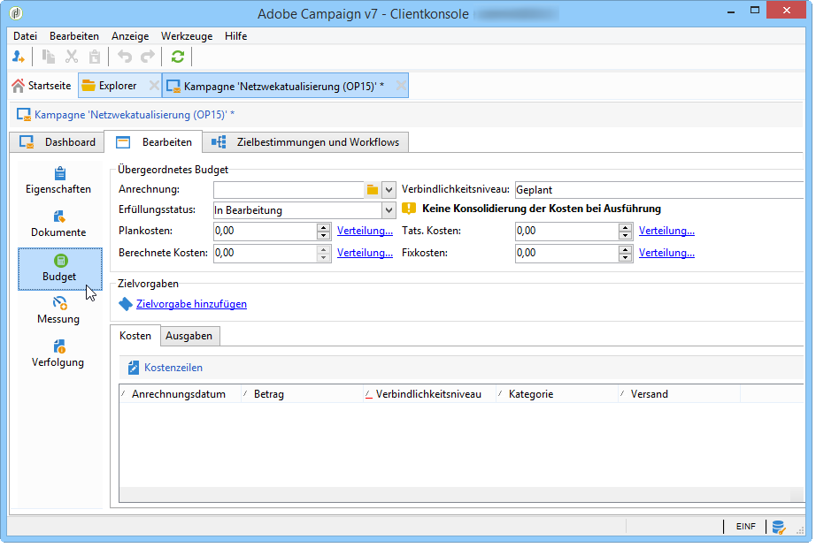

## Eigenschaften und Ausführung {#general-configuration}

### Vorlageneigenschaften {#template-properties}

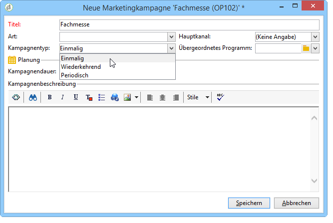

Bei der Erstellung einer Kampagnenvorlage ist die Angabe folgender Informationen notwendig:

* **Titel** der Vorlage: Dieser Titel wird allen auf dieser Vorlage basierenden Kampagnen automatisch zugewiesen.
* Wählen Sie die **Kampagnenart** aus der Dropdown-Liste aus. Die in der Dropdown-Liste angebotenen Werte entsprechen den in der Aufzählung **[!UICONTROL natureOp]** gespeicherten Werten.

  >[!NOTE]
  >
  >Weitere Informationen zum **Arbeiten mit Auflistungen** finden Sie in der [Dokumentation zu Adobe Campaign v8 (Konsole)](https://experienceleague.adobe.com/de/docs/campaign/campaign-v8/config/settings/enumerations){target=_blank}.

* Wählen Sie den **Kampagnentyp** aus: eindeutig, wiederkehrend oder regelmäßig. Standardmäßig gelten Kampagnenvorlagen für eindeutige Kampagnen. Wiederkehrende und periodische Kampagnen werden in [diesem Abschnitt](../../campaign/using/setting-up-marketing-campaigns.md#recurring-and-periodic-campaigns) beschrieben.
* Geben Sie die Dauer der Kampagne an, d. h. die Anzahl der Tage, über die die Kampagne stattfinden soll. Wenn Sie eine auf dieser Vorlage basierende Kampagne erstellen, werden das Start- und Enddatum der Kampagne automatisch ausgefüllt.

  Handelt es sich um eine wiederkehrende Kampagne, müssen Start- und Enddatum direkt in der Vorlage angegeben werden.

* **Zugehörigkeitsprogramm** der Vorlage: Die auf der Vorlage basierenden Kampagnen werden dem ausgewählten Programm zugeordnet.

### Ausführungsparameter der Vorlage {#template-execution-parameters}

Über **[!UICONTROL Link Erweiterte Kampagneneinstellungen…]** können Sie die erweiterten Optionen der Vorlage zur Verarbeitung der Versandzielgruppe (Kontrollgruppe, Testadressen usw.) konfigurieren und die Konfiguration der Kampagnenmessung und Workflow-Ausführung.

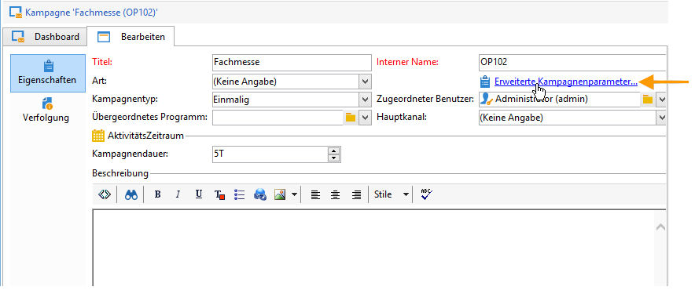

## Tracken der Kampagnenausführung{#campaign-reverse-scheduling}

Sie können einen Zeitplan für eine Kampagne erstellen und Ergebnisse tracken, um beispielsweise ein gewisses Ereignis für ein bestimmtes Datum zu planen. Mit Kampagnenvorlagen können Sie jetzt das Startdatum einer Aufgabe anhand des Enddatums einer Kampagne berechnen.

Wechseln Sie im Feld Aufgabenkonfiguration zum Bereich **[!UICONTROL Implementierungsplan]** und aktivieren Sie das Kontrollkästchen **[!UICONTROL Das Startdatum wird auf der Grundlage des Enddatums der Kampagne berechnet]**. (Hier ist „Startdatum“ das Startdatum der Aufgabe). Geben Sie im Feld **[!UICONTROL Start]** ein Intervall ein: Die Aufgabe beginnt entsprechend lange vor dem Enddatum der Kampagne. Wenn Sie einen längeren Zeitraum als die Dauer der Kampagne angeben, liegt der Aufgabenanfang vor dem Kampagnenbeginn.

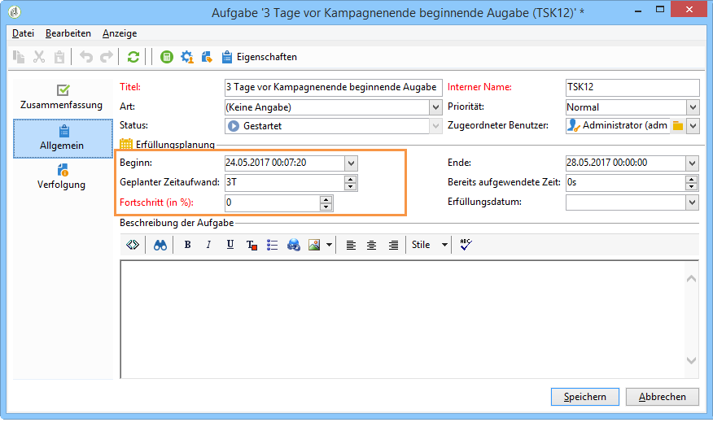

Wenn Sie eine Kampagne mithilfe dieser Vorlage erstellen, wird das Startdatum der Aufgabe automatisch berechnet. Sie können sie jedoch jederzeit später ändern.
