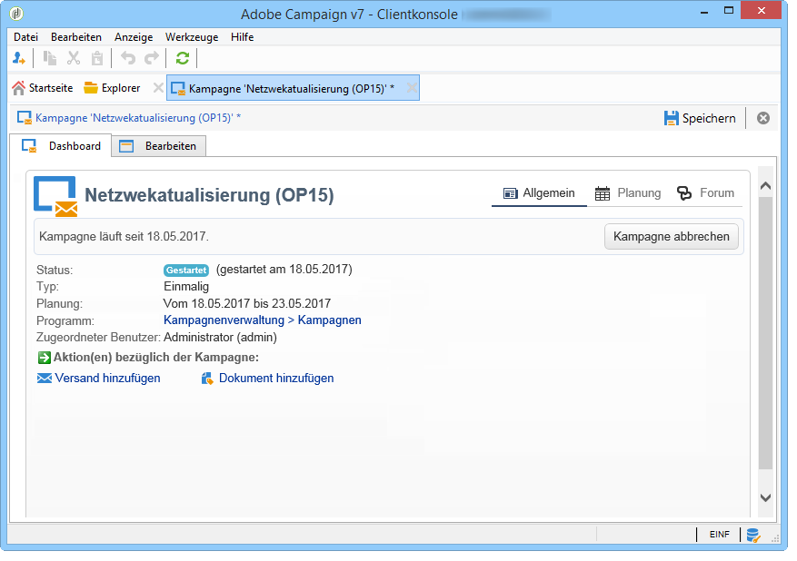

# Marketing-Kampagnenvorlagen {#campaign-templates}

Kampagnenvorlagen werden im Knoten **[!UICONTROL Ressourcen > Vorlagen > Kampagnenvorlagen]** zentralisiert. Eine leere Vorlage ist standardmäßig vorhanden. Sie ermöglicht die Erstellung einer neuen Kampagne, die alle verfügbaren Module enthält (Dokumente, Aufgaben, Testadressen usw.). Die vorgeschlagenen Module hängen von den Berechtigungen und Konfigurationen Ihrer Adobe-Campaign-Plattform ab.

## Erstellung oder Duplizierung einer Kampagnenvorlage {#creating-or-duplicating-a-campaign-template}

Gehen Sie zur Erstellung einer neuen Vorlage wie folgt vor:

1. Öffnen Sie den Campaign-**Explorer**.
1. Klicken Sie in **Ressourcen > Vorlagen> Kampagnenvorlagen** auf die Option **Neu** in der Symbolleiste über der Liste mit Vorlagen.

   

1. Geben Sie den Titel der neuen Kampagnenvorlage ein.
1. Klicken Sie auf **Speichern** und öffnen Sie die Vorlage erneut.
1. Füllen Sie bei Bedarf im **Bearbeiten**-Tab das Feld **Interner Name** aus und ergänzen Sie andere erforderliche Angaben.
1. Wählen Sie **Erweiterte Kampagnenparameter**, um Ihrer Kampagnenvorlage einen Workflow hinzuzufügen.

   

1. Ändern Sie den Wert für **Zielbestimmungen und Workflows** auf **Ja**.

   

1. Klicken Sie im Tab **Zielbestimmungen und Workflows** auf die Option **Workflow hinzufügen...**.

   

1. Füllen Sie das Feld **Titel** aus und klicken Sie auf **Ok**.
1. Erstellen Sie Ihren Workflow entsprechend Ihren Anforderungen.
1. Klicken Sie auf **Speicher** n. Ihre Vorlage kann jetzt in einer Kampagne verwendet werden.

Es besteht auch die Möglichkeit, die Standardvorlage zu duplizieren und die bestehende Konfiguration zu verwenden und anzupassen.

Die unterschiedlichen Tabs und Unter-Tabs der Kampagnenvorlage ermöglichen den Zugriff auf die Einstellungen. Sie werden im Abschnitt ](#general-configuration)Allgemeine Konfiguration[ beschrieben.

## Konfigurieren einer Kampagnenvorlage {#configuring-a-campaign-template}

Kampagnen basieren auf Vorlagen, die eine Reihe von vordefinierten Parametern teilen.

In einer Standardkonfiguration befinden sich Kampagnenvorlagen im Knoten **[!UICONTROL Ressourcen > Vorlagen > Kampagnenvorlagen]** des Adobe-Campaign-Navigationsbaums.

>[!NOTE]
>
>Um den Navigationsbaum anzuzeigen, klicken Sie auf das Symbol **[!UICONTROL Explorer]** oberhalb der Startseite.

Es wird eine native Vorlage bereitgestellt, mit der Sie eine Kampagne erstellen können, für die keine bestimmte Konfiguration definiert wurde. Sie können Ihre Kampagnenvorlagen erstellen und konfigurieren und dann Kampagnen aus diesen Vorlagen erstellen.

Die Erstellung und Konfiguration von Kampagnenvorlagen werden im Abschnitt ](#campaign-templates)Kampagnenvorlagen[ beschrieben.

Weitere Informationen zur Erstellung von Kampagnen finden Sie in [diesem Video](../../campaign/using/marketing-campaign-deliveries.md#create-email-video).

## Konfiguration der verfügbaren Module {#configuration-of-the-available-modules}

### Modulauswahl {#module-selection}

Über den Link **[!UICONTROL Erweiterte Kampagnenparameter...]** können Prozesse der auf dieser Vorlage basierenden Kampagnen aktiviert oder deaktiviert werden. Wählen Sie in der Liste die zu aktivierenden Funktionalitäten der mit dieser Vorlage erstellten Kampagnen aus.

Wenn eine Funktionalität nicht ausgewählt wurde, erscheinen die mit diesem Prozess zusammenhängenden Elemente (Menüs, Symbole, Optionen, Tabs, Untertabs usw.) nicht in der Vorlagenansicht. Die links in der Kampagnenansicht liegenden Tabs entsprechen typischerweise den in der Vorlage ausgewählten Prozessen. Wenn beispielsweise **Ausgaben und Budget** nicht ausgewählt ist, ist der entsprechende Tab **[!UICONTROL Budget]** nicht in den auf dieser Vorlage basierenden Kampagnen vorhanden.

Im Dashboard der Kampagne werden zudem Verknüpfungen zu den Konfigurationsfenstern hinzugefügt: Wenn eine Funktionalität aktiviert ist, besteht über einen Link im Dashboard direkter Zugriff auf diese.

Beispielsweise werden mit dieser Konfiguration:

foglende Links im Dashboard der Kampagne angeboten (der Link **[!UICONTROL Aufgabe hinzufügen]** fehlt):

Und nur die folgenden Tabs werden angezeigt:

Mit folgender Konfiguration dagegen:

werden diese Links und Tabs angezeigt:

### Typologie der aktivierten Module {#typology-of-enabled-modules}

* **Kontrollgruppe**

   Wenn dieses Modul ausgewählt wird, wird ein zusätzlicher Tab in den erweiterten Parametern der Vorlage und der auf dieser Vorlage basierenden Kampagnen hinzugefügt. Die Konfiguration kann in der Vorlage oder direkt in den einzelnen Kampagnen erfolgen.

   

* **Testadressen**

   Wenn dieses Modul ausgewählt wird, wird ein zusätzlicher Tab in den erweiterten Parametern der Vorlage und der auf dieser Vorlage basierenden Kampagnen hinzugefügt. Die Konfiguration kann in der Vorlage oder direkt in den einzelnen Kampagnen erfolgen.

   

* **Dokumente**

   Wenn dieses Modul ausgewählt wird, wird ein zusätzlicher Tab im Tab **[!UICONTROL Bearbeiten]** der Vorlage und der auf dieser Vorlage basierenden Kampagnen hinzugefügt. Dokumente können über die Vorlage oder direkt in den einzelnen Kampagnen hinzugefügt werden.

   

* **Versandentwurf**

   Wenn dieses Modul ausgewählt wird, wird dem Tab **[!UICONTROL Dokumente]** ein Untertab **[!UICONTROL Versandentwürfe]** hinzugefügt, um für die Kampagne unterschiedliche Entwürfe zu erstellen.

   

* **Zielbestimmungen und Workflows**

   Wenn das Modul **[!UICONTROL Zielbestimmungen und Workflows]** ausgewählt wird, erscheint ein zusätzlicher Tab zur Erstellung von Workflows für die auf der Vorlage basierenden Kampagnen. Die Workflows können auch in jeder der Kampagnen individuell konfiguriert werden.

   

   Darüber hinaus wird mit Aktivierung dieses Moduls in den erweiterten Parametern der Kampagne ein zusätzlicher Tab hinzugefügt, in dem die Ausführungsprioritäten der Prozesse bestimmt werden können.

   

* **Validierung**

   Wenn das Modul **[!UICONTROL Validierung]** ausgewählt wird, können Sie zu validierende Prozesse sowie validierungsverantwortliche Benutzer bestimmen.

   

* **Ausgaben und Budget**

   Wenn dieses Modul ausgewählt wird, wird der Tab **[!UICONTROL Budget]** den Details der Vorlage und der auf dieser Vorlage basierenden Kampagnen hinzugefügt, um das übergeordnete Budget auszuwählen.

   

### Vorgangsvalidierungen {#approval-of-jobs}

Im Tab **[!UICONTROL Validierungen]** der erweiterten Parameter der Vorlage können Sie auswählen, ob Sie die Validierung von Prozessen aktivieren möchten oder nicht. Die Prozesse, die zur Validierung ausgewählt wurden, müssen zwingend validiert werden, damit ein Nachrichtenversand möglich ist.

Jeder aktivierten Validierung muss ein validierender Benutzer oder eine validierende Benutzergruppe zugewiesen werden.

## Allgemeine Konfiguration {#general-configuration}

### Vorlageneigenschaften {#template-properties}

Bei der Erstellung einer Kampagnenvorlage ist die Angabe folgender Informationen notwendig:

* **Titel** der Vorlage: Dieser Titel wird allen auf dieser Vorlage basierenden Kampagnen automatisch zugewiesen.
* **Kampagnenart**: Die in der Dropdown-Liste angebotenen Werte entsprechen den in der Auflistung **[!UICONTROL natureOp]** gespeicherten Werten.

   >[!NOTE]
   >
   >Weitere Informationen zu Auflistungen finden Sie im Abschnitt [Erste Schritte](../../platform/using/managing-enumerations.md).

* Wählen Sie den **Kampagnentyp**: einmalig, wiederkehrend oder periodisch. Standardmäßig gelten Kampagnenvorlagen für einmalige Kampagnen. Wiederkehrende und periodische Kampagnen werden beschrieben unter [Wiederkehrende und periodische Kampagnen](../../campaign/using/setting-up-marketing-campaigns.md#recurring-and-periodic-campaigns).
* Dauer der Kampagne an: Gemeint ist der Zeitraum, über den sich die Kampagne erstrecken wird. Bei Erstellung einer auf einer Vorlage basierenden Kampagne werden Beginn und Ende somit automatisch ausgefüllt.

   Handelt es sich um eine wiederkehrende Kampagne, müssen Beginn und Ende direkt in der Vorlage angegeben werden.

* **Zugehörigkeitsprogramm** der Vorlage: Die auf der Vorlage basierenden Kampagnen werden dem ausgewählten Programm zugeordnet.

### Ausführungsparameter der Vorlage {#template-execution-parameters}

Über den Link **[!UICONTROL Erweiterte Kampagnenparameter]** können weitere Optionen der Vorlage bezüglich Zielgruppen-Verarbeitung (Kontrollgruppe, Testadressen usw.) sowie Kampagnenmessung und Workflow-Ausführung konfiguriert werden.

## Kampagnen-Vorausplanung {#campaign-reverse-scheduling}

Sie können die Umkehrung der Planung einer Kampagne ausführen, um beispielsweise ein Event vorzubereiten, dessen Datum im Voraus bekannt ist. In den Kampagnenvorlagen besteht die Möglichkeit, das Beginndatum einer Aufgabe abhängig vom Enddatum einer Kampagne zu berechnen.

Aktivieren Sie hierzu im Konfigurationsfenster der Aufgabe im Abschnitt **[!UICONTROL Erfüllungsplanung]** die Option **[!UICONTROL Das Startdatum wird vom Enddatum der Kampagne aus berechnet]** (&quot;Startdatum&quot; meint hier den Zeitpunkt, an dem mit der Bearbeitung der Aufgabe begonnen werden soll). Geben Sie im Feld **[!UICONTROL Start]** ein Intervall ein: Die Aufgabe beginnt entsprechend lange vor dem Enddatum der Kampagne. Wenn Sie einen längeren Zeitraum als die Dauer der Kampagne angeben, liegt der Aufgabenanfang vor dem Kampagnenbeginn.

Wenn Sie eine Kampagne mit dieser Vorlage erstellen, wird der Beginn der Aufgabe automatisch berechnet. Sie haben jedoch die Möglichkeit, das Datum zu verändern.
