# Druckregeln{#pressure-rules}

## Über Marketingermüdung {#about-marketing-fatigue}

Mithilfe der Werbedruckverwaltung stellen Sie sicher, dass Sie die Population der Datenbank nicht übermäßig oft ansprechen, was zur sogenannten „Marketingermüdung“ führen könnte. Hierzu kann eine maximale Anzahl an Nachrichten pro Empfänger festgelegt werden. Zudem können zwischen den Kampagnen Schlichtungsregeln eingerichtet werden, auf deren Basis an die jeweilige Zielgruppe die für sie am besten geeignete Nachricht gesendet wird.

**Druckregeln** können beispielsweise dazu beitragen, der Marketingermüdung entgegenzusteuern, indem die Zahl der an eine Zielgruppe versendeten Newsletter auf zwei begrenzt wird; unter den zur Auswahl stehenden Nachrichten diejenigen ausgewählt werden, die den Interessen der Abonnentengruppe bestmöglich entsprechen; keine Angebote per SMS an einen unzufriedenen Kunden gesendet werden etc.

Die Kampagnen werden entsprechend der festgelegten Schwellen und des jeweiligen Gewichts jeder Nachricht ausgewählt.

* Ein Schwellenwert ist die höchste Anzahl von Lieferungen, die innerhalb eines bestimmten Zeitraums für einen bestimmten Empfänger genehmigt wurden. Sie kann entweder eingestellt oder variabel sein. Er wird in den Einstellungen der Typologieregel festgelegt oder berechnet. Siehe [Maximale Anzahl der Nachrichten](#maximum-number-of-messages).
* Mithilfe der Liefergewichte können Sie die Lieferungen mit höchster Priorität im Rahmen des Druckmanagements identifizieren. Nachrichten mit dem höchsten Gewicht haben Priorität. Siehe [Nachrichtenstärke](#message-weight).

Die Schlichtung besteht darin, sicherzustellen, dass geplante Kampagnen mit einer höheren Gewichtung als laufende Kampagnen kein übermäßiges Werben eines Profils auslösen: Ist dies der Fall, wird das Profil von der Versandaktion ausgeschlossen.

Die Schlichtungskriterien (Nachrichtengewichtung und/oder Schwelle der Nachrichtenanzahl) können nach zwei Informationstypen variieren:

* den Präferenzen der Empfänger, die deklarativen Informationen entsprechen: Newsletter-Abonnements, Empfängerstatus (Kunde oder potenzieller Kunde);
* dem Verhalten der Empfänger: Einkäufe, besuchte Links usw.

Die Schlichtungsregel zur Bestimmung der geeigneten Nachrichten wird in der Analyseetappe angewandt. Die Nachricht wird für jeden Empfänger und den betroffenen Zeitraum versandt, wenn folgende Formel wahr ist: **(Anzahl gesendeter Nachrichten) + (Anzahl der Nachrichten mit einer größeren Gewichtung) &lt; Schwelle**

Andernfalls wird der Empfänger **[!UICONTROL Excluded by arbitration]** angezeigt. Weitere Informationen hierzu finden Sie unter [Ausschluss nach Schiedsverfahren](#exclusion-after-arbitration).

## Druckregel erstellen {#creating-a-pressure-rule}

Um eine Schlichtung zwischen Adobe-Campaign-Kampagnen einzurichten, müssen zunächst Kampagnentypologien erstellt und die damit verbundenen Typologieregeln definiert werden.****

To create and configure a **[!UICONTROL Pressure]** typology rule, apply the following steps:

1. In the list of campaign typology rules, click the **[!UICONTROL New]** icon above the list.

   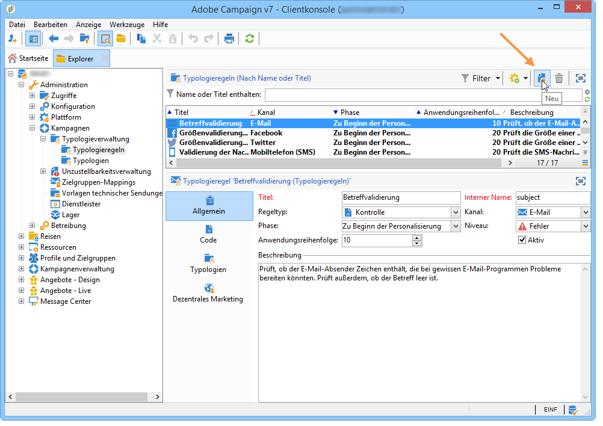

1. In the **[!UICONTROL General]** tab of the new rule, select a **Pressure** type rule and enter a name and description for it.

   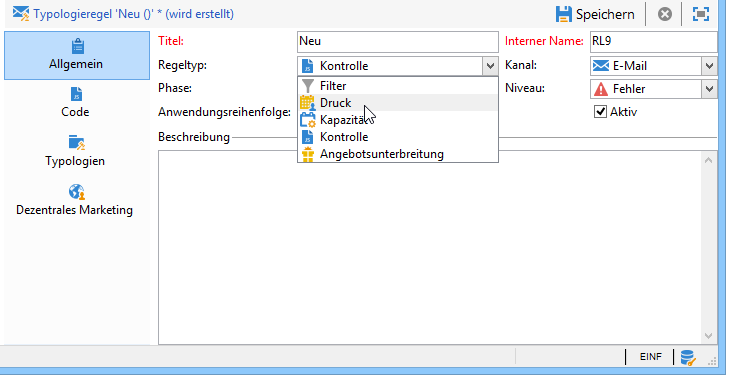

1. Ändern Sie bei Bedarf die Ausführungsreihenfolge. Wenn mehrere Typologieregeln als **[!UICONTROL Typology]** Satz angewendet werden, werden zuerst die weniger sortierten Regeln angewendet. For more on this, refer to [Execution order](../../campaign/using/applying-rules.md#execution-order).
1. Definieren Sie im **[!UICONTROL Calculation parameters]** Abschnitt eine Häufigkeit, wenn Sie Targeting über die nächste tägliche Wiederholungsausführung hinaus speichern möchten. Weitere Informationen finden Sie unter [Anpassen der Berechnungsfrequenz](../../campaign/using/applying-rules.md#adjusting-calculation-frequency).
1. Click the **[!UICONTROL Pressure]** tab and choose the calendar period during which the typology rule applies.

   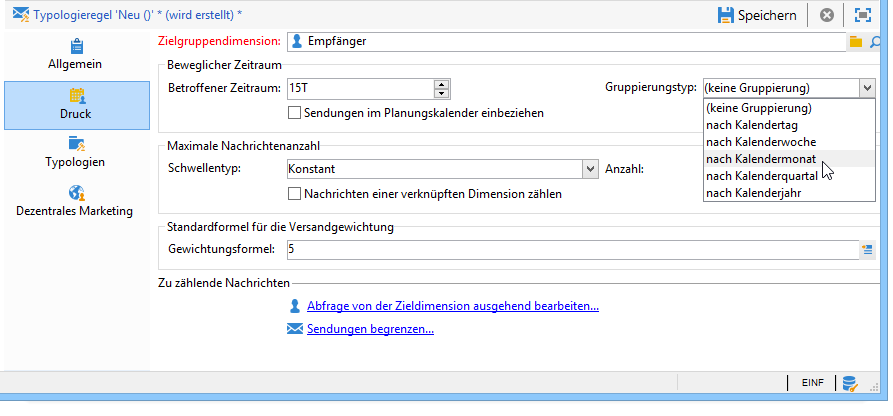

   Die Regel wird auf Sendungen angewandt, deren Kontaktdatum im betroffenen Zeitraum liegt.

   >[!NOTE]
   >
   >Geplante Auslieferungen werden nur berücksichtigt, wenn die **[!UICONTROL Take the deliveries into account in the provisional calendar]** Option ausgewählt ist. For more on this, refer to [Setting the period](#setting-the-period).

1. Geben Sie den Berechnungsmodus der maximalen Nachrichtenanzahl an.

   Die Schwelle stellt die maximale Anzahl der Nachrichten dar, die an einen Empfänger im betreffenden Zeitraum geschickt werden können.

   Die Schwelle ist standardmäßig konstant. Die von der Regel erlaubte maximale Nachrichtenanzahl muss festgelegt werden.

   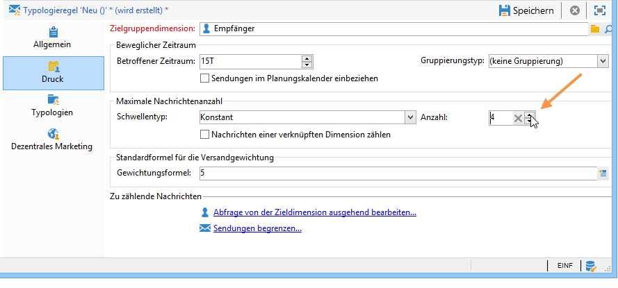

   To define a variable threshold, select the **[!UICONTROL Depends on the recipient]** value in the **[!UICONTROL Type of threshold]** field and use the icon on the right to open the expression editor.

   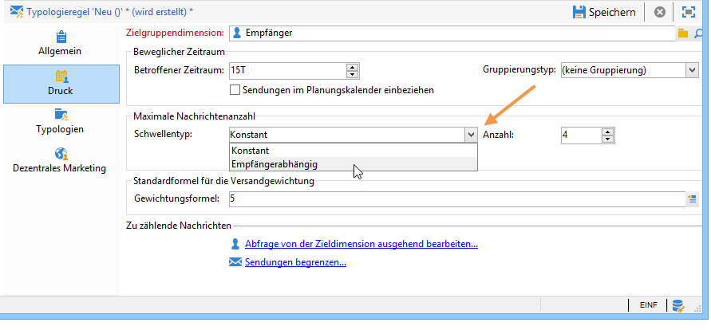

   Weitere Informationen finden Sie unter [Maximale Anzahl der Nachrichten](#maximum-number-of-messages).

1. Geben Sie den Berechnungsmodus der Versandgewichtung an.

   Jede Lieferung hat eine Gewichtung, d. h. einen Wert, der die Prioritätsstufe darstellt: Dies ermöglicht eine Schlichtung zwischen Kampagnen. Die Gewichtung wird anhand der in der Typologieregel und/oder ihren Eigenschaften definierten Formel berechnet. For more on this, refer to [Message weight](#message-weight).

1. Standardmäßig werden bei der Schwellenberechnung alle Nachrichten berücksichtigt. Auf der **[!UICONTROL Restriction]** Registerkarte können Sie die Meldungen filtern, die von der Typologieregel betroffen sind:

   * Im oberen Bereich können die betroffenen Empfänger begrenzt werden.
   * Im unteren Bereich dieses Tabs können die zu zählenden Nachrichten gefiltert werden.

      Im folgenden Beispiel werden nur die im Ordner **NewContacts** gespeicherten Empfänger berücksichtigt und nur Sendungen, die mit **Newsletter** beginnen, sind betroffen.
   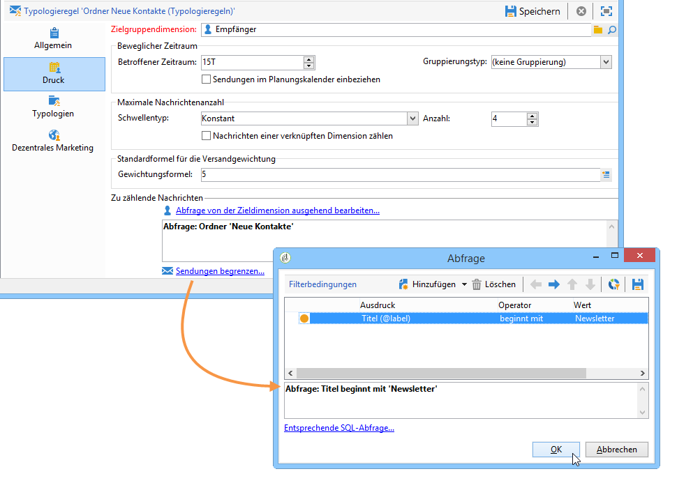

1. The **[!UICONTROL Typologies]** tab lets you view the campaign typologies which apply this rule or link the rule to one or more existing typologies. For more on this, refer to [Applying typologies](../../campaign/using/about-campaign-typologies.md#applying-typologies).

## Definieren von Schwellen und Grenzwerten {#defining-thresholds-and-weights}

### Maximale Nachrichtenanzahl {#maximum-number-of-messages}

Mit jeder Druckregel wird eine Schwelle bestimmt, also eine maximale Anzahl an Nachrichten, die einem Empfänger über einen bestimmten Zeitraum gesendet werden können. Wenn diese Schwelle erreicht ist, wird dem Empfänger bis zum Ende des Zeitraums keine Kampagne mehr gesendet. Diese Funktionsweise ermöglicht den automatischen Ausschluss eines Empfängers aus einer Sendung, wenn der Versand der Nachricht die festgelegte Schwelle überschreiten und somit einen übermäßigen Werbedruck erzeugen würde.

Der Schwellwert kann konstant sein oder mithilfe einer Formel berechnet werden, die Variablen beinhalten kann. Für einen gegebenen Zeitraum kann sich die Schwelle so von einem Empfänger zum anderen und sogar für einen einzelnen Empfänger unterscheiden.

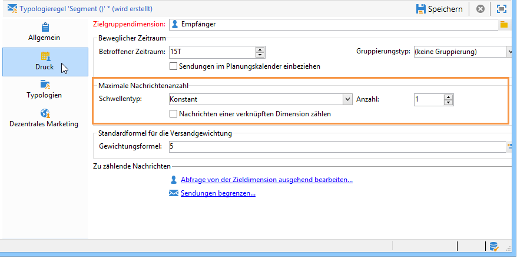

>[!CAUTION]
>
>Eine Schwelle von **0** verhindert jeglichen Versand an die Zielgruppe während des betroffenen Zeitraums.

**Beispiel:**

Sie können die Anzahl autorisierter Nachrichten entsprechend dem Segment, zu dem der Empfänger gehört, indizieren. Das bedeutet, dass ein Empfänger, der zum Websegment gehört, möglicherweise mehr Nachrichten als andere Empfänger erhält. Eine **[!UICONTROL Iif (@origin='Web', 5, 3)]** Typformel erlaubt die Auslieferung von 5 Nachrichten an Empfänger und 3 für andere Segmente. Die Konfiguration lautet wie folgt:

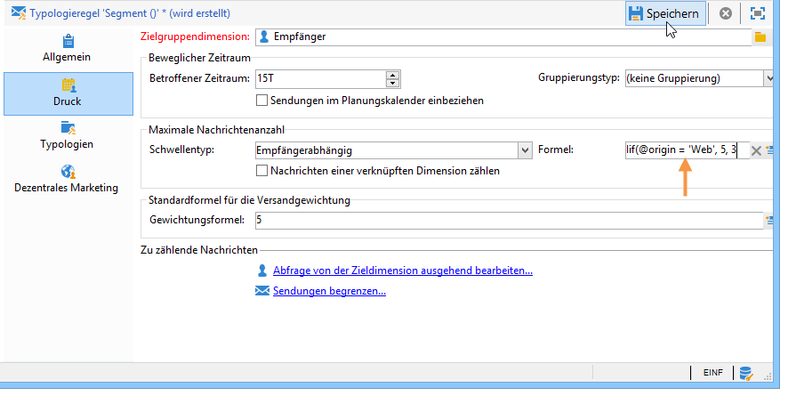

Die definierte Schwelle kann eine in Zusammenhang mit der Zielgruppendimension stehende Dimension berücksichtigen. So können beispielsweise auch die Nachrichten gezählt werden, die an Empfänger gesendet werden, die in der Besuchertabelle gespeichert sind. Ein weiteres Beispiel ist die Begrenzung auf eine Nachricht pro Woche für einen Haushalt mit u. U. mehreren E-Mail-Adressen. Dieser wird über eine mit der Empfängerdimension in Relation stehende Dimension identifiziert. (Näheres zur Besuchertabelle finden Sie in [diesem Abschnitt](../../web/using/use-case--creating-a-refer-a-friend-form.md).)

Wählen Sie dazu die **[!UICONTROL Count messages on a linked dimension]** Option und dann den Besucher oder die Kontakttabelle aus.

### Nachrichtengewichtung {#message-weight}

Jeder Versand hat eine Gewichtung, die seine Priorität repräsentiert. Die Standardgewichtung beträgt 5. Die Druckregeln ermöglichen es, die Gewichtung der Sendungen festzulegen, auf die sie angewendet werden.

Die Gewichtung kann konstant sein oder mithilfe einer Formel empfängerabhängig berechnet werden. Beispielsweise kann die Gewichtung eines Versands den Interessen eines Empfängers entsprechend bestimmt werden.

>[!CAUTION]
>
>Die in einer Typologieregel definierte Gewichtung kann für jede Bereitstellung auf der **[!UICONTROL Properties]** Registerkarte einzeln überladen werden. Klicken Sie auf die **[!UICONTROL Typology]** Registerkarte, um die Kampagnentyp auszuwählen und bei Bedarf die anzuwendende Gewichtung anzugeben.\
>Eine in einer Typologieregel A festgelegte Gewichtung wird jedoch nicht in den Berechnungen einer Typologieregel B berücksichtigt: Die Gewichtung betrifft jeweils nur die Sendungen, die die Regel A anwenden.

**Beispiel:**

Im folgenden Beispiel wird die Gewichtung von Musik-Newslettern abhängig von der Neigung der Empfänger zu diesem Thema berechnet.

1. Erstellen Sie ein neues Feld, um die für die Neigung der Empfänger ermittelten Werte festzuhalten. Dieses Feld, hier **@Music**, kann mit Antworten auf Online-Erhebungen und -Umfragen, erfassten Trackingdaten etc. angereichert werden.
1. Erstellen Sie eine Typologieregel, um die Nachrichtengewichtung auf diesem Feld basierend zu berechnen.

   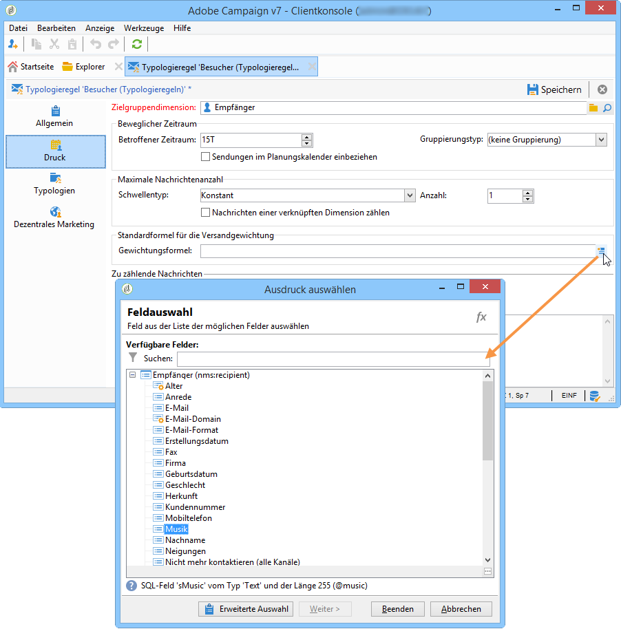

1. Wenden Sie diese Regel auf Nachrichten wie Newsletter, Sonderangebote etc. an. Die Gewichtung dieser Sendungen, also ihre Priorität, hängt folglich von den Neigungswerten des einzelnen Empfängers ab.

## Festlegen des Zeitraums {#setting-the-period}

Die Druckregeln werden für bewegliche Zeiträume von **n** Tagen bestimmt.

Der Zeitraum wird auf der **[!UICONTROL Pressure]** Registerkarte der Regel konfiguriert. Sie können die Anzahl der Tage angeben und bei Bedarf die gewünschte Gruppierung (Tag, Woche, Monat, Quartal usw.) auswählen.

The grouping type lets you extend the **[!UICONTROL Period considered]** field to the whole day, calendar week, calendar month or calendar year for dates for the period.

Eine Druckregel zum Beispiel, die eine Schwelle von 2 Nachrichten pro Woche und eine Gruppierung nach Kalendermonaten berechnet, verhindert den Versand von mehr als zwei Sendungen in der gleichen Woche UND im gleichen Kalendermonat für den gesamten betroffenen Zeitraum. Achtung: Wenn der Zeitraum zwei Monate übergreift, berücksichtigt die Schwellenberechnung alle Sendungen beider Kalendermonate. Dadurch könnten neue Sendungen während des zweiten Monats verhindert werden.

>[!NOTE]
>
>Standardmäßig werden bei der Berechnung des Schwellenwerts nur bereits versandte Lieferungen berücksichtigt. Aktivieren Sie die **[!UICONTROL Take the deliveries into account in the provisional calendar]** Option, wenn Sie auch die für den betreffenden Zeitraum geplanten Auslieferungen berücksichtigen möchten. In diesem Fall wird der Bezugszeitraum verdoppelt, um die Integration künftiger Lieferungen und früherer Lieferungen zu ermöglichen.\
>Um die berücksichtigten Sendungen auf einen Zeitraum von 15 Tagen zu begrenzen, können Sie entweder
>
>* Enter **15d** in the **[!UICONTROL Concerned period]** field: deliveries sent up to two weeks before the date of the delivery which the rule is applied to will be taken into account in the calculation,
>
>  
oder
>
>* Geben Sie **7d** in das **[!UICONTROL Period considered]** Feld ein UND prüfen Sie die **[!UICONTROL Take the deliveries into account in the provisional calendar]**\
   >Option: Lieferungen, die bis zu 7 Tage vor dem Liefertermin versandt und bis zu 7 Tage nach dem Liefertermin, ab dem die Regel angewendet wird, eingeplant werden, werden bei der Berechnung berücksichtigt.
>
>
Das Anfangsdatum des Zeitraums hängt von der Konfiguration der Datenbank ab.

Wenn man also auf einem Versand vom 12.11. eine Druckregel über einen Zeitraum von 15 Tagen ohne Gruppierung anwendet, werden Sendungen zwischen dem 27.10. und dem 12.11. berücksichtigt. Wenn die Druckregel Sendungen aus dem Planungskalender miteinberechnet, werden Sendungen zwischen dem 27.10. und dem 27.11. gezählt. Wenn man schließlich in der Regel eine Gruppierung nach Kalendermonat festlegt, werden alle Sendungen der Monate November und Dezember in der Schwellenberechnung miteinbezogen (vom 1.11. bis zum 31.12.).

>[!CAUTION]
>
>**Häufiger Fall**
>To make sure that deliveries for the current calendar week are not taken into account, as well as not to risk also taking into account those from the previous week for the calculation threshold, specify the **[!UICONTROL Period considered]** at &#39;0&#39; and select &#39;Grouping per calendar week&#39; as the **[!UICONTROL Period type]**.
> 
>Bei einem Zeitraum über 0 (zum Beispiel 1) könnte die Berechnung die Sendungen des vorhergehenden Tages berücksichtigen: Wenn der vorhergehende Tag zugleich der vorhergehenden Woche angehört und es sich beim gewählten Gruppierungstypen um &#39;nach Kalenderwoche&#39; handelt, so wird die gesamte vorhergehende Woche in der Schwellenberechnung berücksichtigt.

**Beispiel:**

In diesem Beispiel wird eine Druckregel erstellt, die die Kundenansprache auf drei Nachrichten über einen Zeitraum von 15 Tagen hinweg begrenzt, mit einer Gruppierung nach Kalendermonat.

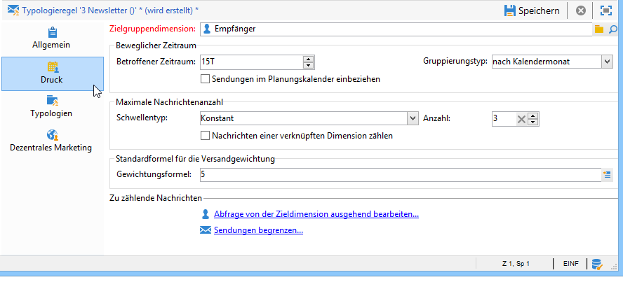

Nehmen wir an, es sind sechs Newsletter gleicher Gewichtung für die Daten 30.4., 3.5., 8.5., 12.5., 22.5. und 30.5. geplant.

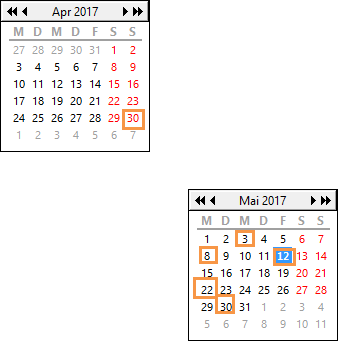

Die für den 12. und 30.5. geplanten Sendungen werden nicht verschickt: Die Sendung vom 12.5. würde die erlaubte Schwelle von drei Nachrichten in 15 Tagen überschreiten und die Sendung vom 30. würde die Schwelle der pro Monat erlaubten Nachrichten überschreiten.

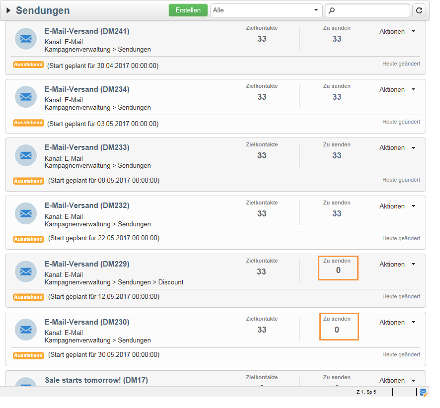

Alle Empfänger dieser Sendungen werden durch die Schlichtung während der Analysephase ausgeschlossen:

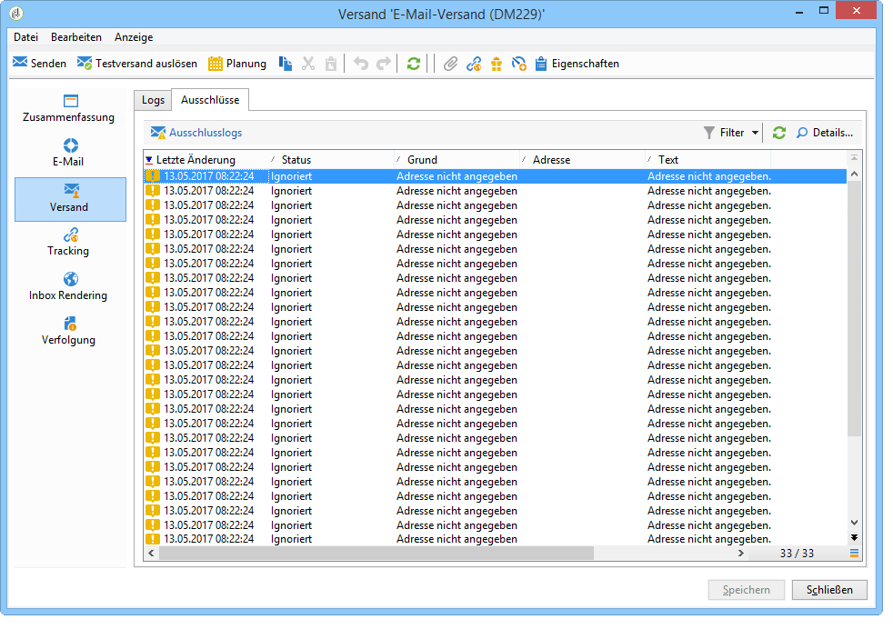

Gruppiert man für die gleiche Regel die Sendungen pro Quartal, werden die Empfänger des **5. Newsletters** ebenfalls ausgeschlossen und der Newsletter wird nicht versendet.

Wenn keine Gruppierung ausgewählt wird, wird nur der **4. Newsletter** nicht versendet, da er in den gleichen zwei Wochen geplant ist wie die ersten drei.

>[!NOTE]
>
>When you change the definition of a typology rule, you can create a **Simulation** to control its impact on the deliveries it is applied to and monitor the impact which the deliveries have on each other. For more on this, refer to [Campaign simulations](../../campaign/using/campaign-simulations.md).

## Ausschließen nach Schlichtung {#exclusion-after-arbitration}

Arbitration is re-applied every night via the **[!UICONTROL Forecasting]** technical workflow and the **[!UICONTROL Campaign jobs]** workflow.

Der **[!UICONTROL Forecasting]** Workflow berechnet die Daten für den laufenden Zeitraum (vom Startdatum bis zum aktuellen Datum) vorab, sodass bei der Analyse Typologieregeln angewendet werden können. Außerdem werden jede Nacht Ausschlusszähler für Schiedsverfahren neu berechnet.

Adobe Campaign stellt so für jeden Empfänger sicher, dass die Anzahl der zu sendenden Nachrichten die Schwelle nicht überschreitet, unter Berücksichtigung der Anzahl der bereits im betroffenen Zeitraum gesendeten Nachrichten. Diese Informationen sind nur **Indikatoren**, da die Berechnungen zum Zeitpunkt des Versands aktualisiert werden.

Bei Überschreiten der Schwelle werden die in der Kampagnentypologie bestimmten Schlichtungsregeln angewandt und die Empfänger werden durch die Schlichtung von Kampagnen mit geringerer Gewichtung ausgeschlossen.

>[!NOTE]
>
>Wenn mehrere Sendungen die gleiche Gewichtung aufweisen, wird die zeitlich nächstgelegene Kampagne geschickt.

## Anwendungsbeispiele für Druckregeln {#use-cases-on-pressure-rules}

### Anpassen der Schwelle auf Basis von Kriterien {#adapting-the-threshold-based-on-criterion}

Das vorliegende Beispiel zeigt eine Typologieregel, die die Anzahl der wöchentlich gesendeten Nachrichten an Kunden auf vier und an Interessenten auf zwei begrenzt.

Zur Identifikation von Kunden und Interessenten wird das Feld **[!UICONTROL Status]** verwendet, das den Wert 0 für Interessenten und den Wert 1 für bereits bestehende Kunden enthält.

Befolgen Sie die nachstehenden Schritte, um die Regel zu konfigurieren:

1. Erstellen Sie eine neue Typologieregel vom Typ **Druck**.
1. Edit the **[!UICONTROL Pressure]** tab: in the **[!UICONTROL Maximum number of messages]** section, we want to create a formula to calculate the threshold depending on each recipient. Wählen Sie den **[!UICONTROL Depends on the recipient]** Wert im **[!UICONTROL Threshold type]** Feld aus und klicken Sie dann **[!UICONTROL Edit expression]** rechts neben dem **[!UICONTROL Formula]** Feld.

   Click the **[!UICONTROL Advanced parameters]** button to define the calculation formula.

   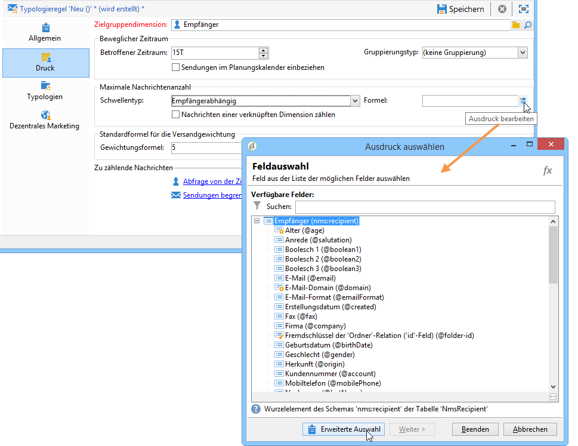

1. Wählen Sie die **[!UICONTROL Edit the formula using an expression]** Option aus und klicken Sie auf **[!UICONTROL Next]**.

   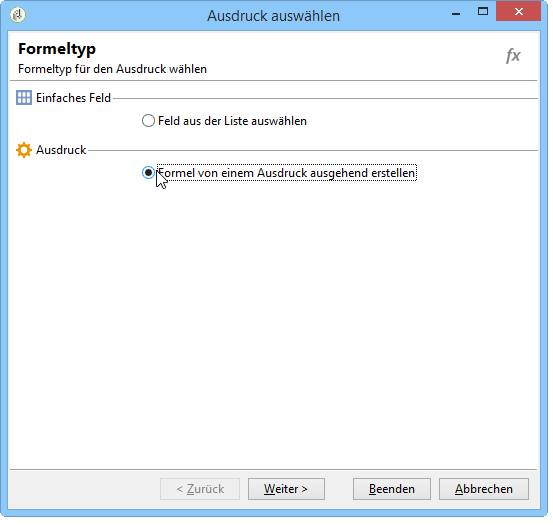

1. In the list of functions, double-click the **Iif** function in the **[!UICONTROL Others]** node.

   Then select the recipients&#39; **Status** in the **[!UICONTROL Available fields]** section.

   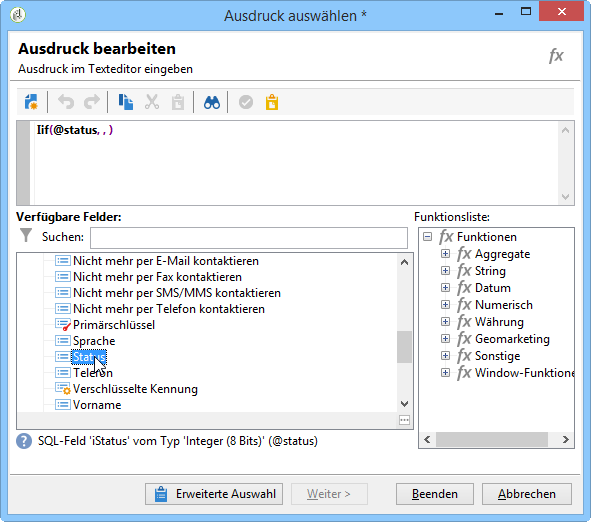

   Geben Sie die folgende Formel ein: **Iif(@status=0,2,4)**

   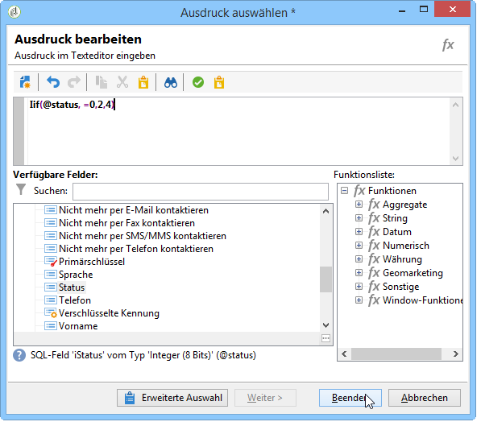

   Diese Formel ordnet einem Status gleich 0 den Wert 2 und jedem anderen Status den Wert 4 zu.

   Click **[!UICONTROL Finish]** to approve the formula.

1. Geben Sie den Anwendungszeitraum der Regel an, hier 7 Tage.

   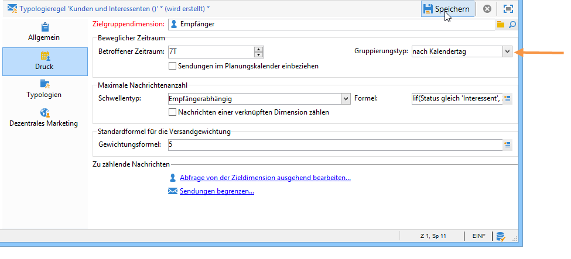

1. Speichern Sie die Regel, um ihre Erstellung zu bestätigen.

Fügen Sie die Regel einer Typologie hinzu, um sie im Zuge von Sendungen anwenden zu können. Gehen Sie hierfür wie folgt vor:

1. Erstellen Sie eine Kampagnentypologie.
1. Go to the **[!UICONTROL Rules]** tab, click the **[!UICONTROL Add]** button and select the rule you have just created.

   

1. Speichern Sie die Typologie, um sie der Liste der bereits vorhandenen Typologien hinzuzufügen.

To use this typology in your deliveries, select it in the delivery properties, in the **[!UICONTROL Typology]** tab as shown below:

>[!NOTE]
>
>Die Typologie kann auf Ebene der Versandvorlage festgelegt werden, um sie automatisch auf alle mit der jeweiligen Vorlage erstellten Sendungen anzuwenden.

Bei der Versandanalyse werden Empfänger ausgeschlossen, wenn sie bereits eine bestimmte Anzahl an Sendungen erhalten haben. Diese Information erhalten Sie, indem Sie

* das Ergebnis der Analyse ansehen:

   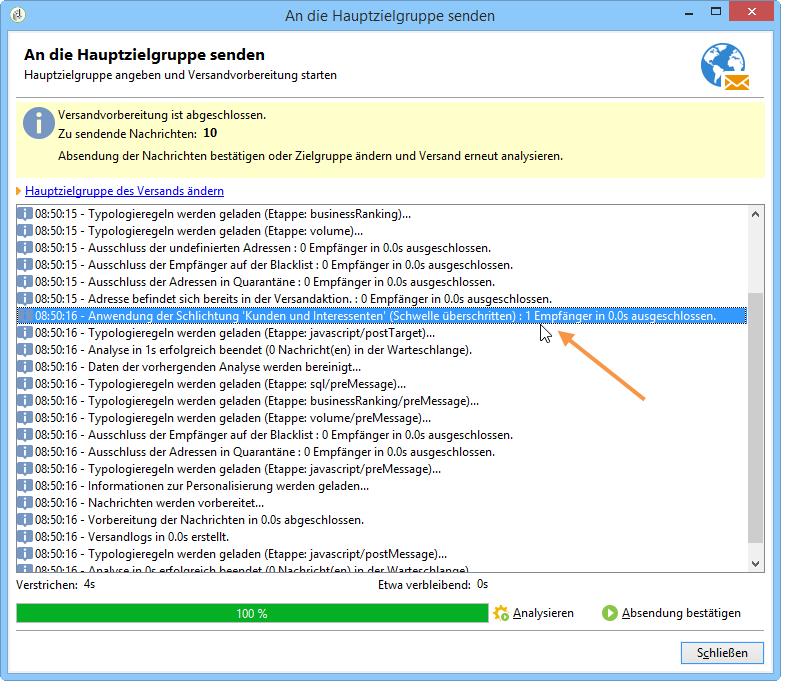

* Edit the delivery and click the **[!UICONTROL Delivery]** tab and the **[!UICONTROL Exclusions]** sub-tab:

   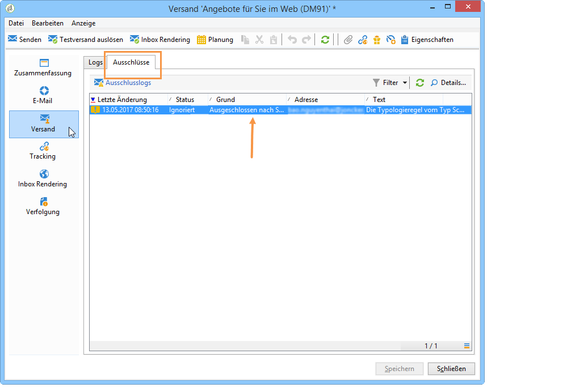

* Click the **[!UICONTROL Audit]** tab, then the **[!UICONTROL Causes of exclusions]** sub-tab to display the number of exclusions and the applied typology rules:

   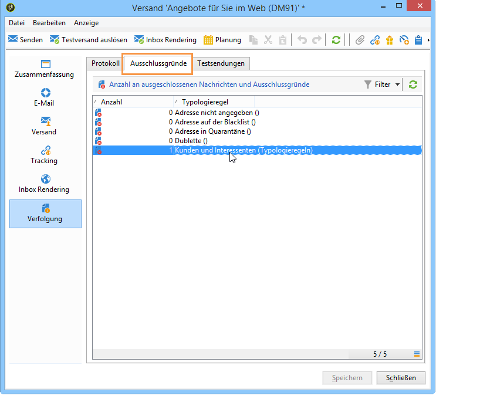

### Versandgewichtung nach Empfängerverhalten berechnen {#calculating-the-delivery-weight-based-on-behavior}

Druckregeln können dem Empfängerverhalten entsprechend festgelegt werden. Auf diese Weise kann die Gewichtung eines Versands von einem Empfänger zum anderen nuanciert werden. Der Versand einer bestimmten Nachricht kann beispielsweise bevorzugt werden, je nachdem, ob ein Empfänger Ihre Seite besucht, in eine bestimmte Rubrik des letzten Newsletters geklickt oder einen Informationsdienst abonniert hat oder nicht. Auch Antworten auf Umfragen oder Onlinespiele etc. können berücksichtigt werden.

Im folgenden Beispiel wird ein Versand mit einer Gewichtung von 5 erstellt. Dieser Gewichtung werden Neigungswerte entsprechend dem Empfängerverhalten hinzugefügt: Ein Kunde, der bereits eine Bestellung auf der Webseite aufgegeben hat, erhält einen Neigungswert von 5, während einem Kunde, der noch nie online bestellt hat, ein Neigungswert von 4 zugeordnet wird.

Für diese Art von Konfiguration muss mit einer Formel die Gewichtung der Nachrichten bestimmt werden. Auf Informationen bezüglich der Neigung und der Umfragenantworten muss über das Datenmodell Zugriff bestehen. Im vorliegenden Beispiel wurde das Feld **Neigungen** hinzugefügt.

Befolgen Sie zur Konfiguration die nachstehenden Etappen:

1. Erstellen Sie eine neue Typologieregel vom Typ **Druck**.
1. Bearbeiten Sie die **[!UICONTROL Pressure]** Registerkarte. We want to create a threshold formula which will be based on each individual recipient: click the **[!UICONTROL Edit expression]** icon to the right of the **[!UICONTROL Weight formula]** field.

   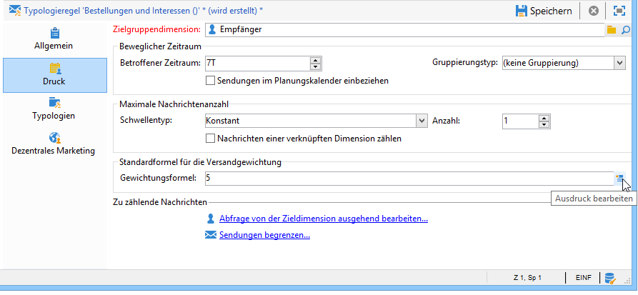

1. Im oberen Abschnitt des Ausdruckeditors wird standardmäßig der Wert **5** angegeben. Dieser Gewichtung soll nun der empfängerabhängige Neigungswert hinzugefügt werden. Positionieren Sie dafür den Zeiger der Maus rechts von der Ziffer 5, geben Sie das Zeichen **+** ein und wählen Sie das Feld **Neigungen** aus.

   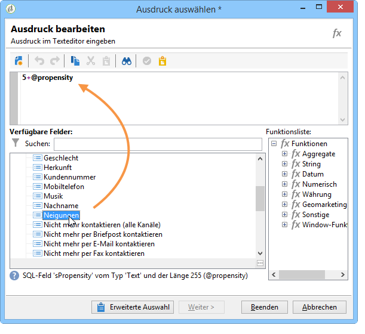

1. Fügen Sie anschließend einen höheren Wert für die Empfänger ein, die bereits Bestellungen getätigt haben. Für diese soll die Versandgewichtung um 5, für die anderen nur um 4 erhöht werden.

   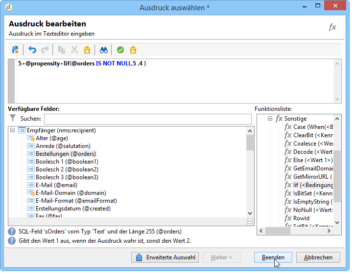

1. Click **[!UICONTROL Finish]** to save this rule.
1. Fügen Sie die erstellte Regel einer Kampagnentypologie hinzu und verweisen Sie in einem Versand auf die jeweilige Typologie, um ihre Funktionsweise zu überprüfen.

### Nur die Nachrichten mit der höchsten Gewichtung senden {#sending-only-the-highest-weighted-messages}

Angenommen, Sie möchten an jeden Ihrer Empfänger pro Woche höchstens zwei Nachrichten senden, wobei pro Tag höchstens zwei Nachrichten verschickt werden sollen. Außerdem sollen nur höher gewichtete Nachrichten gesendet werden.

Zu diesem Zweck müssen Sie für denselben Empfänger mehrere Sendungen mit unterschiedlichen Gewichtungen festlegen und eine Druckregel definieren, um Sendungen mit niedrigerer Gewichtung auszuschließen.

Konfigurieren Sie zuerst die Druckregel.

1. Erstellen Sie eine Druckregel. Weitere Informationen finden Sie unter [Erstellen einer Druckregel](#creating-a-pressure-rule).
1. Wählen Sie auf der **[!UICONTROL General]** Registerkarte die **[!UICONTROL Re-apply the rule at the start of personalization]** Option aus.

   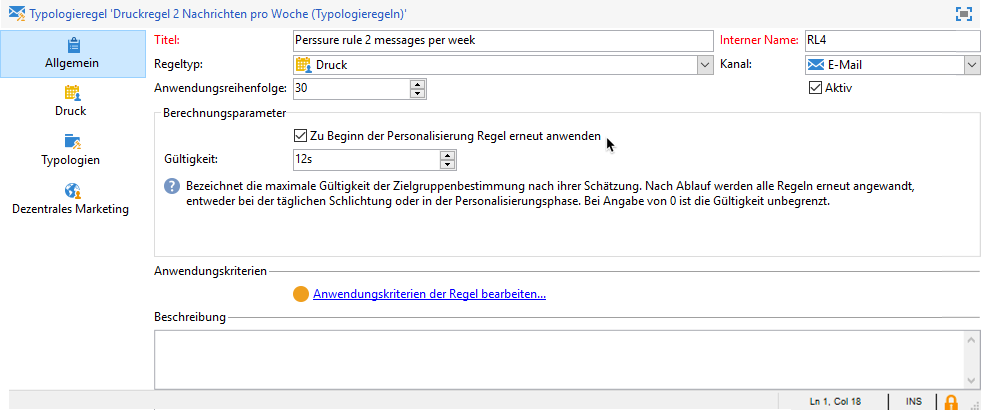

   Diese Option überschreibt den im **[!UICONTROL Frequency]** Feld definierten Wert und wendet die Regel während der Personalisierungsphase automatisch an. Weitere Informationen finden Sie unter [Anpassen der Berechnungsfrequenz](../../campaign/using/applying-rules.md#adjusting-calculation-frequency).

1. Wählen Sie auf der **[!UICONTROL Pressure]** Registerkarte **[!UICONTROL 7d]** als **[!UICONTROL Period considered]** und **[!UICONTROL Grouping per day]** als **[!UICONTROL Period type]**.
1. Wählen Sie die **[!UICONTROL Take the deliveries into account in the provisional calendar]** Option aus, um die geplanten Auslieferungen einzuschließen.

   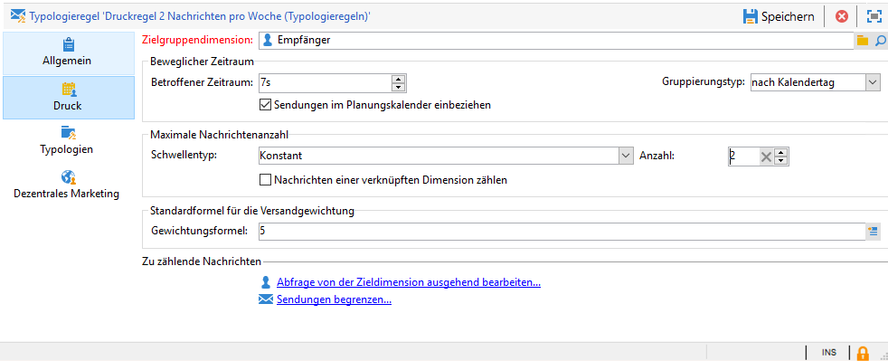

   Lieferungen, die bis zu 7 Tage vor dem Liefertermin versandt und bis zu 7 Tage nach dem Liefertermin eingeplant sind, werden bei der Berechnung berücksichtigt. For more on this, refer to [Setting the period](#setting-the-period).

1. In the **[!UICONTROL Typologies]** tab, link the rule to a campaign typology.
1. Speichern Sie Ihre Änderungen.

Erstellen und konfigurieren Sie jetzt einen Workflow für jeden Versand, auf den die Druckregel angewendet werden soll.

1. Kampagne erstellen. Weiterführende Informationen hierzu finden Sie in [diesem Abschnitt](../../campaign/using/setting-up-marketing-campaigns.md#creating-a-campaign).
1. In the **[!UICONTROL Targeting and workflows]** tab of your campaign, add a **Query** activity to your workflow. For more on using this activity, refer to [this section](../../workflow/using/query.md).
1. Fügen Sie dem Workflow eine **[!UICONTROL Email delivery]** Aktivität hinzu und öffnen Sie sie. For more on using this activity, refer to [this section](../../workflow/using/delivery.md).
1. Go to the **[!UICONTROL Approvals]** tab of the **[!UICONTROL Delivery properties]** and disable all approvals.

   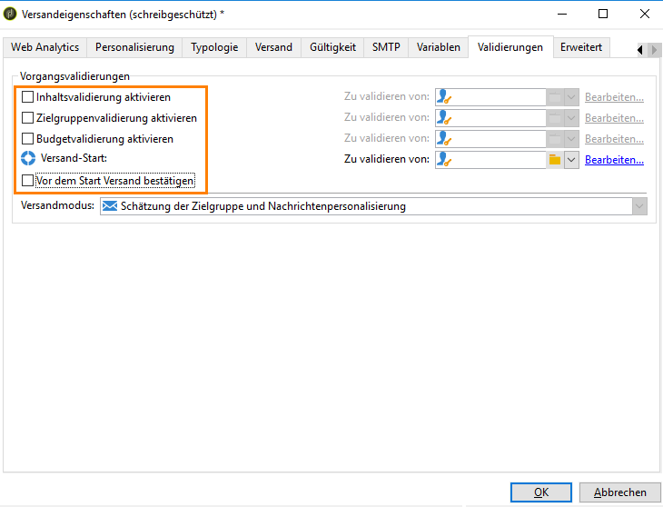

1. Verweisen Sie auf der **[!UICONTROL Typology]** Registerkarte des **[!UICONTROL Delivery properties]** Berichts auf den Kampagnentyp, um die Regel anzuwenden. Legen Sie eine Gewichtung für die Bereitstellung fest.

   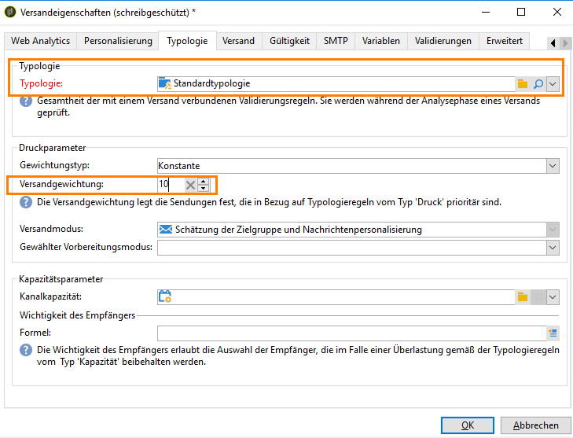

1. Klicken Sie in der Bereitstellung auf **[!UICONTROL Scheduling]** und wählen Sie **[!UICONTROL Schedule delivery (automatic execution when the scheduled date is reached)]**. Wählen Sie in diesem Beispiel die **[!UICONTROL Use a calculation formula]** Option aus.
1. Legen Sie das Extraktionsdatum mit 10 Minuten fest (aktuelles Datum + 10 Minuten).
1. Legen Sie das Kontaktdatum mit dem nächsten Tag fest (aktueller Tag + 1 Tag).

   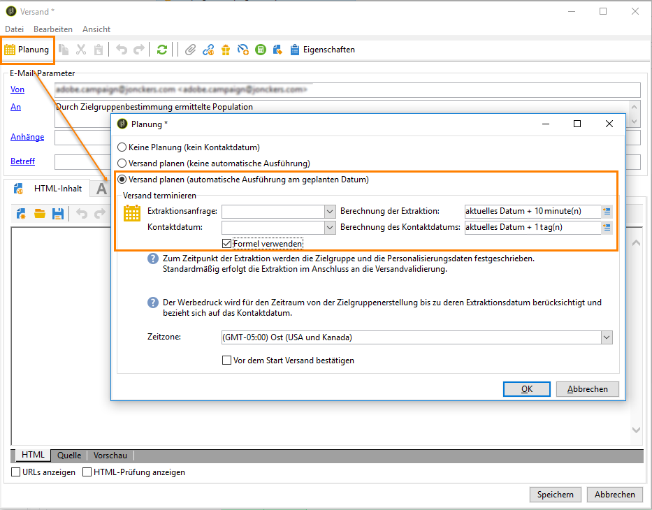

   Damit die Druckregelausschlüsse erfolgreich implementiert werden können, stellen Sie sicher, dass Sie das Extraktionsdatum und die Uhrzeit vor dem Kontaktzeitpunkt sowie vor der erneuten Anwendung des nächtlichen Schiedsverfahrens festlegen. Weitere Informationen hierzu finden Sie unter [Ausschluss nach Schiedsverfahren](#exclusion-after-arbitration).

1. Heben Sie die Auswahl der **[!UICONTROL Confirm the delivery before sending]** Option auf und speichern Sie die Änderungen.
1. Gehen Sie für alle anderen Sendungen analog vor. Definieren Sie dabei die gewünschte Gewichtung für jeden Versand.
1. Führen Sie die entsprechenden Workflows zur Vorbereitung und zum Versand der Nachrichten aus.

Bei Anwendung des nächtlichen Schiedsverfahrens werden die Lieferungen mit dem geringeren Gewicht für denselben Empfänger ausgeschlossen. Nur die Lieferungen mit dem höchsten Gewicht werden für den Versand berücksichtigt. For more on this, refer to [Message weight](#message-weight).

Angenommen, Anfang der Woche wurde den jeweiligen Empfängern schon eine E-Mail gesendet. In der unten stehenden Tabelle finden Sie ein Beispiel für die Konfiguration für zwei weitere Sendungen.

<table> 
 <thead> 
  <tr> 
   <th> Versand  </th> 
   <th> Validierungen  </th> 
   <th> Gewichtung  </th> 
   <th> Extraktionszeitpunkt  </th> 
   <th> Kontaktdatum  </th> 
   <th> Startzeitpunkt des Versands  </th> 
   <th> Zeitpunkt der Ausführung des Schlichtungs-Workflows  </th> 
   <th> Versandstatus  </th> 
   <th> Versandzeitpunkt  </th> 
  </tr> 
 </thead> 
 <tbody> 
  <tr> 
   <td> Versand 1  </td> 
   <td> Deaktiviert  </td> 
   <td> 5  </td> 
   <td> 15 Uhr  </td> 
   <td> 8 Uhr (nächster Tag)  </td> 
   <td> 14 Uhr  </td> 
   <td> Nachts  </td> 
   <td> Ausgeschlossen  </td> 
   <td> Ausgeschlossen  </td> 
  </tr> 
  <tr> 
   <td> Delivery 2  </td> 
   <td> Deaktiviert  </td> 
   <td> 10  </td> 
   <td> 16 Uhr  </td> 
   <td> 9 Uhr (nächster Tag)  </td> 
   <td> 14 Uhr  </td> 
   <td> Nachts  </td> 
   <td> Gesendet  </td> 
   <td> 9 Uhr (nächster Tag)  </td> 
  </tr> 
 </tbody> 
</table>

Nachdem das Extraktionsdatum für die zwei Sendungen verstrichen ist, wird die nächtliche Schlichtung vor den Kontaktzeitpunkten beider Sendungen erneut angewendet. Dies ermöglicht die Ermittlung aller bereits durchgeführten Sendungen (Empfänger, für die ein Versand verarbeitet und in den Broadlogs aufgezeichnet wurde) sowie der geplanten Sendungen (Empfänger, die für den Empfang einer Nachricht qualifiziert und in den Planungslogs aufgeführt sind).

Nachdem alle durchgeführten und geplanten Sendungen für den in der Druckregel definierten Zeitraum aufgelistet sind, werden sie von Adobe Campaign nach Gewichtung sortiert, wobei der am höchsten gewichtete Versand zuerst kommt. Wenn die in der Druckregel definierte Schwelle erreicht ist (in unserem Beispiel maximal zwei E-Mails pro Woche), werden die Empfänger vom Versand ausgeschlossen.
