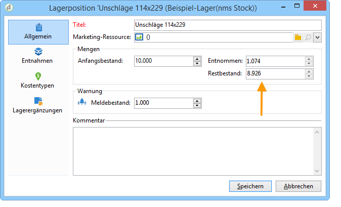

# Dienstleister, Lager und Budgets{#providers-stocks-and-budgets}

In Adobe Campaign haben Sie die Möglichkeit, Dienstleister zu bestimmen, die an der Ausführung bestimmter Prozesse der Kampagnen beteiligt sind. Informationen bezüglich dieser Dienstleister und der ihnen zugeordneten Kostenstrukturen werden vom Adobe-Campaign-Administrator über die allgemeine Übersicht festgelegt. Der Dienstleister wird auf Versandebene referenziert: Seine Kostenstrukturen ermöglichen die Berechnung der mit dem jeweiligen Versand verbundenen Kosten sowie die Verwaltung der betroffenen Lager.

## Erstellung von Dienstleistern und deren Kostenstrukturen {#creating-service-providers-and-their-cost-structures}

Jeder Dienstleister wird in einer Datei gespeichert, die seine Kontaktdaten, Dienstleistungsvorlagen und verbundene Vorgänge enthält.

Dienstleister werden im Knoten **[!UICONTROL Administration > Kampagnen > Dienstleister]** des Navigationsbaums konfiguriert.

Diverse, in Sendungen zu realisierende Vorgänge werden von Dienstleistern ausgeführt, insbesondere solche, die Briefpost und mobile Kanäle betreffen. Diese Dienstleister kommen beispielsweise in Druckvorgängen oder bei der Zustellung von Nachrichten zum Einsatz. Diese Vorgänge erfordern dienstleisterspezifische Einstellungen und verursachen Kosten. Die Konfiguration von Dienstleistern erfolgt in vier Schritten:

1. Erstellung des Dienstleisters in Adobe Campaign.

   Siehe [Hinzufügen eines Dienstleisters](#adding-a-service-provider).

1. Definition der Kostenstellen und -strukturen der dem Dienstleister zugeordneten Dienstleistungsvorlagen.

   Siehe [Bestimmung der Kostenstellen](#defining-cost-categories) und [Bestimmung der Kostenstruktur](#defining-the-cost-structure).

1. Konfiguration der Vorgänge.

   Siehe [Konfiguration der mit Dienstleistungen verbundenen Vorgänge](#configuring-processes-associated-with-a-service).

1. Referenzierung des Dienstleisters in Kampagnen.

   Siehe [Zuordnung von Dienstleistungen zu Kampagnen](#associating-a-service-with-a-campaign).

### Erstellen eines Dienstleisters und seiner Kostenstellen {#creating-a-service-provider-and-its-cost-categories}

#### Hinzufügen eines Dienstleisters {#adding-a-service-provider}

Sie können so viele Dienstleister erstellen, wie für Ihre Sendungen notwendig sind. Gehen Sie wie folgt vor, um einen Dienstleister hinzuzufügen:

1. Machen Sie einen Rechtsklick in die Liste der Dienstleister und wählen Sie **[!UICONTROL Neu]** aus oder klicken Sie auf die Schaltlfäche **[!UICONTROL Neu]** oberhalb der Liste.
1. Geben Sie im unteren Abschnitt des Fensters Namen und Kontaktdaten des Dienstleisters an.

   

1. Klicken Sie auf die Schaltfläche **[!UICONTROL Speichern]**, um ihn der Liste hinzuzufügen.

#### Bestimmung der Kostenstellen {#defining-cost-categories}

Jedem Dienstleister müssen Dienstleistungsvorlagen zugeordnet werden. In diesen Vorlagen werden zunächst die unterschiedlichen Kostenstellen und bei Bedarf die betroffenen Lager angegeben. Daraufhin müssen über die Kostenstrukturen Regeln zur Kostenberechnung für jeden Kostentyp erstellt werden.

>[!NOTE]
>
>Lesen Sie diesbezüglich auch den Abschnitt [Bestimmung der Kostenstruktur](#defining-the-cost-structure).

Eine Kostenstelle ist eine Einheit, die die für einen bestimmten Versandtyp (E-Mail, Briefpost usw.) oder für eine Aufgabe anfallenden Kosten enthält. Kostenstellen werden in Dienstleistungsvorlagen zusammengefasst, die wiederum Dienstleistern zugeordnet werden. Jeder Dienstleister kann eine oder mehrere Dienstleistungsvorlagen referenzieren.

Um eine Dienstleistungsvorlage zu erstellen und ihren Inhalt zu bestimmen, gehen Sie wie folgt vor:

1. Klicken Sie im Tab **[!UICONTROL Dienstleistungen]** des Dienstleisters auf die Schaltfläche **[!UICONTROL Hinzufügen]** und benennen Sie die Dienstleistungsvorlage.

   

1. Erstellen Sie Kostenstellen für jeden Vorgangstyp (z. B. Briefpost- oder E-Mail-Versand, Aufgabe etc.). Gehen Sie hierzu in den Tab **[!UICONTROL Kostenstellen]** und klicken Sie auf die Schaltfläche **[!UICONTROL Hinzufügen]**. Erfassen Sie die Parameter jeder Kostenstelle.

   

   * Geben Sie einen Titel für die Kostenstelle an und wählen Sie den betreffenden Vorgangstyp aus: **[!UICONTROL Brief-Versand]**, **[!UICONTROL E-Mail]**, **[!UICONTROL Mobiltelefon]**, **[!UICONTROL Telefon]** oder **[!UICONTROL Aufgabe]**.
   * Klicken Sie auf die Schaltfläche **[!UICONTROL Hinzufügen]**, um die mit dieser Kostenstelle verbunden Kostentypen zu bestimmen.
   * Bei Bedarf können Sie jedem Kostentyp eine Lagerposition hinzufügen, um den bestehenden Lagern automatisch die verwendeten Mengen anzurechnen.

      >[!NOTE]
      >
      >Die Lagerpositionen werden im Knoten **[!UICONTROL Lagerverwaltung]** definiert.\
      >Weitere Informationen finden Sie unter [Verwaltung von Lagern und Lagerergänzungen](#stock-and-order-management).

1. Sie können für diese Kostenstelle einen der Werte als Standard festlegen. Dies vermeidet die Anzeige eines leeren Werts in den Kostenstellen des Dienstleisters. Kreuzen Sie hierzu die Spalte **[!UICONTROL Ausgewählt]** für den betreffenden Kostentyp an:

   

   Auf Ebene des Versand wird der Wert standardmäßig vorgeschlagen:

   

### Bestimmung der Kostenstruktur {#defining-the-cost-structure}

Eine Kostenstruktur gibt für jede Kostenstelle die anzuwendenden Berechnungsregeln an.

Klicken Sie auf den Tab **[!UICONTROL Kostenstruktur]**, um die Kostenberechnung für jede Kostenstelle und jeden Kostentyp zu konfigurieren. Klicken Sie auf **[!UICONTROL Hinzufügen]** und erfassen Sie die Kostenstruktur.

* Um die Kostenstruktur zu erstellen, wählen Sie in den Dropdown-Listen den Nachrichtentyp, die betreffende Kostenstelle sowie den Kostentyp aus, auf den die Berechnungsregel angewandt wird. Der Inhalt dieser Dropdown-Listen übernimmt die im Tab **[!UICONTROL Kostenstellen]** angegebenen Informationen.

   Die Kostenstruktur muss benannt werden. Standardmäßig setzt sich ihr Titel wie folgt zusammen: **Kostenstelle - Kostentyp**.

   Dieser kann jedoch angepasst werden: Erfassen Sie den gewünschten Wert direkt im Feld **[!UICONTROL Titel]**.

* Die Formel zur Berechnung der Kosten wird im unteren Abschnitt des Fensters definiert.

   Diese Formel kann unabhängig von der Nachrichtenanzahl festgelegt oder entsprechend der Nachrichtenanzahl berechnet werden.

   Wenn die Formel von der Nachrichtenanzahl abhängt, kann die Struktur der Kostenberechnung **[!UICONTROL Linear]**, **[!UICONTROL Linear mit Schwellen]** oder **[!UICONTROL Pauschal mit Schwellen]** sein.

#### Lineare Struktur {#linear-structure}

Wenn es sich unabhängig von der Gesamtzahl von Nachrichten immer um den gleichen Betrag für eine Nachricht (oder eine Gruppe von Nachrichten) handelt, wählen Sie den Strukturtyp **[!UICONTROL Linear]** aus und geben Sie die Kosten pro Nachricht an.

Wenn der Betrag auf eine bestimmte Anzahl an Nachrichten angewandt wird, geben Sie diese im Feld **[!UICONTROL für]** an.

#### Lineare Struktur mit Schwellen {#linear-structure-by-threshold}

Wenn der Betrag nach Schwellen für jede Nachricht angewandt wird, muss eine Berechnungsstruktur **[!UICONTROL Linear mit Schwellen]** festgelegt werden. Nach dieser Art von Kostenstruktur kostet zum Beispiel jede Nachricht 0,13, wenn die Gesamtzahl von Nachrichten zwischen 1 und 100 liegt, 0,12 bei zwischen 100 und 1000 versendeten Nachrichten und 0,11 jenseits von 1000 Nachrichten.

Die Konfiguration stellt sich wie folgt dar:

Klicken Sie auf die Schaltfläche **[!UICONTROL Hinzufügen]** rechts von der Liste, um eine neue Schwelle zu definieren.

#### Konstante Struktur mit Schwellen {#constant-structure-by-threshold}

Sie haben zudem die Möglichkeit, die Kosten für eine bestimmte Nachrichtenanzahl pauschal zu berechnen. Dies geschieht mithilfe der Berechnungsstruktur **[!UICONTROL Pauschal mit Schwellen]**. Zum Beispiel können die Kosten folgendermaßen festgelegt werden: Eine Pauschale von 12,00 bei zwischen 1 und 100 Nachrichten; 100,00 für Sendungen von zwischen 101 und 1000 Nachrichten und 500,00 für jeden Versand jenseits von 1000 Nachrichten, unabhängig von der Gesamtzahl.

### Konfiguration der mit Dienstleistungen verbundenen Vorgänge {#configuring-processes-associated-with-a-service}

Über den Tab **[!UICONTROL Vorgänge]** können Informationen über mit der jeweiligen Dienstleistung verbundene Vorgänge hinzugefügt werden.

Klicken Sie auf den Tab **[!UICONTROL Vorgänge]**, um die Übermittlung von Informationen zum Router zu konfigurieren.

* Im Abschnitt **[!UICONTROL Dateiextraktion]** wird die Exportvorlage angegeben, die vom Versand bei Auswahl dieser Dienstleistung verwendet wird. Sie können den Namen der Ausgabedatei im Feld **[!UICONTROL Exktraktionsdatei]** bestimmen. Die rechts vom Feld liegende Schaltfläche ermöglicht das Einfügen von Variablen.

   

* Im Abschnitt **[!UICONTROL Benachrichtigungs-E-Mail]** wird die Vorlage der Benachrichtigung ausgewählt, die dem Dienstleister nach der Dateiextraktion geschickt wird. Auch die Empfänger der Benachrichtigung werden an dieser Stelle festgelegt.

   Die Versandvorlagen der Benachrichtigungen werden standardmäßig im Knoten **[!UICONTROL Administration > Kampagnen > Vorlagen technischer Sendungen]** des Explorers gespeichert.

* Im Abschnitt **[!UICONTROL Anschlussvorgang]** wird der nach der Versandvalidierung zu startende Workflow ausgewählt. Wenn eine Workflow-Vorlage angegeben wird, wird nach beendeter Validierung automatisch eine Workflow-Instanz erstellt und gestartet. Dieser Workflow kann beispielsweise die Extraktionsdatei zur Verarbeitung an einen externen Dienstleister senden.

### Zuordnung von Dienstleistungen zu Kampagnen {#associating-a-service-with-a-campaign}

Dienstleistungen werden Kampagnen über Sendungen oder Aufgaben zugeordnet. Damit in einer Sendung bestimmte Dienstleistungen zur Anwendung kommen können, sind die entsprechenden Dienstleister in der genutzten Versandvorlage anzugeben.

Wenn eine Dienstleistung ausgewählt wird, werden die dem Versandtyp (Briefpost, E-Mail usw.) entsprechenden Kostenstellen automatisch in der zentralen Tabelle angegeben, ebenso wie die bereits definierten Vorgangsoptionen.

>[!NOTE]
>
>Sollte bei der Auswahl einer Dienstleistung keine Kostenstelle angezeigt werden, bedeutet dies, dass keine Kostenstelle für diesen Vorgangstyp festgelegt wurde. Wenn beispielsweise keine Kostenstelle vom Typ **[!UICONTROL E-Mail]** bestimmt wurde, hätte die Auswahl einer Dienstleistung in einem E-Mail-Versand keinerlei Auswirkung, da keine entsprechende Kostenstelle vorhanden ist.

* In Briefpost-Sendungen können Sie eine Dienstleistung über das Konfigurationsfenster auswählen.

   

* In Mobile- oder Telefonsendungen werden Dienstleistungen auf die gleiche Weise wie bei Briefpost-Sendungen ausgewählt.
* In E-Mail-Sendungen werden Dienstleistungen über den Tab **[!UICONTROL Erweitert]** der Eigenschaften des jeweiligen Versands ausgewählt, wie im folgenden Beispiel:

   

Über die Spalte **[!UICONTROL Zu belastender Betrag]** können Kosten für diese Stelle im Kontext des betreffenden Versands oder der Aufgabe hinzugefügt werden.

Sie können die Auswahl eines Kostentyps bei der Bestimmung der Kostenstellen in einem Versand obligatorisch machen: Aktivieren Sie hierzu die Option **[!UICONTROL Auswahl eines Werts aus der Kostentypliste erforderlich]**.

## Verwaltung von Lagern und Lagerergänzungen {#stock-and-order-management}

Kostentypen können Lagerpositionen zugeordnet werden, um Bestandsmeldungen zu verwalten, Lagerergänzungen zu verfolgen und Bestellungen zu tätigen.

Um die Verwaltung von Lagern und Lagerergänzungen in Adobe Campaign einzusetzen und Benutzern für die Durchführung eines Versands unzureichende Bestände zu melden, ist die Einhaltung folgender Schritte erforderlich:

1. Erstellung von Lagern und Referenzierung von zugeordneten Dienstleistern.

   Lesen Sie diesbezüglich auch den Abschnitt [Erstellung eines Lagers](#creating-a-stock).

1. Hinzufügen von Lagerpositionen

   Siehe [Hinzufügen von Lagerpositionen](#adding-stock-lines).

1. Benachrichtigung der Benutzer bei Unterschreiten des Meldebestands.

   Siehe [Benachrichtigung bei unzureichendem Bestand](#alerting-operators).

1. Bestellungen und Lieferungen;

   Siehe [Bestellungen](#orders).

### Lagerverwaltung {#stock-management}

Adobe Campaign kann einer Benutzergruppe melden, wenn ein Lagerbestand ein Minimum erreicht hat oder ganz erschöpft ist. Auf die vorhandenen Lager besteht Zugriff über den Link **[!UICONTROL Andere Optionen]** in der Navigationszone der Rubrik **[!UICONTROL Kampagnen]**.****

#### Erstellung eines Lagers {#creating-a-stock}

Folgen Sie den nachstehenden Etappen, um ein neues Lager zu erstellen:

1. Klicken Sie auf die Schaltfläche **[!UICONTROL Erstellen]** oberhalb der Liste der existierenden Lager.
1. Geben Sie den Titel des Lagers an und wählen Sie in der Dropdown-Liste den zugehörigen Dienstleister aus.

   

   >[!NOTE]
   >
   >Weitere Informationen finden Sie unter [Erstellung von Dienstleistern und deren Kostenstrukturen](#creating-service-providers-and-their-cost-structures).

#### Hinzufügen von Lagerpositionen {#adding-stock-lines}

Ein Lager setzt sich aus unterschiedlichen Lagerpositionen zusammen. Eine Lagerposition enthält eine Anfangsmenge der Ressourcen, die von den Sendungen verbraucht werden. Jede Position enthält außerdem die verbrauchte Menge, den Restbestand sowie die bestellte Menge.

Klicken Sie bei der Erstellung eines Lagers auf den Tab **[!UICONTROL Lagerpositionen]**, um neue Positionen hinzuzufügen.

Nach der Erstellung des Lagers können Sie dieses per Klick öffnen und über sein Dashboard die Lagerpositionen anzeigen lassen.

Klicken Sie auf die Schaltfläche **[!UICONTROL Erstellen]**, um die Parameter des Lagers festzulegen.

* Geben Sie die Anfangsmenge des Lager im Feld **[!UICONTROL Anfangsbestand]** ein. Die Felder **[!UICONTROL Entnommen]** und **[!UICONTROL Restbestand]** werden automatisch berechnet und mit Ausführung der Kampagnen aktualisiert.

   

* Geben Sie im Feld **[!UICONTROL Meldebestand]** die Schwelle an, bei der die Benutzer von einer notwendigen Lagerergänzung benachrichtigt werden sollen. Mit Erreichen des Meldebestands wird im Validierungsfenster der Sendungen, die auf dieses Lager zugreifen, ein Warnhinweis angezeigt.

#### Lagerpositionen zu Kostenstellen zuordnen {#associating-a-stock-with-cost-categories}

Folgendes Beispiel zeigt, wie Lagerpositionen in Dienstleistungen über die Kostenstellen zugeordnet werden können:

### Lagerverfolgung {#stock-tracking}

#### Benachrichtigung bei unzureichendem Bestand {#alerting-operators}

Bei einem Versand, der auf eine Lagerposition mit unzureichendem Bestand zugreift, wird ein Warnhinweis angezeigt. Unten stehendes Beispiel zeigt die Meldung, die bei Validierung einer Extraktionsdatei erscheint:

#### Lagerergänzungen {#orders}

Im Untertab **[!UICONTROL Lagerergänzungen]** werden die laufenden Bestellungen angezeigt und neue Ergänzungen gespeichert.

Um eine neue Ergänzung zu speichern, öffnen Sie die entsprechende Lagerposition, klicken Sie auf die Schaltfläche **[!UICONTROL Hinzufügen]** und geben Sie das Lieferdatum sowie die bestellte Menge an.

>[!NOTE]
>
>Mit Erreichen des Lieferdatums verschwindet die Lagerergänzungszeile automatisch und die im Feld **[!UICONTROL Menge]** angegebene Ergänzung wird im Tab **[!UICONTROL Verfolgung]** angezeigt. Sie wird zudem automatisch dem Bestand hinzugefügt.

Der Tab **[!UICONTROL Entnahmen]** enthält die pro Kampagne verbrauchten Mengen. Diese Informationen werden automatisch entsprechend der ausgeführten Sendungen angegeben. Klicken Sie auf die Schaltfläche **[!UICONTROL Bearbeiten]**, um die betreffende Kampagne zu öffnen.

## Berechnung von Budgets {#calculating-budgets}

### Funktionsprinzip {#principle}

Sie haben die Möglichkeit, Kosten für Sendungen oder Kampagnen zu verwalten und diese auf zuvor definierte Budgets anzurechnen.

Die Versandkosten einer Kampagne werden in der jeweiligen Kampagne, die Kosten aller Kampagnen eines Programms im jeweiligen Programm konsolidiert. Dedizierte Berichte ermöglichen die Verfolgung der Budgets für die gesamte Plattform oder für jeden Plan und jedes Programm.

### Umsetzung {#implementation}

Wenn Sie in einer Kampagne ein Budget auswählen, müssen Sie den Ausgangsbetrag angeben. Die berechneten Kosten werden automatisch aktualisiert, entsprechend dem Verbindlichkeitsniveau der angegebenen Beträge (realisierte, geplante, reservierte, eingesetzte Ausgaben). Siehe [Betragsberechnung](../../campaign/using/controlling-costs.md#calculating-amounts).

>[!NOTE]
>
>Das Verfahren zum Erstellen von Budgets finden Sie unter [Erstellung von Budgets](../../campaign/using/controlling-costs.md#creating-a-budget).

