# Dienstleister, Lager und Budgets{#providers-stocks-and-budgets}

Mit Adobe Campaign können Sie Dienstleister definieren, die an der Ausführung der Kampagnen beteiligt sind. Informationen über die Dienstleister und die damit verbundenen Kostenstrukturen werden vom Adobe Campaign-Administrator aus der Hauptansicht definiert. Der Dienstleister wird vom Versand aus referenziert, und seine Kostenstrukturen ermöglichen die Berechnung der mit diesem Versand verbundenen Kosten sowie die Verwaltung des betroffenen Lagers.

## Erstellung von Dienstleistern und deren Kostenstrukturen {#creating-service-providers-and-their-cost-structures}

Jeder Dienstleister wird in einer Datei gespeichert, die seine Kontaktdaten, Dienstleistungsvorlagen und verbundene Aufträge enthält.

Dienstleister werden im Knoten **[!UICONTROL Administration > Kampagnen > Dienstleister]** des Navigationsbaums konfiguriert.

Die während der Sendungen ausgeführten Aufträge werden von Dienstleistern ausgeführt, insbesondere für Briefpost und mobile Kanäle. Diese Dienstleister können beispielsweise am Drucken oder Verteilen von Nachrichten beteiligt sein. Diese Aufträge beinhalten Konfigurationen und Kosten, die für jeden Dienstleister spezifisch sind. Die Konfiguration von Dienstleistern erfolgt in vier Phasen:

1. Erstellung des Dienstleisters in Adobe Campaign.

   Siehe [Hinzufügen eines Dienstleisters](#adding-a-service-provider).

1. Definition der Kostenkategorien und -strukturen der dem Dienstleister zugeordneten Dienstleistungsvorlagen.

   Siehe [Bestimmung der Kostenkategorien](#defining-cost-categories) und [Bestimmung der Kostenstruktur](#defining-the-cost-structure).

1. Konfiguration der Vorgänge.

   Siehe [Konfiguration der mit Dienstleistungen verbundenen Vorgänge](#configuring-processes-associated-with-a-service).

1. Referenzierung des Dienstleisters in Kampagnen.

   Siehe [Zuordnung von Dienstleistungen zu Kampagnen](#associating-a-service-with-a-campaign).

### Erstellen eines Dienstleisters und seiner Kostenkategorien {#creating-a-service-provider-and-its-cost-categories}

#### Hinzufügen eines Dienstleisters {#adding-a-service-provider}

Sie können so viele Dienstleister erstellen, wie für Ihre Sendungen erforderlich sind. Gehen Sie wie folgt vor, um einen Dienstleister hinzuzufügen:

1. Machen Sie einen Rechtsklick in die Liste der Dienstleister und wählen Sie **[!UICONTROL Neu]** aus oder klicken Sie auf die Schaltlfäche **[!UICONTROL Neu]** oberhalb der Liste.
1. Geben Sie im unteren Abschnitt des Fensters Namen und Kontaktdaten des Dienstleisters an.

   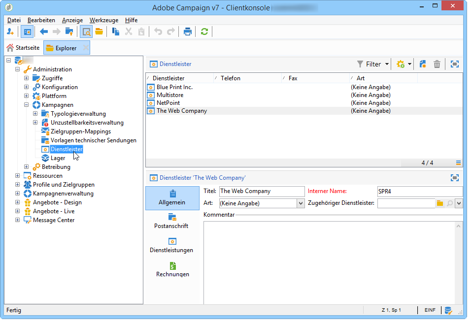

1. Klicken Sie auf die Schaltfläche **[!UICONTROL Speichern]**, um ihn der Liste hinzuzufügen.

#### Bestimmung der Kostenkategorien {#defining-cost-categories}

Sie müssen jedem Dienstleister Dienstleistungsvorlagen zuordnen. In diesen Vorlagen müssen Sie zunächst die Kostenstellen und bei Bedarf den betreffenden Bestand festlegen. Anschließend müssen Sie über die Kostenstrukturen die Kostenberechnungsregeln für jede Kategorie erstellen.

>[!NOTE]
>
>Lesen Sie diesbezüglich auch den Abschnitt [Bestimmung der Kostenstruktur](#defining-the-cost-structure).

Eine Kostenkategorie ist eine Gruppe von Kosten, die für einen bestimmten Versandtyp (E-Mail, Briefpost usw.) anfallen. oder für eine Aufgabe. Kostenstellen sind in den mit den Dienstleistern verknüpften Dienstleistungsvorlagen zusammengefasst. Jeder Dienstleister kann auf eine oder mehrere Dienstleistungsvorlagen verweisen.

Um eine Dienstleistungsvorlage zu erstellen und ihren Inhalt zu bestimmen, gehen Sie wie folgt vor:

1. Klicken Sie im Tab **[!UICONTROL Dienstleistungen]** des Dienstleisters auf die Schaltfläche **[!UICONTROL Hinzufügen]** und benennen Sie die Dienstleistungsvorlage.

   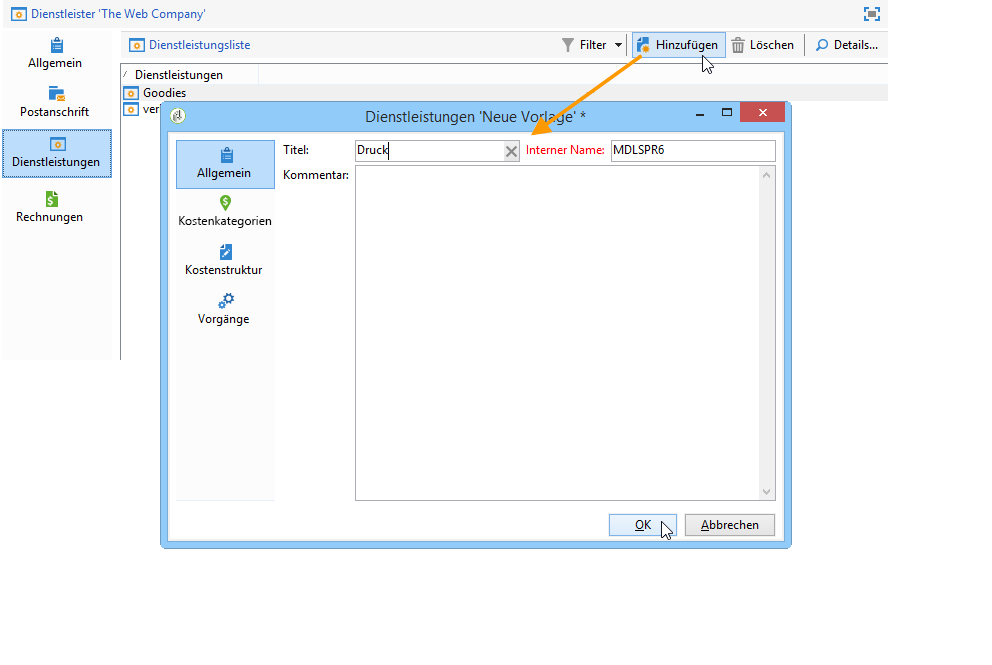

1. Erstellen Sie die Kostenkategorien für jeden Prozesstyp (Versand durch Direkt-Mail/E-Mail/etc. oder Aufgabe). Klicken Sie dazu auf die Registerkarte **[!UICONTROL Kostenkategorien]** und dann auf die Schaltfläche **[!UICONTROL Hinzufügen]** und geben Sie die Parameter jeder Kostenkategorie an.

   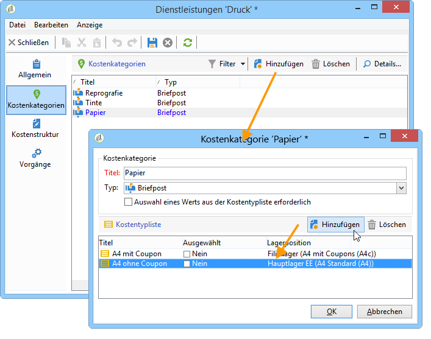

   * Geben Sie einen Titel für die Kostenkategorie an und wählen Sie den betreffenden Vorgangstyp aus: Versand per **[!UICONTROL Direkt-Mail]**, **[!UICONTROL E-Mail]**, **[!UICONTROL Mobilgerät]**, **[!UICONTROL Telefon]** oder **[!UICONTROL Aufgabe]**.
   * Klicken Sie auf die Schaltfläche **[!UICONTROL Hinzufügen]**, um die mit dieser Kostenkategorie verbunden Kostentypen zu bestimmen.
   * Bei Bedarf können Sie jedem Kostentyp eine Lagerposition hinzufügen, um den bestehenden Lagern automatisch die verwendeten Mengen anzurechnen.

     >[!NOTE]
     >
     >Die Lagerpositionen werden im Knoten **[!UICONTROL Lagerverwaltung]** definiert.\
     >Weitere Informationen finden Sie unter [Verwaltung von Lagern und Lagerergänzungen](#stock-and-order-management).

1. Sie können einen Wert für diese Kostenkategorie vorab auswählen. Dieser wird dann der Standardwert in den Kostenkategorien des Dienstleisters (anstelle eines leeren Werts) vorausgefüllt. Wählen Sie dazu in der Spalte **[!UICONTROL Ausgewählt]** für den betreffende Kategorietyp die Option aus:

   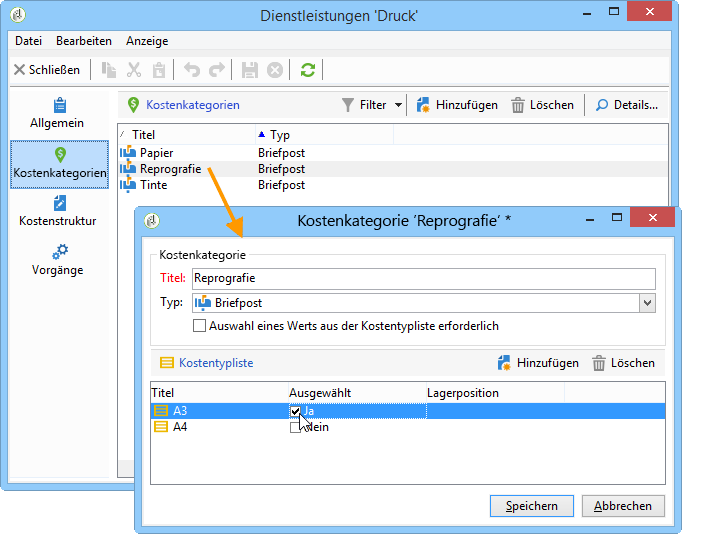

   Auf Ebene des Versand wird der Wert standardmäßig vorgeschlagen:

   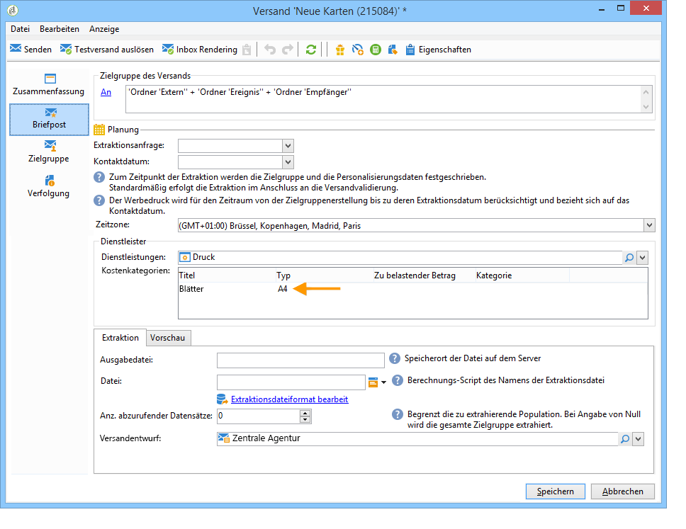

### Bestimmung der Kostenstruktur {#defining-the-cost-structure}

Eine Kostenstruktur gibt für jede Kostenkategorie die anzuwendenden Berechnungsregeln an.

Klicken Sie auf die Registerkarte **[!UICONTROL Kostenstruktur]**, um die Kostenberechnung für jede Kostenkategorie und jeden Kostentyp zu konfigurieren. Klicken Sie auf **[!UICONTROL Hinzufügen]** und geben Sie die Kostenstruktur ein.

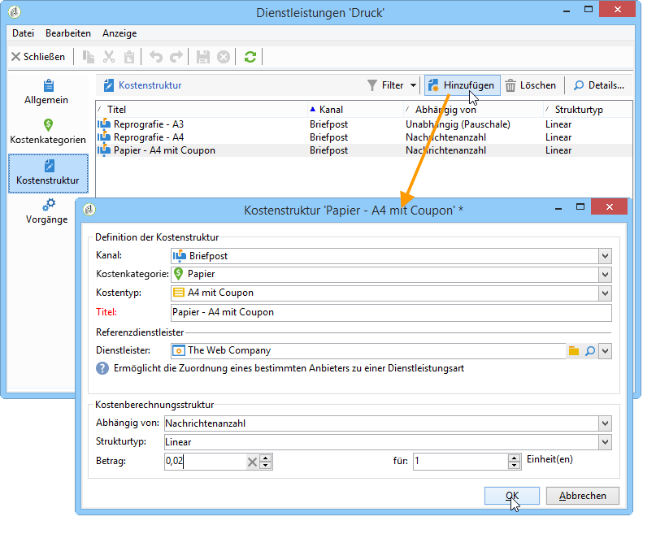

* Um die Kostenstruktur zu erstellen, wählen Sie in den Dropdown-Listen den Nachrichtentyp, die betreffende Kostenkategorie sowie den Kostentyp aus, auf den die Berechnungsregel angewendet werden soll. Der Inhalt dieser Dropdown-Listen stammt aus den Informationen, die über die Registerkarte **[!UICONTROL Kostenkategorien]** eingetragen wurden.

  Sie müssen der Kostenstruktur einen Titel zuweisen. Standardmäßig hat sie den folgenden Versandentwurf: **Kostenkategorie – Kostentyp**.

  Dieser kann jedoch angepasst werden: Erfassen Sie den gewünschten Wert direkt im Feld **[!UICONTROL Titel]**.

* Die Formel zur Berechnung der Kosten wird im unteren Abschnitt des Fensters definiert.

  Diese Formel kann unabhängig von der Nachrichtenanzahl festgelegt oder entsprechend der Nachrichtenanzahl berechnet werden.

  Wenn die Formel von der Nachrichtenanzahl abhängt, kann die Struktur der Kostenberechnung **[!UICONTROL Linear]**, **[!UICONTROL Linear mit Schwellen]** oder **[!UICONTROL Pauschal mit Schwellen]** sein.

#### Lineare Struktur {#linear-structure}

Wenn es sich unabhängig von der Gesamtzahl von Nachrichten immer um den gleichen Betrag für eine Nachricht (oder eine Gruppe von Nachrichten) handelt, wählen Sie den Strukturtyp **[!UICONTROL Linear]** aus und geben Sie die Kosten pro Nachricht an.

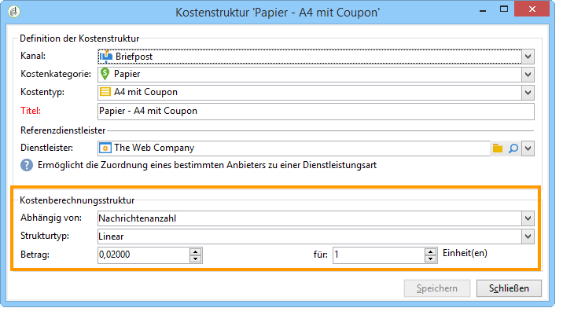

Wenn der Betrag auf eine bestimmte Anzahl an Nachrichten angewandt wird, geben Sie diese im Feld **[!UICONTROL für]** an.

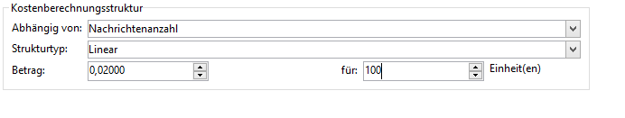

#### Lineare Struktur mit Schwellen {#linear-structure-by-threshold}

Wenn der Betrag nach Schwellenwert für jede Nachricht gilt, müssen Sie eine Berechnungsstruktur **[!UICONTROL Linear nach Schwellenwert]** definieren. Bei dieser Kostenstruktur kostet jede Nachricht 0,13, z. B. wenn die Gesamtzahl der Nachrichten zwischen 1 und 100 liegt, 0,12 bei zwischen 100 und 1.000 versendeten Nachrichten und 0,11 jenseits von 1.000 Nachrichten.

Die Konfiguration stellt sich wie folgt dar:

Klicken Sie auf die Schaltfläche **[!UICONTROL Hinzufügen]** rechts von der Liste, um einen neuen Schwellenwert zu definieren.

#### Konstante Struktur mit Schwellen {#constant-structure-by-threshold}

Schließlich können Sie eine Kostenberechnung entsprechend der Gesamtzahl der Nachrichten konfigurieren. Wählen Sie dazu die Berechnungsstruktur **[!UICONTROL Pauschal mit Schwellen]**. Beispielsweise werden die Kosten für 1 bis 100 Nachrichten auf einen festen Betrag von 12,00 gesetzt, für einen Versand von 101 bis 1000 Nachrichten auf 100,00 und für jeden Versand von über 1000 Nachrichten auf 500,00, unabhängig von der Gesamtzahl.

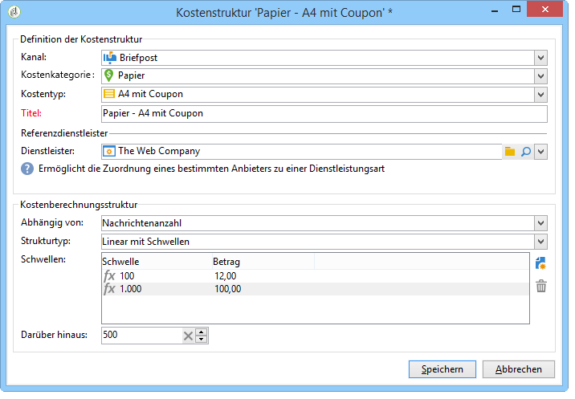

### Konfiguration der mit Dienstleistungen verbundenen Vorgänge {#configuring-processes-associated-with-a-service}

Über den Tab **[!UICONTROL Vorgänge]** können Informationen über mit der jeweiligen Dienstleistung verbundene Vorgänge hinzugefügt werden.

Klicken Sie auf den Tab **[!UICONTROL Vorgänge]**, um die Übermittlung von Informationen zum Router zu konfigurieren.

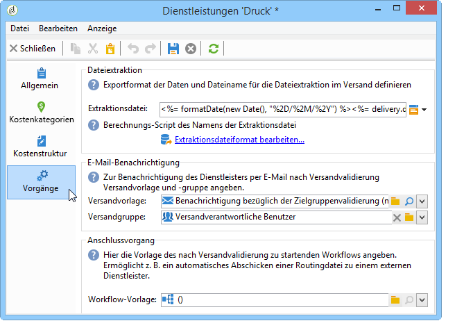

* Der Abschnitt **[!UICONTROL Dateiextraktion]** gibt die Exportvorlage an, die bei Auswahl dieses Dienstes für den Versand verwendet wird. Sie können den Namen der Ausgabedatei im Feld **[!UICONTROL Extraktionsdatei]** angeben. Die rechts vom Feld gelegene Schaltfläche ermöglicht das Einfügen von Variablen.

  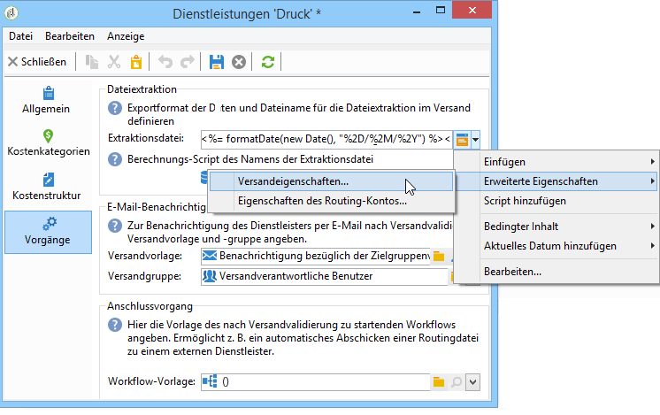

* Im Abschnitt **[!UICONTROL Benachrichtigungs-E]** können Sie die Vorlage angeben, die Service-Provider nach dem Versand von Dateien benachrichtigen soll. Wählen Sie die Vorlage, mit der die Warnmeldung erstellt wird, und die Empfängergruppe aus.

  Die Versandvorlagen der Benachrichtigungen werden standardmäßig im Knoten **[!UICONTROL Administration > Kampagnen > Vorlagen technischer Sendungen]** des Explorers gespeichert.

* Im **[!UICONTROL Anschlussvorgang]** können Sie den Workflow auswählen, der nach der Genehmigung des Versands gestartet werden soll. Wenn eine Workflow-Vorlage eingegeben wird, wird automatisch eine Workflow-Instanz erstellt und gestartet, sobald die Genehmigung wirksam wird. Dieser Workflow kann die Extraktionsdatei beispielsweise zur Verarbeitung an einen externen Dienstleister senden.

### Zuordnung von Dienstleistungen zu Kampagnen {#associating-a-service-with-a-campaign}

Services werden über Sendungen oder Aufgaben mit Kampagnen verknüpft. Dienstleister werden mit Versandvorlagen verknüpft, um ihre Services in den über diese Vorlage erstellten Sendungen anzubieten.

Wenn ein Service ausgewählt wird, die Kostenkategorien, die dem Versandtyp entsprechen (Briefpost, E-Mail usw.) werden automatisch in der zentralen Tabelle zusammen mit den definierten Verarbeitungsoptionen angezeigt.

>[!NOTE]
>
>Wenn bei der Auswahl eines Dienstes keine Kostenkategorie angezeigt wird, bedeutet dies, dass für diese Art von Prozess keine Kostenkategorie definiert wurde. Beispiel: Falls bei einem E-Mail-Versand keine Kostenkategorie mit dem Typ **[!UICONTROL E-Mail]** definiert wurde, wird keine Kategorie angezeigt und die Auswahl des Dienstes hat keine Auswirkungen.

* Beim Briefpost-Versand können Sie den Dienst über das Konfigurationsfenster auswählen.

  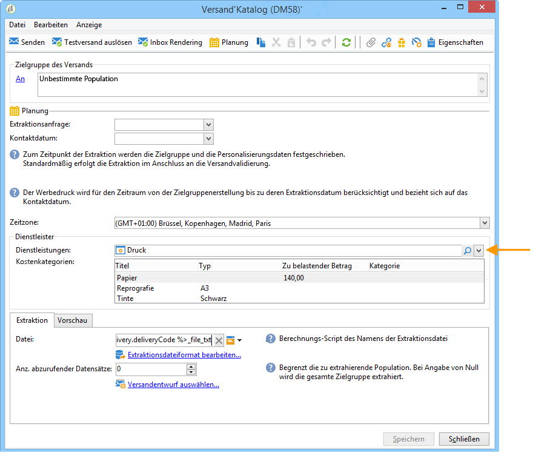

* In Mobile- oder Telefonsendungen werden Dienstleistungen auf die gleiche Weise wie bei Briefpost-Sendungen ausgewählt.
* In E-Mail-Sendungen werden Dienstleistungen über den Tab **[!UICONTROL Erweitert]** der Eigenschaften des jeweiligen Versands ausgewählt, wie im folgenden Beispiel:

  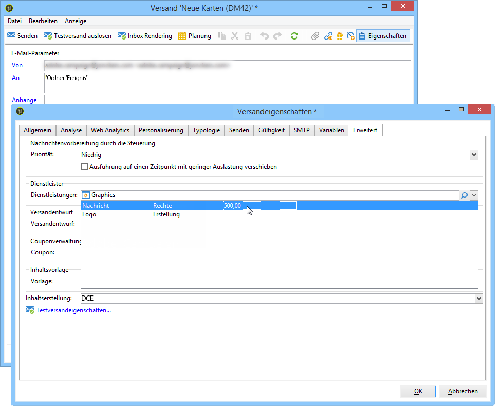

Über die Spalte **[!UICONTROL Zu belastender Betrag]** können Kosten für diese Stelle im Kontext des betreffenden Versands oder der Aufgabe hinzugefügt werden.

Sie können die Auswahl eines Kostentyps bei der Bestimmung der Kostenkategorien in einem Versand obligatorisch machen. Wählen Sie dazu **[!UICONTROL Auswahl eines Werts aus der Kostentypliste erforderlich]**.

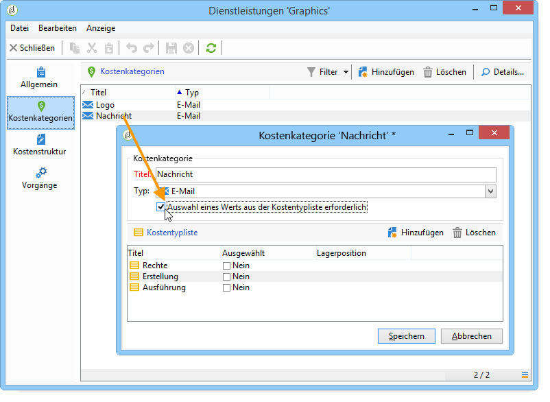

## Verwaltung von Lagern und Lagerergänzungen {#stock-and-order-management}

Kostentypen können Lagerpositionen zugeordnet werden, um Bestandsmeldungen zu verwalten, Lagerergänzungen zu verfolgen und Bestellungen zu tätigen.

Um die Verwaltung von Lagern und Lagerergänzungen in Adobe Campaign einzusetzen und Benutzern für die Durchführung eines Versands unzureichende Bestände zu melden, ist die Einhaltung folgender Schritte erforderlich:

1. Erstellung von Lagern und Referenzierung von zugeordneten Dienstleistern.

   Lesen Sie diesbezüglich auch den Abschnitt [Erstellung eines Lagers](#creating-a-stock).

1. Hinzufügen von Lagerpositionen

   Siehe [Hinzufügen von Lagerpositionen](#adding-stock-lines).

1. Benachrichtigung der Benutzer bei Unterschreiten des Meldebestands.

   Siehe [Benachrichtigung bei unzureichendem Bestand](#alerting-operators).

1. Bestellungen und Lieferungen;

   Siehe [Bestellungen](#orders).

### Lagerverwaltung {#stock-management}

Adobe Campaign kann eine Benutzergruppe benachrichtigen, wenn das Lager leer ist oder einen Mindestbestand erreicht hat. Auf die Lagerbestände kann über den Link **[!UICONTROL Lager]** im Tab **[!UICONTROL Kampagnen]** über den Link **[!UICONTROL Andere Auswahlmöglichkeiten]** des Navigationsbereichs zugegriffen werden.

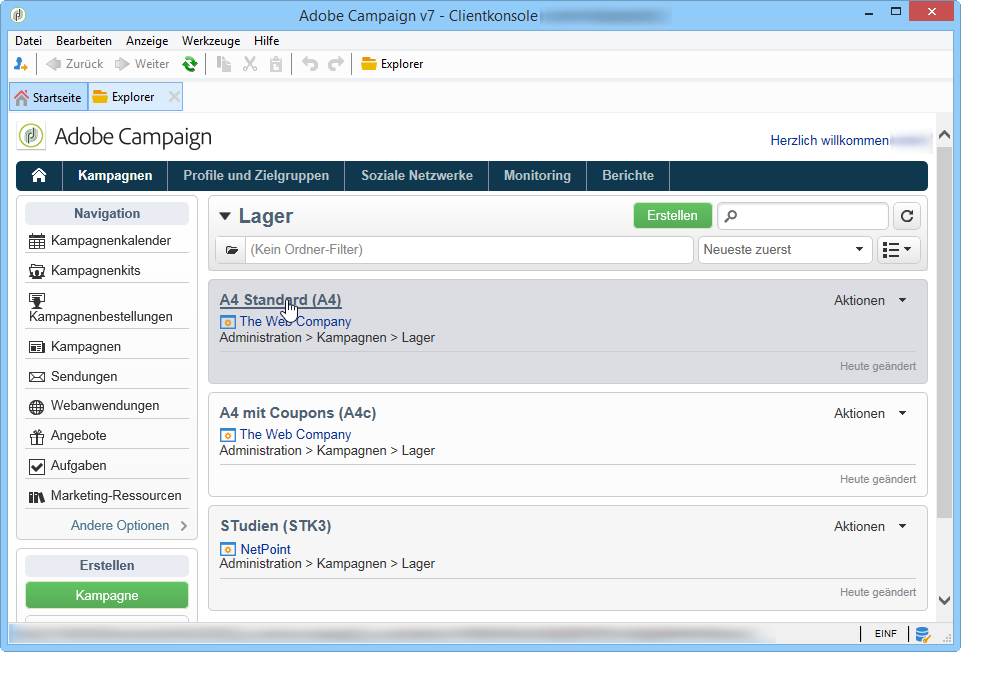

#### Erstellung eines Lagers {#creating-a-stock}

Folgen Sie den nachstehenden Etappen, um ein neues Lager zu erstellen:

1. Klicken Sie auf die Schaltfläche **[!UICONTROL Erstellen]** oberhalb der Liste der existierenden Lager.
1. Geben Sie den Titel des Lagers an und wählen Sie in der Dropdown-Liste den zugehörigen Dienstleister aus.

   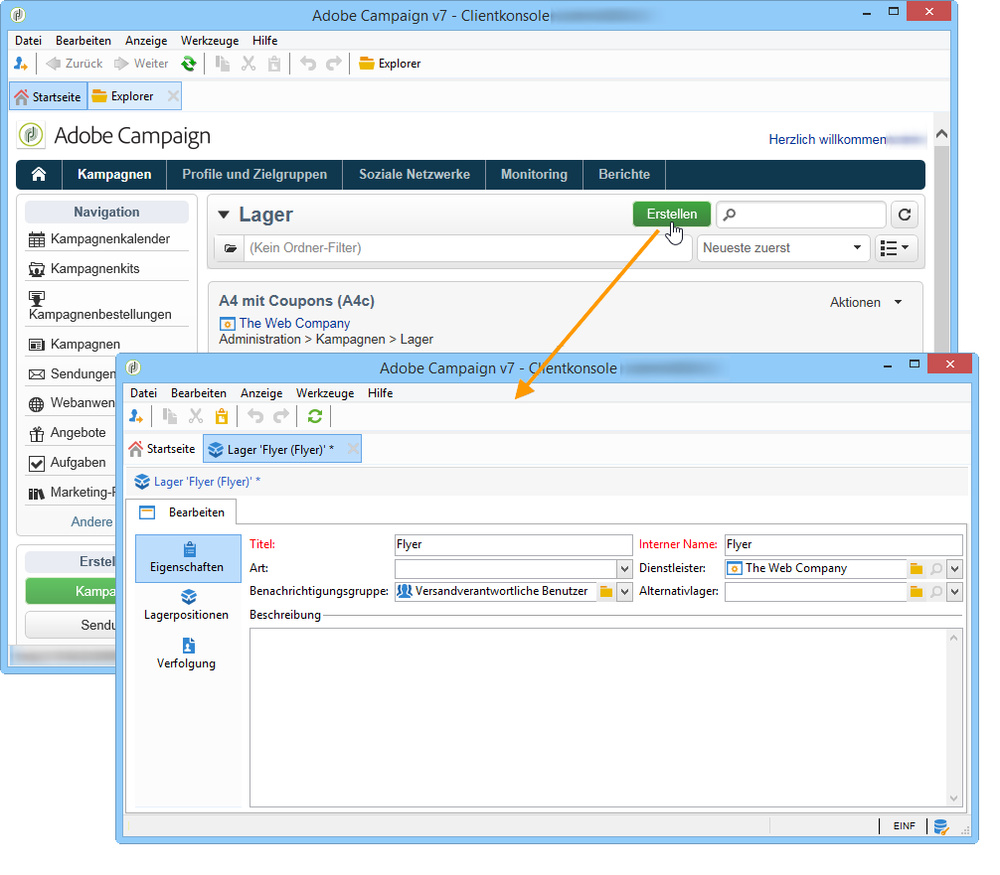

   >[!NOTE]
   >
   >Weitere Informationen finden Sie unter [Erstellung von Dienstleistern und deren Kostenstrukturen](#creating-service-providers-and-their-cost-structures).

#### Hinzufügen von Lagerpositionen {#adding-stock-lines}

Ein Lager umfasst verschiedene Lagerpositionen. Eine Lagerposition enthält eine Anfangsmenge an Ressourcen, die von Sendungen verbraucht werden. Jede Lagerposition gibt die verbrauchte Menge, die Lagermenge und die bestellte Menge an.

Klicken Sie bei der Erstellung eines Lagers auf den Tab **[!UICONTROL Lagerpositionen]**, um neue Positionen hinzuzufügen.

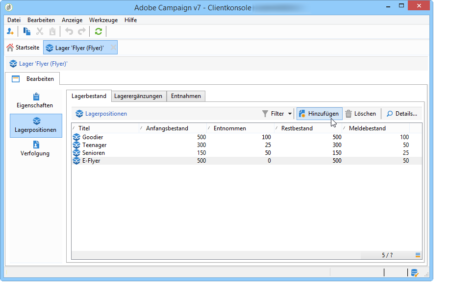

Nach der Erstellung des Lagers können Sie dieses per Klick öffnen und über sein Dashboard die Lagerpositionen anzeigen lassen.

Klicken Sie auf die Schaltfläche **[!UICONTROL Erstellen]**, um die Parameter des Lagers festzulegen.

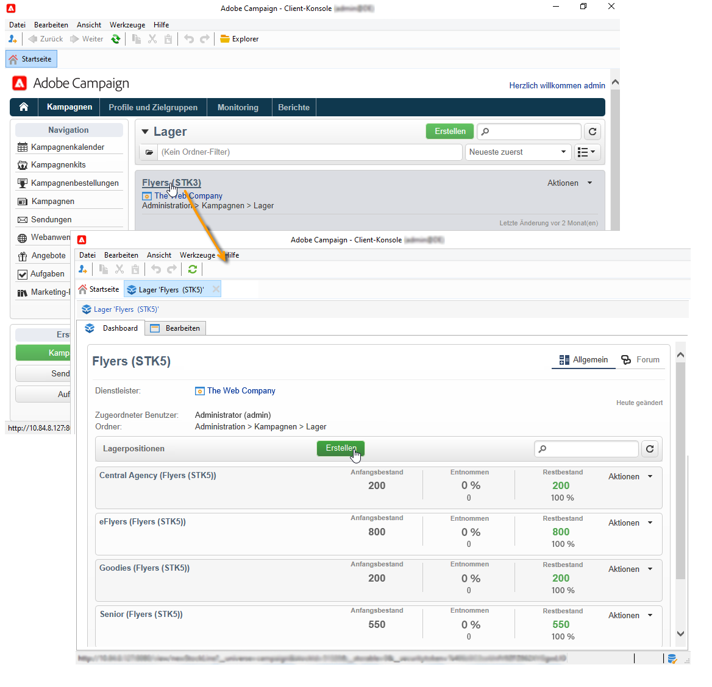

* Geben Sie die Anfangsmenge des Lagerbestands im Feld **[!UICONTROL Anfangsbestand]** an. Die Felder **[!UICONTROL Entnommen]** und **[!UICONTROL Restbestand]** werden automatisch berechnet und entsprechend dem Fortschritt der Kampagnen aktualisiert.

  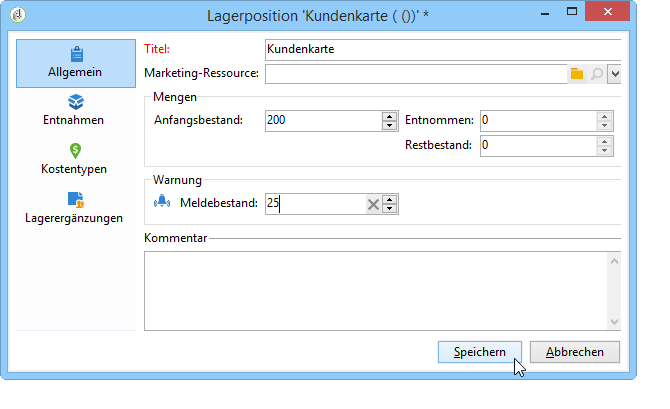

* Geben Sie im Feld „Alarmstufe“ den Schwellenwert an **[!UICONTROL ab dem Benutzer auf]** gewarnt werden sollen. Wenn die Warnstufe erreicht wird, wird im Validierungsfenster von Sendungen, die diese Lagerhaltung verwenden, eine Warnmeldung angezeigt.

#### Lagerpositionen zu Kostenkategorien zuordnen {#associating-a-stock-with-cost-categories}

Folgendes Beispiel zeigt, wie Lagerpositionen in Dienstleistungen über die Kostenkategorien zugeordnet werden können:

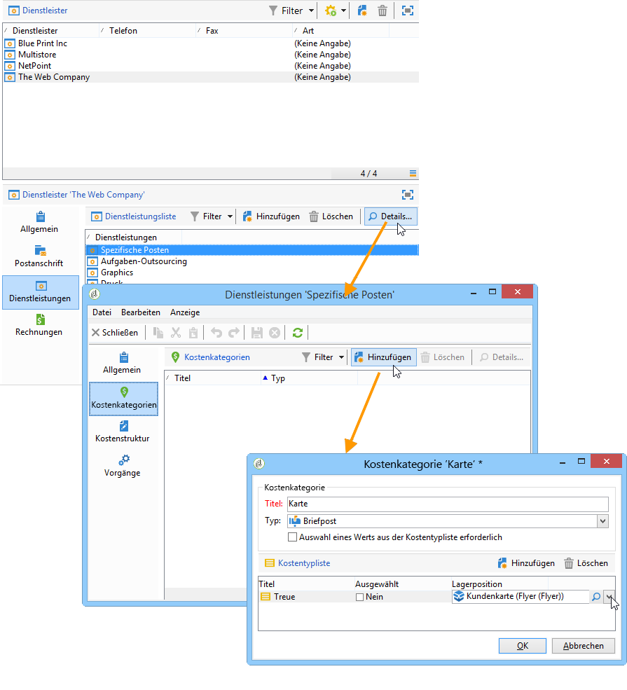

### Lagerverfolgung {#stock-tracking}

#### Benachrichtigung bei unzureichendem Bestand {#alerting-operators}

Ein Warnhinweis wird angezeigt, wenn ein Bestand, auf den in einem Versand verwiesen wird, nicht ausreicht. Beispielsweise wird folgender Warnhinweis angezeigt, wenn eine Extraktionsdatei validiert wurde:

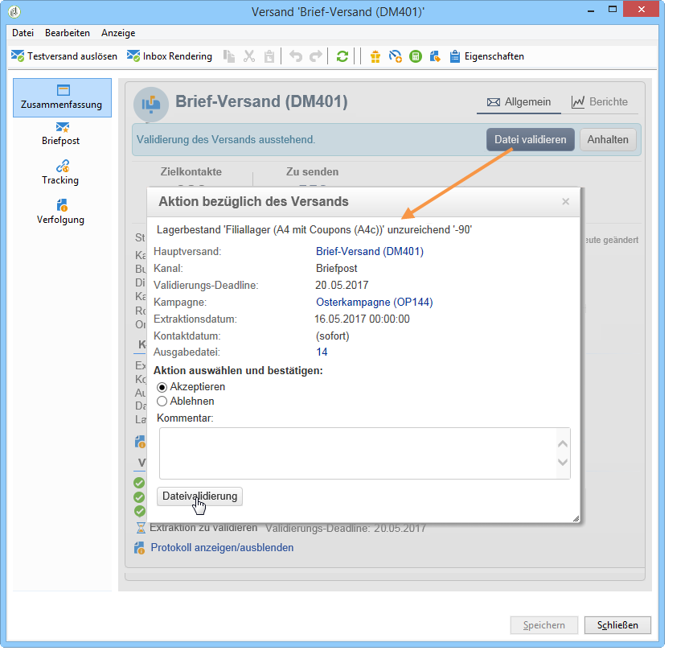

#### Lagerergänzungen {#orders}

Im Untertab **[!UICONTROL Lagerergänzungen]** werden die laufenden Bestellungen angezeigt und neue Ergänzungen gespeichert.

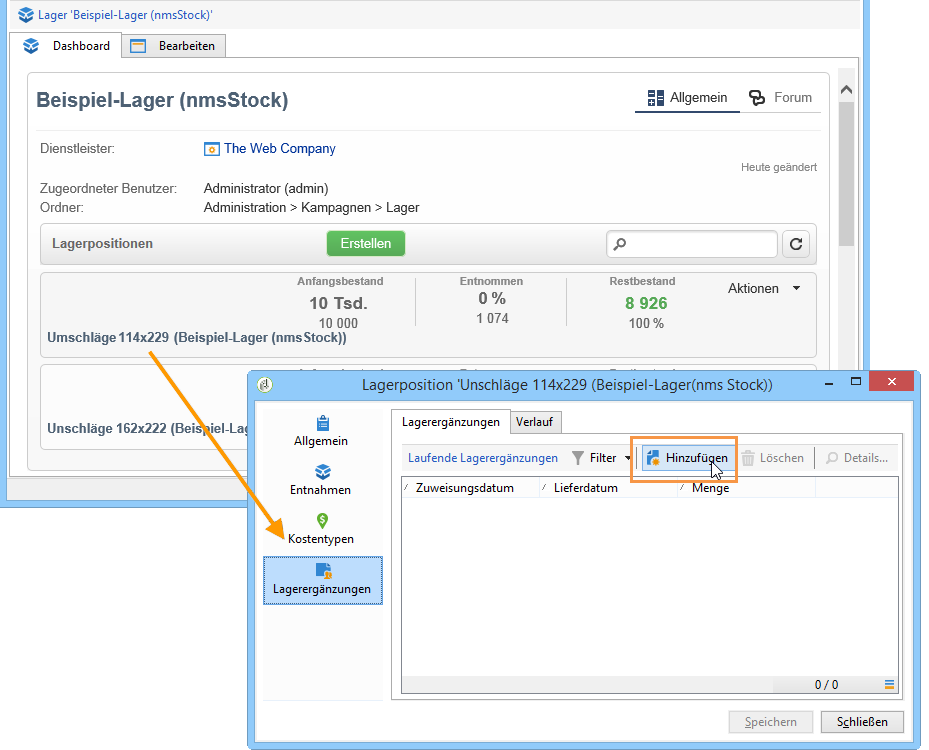

Um eine neue Ergänzung zu speichern, öffnen Sie die entsprechende Lagerposition, klicken Sie auf die Schaltfläche **[!UICONTROL Hinzufügen]** und geben Sie das Lieferdatum sowie die bestellte Menge an.

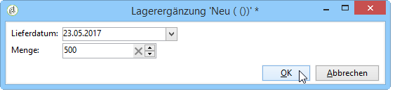

>[!NOTE]
>
>Sobald das Lieferdatum erreicht ist, verschwindet die bestellte Lagerposition automatisch und die im Feld **[!UICONTROL Menge auf Bestellung]** eingegebene Menge wird der Registerkarte **[!UICONTROL Tracking]** hinzugefügt. Diese Menge wird automatisch zum Lagerbestand hinzugefügt.

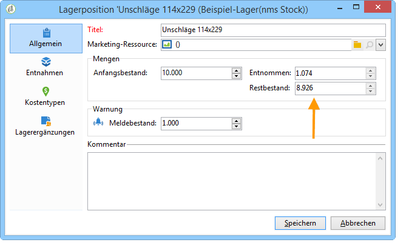

Die **[!UICONTROL Verbrauchswerte]** enthält das pro Kampagne verbrauchte Volumen. Die Informationen auf dieser Registerkarte werden automatisch entsprechend den durchgeführten Sendungen eingegeben. Klicken Sie auf die Schaltfläche **[!UICONTROL Bearbeiten]**, um die betroffene Kampagne zu öffnen.

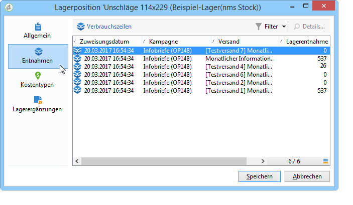

## Berechnung von Budgets {#calculating-budgets}

### Funktionsprinzip {#principle}

Kosten werden für Sendungen und Kampagnen verwaltet. Je nach Fortschritt werden diese Kosten den Haushalten zugewiesen.

Die Versandkosten für eine Kampagne werden auf Kampagnenebene konsolidiert, und die Kosten aller Kampagnen eines Programms werden an das Programm weitergegeben, mit dem sie verknüpft sind. Mit speziellen Berichten können Sie die Budgets für die gesamte Plattform oder für jeden Plan und jedes Programm verfolgen.

### Umsetzung {#implementation}

Wenn Sie in einer Kampagne das Budget auswählen, müssen Sie den Ausgangsbetrag eingeben. Die berechneten Kosten werden automatisch entsprechend der Höhe der Mittelbindung der angegebenen Beträge aktualisiert (getätigte, erwartete, reservierte, gebundene Ausgaben). Siehe [Betragsberechnung](../../mrm/using/controlling-costs.md#calculating-amounts).

>[!NOTE]
>
>Das Verfahren zum Erstellen von Budgets finden Sie unter [Erstellung von Budgets](../../mrm/using/controlling-costs.md#creating-a-budget).
