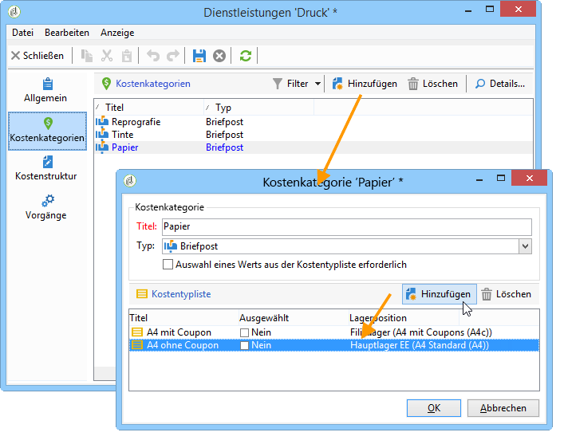
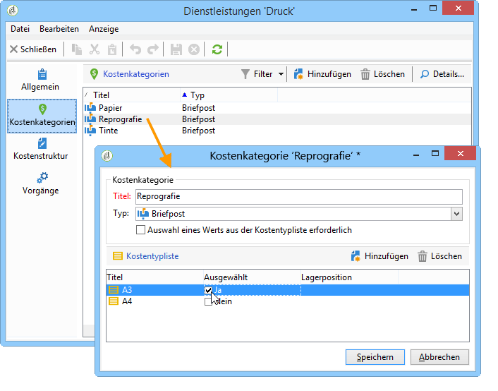
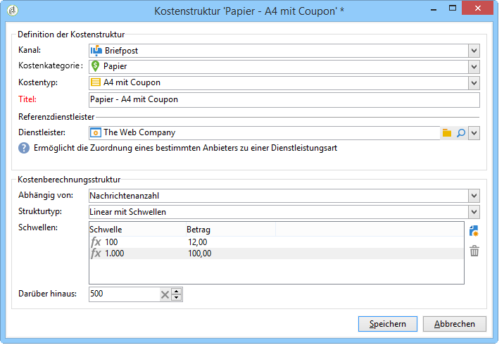
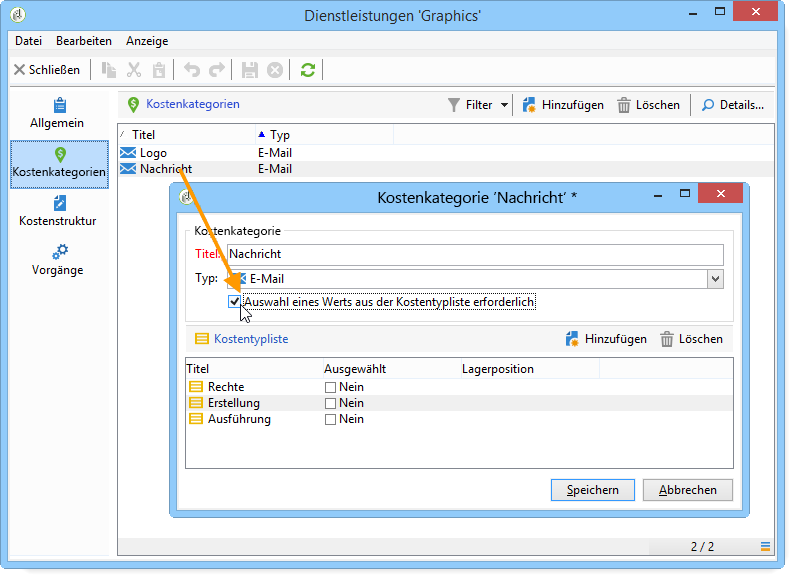
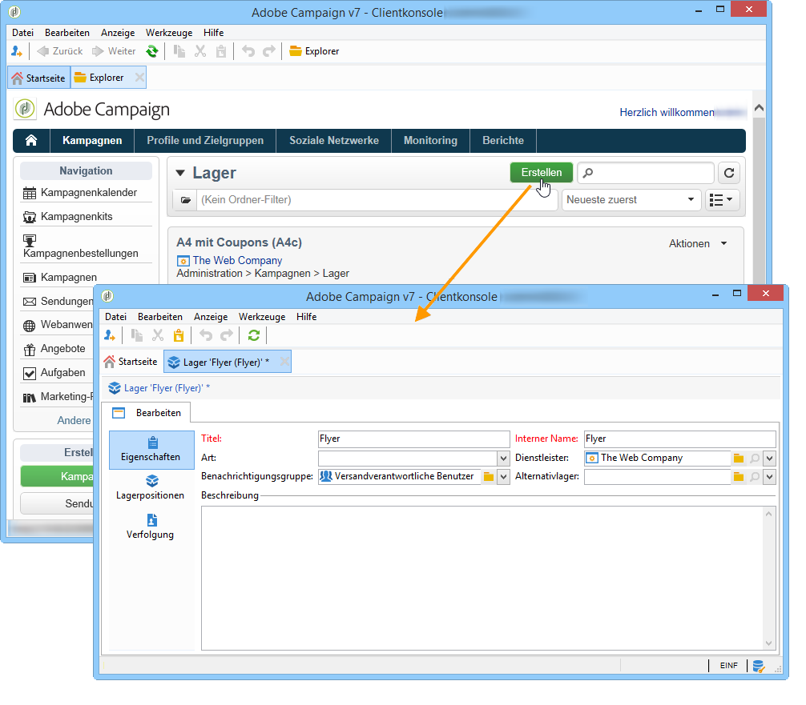
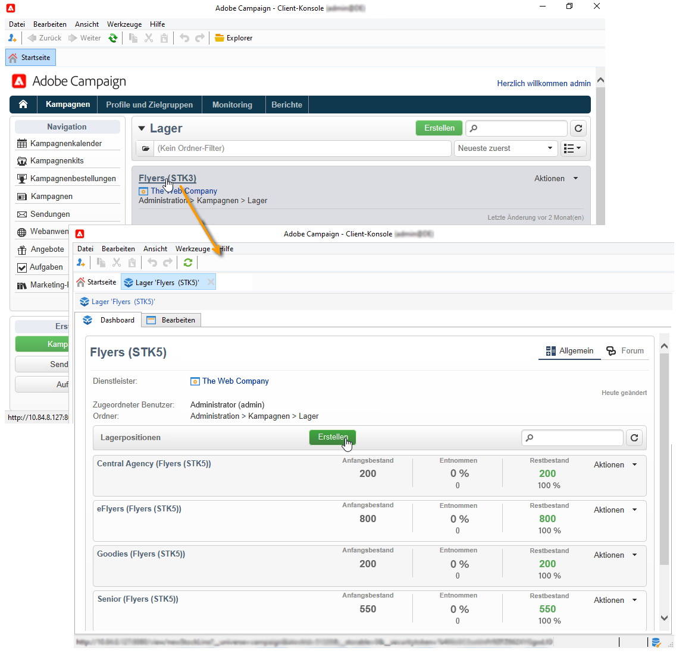
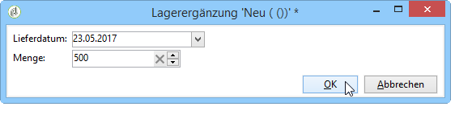
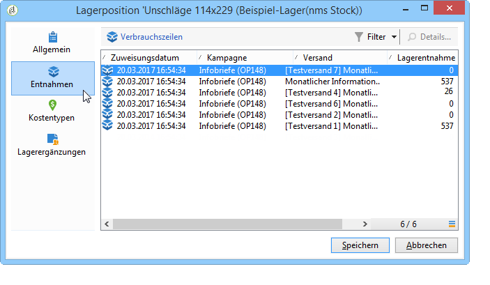

# Dienstleister, Lager und Budgets{#providers-stocks-and-budgets}

In Adobe Campaign haben Sie die Möglichkeit, Dienstleister zu bestimmen, die an der Ausführung bestimmter Vorgänge der Kampagnen beteiligt sind. Informationen bezüglich dieser Dienstleister und der ihnen zugeordneten Kostenstrukturen werden vom Adobe Campaign-Administrator über die allgemeine Übersicht festgelegt. Der Dienstleister wird auf Versandebene referenziert: Seine Kostenstrukturen ermöglichen die Berechnung der mit dem jeweiligen Versand verbundenen Kosten sowie die Verwaltung der betroffenen Lager.

## Erstellung von Dienstleistern und deren Kostenstrukturen {#creating-service-providers-and-their-cost-structures}

Jeder Dienstleister wird in einer Datei gespeichert, die seine Kontaktdaten, Dienstleistungsvorlagen und verbundene Vorgänge enthält.

Dienstleister werden im Knoten **[!UICONTROL Administration > Kampagnen > Dienstleister]** des Navigationsbaums konfiguriert.

Diverse, in Sendungen zu realisierende Vorgänge werden von Dienstleistern ausgeführt, insbesondere solche, die Briefpost und mobile Kanäle betreffen. Diese Dienstleister kommen beispielsweise in Druckvorgängen oder bei der Zustellung von Nachrichten zum Einsatz. Diese Vorgänge erfordern dienstleisterspezifische Einstellungen und verursachen Kosten. Die Konfiguration von Dienstleistern erfolgt in vier Schritten:

1. Erstellung des Dienstleisters in Adobe Campaign.

   Siehe [Hinzufügen eines Dienstleisters](#adding-a-service-provider).

1. Definition der Kostenkategorien und -strukturen der dem Dienstleister zugeordneten Dienstleistungsvorlagen.

   Siehe [Bestimmung der Kostenkategorien](#defining-cost-categories) und [Bestimmung der Kostenstruktur](#defining-the-cost-structure).

1. Konfiguration der Vorgänge.

   Siehe [Konfiguration der mit Dienstleistungen verbundenen Vorgänge](#configuring-processes-associated-with-a-service).

1. Referenzierung des Dienstleisters in Kampagnen.

   Siehe [Zuordnung von Dienstleistungen zu Kampagnen](#associating-a-service-with-a-campaign).

### Erstellen eines Dienstleisters und seiner Kostenkategorien {#creating-a-service-provider-and-its-cost-categories}

#### Hinzufügen eines Dienstleisters {#adding-a-service-provider}

Sie können so viele Dienstleister erstellen, wie für Ihre Sendungen notwendig sind. Gehen Sie wie folgt vor, um einen Dienstleister hinzuzufügen:

1. Machen Sie einen Rechtsklick in die Liste der Dienstleister und wählen Sie **[!UICONTROL Neu]** aus oder klicken Sie auf die Schaltlfäche **[!UICONTROL Neu]** oberhalb der Liste.
1. Geben Sie im unteren Abschnitt des Fensters Namen und Kontaktdaten des Dienstleisters an.

   

1. Klicken Sie auf die Schaltfläche **[!UICONTROL Speichern]**, um ihn der Liste hinzuzufügen.

#### Bestimmung der Kostenkategorien {#defining-cost-categories}

Jedem Dienstleister müssen Dienstleistungsvorlagen zugeordnet werden. In diesen Vorlagen werden zunächst die unterschiedlichen Kostenkategorien und bei Bedarf die betroffenen Lager angegeben. Daraufhin müssen über die Kostenstrukturen Regeln zur Kostenberechnung für jeden Kostentyp erstellt werden.

>[!NOTE]
>
>Lesen Sie diesbezüglich auch den Abschnitt [Bestimmung der Kostenstruktur](#defining-the-cost-structure).

Eine Kostenkategorie ist eine Einheit, die die für einen bestimmten Versandtyp (E-Mail, Briefpost usw.) oder für eine Aufgabe anfallenden Kosten enthält. Kostenkategorien werden in Dienstleistungsvorlagen zusammengefasst, die wiederum Dienstleistern zugeordnet werden. Jeder Dienstleister kann eine oder mehrere Dienstleistungsvorlagen referenzieren.

Um eine Dienstleistungsvorlage zu erstellen und ihren Inhalt zu bestimmen, gehen Sie wie folgt vor:

1. Klicken Sie im Tab **[!UICONTROL Dienstleistungen]** des Dienstleisters auf die Schaltfläche **[!UICONTROL Hinzufügen]** und benennen Sie die Dienstleistungsvorlage.

   

1. Erstellen Sie die Kostenkategorien für jeden Prozesstyp (Versand durch Direkt-Mail/E-Mail/etc. oder Aufgabe). Klicken Sie dazu auf die Registerkarte **[!UICONTROL Kostenkategorien]** und dann auf die Schaltfläche **[!UICONTROL Hinzufügen]** und geben Sie die Parameter jeder Kostenkategorie an.

   

   * Geben Sie einen Titel für die Kostenkategorie an und wählen Sie den betreffenden Vorgangstyp aus: Versand per **[!UICONTROL Direkt-Mail]**, **[!UICONTROL E-Mail]**, **[!UICONTROL Mobilgerät]**, **[!UICONTROL Telefon]** oder **[!UICONTROL Aufgabe]**.
   * Klicken Sie auf die Schaltfläche **[!UICONTROL Hinzufügen]**, um die mit dieser Kostenkategorie verbunden Kostentypen zu bestimmen.
   * Bei Bedarf können Sie jedem Kostentyp eine Lagerposition hinzufügen, um den bestehenden Lagern automatisch die verwendeten Mengen anzurechnen.

     >[!NOTE]
     >
     >Die Lagerpositionen werden im Knoten **[!UICONTROL Lagerverwaltung]** definiert.\
     >Weitere Informationen finden Sie unter [Verwaltung von Lagern und Lagerergänzungen](#stock-and-order-management).

1. Sie können einen Wert für diese Kostenkategorie vorab auswählen. Dieser wird dann der Standardwert in den Kostenkategorien des Dienstleisters (anstelle eines leeren Werts) vorausgefüllt. Wählen Sie dazu in der Spalte **[!UICONTROL Ausgewählt]** für den betreffende Kategorietyp die Option aus:

   

   Auf Ebene des Versand wird der Wert standardmäßig vorgeschlagen:

   

### Bestimmung der Kostenstruktur {#defining-the-cost-structure}

Eine Kostenstruktur gibt für jede Kostenkategorie die anzuwendenden Berechnungsregeln an.

Klicken Sie auf die Registerkarte **[!UICONTROL Kostenstruktur]**, um die Kostenberechnung für jede Kostenkategorie und jeden Kostentyp zu konfigurieren. Klicken Sie auf **[!UICONTROL Hinzufügen]** und geben Sie die Kostenstruktur ein.

* Um die Kostenstruktur zu erstellen, wählen Sie in den Dropdown-Listen den Nachrichtentyp, die betreffende Kostenkategorie sowie den Kostentyp aus, auf den die Berechnungsregel angewendet werden soll. Der Inhalt dieser Dropdown-Listen stammt aus den Informationen, die über die Registerkarte **[!UICONTROL Kostenkategorien]** eingetragen wurden.

  Sie müssen der Kostenstruktur einen Titel zuweisen. Standardmäßig hat sie den folgenden Versandentwurf: **Kostenkategorie – Kostentyp**.

  Dieser kann jedoch angepasst werden: Erfassen Sie den gewünschten Wert direkt im Feld **[!UICONTROL Titel]**.

* Die Formel zur Berechnung der Kosten wird im unteren Abschnitt des Fensters definiert.

  Diese Formel kann unabhängig von der Nachrichtenanzahl festgelegt oder entsprechend der Nachrichtenanzahl berechnet werden.

  Wenn die Formel von der Nachrichtenanzahl abhängt, kann die Struktur der Kostenberechnung **[!UICONTROL Linear]**, **[!UICONTROL Linear mit Schwellen]** oder **[!UICONTROL Pauschal mit Schwellen]** sein.

#### Lineare Struktur {#linear-structure}

Wenn es sich unabhängig von der Gesamtzahl von Nachrichten immer um den gleichen Betrag für eine Nachricht (oder eine Gruppe von Nachrichten) handelt, wählen Sie den Strukturtyp **[!UICONTROL Linear]** aus und geben Sie die Kosten pro Nachricht an.

Wenn der Betrag auf eine bestimmte Anzahl an Nachrichten angewandt wird, geben Sie diese im Feld **[!UICONTROL für]** an.

#### Lineare Struktur mit Schwellen {#linear-structure-by-threshold}

Wenn der Betrag entsprechend dem Schwellenwert für jede Nachricht angewandt wird, muss die Berechnungsstruktur **[!UICONTROL Linear mit Schwellen]** festgelegt werden. Mit dieser Art von Kostenstruktur kostet zum Beispiel jede Nachricht 0,13, wenn die Gesamtzahl der Nachrichten zwischen 1 und 100 liegt, 0,12 bei zwischen 100 und 1.000 versendeten Nachrichten und 0,11 jenseits von 1.000 Nachrichten.

Die Konfiguration stellt sich wie folgt dar:

Klicken Sie auf die Schaltfläche **[!UICONTROL Hinzufügen]** rechts von der Liste, um einen neuen Schwellenwert zu definieren.

#### Konstante Struktur mit Schwellen {#constant-structure-by-threshold}

Schließlich können Sie eine Kostenberechnung entsprechend der Gesamtzahl der Nachrichten konfigurieren. Wählen Sie dazu die Berechnungsstruktur **[!UICONTROL Pauschal mit Schwellen]**. Beispielsweise werden die Kosten für 1 bis 100 Nachrichten auf einen festen Betrag von 12,00 gesetzt, für einen Versand von 101 bis 1000 Nachrichten auf 100,00 und für jeden Versand von über 1000 Nachrichten auf 500,00, unabhängig von der Gesamtzahl.

### Konfiguration der mit Dienstleistungen verbundenen Vorgänge {#configuring-processes-associated-with-a-service}

Über den Tab **[!UICONTROL Vorgänge]** können Informationen über mit der jeweiligen Dienstleistung verbundene Vorgänge hinzugefügt werden.

Klicken Sie auf den Tab **[!UICONTROL Vorgänge]**, um die Übermittlung von Informationen zum Router zu konfigurieren.

* Der Abschnitt **[!UICONTROL Dateiextraktion]** gibt die Exportvorlage an, die bei Auswahl dieses Dienstes für den Versand verwendet wird. Sie können den Namen der Ausgabedatei im Feld **[!UICONTROL Extraktionsdatei]** angeben. Die rechts vom Feld gelegene Schaltfläche ermöglicht das Einfügen von Variablen.

  

* Im Abschnitt **[!UICONTROL Benachrichtigungs-E-Mail]** können Sie die Vorlage für die Benachrichtigung von Dienstanbietern nach dem Versand von Dateien angeben. Wählen Sie die Vorlage, mit der die Warnmeldung erstellt werden soll, und die Gruppe der Empfängerinnen und Empfänger.

  Die Versandvorlagen der Benachrichtigungen werden standardmäßig im Knoten **[!UICONTROL Administration > Kampagnen > Vorlagen technischer Sendungen]** des Explorers gespeichert.

* Im Abschnitt **[!UICONTROL Anschlussvorgang]** wird der nach der Versandvalidierung zu startende Workflow ausgewählt. Wenn eine Workflow-Vorlage angegeben wird, wird nach beendeter Validierung automatisch eine Workflow-Instanz erstellt und gestartet. Dieser Workflow kann beispielsweise die Extraktionsdatei zur Verarbeitung an einen externen Dienstleister senden.

### Zuordnung von Dienstleistungen zu Kampagnen {#associating-a-service-with-a-campaign}

Services werden über Sendungen oder Aufgaben mit Kampagnen verknüpft. Dienstleister werden mit Versandvorlagen verknüpft, um ihre Services in den über diese Vorlage erstellten Sendungen anzubieten.

Wenn ein Dienst ausgewählt wird, werden die dem Versandtyp (Briefpost, E-Mail usw.) entsprechenden Kostenkategorien automatisch in der zentralen Tabelle angegeben, ebenso wie die bereits definierten Verarbeitungsoptionen.

>[!NOTE]
>
>Wenn bei der Auswahl eines Dienstes keine Kostenkategorie angezeigt wird, bedeutet dies, dass für diese Art von Prozess keine Kostenkategorie definiert wurde. Beispiel: Falls bei einem E-Mail-Versand keine Kostenkategorie mit dem Typ **[!UICONTROL E-Mail]** definiert wurde, wird keine Kategorie angezeigt und die Auswahl des Dienstes hat keine Auswirkungen.

* Beim Briefpost-Versand können Sie den Dienst über das Konfigurationsfenster auswählen.

  

* In Mobile- oder Telefonsendungen werden Dienstleistungen auf die gleiche Weise wie bei Briefpost-Sendungen ausgewählt.
* In E-Mail-Sendungen werden Dienstleistungen über den Tab **[!UICONTROL Erweitert]** der Eigenschaften des jeweiligen Versands ausgewählt, wie im folgenden Beispiel:

  

Über die Spalte **[!UICONTROL Zu belastender Betrag]** können Kosten für diese Stelle im Kontext des betreffenden Versands oder der Aufgabe hinzugefügt werden.

Sie können die Auswahl eines Kostentyps bei der Bestimmung der Kostenkategorien in einem Versand obligatorisch machen. Wählen Sie dazu **[!UICONTROL Auswahl eines Werts aus der Kostentypliste erforderlich]**.

## Verwaltung von Lagern und Lagerergänzungen {#stock-and-order-management}

Kostentypen können Lagerpositionen zugeordnet werden, um Bestandsmeldungen zu verwalten, Lagerergänzungen zu verfolgen und Bestellungen zu tätigen.

Um die Verwaltung von Lagern und Lagerergänzungen in Adobe Campaign einzusetzen und Benutzern für die Durchführung eines Versands unzureichende Bestände zu melden, ist die Einhaltung folgender Schritte erforderlich:

1. Erstellung von Lagern und Referenzierung von zugeordneten Dienstleistern.

   Lesen Sie diesbezüglich auch den Abschnitt [Erstellung eines Lagers](#creating-a-stock).

1. Hinzufügen von Lagerpositionen

   Siehe [Hinzufügen von Lagerpositionen](#adding-stock-lines).

1. Benachrichtigung der Benutzer bei Unterschreiten des Meldebestands.

   Siehe [Benachrichtigung bei unzureichendem Bestand](#alerting-operators).

1. Bestellungen und Lieferungen;

   Siehe [Bestellungen](#orders).

### Lagerverwaltung {#stock-management}

Adobe Campaign kann eine Benutzergruppe benachrichtigen, wenn das Lager leer ist oder einen Mindestbestand erreicht hat. Auf die Lagerbestände kann über den Link **[!UICONTROL Lager]** im Tab **[!UICONTROL Kampagnen]** über den Link **[!UICONTROL Andere Auswahlmöglichkeiten]** des Navigationsbereichs zugegriffen werden.

#### Erstellung eines Lagers {#creating-a-stock}

Folgen Sie den nachstehenden Etappen, um ein neues Lager zu erstellen:

1. Klicken Sie auf die Schaltfläche **[!UICONTROL Erstellen]** oberhalb der Liste der existierenden Lager.
1. Geben Sie den Titel des Lagers an und wählen Sie in der Dropdown-Liste den zugehörigen Dienstleister aus.

   

   >[!NOTE]
   >
   >Weitere Informationen finden Sie unter [Erstellung von Dienstleistern und deren Kostenstrukturen](#creating-service-providers-and-their-cost-structures).

#### Hinzufügen von Lagerpositionen {#adding-stock-lines}

Ein Lager setzt sich aus unterschiedlichen Lagerpositionen zusammen. Eine Lagerposition enthält eine Anfangsmenge der Ressourcen, die von den Sendungen verbraucht werden. Jede Position enthält außerdem die verbrauchte Menge, den Restbestand sowie die bestellte Menge.

Klicken Sie bei der Erstellung eines Lagers auf den Tab **[!UICONTROL Lagerpositionen]**, um neue Positionen hinzuzufügen.

Nach der Erstellung des Lagers können Sie dieses per Klick öffnen und über sein Dashboard die Lagerpositionen anzeigen lassen.

Klicken Sie auf die Schaltfläche **[!UICONTROL Erstellen]**, um die Parameter des Lagers festzulegen.

* Geben Sie die Anfangsmenge des Lagerbestands im Feld **[!UICONTROL Anfangsbestand]** an. Die Felder **[!UICONTROL Entnommen]** und **[!UICONTROL Restbestand]** werden automatisch berechnet und entsprechend dem Fortschritt der Kampagnen aktualisiert.

  

* Geben Sie im Feld **[!UICONTROL Meldebestand]** den Schwellenwert an, bei dem die Benutzenden über eine notwendige Lagerergänzung benachrichtigt werden sollen. Beim Erreichen des Meldebestands wird im Validierungsfenster der Sendungen, die auf dieses Lager zugreifen, ein Warnhinweis angezeigt.

#### Lagerpositionen zu Kostenkategorien zuordnen {#associating-a-stock-with-cost-categories}

Folgendes Beispiel zeigt, wie Lagerpositionen in Dienstleistungen über die Kostenkategorien zugeordnet werden können:

### Lagerverfolgung {#stock-tracking}

#### Benachrichtigung bei unzureichendem Bestand {#alerting-operators}

Bei einem Versand, der auf eine Lagerposition mit unzureichendem Bestand zugreift, wird ein Warnhinweis angezeigt. Das unten stehende Beispiel zeigt die Meldung, die bei Validierung einer Extraktionsdatei erscheint:

#### Lagerergänzungen {#orders}

Im Untertab **[!UICONTROL Lagerergänzungen]** werden die laufenden Bestellungen angezeigt und neue Ergänzungen gespeichert.

Um eine neue Ergänzung zu speichern, öffnen Sie die entsprechende Lagerposition, klicken Sie auf die Schaltfläche **[!UICONTROL Hinzufügen]** und geben Sie das Lieferdatum sowie die bestellte Menge an.

>[!NOTE]
>
>Mit Erreichen des Lieferdatums verschwindet die Lagerergänzungszeile automatisch und die im Feld **[!UICONTROL Menge]** angegebene Ergänzung wird im Tab **[!UICONTROL Verfolgung]** angezeigt. Sie wird zudem automatisch dem Bestand hinzugefügt.

Die Registerkarte **[!UICONTROL Entnahmen]** enthält das pro Kampagne entnommene Volumen. Die Informationen in dieser Registerkarte werden entsprechend den durchgeführten Sendungen automatisch angegeben. Klicken Sie auf die Schaltfläche **[!UICONTROL Bearbeiten]**, um die betroffene Kampagne zu öffnen.

## Berechnung von Budgets {#calculating-budgets}

### Funktionsprinzip {#principle}

Sie haben die Möglichkeit, Kosten für Sendungen oder Kampagnen zu verwalten und diese auf zuvor definierte Budgets anzurechnen.

Die Versandkosten einer Kampagne werden in der jeweiligen Kampagne, die Kosten aller Kampagnen eines Programms im jeweiligen Programm konsolidiert. Dedizierte Berichte ermöglichen die Verfolgung der Budgets für die gesamte Plattform oder für jeden Plan und jedes Programm.

### Implementierung {#implementation}

Wenn Sie in einer Kampagne ein Budget auswählen, müssen Sie den Ausgangsbetrag angeben. Die berechneten Kosten werden automatisch aktualisiert, entsprechend dem Verbindlichkeitsniveau der angegebenen Beträge (realisierte, geplante, reservierte, eingesetzte Ausgaben). Siehe [Betragsberechnung](../../mrm/using/controlling-costs.md#calculating-amounts).

>[!NOTE]
>
>Das Verfahren zum Erstellen von Budgets finden Sie unter [Erstellung von Budgets](../../mrm/using/controlling-costs.md#creating-a-budget).
