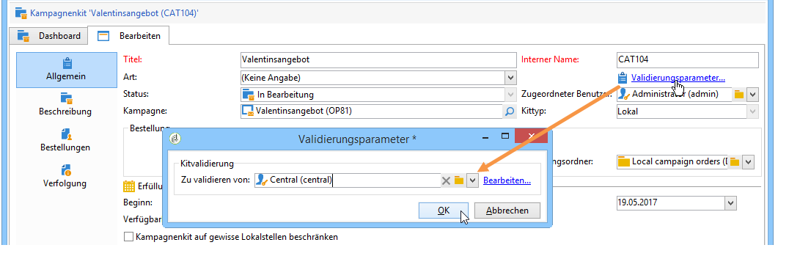
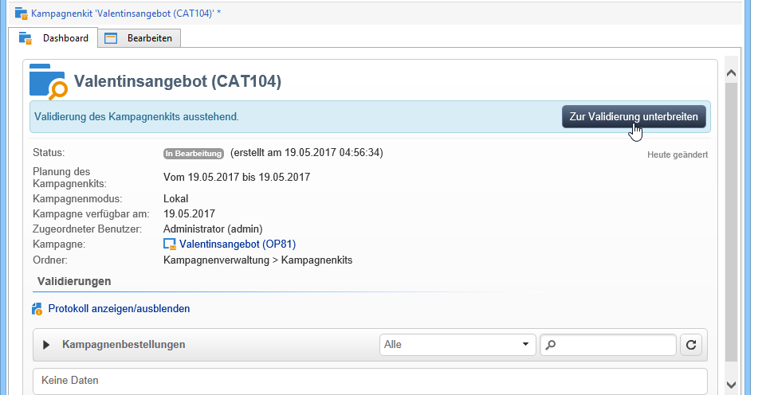
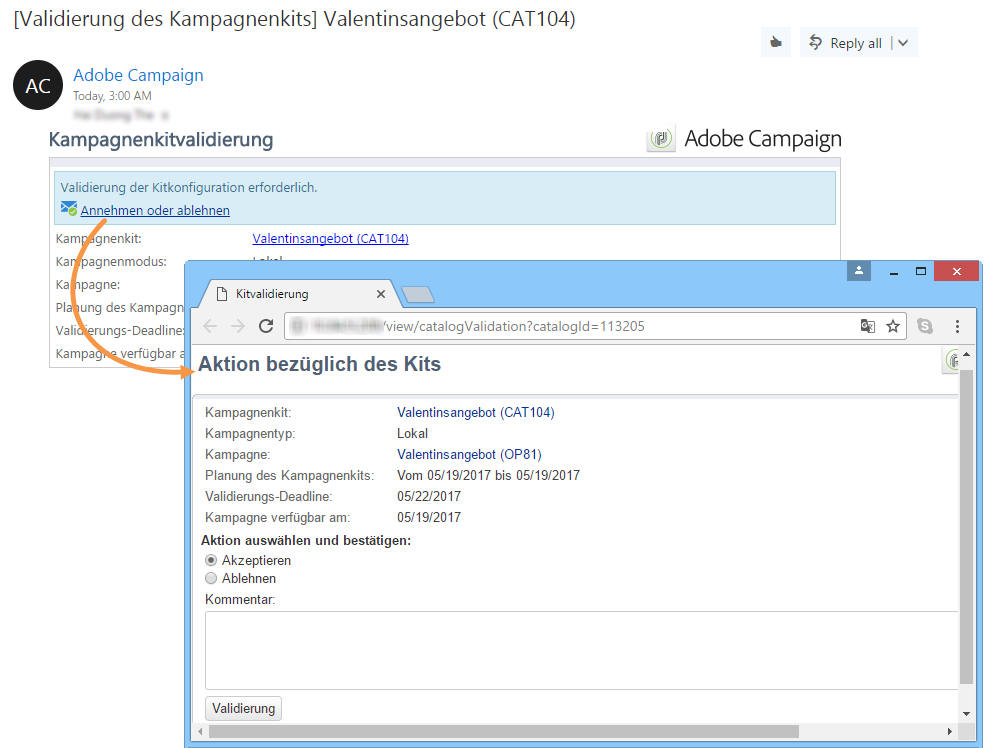
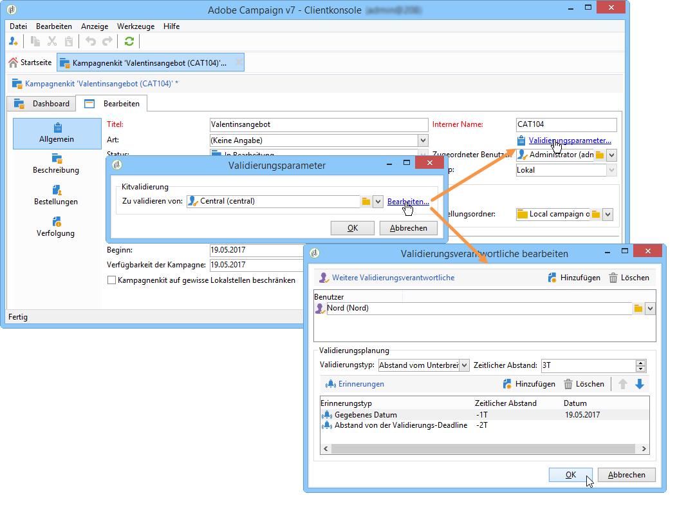
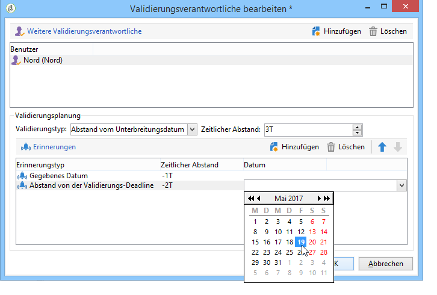
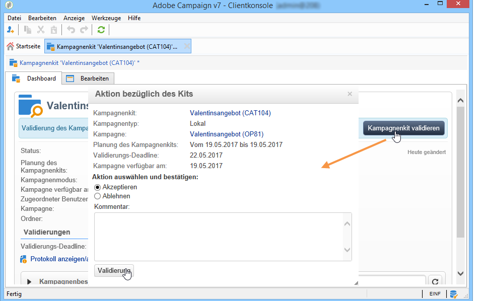

# Kampagnenkits publizieren{#publishing-the-campaign-package}

Central entity operators publish campaigns they wish to offer to local entities in the **[!UICONTROL list of campaign packages]**.

Bevor sie in der Kampagnenpaketliste veröffentlicht werden können, müssen die Kampagnenpakete von der zentralen Entität genehmigt werden. Dazu können Sie einen Prüfer oder eine Gruppe von Prüfern über den **[!UICONTROL Approval parameters]** Link im Kampagnenpaket angeben.

## Validierenden Benutzer bestimmen {#assigning-a-reviewer}

To select the reviewer, click the **[!UICONTROL Approval parameters]** link from the campaign package and choose the relevant reviewer from the drop-down list.

You may then begin the approval process by clicking **[!UICONTROL Submit for approval]**.

Der validierungsverantwortliche Benutzer erhält daraufhin eine Benachrichtigung, um die Verfügbarkeit des Kampagnenkits zu bestätigen. Über einen in der Nachricht enthaltenen Link kann er per Webzugriff die Validierung akzeptieren oder ablehnen.

>[!NOTE]
>
>Auf Unternehmensebene können Sie auch Prüfer angeben, um Bestellungen zu genehmigen. For more on this, refer to [Organizational entities](../../campaign/using/about-distributed-marketing.md#organizational-entities).

## Weitere validierende Benutzer hinzufügen {#adding-other-reviewers}

You can add other reviewers from the **[!UICONTROL Edit...]** link, found in the campaign package&#39;s **[!UICONTROL Approval parameters...]** tab.

## Validierungs-Deadlines {#approval-periods}

Wenn nicht anders angegeben, muss die Validierung innerhalb von drei Tagen ab dem Unterbreitungsdatum erfolgen.

Im Fenster &quot;Prüfer bearbeiten&quot;können Sie auch Erinnerungen festlegen, die eine oder mehrere Nachrichten senden, wenn ein Kampagnepaket nicht genehmigt wurde. Klicken Sie dazu auf den **[!UICONTROL Add reminder]** Link und dann auf die **[!UICONTROL Add]** Schaltfläche.

Erinnerungen können an ein bestimmtes Datum und/oder **x** Tage nach dem Einsendungsdatum gesendet werden. Der Typ der Erinnerung kann in der ersten Spalte der Erinnerungstabelle konfiguriert werden. Im unten stehenden Beispiel erhalten die Prüfer eine Erinnerungsmeldung am 29.1.2014, d. h. zwei Tage vor dem in der **[!UICONTROL Date]** Spalte ausgewählten Datum, und eine zweite Erinnerung einen Tag vor Ende des Genehmigungszeitraums, d. h. zwei Tage nach dem Tag, an dem die Genehmigung eingereicht wurde.

Sobald es definiert und das Paket zur Genehmigung eingereicht wurde, wird der Ausführungsplan auf der **[!UICONTROL Audit]** Registerkarte angezeigt. Er zeigt den auf der Grundlage der vorherigen Konfiguration berechneten Verarbeitungszeitpunkt sowie die Daten aller konfigurierten Erinnerungen an.

## Validierung über die Adobe-Campaign-Konsole {#approving-via-the-adobe-campaign-console}

If no reviewer has been specified or if none of the notified operators have approved the package, the **[!UICONTROL Approve the package]** button lets you proceed directly to the approval from the campaign package **[!UICONTROL Dashboard]** or from the packages overview.

Nach der Genehmigung wird die Kampagne veröffentlicht, der Liste hinzugefügt und sobald ihr Verfügbarkeitsdatum erreicht ist, können lokale Entitäten sie verwenden. Wenn die lokalen Entitäten beim Erstellen der Kampagne angegeben wurden, wird eine Meldung an die Operatoren in der Benachrichtigungsgruppe gesendet, um sie darüber zu informieren, dass die Kampagne verfügbar ist. Wenn zuvor keine Entität angegeben wurde, steht die Kampagne standardmäßig allen lokalen Entitäten zur Verfügung. For more on this, refer to [Organizational entities](../../campaign/using/about-distributed-marketing.md#organizational-entities).
