# Erste Schritte mit Marketing-Kampagnen{#setting-up-marketing-campaigns}

Kampagnen umfassen Aktionen (Sendungen) und Prozesse (Importieren oder Extrahieren von Dateien) sowie Ressourcen (Marketing-Dokumente, Versandentwürfe). Sie werden in Marketing-Kampagnen verwendet. Kampagnen sind Teil eines Programms und Programme Teil eines Kampagnenplans.

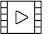 [Im Video](#video) erfahren Sie, wie man einen Marketing-Plan, Programme und Kampagnen erstellt.

So erstellen Sie eine Marketing-Kampagne:

1. Erstellung einer Kampagne: Ermittlung von Kampagnen und deren Eigenschaften: Titel, Typ, Anfangs- und Enddatum, Budget, zugehörige Ressourcen, Verantwortliche und Teilnehmer. [Weitere Informationen](#creating-a-campaign).

1. Bestimmung der Zielpopulation(en): Erstellung eines Workflows mit Zielgruppenbestimmungs-Abfragen. [Weitere Informationen](../../campaign/using/marketing-campaign-deliveries.md#selecting-the-target-population).

1. Erstellen von Sendungen: Auswahl von Kanälen und Definition des zu sendenden Inhalts. [Weitere Informationen](../../campaign/using/marketing-campaign-deliveries.md#creating-deliveries).

1. Validieren von Sendungen. [Weitere Informationen](../../campaign/using/marketing-campaign-approval.md).

1. Überwachen von Sendungen. [Weitere Informationen](../../campaign/using/marketing-campaign-monitoring.md).

1. Planen von Kampagnen und der damit verbundenen Kosten. [Weitere Informationen](../../campaign/using/providers-stocks-and-budgets.md#creating-service-providers-and-their-cost-structures).

Nach Abschluss dieser Schritte können Sie den Versand starten (siehe [diesen Abschnitt](../../campaign/using/marketing-campaign-deliveries.md#starting-a-delivery)), die Daten, Prozesse und Informationen zu den Sendungen überprüfen und bei Bedarf die zugehörigen Dokumente verwalten (siehe [diesen Abschnitt](../../campaign/using/marketing-campaign-deliveries.md#managing-associated-documents)). Außerdem können Sie die Ausführung der Verarbeitungsphasen von Kampagnen und Sendungen verfolgen (siehe [diesen Abschnitt](../../campaign/using/marketing-campaign-monitoring.md)).

## Erstellung einer Plan- und Programmhierarchie {#creating-plan-and-program-hierarchy}

Um Ihre Ordnerhierarchie für Marketing-Pläne und -Programme zu konfigurieren, gehen Sie folgendermaßen vor:

1. Klicken Sie auf das **Explorer-** Symbol auf der Startseite.
1. Klicken Sie mit der rechten Maustaste auf den Ordner, in dem Sie Ihren Plan erstellen möchten.
1. Wählen Sie **Ordner hinzufügen > Kampagnenverwaltung > Plan** aus.

   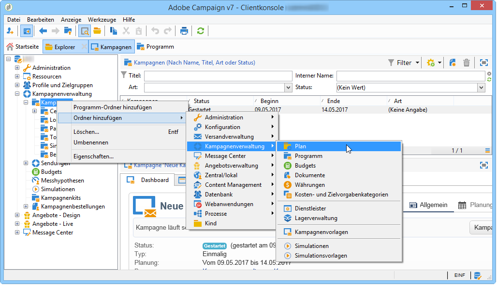

1. Benennen Sie den Plan.
1. Klicken Sie mit der rechten Maustaste auf den neu erstellen Plan und wählen Sie **Eigenschaften...**.

   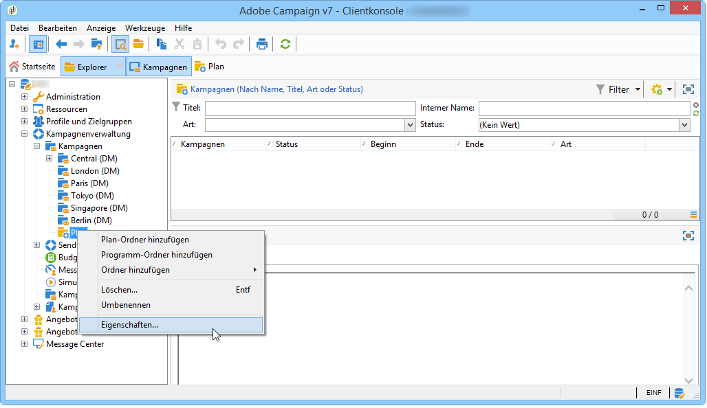

1. Passen Sie im Tab **Allgemein** die Option **Interner Name** an, um bei Package-Exporten Duplikate zu vermeiden.
1. Klicken Sie auf **Speichern**.
1. Klicken Sie mit der rechten Maustaste auf den neu erstellen Plan und wählen Sie **Programm-Ordner hinzufügen**.
1. Wiederholen Sie die obigen Schritte, um Ihren neuen Programmordner und seinen internen Namen umzubenennen.

## Erstellen einer Kampagne {#creating-a-campaign}

### Hinzufügen einer Kampagne {#adding-a-campaign}

Sie können eine Kampagne über die Kampagnenliste erstellen. Klicken Sie auf den Link **[!UICONTROL Kampagnen]** in der gleichnamigen Dashbord-Rubrik, um zu dieser Übersicht zu gelangen.**&#x200B;**

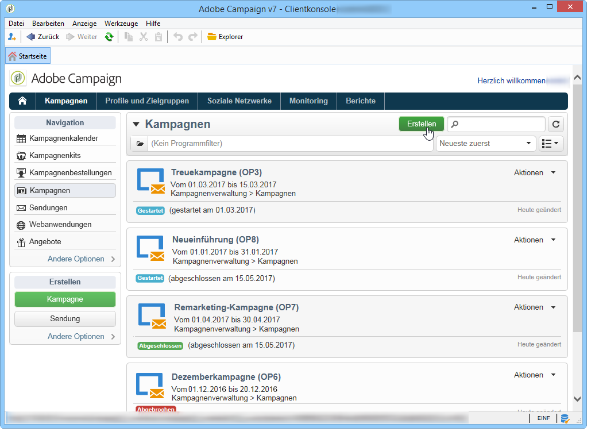

Im Feld **[!UICONTROL Programm]** können Sie das Programm auswählen, dem die Kampagne zugeordnet werden soll. Diese Informationen sind obligatorisch.

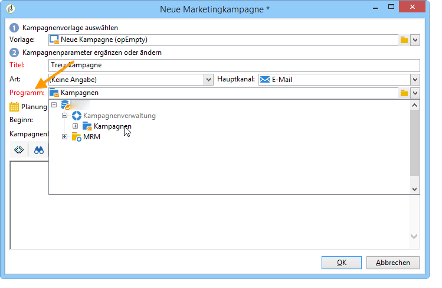

Kampagnen können auch von einem Programm aus erstellt werden. Klicken Sie hierzu auf die Schaltfläche **[!UICONTROL Hinzufügen]** im Tab **[!UICONTROL Planung]** des jeweiligen Programms.

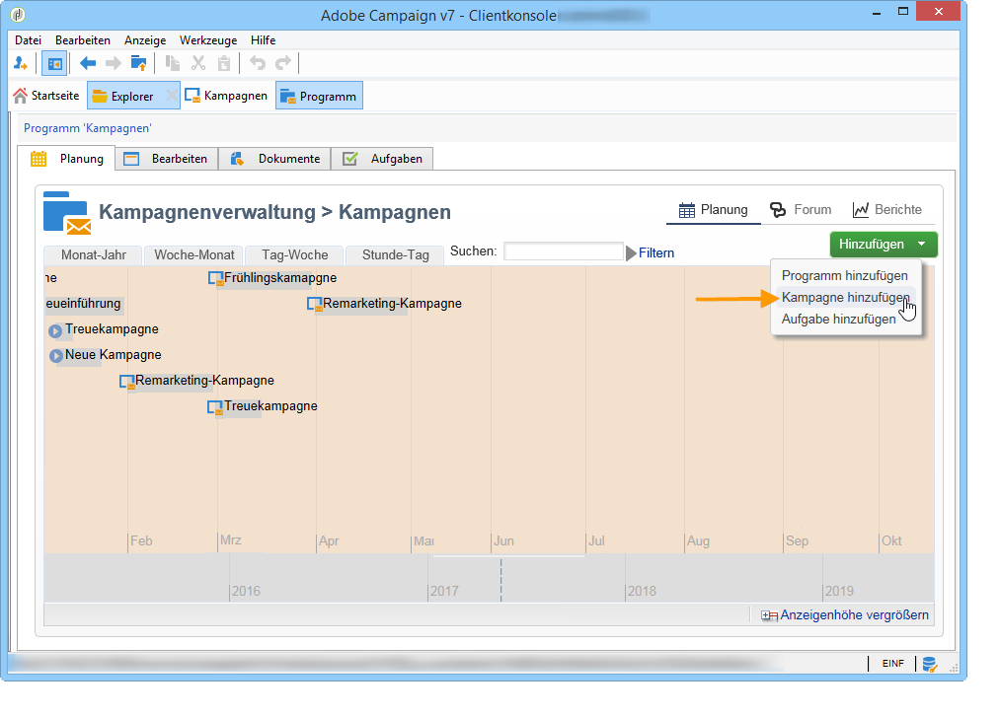

Wenn Sie eine Kampagne über die Registerkarte **[!UICONTROL Planung]** eines Programms erstellen, wird die Kampagne dem jeweiligen Programm automatisch hinzugefügt. Das Feld **[!UICONTROL Programm]** wird in diesem Fall ausgeblendet.

Wählen Sie im Fenster zur Kampagnenerstellung die Kampagnenvorlage aus und fügen Sie einen Namen und eine Beschreibung der Kampagne hinzu. Sie können auch das Anfangs- und Enddatum der Kampagne angeben.

Klicken Sie auf **[!UICONTROL OK]**, um die Kampagne zu erstellen. Sie wird daraufhin der Programmplanung hinzugefügt.

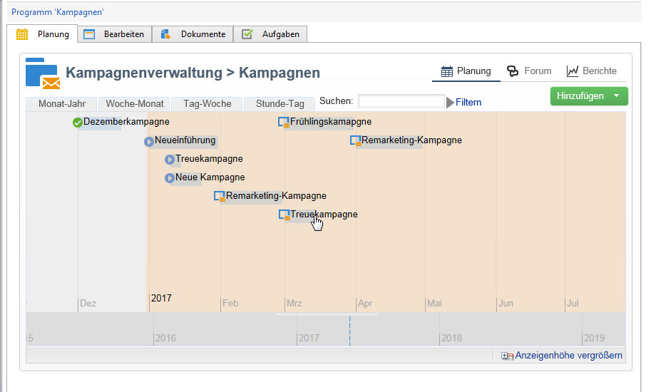

>[!NOTE]
>
>Um nur bestimmte Kampagnen anzuzeigen, klicken Sie auf **[!UICONTROL Filtern]** und wählen Sie den Status der gesuchten Kampagnen aus.

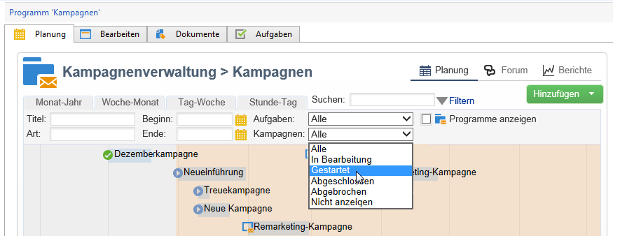

### Bearbeiten und Konfigurieren einer Kampagne {#editing-and-configuring-a-campaign}

Sie können anschließend die gerade erstellte Kampagne bearbeiten und ihre Parameter festlegen.

Wählen Sie sie hierzu im Kalender aus und klicken Sie auf den Link **[!UICONTROL Öffnen]**.

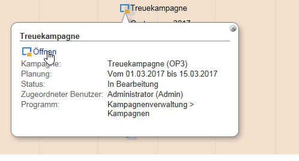

Das Dashboard der Kampagne wird angezeigt.

## Wiederkehrende und periodische Kampagnen {#recurring-and-periodic-campaigns}

Eine wiederkehrende Kampagne ist eine auf einer bestimmten Vorlage basierende Kampagne, deren Workflows so konfiguriert sind, dass sie entsprechend einem verknüpften Zeitplan ausgeführt werden. Die Workflows werden daher innerhalb einer Kampagne wiederkehrend. Die Zielgruppenbestimmung wird bei jeder Ausführung dupliziert, und die verschiedenen Prozesse und Zielpopulationen werden verfolgt. Es ist auch möglich, zukünftige Zielgruppen im Voraus auszuführen, und zwar über den Erfassungszeitraum während der automatischen Workflow-Erstellung, um Simulationen mit Zielschätzungen zu starten.

Eine periodische Kampagne erstellt sich automatisch entsprechend der Ausführungsplanung ihrer Vorlage.

### Erstellen einer wiederkehrenden Kampagne {#creating-a-recurring-campaign}

Wiederkehrende Kampagnen werden anhand einer bestimmten Vorlage erstellt, die die auszuführende Workflow-Vorlage und die Ausführungsplanung definiert.

#### Erstellen einer Vorlage für wiederkehrende Kampagnen {#creating-the-campaign-template}

1. Wählen Sie den Kampagnentyp **[!UICONTROL Wiederkehrend]**.

   >[!NOTE]
   >
   >Es empfiehlt sich, die Standardvorlage zu duplizieren, statt eine leere Vorlage zu erstellen.

   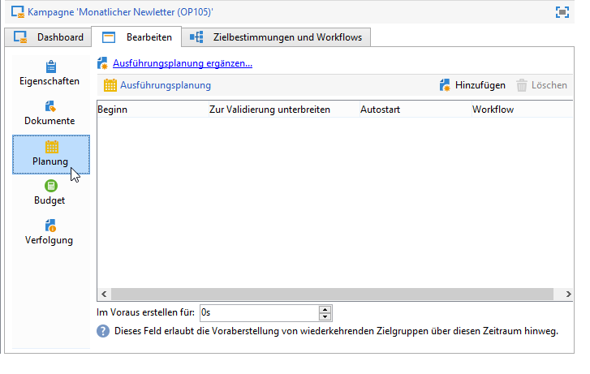

1. Geben Sie den Titel der Vorlage sowie die Dauer der Kampagne an.

   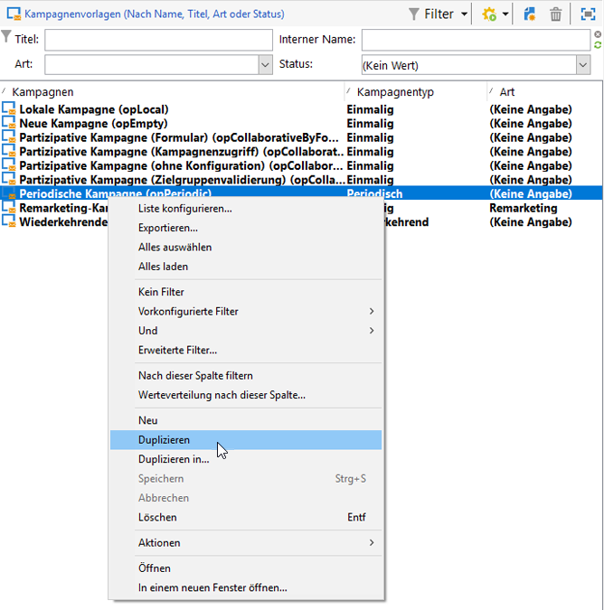

1. Legen Sie im für diesen Kampagnentyp vorgesehenen Tab **[!UICONTROL Planung]** die Zeitpunkte der wiederholten Ausführungen fest.

Geben Sie in diesem Tab die geplanten Ausführungsdaten der Kampagnen auf der Basis dieser Vorlage an.

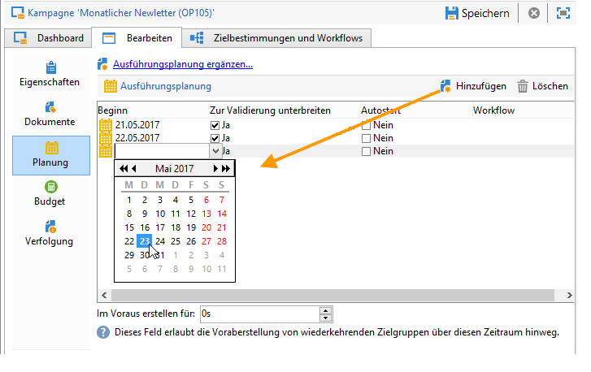

Der Konfigurationsmodus der Ausführungsplanung entspricht dem Objekt **[!UICONTROL Planung]** des Workflows. Weiterführende Informationen hierzu finden Sie in [diesem Abschnitt](../../workflow/using/architecture.md).

>[!IMPORTANT]
>
>Die Konfiguration der Ausführungsplanung muss sorgfältig durchgeführt werden, um eine Überlastung der Datenbank zu vermeiden. Wiederkehrende Kampagnen duplizieren die Workflows ihrer Vorlage je nach angegebenem Zeitplan. Die Implementierung übermäßig häufiger Workflow-Erstellung kann den Betrieb der Datenbank behindern.

1. Geben Sie u. U. einen Wert im Feld **[!UICONTROL Im Voraus erstellen für]** an, um die entsprechenden Workflows für den angegebenen Zeitraum zu erstellen.
1. Erstellen Sie schließlich die Workflow-Vorlage, die in den auf dieser Kampagnenvorlage basierenden Kampagnen verwendet werden soll, mit den Parametern der Zielgruppenbestimmung sowie einer oder mehreren generischen Sendungen.

   >[!NOTE]
   >
   >Dieser Workflow muss als Vorlage für einen wiederkehrenden Workflow gespeichert werden. Öffnen Sie hierzu die Eigenschaften des Workflows und wählen Sie die Option **[!UICONTROL Vorlage für einen wiederkehrenden Workflow]** im Tab **[!UICONTROL Ausführung]** aus.

   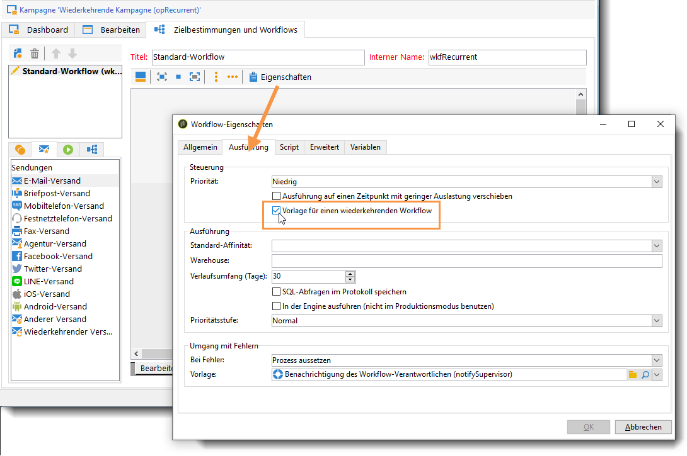

#### Erstellen einer wiederkehrenden Kampagne {#create-the-recurring-campaign}

Um eine wiederkehrende Kampagne zu erstellen und ihre Workflows der festgelegten Planung entsprechend auszuführen, gehen Sie wie folgt vor:

1. Erstellen Sie eine neue Kampagne basierend auf der zuvor erstellten Vorlage einer wiederkehrenden Kampagne.
1. Geben Sie die Ausführungsplanung der Workflows ein, falls diese nicht in der Vorlage definiert wurde.

   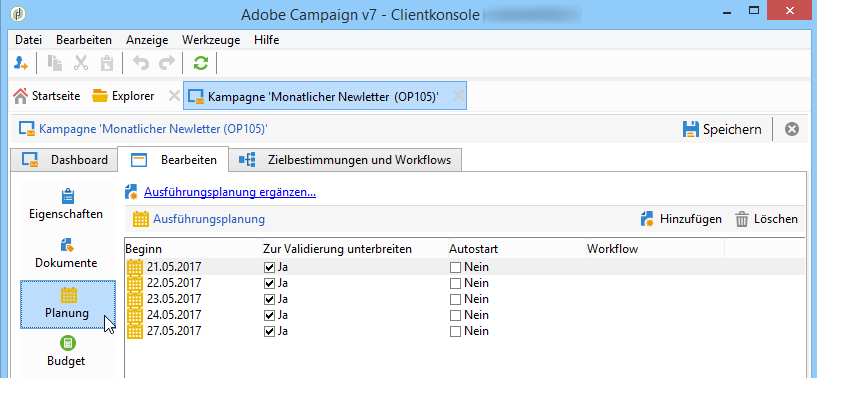

1. Die Kampagnenplanung ermöglicht es, jeweils ein Datum anzugeben, an dem der Workflow automatisch erstellt oder gestartet wird.

   Für jede Zeile können die folgenden ergänzenden Optionen hinzugefügt werden:

   * **[!UICONTROL Zu validieren]**: forciert den Versand der Validierungsanfragen für die im Workflow vorgesehenen Sendungen;
   * **[!UICONTROL Zu starten]**: startet den Workflow automatisch bei Erreichen des geplanten Startdatums.

   Das Feld **[!UICONTROL Im Voraus erstellen für]** ermöglicht es, alle Workflows für den angegebenen Zeitraum zu erstellen.

   Bei der Ausführung des Workflows **[!UICONTROL Vorgänge bei Kampagnen]** werden die dedizierten Workflows auf der Grundlage der im Kampagnenkalender definierten Vorfälle erstellt. Somit wird für jedes Ausführungsdatum ein Workflow erstellt.

1. Wiederkehrende Workflows werden automatisch über die Workflow-Vorlage in der Kampagne erstellt. Sie werden im Tab **[!UICONTROL Zielbestimmungen und Workflows]** der Kampagne angezeigt.

   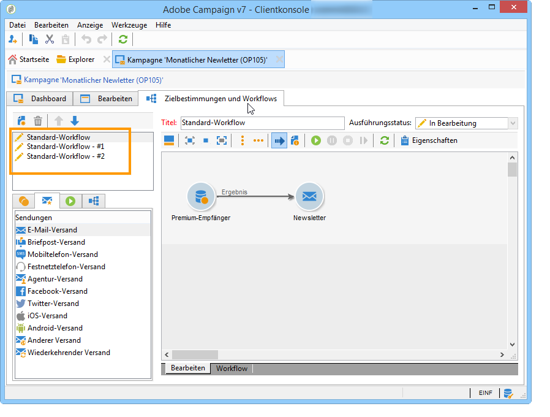

   Der Titel der Instanz eines wiederkehrenden Workflows setzt sich aus dem Titel seiner Vorlage sowie der Workflow-Nummer zusammen, getrennt durch eine Raute.

   Die basierend auf der Planung erstellten Workflows werden dieser automatisch in der Spalte **[!UICONTROL Workflow]** des Tabs **[!UICONTROL Planung]** zugeordnet.

   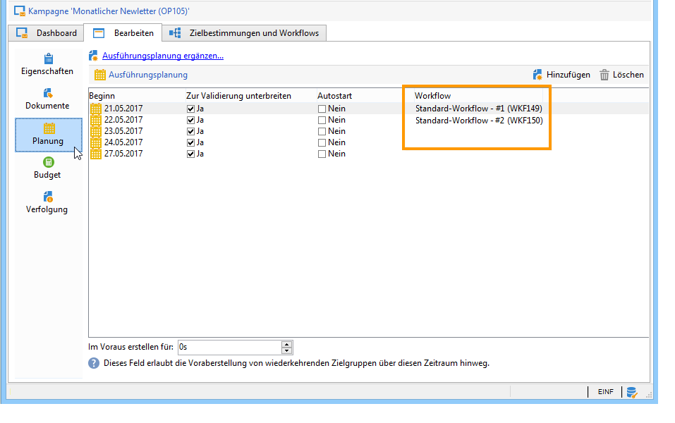

   Jeder Workflow kann von diesem Tab aus bearbeitet werden.

   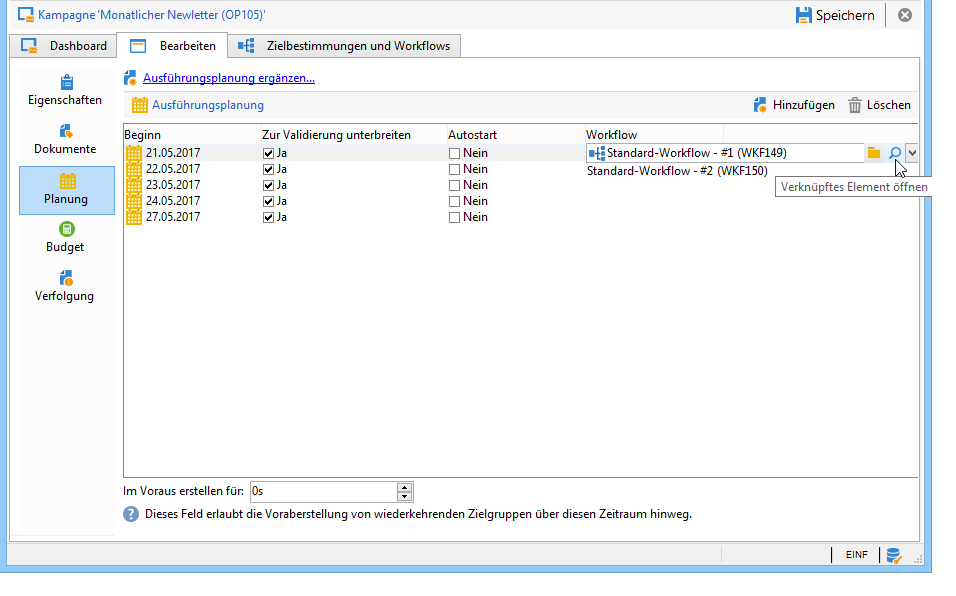

   >[!NOTE]
   >
   >Das Startdatum der dem Workflow zugeordneten Planungszeile ist über eine Variable des Workflows mit der folgenden Syntax verfügbar:\
   >`$date(instance/vars/@startPlanningDate)`

### Erstellen einer periodischen Kampagne {#creating-a-periodic-campaign}

Eine periodische Kampagne ist eine auf einer bestimmten Vorlage basierende Kampagne, mit der Sie Kampagneninstanzen auf der Grundlage einer Ausführungsplanung erstellen können. Kampagneninstanzen werden automatisch auf der Grundlage einer Vorlage für periodische Kampagnen und abhängig von der in der Vorlagenplanung definierten Häufigkeit erstellt.

#### Erstellen der Kampagnenvorlage {#creating-the-campaign-template-1}

1. Wählen Sie den Kampagnentyp **[!UICONTROL Periodisch]**

   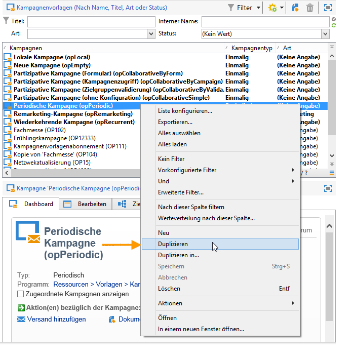

1. Konfigurieren Sie die Vorlage.

   >[!NOTE]
   >
   >Der der Vorlage zugeordnete Benutzer muss über die notwendigen Berechtigungen zur Erstellung von Kampagnen im ausgewählten Programm verfügen.

1. Erstellen Sie den mit dieser Vorlage verknüpften Workflow. Sie wird in jeder periodischen Kampagne dupliziert, die von der Vorlage erstellt wird.

   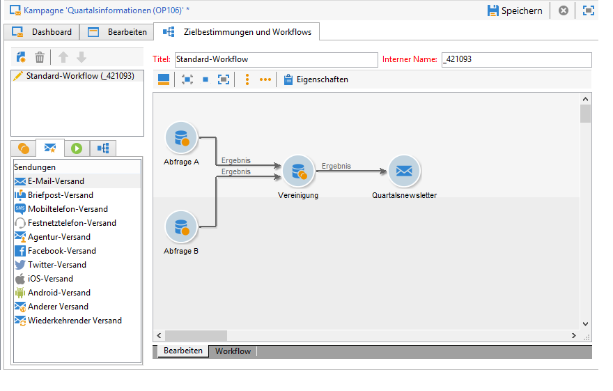

   >[!NOTE]
   >
   >Dieser Workflow ist eine Workflow-Vorlage. Sie kann nicht über die Kampagnenvorlage ausgeführt werden.

1. Gehen Sie zur Eingabe der Ausführungsplanung wie in der Vorlage für wiederkehrende Kampagnen vor: Klicken Sie auf die Schaltfläche **[!UICONTROL Hinzufügen]** und bestimmen Sie Start- und Enddatum oder ergänzen Sie die Ausführungsplanung über den entsprechenden Link.

   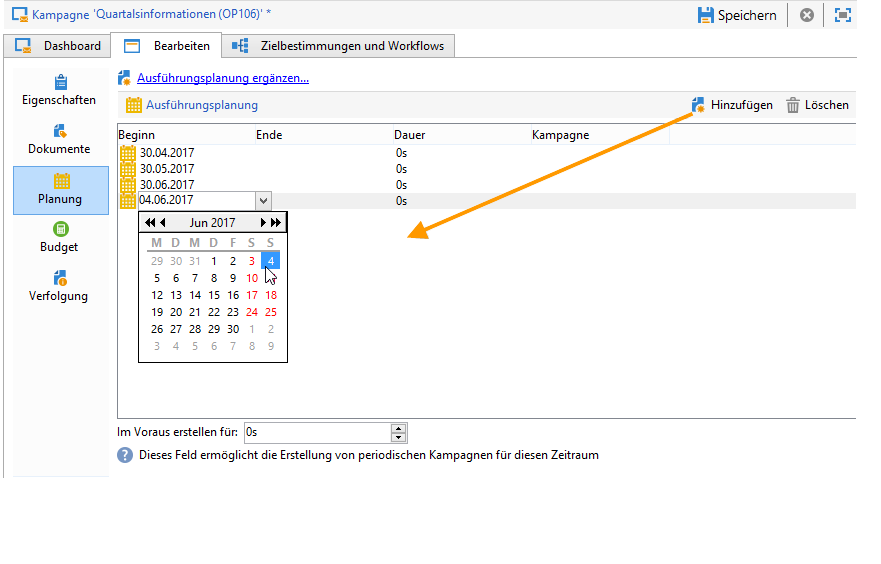

   >[!IMPORTANT]
   >
   >Vorlagen für periodische Kampagnen erstellen neue Kampagnen gemäß dem oben definierten Zeitplan. Sie muss daher sorgfältig ausgefüllt werden, um eine Überlastung der Adobe Campaign-Datenbank zu vermeiden.

1. Nach Erreichen des Ausführungsstartdatums wird automatisch die passende Kampagne erstellt. Es übernimmt alle Eigenschaften seiner Vorlage.

   Jede Kampagne kann über die Ausführungsplanung in der Vorlage bearbeitet werden.

   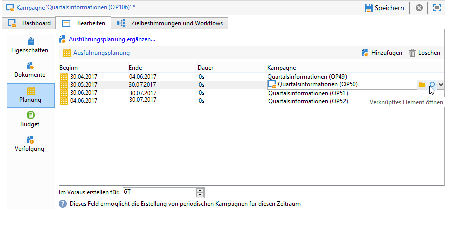

Jede periodische Kampagne enthält dieselben Elemente. Nach der Erstellung wird sie als Standardkampagne verwaltet.

## Anleitungsvideo {#video}

In diesem Video wird erklärt, wie man einen Marketing-Plan, Programme und Kampagnen erstellt.

>[!VIDEO](https://video.tv.adobe.com/v/326556?captions=ger&quality=12)

Weitere Anleitungsvideos zu Campaign finden Sie [hier](https://experienceleague.adobe.com/docs/campaign-classic-learn/tutorials/overview.html?lang=de).
