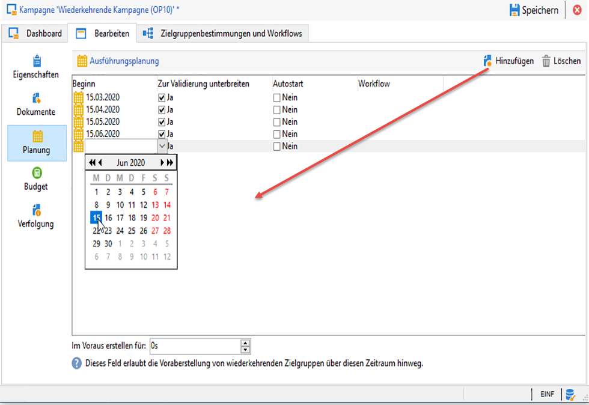
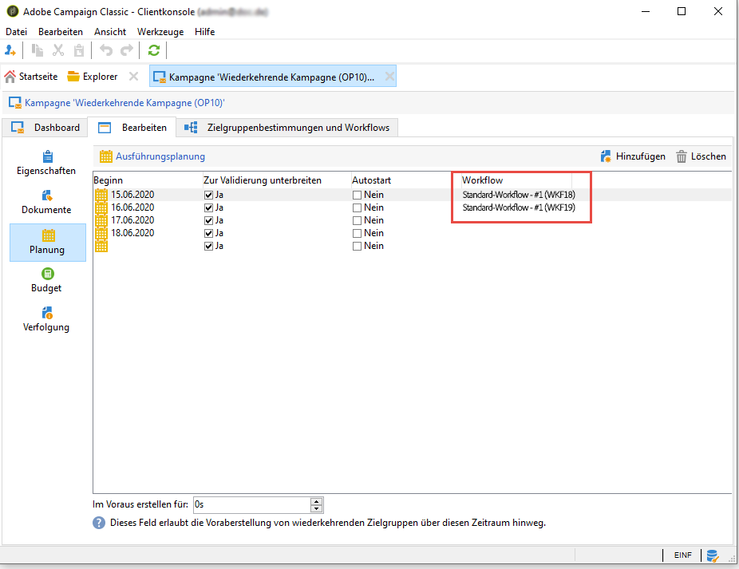
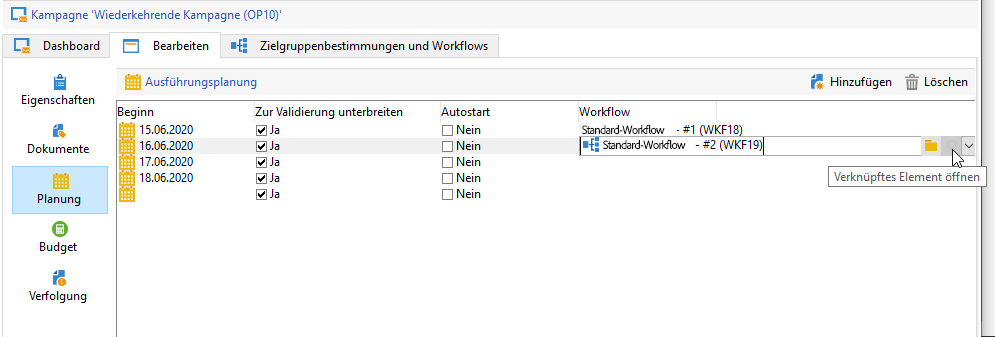
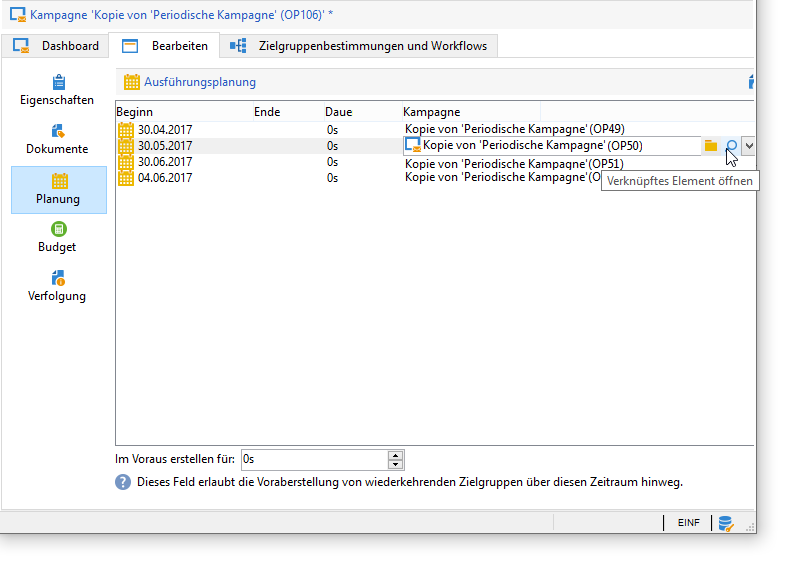

# Marketingkampagnen erstellen{#setting-up-marketing-campaigns}

Kampagnen umfassen Aktionen (Lieferungen) und Prozesse (Import oder Extraktion von Dateien) sowie Ressourcen (Marketing-Dokumente, Lieferpläne). Sie werden in Marketingkampagnen verwendet. Kampagnen sind Teil eines Programms und Programme sind in einem Kampagnenplan enthalten.

So erstellen Sie eine Marketingkampagne:

1. Kampagne erstellen: Kampagnen und deren Eigenschaften zu ermitteln: Beschriftung, Typ, Start- und Enddatum, Budget, zugehörige Ressourcen, Manager und Teilnehmer.

   See [Creating a campaign](#creating-a-campaign).

1. Zielgruppe/n definieren: einen Workflow mit Targeting-Abfragen erstellen.

   See [Selecting the target population](../../campaign/using/marketing-campaign-deliveries.md#selecting-the-target-population).

1. Auslieferungen erstellen: wählen Sie Kanäle aus und definieren Sie den zu sendenden Inhalt.

   Siehe [Erstellen von Auslieferungen](../../campaign/using/marketing-campaign-deliveries.md#creating-deliveries).

1. Lieferungen genehmigen.

   Siehe [Genehmigungsprozess](../../campaign/using/marketing-campaign-approval.md#approval-process).

1. Überwachen Sie Auslieferungen.

   Siehe [Überwachung](../../campaign/using/marketing-campaign-monitoring.md).

1. Planen Sie Kampagnen und damit verbundene Kosten.

   See [Creating service providers and their cost structures](../../campaign/using/providers--stocks-and-budgets.md#creating-service-providers-and-their-cost-structures).

Nach Abschluss dieser Schritte können Sie die Auslieferungen starten (siehe [Auslieferung](../../campaign/using/marketing-campaign-deliveries.md#starting-a-delivery)starten), die Daten, Prozesse und Informationen zu den Auslieferungen überprüfen und bei Bedarf die zugehörigen Dokumente verwalten (siehe [Verwalten der zugehörigen Dokumente](../../campaign/using/marketing-campaign-deliveries.md#managing-associated-documents)). Sie können auch die Ausführung der Verarbeitungsphasen von Kampagnen und Lieferungen verfolgen (siehe [Verfolgung](../../campaign/using/marketing-campaign-monitoring.md)).

## Erstellung einer Plan- und Programmhierarchie {#creating-plan-and-program-hierarchy}

So konfigurieren Sie Ihre Ordnerhierarchie für Marketingpläne und -programme:

1. Klicken Sie auf das **Explorer-** Symbol auf der Startseite.
1. Klicken Sie mit der rechten Maustaste auf den Ordner, in dem Sie Ihren Plan erstellen möchten.
1. Wählen Sie **Ordner hinzufügen > Kampagnenverwaltung > Plan** aus.

   

1. Benennen Sie den Plan.
1. Klicken Sie mit der rechten Maustaste auf den neu erstellen Plan und wählen Sie **Eigenschaften...**.

   

1. Passen Sie im Tab **Allgemein** die Option **Interner Name** an, um bei Package-Exporten Duplikate zu vermeiden.
1. Klicken Sie auf **Speichern**.
1. Klicken Sie mit der rechten Maustaste auf den neu erstellen Plan und wählen Sie **Programm-Ordner hinzufügen**.
1. Wiederholen Sie die obigen Schritte, um Ihren neuen Programmordner und seinen internen Namen umzubenennen.

## Kampagnen erstellen  {#creating-a-campaign}

### Hinzufügen einer Kampagne {#adding-a-campaign}

Sie können eine Kampagne über die Kampagnenliste erstellen. Um diese Ansicht anzuzeigen, wählen Sie das **[!UICONTROL Campaigns]** Menü im **[!UICONTROL Campaigns]** Dashboard aus.

Im **[!UICONTROL Program]** Feld können Sie das Programm auswählen, an das die Kampagne angehängt wird. Diese Informationen sind obligatorisch.

Kampagnen können auch über ein Programm erstellt werden. Klicken Sie dazu auf die **[!UICONTROL Add]** Schaltfläche auf der **[!UICONTROL Schedule]** Registerkarte des jeweiligen Programms.

Wenn Sie eine Kampagne über die **[!UICONTROL Schedule]** Registerkarte eines Programms erstellen, wird die Kampagne automatisch mit dem betreffenden Programm verknüpft. In diesem Fall ist das **[!UICONTROL Program]** Feld ausgeblendet.

Wählen Sie im Fenster zur Kampagnenerstellung die Kampagnenvorlage aus und fügen Sie einen Namen und eine Beschreibung der Kampagne hinzu. Sie können auch das Start- und Enddatum der Kampagne angeben.

Klicken Sie auf **[!UICONTROL OK]** , um die Kampagne zu erstellen. Er wird dem Programmplan hinzugefügt.

>[!NOTE]
>
>To filter the campaigns to display, click the **[!UICONTROL Filter]** link and select the status of campaigns to display.

### Bearbeiten und Konfigurieren einer Kampagne {#editing-and-configuring-a-campaign}

Sie können anschließend die gerade erstellte Kampagne bearbeiten und ihre Parameter festlegen.

To open and configure a campaign, select it from the schedule and click **[!UICONTROL Open]**.

Das Dashboard der Kampagne wird angezeigt.

## Wiederkehrende und periodische Kampagnen {#recurring-and-periodic-campaigns}

Eine wiederkehrende Kampagne basiert auf einer spezifischen Vorlage. Ihre Workflows sind so konfiguriert, dass sie nach einer bestimmten Planung ausgeführt werden. Die Workflows sind demnach innerhalb der Kampagne wiederkehrend. Die Zielgruppenbestimmung wird bei jeder Ausführung dupliziert. Die unterschiedlichen Vorgänge und Zielgruppen werden protokolliert. Über das Zeitfenster bei der automatischen Workflow-Erstellung ist es zudem möglich, zukünftige Zielgruppenbestimmungen im Voraus auszuführen, um Simulationen mit Zielgruppenschätzungen zu starten.

Eine periodische Kampagne erstellt sich automatisch entsprechend der Ausführungsplanung ihrer Vorlage.

### Erstellung einer wiederkehrenden Kampagne {#creating-a-recurring-campaign}

Vor der Erstellung der eigentlichen Kampagne ist die Konfiguration einer spezifischen Vorlage erforderlich, in der die Ausführungsplanung sowie die benötigten Workflow-Vorlagen bestimmt werden. Gehen Sie wie folgt vor:

#### Erstellen einer Vorlage für wiederkehrende Kampagnen {#creating-the-campaign-template}

1. Create a **[!UICONTROL Recurring]** campaign template.

   >[!NOTE]
   >
   >Es empfiehlt sich, die Standardvorlage zu duplizieren, statt eine leere Vorlage zu erstellen.

   

1. Geben Sie den Titel der Vorlage sowie die Dauer der Kampagne an.

   

1. For this type of campaign, a **[!UICONTROL Schedule]** tab is added in order to create the template execution schedule.

Geben Sie in diesem Tab die geplanten Ausführungsdaten der Kampagnen auf der Basis dieser Vorlage an.

Sie können den Assistenten zur Erstellung von Zeitplänen verwenden, um alle Ausführungsdaten automatisch auszufüllen. Klicken Sie dazu auf den **[!UICONTROL Complete the execution schedule...]** Link oberhalb der Tabelle.

Der Konfigurationsmodus des Ausführungsplans fällt mit dem **[!UICONTROL Scheduler]** Objekt des Workflows zusammen. Weiterführende Informationen hierzu finden Sie in [diesem Abschnitt](../../workflow/using/executing-a-workflow.md#architecture).

>[!IMPORTANT]
>
>Die Konfiguration der Ausführungsplanung muss mit Vorsicht erfolgen, um die Datenbank nicht zu überlasten. Wiederkehrende Kampagnen duplizieren den oder die Workflows ihrer Vorlage entsprechend der definierten Planung. Eine zu hohe Erstellungsfrequenz dieser Workflows kann die effiziente Funktionsweise der Datenbank beeinträchtigen.

1. Specify a value in the **[!UICONTROL Create in advance for]** field in order to create the corresponding workflows for the period indicated.
1. Erstellen Sie schließlich die Workflow-Vorlage, die in den auf dieser Kampagnenvorlage basierenden Kampagnen verwendet werden soll, mit den Parametern der Zielgruppenbestimmung sowie einer oder mehreren generischen Sendungen.

   >[!NOTE]
   >
   >Dieser Workflow muss als wiederkehrende Workflow-Vorlage gespeichert werden. Bearbeiten Sie dazu die Workflow-Eigenschaften und wählen Sie die **[!UICONTROL Recurring workflow template]** Option auf der **[!UICONTROL Execution]** Registerkarte aus.

   

#### Kampagne erstellen {#create-the-recurring-campaign}

Um eine wiederkehrende Kampagne zu erstellen und ihre Workflows der festgelegten Planung entsprechend auszuführen, gehen Sie wie folgt vor:

1. Erstellen Sie eine neue Kampagne basierend auf der zuvor erstellten Vorlage einer wiederkehrenden Kampagne.
1. Geben Sie die Ausführungsplanung der Workflows ein, falls diese nicht in der Vorlage definiert wurde.

   

1. Die Kampagnenplanung ermöglicht es, jeweils ein Datum anzugeben, an dem der Workflow automatisch erstellt oder gestartet wird.

   Für jede Zeile können die folgenden ergänzenden Optionen hinzugefügt werden:

   * **[!UICONTROL To be approved]** : können Sie die Zustellgenehmigungsanforderungen im Workflow erzwingen.
   * **[!UICONTROL To be started]** : können Sie den Workflow starten, wenn das Startdatum erreicht wurde.
   Im **[!UICONTROL Create in advance for]** Feld können Sie alle Arbeitsabläufe für den eingegebenen Zeitraum erstellen.

   Bei Ausführung des **[!UICONTROL Jobs on campaigns]** Workflows werden die dedizierten Arbeitsabläufe basierend auf den im Kampagnenplan definierten Ereignissen erstellt. Für jedes Ausführungsdatum wird somit ein Workflow erstellt.

1. Wiederkehrende Workflows werden automatisch aus der in der Kampagne vorhandenen Workflow-Vorlage erstellt. Sie sind auf der **[!UICONTROL Targeting and workflows]** Registerkarte der Kampagne sichtbar.

   

   Der Titel der Instanz eines wiederkehrenden Workflows setzt sich aus dem Titel seiner Vorlage sowie der Workflow-Nummer zusammen, getrennt durch eine Raute.

   Workflows created from the schedule are automatically associated with it in the **[!UICONTROL Workflow]** column of the **[!UICONTROL Schedule]** tab.

   

   Jeder Workflow kann von diesem Tab aus bearbeitet werden.

   

   >[!NOTE]
   >
   >Das Anfangsdatum der dem Workflow zugeordneten Planungszeile ist über eine Variable des Workflows mit der folgenden Syntax verfügbar:\
   >`$date(instance/vars/@startPlanningDate)`

### Erstellung einer periodischen Kampagne {#creating-a-periodic-campaign}

Eine periodische Kampagne ist eine spezifische Vorlage, die die automatische Erstellung von Kampagneninstanzen entsprechend einer in der Ausführungsplanung der Vorlage festgelegten Frequenz ermöglicht. Gehen Sie wie folgt vor:

#### Kampagnenvorlage erstellen {#creating-the-campaign-template-1}

1. Create a **[!UICONTROL Periodic]** campaign template, preferably by duplicating an existing campaign template.

   

1. Konfigurieren Sie die Vorlage.

   >[!NOTE]
   >
   >Der der Vorlage zugeordnete Benutzer muss über die notwendigen Berechtigungen zur Erstellung von Kampagnen im ausgewählten Programm verfügen.

1. Erstellen Sie einen mit dieser Vorlage verknüpften Workflow. Dieser wird in jeder von der Vorlage erstellten periodischen Kampagne dupliziert.

   

   >[!NOTE]
   >
   >Es handelt sich hier um eine Workflow-Vorlage. Der eigentliche Workflow kann nicht von der Kampagnenvorlage aus gestartet werden.

1. Complete its execution schedule as for a recurring campaign template: click the **[!UICONTROL Add]** button and define the start and end dates, or fill in the execution schedule via the link.

   

   >[!IMPORTANT]
   >
   >Vorlagen für periodische Kampagnen erstellen neue Kampagnen entsprechend der zuvor festgelegten Planung. Die Konfiguration der Ausführungsplanung muss mit Vorsicht erfolgen, um die Adobe-Campaign-Datenbank nicht zu überlasten.

1. Mit Erreichen des Ausführungsbeginns wird die jeweilige Kampagne automatisch erstellt. Sie übernimmt alle in der Vorlage festgelegten Parameter.

   Jede Kampagne kann über die Ausführungsplanung in der Vorlage bearbeitet werden.

   

Jede periodische Kampagne enthält die gleichen Elemente und wird nach der Erstellung wie eine Standardkampagne verwaltet.
