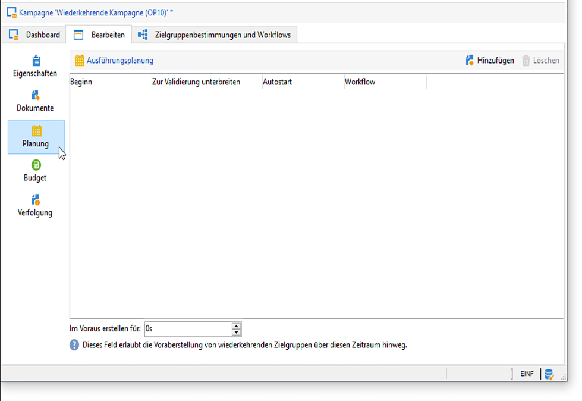
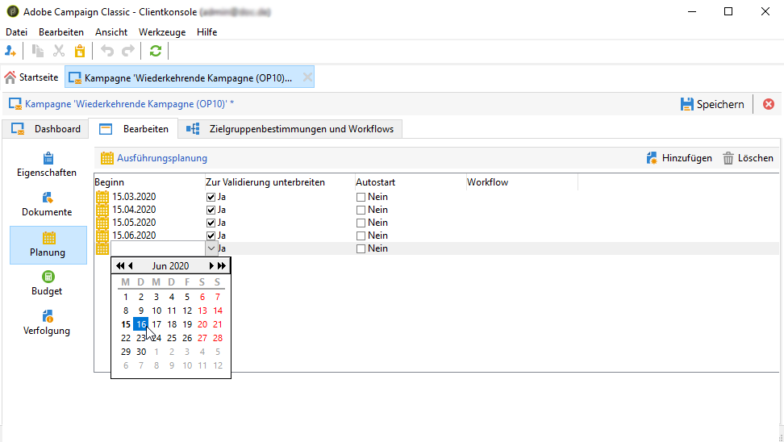

# Marketingkampagnen erstellen{#setting-up-marketing-campaigns}

Kampagnen umfassen Aktionen (Sendungen) und Prozesse (Import oder Extraktion von Dateien) sowie Ressourcen (Marketing-Dokumente, Versandentwürfe). Sie werden in Marketing-Kampagnen verwendet. Kampagnen sind Teil eines Programms und Programme Teil eines Kampagnenplans.

So erstellen Sie eine Marketing-Kampagne:

1. Erstellung einer Kampagne: Ermittlung von Kampagnen und deren Eigenschaften: Titel, Typ, Anfangs- und Enddatum, Budget, zugehörige Ressourcen, Verantwortliche und Teilnehmer.

   Lesen Sie diesbezüglich den Abschnitt [Kampagnen erstellen](#creating-a-campaign).

1. Bestimmung der Zielpopulation(en): Erstellung eines Workflows mit Zielgruppenbestimmungs-Abfragen.

   Siehe [Zielgruppe bestimmen](../../campaign/using/marketing-campaign-deliveries.md#selecting-the-target-population).

1. Erstellung von Sendungen: Auswahl von Kanälen und Konfigurieren des zu sendenden Inhalts.

   Siehe [Sendungen erstellen](../../campaign/using/marketing-campaign-deliveries.md#creating-deliveries).

1. Validierung von Sendungen.

   Siehe [Validierungsprozess](../../campaign/using/marketing-campaign-approval.md#approval-process).

1. Beobachtung von Sendungen.

   Siehe [Monitoring](../../campaign/using/marketing-campaign-monitoring.md).

1. Planung der Kampagne und verbundener Kosten.

   Lesen Sie diesbezüglich den Abschnitt [Erstellung von Dienstleistern und deren Kostenstrukturen](../../campaign/using/providers--stocks-and-budgets.md#creating-service-providers-and-their-cost-structures).

Nach Abschluss dieser Schritte können Sie den Versand starten (siehe [Starten eines Versands](../../campaign/using/marketing-campaign-deliveries.md#starting-a-delivery)), die Daten, Prozesse und Informationen zu den Sendungen überprüfen und bei Bedarf die zugehörigen Dokumente verwalten (siehe [Zugeordnete Dokumente verwalten ](../../campaign/using/marketing-campaign-deliveries.md#managing-associated-documents)). Außerdem können Sie die Ausführung der Verarbeitungsphasen von Kampagnen und Sendungen verfolgen (siehe [Tracking](../../campaign/using/marketing-campaign-monitoring.md)).

## Erstellung einer Plan- und Programmhierarchie {#creating-plan-and-program-hierarchy}

Um Ihre Ordnerhierarchie für Marketing-Pläne und -Programme zu konfigurieren, gehen Sie folgendermaßen vor:

1. Klicken Sie auf das **Explorer-** Symbol auf der Startseite.
1. Klicken Sie mit der rechten Maustaste auf den Ordner, in dem Sie Ihren Plan erstellen möchten.
1. Wählen Sie **Ordner hinzufügen > Kampagnenverwaltung > Plan** aus.

   

1. Benennen Sie den Plan.
1. Klicken Sie mit der rechten Maustaste auf den neu erstellen Plan und wählen Sie **Eigenschaften...**.

   

1. Passen Sie im Tab **Allgemein** die Option **Interner Name** an, um bei Package-Exporten Duplikate zu vermeiden.
1. Wählen Sie **Speichern** aus.
1. Klicken Sie mit der rechten Maustaste auf den neu erstellen Plan und wählen Sie **Programm-Ordner hinzufügen**.
1. Wiederholen Sie die obigen Schritte, um Ihren neuen Programmordner und seinen internen Namen umzubenennen.

## Kampagnen erstellen     {#creating-a-campaign}

### Hinzufügen einer Kampagne {#adding-a-campaign}

Eine neue Kampagne kann von der Liste der Kampagnen aus erstellt werden. Klicken Sie auf den Link **[!UICONTROL Kampagnen]** in der gleichnamigen Rubrik, um zu dieser Übersicht zu gelangen.****

Im Feld **[!UICONTROL Programm]** wird das Programm ausgewählt, dem die Kampagne zugeordnet werden soll. Diese Information muss angegeben werden.

Kampagnen können auch von einem Programm aus erstellt werden. Klicken Sie hierzu auf die Schaltfläche **[!UICONTROL Hinzufügen]** im Tab **[!UICONTROL Planung]** des jeweiligen Programms.

Wenn Sie eine Kampagne im Tab **[!UICONTROL Planung]** eines Programms erstellen, wird die Kampagne dem jeweiligen Programm automatisch hinzugefügt. Das Feld **[!UICONTROL Programm]** wird in diesem Fall ausgeblendet.

Wählen Sie im Fenster zur Kampagnenerstellung die Kampagnenvorlage aus und fügen Sie einen Namen und eine Beschreibung der Kampagne hinzu. Sie können auch das Anfangs- und Enddatum der Kampagne angeben.

Klicken Sie auf **[!UICONTROL OK]**, um die Kampagne zu erstellen. Sie wird daraufhin der Programmplanung hinzugefügt.

>[!NOTE]
>
>Um nur bestimmte Kampagnen anzuzeigen, klicken Sie auf **[!UICONTROL Filtern]** und wählen Sie den Status der gesuchten Kampagnen aus.

### Bearbeiten und Konfigurieren einer Kampagne {#editing-and-configuring-a-campaign}

Sie können anschließend die gerade erstellte Kampagne bearbeiten und ihre Parameter festlegen.

Wählen Sie sie hierzu im Kalender aus und klicken Sie auf den Link **[!UICONTROL Öffnen]**.

Das Dashboard der Kampagne wird angezeigt.

## Wiederkehrende und periodische Kampagnen {#recurring-and-periodic-campaigns}

Eine wiederkehrende Kampagne basiert auf einer spezifischen Vorlage. Ihre Workflows sind so konfiguriert, dass sie nach einer bestimmten Planung ausgeführt werden. Die Workflows sind demnach innerhalb der Kampagne wiederkehrend. Die Zielgruppenbestimmung wird bei jeder Ausführung dupliziert. Die unterschiedlichen Vorgänge und Zielgruppen werden protokolliert. Über das Zeitfenster bei der automatischen Workflow-Erstellung ist es zudem möglich, zukünftige Zielgruppenbestimmungen im Voraus auszuführen, um Simulationen mit Zielgruppenschätzungen zu starten.

Eine periodische Kampagne erstellt sich automatisch entsprechend der Ausführungsplanung ihrer Vorlage.

### Erstellung einer wiederkehrenden Kampagne {#creating-a-recurring-campaign}

Vor der Erstellung der eigentlichen Kampagne ist die Konfiguration einer spezifischen Vorlage erforderlich, in der die Ausführungsplanung sowie die benötigten Workflow-Vorlagen bestimmt werden. Gehen Sie wie folgt vor:

#### Erstellung einer Vorlage für wiederkehrende Kampagnen {#creating-the-campaign-template}

1. Wählen Sie den Kampagnentyp **[!UICONTROL Wiederkehrend]**.

   >[!NOTE]
   >
   >Es empfiehlt sich, die Standardvorlage zu duplizieren, statt eine leere Vorlage zu erstellen.

   

1. Geben Sie den Titel der Vorlage sowie die Dauer der Kampagne an.

   

1. Legen Sie im für diesen Kampagnentyp vorgesehenen Tab **[!UICONTROL Planung]** die Zeitpunkte der wiederholten Ausführungen fest.

Geben Sie in diesem Tab die geplanten Ausführungsdaten der Kampagnen auf der Basis dieser Vorlage an.

Der Konfigurationsmodus der Ausführungsplanung entspricht dem der Workflow-Aktivität **[!UICONTROL Planung]**. Weitere Informationen hierzu finden Sie in [diesem Abschnitt](../../workflow/using/architecture.md).

>[!IMPORTANT]
>
>Die Konfiguration der Ausführungsplanung muss mit Vorsicht erfolgen, um die Datenbank nicht zu überlasten. Wiederkehrende Kampagnen duplizieren den oder die Workflows ihrer Vorlage entsprechend der definierten Planung. Eine zu hohe Erstellungsfrequenz dieser Workflows kann die effiziente Funktionsweise der Datenbank beeinträchtigen.

1. Geben Sie u. U. einen Wert im Feld **[!UICONTROL Im Voraus erstellen für]** an, um die entsprechenden Workflows für den angegebenen Zeitraum zu erstellen.
1. Erstellen Sie schließlich die Workflow-Vorlage, die in den auf dieser Kampagnenvorlage basierenden Kampagnen verwendet werden soll, mit den Parametern der Zielgruppenbestimmung sowie einer oder mehreren generischen Sendungen.

   >[!NOTE]
   >
   >Dieser Workflow muss als Vorlage für einen wiederkehrenden Workflow gespeichert werden. Öffnen Sie hierzu die Eigenschaften des Workflows und wählen Sie die Option **[!UICONTROL Vorlage für einen wiederkehrenden Workflow]** im Tab **[!UICONTROL Ausführung]** aus.

   

#### Kampagne erstellen {#create-the-recurring-campaign}

Um eine wiederkehrende Kampagne zu erstellen und ihre Workflows der festgelegten Planung entsprechend auszuführen, gehen Sie wie folgt vor:

1. Erstellen Sie eine neue Kampagne basierend auf der zuvor erstellten Vorlage einer wiederkehrenden Kampagne.
1. Geben Sie die Ausführungsplanung der Workflows ein, falls diese nicht in der Vorlage definiert wurde.

   

1. Die Kampagnenplanung ermöglicht es, jeweils ein Datum anzugeben, an dem der Workflow automatisch erstellt oder gestartet wird.

   Für jede Zeile können die folgenden ergänzenden Optionen hinzugefügt werden:

   * **[!UICONTROL Zu validieren]**: forciert den Versand der Validierungsanfragen für die im Workflow vorgesehenen Sendungen;.
   * **[!UICONTROL Zu starten]**: startet den Workflow automatisch bei Erreichen des geplanten Startdatums.

   Das Feld **[!UICONTROL Im Voraus erstellen für]** ermöglicht es, alle Workflows für den angegebenen Zeitraum zu erstellen.

   Bei Ausführung des **[!UICONTROL Kampagnenvorgänge]**-Workflows werden die dedizierten Workflows entsprechend der zuvor festgelegten Kampagnenplanung erstellt, d. h. ein Workflow für jedes Ausführungsdatum.

1. Wiederkehrende Workflows werden automatisch über die Workflow-Vorlage in der Kampagne erstellt. Sie werden im Tab **[!UICONTROL Zielbestimmungen und Workflows]** der Kampagne angezeigt.

   

   Der Titel der Instanz eines wiederkehrenden Workflows setzt sich aus dem Titel seiner Vorlage sowie der Workflow-Nummer zusammen, getrennt durch eine Raute.

   Die basierend auf der Planung erstellten Workflows werden dieser automatisch in der Spalte **[!UICONTROL Workflow]** des Tabs **[!UICONTROL Planung]** zugeordnet.

   

   Jeder Workflow kann von diesem Tab aus bearbeitet werden.

   

   >[!NOTE]
   >
   >Das Anfangsdatum der dem Workflow zugeordneten Planungszeile ist über eine Variable des Workflows mit der folgenden Syntax verfügbar:\
   >`$date(instance/vars/@startPlanningDate)`

### Erstellung einer periodischen Kampagne {#creating-a-periodic-campaign}

Eine periodische Kampagne ist eine spezifische Vorlage, die die automatische Erstellung von Kampagneninstanzen entsprechend einer in der Ausführungsplanung der Vorlage festgelegten Frequenz ermöglicht. Gehen Sie wie folgt vor:

#### Kampagnenvorlage erstellen {#creating-the-campaign-template-1}

1. Wählen Sie den Kampagnentyp **[!UICONTROL Periodisch]**

   

1. Konfigurieren Sie die Vorlage.

   >[!NOTE]
   >
   >Der der Vorlage zugeordnete Benutzer muss über die notwendigen Berechtigungen zur Erstellung von Kampagnen im ausgewählten Programm verfügen.

1. Erstellen Sie einen mit dieser Vorlage verknüpften Workflow. Dieser wird in jeder von der Vorlage erstellten periodischen Kampagne dupliziert.

   

   >[!NOTE]
   >
   >Es handelt sich hier um eine Workflow-Vorlage. Der eigentliche Workflow kann nicht von der Kampagnenvorlage aus gestartet werden.

1. Gehen Sie zur Eingabe der Ausführungsplanung wie in der Vorlage für wiederkehrende Kampagnen vor: Klicken Sie auf die Schaltfläche **[!UICONTROL Hinzufügen]** und bestimmen Sie Anfang und Ende oder ergänzen Sie die Ausführungsplanung über den entsprechenden Link.

   

   >[!IMPORTANT]
   >
   >Vorlagen für periodische Kampagnen erstellen neue Kampagnen entsprechend der zuvor festgelegten Planung. Die Konfiguration der Ausführungsplanung muss mit Vorsicht erfolgen, um die Adobe-Campaign-Datenbank nicht zu überlasten.

1. Mit Erreichen des Ausführungsbeginns wird die jeweilige Kampagne automatisch erstellt. Sie übernimmt alle in der Vorlage festgelegten Parameter.

   Jede Kampagne kann über die Ausführungsplanung in der Vorlage bearbeitet werden.

   

Jede periodische Kampagne enthält die gleichen Elemente und wird nach der Erstellung wie eine Standardkampagne verwaltet.
