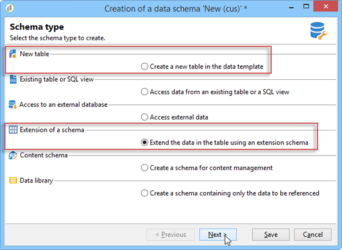
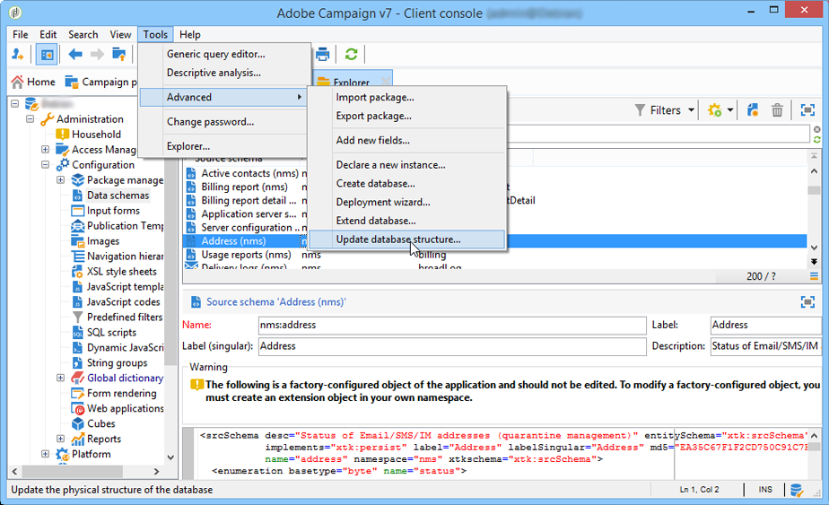

# Über die Schemabearbeitung{#about-schema-edition}

Adobe Campaign verwendet Data Schemas für:

* Definieren der Verknüpfung zwischen den Datenobjekten in der Anwendung mit den zugrunde liegenden Datenbanktabellen
* Definieren von Beziehungen zwischen den unterschiedlichen Datenobjekten in der Campaign-Anwendung
* Definieren und Beschreiben der einzelnen Felder eines jeden Objekts

Ein besseres Verständnis der integrierten Kampagnen und ihrer Interaktion finden Sie im [Campaign Classic-Datenmodell](https://helpx.adobe.com/de/campaign/kb/acc-datamodel.html).

## Erweitern oder Erstellen von Schemas {#extending-or-creating-schemas}

Um einem der Kerndaten-Schema in der Kampagne ein field- oder index- oder ein anderes Element hinzuzufügen, z. B. die Empfänger-Tabelle (nms:Empfänger), müssen Sie dieses Schema erweitern. For more on this, refer to the [Extending a schema](../../configuration/using/extending-a-schema.md) section.

Um einen völlig neuen Datentyp hinzuzufügen, der in Adobe Campaign nicht standardmäßig vorhanden ist (z. B. eine Vertragstabelle), können Sie direkt ein benutzerdefiniertes Schema erstellen. For more on this, refer to the [Data schemas](../../configuration/using/data-schemas.md) section.



Nachdem Sie ein Schema für die Verwendung erweitert oder erstellt haben, sollten Sie dessen XML-Inhaltselemente in der Reihenfolge definieren, in der sie unten aufgeführt sind.

## Auflistungen {#enumerations}

Auflistungen werden zuerst definiert, bevor das Hauptelement des Schemas liegt. Sie ermöglichen es Ihnen, Werte in einer Liste anzuzeigen, um die Auswahl zu beschränken, die der Benutzer für ein bestimmtes Feld hat.

Beispiel:

```
<enumeration basetype="byte" name="exTransactionTypeEnum" default="store">
<value label="Website" name="web" value="0"/>
<value label="Call Center" name="phone" value="1"/>
<value label="In Store" name="store" value="2"/>
</enumeration>
```

Beim Definieren von Feldern können Sie diese Auflistung wie folgt verwenden:

```
<attribute desc="Type of Transaction" label="Transaction Type" name="transactionType" 
type="string" enum="exTransactionTypeEnum"/>
```

>[!NOTE]
>
>Sie können auch benutzerverwaltete Auflistungen verwenden (normalerweise unter **[!UICONTROL Administration]** > **[!UICONTROL Plattform]** ), um die Werte für ein bestimmtes Feld anzugeben. Dabei handelt es sich um globale Auflistungen und eine bessere Wahl, wenn Ihre Auflistung außerhalb des Schemas, in dem Sie arbeiten, verwendet werden kann.

Weitere Informationen zu Auflistungen finden Sie in den Abschnitten [Auflistungen](../../configuration/using/schema-structure.md#enumerations) und [`<enumeration>` Elemente](../../configuration/using/elements-and-attributes.md#enumeration--element) .

## Index {#index}

Indizes sind die ersten im Hauptelement des Schemas deklarierten Elemente.

Sie können eindeutig sein oder nicht und auf ein oder mehrere Felder verweisen.

Beispiele:

```
<dbindex name="email" unique="true">
  <keyfield xpath="@email"/>
</dbindex>
```

```
<dbindex name="lastNameAndZip">
  <keyfield xpath="@lastName"/>
  <keyfield xpath="location/@zipCode"/>
</dbindex>
```

Das **xpath** -Attribut verweist auf das zu indexierende Feld im Schema.

>[!IMPORTANT]
>
>Es ist wichtig zu bedenken, dass die SQL-Abfrage die Leistungssteigerungen von Indizes auch mit einem Leistungsschlag beim Schreiben von Datensätzen einhergeht. Die Indizes sollten daher mit Vorsicht verwendet werden.

Weitere Informationen zu Indizes finden Sie im Abschnitt [Indizierte Felder](../../configuration/using/database-mapping.md#indexed-fields) .

## Keys {#keys}

Jede Tabelle muss über mindestens einen Schlüssel verfügen. Oft wird sie automatisch im Hauptelement des Schemas erstellt, indem das **@autopk=true** -Attribut auf &quot;true&quot;gesetzt wird.

Der Primärschlüssel kann auch mithilfe des **internen** Attributs definiert werden.

Beispiel:

```
<key name="householdId" internal="true">
  <keyfield xpath="@householdId"/>
</key>
```

In diesem Beispiel geben wir anstelle des Attributs **@autopk** einen standardmäßigen primären Schlüssel mit dem Namen &quot;id&quot;unseren eigenen primären Schlüssel &quot;budgetId&quot;an.

>[!IMPORTANT]
>
>Beim Anlegen eines neuen Schemas oder bei einer Schema-Erweiterung müssen Sie für das gesamte Schema den gleichen Wert für die Primärschlüsselfolge (@pkSequence) beibehalten.

Weitere Informationen zu Schlüsseln finden Sie im Abschnitt [Verwaltung von Schlüsseln](../../configuration/using/database-mapping.md#management-of-keys) .

## Attribute (Felder) {#attributes--fields-}

Mit Attributen können Sie die Felder definieren, aus denen Ihr Datenobjekt besteht. Sie können die Schaltfläche &quot; **[!UICONTROL Einfügen]** &quot;in der Symbolleiste &quot;Schema-Edition&quot;verwenden, um leere Attributvorlagen in Ihrer XML-Datei abzulegen, wo sich der Cursor befindet. For more on this, refer to the [Data schemas](../../configuration/using/data-schemas.md) section.


Die vollständige Liste der Attribute ist im Abschnitt [`<attribute>` Element](../../configuration/using/elements-and-attributes.md#attribute--element) verfügbar. Im Folgenden finden Sie einige der gebräuchlichsten Attribute:

* **@advanced**
* **@dataPolicy**
* **@Standard**
* **@desc**
* **@enum**
* **@expr**
* **@Titel**
* **@length**
* **@name**
* **@notNull**
* **@required**
* **@ref**
* **@xml**
* **@Typ**

   Eine Ansicht der Zuordnungen für die Datentypen, die von Adobe Campaign für die verschiedenen Datenbankverwaltungssysteme generiert wurden, finden Sie im Abschnitt [Zuordnen der Typen von Adobe Campaign-/DBMS-Daten](../../configuration/using/schema-structure.md#mapping-the-types-of-adobe-campaign-dbms-data) .

Weitere Informationen zu den einzelnen Attributen finden Sie im Abschnitt [Attributbeschreibung](../../configuration/using/elements-and-attributes.md#attribute-description) .

### Beispiele {#examples}

Beispiel für die Definition eines Standardwert:

```
<attribute name="transactionDate" label="Transaction Date" type="datetime" default="GetDate()"/>
```

Beispiel für die Verwendung eines allgemeinen Attributs als Vorlage für ein Feld, das ebenfalls als obligatorisch gekennzeichnet ist:

```
<attribute name="mobile" label="Mobile" template="nms:common:phone" required="true" />
```

Beispiel eines berechneten Felds, das mit dem Attribut **@advanced** ausgeblendet wird:

```
<attribute name="domain" label="Email domain" desc="Domain of recipient email address" expr="GetEmailDomain([@email])" advanced="true" />
```

Beispiel für ein XML-Feld, das auch in einem SQL-Feld gespeichert ist und das ein **@dataPolicy** -Attribut hat.

```
<attribute name="secondaryEmail" label="Secondary email address" length="100" xml="true" sql="true" dataPolicy="email" />
```

>[!IMPORTANT]
>
>Obwohl die meisten Attribute gemäß einer 1-1-Kardinalität mit einem physischen Feld der Datenbank verknüpft sind, ist dies bei den XML-Feldern oder den berechneten Feldern nicht der Fall.\
>Ein XML-Feld wird in einem Memofeld (&quot;mData&quot;) der Tabelle gespeichert.\
>Ein berechnetes Feld wird jedoch bei jedem Starten einer Abfrage dynamisch erstellt und ist daher nur in der Anwendungsebene vorhanden.

## Relationen {#links}

Links sind einige der letzten Elemente im Hauptelement Ihres Schemas. Sie definieren, wie alle verschiedenen Schema in Ihrer Instanz miteinander in Beziehung stehen.

Links werden in dem Schema deklariert, das den **Fremdschlüssel** der Tabelle enthält, mit der sie verknüpft sind.

Es gibt drei Arten von Kardinalität: 1-1, 1-N und N-N. Es ist der 1-N-Typ, der standardmäßig verwendet wird.

### Beispiele {#examples-1}

Beispiel für eine 1-N-Verknüpfung zwischen der Tabelle &quot;Empfänger&quot;(vordefiniertes Schema) und einer Tabelle mit benutzerdefinierten Transaktionen:

```
<element label="Recipient" name="lnkRecipient" revLink="lnkTransactions" target="nms:recipient" type="link"/>
```

Ein Beispiel für eine Verknüpfung zwischen einem benutzerspezifischen Schema &quot;Auto&quot;(im Namensraum &quot;cus&quot;) und der Tabelle &quot;Empfänger&quot;:

```
<element label="Car" name="lnkCar" revCardinality="single" revLink="recipient" target="cus:car" type="link"/>
```

Beispiel für eine externe Verknüpfung zwischen der Tabelle &quot;Empfänger&quot;und einer Tabelle mit Adressen, die auf der E-Mail-Adresse und nicht dem Primärschlüssel basiert:

```
<element name="emailInfo" label="Email Info" revLink="recipient" target="nms:address" type="link" externalJoin="true">
  <join xpath-dst="@address" xpath-src="@email"/>
</element>
```

Hier entspricht &quot;xpath-dst&quot;dem primären Schlüssel im Zielgruppe-Schema und &quot;xpath-src&quot;dem Fremdschlüssel im source-Schema.

## Audit-Protokoll {#audit-trail}

Ein nützliches Element, das Sie am Ende Ihres Schemas einbeziehen möchten, ist ein Verfolgungselement (Audit-Protokoll).

Verwenden Sie das unten stehende Beispiel, um Felder mit Bezug auf das Erstellungsdatum, den Benutzer, der die Daten erstellt hat, das Datum und den Autor der letzten Änderung für alle Daten in Ihrer Tabelle einzuschließen:

```
<element aggregate="xtk:common:auditTrail" name="auditTrail"/>
```

## Datenbankstruktur aktualisieren {#updating-the-database-structure}

Sobald Ihre Änderungen abgeschlossen und gespeichert sind, müssen alle Änderungen, die sich auf die SQL-Struktur auswirken können, auf die Datenbank angewendet werden. Verwenden Sie dazu den Datenbankaktualisierungsassistenten.



Weiterführende Informationen finden Sie im Abschnitt [Datenbankstruktur aktualisieren](../../configuration/using/updating-the-database-structure.md).

>[!NOTE]
>
>Wenn Änderungen sich nicht auf die Datenbankstruktur auswirken, müssen Sie nur Schema neu generieren. Wählen Sie dazu das/die zu aktualisierende(n) Schema(e) aus, klicken Sie mit der rechten Maustaste und wählen Sie &quot; **[!UICONTROL Aktionen&quot;> &quot;Ausgewählte Schema neu generieren&quot;.]** . For more on this, refer to the [Regenerating schemas](../../configuration/using/regenerating-schemas.md) section.

