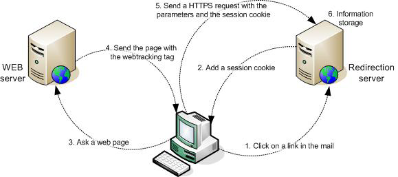

# Über Webtracking{#about-web-tracking}

Zusätzlich zum Standard-Tracking, das das Verhalten eines Internetbenutzers anzeigt, der auf einen Link in einer E-Mail-Nachricht klickt, können Sie mit der Adobe Campaign-Plattform Informationen darüber sammeln, wie Internetbenutzer Ihre Website durchsuchen. Diese Datenerfassung wird vom Webtrackingmodul durchgeführt.

Wenn ein Internetnutzer bei einem bestimmten Versand auf einen getrackten Link in einer E-Mail klickt, hinterlegt der kontaktierte Weiterleitungsserver ein Sitzungs-Cookie, das die Broadlog-Kennung (broadlogId) und die Versandkennung (deliveryId) enthält.

Der Webclient sendet dieses Cookie dann jedes Mal an den Server, wenn der Benutzer eine Seite mit einem Webtracking-Tag besucht. Dies erfolgt während der gesamten Sitzung, d. h. bis der Webclient geschlossen wird.

Der Weiterleitungs-Server erfasst auf diese Weise die folgenden Daten:

* URL der aufgerufenen Seite über eine als Parameter gesendete Kennung
* den Versand, von dem aus die Web-Seite über das Sitzungs-Cookie besucht wurde,
* Kennung des Internetnutzers, der über das Sitzungs-Cookie geklickt hat,
* Zusätzliche Informationen wie das generierte Geschäftsvolumen.

Das folgende Diagramm zeigt die Phasen des Dialogs zwischen dem Client und den verschiedenen Servern.

