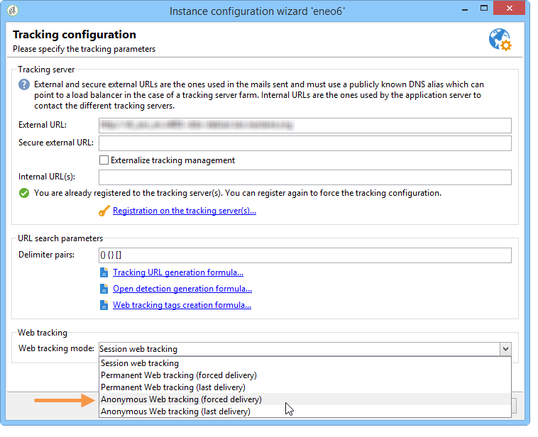

# Anonym-Tracking{#anonymous-tracking}

Mit Adobe Campaign können Sie erfasste Webtracking-Informationen mit einem Empfänger verknüpfen, wenn dieser Ihre Site anonym durchsucht. Wenn ein Benutzer die getaggten Seiten Ihrer Website durchsucht, werden diese Browserinformationen erfasst, sodass nach dem Klicken in eine per Adobe Campaign gesendete E-Mail diese automatisch identifiziert und mit den Informationen verknüpft werden.

>[!IMPORTANT]
>
>Das Einrichten eines Anonym-Trackings auf einer Website kann die Erfassung einer erheblichen Anzahl von Trackinglogs auslösen und dadurch den Datenbankvorgang beeinträchtigen. Konfigurieren Sie es mit Vorsicht.\
>Trackinglogs werden bis zum Bereinigen der Verfolgungsdaten in der Datenbank gespeichert. Konfigurieren Sie die Bereinigungshäufigkeit mithilfe des Bereitstellungsassistenten. Weiterführende Informationen hierzu finden Sie in [diesem Abschnitt](../../installation/using/deploying-an-instance.md#purging-data).

Um das anonyme Webtracking auf Ihrer Instanz zu aktivieren, müssen die folgenden Elemente konfiguriert werden:

* Der Parameter **trackWebVisitors** des **redirect** -Elements der Datei &quot; **serverConf.xml** &quot;des Tracking-Servers muss auf &quot;**true**&quot;gesetzt werden, damit ein permanentes Cookie (**uuid230**) in den Browsern unbekannter Internetbenutzer platziert wird, die die Site besuchen.
* Der **Anonyme Webtracking** -Modus muss im Anzeigebereich &quot;Verfolgungskonfiguration&quot;des Bereitstellungsassistenten ausgewählt werden.

   

* Webformulare und Umfragen müssen auf dem Tracking-Server veröffentlicht und ausgeführt werden. Die entsprechende Option muss im Bereitstellungsassistenten ausgewählt werden.

   

