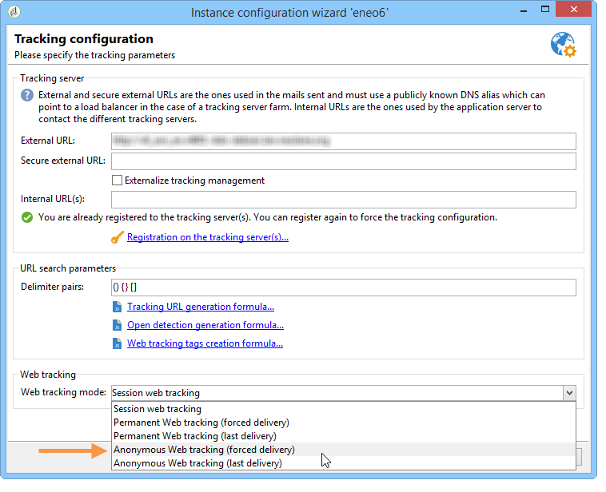
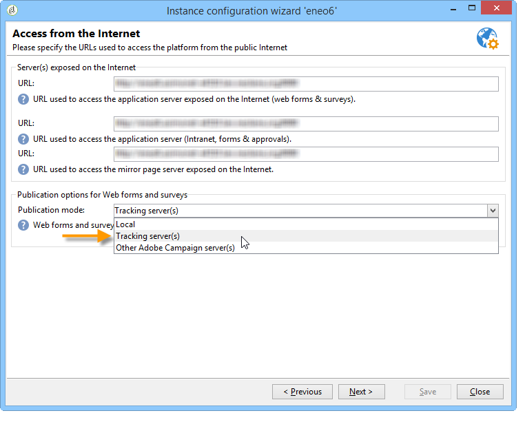

# Anonym-Tracking{#anonymous-tracking}

Mit Adobe Campaign können Sie erfasste Webtracking-Informationen mit einem Empfänger verknüpfen, wenn dieser Ihre Website anonym durchsucht. Wenn ein Benutzer die getaggten Seiten Ihrer Website durchsucht, werden diese Browserinformationen erfasst, sodass er nach dem Klicken in einer von Adobe Campaign gesendeten E-Mail identifiziert wird und die Informationen automatisch mit ihnen verknüpft werden.

>[!IMPORTANT]
>
>Durch die Einrichtung des anonymen Trackings auf einer Website kann die Erfassung einer erheblichen Anzahl von Trackinglogs in Trigger geraten, was sich auf den Datenbankbetrieb auswirken kann. Konfigurieren Sie ihn mit Vorsicht.\
>Trackinglogs werden in der Datenbank gespeichert, bis die Trackingdaten bereinigt werden. Verwenden Sie den Bereitstellungsassistenten, um die Bereinigungsfrequenz zu konfigurieren. Weiterführende Informationen hierzu finden Sie in [diesem Abschnitt](../../installation/using/deploying-an-instance.md#purging-data).

Um das anonyme Webtracking auf Ihrer Instanz zu aktivieren, müssen die folgenden Elemente konfiguriert werden:

* Der Parameter **trackWebVisitors** des **redirect**-Elements der **serverConf.xml**-Datei des Trackingservers muss auf &quot;**true**&quot; gesetzt werden, um ein permanentes Cookie (**uuid230**) in den Browsern unbekannter Internetbenutzer zu platzieren, die die Website besuchen.
* Der Modus **Anonymes Webtracking** muss im Bildschirm Tracking-Konfiguration des Bereitstellungsassistenten ausgewählt werden.

  

* Web-Formulare müssen veröffentlicht und auf dem Tracking-Server ausgeführt werden. Die entsprechende Option muss im Bereitstellungsassistenten ausgewählt werden.

  
