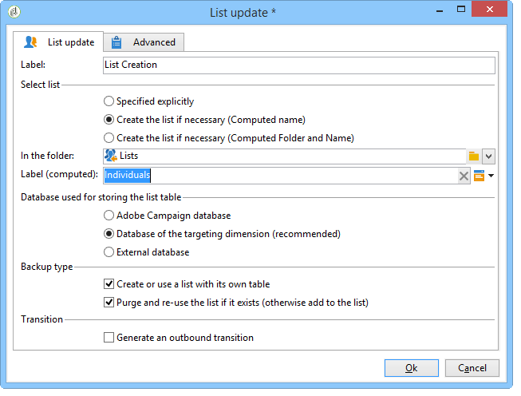

# Erstellen einer Profilliste mit einem Workflow{#creating-a-profile-list-with-a-workflow}

Um eine Liste des Typs &quot; **[!UICONTROL Liste]** &quot;basierend auf der neuen Empfänger-Tabelle zu erstellen, müssen Sie einen Targeting-Arbeitsablauf erstellen, der die Liste generiert.

Weitere Informationen zu Listen in der Kampagne finden Sie in [diesem Abschnitt](../../platform/using/creating-and-managing-lists.md#about-lists-in-adobe-campaign).

 [Mehr zu dieser Funktion erfahren Sie im Video.](../../platform/using/creating-and-managing-lists.md#create-list-in-a-wf-video).

Gehen Sie wie folgt vor, um einen Targeting-Arbeitsablauf zu erstellen und Empfänger in einer Tabelle mit benutzerdefiniertem Empfänger zu aktualisieren:

1. Wechseln Sie zum Knoten **[!UICONTROL Profile und Zielgruppen > Aufträge > Targeting Workflows]** des Explorers.
1. Erstellen Sie einen neuen Zielgruppen-Workflow.
1. Platzieren Sie eine **Abfrage** -Aktivität gefolgt von einer **Liste-Update** -Aktivität.

   

1. Klicken Sie bei Dublette auf die Aktivität **Abfrage** und dann auf Abfrage **** bearbeiten, um eine Zielgruppendimension auf Grundlage des Schemas der neuen Empfänger-Tabelle auszuwählen (in unserem Beispiel: **Individuell**). Klicken Sie zur Bestätigung auf **[!UICONTROL Beenden]**.

   

1. Klicken Sie mit der Dublette auf die Aktivität zum Aktualisieren **der** Liste und wählen Sie dann bei Bedarf das Optionsfeld Liste **[!UICONTROL erstellen (Berechneter Name)]** .

   

1. Wählen Sie den Erstellungsordner für die neue Liste aus.
1. Führen Sie den Workflow aus, um die Liste zu erstellen.
1. Ansicht des Ergebnisses in dem Knoten der Struktur, den Sie während der Aktivität zur Aktualisierung der **[!UICONTROL Liste]** ausgewählt haben.

   Das Dashboard gibt das Schema an, auf dem die Liste basiert, wie nachfolgend gezeigt:

   

